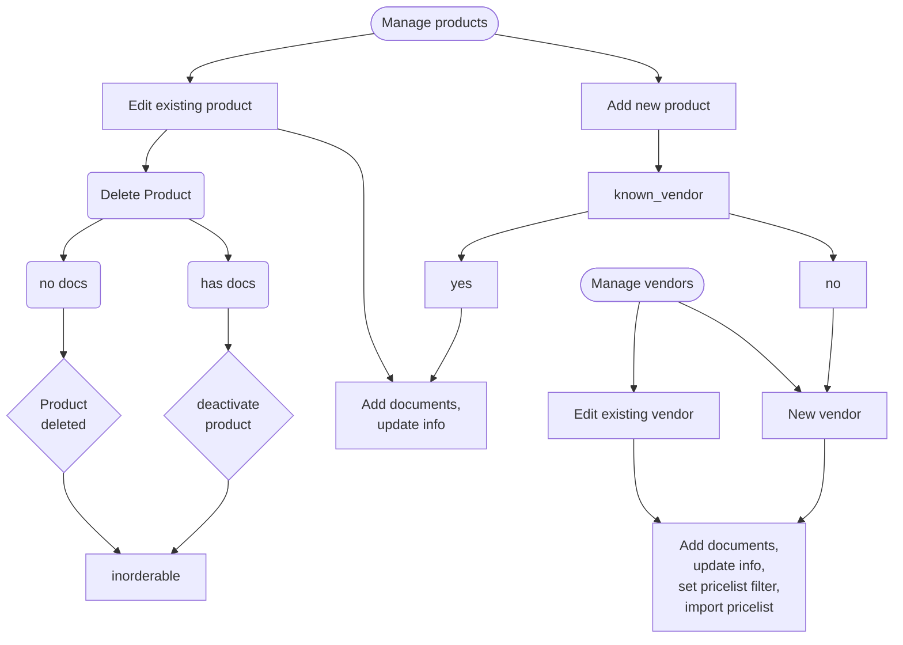

### vendor and product management ###

```mermaid
graph TD;
    manage_vendors([Manage vendors])-->edit_vendor[Edit existing vendor];
    manage_vendors-->new_vendor[New vendor];
    edit_vendor-->add_vinfo["`Add documents,
    update info,
    set pricelist filter,
    import pricelist`"];
    new_vendor-->add_vinfo;
    manage_products([Manage products])-->edit_product[Edit existing product];
    manage_products-->add_product[Add new product];
    edit_product-->add_pinfo["`Add documents,
    update info`"];
    add_product-->known_vendor;
    known_vendor-->yes;
    yes-->add_pinfo;
    known_vendor-->no;
    no-->new_vendor
    edit_product-->delete_product(Delete Product);
    delete_product-->has_doc(has docs) & no_docs(no docs);
    no_docs-->product_deleted{"`Product
    deleted`"};
    has_doc-->product_inactive{"`deactivate
    product`"}
    product_deleted-->inorderable;
    product_inactive-->inorderable
```