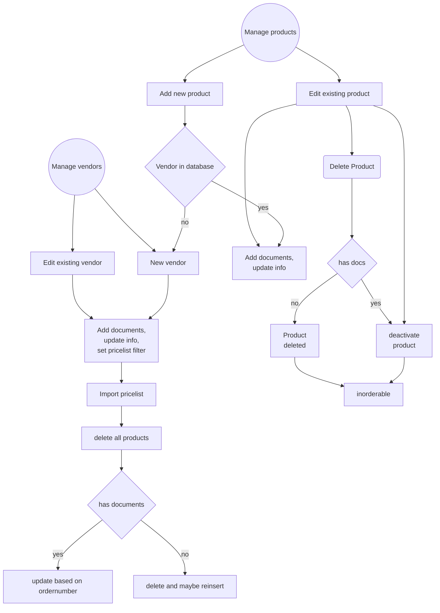
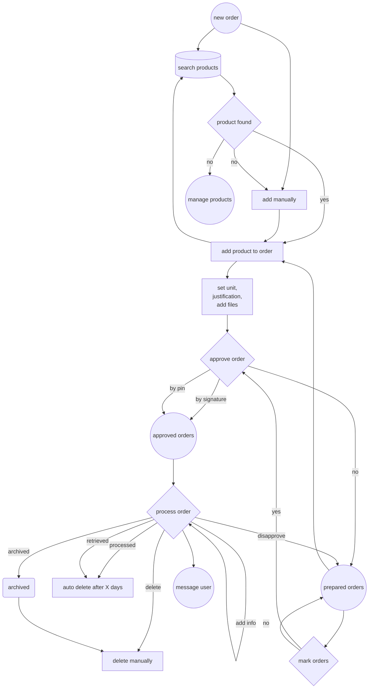

### vendor and product management ###

```mermaid
graph TD;
    manage_vendors((Manage vendors))-->edit_vendor[Edit existing vendor];
    manage_vendors-->new_vendor[New vendor];
    edit_vendor-->add_vinfo["Add documents,
    update info,
    set pricelist filter"];
    new_vendor-->add_vinfo;
    add_vinfo-->import_pricelist[Import pricelist];
    import_pricelist-->delete_all_products[delete all products];
    delete_all_products-->has_docs2{has documents};
    has_docs2-->|yes|update[update based on ordernumber];
    has_docs2-->|no|delete[delete and maybe reinsert]

    manage_products((Manage products))-->edit_product[Edit existing product];
    manage_products-->add_product[Add new product];
    edit_product-->add_pinfo["Add documents,
    update info"];
    add_product-->known_vendor;
    known_vendor{Vendor in database}-->|yes|add_pinfo;
    known_vendor-->|no|new_vendor
    edit_product-->delete_product(Delete Product);
    delete_product-->has_docs{has docs};
    has_docs-->|no|product_deleted["Product
    deleted"];
    has_docs-->|yes|product_inactive["deactivate
    product"]
    product_deleted-->inorderable;
    product_inactive-->inorderable;
    edit_product-->product_inactive;
```

### order ###

```mermaid
graph TD;
    new_order((new order))-->search_products[(search products)];
    search_products-->product_found{product found};
    product_found-->|yes|add_product[add product to order];
    new_order-->add_manually[add manually];
    product_found-->|no|add_manually;
    product_found-->|no|manage_products((manage products));
    add_manually-->add_product;
    add_product-->search_products;
    add_product-->add_info["set unit,
    justification,
    add files"];
    add_info-->approve_order{approve order};
    approve_order-->|by signature|approved_orders((approved orders));
    approve_order-->|by pin|approved_orders((approved orders));
    approve_order-->|no|prepared_orders((prepared orders));

    approved_orders-->process_order{process order};
    process_order-->|disapprove|prepared_orders;
    process_order-->|processed|auto_delete[auto delete after X days];
    process_order-->|retrieved|auto_delete;
    process_order-->|archived|archived(archived);
    process_order-->|delete|delete[delete manually];
    archived-->delete;
    process_order-->|add info|process_order;
    process_order-->message((message user))

    prepared_orders-->mark_bulk{mark orders};
    mark_bulk-->|yes|approve_order;
    mark_bulk-->|no|prepared_orders;
    prepared_orders-->add_product;
```
