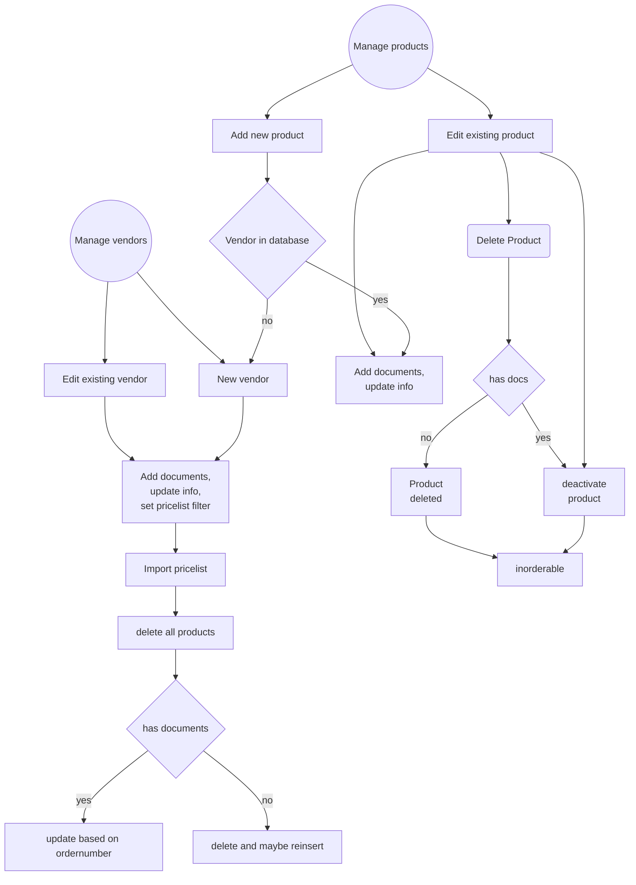

### vendor and product management ###

```mermaid
graph TD;
    manage_vendors((Manage vendors))-->edit_vendor[Edit existing vendor];
    manage_vendors-->new_vendor[New vendor];
    edit_vendor-->add_vinfo["Add documents,
    update info,
    set pricelist filter"];
    new_vendor-->add_vinfo;
    add_vinfo-->import_pricelist[Import pricelist];
    import_pricelist-->delete_all_products[delete all products];
    delete_all_products-->has_docs2{has documents};
    has_docs2-->|yes|update[update based on ordernumber];
    has_docs2-->|no|delete[delete and maybe reinsert]

    manage_products((Manage products))-->edit_product[Edit existing product];
    manage_products-->add_product[Add new product];
    edit_product-->add_pinfo["Add documents,
    update info"];
    add_product-->known_vendor;
    known_vendor{Vendor in database}-->|yes|add_pinfo;
    known_vendor-->|no|new_vendor
    edit_product-->delete_product(Delete Product);
    delete_product-->has_docs{has docs};
    has_docs-->|no|product_deleted["Product
    deleted"];
    has_docs-->|yes|product_inactive["deactivate
    product"]
    product_deleted-->inorderable;
    product_inactive-->inorderable;
    edit_product-->product_inactive;
```