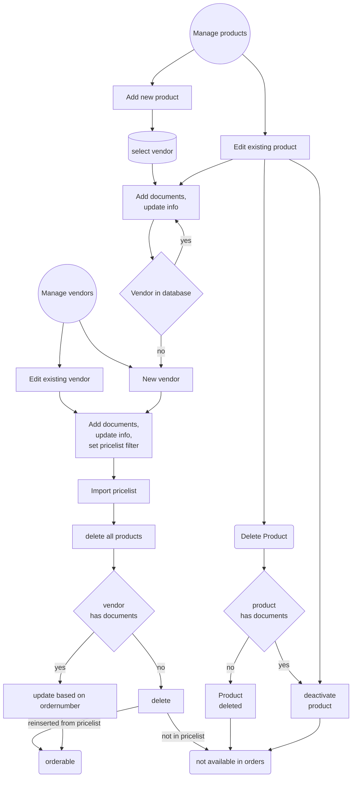
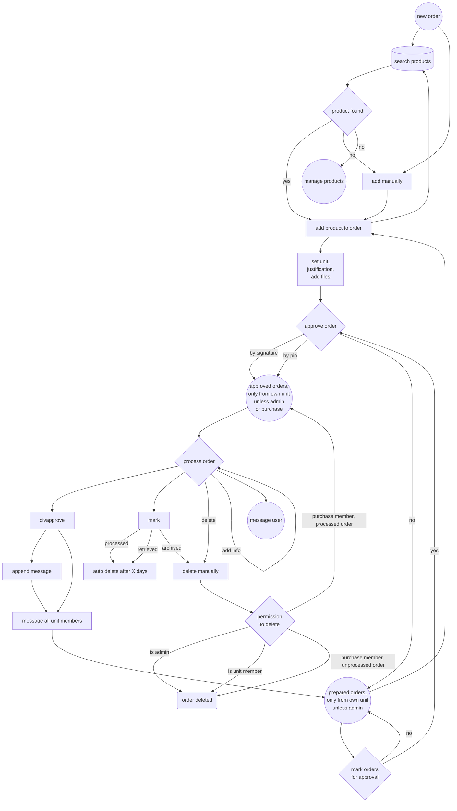
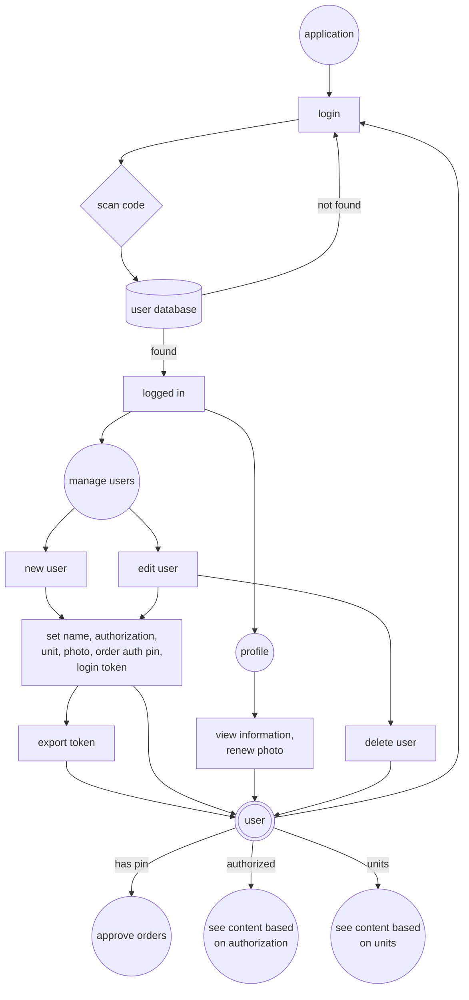

### vendor and product management ###

```mermaid
graph TD;
    manage_vendors((Manage vendors))-->edit_vendor[Edit existing vendor];
    manage_vendors-->new_vendor[New vendor];
    edit_vendor-->add_vinfo["Add documents,
    update info,
    set pricelist filter"];
    new_vendor-->add_vinfo;
    add_vinfo-->import_pricelist[Import pricelist];
    import_pricelist-->delete_all_products[delete all products];
    delete_all_products-->has_docs2{"vendor
    has documents"};
    has_docs2-->|yes|update[update based on ordernumber];
    has_docs2-->|no|delete[delete];
    delete-->|reinserted from pricelist|orderable(orderable);
    delete-->|not in pricelist|inorderable(not available in orders)
    update-->orderable;

    manage_products((Manage products))-->edit_product[Edit existing product];
    manage_products-->add_product[Add new product];
    add_product-->select_vendor[(select vendor)];
    select_vendor-->add_pinfo["Add documents,
    update info"];
    add_pinfo-->known_vendor;

    edit_product-->add_pinfo["Add documents,
    update info"];
    known_vendor{Vendor in database}-->|yes|add_pinfo;
    known_vendor-->|no|new_vendor
    edit_product-->delete_product(Delete Product);
    delete_product-->has_docs{"product
    has documents"};
    has_docs-->|no|product_deleted["Product
    deleted"];
    has_docs-->|yes|product_inactive["deactivate
    product"]
    product_deleted-->inorderable;
    product_inactive-->inorderable;
    edit_product-->product_inactive;
```

### order ###

```mermaid
graph TD;
    new_order((new order))-->search_products[(search products)];
    search_products-->product_found{product found};
    product_found-->|yes|add_product[add product to order];
    new_order-->add_manually[add manually];
    product_found-->|no|add_manually;
    product_found-->|no|manage_products((manage products));
    add_manually-->add_product;
    add_product-->search_products;
    add_product-->add_info["set unit,
    justification,
    add files"];
    add_info-->approve_order{approve order};
    approve_order-->|by signature|approved_orders(("approved orders,
    only from own unit
    unless admin
    or purchase"));
    approve_order-->|by pin|approved_orders;
    approve_order-->|no|prepared_orders(("prepared orders,
    only from own unit
    unless admin"));

    approved_orders-->process_order{process order};
    process_order-->disapprove[divapprove];
    disapprove-->append_message[append message];
    append_message-->message_unit[message all unit members];
    disapprove-->message_unit;
    message_unit-->prepared_orders
    process_order-->mark[mark];
    mark-->|processed|auto_delete[auto delete after X days];
    mark-->|retrieved|auto_delete;
    mark-->|archived|delete[delete manually];
    process_order-->|delete|delete;
    delete-->delete_permission{"permission
    to delete"};
    delete_permission-->|is admin|order_deleted(order deleted);
    delete_permission-->|is unit member|order_deleted;
    delete_permission-->|purchase member, unprocessed order|order_deleted;
    delete_permission-->|purchase member, processed order|approved_orders;
    
    process_order-->|add info|process_order;
    process_order-->message((message user))

    prepared_orders-->mark_bulk{"mark orders
    for approval"};
    mark_bulk-->|yes|approve_order;
    mark_bulk-->|no|prepared_orders;
    prepared_orders-->add_product;
```

### users ###

```mermaid
graph TD;
    application((application))-->login[login];
    login-->scan_code;
    scan_code{scan code}-->user_db[(user database)];
    user_db-->|found|logged_in[logged in];
    user_db-->|not found|login;
    logged_in-->manage_users((manage users));
    manage_users-->new_user[new user];
    manage_users-->edit_user[edit user];
    new_user-->user_settings["set name, authorization,
    unit, photo, order auth pin,
    login token"];
    edit_user-->user_settings;
    user_settings-->export_token[export token];
    export_token-->user(((user)));
    user-->login;
    user_settings-->user;

    logged_in-->own_profile((profile));
    own_profile-->profile["view information,
    renew photo"];
    profile-->user;

    edit_user-->delete_user[delete user];
    delete_user-->user;

    user-->|has pin|orders((approve orders))
    user-->|authorized|authorized(("see content based
    on authorization"))
    user-->|units|units(("see content based
    on units"))
```
