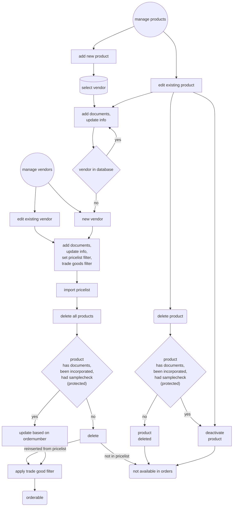
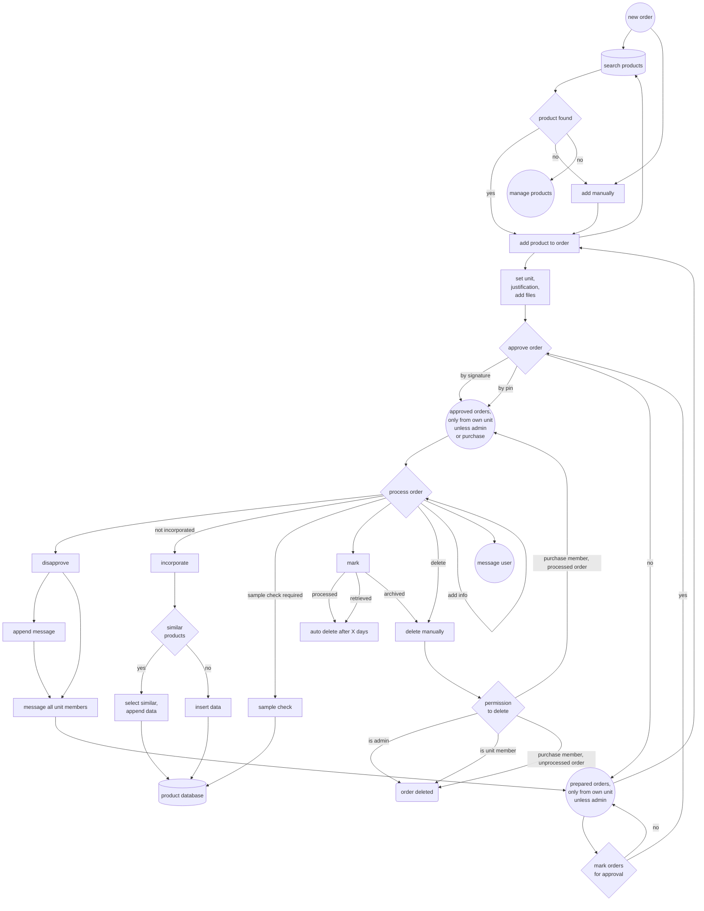
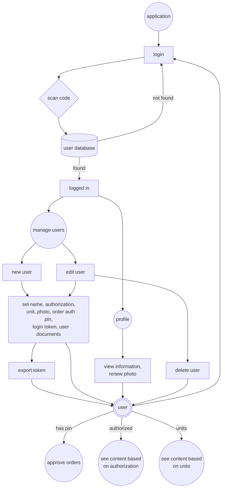
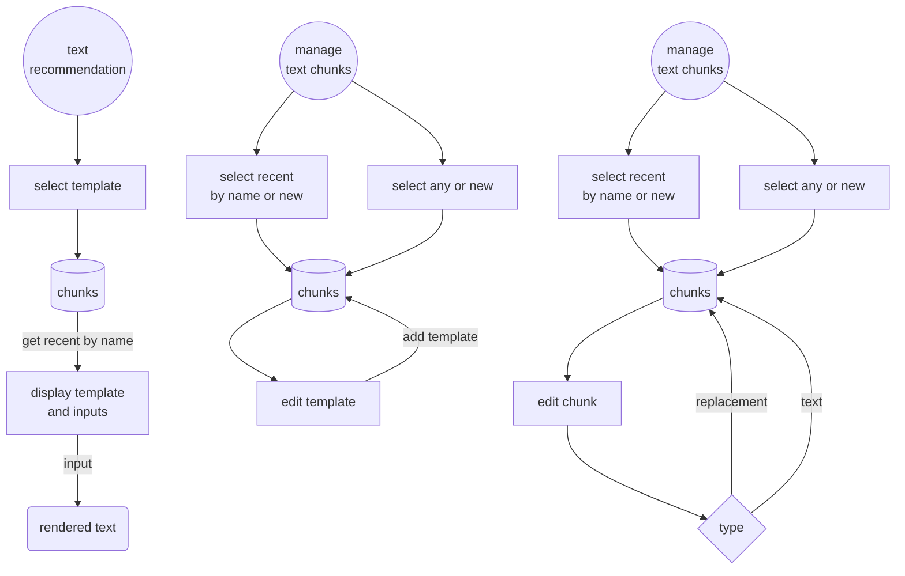
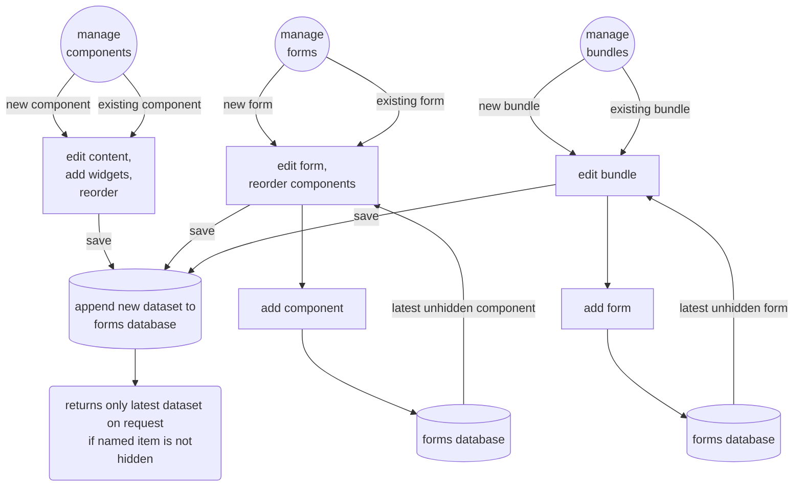
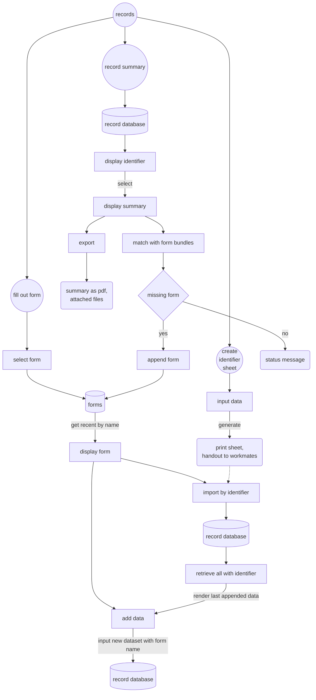

## content
* [vendor and product management](#vendor-and-product-management)
* [order](#order)
* [users](#users)
* [text recommendations](#text-recommendations)
* [forms](#forms)
* [records](#records)

### vendor and product management

[content](#content)

### order

[content](#content)

### users

[content](#content)

### text recommendations

[content](#content)

### forms ###

[content](#content)

### records ###

[content](#content)

