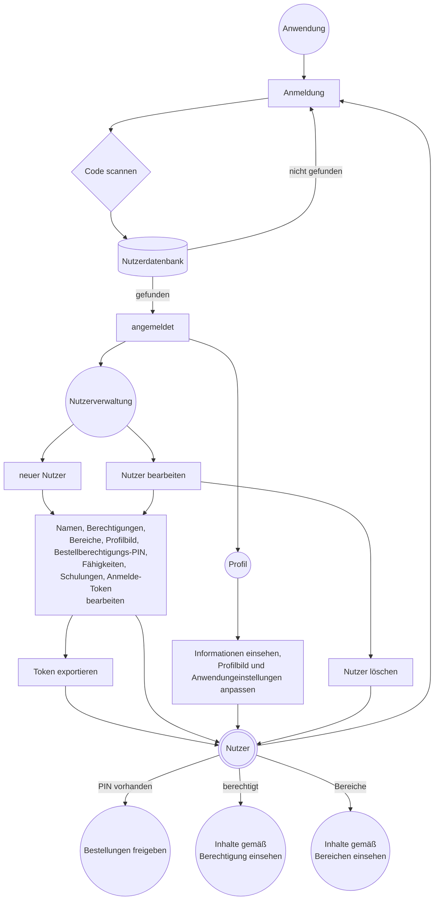
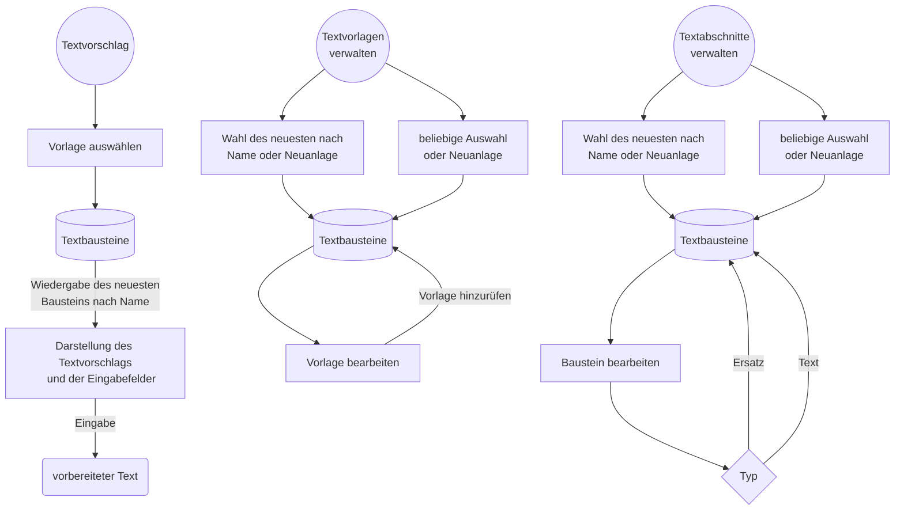
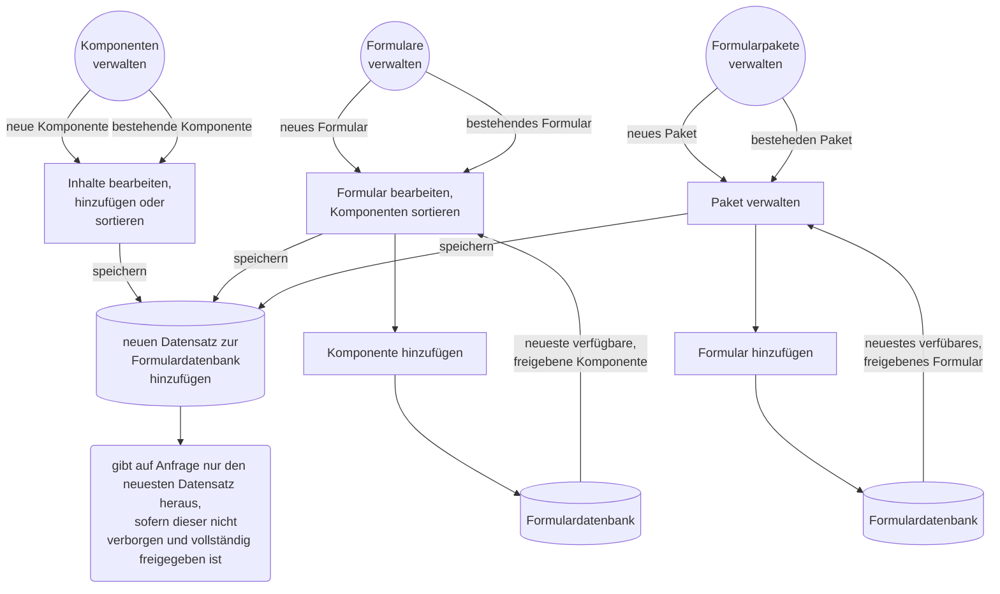
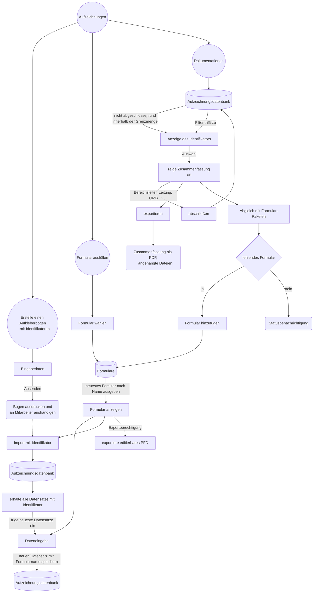
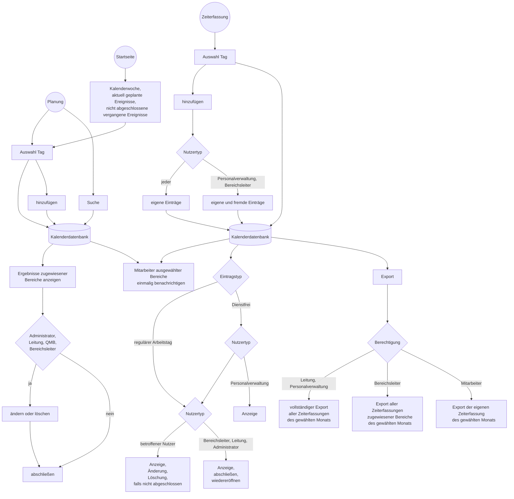
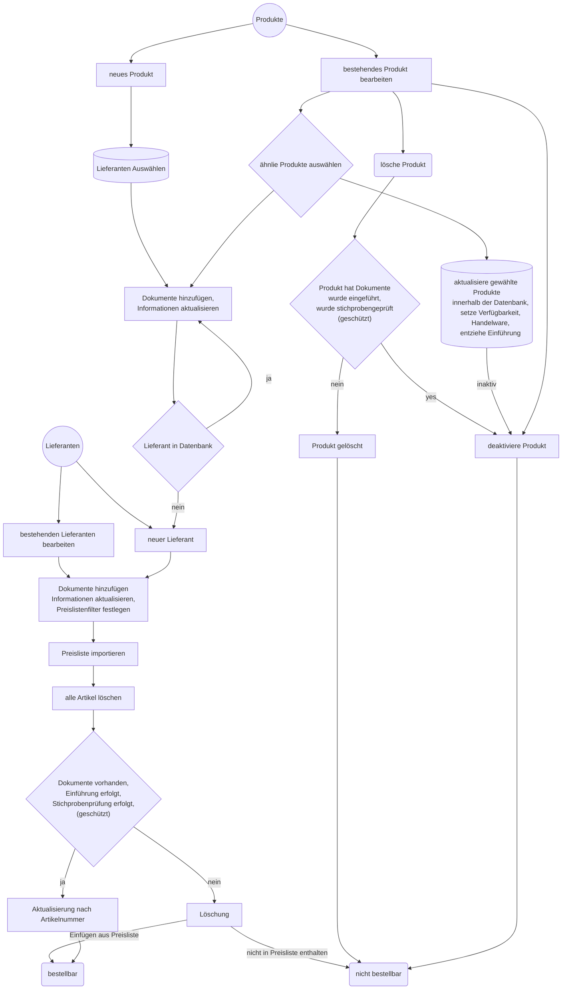
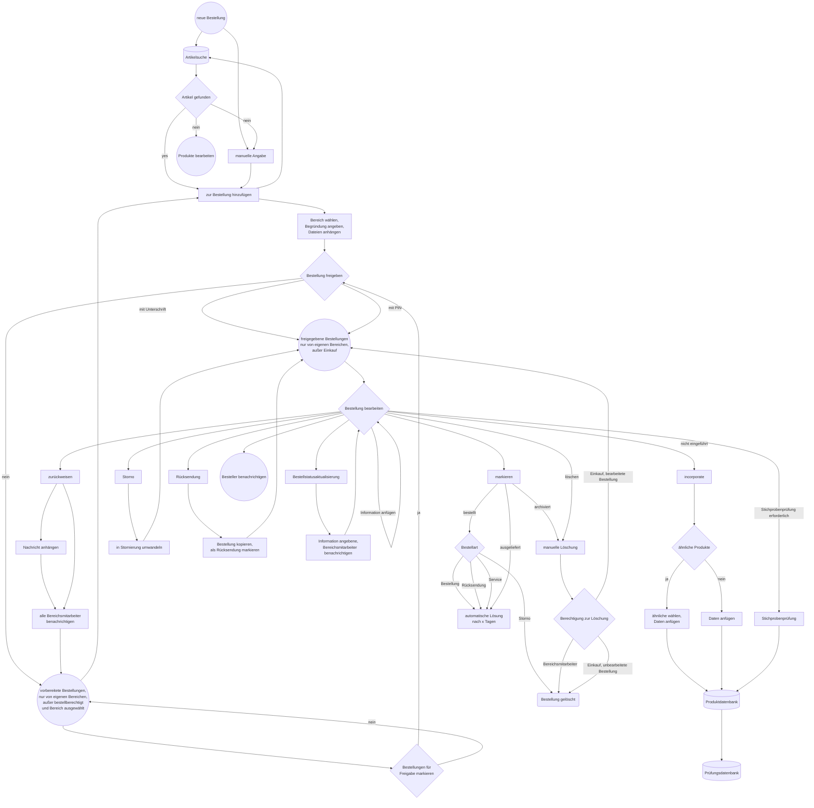

# CARO - Cloud Assisted Records and Operations

## Content
* [Ziele](#ziele)
    * [Vorgesehene Zielsetzungen für ISO 13485](#vorgesehene-zielsetzungen-für-iso-13485)
    * [Integrierte regulatorische Unterstützung](#integrierte-regulatorische-unterstützung)
    * [Extras](#extras)
    * [Erforderliche Infrastruktur](#erforderliche-infrastruktur)
    * [Was es nicht ist](#was-es-nicht-ist)
    * [Datenintegrität](#datenintegrität)
* [Empfehlungen zur Umsetzung regulatorischer Anforderungen](#empfehlungen-zur-umsetzung-regulatorischer-anforderungen)
    * [Tips](#tips)
* [Module](#module)
    * [Anwendung](#anwendung)
        * [Benutzer](#benutzer)
        * [Anleitung](#Anleitung)
    * [Kommunikation](#kommunikation)
        * [Unterhaltungen](#unterhaltungen)
        * [Verzeichnis](#verzeichnis)
        * [Textvorschläge](#textvorschläge)
    * [Aufzeichnungen](#aufzeichnungen)
        * [Formulare](#formulare)
        * [Aufzeichnungen](#aufzeichnungen-1)
        * [Risikomanagement](#risikomanagement)
    * [Kalender](#kalender)
    * [Dateien](#dateien)
    * [Einkauf](#einkauf)
        * [Lieferanten- und Artikelverwaltung](#lieferanten--und-artikelverwaltung)
        * [Bestellung](#bestellung)
    * [Werkzeuge](#werkzeuge)
* [Voraussetzungen](#voraussetzungen)
    * [Installation](#installation)
    * [Laufzeitvariablen](#laufzeitvariablen)
    * [Anmerkungen und Hinweise zur Nutzung](#anmerkungen-und-hinweise-zur-nutzung)
    * [Anpassung](#anpassung)
    * [Importierung von Lieferantenpreislisten](#importierung-von-lieferantenpreislisten)
* [Code Design Vorlagen](#code-design-vorlagen)
* [CSV Processor](#csv-prozessor)
* [API Dokumentation](#api-dokumentation)
* [Stellungnahme zu technischen Richtlinien zur Datensicherheit](#stellungnahme-zu-technischen-richtlinien-zur-datensicherheit)
* [Bibliotheken](#bibliotheken)
* [Lizenz](#lizenz)

# Ziele
Diese Anwendung möchte bei der Umsetzung eines Qualitätsmanagements nach ISO 13485 und der internen Kommunikation unterstützen. Sie wird als Web-Anwendung auf einem Server verwendet. Datensicherheitsmaßnahmen sind auf die Nutzung innerhalb eines geschlossenen Netzwerks ausgelegt; während die Anwendung technisch betrachtet auf einem beliebigen Webserver funktioniert können nicht alle Aspekte [erforderlicher Datenschutzanforderungen](#stellungnahme-zu-technischen-richtlinien-zur-datensicherheit) abgebildet werden, daher ist diese Verwendung ausdrücklich **nicht empfohlen**. Die Gestaltung ermöglicht es der Belegschaft Daten abzurufen und bereitzustellen wo andere Branchensoftware aufgrund ihrer Lizenzmodelle einschränkt.

Datenerfassung soll dabei weitestgehend digital erfolgen und letztendlich papierbasierte Dokumentationen ablösen. Es mag andere Anwendungen mit dem gleichen Ziel geben, diese verfolgen jedoch einen anderen Grundgedanken - die Verwaltung von Reha-Hilfsmitteln anstelle von Sonderanfertigungen, einem Fokus auf orthopädische Schuhversorgungen oder einer primären Produktivitätsüberwachung - anstelle dem primären Dokumentationsgedanken der CARO App. Ganz zu schweigen von unübersichtlichen Nutzeroberflächen, die ebenfalls das Ziel einer leicht verständlichen und einfachen Oberfläche steckten.


## Vorgesehene Zielsetzungen für ISO 13485
* ISO 13485 4.1.2 Risikobasierter Ansatz
    * Die Anwendung hat ein Modul für die Risikoanalyse um Risken zu erfassen, zu bewerten und Maßnahmen zu beschreiben.
    * siehe [Risikomanagement](#risikomanagement)
* ISO 13485 4.2.3 Medizinproduktakte
    * Alle Aufzeichnungen für Versorgungen laufen zusammen. Exporte beinhalten diese Daten und erreichen damit eine vollständige Dokumentation der Maßnahmen.
    * Aufzeichnungen für Versorgungen erfordern einen Identifikator um eine Zuordnung sicherzustellen.
    * siehe [Aufzeichnungen](#aufzeichnungen)
* ISO 13485 4.2.4 Lenkung von Dokumenten
    * Die Anwendung ermöglicht es wiederverwendbare Formulare und deren Komponenten zu gestalten.
    * Nur die jüngsten freigegebenen Komponenten und Formulare sind für Nutzer erreichbar [so lange eine Netzwerkverbindung besteht](#handhabe-der-netzverkverbindung).
    * Die Erstellung von Komponenten, Formularen, Formular-Paketen und Textvorschlägen ist nur berechtigten Nutzern vorbehalten.
    * Formulare und deren Komponenten müssen von [berechtigten Nutzern](#benutzer) freigegeben werden. Die jeweiligen Nutzergruppen werden mit dem Speichern neuer Elemente vom System benachrichtigt. Jedes Mitglied der Gruppen kann die Freigabe erteilen, da davon ausgegangen wird, dass sich diese ihrer Verantwortung bewusst sind. Eine nutzerspezifische Zuordnung wird hinsichtlich einer Wiederverwendung von Elementen vermieden. Nicht freigegebene Komponenten werden nicht angezeigt, selbst wenn das Formular selbst freigegeben wurde.
    * Neue Formulare, deren Komponenten, Formular-Pakete und Textvorschläge werden als neuer Eintrag in die Datenbank gelegt. Jeder Eintrag erhält dabei einen Zeitstempel und die Angabe des erstellenden Nutzers. Innerhalb der jeweiligen Verwaltung wird primär eine der jüngsten freigegebenen Versionen ausgewählt. Eine erweiterte Auswahl ermöglicht aber den Zugriff auf eine beliebige vorherige Version. Komponenten und Formulare können nach einer vollständigen Freigabe nicht mehr gelöscht werden. Nicht freigegebene Komponenten und Formulare sind für eine Verwendung nicht erreichbar.
    * Bilder für Komponenten können nach einer Freigabe nicht mehr gelöscht werden. Ihrem Dateinamen wird der Name der Komponenten und ein Zeitstempel beigefügt. Sie sind dauerhaft auch für ältere Versionen verfügbar, können aber nicht wiederverwendet werden, da sie fester Bestandteil der jeweiligen Komponente sind.
    * Formulare können primär nur von berechtigten Nutzern exportiert werden um eine Verbreitung veralteter Versionsstände zu vermeiden. Ersteller der Formulare können jedoch eine allgemeine Erlaubnis erteilen.
    * Externe Dokumente werden gelenkt und erhalten die Angabe der Einrichtung, des regulatorischen Zusammenhangs, einer möglichen Außerbetriebnahme und dem jeweils letzten bearbeitenden Mitarbeiter.
    * siehe [Formulare](#formulare), [Dateien](#dateien)
* ISO 13485 4.2.5 Lenkung von Aufzeichnungen
    * Aufzeichnungen laufen zusammen und sind innerhalb der Anwendung nicht löschbar. Jeder Eintrag erhält einen Zeitstempel und den Namen des Nutzers. Zusammenfassungen führen alle Daten zusammen und stellen sie in der Reihenfolge ihrer Übermittlung dar.
    * Bilder und Dateien für Aufzeichnungen werden nicht gelöscht. Ihren Dateinamen wird der Identifikator und Zeitstempel der Übermittlung beigefügt.
    * Aufzeichnungen können jederzeit exportiert werden falls eine zusätzliche Revisionssicherheit gewünscht wird oder die Daten mit dritten Parteien geteilt werden müssen.
    * Der Zugriff auf die Inhalte der Anwendung inclusive vertraulicher personenbezogener Patientendaten erfordert eine persönliche Anmeldung registrierter Nutzer.
    * siehe [Benutzer](#benutzer), [Aufzeichnungen](#aufzeichnungen)
* ISO 13485 5.5.1 Verantwortung und Befugnis
    * Nutzern werden [Berechtigungen](#benutzer) erteilt, die den Zugriff einschränken und das Menü vereinfachen.
    * Berechtigungen definieren den Zugriff auf Funktionen der Anwendung.
    * Nutzer können eine Bestellberechtigungs-PIN erhalten um Bestellungen freizugeben.
    * Das Nutzerverzeichnis listet alle Nutzer auch gruppiert nach organisatorischen Bereichen und Berechtigungen auf.
    * siehe [Benutzer](#benutzer), [Verzeichnis](#verzeichnis), [Laufzeitvariablen](#laufzeitvariablen)
* ISO 13485 5.5.3 Interne Kommunikation
    * Die Anwendung hat einen internen [Nachrichtendienst](#unterhaltungen). Dieser Dienst wird von internen Modulen genutzt um eine zielführende Datenübermittlung sicherzustellen, z.B. für
        * die Benachrichtigung von Nutzergruppen für die Freigabe von Formularen und deren Komponenten
        * die Benachrichtigung von Nutzergruppen über zurückgewiesene Bestellungen und geänderten Bestellstati
        * Benachrichtigungen zu zusätzlich erforderlichen Rechechen zu einer Bestellung an den Besteller
        * Benachrichtigung von Nutzergruppen zu geplanten Ereignissen
    * Die Anwendung hat einen integrierten Kalender. Dieser soll die Aufgabenplanung und Bearbeitung zeitkritischer wiederkehrender Ereignisse wie Kalibrationsmaßnahmen und dergleichen unterstützen.
    * Die Anwendung hat ein Bestellmodul. Bestellungen können vorbereitet und freigegeben werden. Der Einkauf hat alle erforderlichen Daten aus der Lieferantenpreisliste vorliegen um die Bestellung bearbeiten zu können; die Markierung des Bestellstatus erlaubt eine zeitnahe Rückmeldung an den Besteller.
    * Die Anwendung hat einen Sharepoint für Dateien und einen STL-Betrachter für 3D-Modelle um einfach Informationen austauschen zu können, die die Möglichkeiten des Nachrichtendienstes übersteigen.
    * Die Oberfläche informiert über neue Nachrichten, freigegebene neue Bestellungen (Einkauf) und unerledigte Kalenderereignisse. Die Startseite zeigt zudem eine kurze Zusammenfassung offender Versorgungsfälle und geplanter Ereignisse der aktuellen Kalenderwoche sowie unerledigter Ereignisse.
    * Formulare können auf andere Formulare verweisen. Dabei können diese nur angezeigt werden (z.B. Verfahrens- oder Arbeitsanweisungen) oder mit Übernahme des Identifikators für einen reibungslosen Transfer sorgen.
    * siehe [Unterhaltungen](#unterhaltungen), [Kalender](#kalender), [Bestellung](#bestellung), [Dateien](#dateien), [Werkzeuge](#werkzeuge)
* ISO 13485 6.2 Personelle Ressourcen
    * innerhalb der Nutzerverwaltung können Schulungen, deren Ablaufdaten, Erfahrungspunkte und anhängende Dokumente hinzugefügt werden.
    * Nutzern können Fähigkeiten und deren Niveau gemäß der bestimmten für das Unternehmen [erforderlichen Fähigkeiten](#anpassung) (Aufgabenmatrix) zugeordnet werden.
    * Eine Übersicht über die Schulungen und Fähigkeiten ist im Audit-Modul einsehbar.
    * Fähigkeiten und Schulungen können von berechtigen Nutzern gelöscht werden. Die Übersicht kann im Audit-Modul exportiert werden.
    * siehe [Benutzer](#benutzer), [Anpassung](#anpassung), [Werkzeuge](#werkzeuge)
* ISO 13485 7.4.1 Beschaffungsprozess
    * Die Beschaffung wird durch die Anwendung begleitet. Lieferanten und Produkte können zur Datenbank hinzugefügt werden.
    * Lieferanteneinträge können durch Dokumente, Zertifikate und deren Gültigkeitsdaten ergänzt werden. Die Gültigkeit von Zertifikaten können angezeigt und im Audit-Modul exportiert werden. Lieferanten können als inaktiv markiert, jedoch nicht gelöscht werden. Produkte, die deaktiviert werden sind über das Bestellmodul nicht erreichbar.
    * Produkte können mit Dokumenten ergänzt werden, welche nicht gelöscht werden. Den Dateinamen werden der Lieferantenname, der Zeitstempel der Übermittlung und die Artikelnummer angefügt.
    * Produkte sollen eingeführt werden. Produkteinführungen können durch berechtigte Nutzer freigegeben, entzogen oder zurückgesetzt werden. Alle Nutzer (außer Gruppen) sammeln zuvor die erforderlichen Informationen. Produkteinführungen werden durch eigene Formulare mit dem entsprechenden Kontext umgesetzt.
    * Produkte werden im Falle einer Presilistenaktualisierung automatisch gelöscht, es sei denn
        * es fand eine Produkteinführung statt
        * es wurde eine Stichprobenprüfung durchgeführt
        * es wurde ein Dokument beigefügt
        * es wurde ein Alias festgelegt
    * Änderungen an Produkteinträgen ist nur für berechtigte Nutzer möglich
    * Eine Lieferantenbewertung wird durch die Bereitstellung von reduzierten Daten der Bestellungen in Bezug auf Lieferzeiten, Stornos und Rücksendungen im Audit-Modul unterstützt.
    * siehe [Lieferanten- und Artikelverwaltung](#lieferanten--und-artikelverwaltung), [Bestellung](#bestellung), [Werkzeuge](#werkzeuge)
* ISO 13485 7.4.3 Verifizierung von beschafften Produkten
    * Die Stichprobenprüfung nach MDR §14 erbittet eine Prüfung für jedes [als Handelsware definierte](#importierung-von-lieferantenpreislisten) Produkt, sofern die letzte zurückliegende Prüfung innerhalb des Sortiments dieses Lieferanten die mdr14_sample_interval-Zeitspanne überschreitet, z.B. einmal jährlich. Dies betrifft alle Produkte welche nicht innerhalb der mdr14_sample_reusable-Zeitspanne liegen, welche ebenfalls für jeden Lieferanten individuell festgelegt werden kann, wenn es das Sortiment erfordert. Beide Werte erhalten durch die setup.ini einen Standardwert.
    * Stichprobenprüfungen werden durch eigene Formulare mit dem entsprechenden Kontext umgesetzt. Alle Nutzer (außer Gruppen) sammeln die erforderlichen Informationen.
    * Stichprobenprüfungen können durch berechtigte Nutzer zurückgezogen werden.
    * siehe [Lieferanten- und Artikelverwaltung](#lieferanten--und-artikelverwaltung), [Bestellung](#bestellung)
* ISO 13485 7.5.1 Lenkung der Produktion und Dienstleistungserbringung
    * Entsprechende Formulare zeichnen die Schritte der Fertigung auf. Mit dem Zugriff auf die Aufzeichnungen ist der aktuelle Status erkennbar. Ist beispielsweise eine Aufzeichnung für einen Fertigungsabschnitt vorhanden, bei dem die Arbeitsschritte festgelegt werden, kann das Formular auch ein Auswahlfeld für die Erledigung beinhalten. In einem ersten Dokumentationsschritt können die Schritte festgelegt werden, in einem folgenden kann das Formular erneut verwendet und das Auswahlfeld markiert werden. Damit wird der Zeitpunkt und eintragende Nutzer aufgezeichnet.
    * Formular-Kontexte erlauben eine Zuordnung als Verfahrens- oder Arbeitsanweisungen.
    * Der integrierte Kalender unterstützt bei der Planung von Arbeiten.
    * siehe [Formulare](#formulare), [Aufzeichnungen](#aufzeichnungen-1), [Kalender](#kalender)
* ISO 13485 7.5.8 Identifizierung
    * Aufzeichnungen erfordern einen Identifikator. Dieser Identifikator ist derzeit als QR-Code implementiert, welcher exportiert und ausgedruckt, sowie mit dem integrierten Scanner ausgelesen werden kann. Aufkleberbögen mit dem Code können auch zur Kennzeichnung von Produkten und Komponenten während der Herstellung verwendet werden.
    * siehe [Aufzeichnungen](#aufzeichnungen-1)
* ISO 13485 7.6 Lenkung von Überwachungs- und Messmitteln
    * Entsprechende Formulare erfordern einen Identifikator, ähnlich Versorgungsdokumentationen. Messmittel können ebenfalls einen individuellen Identifikator zugetreilt bekommen.
    * Eine Berücksichtigung eines Kalendereintragt innerhalb dieser Formulare kann dabei unterstützen zukünftige Ereignisse zu planen und Mitarbeiter zu informieren.
* ISO 13485 8.2.4 Internes Audit
    * Das Audit-Modul sammelt Daten aus der Anwendung und ist in der Lage Exporte zur Verfügung zu stellen für
        * Aufzeichnungen über Produkteinführungen. Sofern aktuell bestellte Artikel nicht berücksichtigt sind erfolgt ein Hinweis.
        * Aufzeichnungen über Stichprobenprüfungen. Sofern aktuell Lieferanten für eine Prüfung fällig sind erfolgt ein Hinweis.
        * eine Übersicht über die aktuell gültigen Formulare und deren Komponenten.
        * Fähigkeiten und Schulungen der Mitarbeiter mit ggf. markierten abgelaufenen Zertifikaten
        * Lieferantenlisten mit den jeweiligen letzten Preislistenaktualisierungen, der letzten Stichprobenprüfung und Details zu Zertifikaten sofern bereitgestellt.
        * die Berücksichtung regulatorischer Anforderungen durch verwendete Formulare und Dokumente
    * siehe [Werkzeuge](#werkzeuge)
* ISO 13485 8.4 Datenanalyse
    * Eine Lieferantenbewertung wird durch die Bereitstellung von reduzierten Daten der Bestellungen in Bezug auf Lieferzeiten, Stornos und Rücksendungen im Audit-Modul unterstützt. Es besteht jedoch ein individueller Interpretationsspielraum der bereitgestellten Daten.
    * siehe [Bestellung](#bestellung), [Werkzeuge](#werkzeuge)

[Content](#content)

## Integrierte regulatorische Unterstützung
* MPDG §83
    * Medizinprodukteberater werden durch die entsprechende Berechtigung in den Nutzereinstellungen festgelegt und als solche im Verzeichnis angezeigt.
    * siehe [Benutzer](#benutzer)
* ISO 14971 Anwendung des Risikomanagements auf Medizinprodukte
    * Die Anwendung hat ein Modul für die Risikoanalyse um Risken zu erfassen, zu bewerten und Maßnahmen zu beschreiben.
    * Anhang E ist für die Nutzung standardmäßig verbereitet.
    * siehe [Risikomanagement](#risikomanagement) 

[Content](#content)

## Extras
* Textempfehlungen
    * Standard- und anpassbare [Textvorschläge](#textvorschläge) können definiert werden um eine durchgängige Sprachregelung zu unterstützen.
* Zeiterfassung
    * Registrierte Nutzer können ihre Arbeitszeiten, Urlaube, Krankheitsausfälle, etc. in den [Kalender](#kalender) eintragen. Die Einträge können unter Berücksichtigung con Arbeitszeitgesetzen exportiert werden.
* Dateiverteilung
    * Die Anwendung hat einen [Sharepoint](#dateien) für Dateien und einen [STL-Betrachter](#werkzeuge) um vereinfacht Informationen austauschen zu können.
* CSV-Filterung
    * Die Anwendung ist in der Lage CSV-Dateien auf vielfältige Weite zu [filtern und zu verarbeiten](#csv-prozessor).

[Content](#content)

## Erforderliche Infrastruktur 
Es wird ein Server zur Speicherung und Verarbeitung der Web-Anwendung, sowie Netzwerkzugriff für alle Endgeräte benötigt. Die Anwendung ist dafür ausgelegt primär auf mobilen Geräten wie beispielsweise Android-Tablets oder iPads genutzt zu werden, kann aber auch auf Desktop-Computern genutzt werden. Manche Funktionen wie die Erstellung von Formularen oder Textvorschlägen sind primär nur auf Desktop-Computern mit Maus-Eingabegeräten möglich.

Das oberste Ziel ist die Ausstattung der Belegschaft oder zumindest von Schlüsselpositionen und Arbeitsplätzen mit mobilen Geräten. Schließlich kann die Administration nicht nach Digitalisierung verlangen ohne eine geeignete Infrastruktur zur Verfügung zu stellen. Scanner sind optional, da Scannen ebensogut mit in den Geräten eingebauten Kameras umgesetzt werden kann.

Für technische Details siehe [Voraussetzungen](#voraussetzungen).

## Was es nicht ist
Abgesehen von einigen architektonische Entscheidungen ist die Anwendung kein voreingestelltes Qualitätsmanagementsystem. Prozesse, Dokumente und Verantwortlichkeiten sind selbst zu bestimmen. Die Anwendung soll lediglich dabei unterstützen strukturierte Abläufe und eine halbautomatisierte Erfüllung regulatorischer Anforderungen sicherzustellen. *Berechtigungen in den Flussdiagrammen stellen unverbindliche Standardeinstellungen dar.*

Die Anwendung ersetzt kein ERP-System. Daten für den Einkauf sind nur innerhalb der Oberfläche auf Basis der eigenen Datenbank möglich. Diese bewusste Entscheidung richtet sich gegen aufgeblähte Artikelstammdaten von ERP-Systemen derer kaum Herr zu werden möglich ist und die stets eine geschlossene Benutzeroberfläche erfordern. Die Produktdatenbank kann durch Preislisten der Lieferanten bestückt und dabei von vorneherein regelhaft um unwichtige Daten bereinigt werden.

Bestellungen können von berechtigen Nutzern und Mitgliedern der bestellenden Bereiche jederzeit und zudem nach Ablauf einer definierten Zeit nach Auslieferung gelöscht werden. Dieses Modul dient in erster Linie der internen Kommunikation und nicht einer dauerhaften Dokumentation.

## Datenintegrität
Aufzeichnungen speichern stets den Namen des übermittelnden Nutzers ab. Gruppen-Nutzer sind daher nicht empfohlen, jedoch mit eingeschränkten Berechtigungen möglich. Individuelle Nutzer sind indes vorgesehen. Berechtigte Nutzer können andere Nutzer anlegen, bearbeiten und löschen. Zur Vereinfachung wird ein 64 Byte Token erstellt. Dieser Token wird in einen QR-Code umgewandelt, welcher bei der Anmeldung gescannt werden kann. Dadurch muss sich kein Nutzername und Kennwort gemerkt werden und es kann auf die Eingabe mehrerer Felder bei der Anmeldung verzichtet werden. Dieser Vorgang ist daher schnell umsetzbar und erlaubt einen raschen Wechsel zwischen unterschiedlichen Anmeldungen bei eingeschränkter Verfügbarkeit von Endgeräten.

Formulardaten und Serveranfragen beinhaltet teilweise IDs um spezifische Inhalte zu erreichen. Technisch gesehen ist es möglich diese Daten und Anfragen zu manipulieren. Dennoch wird dieses Vorgehen als angemessen bewertet, da Serververarbeitungen nicht in der Lage sind auf die ursprüngliche Intention zu schließen. Dies erscheint nicht weniger sicher als eine beabsichtige Falschangabe in einer beliebige papierbasierten Doumentation.

Formulare können ein digitales Unterschriftenfeld beinhalten. Dabei ist zu beachten, dass es sich hierbei mangels Zertifizierung nicht um ein dokumentenechtes Verfahren handelt. Ob das Verfahren innerhalb festgelegter Prozesse angemessen ist, ist eine persönliche Ermessenssache.

[Content](#content)

## Empfehlungen zur Umsetzung regulatorischer Anforderungen
Abgesehen von der Anwendungsarchitektur muss das Qualitätsmanagementsystem selbst aufgestellt werden. Die meisten regulatorischen Anforderungen werden durch Formulare erfüllt. Auf diese Weise wird eine zuverlässige Versionskontrolle und Freigabe, sowie eine Prüfung der Erfüllung der Anforderungen innerhalb des [Audit-Moduls](#werkzeuge) sichergestellt.
* Es können Formulare für die Beschreibung von Prozessen erstellt werden und mit dem Kontext *Verfahrens- oder Arbeitsanweisung* und passendem regulatorischen Zusammenhang versehen werden.
    * ISO 13485 alle Kapitel sollten berücksichtigt werden
    * Es kann auf diese Dokumentation und die oben genannten [Ziele](#ziele) verwiesen werden.
* Es können Formulare erstellt werden die ebenfalls für eine schriftliche Form exportierbar sind und mit dem Kontext *Allgemeine Dokumentation* und passendem regulatorischen Zusammenhang versehen werden.
    * ISO 13485 4.1.5
* Es können Formulare erstellt und mit dem Kontext *Allgemeine Dokumentation* und passendem regulatorischen Zusammenhang versehen werden.
    * Alle allgemeinen Aufzeichnungen besonders aber nicht beschränkt auf:
    * ISO 13485 6.2
    * ISO 13485 6.3
    * ISO 13485 8.2, 8.2.3, 8.2.4
    * Ausbildungsverordnungen
* Es können Formulare erstellt und mit dem Kontext *Vorkommnis* und passendem regulatorischen Zusammenhang versehen werden.
    * ISO 13485 8.2.3
* Es können Formulare erstellt und mit dem Kontext *Vorgangsdokumentation* und passendem regulatorischen Zusammenhang versehen werden.
    * ISO 13485 7.2, 7.2.1
    * ISO 13485 7.3, 7.3.3, 7.3.4, 7.3.5, 7.3.6, 7.3.7, 7.3.8, 7.3.9, 7.3.10
    * ISO 13483 7.5, 7.5.1, 7.5.3, 7.5.4, 7.5.6
    * Datenschutzhinweise
    * SGB 5 §33
    * MDR annex 1
    * MDR annex 6
    * MDR annex 7
    * MDR annex 13
Es können Formulare erstellt und mit dem Kontext *MDR §14 Stichprobenprüfung* und/oder *Produkteinführung* und passendem regulatorischen Zusammenhang versehen werden.
    * ISO 13485 7.4, 7.4.3
Es können Formulare erstellt und mit dem Kontext *Überwachung von Arbeitsmitteln* und passendem regulatorischen Zusammenhang versehen werden.
    * Computer Software und deren Versionsaufzeichnungen können ebenfalls als Arbeitsmittel betrachtet werden.
    * ISO 13485 4.1.6, 7.6
    * MPBetreibV

### Tips
* Ein Kalender-Element kann in die Überwachungs-Formulare eingebunden werden um während der Bearbeitung direkt das nächste Fälligkeitdatum festzulegen.
* Die Option einer "Großväterregelung" in der Produkteinführung kann insbesondere beim Übergang von einem anderen Qualitätsmanagementsystem in die CARO App die Dinge vereinfachen. Es muss dabei aber sichergestellt sein, dass die Anforderungen zuvor wirklich erfüllt wurden.
* Wenn die Branchensoftware in der Lage ist Barcodes für Waren zu erzeugen, können Mehrfach-Scannerfelder innerhalb der Vorgangsdokumentation eine Rückverfolgung unterstützen.
* Der Liste der gewünschten Fähigkeiten sollen die für das Unternehmen angemessenen Punkte [hinzugefügt](#anpassung) werden um eine zielführende Übersicht über die Erfüllung zu ermöglichen.
* Innerhalb der Formulare für die Vorkommnisaufzeichnungen können Links z.B. zu den [IMDRF Adverse Event Terminology Web Browsers](https://www.imdrf.org/working-groups/adverse-event-terminology) eingefügt werden um die erforderlichen Codes zu finden.


[Content](#content)

# Module

## Anwendung


### Benutzer
Bei der Registrierung eines neuen Nutzers wird ein Standard-Profilbild erstellt. Individuelle Profilbilder können mit diesem Bild wieder ersetzt werden. Eine automatisch generierte PIN kann als Berechtigung für die Freigabe von Bestellungen verwendet werden. Das Hinzufügen von Schulungen ist nur für berechtigte Nutzer möglich um sicherzustellen, dass Schulungen bekannt und nicht übersehen werden. Fähigkeiten können gemäß der [geplanten Liste](#anpassung) angepasst werden. Der erstellte Anmeldung-Token kann exportiert und beispielweise als laminierte Karte verwendet werden.

Nutzer können im Sinne der Transparenz alle persönlichen Informationen in ihrem Profil einsehen. Eine Änderung des Profilbilds und individuelle Anwendungeinstellungen können an dieser Stelle ebenfalls vorgenommen werden.

Die Anwendung stellt ein zugeordnetes Rollen-Management für registrierte Nutzer zur Verfügung. Der gesamte Inhalt ist nur für angemeldete Nutzer zugänglich. Nutzer können unterschiedliche Berechtigungen erhalten. Diese Berechtigungen steuern, welche Inhalte erreichbar sind oder welche Änderungen erlaubt sind. Die Grundlage basiert auf den für das Unternehmen anpassbaren [Laufzeitvariablen](#laufzeitvariablen). Die Beispiele stellen eine angemessene Einstellung dar, sind aber frei wählbar.

Manche Berechtigungen/Einschränkugen sind jedoch systemisch festgelegt:

Die Zeiterfassung ist nur erreichbar, wenn eine Wochenarbeitszeit für den Nutzer festgelegt ist - das Gilt auch für den Anwendungsadministrator.

* Mitarbeiter
    * können nur Bestellungen der eigenen zugewiesenen Bereiche einsehen
    * können nur die eigenen Arbeitszeitdokumentationen exportieren
    * können Stichprobenprüfungen und Produkteinführungen durchführen
* Gruppen
    * können mangels persönlicher Identifizierbarkeit **nicht** zu Aufzeichnungen beitragen
    * können Bestellungen durchführen, müssen jedoch einen Namen angeben
    * können nur Bestellungen der eigenen zugewiesenen Bereiche einsehen
    * können mangels persönlicher Identifizierbarkeit **keine** Stichprobenprüfung und Produkteinführung durchführen
    * haben **keinen** Zugriff auf Arbeitszeitdokumentationen
* Bereichsleiter
    * können alle Arbeitszeitdokumentationen der Mitarbeiter zugewiesener Bereiche exportieren
    * können geplante Kalenderereignisse zugewiesener Bereiche und Arbeitszeiteinträge der mitarbeiter zugewiesener Bereiche anlegen, ändern und abschließen
* Anwendungsadministratoren
    * haben **vollen Zugriff** und **alle Rechte**
    * können als jede Berechtige Nutzergruppe Freigaben erteilen
    * können alle Arbeitszeitdokumentationen exportieren
    * die bei der Installation angelegte Systemnutzerin CARO App hat diese Berechtigung und kann genutzt werden um weitere Nutzer anzulegen. Der Standard-Token sollte unverzüglich geändert und an einem Sicheren Ort verwahrt werden!
    * diese Berechtigung sollte idealerweise nur wenigen vertrauenswürdigen Mitarbeitern der Leitungsebene erteilt werden

Nutzer können mehrere unterschiedliche Berechtigungen erhalten und mehreren Bereichen zugeordnet werden.




[Content](#content)

### Anleitung

Die Anleitung kann gemäß technischem Verständnis und sprachlicher Gepflogenheiten individuell angepasst werden. Einzelne Abschnitte können dabei entsprechend der Berechtigungen markiert werden um diese zugunsten einer vereinfachten Übersicht für alle anderen auszublenden.

## Kommunikation


### Unterhaltungen
Systeminterne Nachrichten dienen ausschließlich der internen Kommunikation und haben keinen Aufzeichnungscharakter. Nachrichten werden als Unterhaltungen mit dem jeweiligen Gesprcähspartner gruppiert. Dabei kann abgesehen vom Systemnutzer jeder andere angeschrieben und die Unterhaltungen jederzeit gelöscht werden. Mehrere Adressaten können durch Komma oder Semicolon getrennt angesprochen werden. Ein Druck oder Klick auf die Nachricht erlaubt eine Weiterleitung an andere Mitarbeiter. Neue Nachrichten lösen eine Systembenachrichtigung aus. Die Anwendung sendet im Bedarfsfall auch Nachrichten an Nutzergruppen.


[Content](#content)

### Verzeichnis

Das Verzeichnis stellt eine Übersicht über die registrierten Nutzer dar, gruppiert nach Bereichen und Berechtigungen. Nutzern können direkt von dort aus Nachrichten zugesandt werden.

[Content](#content)

### Textvorschläge
Um unnötige und wiederholte Poesie zu vermeiden und einen durchgängigen Wortlaut zu unterstützen können Textvorschläge zur Verfügung gestellt werden. Diese werden auf vorbereiteten Textbausteinen zusammengesetzt, die entweder Pronomen oder allgemeine Abschnitte handhaben. Letztere können erstere verwenden. Ersatzbausteine werden in folgender Form definiert
* weibliche Kindform - das Mädchen
* männliche Kindform - der Junge
* neutrale Kindform - das Kind
* weibliche Erwachsenenform - die Frau
* männliche Erwachsenenform - der Mann
* neutrale Erwachsenenform - die Person
* persönliche Ansprache - Du
* förmliche Ansprache - Sie

Eine solche Ersetzung könnte beispielsweise *Adressat* gennnt werden. Sobald ein allgemeiner Textbaustein :Adressat enthält wird dieser Platzhalte durch den aus einer Liste gewählten Genus ersetzt. Wird beispielsweise ein Text an den Kostenträger verfasst kann von einem Patienten gesprochen werden und die geeigenete Wahl aus den ersten vier Optionen getroffen werden; bei einer persönliche Ansprache eine Wahl aus den letzten Beiden, abhängig vom jeweiligen Grad des Vertrauensverhältnisses. Die Auswahl des passenden Genus wird automatisch im Fomular angezeigt und sobald eine Wahl des Genus erfolgt, werden alle weiteren Bausteine entsprechend ersetzt.

Bei der Erstellung eines Textes können die jeweils passenden grammatikalische Fälle vorbereitet verden (z.B. *:AdressatNominativ, *:AdressatAkkusativ, :AdressatDativ, etc.). Undefinierte Platzhalter erzeugen im Formular ein Eingabefeld, welches im Weiteren Verlauf wiederverwendet wird:

*"Wir berichten über :AdressatAkkusativ :Name. Wir möchten zusammenfassen, dass die Versorgung von :Name voranschreitet und :AdressatNominativ die Nutzung gut umsetzen kann."*

Bei der Erstellung von Textvorschlägen können die Textbausteine individuell Sortiert und zu Absätzen zusammengestellt werden. Dazu werden die jeweiligen Abschnitte mit der [Maus an die gewünschte Position gezogen](#verschiedenes). Bei der Nutzung von Textvorschlägen können die vorbereiteten Textbausteine und Abschnitte abgewählt werden um den Text an den Bedarf anzupassen. Eine Gruppierung nach Abschnitten erleichtert die visuelle  Darstellung und Wiedererkennung des Formulars.

Der erzeugte Text wird durch Druck oder Klick auf das Ausgabefeld in die Zwischenablage eingefügt.




[Content](#content)

## Aufzeichnungen


### Formulare
Andere Anwendungen behaupten eine Dokumentenverwaltung und Versionierung zu unterstützen. Tatsächlich importieren viele davon lediglich PDF-Dateien, die außerhalb erstellt werden müssen. Ohne größere Nachforschungen ist nicht ersichtlich, wie die Dokumentenlenkung und Versionierung tatsächlich erfolgt. Die CARO App verfolgt einen vollkommen anderen Ansatz: Die Dokumente und internen Formulare sollen bevorzugt innerhalb der Anwendung selbst erzeugt werden. Dies könnte für das Ziel einer papierlosen Lösung bereits ausreichen, Exporte sind aber zusätzlich als beschreibbare oder vorausgefüllte PDF-Dateien innerhalb festgelegter Grenzen möglich.

Um gelenkte und versionierte Dokumente und Formulare anzulegen müssen zunächt deren wiederverwendbare Komponenten erstellt werden, aus denen sich die Formulare anschließend zusammensetzen lassen. Komponenten und Formulare müssen von berechtigten Nutzern freigegeben werden bevor sie genutzt werden können. Zusätzlich können Dokumentenpakete erstellt werden. Auf diese Weise kann jeder prüfen ob alle beabsichtigen Formulare für den jeweiligen Anwendungsfall berücksichtigt wurden.

Eine Freigabe-Anfrage für Komponenten und Formulare wird über den internen [Nachrichtendienst](#unterhaltungen) and die definierten Nutzergruppen versandt; sofern für die Freigabe definiert, Bereichsleiter des in der Bearbeitungsmaske festgelegten Bereichs. Die Freigabe erfolgt durch die Auswahl der zutreffenden Option in der brechtigten Rolle während der Anmeldung in der Anwendung.

Komponenten können mit der [Maus sortier und positioniert](#verschiedenes) werden. Formulare können alternative Suchbegriffe erhalten. Es muss ein Kontext gewählt werden um eine Plausibilitätsprüfung für die Verwendung gegebenenfalls erforderlicher Elemente durchführen zu können. Die Angabe eines regulatorischen Zusammenhangs wird empfohlen.

Die jeweiligen Bearbeitungsmasken zeigen eine Auswahl der neuesten freigegebenen Elemente an, in einer zusätzlichen Auswahl kann aber jedes beliebige Element für die Bearbeitung gewählt werden.

Formulare können als bearbeitbare PDF-Dateien für hoffentlich seltene Fälle, in denen eine digitale Bearbeitung problematisch sein könnte, exportiert werden. In diesem Fall werden Dateiuploads aus dem Formular entfernt. Formulare können primär nur von berechtigten Nutzern exportiert werden um eine Verbreitung veralteter Versionsstände zu vermeiden. Ersteller der Formulare können jedoch eine allgemeine Erlaubnis erteilen. Es wird empfohlen die Daten zu einem späteren Zeitpunkt nachzutragen oder als Foto oder Scan zum Vorgang beizufügen (sofern ein geeignetes Formularfeld bereitgestellt wird).




[Content](#content)

### Aufzeichnungen
Aufzeichnungen speichern alle Eingaben für jedes gewählte Formular. Manche Formular-Kontexte erfordern einen Identifikator, der alle Aufzeichnungen zu einer Zusammenfassung zusammenstellt. Zusammenfassungen können exportiert werden. Vollständige Zusammenfassungen enthalten alle Aufzeichnungen in chronoligischer Reihenfolge, vereinfachte Zusammenfassungen nur den jeweils neuesten Eintrag. In diesem Fall sind die Aufzeichnungen zwar unvollständig, für eine Weitergabe an dritte jedoch zugunsten einer vereinfachten Darstellung aufgeräumter.

Eine vollständig papierlose Lösung könnte für feuchte Umgebungen ungeeignet sein. Daher können einzelne Dokumente ebenfalls exportiert werden um die Daten in Situationen bereithalten zu können, in denen elektronische Geräte Schaden nehmen könnten.

Ein Identifikator ist immer ein QR-Code neben dem der Inhalt zusätzlich in lesbarer Form steht und der sich auch auf Exporten wiederfindet. Um den Arbeitsfluss zu verbessern können Aufkleberbögen erstellt werden, mit deren Hilfe zum Beispiel Produkte und exportierte Fomulare manuell gekennzeichnet werden können. Das Scannen des Codes reduziert eine Fehlerwahrscheinlichkeit bei der Zuordnung. Der Identifikator kann ebenfalls genutzt werden um Daten von anderen Aufzeichnungen zu importieren, beispielsweise bei der Übernahme von vergleichbaren Datensätzen anderer Versorgungsbereiche.


Bei der Anzeige von Zusammenfassungen kann die Vollständigkeit von Formular-Paketen geprüft werden.

Aufzeichnungen können als abgeschlossen markiert werden. Damit werden sie in der Übersicht und auf der Übersicht der Startseite nicht mehr angezeigt, sind aber mit der Filter-/Suchfunktion und dem entsprechenden Identifikator weiterhin erreichbar. Bei nachfolgenden Eingaben wird der Status des Ablusses wieder entzogen.




[Content](#content)

### Risikomanagement
Das Risikomanagement unterstützt bei der Beschreibung von Risiken gemäß ISO 14971 und richtet sich nach den Empfehlungen der [DGIHV](https://www.dgihv.org).

Dabei werden Ursache und Auswirkungen erfasst, die Einstrittwahrscheinlichkeit und Schadenshöhe bewertet, Maßnahmen beschrieben, die Wahrscheinlichkeit und der Schaden neubewertet, eine Risko-Nutzen-Bewertung durchgeführt und Restmaßnahmen beschrieben. Das Formular gibt eine Meldung aus, ob das Risko vor und nach der Maßnahme innerhalb des in der [setup.ini](#laufzeitvariablen) festgelegten Akzeptanzbereichs liegt.

Die Einträge können gelöscht werden, aber auch durch das [Audit-Modul](#werkzeuge) exportiert werden. Einträge speichern den Nutzernamen und das Datum der letzten Änderung. 


[Content](#content)

## Kalender


Es können Einträge zum Kalender hinzugefügt werden. Die Startseite gibt eine kurze Zusammenfassung der geplanten Termine der aktuellen Kalenderwoche sowie eine Übersicht über Mitarbeiter außer Dienst. Termine können von jedem Nutzer angelegt und abgeschlossen werden, eine Änderung und Löschung ist jedoch nur für berechtigte Nutzer möglich.

Ereignisse können eine [Benachrichtigung](#unterhaltungen) an Nutzergruppen auslösen, wenn diese Einstellung vorgenommen wurde.

Da die Terminplanung primär die Arbeitsplanung (beispielweise die Festlegung von täglichen Aufgaben für einen Bereich) oder Erinnerungen in Zusammenhang mit Aufzeichnungen unterstützen soll, kann nur ein Datum und keine Zeit ausgewählt werden. Dies vereinfacht zudem die Eingabemaske.

Angezeigte Kalender stellen auch Wochenenden und sonstige arbeitsfreie Tage dar, um sicherzustellen, dass es nicht übersehen wird falls ein geplantes Ereignis an einem solchen Tag statt findet.

Die Planung von Terminen ist nicht Bestandteil der Aufzeichnungen, da jede Maßnahme ihre eigene [Aufzeichnung mit Zeitstempel](#aufzeichnungen) vorsieht.

Neben der Terminplanung kann der Kalender für die Erfassung der Arbeitszeiten der Mitarbeiter genutzt werden. Dies steht nur mittelbar in Zusammenhang mit der Arbeitsplanung, soweit Urlaube und andere dienstfreie Zeiten erfasst und angezeigt werden können und die Planungen beeinflussen können. Wo wir aber schon einmal dabei sind können ebensogut die Arbeitszeiten erfasst zu berechnet werden. Die Anzeige und der Export ist nur für den betroffenen Nutzer, Bereichsleiter und berechtigte Nutzer möglich. Letztere sind dazu berechtigt für jeden Benutzer eine Eingabe zu machen um beipielsweise Bereiche über Krankenausfälle zu informieren. Nicht abgeschlossene Einträge können nut durch den Nutzer selbst bearbeitet werden. Der Status als abgeschlossen kann von einem Bereichsleiter des dem Nutzer zugewiesenen Bereichs oder für Vollzugriff berechtigten Nutzern gesetzt werden.

Dies soll eine transparente Kommunikation, einen vertraulichen Umgang mit den Daten und eine gemeinsame Übereinkunft über die Zeiterfassung sicherstellen. Ziel ist es allen bekannten Anliegen deutschen Rechts und denen der Personalräte und Gewerkschaften zu entsprechen. Dabei handelt es sich nicht um eine dauerhafte Erfassung, da die Datenbank um Nutzereinträge bei deren Löschung bereinigt wird. Arbeitszeitzusammenfassungen können exportiert werden, was nach aktuellem Stand ein bevorzugter Weg ist und im Sinne einer langfristigeren Datenspeicherung im Sinne von Arbeitszeitgesetzen empfohlen wird. Die Nutzereinstellungen erlauben die Eingabe von Wochenstunden zugunsten einer zielführenden Berechnung.

Dienstfreie Tage der übereinstimmenden Bereiche werden sowohl bei den geplanten Ereignissen angezeigt als auch andersherum um für das Arbeitsaufkommen der verbleibenden Belegschaft zu sensibilisieren.

*Warnung: die aktuelle Implementierung hat eine recht starre Definition von Feiertagen und berücksichtigt weder unterschiedliche Regionen, noch mögliche Änderungen gesetzlicher Feiertage. Derzeit würden Änderungen auch vergangene Zeiterfassungen berücksichtigen und unterschiedliche Berechnungen ergeben. Bei kleineren Änderungen wird empfohlen die neuesten Zeiterfassungen zu exportieren und innerhalb der Anwendung neu zu beginnen.*

Die Zeiterfassung unterstützt jedoch Änderungen der Wochenarbeitszeit und des Jahresurlaubs. Die jeweiligen Start-Daten und Werte sind Bestandteil der Nutzereinstellungen.

Exporte sind nach Nutzernamen aphabetisch aufsteigend sortiert, mit dem exportierenden Nutzer jedoch der Bequemlichkeit halber als erstes.



[Content](#content)

## Dateien


Berechtigte Nutzer können Dateien für alle bereitstellen. Alle Nutzer könne zudem zum öffentlichen Sharepoint beitragen in welchem Dateien nur eine begrenzte Verweildauer haben und automatisch gelöscht werden.

Beide Speicherorte bestücken den [STL-Betrachter](#werkzeuge).

Diese Quellen können auch dafür verwendet werden um Dokumente bereitzustellen, die [nicht digital ausgefüllt](#datenintegrität) werden können. *Es wird empfohlen interne Dokumente mit einer Exportberechtigung zu versehen um Versionkonflikte zu vermeiden; dies betrifft auch die ordnungsgemäße Registrierung externer Dokumente.*

Externe Dokumente gemäß IDO 13485 4.2.4 müssen identifiziert und gelenkt werden. Daher erhalten diese Dateien eine besondere Beachtung und sollen mit entsprechenden Eintragungen in Bezug auf die Einführung, den regulatorischen Zusammenhang, mögliche Außerbetriebnahme und dem Nutzernamen der letzten Entscheidung erfasst werden. Im Sinne einer durchgängigen Dokumentation können diese Dateien nicht gelöscht, sondern nur unzugänglich gemacht werden.


[Content](#content)

## Einkauf


### Lieferanten- und Artikelverwaltung
Bestellvorgänge bedürfen einer Lieferanten- und Artikeldatenbank. Dies steht auch im Zusammenhang mit einer Produkteinführung, Stichprobenprüfung, Dokumenten- und Zertifikatsverwaltung. Berechtigte Nutzer können diese Kategorien verwalten, neue Lieferanten und Artikel hinzufügen oder bearbeiten, Preislisten importieren, Filter definieren, oder Lieferanten und Artikel deaktivieren. Der Impoert von Preislisten nutzt den [CSV-Prozessor](#csv-prozessor).

Deaktivierte Produkte können durch das Bestell-Modul nicht erreicht werden. Artikel können gelöscht werden so lange sie nicht als geschüzt markiert sind. Lieferanten können nicht gelöscht werden.

Besondere berechtigte Nutzer (z.B. *Einkaufsassistenten*) können Aliasbezeichnungen von Artikeln anpassen um den Einkauf zu entlasten und die Identifikation von Artikeln mit betriebsinternen Gepflogenheiten zu verbessern.

Lieferanten können Zertifikate beigefügt werden. Die Anwendung überwacht die angegebenen Verfallsdaten und trägt einen Hinweis in den [Kalender](#kalender) ein, sobald das Datum überschritten ist, um die betroffenen Bereiche an eine Aktualisierung zu erinnern.

Bei der Anpassung von Artikeln können unter anderem folgende Eigenschaften bearbeitet werden:
* Handelsware,
* Verfallsdatum,
* besondere Beachtung (die konkrete Bedeutung wird in der Sprachdatei festgelegt, z.B. Hautkontakt),
* Entzug der Produkteinführung,
* den Artikel als *verfübar* oder *nicht verfügbar* markieren.

Bei jeder dieser Einstellungen können vergleichbaren Artikel gewählt werden auf die diese Einstellungen ebenfalls angewendet werden sollen. Die Auswahl schlägt alle Artikel des gleichen Lieferanten vor, deren Artikelnummern eine in der [setup.ini](#laufzeitvariablen) festgelegte Ähnlichkeit aufweisen.




[Content](#content)

### Bestellung
das Bestellodul unterstützt alle Parteien. Der Einauf erhält strukturierte und vollständige Daten für Bestellungen, während die bestellenden Bereiche unmittelbare Informationen über den Bestellstatus erhalten.
Bestellte Artikel erteilen unmittelbar Auskunft über ihren Einführungsstatus oder ob sie für eine Stichprobenprüfung in Frage kommen. Beide Maßnahmen können direkt aus der Aufstellung bestellter Artikel ergriffen werden, während des laufenden Betriebs und ohne Verwechslungen.

Bestellungen müssen freigegeben werden, vorbereitete Bestellungen sammeln sich an und können von einem Nutzer mit Bestellberechtigung (z.B. PIN) gesammelt freigegeben werden.

Freigegebene Bestellungen können als *bestellt*, *vollständig erhalten*, *ausgeliefert* und *archiviert* markiert werden. Ausgelieferte Bestellungen welche nicht archiviert sind werden nach einer definierten Zeitspanne automatisch gelöscht. Der Einkauf kann Bestellungen auch unter Angabe von Gründen zurückweisen. In diesem Fall werden alle Nutzer des bestellenden Bereichs über die fehlgeschlagene Bearbeitung der Bestellung informiert.

Jeder Bestellung kann jederzeit Informationen angehängt werden.
Bestellte aber noch nicht erhaltene Bestellungen können eine Bestallstatusänderung erfahren, in welchem Fall der bestellende Bereich eine Benachrichtigung erhält. Diese Bestellungen können auch noch storniert werden und werden dann wieder den nicht bestellten Bestellungen mit einem Storno-Kennzeichen zugeordnet. Eine Abgeschlossene Stornierung wird automatisch gelöscht. Erhaltene Artikel können zurückgesandt werden. Rücksendungen erzeugen eine neue Retour-Bestellung ohne erforderliche Freigabe und Änderung der Originalbestellung. Eine "bestellte" Rücksendung wird automatisch als "erhalten" gekennzeichet - dies erfasst jedoch bewusst keine Erstattung seitens der Lieferanten, da derartige Vorgänge typischerweise in einem anderen System stattfinden und eine doppelte Bearbeitung vermieden werden soll.
Alle Maßnahmen bieten an eine Nachricht beizfügen.

Bearbeitete Bestellunge werden zusätzlich in reduzierter Form zu einer zusätzlichen Datenbank hinzugefügt. Diese Daten können im [Audit-Modul](#werkzeuge) erxportiert und für die Lieferantenbewertung genutzt werden.



Begonnene Produkteinführungen werden von allen Rollen als freigegeben markiert, die den bewertenden Nutzer innewohnen. Eine vollständige Freigabe kann jedoch durch weitere Nutzer erforderlich sein.
Stichprobenprüfungen werden den Aufzeichnungen beigefügt. Berechtigte Nutzer können innerhalb des [Audit-Moduls](#werkzeuge) die Prüfung wiederrufen. Neue Prüfungen lösen eine Benachrichtigung an die berechtigten Nutzer aus.

[Content](#content)

## Werkzeuge


Es stehen einige allgemeine Werkzeuge für das Lesen und erzeugen von 2D-Codes und der Betrachtung von STL-Dateien zur Verfügung.

Weiterhin sind an dieser Stelle ein CSV-Filter und dessen Veraltung eingeordnet. Der CSV-Filter verarbeitet entsprechende Dateitypen unter Verwendung des [CSV-Prozessors](#csv-prozessor) und kann für eine Vielzahl and Datenvergleichen verwendet werden. Filter sind für berechtigte Nutzer erreichbar.

Das Audit-Modul sammelt verfügbare Daten aus der Anwendung und stellt damit Listen zusammen die eine Erfüllung regulatorischer Anforderungen untestützen:
* eingeführte Produkte
* Stiachprobenprüfungen gemäß MDR §14
* aktuell gültige Dokumente, incl. externe Dokumente
* Mitarbeiterqualifikationen und Schulungen
* Qualifikationserfüllung
* Lieferantenverzeichnis
* Bestellstatistiken
* regulatorische Anforderungen
* Risiken


[Content](#content)

# Voraussetzungen
* Server mit
    * PHP >= 8.2
    * MySQL/MariaDB oder SQL Server (oder einer anderen Datenbanklösung, dann müssen die Abfragen angepasst werden)
    * SSL (Kamerazugriff für den Scanner, Serviceworker und SHA256-Verschlüsselung kann sonst nicht genutzt werden)
* Netzwerkzugriff für Endgeräte und einen Browser
    * Desktop PSc
    * mobile Geräte
    * bestenfalls [keine Löschung der Browserdaten](#handhabe-der-netzverkverbindung) (Cache, indexedDB) beim Beenden
* Lieferantenpreislisten als CSV-Dateien ([siehe Details](#importierung-von-lieferantenpreislisten))

Getestete Serverumgebungen:
* Apache [Uniform Server Zero XV](https://uniformserver.com) mit PHP 8.2, MySQL 8.0.31 (bis 2024-05-30)
* Apache (native) mit PHP 8.2, MariaDB 15.1 (seit 2024-05-30)
* Microsoft IIS mit PHP 8.2, SQL Express (SQL Server 22)

Getestete Geräte
* Win10 Edge-Browser
* Win11 Firefox-Browser (bis 2024-05-30)
* Linux Mint 21.3 Firefox-Browser (seit 2024-05-30)
* Android12 Firefox-Browser

Firefox, Edge und vermutlich jeder andere Chromium-Browser haben für Datenlisten bei Eingaben eine Vorschau, welche die Auswahl verfügbarer Optionen (z.B. Wahl von Nechrichtenempfängern) vereinfacht. Andere Browser wurden nicht getestet.

[Content](#content)

## Installation
* php.ini memory_limit ~4096M zur [Verarbeitung großer CSV-Dateien und dem Preislistenimport](#csv-prozessor), open_basedir zumindest für das lokale IIS für die Dteiverabeitung deaktivieren.
    * [CSV Verarbeitung](#csv-prozessor) von 48mb @ 59k Zeilen mit diversen Filtern, incl. Dateifilter, beansprucht etwa 1.7GB Speicher
    * [CSV Verarbeitung](#importierung-von-lieferantenpreislisten) @ 100MB beansprucht etwa 2.3GB Speicher
* php.ini upload_max_filesize & post_max_size / applicationhost.config | web.config für IIS entsprechend der erwarteten Dateigrößen für z.B. Sharepoint und CSV-Dateien ~350MB.
* php.ini max_input_time -1 für das Teilen großer Uploads mit max_execution_time, abhängig von der erwarteten Verbindungsgeschwindigkeit.
* php.ini max_execution_time / fastCGI timeout (iis) ~ 300 (5min) da die [CSV verarbeitung](#csv-prozessor) in Abhängigkeit des Datenaufkommens und jeweiliger Filter eine Weile dauern kann.
    * Preislistenimport @ 220k Zeilen benötigt etwa 1 Minute mit Uniform Server, 1 Minute mit SQL Server
    * Preislistenimport @ 660k Zeilen benötigt aktuell etwa 2 Minuten mit Uniform Server, 3 Minuten mit SQL Server
* php.ini session.cookie_httponly = 1, session.cookie_secure = 1, session.use_strict_mode = 1
* php.ini session.gc_maxlifetime gemäß [setup.ini[limits][idle_logout]](#laufzeitvariablen)
* php.ini Aktivierung folgender Erweiterungen:
    * gd
    * gettext
    * mbstring
    * exif
    * pdo_odbc
    * zip
    * php_pdo_sqlsrv_82_nts_x64.dll (sqlsrv)
* my.ini (MySQL) / mysql.conf.d/mysql.cnf (MariaDB) max_allowed_packet = 100M / [SQL SERVER](https://learn.microsoft.com/en-us/sql/database-engine/configure-windows/configure-the-network-packet-size-server-configuration-option?view=sql-server-ver16) 32767
* manuelle Konfiguration den MIME-Typs für das site-webmanifest als application/manifest+json für IIS Server.
* Konfiguration von api/setup.ini, insbesondere das genutzte SQL-Set und dessen Zugangsdaten, Paketgröße gemäß SQL-Konfiguration.
* [Anpassung](#anpassung) der sachgemäßen Sprachdateien (language.XX.ini)
* Aufruf api/_install.php, es erfolgt anschließend eine Weiterleitung - keine Sorge, bei einem erneuten Aufruf passiert nichts.
* Änderung des Zugangstokens des Systemnutzers und eine sichere Verwahrung!
* Eine Installation als Progressive Web App (PWA) ist möglich, eine Aufforderung erfolgt ggf. durch den Browser. Erteilung der Brwoserberechtigungen.

## Laufzeitvariablen
Manchse Variables können wärend der Laufzeit angepasst werden. Dies betrifft alle *Werte* der Sprachdateien und einige Einstellungen der setup.ini

```
; Standard Anwendungssprache
defaultlanguage = "en" ; en, de, etc. entrpechend verfügbarer language.xx.ini-Dateien; Nutzer können im Profil individuell wählen

; Zeitzone für den Kalender
timezone = "Europe/Berlin"

; Kontaktadresse für Meldungen in Bezug auf die Anwendung oder Datenschutz
issue_mail = "dev@erroronline.one" 

[calendar]
holidays = "01-01, 01-06, 05-01, 10-03, 11-01, 12-24, 12-25, 12-26, 12-31"
; nicht anwendbare Feiertage können auskommentiert werden
; der zweite Schlüssel dient dem Verständnis, der Wert ist der Abstand zu Ostersonntag
; easter_holidays[maundy_thursday] = -3
easter_holidays[karfreitag] = -2
; easter_holidays[holy_saturday] = -1
easter_holidays[ostermontag] = 1
easter_holidays[himmelfahrt] = 39
easter_holidays[pfingsten] = 50
easter_holidays[frohnleichnahm] = 60

workdays = "1, 2, 3, 4, 5" ; Montag=1 bis Sonntag=7, Tage wie Wochenenden mit der gleichen Markierung wie Feiertage auslassen
default_due = 7 ; Standardeinstellung für Fälligkeiten von Terminen

hide_offduty_reasons[] = "" ; bitte nicht ändern
; hide_offduty_reasons[] = "sickleave" ; Ursachen gemäß Sprachdatei können in übereinstimmung mit unternehmensspezifischen Datenschutzbestimmungen ausgeblendet werden

; Standardeinstellungen für CSV-Verarbeitung falls nicht im Filter definiert
[csv]
headerrowindex = 0
dialect["separator"] = ";"
dialect["enclosure"] = "\"" ; coding environments may mess up colouring after this escaped quote
dialect["escape"] = ""

;"unzulässige Namen gemäß REGEX-Mustern
[forbidden]
names[] = "[^\w\s\d\.\-ÄÖÜäöüß]" ; alles was keine Buchstaben, Leerzeichen, Zahlen oder freigegebene Zeichen sind
names[] = "^.{0,3}$" ; weniger als 4 Zeichen

; unveränderliche fest einprogrammierte reservierte Begriffe
names[] = "^\d+$" ; Namen dürfen nicht nur numerisch sein, da dies für Datenbank-IDs reserviert istids
names[] = "^_" ; Namen dürfen nicht mit _ beginnen
names[] = "IDENTIFY_BY_" ; besondere Teilzeichenketten, getrennt mit |
names[] = "^(caro|search|false|null|sharepoint|selectedID|component|users|context|form|form_name|form_id|bundle)$" ; buchstäbliche Zeichenfogen, getrennt mit |

[lifespan]
sharepoint =  48 ; Stunden, nach denen Dateien gelöscht werden
tmp =  24 ; Stunden nach denen Dateien gelöscht werden
order = 182 ; Tage nach denen ausgelieferte Bestellung die nicht archiviert sind gelöscht werden
idle = 1440 ; Sekunden nach denen eine Nichtbenutzung der Anwendung eine Abmeldung erzwingt
training_renewal = 365 ; Tage bis eine Schulung abläuft, farbliche Warnung in Übersichten
mdr14_sample_interval = 365 ; Tage als Standardwert bis eine neue Stichprobenprüfung erforderlich ist
mdr14_sample_reusable = 1825 ; Tage als Standardwert bis ein Artikel erneut für eine Stickprobenprüfung verwendet werden darf

; Wahrscheinlichkeiten für Ähnlichkeiten von Texten in Prozent
[likeliness]
consumables_article_no_similarity = 70 ; percent
file_search_similarity = 50 ; percent
records_search_similarity = 20 ; percent
csvprocessor_source_encoding = 'ISO-8859-1, ISO-8859-3, ISO-8859-15, UTF-8'

[limits]
max_records = 128 ; display of record summaries, more than that will be hidden, still being displayed if filtered
user_image = 256 ; max pixels on longer side
order_approvalsignature_image = 2048 ; max pixels on longer side
form_image = 2048 ; max pixels on longer side
record_image = 2048 ; max pixels on longer side
risk_acceptance_level = 2 ; product of probability times damage to be highlighted 

; permissions based of and matching languages.xx.ini permissions
; dynamic handling for modules and methods
; admin by default
; IF YOU ADD OR REPLACE A GROUP FOR APPROVALS ALL CURRENT ITEMS MUST BE APPROVED BY THIS GROUP RETROSPECTIVE!
[permissions]
appmanual = "qmo" ; contribute to and edit application manual
audits = "ceo, qmo, prrc" ; access audits
calendaredit = "ceo, qmo, supervisor" ; edit, delete or complete events and entries (scheduled events can be closed by anyone)
calendaraddforeigntimesheet = "ceo, supervisor, human_ressources" ; e.g. insert sick days after calling in
calendarfullaccess = "ceo" ; edit, delete or complete events and entries 
calendarfulltimesheetexport = "ceo, human_ressources" ; exporting of all users timesheets in one go, adding foreign timesheet entries
csvfilter = "ceo, qmo, purchase, office" ; access and execute csv filter
csvrules = "qmo" ; add csv filter
externaldocuments = "office, ceo, qmo" ; upload and manage external documents
filebundles = "ceo, qmo" ; create file bundles
files = "office, ceo, qmo" ; upload and delete files
formapproval = "ceo, qmo, supervisor" ; SEE WARNING ABOVE - approve forms and components
formcomposer = "ceo, qmo" ; compose forms
formexport = "ceo, qmo, supervisor" ; export forms as printable pdf
incorporation = "ceo, qmo, prrc" ; SEE WARNING ABOVE - incorporate products, user by default for gathering information, set up permissions have to approve and are authorized to revoke
mdrsamplecheck = "ceo, qmo, prrc"; must have access to audit as well
orderaddinfo = "ceo, purchase" ; permission to add information to any approved orders beside own unit assigned ones
ordercancel = "ceo" ; permission to cancel or return any order beside own unit assigned ones
orderdisplayall = "purchase" ; display all orders by default, not only for own units
orderprocessing = "purchase"; process orders
products = "ceo, qmo, purchase, purchase_assistant, prrc" ; add and edit products; needs at least the same as incorporation
productslimited = "purchase_assistant" ; limited editing of products 
recordsclosing = "ceo, qmo, supervisor" ; mark record as closed
riskmanagement = "ceo, qmo, prrc" ; add, edit and delete risks
texttemplates = "ceo, qmo" ; add and edit text templates
users = "ceo, qmo" ; add and edit application users
vendors = "ceo, qmo, purchase, prrc" ; add and edit vendors

; page settings for pdf
[pdf]
labelsheet[format] = 'A4'
labelsheet[rows] = 11
labelsheet[columns] = 5
labelsheet[margintop] = 0 ; in points
labelsheet[marginbottom] = 10 ; in points
record[format] = 'A4'
record[margintop] = 35 ; in points
record[marginright] = 15 ; in points
record[marginbottom] = 15 ; in points
record[marginleft] = 20 ; in points
exportimage[maxheight] = 75 ; try what fits your typical aspect ratio for landscape

[splitresults]
bundle_files_per_slide = 12
products_per_slide = 6
```

## Anmerkungen und Hinweise zur Nutzung

### Handhabe der Netzverkverbindung
* The application caches requests. Get requests return the latest version, which might not always be the recent system state but is considered better than nothing. From a risk point of view it is more reliable to have a record on a slightly outdated form than no record at all. POST, PUT and DELETE requests however are stored within an indexedDB and trying to be executed once a successful GET request indicates reconnection to the server. This might lead to a delay of data but is better than nothing. However note that this only is reliable if the browser does not delete session content on closing. This is not a matter of the app but your system environment. You may have to contact your IT department.
* Cached POST and PUT requests add an encoded user identifier to the payload. This identifier, if successfully validated, overrides the logged in user (including assigned permissions) for service-worker-requests and ensures a valid identity for contributing records.

### Verschiedenes
* Setting the package size for the SQL environment to a higher value than default is useful beside the packagesize within setup.ini. Batch-queries are supposed to be split in chunks, but single queries with occasionally base64 encoded images might exceed the default limit.
* Notifications on new messages are as reliable as the timespan of a service-worker. Which is short. Therefore there will be an periodic fetch request with a tiny payload to wake it up once in a while - at least as long as the app is opened. There will be no implementation of push api to avoid third party usage and for lack of safari support.
* Dragging form elements for reordering within the form-editors doesn't work on handhelds because touch-events do not include this function. Constructing form components and forms will need devices with mice or a supported pointer to avoid bloating scripts. Reordered images will disappear but don't worry.
* Product documents are displayed in accordance with their article number, but with a bit of fuzziness to provide information for similar products (e.g. different sizes). It is possible to have documents displayed that do not really match the product. 
* Supported image types are JPG, JPEG, GIF and PNG. If other image types are supposed to be part of a documentation provide them using file uploads. 
* The calendar is usable from 1970-01-01 until 2079-06-06. This is due to limitations of SQL-Server as time of writing.
* The products database and depending functions (orders, product search) show a processing time of about 0.5 seconds per 100k entries. On 1m entries this can lead up to a 5 second delay.

## Anpassung
* The manual is intentionally editable to accomodate it to users comprehension.
* Some parts of the setup.ini can be changed during runtime, others will mess up your system. Respective parts are marked.
* Languagefiles can be edited to accomodate it to users comprehension. Make sure to only change values. Customize all available language.xx.ini-files or delete unused - user customization lists all available files automated. Most of the keys are hardcoded so you may occasionally append to but better not reduce
    * [permission] (has no effect without consideration in role management within setup.ini)
    * [units]
    * [skills] (can be edited during runtime, e.g. to enhance your skill matrix)
    * [formcontext][anonymous]
    * [regulatory] (can be edited during runtime, e.g. to accomodate to changing regulatory requirements)

If you ever fiddle around with the sourcecode:
* [CSV Processor](#csv-prozessor) only returns a named array, so you'll have to implement postprocessing of the data by yourself.
* Changing the database structure during runtime may be a pita using sqlsrv for default preventing changes to the db structure (https://learn.microsoft.com/en-us/troubleshoot/sql/ssms/error-when-you-save-table). Adding columns to the end appears to be easier instad of insertions between. Dynamically added columns must be nullable, keep in mind if NULL should have a meaning.
* See available frontend render options importing unittest.js and calling `rendertest('forms')` or `rendertest('app')` from the console.

[Content](#content)

## Importierung von Lieferantenpreislisten
Vendor pricelists must have an easy structure to be importable. It may need additional off-app customizing available data to have input files like:

| Article Number | Article Name | EAN         | Sales Unit |
| :------------- | :----------- | :---------- | :--------- |
| 1234           | Shirt        | 90879087    | Piece      |
| 2345           | Trousers     | 23459907    | Package    |
| 3456           | Socks        | 90897345    | Pair       |

while setting up a vendor an import rule must be defined like:
```js
{
    "filesettings": {
        "headerrowindex": 0,
        "dialect": {
            "separator": ";",
            "enclosure": "\"",
            "escape": ""
        },
        "columns": [
            "Article Number",
            "Article Name",
            "EAN",
            "Sales Unit"
        ]
    },
    "modify": {
        "add": {
            "trading_good": "0",
            "has_expiry_date": "0",
            "special_attention": "0"
        },
        "replace":[
            ["EAN", "\\s+", ""]
        ],
        "conditional_and": [
            ["trading_good", "1", ["Article Name", "ANY REGEX PATTERN THAT MIGHT MATCH ARTICLE NAMES THAT QUALIFY AS TRADING GOODS"]]
        ],
        "conditional_or": [
            ["has_expiry_date", "1", ["Article NameNumber", "ANY REGEX PATTERN THAT MIGHT MATCH ARTICLE NUMBERS THAT HAVE AN EXPIRY DATE"]],
            ["special_attention", "1", ["Article Number", "ANY REGEX PATTERN THAT MIGHT MATCH ARTICLE NUMBERS THAT NEED SPECIAL ATTENTION (E.G. BATCH NUMBER FOR HAVING SKIN CONTACT"]]
        ],
        "rewrite": [{
            "article_no": ["Article Number"],
            "article_name": ["Article Name"],
            "article_ean": ["EAN"],
            "article_unit": ["Sales Unit"]
        }]
    }
}
```
*headerrowindex* and *dialect* are added with a default value from setup.ini if left out.

Some vendors list products with placeholders. Some product may be listed as *productXYYZ* where X represents a value between 0-9, YY 20-30 and Z L or R (speaking of prosthetic feet). To make things easier to select and order, a replacing filter can be applied and executed in advance of the rewrite. This fills up the article list with all respective versions. It is always the second parentheses surrounded part that will be replaced. 

```js
"replace": [
    ["Article Number", "(product)(X)(.*?)", 0, 1, 2, 3, 4, 5, 6, 7, 8, 9],
    ["Article Number", "(product.)(YY)(.*?)", 20, 21, 22, 23, 24, 25, 26, 27, 28, 29, 30],
    ["Article Number", "(product...)(Z)", "L", "R"]
]
```

Other vendors may list products missing color variants appended to the article number. Make sure to include line end to the pattern to avoid recursive matching, endless appending to list and memory overflows.
```js
"replace":[
    ["Art.Nr.", "(501[BDKJ].+)(L$)", "L1", "L1-2", "L2", "L2-3", "L3", "L3-4", "L4", "L4-5", "L5"]
]
```

You can, of course, decide to go the extra mile and apply any additional filter, e.g. to omit products you will not use anyway, speed up the import for next time by leaving out products that did not fit incorporation, etc.

### Sample check, expiry dates and special attention
*modify.add* and *modify.conditional* detect trading goods for the MDR §14 sample check and flag an expiry date attribute or special attention. *conditional* can be applied after rewrite on article_name as well if this is a concatenation of multiple original columns. If all products qualify as trading goods *add* trading_good as 1 and omit *conditional*. If none qualify skip this, as trading_good is set to 0 by default. Same applies to expiry dates and special attention.

You can as well define all products as trading goods and set to 0 conditionally if this filter is easier formulate. Same applies to expiry dates and required special attention.

*special_attention* will be displayed within approved orders and is intended to inform about required batch number allocation for products with skin contact by default. This can be customized to anything within the language file.

[Content](#content)

# Code Design Vorlagen
Eine Beschreibung der Code Design Vorlagen für eine statische Quelltextanalyse liegt in der englischsprachigen Beschreibung vor.

[Content](#content)

# CSV Prozessor
The CSV Processor is implemented within the CSV filter module as well as importing products via pricelist and marking them as trading good. It is a versatile tool but needs an understanding of [JavaScript object notation](https://developer.mozilla.org/en-US/docs/Learn/JavaScript/Objects/JSON) and [regular expression pattern matching](https://regex101.com/).

Filters and modifications are processed in order of appearance. Modifications take place with the filtered list only for performance reasons. Compare lists can be filtered and manipulated likewise. Due to recursive implementation the origin list can be used as a filter by itself.

Description of options:

	"postProcessing": Optional string as hint what to do with the result file
	"filesetting":
		"source": File to process, SELF or a named array (the other filesettings don't matter then)
		"headerrowindex": Offset for title row
		"dialect": Settings according to php fgetcsv
		"columns": list/array of column names to process and export to destination
		"encoding": Comma separated string of possible character encoding of sourcefile

	"filter": List/array of objects/dicts
		"apply": "filter_by_expression"
		"comment": Description, will be displayed
		"keep": Boolean if matches are kept or omitted
		"match":
			"all": All expressions have to be matched, object/dict with column-name-key, and pattern as value
			"any": At least one expression has to be matched, it's either "all" or "any"

		"apply": "filter_by_monthdiff"
		"comment": Description, will be displayed
		"keep": Boolean if matches are kept or omitted
		"date": Filter by identifier and date diff in months
			"identifier": Column name with recurring values, e.g. customer id
			"column": Column name with date to process,
			"format": List/array of date format order e.g. ["d", "m", "y"],
			"threshold": Integer for months,
			"bias": < less than, > greater than threshold

		"apply": "filter_by_duplicates",
		"comment": Description, will be displayed
		"keep": Boolean if matches are kept or omitted
		"duplicates": Keep amount of duplicates of column value, ordered by another concatenated column values (asc/desc)
			"orderby": List/array of column names whose values concatenate for comparison
			"descending": Boolean,
			"column": Column name with recurring values, e.g. customer id of which duplicates are allowed
			"amount": Integer > 0

		"apply": "filter_by_comparison_file",
		"comment": Description, will be displayed
		"keep": Boolean if matches are kept or omitted
		"compare": Keep or discard explicit excemptions as stated in excemption file, based on same identifier
			"filesetting": Same structure as base. if source == "SELF" the origin file will be processed
			"filter": Same structure as base
			"modify": Same structure as base
			"match":
				"all": Dict with one or multiple "ORIGININDEX": "COMPAREFILEINDEX", kept if all match
				"any": Dict with one or multiple "ORIGININDEX": "COMPAREFILEINDEX", kept if at least one matches
		"transfer": Add a new column with comparison value

		"apply": "filter_by_monthinterval",
		"comment": Description, will be displayed
		"keep": Boolean if matches are kept or omitted
		"interval": Discard by not matching interval in months, optional offset from initial column value
			"column": Column name with date to process,
			"format": List/array of date format order e.g. ["d", "m", "y"],
			"interval": Integer for months,
			"offset": Optional offset in months

		"apply": "filter_by_rand",
		"comment": Description, will be displayed
		"keep": boolean if matches are kept or omitted
		"data": Select amount of random rows that match given content of asserted column (if multiple, all must be found)
			"columns": Object/dict of COLUMN-REGEX-pairs to select from,
			"amount": Integer > 0

	"modify": Modifies the result
		"add": Adds a column with the set value. if the name is already in use this will be replaced!
			   If property is an array with number values and arithmetic operators it will try to calculate
			   Comma will be replaced with a decimal point in the latter case. hope for a proper number format.
		"replace": Replaces regex matches with the given value either at a specified field or in all
				   according to index 0 being a column name or none/null
				   If more than one replacement are provided new lines with altered column values will be added to the result
				   Replacements on a peculiar position have to be match[2] (full match, group 1 (^ if necessary), group 2, ...rest)
		"remove": Remove columns from result, may have been used solely for filtering
		"rewrite": Adds newly named columns consisting of concatenated origin column values and separators.
				   Original columns will be omitted, nested within a list to make sure to order as given
		"translate": Column values to be translated according to specified translation object
		"conditional_and": changes a columns value if all regex matches on other columns, adds column by default with empty value
		"conditional_or": changes a columns value if any regex matches on other columns, adds column by default with empty value

	"split": Split output by matched patterns of column values into multiple files (csv) or sheets (xlsx)

	"evaluate": Object/dict with colum-name keys and patterns as values that just create a warning, e.g. email verification

	"translations" : Can replace e.g. numerical values with legible translations.
					 This is an object/dict whose keys can be refered to from the modifier. 
					 The dict keys are processed as regex for a possible broader use.

A generic sample:

```javascript
{
    "postProcessing": "some message, e.g. do not forget to check and archive",
    "filesetting": {
        "source": "Export.+?\\.csv",
        "headerrowindex": 0,
        "columns": [
            "ORIGININDEX",
            "SOMEDATE",
            "CUSTOMERID",
            "NAME",
            "DEATH",
            "AID",
            "PRICE",
            "DELIVERED",
            "DEPARTMENT",
            "SOMEFILTERCOLUMN"
        ]
    },
    "filter": [
        {
            "apply": "filter_by_expression",
            "comment": "keep if all general patterns match",
            "keep": true,
            "match": {
                "all": {
                    "DELIVERED": "delivered",
                    "NAME": ".+?"
                }
            }
        },
        {
            "apply": "filter_by_expression",
            "comment": "discard if any general exclusions match",
            "keep": false,
            "match": {
                "any": {
                    "DEATH": ".+?",
                    "NAME": "company|special someone",
                    "AID": "repair|cancelling|special.*?names"
                }
            }
        },
        {
            "apply": "filter_by_expression",
            "comment": "discard if value is below 400 unless pattern matches",
            "keep": false,
            "match": {
                "all": {
                    "PRICE": "^[2-9]\\d\\D|^[1-3]\\d{2,2}\\D",
                    "AID": "^(?!(?!.*(not|those)).*(but|these|surely)).*"
                }
            }
        },
        {
            "apply": "filter_by_monthdiff",
            "comment": "discard by date diff in months, do not contact if last event within x months",
            "keep": false,
            "date": {
                "column": "SOMEDATE",
                "format": ["d", "m", "y"],
                "threshold": 6,
                "bias": "<"
            }
        },
        {
            "apply": "filter_by_duplicates",
            "comment": "keep amount of duplicates of column value, ordered by another concatenated column values (asc/desc)",
            "keep": true,
            "duplicates": {
                "orderby": ["ORIGININDEX"],
                "descending": false,
                "column": "CUSTOMERID",
                "amount": 1
            }
        },
        {
            "apply": "filter_by_comparison_file",
            "comment": "discard or keep explicit excemptions as stated in excemption file, based on same identifier. source with absolute path or in the same working directory",
            "keep": false,
            "filesetting": {
                "source": "excemptions.*?.csv",
                "headerrowindex": 0,
                "columns": [
                    "VORGANG"
                ]
            },
            "filter": [],
            "match": {
                "all":{
                    "ORIGININDEX": "COMPAREFILEINDEX"
                },
                "any":{
                    "ORIGININDEX": "COMPAREFILEINDEX"
                }
            },
            "transfer":{
                "NEWPARENTCOLUMN": "COMPARECOLUMN"
            }
        },
        {
            "apply": "filter_by_monthinterval",
            "comment": "discard by not matching interval in months, optional offset from initial column value",
            "keep": false,
            "interval": {
                "column": "SOMEDATE",
                "format": ["d", "m", "y"],
                "interval": 6,
                "offset": 0
            }
        },
        {
            "apply": "filter_by_rand",
            "comment": "keep some random rows",
            "keep": true,
            "data": {
                "columns": {
                    "SOMEFILTERCOLUMN", "hasvalue"
                },
                "amount": 10
            }
        }
    ],
    "modify":{
        "add":{
            "NEWCOLUMNNAME": "string",
            "ANOTHERCOLUMNNAME" : ["PRICE", "*1.5"]
        },
        "replace":[
            ["NAME", "regex", "replacement"],
            [null, ";", ","]
        ],
        "remove": ["SOMEFILTERCOLUMN", "DEATH"],
        "rewrite":[
            {"Customer": ["CUSTOMERID", " separator ", "NAME"]}
        ],
        "translate":{
            "DEPARTMENT": "departments"
        },
        "conditional_and":[
            ["NEWCOLUMNNAME", "anotherstring", ["SOMECOLUMN", "regex"], ["SOMEOTHERCOLUMN", "regex"]]
        ],
        "conditional_or":[
            ["NEWCOLUMNNAME", "anotherstring", ["SOMECOLUMN", "regex"], ["SOMEOTHERCOLUMN", "regex"]]
        ]

    },
    "split":{
        "DEPARTMENT": "(.*)",
        "DELIVERED": "(?:\\d\\d\\.\\d\\d.)(\\d+)"
    },
    "evaluate": {
        "EMAIL": "^((?!@).)*$"
    }
	"translations":{
		"departments":{
			"1": "Central",
			"2": "Department 1",
			"3": "Department 2",
			"4": "Office"
		}
	}
}
```

[Content](#content)

# API Dokumentation
Eine ausführliche API-Dokumentation liegt in der englischsprachigen Beschreibung vor.

[Content](#content)

# Stellungnahme zu technischen Richtlinien zur Datensicherheit
Eine Stellungnahme zu den technischen Richtlinien für Anwendungen im Gesundheitswesen liegt in der englischsprachigen Beschreibung vor.

Basis für die Bewertung sind die Richtlinien des BSI für [Frontend](https://www.bsi.bund.de/SharedDocs/Downloads/DE/BSI/Publikationen/TechnischeRichtlinien/TR03161/BSI-TR-03161-2.pdf?__blob=publicationFile&v=10) und [Backend](https://www.bsi.bund.de/SharedDocs/Downloads/DE/BSI/Publikationen/TechnischeRichtlinien/TR03161/BSI-TR-03161-3.pdf?__blob=publicationFile&v=9).

[Content](#content)

# Bibliotheken
Eine Auflistung der verwendeten Bibliotheken liegt in der englischsprachigen Beschreibung vor.

[Content](#content)

# Lizenz

CARO - Cloud Assisted Records and Operations
Copyright (C) 2023-2024 error on line 1 (dev@erroronline.one)

This program is free software: you can redistribute it and/or modify
it under the terms of the GNU Affero General Public License as
published by the Free Software Foundation, either version 3 of the
License, or any later version.

This program is distributed in the hope that it will be useful,
but WITHOUT ANY WARRANTY; without even the implied warranty of
MERCHANTABILITY or FITNESS FOR A PARTICULAR PURPOSE.  See the
GNU Affero General Public License for more details.

You should have received a copy of the GNU Affero General Public License
along with this program. If not, see <https://www.gnu.org/licenses/>.

