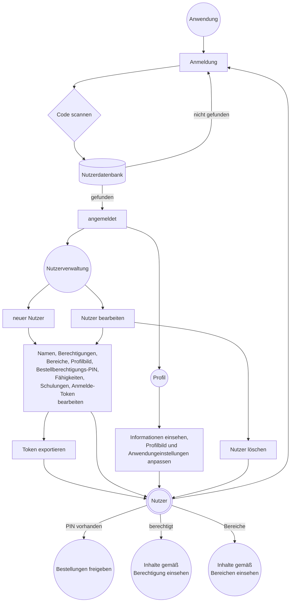
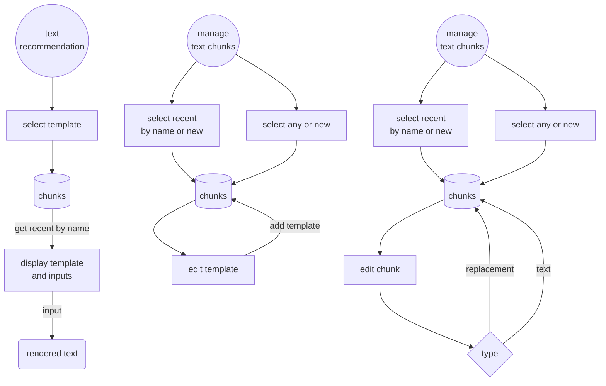
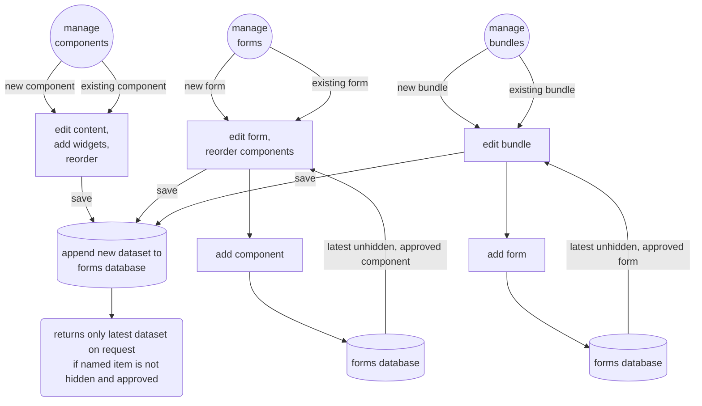
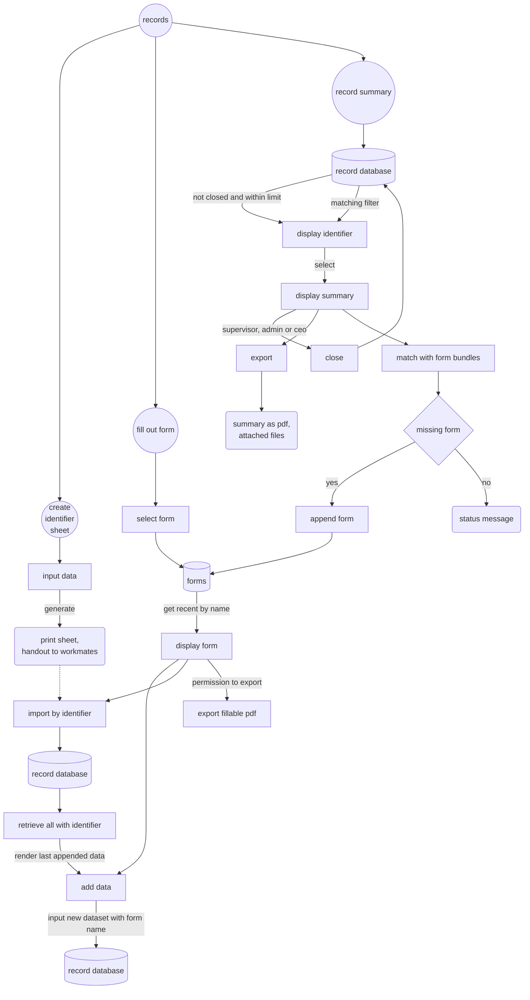
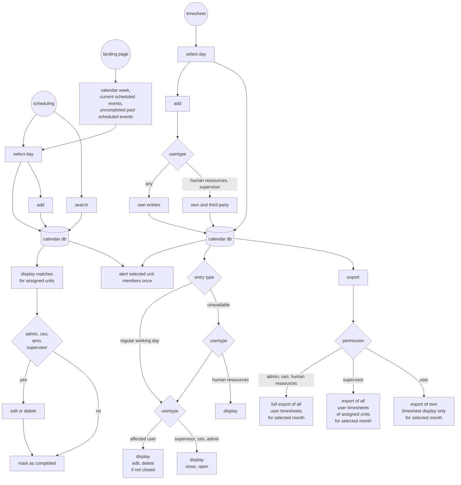
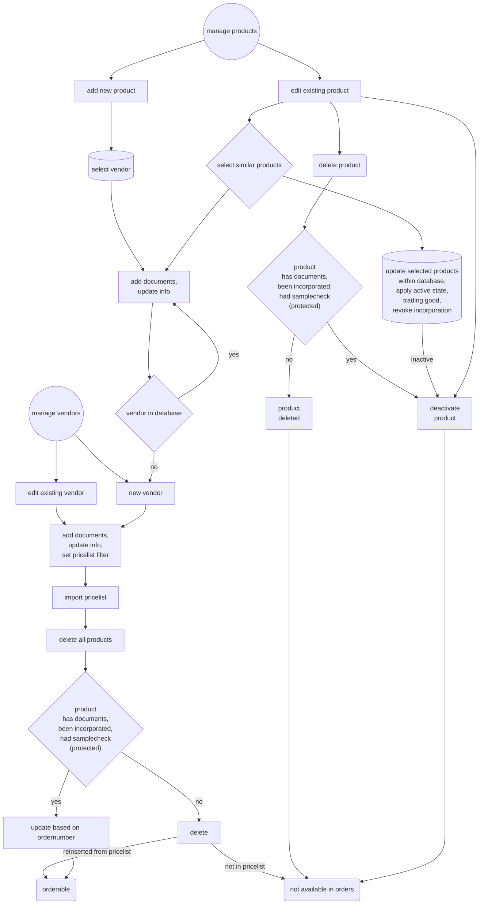
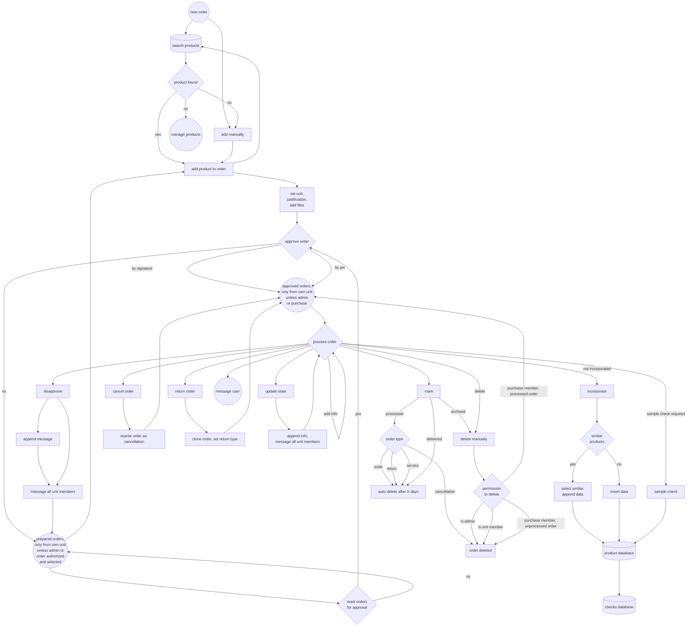

# CARO - Cloud Assisted Records and Operations

## Content
* [Ziele](#ziele)
    * [Vorgesehene Zielsetzungen für ISO 13485](#vorgesehene-zielsetzungen-für-iso-13485)
    * [Integrierte regulatorische Unterstützung](#integrierte-regulatorische-unterstützung)
    * [Extras](#extras)
    * [Erforderliche Infrastruktur](#erforderliche-infrastruktur)
    * [Was es nicht ist](#was-es-nicht-ist)
    * [Datenintegrität](#datenintegrität)
* [Empfehlungen zur Umsetzung regulatorischer Anforderungen](#empfehlungen-zur-umsetzung-regulatorischer-anforderungen)
    * [Tips](#tips)
* [Module](#module)
    * [Anwendung](#anwendung)
        * [Benutzer](#benutzer)
        * [Anleitung](#Anleitung)
    * [Kommunikation](#kommunikation)
        * [Unterhaltungen](#unterhaltungen)
        * [Verzeichnis](#verzeichnis)
        * [Textvorschläge](#textvorschläge)
    * [Aufzeichnungen](#aufzeichnungen)
        * [Formulare](#formulare)
        * [Aufzeichnungen](#aufzeichnungen-1)
        * [Risikomanagement](#risikomanagement)
    * [Kalender](#kalender)
    * [Dateien](#dateien)
    * [Einkauf](#einkauf)
        * [Lieferanten- und Artikelverwaltung](#lieferanten--und-artikelverwaltung)
        * [Bestellung](#bestellung)
    * [Werkzeuge](#werkzeuge)
* [Voraussetzungen](#voraussetzungen)
    * [Installation](#installation)
    * [Laufzeitvariablen](#laufzeitvariablen)
    * [Anmerkungen und Hinweise zur Nutzung](#anmerkungen-und-hinweise-zur-nutzung)
    * [Anpassung](#anpassung)
    * [Importierung von Lieferantenpreislisten](#importierung-von-lieferantenpreislisten)
* [Code Design Vorlagen](#code-design-vorlagen)
* [CSV Processor](#csv-processor)
* [API Dokumentation](#api-dokumentation)
* [Stellungnahme zu technischen Richtlinien zur Datensicherheit](#stellungnahme-zu-technischen-richtlinien-zur-datensicherheit)
* [Bibliotheken](#bibliotheken)
* [Lizenz](#lizenz)

# Ziele
Diese Anwendung möchte bei der Umsetzung eines Qualitätsmanagements nach ISO 13485 und der internen Kommunikation unterstützen. Sie wird als Web-Anwendung auf einem Server verwendet. Datensicherheitsmaßnahmen sind auf die Nutzung innerhalb eines geschlossenen Netzwerks ausgelegt; während die Anwendung technisch betrachtet auf einem beliebigen Webserver funktioniert können nicht alle Aspekte [erforderlicher Datenschutzanforderungen](#stellungnahme-zu-technischen-richtlinien-zur-datensicherheit) abgebildet werden, daher ist diese Verwendung ausdrücklich **nicht empfohlen**. Die Gestaltung ermöglicht es der Belegschaft Daten abzurufen und bereitzustellen wo andere Branchensoftware aufgrund ihrer Lizenzmodelle einschränkt.

Datenerfassung soll dabei weitestgehend digital erfolgen und letztendlich papierbasierte Dokumentationen ablösen. Es mag andere Anwendungen mit dem gleichen Ziel geben, diese verfolgen jedoch einen anderen Grundgedanken - die Verwaltung von Reha-Hilfsmitteln anstelle von Sonderanfertigungen, einem Fokus auf orthopädische Schuhversorgungen oder einer primären Produktivitätsüberwachung - anstelle dem primären Dokumentationsgedanken der CARO App. Ganz zu schweigen von unübersichtlichen Nutzeroberflächen, die ebenfalls das Ziel einer leicht verständlichen und einfachen Oberfläche steckten.


## Vorgesehene Zielsetzungen für ISO 13485
* ISO 13485 4.1.2 Risikobasierter Ansatz
    * Die Anwendung hat ein Modul für die Risikoanalyse um Risken zu erfassen, zu bewerten und Maßnahmen zu beschreiben.
    * siehe [Risikomanagement](#risikomanagement)
* ISO 13485 4.2.3 Medizinproduktakte
    * Alle Aufzeichnungen für Versorgungen laufen zusammen. Exporte beinhalten diese Daten und erreichen damit eine vollständige Dokumentation der Maßnahmen.
    * Aufzeichnungen für Versorgungen erfordern einen Identifikator um eine Zuordnung sicherzustellen.
    * siehe [Aufzeichnungen](#aufzeichnungen)
* ISO 13485 4.2.4 Lenkung von Dokumenten
    * Die Anwendung ermöglicht es wiederverwendbare Formulare und deren Komponenten zu gestalten.
    * Nur die jüngsten freigegebenen Komponenten und Formulare sind für Nutzer erreichbar [so lange eine Netzwerkverbindung besteht](#handhabe-der-netzverkverbindung).
    * Die Erstellung von Komponenten, Formularen, Formular-Paketen und Textvorschlägen ist nur berechtigten Nutzern vorbehalten.
    * Formulare und deren Komponenten müssen von [berechtigten Nutzern](#benutzer) freigegeben werden. Die jeweiligen Nutzergruppen werden mit dem Speichern neuer Elemente vom System benachrichtigt. Jedes Mitglied der Gruppen kann die Freigabe erteilen, da davon ausgegangen wird, dass sich diese ihrer Verantwortung bewusst sind. Eine nutzerspezifische Zuordnung wird hinsichtlich einer Wiederverwendung von Elementen vermieden. Nicht freigegebene Komponenten werden nicht angezeigt, selbst wenn das Formular selbst freigegeben wurde.
    * Neue Formulare, deren Komponenten, Formular-Pakete und Textvorschläge werden als neuer Eintrag in die Datenbank gelegt. Jeder Eintrag erhält dabei einen Zeitstempel und die Angabe des erstellenden Nutzers. Innerhalb der jeweiligen Verwaltung wird primär eine der jüngsten freigegebenen Versionen ausgewählt. Eine erweiterte Auswahl ermöglicht aber den Zugriff auf eine beliebige vorherige Version. Komponenten und Formulare können nach einer vollständigen Freigabe nicht mehr gelöscht werden. Nicht freigegebene Komponenten und Formulare sind für eine Verwendung nicht erreichbar.
    * Bilder für Komponenten können nach einer Freigabe nicht mehr gelöscht werden. Ihrem Dateinamen wird der Name der Komponenten und ein Zeitstempel beigefügt. Sie sind dauerhaft auch für ältere Versionen verfügbar, können aber nicht wiederverwendet werden, da sie fester Bestandteil der jeweiligen Komponente sind.
    * Formulare können primör nur von berechtigten Nutzern exportiert werden um eine Verbreitung veralteter Versionsstände zu vermeiden. Ersteller der Formulare können jedoch eine allgemeine Erlaubnis erteilen.
    * Externe Dokumente werden gelenkt und erhalten die Angabe der Einrichtung, des regulatorischen Zusammenhangs, einer möglichen Außerbetriebnahme und dem jeweils letzten bearbeitenden Mitarbeiter.
    * siehe [Formulare](#formulare), [Dateien](#dateien)
* ISO 13485 4.2.5 Lenkung von Aufzeichnungen
    * Aufzeichnungen laufen zusammen und sind innerhalb der Anwendung nicht löschbar. Jeder Eintrag erhält einen Zeitstempel und den Namen des Nutzers. Zusammenfassungen führen alle Daten zusammen und stellen sie in der Reihenfolge ihrer Übermittlung dar.
    * Bilder und Dateien für Aufzeichnungen werden nicht gelöscht. Ihren Dateinamen wird der Identifikator und Zeitstempel der Übermittlung beigefügt.
    * Aufzeichnungen können jederzeit exportiert werden falls eine zusätzliche Revisionssicherheit gewünscht wird oder die Daten mit dritten Parteien geteilt werden müssen.
    * Der Zugriff auf die Inhalte der Anwendung inclusive vertraulicher personenbezogener Patientendaten erfordert eine persönliche Anmeldung registrierter Nutzer.
    * siehe [Benutzer](#benutzer), [Aufzeichnungen](#aufzeichnungen)
* ISO 13485 5.5.1 Verantwortung und Befugnis
    * Nutzern werden [Berechtigungen](#benutzer) erteilt, die den Zugriff einschränken und das Menü vereinfachen.
    * Berechtigungen definieren den Zugriff auf Funktionen der Anwendung.
    * Nutzer können eine Bestellberechtigungs-PIN erhalten um Bestellungen freizugeben.
    * Das Nutzerverzeichnis listet alle Nutzer auch gruppiert nach organisatorischen Bereichen und Berechtigungen auf.
    * siehe [Benutzer](#benutzer), [Verzeichnis](#verzeichnis), [Laufzeitvariablen](#laufzeitvariablen)
* ISO 13485 5.5.3 Interne Kommunikation
    * Die Anwendung hat einen internen [Nachrichtendienst](#unterhaltungen). Dieser Dienst wird von internen Modulen genutzt um eine zielführende Datenübermittlung sicherzustellen, z.B. für
        * die Benachrichtigung von Nutzergruppen für die Freigabe von Formularen und deren Komponenten
        * die Benachrichtigung von Nutzergruppen über zurückgewiesene Bestellungen und geänderten Bestellstati
        * Benachrichtigungen zu zusätzlich erforderlichen Rechechen zu einer Bestellung an den Besteller
        * Benachrichtigung von Nutzergruppen zu geplanten Ereignissen
    * Die Anwendung hat einen integrierten Kalender. Dieser soll die Aufgabenplanung und Bearbeitung zeitkritischer wiederkehrender Ereignisse wie Kalibrationsmaßnahmen und dergleichen unterstützen.
    * Die Anwendung hat ein Bestellmodul. Bestellungen können vorbereitet und freigegeben werden. Der Einkauf hat alle erforderlichen Daten aus der Lieferantenpreisliste vorliegen um die Bestellung bearbeiten zu können; die Markierung des Bestellstatus erlaubt eine zeitnahe Rückmeldung an den Besteller.
    * Die Anwendung hat einen Sharepoint für Dateien und einen STL-Betrachter für 3D-Modelle um einfach Informationen austauschen zu können, die die Möglichkeiten des Nachrichtendienstes übersteigen.
    * Die Oberfläche informiert über neue Nachrichten, freigegebene neue Bestellungen (Einkauf) und unerledigte Kalenderereignisse. Die Startseite zeigt zudem eine kurze Zusammenfassung offender Versorgungsfälle und geplanter Ereignisse der aktuellen Kalenderwoche sowie unerledigter Ereignisse.
    * Formulare können auf andere Formulare verweisen. Dabei können diese nur angezeigt werden (z.B. Verfahrens- oder Arbeitsanweisungen) oder mit Übernahme des Identifikators für einen reibungslosen Transfer sorgen.
    * siehe [Unterhaltungen](#unterhaltungen), [Kalender](#kalender), [Bestellung](#bestellung), [Dateien](#dateien), [Werkzeuge](#werkzeuge)
* ISO 13485 6.2 Personelle Ressourcen
    * innerhalb der Nutzerverwaltung können Schulungen, deren Ablaufdaten, Erfahrungspunkte und anhängende Dokumente hinzugefügt werden.
    * Nutzern können Fähigkeiten und deren Niveau gemäß der bestimmten für das Unternehmen [erforderlichen Fähigkeiten](#anpassung) (Aufgabenmatrix) zugeordnet werden.
    * Eine Übersicht über die Schulungen und Fähigkeiten ist im Audit-Modul einsehbar.
    * Fähigkeiten und Schulungen können von berechtigen Nutzern gelöscht werden. Die Übersicht kann im Audit-Modul exportiert werden.
    * siehe [Benutzer](#benutzer), [Anpassung](#anpassung), [Werkzeuge](#werkzeuge)
* ISO 13485 7.4.1 Beschaffungsprozess
    * Die Beschaffung wird durch die Anwendung begleitet. Lieferanten und Produkte können zur Datenbank hinzugefügt werden.
    * Lieferanteneinträge können durch Dokumente, Zertifikate und deren Gültigkeitsdaten ergänzt werden. Die Gültigkeit von Zertifikaten können angezeigt und im Audit-Modul exportiert werden. Lieferanten können als inaktiv markiert, jedoch nicht gelöscht werden. Produkte, die deaktiviert werden sind über das Bestellmodul nicht erreichbar.
    * Produkte können mit Dokumenten ergänzt werden, welche nicht gelöscht werden. Den Dateinamen werden der Lieferantenname, der Zeitstempel der Übermittlung und die Artikelnummer angefügt.
    * Produkte sollen eingeführt werden. Produkteinführungen können durch berechtigte Nutzer freigegeben, entzogen oder zurückgesetzt werden. Alle Nutzer (außer Gruppen) sammeln zuvor die erforderlichen Informationen. Produkteinführungen werden durch eigene Formulare mit dem entsprechenden Kontext umgesetzt.
    * Produkte werden im Falle einer Presilistenaktualisierung automatisch gelöscht, es sei denn
        * es fand eine Produkteinführung statt
        * es wurde eine Stichprobenprüfung durchgeführt
        * es wurde ein Dokument beigefügt
        * es wurde ein Alias festgelegt
    * Änderungen an Produkteinträgen ist nur für berechtigte Nutzer möglich
    * Eine Lieferantenbewertung wird durch die Bereitstellung von reduzierten Daten der Bestellungen in Bezug auf Lieferzeiten, Stornos und Rücksendungen im Audit-Modul unterstützt.
    * siehe [Lieferanten- und Artikelverwaltung](#lieferanten--und-artikelverwaltung), [Bestellung](#bestellung), [Werkzeuge](#werkzeuge)
* ISO 13485 7.4.3 Verifizierung von beschafften Produkten
    * Die Stichprobenprüfung nach MDR §14 erbittet eine Prüfung für jedes [als Handelsware definierte](#importierung-von-lieferantenpreislisten) Produkt, sofern die letzte zurückliegende Prüfung innerhalb des Sortiments dieses Lieferanten die mdr14_sample_interval-Zeitspanne überschreitet, z.B. einmal jährlich. Dies betrifft alle Produkte welche nicht innerhalb der mdr14_sample_reusable-Zeitspanne liegen, welche ebenfalls für jeden Lieferanten individuell festgelegt werden kann, wenn es das Sortiment erfordert. Beide Werte erhalten durch die setup.ini einen Standardwert.
    * Stichprobenprüfungen werden durch eigene Formulare mit dem entsprechenden Kontext umgesetzt. Alle Nutzer (außer Gruppen) sammeln die erforderlichen Informationen.
    * Stichprobenprüfungen können durch berechtigte Nutzer zurückgezogen werden.
    * siehe [Lieferanten- und Artikelverwaltung](#lieferanten--und-artikelverwaltung), [Bestellung](#bestellung)
* ISO 13485 7.5.1 Lenkung der Produktion und Dienstleistungserbringung
    * Entsprechende Formulare zeichnen die Schritte der Fertigung auf. Mit dem Zugriff auf die Aufzeichnungen ist der aktuelle Status erkennbar. Ist beispielsweise eine Aufzeichnung für einen Fertigungsabschnitt vorhanden, bei dem die Arbeitsschritte festgelegt werden, kann das Formular auch ein Auswahlfeld für die Erledigung beinhalten. In einem ersten Dokumentationsschritt können die Schritte festgelegt werden, in einem folgenden kann das Formular erneut verwendet und das Auswahlfeld markiert werden. Damit wird der Zeitpunkt und eintragende Nutzer aufgezeichnet.
    * Formular-Kontexte erlauben eine Zuordnung als Verfahrens- oder Arbeitsanweisungen.
    * Der integrierte Kalender unterstützt bei der Planung von Arbeiten.
    * siehe [Formulare](#formulare), [Aufzeichnungen](#aufzeichnungen-1), [Kalender](#kalender)
* ISO 13485 7.5.8 Identifizierung
    * Aufzeichnungen erfordern einen Identifikator. Dieser Identifikator ist derzeit als QR-Code implementiert, welcher exportiert und ausgedruckt, sowie mit dem integrierten Scanner ausgelesen werden kann. Aufkleberbögen mit dem Code können auch zur Kennzeichnung von Produkten und Komponenten während der Herstellung verwendet werden.
    * siehe [Aufzeichnungen](#aufzeichnungen-1)
* ISO 13485 7.6 Lenkung von Überwachungs- und Messmitteln
    * Entsprechende Formulare erfordern einen Identifikator, ähnlich Versorgungsdokumentationen. Messmittel können ebenfalls einen individuellen Identifikator zugetreilt bekommen.
    * Eine Berücksichtigung eines Kalendereintragt innerhalb dieser Formulare kann dabei unterstützen zukünftige Ereignisse zu planen und Mitarbeiter zu informieren.
* ISO 13485 8.2.4 Internes Audit
    * Das Audit-Modul sammelt Daten aus der Anwendung und ist in der Lage Exporte zur Verfügung zu stellen für
        * Aufzeichnungen über Produkteinführungen. Sofern aktuell bestellte Artikel nicht berücksichtigt sind erfolgt ein Hinweis.
        * Aufzeichnungen über Stichprobenprüfungen. Sofern aktuell Lieferanten für eine Prüfung fällig sind erfolgt ein Hinweis.
        * eine Übersicht über die aktuell gültigen Formulare und deren Komponenten.
        * Fähigkeiten und Schulungen der Mitarbeiter mit ggf. markierten abgelaufenen Zertifikaten
        * Lieferantenlisten mit den jeweiligen letzten Preislistenaktualisierungen, der letzten Stichprobenprüfung und Details zu Zertifikaten sofern bereitgestellt.
        * die Berücksichtung regulatorischer Anforderungen durch verwendete Formulare und Dokumente
    * siehe [Werkzeuge](#werkzeuge)
* ISO 13485 8.4 Datenanalyse
    * Eine Lieferantenbewertung wird durch die Bereitstellung von reduzierten Daten der Bestellungen in Bezug auf Lieferzeiten, Stornos und Rücksendungen im Audit-Modul unterstützt. Es besteht jedoch ein individueller Interpretationsspielraum der bereitgestellten Daten.
    * siehe [Bestellung](#bestellung), [Werkzeuge](#werkzeuge)

[Content](#content)

## Integrierte regulatorische Unterstützung
* MPDG §83
    * Medizinprodukteberater werden durch die entsprechende Berechtigung in den Nutzereinstellungen festgelegt und als solche im Verzeichnis angezeigt.
    * siehe [Benutzer](#benutzer)
* ISO 14971 Anwendung des Risikomanagements auf Medizinprodukte
    * Die Anwendung hat ein Modul für die Risikoanalyse um Risken zu erfassen, zu bewerten und Maßnahmen zu beschreiben.
    * Anhang E ist für die Nutzung standardmäßig verbereitet.
    * siehe [Risikomanagement](#risikomanagement) 

[Content](#content)

## Extras
* Textempfehlungen
    * Standard- und anpassbare [Textvorschläge](#textvorschläge) können definiert werden um eine durchgängige Sprachregelung zu unterstützen.
* Zeiterfassung
    * Registrierte Nutzer können ihre Arbeitszeiten, Urlaube, Krankheitsausfälle, etc. in den [Kalender](#kalender) eintragen. Die Einträge können unter Berücksichtigung con Arbeitszeitgesetzen exportiert werden.
* Dateiverteilung
    * Die Anwendung hat einen [Sharepoint](#dateien) für Dateien und einen [STL-Betrachter](#werkzeuge) um vereinfacht Informationen austauschen zu können.
* CSV-Filterung
    * Die Anwendung ist in der Lage CSV-Dateien auf vielfältige Weite zu [filtern und zu verarbeiten](#csv-processor).

[Content](#content)

## Erforderliche Infrastruktur 
Es wird ein Server zur Speicherung und Verarbeitung der Web-Anwendung, sowie Netzwerkzugriff für alle Endgeräte benötigt. Die Anwendung ist dafür ausgelegt primär auf mobilen Geräten wie beispielsweise Android-Tablets oder iPads genutzt zu werden, kann aber auch auf Desktop-Computern genutzt werden. Manche Funktionen wie die Erstellung von Formularen oder Textvorschlägen sind primär nur auf Desktop-Computern mit Maus-Eingabegeräten möglich.

Das oberste Ziel ist die Ausstattung der Belegschaft oder zumindest von Schlüsselpositionen und Arbeitsplätzen mit mobilen Geräten. Schließlich kann die Administration nicht nach Digitalisierung verlangen ohne eine geeignete Infrastruktur zur Verfügung zu stellen. Scanner sind optional, da Scannen ebensogut mit in den Geräten eingebauten Kameras umgesetzt werden kann.

Für technische Details siehe [Voraussetzungen](#voraussetzungen).

## Was es nicht ist
Abgesehen von einigen architektonische Entscheidungen ist die Anwendung kein voreingestelltes Qualitätsmanagementsystem. Prozesse, Dokumente und Verantwortlichkeiten sind selbst zu bestimmen. Die Anwendung soll lediglich dabei unterstützen strukturierte Abläufe und eine halbautomatisierte Erfüllung regulatorischer Anforderungen sicherzustellen. *Berechtigungen in den Flussdiagrammen stellen unverbindliche Standardeinstellungen dar.*

Die Anwendung ersetzt kein ERP-System. Daten für den Einkauf sind nur innerhalb der Oberfläche auf Basis der eigenen Datenbank möglich. Diese bewusste Entscheidung richtet sich gegen aufgeblähte Artikelstammdaten von ERP-Systemen derer kaum Herr zu werden möglich ist und die stets eine geschlossene Benutzeroberfläche erfordern. Die Produktdatenbank kann durch Preislisten der Lieferanten bestückt und dabei von vorneherein regelhaft um unwichtige Daten bereinigt werden.

Bestellungen können von berechtigen Nutzern und Mitgliedern der bestellenden Bereiche jederzeit und zudem nach Ablauf einer definierten Zeit nach Auslieferung gelöscht werden. Dieses Modul dient in erster Linie der internen Kommunikation und nicht einer dauerhaften Dokumentation.

## Datenintegrität
Aufzeichnungen speichern stets den Namen des übermittelnden Nutzers ab. Gruppen-Nutzer sind daher nicht empfohlen, jedoch mit eingeschränkten Berechtigungen möglich. Individuelle Nutzer sind indes vorgesehen. Berechtigte Nutzer können andere Nutzer anlegen, bearbeiten und löschen. Zur Vereinfachung wird ein 64 Byte Token erstellt. Dieser Token wird in einen QR-Code umgewandelt, welcher bei der Anmeldung gescannt werden kann. Dadurch muss sich kein Nutzername und Kennwort gemerkt werden und es kann auf die Eingabe mehrerer Felder bei der Anmeldung verzichtet werden. Dieser Vorgang ist daher schnell umsetzbar und erlaubt einen raschen Wechsel zwischen unterschiedlichen Anmeldungen bei eingeschränkter Verfügbarkeit von Endgeräten.

Formulardaten und Serveranfragen beinhaltet teilweise IDs um spezifische Inhalte zu erreichen. Technisch gesehen ist es möglich diese Daten und Anfragen zu manipulieren. Dennoch wird dieses Vorgehen als angemessen bewertet, da Serververarbeitungen nicht in der Lage sind auf die ursprüngliche Intention zu schließen. Dies erscheint nicht weniger sicher als eine beabsichtige Falschangabe in einer beliebige papierbasierten Doumentation.

Formulare können ein digitales Unterschriftenfeld beinhalten. Dabei ist zu beachten, dass es sich hierbei mangels Zertifizierung nicht um ein dokumentenechtes Verfahren handelt. Ob das Verfahren innerhalb festgelegter Prozesse angemessen ist, ist eine persönliche Ermessenssache.

[Content](#content)

## Empfehlungen zur Umsetzung regulatorischer Anforderungen
Abgesehen von der Anwendungsarchitektur muss das Qualitätsmanagementsystem selbst aufgestellt werden. Die meisten regulatorischen Anforderungen werden durch Formulare erfüllt. Auf diese Weise wird eine zuverlässige Versionskontrolle und Freigabe, sowie eine Prüfung der Erfüllung der Anforderungen innerhalb des [Audit-Moduls](#werkzeuge) sichergestellt.
* Es können Formulare für die Beschreibung von Prozessen erstellt werden und mit dem Kontext *Verfahrens- oder Arbeitsanweisung* und passendem regulatorischen Zusammenhang versehen werden.
    * ISO 13485 alle Kapitel sollten berücksichtigt werden
    * Es kann auf diese Dokumentation und die oben genannten [Ziele](#ziele) verwiesen werden.
* Es können Formulare erstellt werden die ebenfalls für eine schriftliche Form exportierbar sind und mit dem Kontext *Allgemeine Dokumentation* und passendem regulatorischen Zusammenhang versehen werden.
    * ISO 13485 4.1.5
* Es können Formulare erstellt und mit dem Kontext *Allgemeine Dokumentation* und passendem regulatorischen Zusammenhang versehen werden.
    * Alle allgemeinen Aufzeichnungen besonders aber nicht beschränkt auf:
    * ISO 13485 6.2
    * ISO 13485 6.3
    * ISO 13485 8.2, 8.2.3, 8.2.4
    * Ausbildungsverordnungen
* Es können Formulare erstellt und mit dem Kontext *Vorkommnis* und passendem regulatorischen Zusammenhang versehen werden.
    * ISO 13485 8.2.3
* Es können Formulare erstellt und mit dem Kontext *Vorgangsdokumentation* und passendem regulatorischen Zusammenhang versehen werden.
    * ISO 13485 7.2, 7.2.1
    * ISO 13485 7.3, 7.3.3, 7.3.4, 7.3.5, 7.3.6, 7.3.7, 7.3.8, 7.3.9, 7.3.10
    * ISO 13483 7.5, 7.5.1, 7.5.3, 7.5.4, 7.5.6
    * Datenschutzhinweise
    * SGB 5 §33
    * MDR annex 1
    * MDR annex 6
    * MDR annex 7
    * MDR annex 13
Es können Formulare erstellt und mit dem Kontext *MDR §14 Stichprobenprüfung* und/oder *Produkteinführung* und passendem regulatorischen Zusammenhang versehen werden.
    * ISO 13485 7.4, 7.4.3
Es können Formulare erstellt und mit dem Kontext *Überwachung von Arbeitsmitteln* und passendem regulatorischen Zusammenhang versehen werden.
    * Computer Software und deren Versionsaufzeichnungen können ebenfalls als Arbeitsmittel betrachtet werden.
    * ISO 13485 4.1.6, 7.6
    * MPBetreibV

### Tips
* Ein Kalender-Element kann in die Überwachungs-Formulare eingebunden werden um während der Bearbeitung direkt das nächste Fälligkeitdatum festzulegen.
* Die Option einer "Großväterregelung" in der Produkteinführung kann insbesondere beim Übergang von einem anderen Qualitätsmanagementsystem in die CARO App die Dinge vereinfachen. Es muss dabei aber sichergestellt sein, dass die Anforderungen zuvor wirklich erfüllt wurden.
* Wenn die Branchensoftware in der Lage ist Barcodes für Waren zu erzeugen, können Mehrfach-Scannerfelder innerhalb der Vorgangsdokumentation eine Rückverfolgung unterstützen.
* Der Liste der gewünschten Fähigkeiten sollen die für das Unternehmen angemessenen Punkte [hinzugefügt](#anpassung) werden um eine zielführende Übersicht über die Erfüllung zu ermöglichen.
* Innerhalb der Formulare für die Vorkommnisaufzeichnungen können Links z.B. zu den [IMDRF Adverse Event Terminology Web Browsers](https://www.imdrf.org/working-groups/adverse-event-terminology) eingefügt werden um die erforderlichen Codes zu finden.


[Content](#content)

# Module

## Anwendung


### Benutzer
Bei der Registrierung eines neuen Nutzers wird ein Standard-Profilbild erstellt. Individuelle Profilbilder können mit diesem Bild wieder ersetzt werden. Eine automatisch generierte PIN kann als Berechtigung für die Freigabe von Bestellungen verwendet werden. Das Hinzufügen von Schulungen ist nur für berechtigte Nutzer möglich um sicherzustellen, dass Schulungen bekannt und nicht übersehen werden. Fähigkeiten können gemäß der [geplanten Liste](#anpassung) angepasst werden. Der erstellte Anmeldung-Token kann exportiert und beispielweise als laminierte Karte verwendet werden.

Nutzer können im Sinne der Transparenz alle persönlichen Informationen in ihrem Profil einsehen. Eine Änderung des Profilbilds und individuelle Anwendungeinstellungen können an dieser Stelle ebenfalls vorgenommen werden.

Die Anwendung stellt ein zugeordnetes Rollen-Management für registrierte Nutzer zur Verfügung. Der gesamte Inhalt ist nur für angemeldete Nutzer zugänglich. Nutzer können unterschiedliche Berechtigungen erhalten. Diese Berechtigungen steuern, welche Inhalte erreichbar sind oder welche Änderungen erlaubt sind. Die Grundlage basiert auf den für das Unternehmen anpassbaren [Laufzeitvariablen](#laufzeitvariablen). Die Beispiele stellen eine angemessene Einstellung dar, sind aber frei wählbar.

Manche Berechtigungen/Einschränkugen sind jedoch systemisch festgelegt:

Die Zeiterfassung ist nur erreichbar, wenn eine Wochenarbeitszeit für den Nutzer festgelegt ist - das Gilt auch für den Anwendungsadministrator.

* Mitarbeiter
    * können nur Bestellungen der eigenen zugewiesenen Bereiche einsehen
    * können nur die eigenen Arbeitszeitdokumentationen exportieren
    * können Stichprobenprüfungen und Produkteinführungen durchführen
* Gruppen
    * können mangels persönlicher Identifizierbarkeit **nicht** zu Aufzeichnungen beitragen
    * können Bestellungen durchführen, müssen jedoch einen Namen angeben
    * können nur Bestellungen der eigenen zugewiesenen Bereiche einsehen
    * können mangels persönlicher Identifizierbarkeit **keine** Stichprobenprüfung und Produkteinführung durchführen
    * haben **keinen** Zugriff auf Arbeitszeitdokumentationen
* Bereichsleiter
    * können alle Arbeitszeitdokumentationen der Mitarbeiter zugewiesener Bereiche exportieren
    * können geplante Kalenderereignisse zugewiesener Bereiche und Arbeitszeiteinträge der mitarbeiter zugewiesener Bereiche anlegen, ändern und abschließen
* Anwendungsadministratoren
    * haben **vollen Zugriff** und **alle Rechte**
    * können als jede Berechtige Nutzergruppe Freigaben erteilen
    * können alle Arbeitszeitdokumentationen exportieren
    * die bei der Installation angelegte Systemnutzerin CARO App hat diese Berechtigung und kann genutzt werden um weitere Nutzer anzulegen. Der Standard-Token sollte unverzüglich geändert und an einem Sicheren Ort verwahrt werden!
    * diese Berechtigung sollte idealerweise nur wenigen vertrauenswürdigen Mitarbeitern der Leitungsebene erteilt werden

Nutzer können mehrere unterschiedliche Berechtigungen erhalten und mehreren Bereichen zugeordnet werden.




[Content](#content)

### Anleitung

Die Anleitung kann gemäß technischem Verständnis und sprachlicher Gepflogenheiten individuell angepasst werden. Einzelne Abschnitte können dabei entsprchend der Berechtigungen markiert werden um diese zugunsten einer vereinfachten Übersicht für alle anderen auszublenden.

## Kommunikation


### Unterhaltungen
Systeminterne Nachrichten dienen ausschließlich der internen Kommunikation und haben keinen Aufzeichnungscharakter. Nachrichten werden als Unterhaltungen mit dem jeweiligen Gesprcähspartner gruppiert. Dabei kann abgesehen vom Systemnutzer jeder andere angeschrieben und die Unterhaltungen jederzeit gelöscht werden. Mehrere Adressaten können durch Komma oder Semicolon getrennt angesprochen werden. Ein Druck oder Klick auf die Nachricht erlaubt eine Weiterleitung an andere Mitarbeiter. Neue Nachrichten lösen eine Systembenachrichtigung aus. Die Anwendung sendet im Bedarfsfall auch Nachrichten an Nutzergruppen.


[Content](#content)

### Verzeichnis

Das Verzeichnis stellt eine Übersicht über die registrierten Nutzer dar, gruppiert nach Bereichen und Berechtigungen. Nutzern können direkt von dort aus Nachrichten zugesandt werden.

[Content](#content)

### Textvorschläge
To avoid unneccesary or repetitive poetry and support a consistent linguistic style text recommendations can be provided. These are assembled with predefined text chunks for either replacements that handle pronouns or generic text chunks. Latter can make use of former. Currently a german language model is implemented where replacements are defined as chunks of
* Child female - the girl
* Child male - the boy
* Child genderless - the child
* Adult female - the woman
* Adult male - the man
* Adult genderless - the person
* Informal you - "buddy"
* Formal you - "your honor" (this is the german model part where there is more than just "you")

Such a replacement may be named addressee. If a generic text chunk contains :addressee this will be replaced with the chosen genus from a selection list. If you intend to write a text for the insurance company you may talk about the patient and select a genus from the first four options, if you address the customer directly you may choose one of the last two depending on your individual distance. A selection of the desired genus will be rendered on the creation form and reused for all types of replacements.

On creating a text you can make use of predefined replacements that may contain the grammatical case (e.g. *:addresseeNomative*, *:addresseeAccusative*, *:addresseeDative*, etc.). Undefined placeholders will be rendered to an input field where it can be typed in and used repeatedly:

*"We write to inform you about :addresseeAccusative, :name. We just want to tell you :name is doing fine. :addresseeNomative can make use of the aid."*

Text templates arrange generic text chunks. Arrange or group chunks within the [drag and drop editor](#miscellaneous). Chunks can always be unselected to customize to the actual use case. Grouping chunks enhances the perception of the creation form.

Output will be copied to clipboad on clicking or tapping the output field.




[Content](#content)

## Aufzeichnungen


### Formulare
Several other pieces of software claim to handle your documents and speak of version control. In fact they just import PDF-files that have to be generated elsewhere. (Without going into excessive research) there has been no information on how document control and versioning is actually achieved. The CARO App just doesn't follow this as all: your documents are supposed to be created within the application itself. By aiming for a paperless solution this might be enough, but documents can still be exported as editable or prefilled PDFs within boundaries.

To create tracked and versioned forms and documents, create reusable form components and assemble forms from components. Components and forms have to be approved by defined authorized users to take effect. Furthermore forms can be grouped to form bundles. This way anyone can check if all necessary forms have been taken into account for defined use cases.

An approvement request is delivered by the applications [messenger](#conversations) to users with set permissions; supervisors, if set, for the defined organizational unit. Approval is granted by ticking a checkmark while being logged in with the respective assigned roles/permissions. 

Components can be rearranged via [drag and drop editor](#miscellaneous). Forms can have alternative search terms. A context must be provided to ensure a plausibility check for occasionally necessary elements. A regulatory context is optional but recommended. Approvement requests are delivered same way as for components.

The respective manager provides a selection for recent approved elements as well as a selection for all entries within the database.

Forms can be exported as an editable PDF in hopefully rare scenarios where a digital record is somehow an issue. Upload-options are dropped by default though. Permission to export is restricted by default to defined authorized users to prevent distribution of outdated versions and support an improved data collecting within the application. Authorized form creators can decide for general permission though. It is recommended to transfer the data later or at least append the scanned or photographed document to the applicable record (given a suitable form).

Forms can be managed to bundles so records can be reviewed for completeness.




[Content](#content)

### Aufzeichnungen
Records store all inputs for any selected form. Some form contexts require an identifier that groups records to a summary. Summaries can be exported. Full summaries contain all inputs in chronological order, simplified summaries contain the most recent input only. This may lack transparency but is suitable for a tidy overview for possible third parties. 

Paperless might not be suitable in humid environments. Thus single documents can be exported as well e.g. to have data at hand where electronic devices may take damage. 

The identifier is always a QR-code with additional readable content that will appear on any export of identifiable records. To improve workflow identifier labels can be generated to mark product components, exported forms, etc. By scanning the QR-code errors and mix-ups are unlikely. The identifier can also be used to import data from other records in case of comprehensive cases in different organizational units.


Checking for completeness of form bundles can be applied on display of a record summary.

Records can be marked as closed to disappear from the records overview and not being taken into account for open cases on the landing page summary, but still can be accessed after filtering/searching any keyword within the identifier. On further contribution the closed state is revoked by default.




[Content](#content)

### Risikomanagement
The risk management supports describing risks according to ISO 14971 and in accordance to [DGIHV](https://www.dgihv.org) proposals.

You are supposed to track a cause and effect, recognize a probability and damage, describe measures, reevaluate probability and damage, do a risk-benefit assessment and define remaining measures. The form displays a message whether the risk (before and after measure) passes the acceptance level threshold ad defined within [setup.ini](#runtime-variables).

Entries are not persistent but can be exported if desired through the [audit module](#tools). Available entries store and display the user name and date of the last edit. 


[Content](#content)

## Kalender


Add events to the calendar. The landing page gives a brief overview of the scheduled events and the current week as well as off duty workmates at a quick glance. Events can be added and completed by every user, editing and deleting is permitted to defined authorized users only.

Events may trigger a [message](#conversations) to a defined user group if set.

As scheduling is supposed to help you with operational planning (e.g. daily assigned tasks for a unit) and reminders in conjunction with records in the first place you get only to select dates. This unclutters the input form too.

Displayed calendars do include weekends and any non working day intentionally in case some event occurs non-standard or recurring events happen to be dated then, to not being overlooked.

Scheduling and its events are not part of the records per se as any treatment measure is supposed to have its own timed [record](#records).

Beside scheduling, the calendar can be used to document working hours of the staff. This is originally loosely connected with planning as far as vacations and other leaves can be entered, displayed and may affect scheduling events. While we're at it we can as well write the working hours up and summarize them. Displaying and exporting is permitted to the owning user, supervisor and defined authorized users only. Latter are allowed to contribute an entry for every user to inform units about sick leave. Editing is only permitted to the owning user for unclosed entries. Entries approval state can be set by supervisors of the respective unit and defined authorized users for full access only.

This is supposed to ensure a transparent communication, data safety and collective agreements on timetracking. It aims to address all known concerns of german law and staff council/union. It's not a persistent tracking though, for the database will be cleaned from all entries where the affected user is deleted. Timesheets can be exported, which is preferred anyway by current experience and is highly recommended if used for documentation regarding labour laws. User settings allow for entering weekly hours to calculate properly.

Off duty events are displayed with the scheduled events, but scheduled events are also displayed within the timesheet calendar to raise awareness about possible workload of the remaining staff.

*Warning: current impementation has quite a fixed definition of holidays and does not take different regions as well as changes in public holidays into account. Currently changes will affect past timesheet entries and calculate different results. Changes as soon as i can think of a solution! On minor changes it is recommended to export the most recent timesheets and start tracking anew.*

Timesheets support changes in weekly hours and annual vacation though. Respective start dates and values are part of the user settings.

Exports are ordered by user name with exporting user coming first regardless, for convenience.



[Content](#content)

## Dateien


Defined authorized users can provide files for everyone to access. Also all users can contribute to the open sharepoint where files have a limited timespan and are deleted after a while by default.

Both cloud storages live equip the [tools STL-Viewer](#tools) with sources to display.

This source can also be used to provide documents that are [unsuitable to be filled out digitally](#data-integrity). *Enable export permission for internal documents to avoid version confusion; register external documents for the same reason.*

External documents as described in ISO 13485 4.2.4 have to be identified and routed. Therefore these files receive special attention and are to be handled with respective records regarding implementation, regulatory context, possible retirement and the username for the last decision. For consistent documentation purpose files can not be deleted, only set unavailable.


[Content](#content)

## Einkauf


### Lieferanten- und Artikelverwaltung
Order operations rely on a vendor and product database. Also this is related to incorporation and sample checks of products, document and certification handling. Defined authorized users have permission to manage these categories, add and edit vendors and products, import pricelists and define filters, or disable vendors and products. Importing pricelists with filtering makes use of the [CSV processor](#csv-processor).

Disabled products are not accessible through the order module. Products can be deleted as long as they are not marked as protected. Vendors are not deleteable.

Defined authorized users (e.g. *purchase assistant*) can edit the alias definition of products to disburden purchase and enhance identification of products with company customs.

Vendors can be enriched with certificate files. The application will match the provided expiry-date and contribute to the [calendar](#calendar) once the date has passed to alert relevant units to look after an update.

While editing products, one can edit the
* *trading good*-setting,
* *has expiry date*-setting,
* *special attention*-setting (meaning being defined within languagefile),
* revoke a possible *incorporated*-state and
* set the product *active and available* or *inactive*.

On setting any of these, similar products can be selected to apply this setting to as well. The selection happens to propose products of the same vendor whose article number has a set up similarity (as defined within [setup.ini](#runtime-variables)).




[Content](#content)

### Bestellung
The order module supports all parties. Purchase is supposed to obtain structured and complete data for placed orders and ordering units get information about the order state.
Ordered products identify themself as incorporated or not or whether they are qualified for a necessary sample check. Both can be done from the list of ordered products, during operations and without being mixed-up.

Orders may have to be approved; pending approvals sum up and can be batch approved by users with an order authentification pin.

Approved orders can be marked as *ordered*, *received*, *delivered* and *archived* with only the last not being deleted by default after a set timespan. Also purchase can disapprove an order for any suitable reason. In this case a message can be appended and all users of the assigned organizational unit will be informed about the lack of order processing.

Information can be added anytime.
Processed but not yet received orders can have a order state change in which case the ordering unit will be send a message. These are also cancelable, in which case the order will be sorted to unprocessed with a cancellation flag and message to purchase; a processed cancellation will be deleted. Received products can be marked to be returned. Returns create a new order without changing the original one and without dedicated authorization. Processing return orders flags as received simultaneously - this does not track refunds intentionally to reduce load on purchase staff.
All actions offer to append a message.

Processed orders are also added to a second database with reduced data. This data can be exported through the [audit module](#tools) and used for vendor evaluation. 



Initialized incorporations are marked as approved by all applicable users permissions/roles. They may still have to be fully approved by defined authorized roles.
Sample checks are added to the records. Defined authorized users can revoke the sample check from within the [audit module](#tools). New checks trigger a sytem message to these users.

[Content](#content)

## Werkzeuge


Some general tools are available to read and create 2D-barcodes, view STL-files (e.g. for communication of a CAD-unit with another manufacturing unit).

Also a CSV-Filter and its manager are sorted here. The CSV-filter processes respective filetypes using the [CSV processor](#csv-processor) and can be used for any kind of list matching. The filter is accessible by defined authorized users.

The audit module gathers data from the application in regards of proofing lists for fulfilment of regulatory requirements:
* incoporated articles
* MDR §14 sample checks
* current documents in use including external documents
* user skills and trainings
* skill fulfilment
* vendor list
* order statistics
* regulatory issues
* risks


[Content](#content)

# Voraussetzungen
* Server with
    * PHP >= 8.2
    * MySQL/MariaDB or SQL Server (or some other database, but queries may have to be adjusted)
    * SSL (camera access for qr-scanner, serviceworker and sha256 encryption don't work otherwise)
* Network access for endpoints and a browser
    * Desktop pcs
    * Mobile devices
    * at best [no deletion of browser data](#network-connection-handling) (cache, indexedDB) on closing.
* Vendor pricelists as CSV-files ([see details](#importing-vendor-pricelists))

Tested server environments:
* Apache [Uniform Server Zero XV](https://uniformserver.com) with PHP 8.2, MySQL 8.0.31 (until 2024-05-30)
* Apache (native) with PHP 8.2, MariaDB 15.1 (from 2024-05-30)
* Microsoft IIS with PHP 8.2, SQL Express (SQL Server 22)

Tested devices:
* Win10 Edge-browser
* Win11 Firefox-browser (until 2024-05-30)
* Linux Mint 21.3 Firefox-Browser (from 2024-05-30)
* Android12 Firefox-browser

Firefox, Edge and most probably any chromium browser have previews for input datalists that help with selecting available options (e.g. message recipients) which is very convenient. Other browsers have not been tested.

[Content](#content)

## Installation
* php.ini memory_limit ~4096M for [processing of large CSV-files and pricelist imports](#csv-processor), disable open_basedir at least for local IIS for file handlers.
    * [processing a csv](#csv-processor) of 48mb @ 59k rows with several, including file-, filters consumes about 1.7GB of memory
    * [pricelist import](#importing-vendor-pricelists) @ 100MB consumes about 2.3GB of memory
* php.ini upload_max_filesize & post_max_size / applicationhost.config | web.config for IIS according to your expected filesize for e.g. sharepoint- and CSV-files ~350MB.
* php.ini max_input_time -1 for large file uploads to share with max_execution_time, depending on your expected connection speed.
* php.ini max_execution_time / fastCGI timeout (iis) ~ 300 (5min) for [CSV processing](#csv-processor) may take a while depending on your data amount, depending on your filters though.
    * pricelist import @ 220k rows takes about 1 minute to import and process on Uniform Server, 1 minute on SQL Server
    * pricelist import @ 660k rows currently takes about 2 minutes to import and process on Uniform Server, 3 minutes on SQL Server
* php.ini session.cookie_httponly = 1, session.cookie_secure = 1, session.use_strict_mode = 1
* php.ini session.gc_maxlifetime according to [setup.ini[limits][idle_logout]](#runtime-variables)
* php.ini enable extensions:
    * gd
    * gettext
    * mbstring
    * exif
    * pdo_odbc
    * zip
    * php_pdo_sqlsrv_82_nts_x64.dll (sqlsrv)
* my.ini (MySQL) / mysql.conf.d/mysql.cnf (MariaDB) max_allowed_packet = 100M / [SQL SERVER](https://learn.microsoft.com/en-us/sql/database-engine/configure-windows/configure-the-network-packet-size-server-configuration-option?view=sql-server-ver16) 32767
* Manually set mime type for site-webmanifest as application/manifest+json for IIS servers.
* Set up api/setup.ini, especially the used sql subset and its credentials, packagesize in byte according to sql-configuration.
* [Customize](#customisation) your appropriate language-file (language.XX.ini)
* Run api/_install.php, you will be redirected to the frontpage afterwards - no worries, in case of a rerun nothing will happen.
* Change system users default token immediately and store it in a safe place!
* Install as progressive web app (PWA) from the initial browser request and give requested permissions on any elegible workplace.

## Laufzeitvariablen
Some variables can be edited during runtime. This applies for all *values* of language.xx.ini files and some settings in setup.ini

```
; default fallback application language
defaultlanguage = "en" ; en, de, etc. according to available language.xx.ini files; user can customize within profile

; timezone for calendar handling
timezone = "Europe/Berlin"

; address for application and security issues
issue_mail = "dev@erroronline.one" 

[calendar]
holidays = "01-01, 01-06, 05-01, 10-03, 11-01, 12-24, 12-25, 12-26, 12-31"
; comment out if any of these holidays don't apply
; second key is just for comprehension, value is offset to easter sunday
; easter_holidays[maundy_thursday] = -3
easter_holidays[good_friday] = -2
; easter_holidays[holy_saturday] = -1
easter_holidays[easter_monday] = 1
easter_holidays[ascension] = 39
easter_holidays[pentecost] = 50
easter_holidays[corpus_christi] = 60

workdays = "1, 2, 3, 4, 5" ; monday=1 to sunday=7, drop which have the same marking as holidays, e.g. weekends
default_due = 7 ; scheduled events are due in x days by default

hide_offduty_reasons[] = "" ; since this array is implemented anyway this empty value is processed to avoid displaying regular working hours entries. do not change
; hide_offduty_reasons[] = "sickleave" ; append reason keys as defined in language.xx.ini to adhere to your company policies regarding data safety

; default values for csv processing if left out of filter rules
[csv]
headerrowindex = 0
dialect["separator"] = ";"
dialect["enclosure"] = "\"" ; coding environments may mess up colouring after this escaped quote
dialect["escape"] = ""

;"forbidden names as regex-patterns
[forbidden]
names[] = "[^\w\s\d\.\-ÄÖÜäöüß]" ; anything else but word characters, whitespace, decimals, special characters 
names[] = "^.{0,3}$" ; less than 4 characters

; immutable hardcoded reserved keywords
names[] = "^\d+$" ; names must not be numeric only as this is reserved for database ids
names[] = "^_" ; names must not start with _
names[] = "IDENTIFY_BY_" ; special substrings |-separated
names[] = "^(caro|search|false|null|sharepoint|selectedID|component|users|context|form|form_name|form_id|bundle)$" ; literal terms |-separated

[lifespan]
sharepoint =  48 ; HOURS, after these files will be deleted
tmp =  24 ; HOURS, after these files will be deleted
order = 182 ; DAYS, after these orders marked as received but not archived will be deleted
idle = 1440 ; SECONDS after which a session expires without intermittend request
training_renewal = 365 ; DAYS until a training expires, warning per header colour in overviews
mdr14_sample_interval = 365 ; DAYS until a new sample check is required as default value
mdr14_sample_reusable = 1825 ; DAYS until a new sample check on the same product is allowed as default value

; probability factor for similarity of texts in percent
[likeliness]
consumables_article_no_similarity = 70 ; percent
file_search_similarity = 50 ; percent
records_search_similarity = 20 ; percent
csvprocessor_source_encoding = 'ISO-8859-1, ISO-8859-3, ISO-8859-15, UTF-8'

[limits]
max_records = 128 ; display of record summaries, more than that will be hidden, still being displayed if filtered
user_image = 256 ; max pixels on longer side
order_approvalsignature_image = 2048 ; max pixels on longer side
form_image = 2048 ; max pixels on longer side
record_image = 2048 ; max pixels on longer side
risk_acceptance_level = 2 ; product of probability times damage to be highlighted 

; permissions based of and matching languages.xx.ini permissions
; dynamic handling for modules and methods
; admin by default
; IF YOU ADD OR REPLACE A GROUP FOR APPROVALS ALL CURRENT ITEMS MUST BE APPROVED BY THIS GROUP RETROSPECTIVE!
[permissions]
appmanual = "qmo" ; contribute to and edit application manual
audits = "ceo, qmo, prrc" ; access audits
calendaredit = "ceo, qmo, supervisor" ; edit, delete or complete events and entries (scheduled events can be closed by anyone)
calendaraddforeigntimesheet = "ceo, supervisor, human_ressources" ; e.g. insert sick days after calling in
calendarfullaccess = "ceo" ; edit, delete or complete events and entries 
calendarfulltimesheetexport = "ceo, human_ressources" ; exporting of all users timesheets in one go, adding foreign timesheet entries
csvfilter = "ceo, qmo, purchase, office" ; access and execute csv filter
csvrules = "qmo" ; add csv filter
externaldocuments = "office, ceo, qmo" ; upload and manage external documents
filebundles = "ceo, qmo" ; create file bundles
files = "office, ceo, qmo" ; upload and delete files
formapproval = "ceo, qmo, supervisor" ; SEE WARNING ABOVE - approve forms and components
formcomposer = "ceo, qmo" ; compose forms
formexport = "ceo, qmo, supervisor" ; export forms as printable pdf
incorporation = "ceo, qmo, prrc" ; SEE WARNING ABOVE - incorporate products, user by default for gathering information, set up permissions have to approve and are authorized to revoke
mdrsamplecheck = "ceo, qmo, prrc"; must have access to audit as well
orderaddinfo = "ceo, purchase" ; permission to add information to any approved orders beside own unit assigned ones
ordercancel = "ceo" ; permission to cancel or return any order beside own unit assigned ones
orderdisplayall = "purchase" ; display all orders by default, not only for own units
orderprocessing = "purchase"; process orders
products = "ceo, qmo, purchase, purchase_assistant, prrc" ; add and edit products; needs at least the same as incorporation
productslimited = "purchase_assistant" ; limited editing of products 
recordsclosing = "ceo, qmo, supervisor" ; mark record as closed
riskmanagement = "ceo, qmo, prrc" ; add, edit and delete risks
texttemplates = "ceo, qmo" ; add and edit text templates
users = "ceo, qmo" ; add and edit application users
vendors = "ceo, qmo, purchase, prrc" ; add and edit vendors

; page settings for pdf
[pdf]
labelsheet[format] = 'A4'
labelsheet[rows] = 11
labelsheet[columns] = 5
labelsheet[margintop] = 0 ; in points
labelsheet[marginbottom] = 10 ; in points
record[format] = 'A4'
record[margintop] = 35 ; in points
record[marginright] = 15 ; in points
record[marginbottom] = 15 ; in points
record[marginleft] = 20 ; in points
exportimage[maxheight] = 75 ; try what fits your typical aspect ratio for landscape

[splitresults]
bundle_files_per_slide = 12
products_per_slide = 6
```

## Anmerkungen und Hinweise zur Nutzung

### Handhabe der Netzverkverbindung
* The application caches requests. Get requests return the latest version, which might not always be the recent system state but is considered better than nothing. From a risk point of view it is more reliable to have a record on a slightly outdated form than no record at all. POST, PUT and DELETE requests however are stored within an indexedDB and trying to be executed once a successful GET request indicates reconnection to the server. This might lead to a delay of data but is better than nothing. However note that this only is reliable if the browser does not delete session content on closing. This is not a matter of the app but your system environment. You may have to contact your IT department.
* Cached POST and PUT requests add an encoded user identifier to the payload. This identifier, if successfully validated, overrides the logged in user (including assigned permissions) for service-worker-requests and ensures a valid identity for contributing records.

### Verschiedenes
* Setting the package size for the SQL environment to a higher value than default is useful beside the packagesize within setup.ini. Batch-queries are supposed to be split in chunks, but single queries with occasionally base64 encoded images might exceed the default limit.
* Notifications on new messages are as reliable as the timespan of a service-worker. Which is short. Therefore there will be an periodic fetch request with a tiny payload to wake it up once in a while - at least as long as the app is opened. There will be no implementation of push api to avoid third party usage and for lack of safari support.
* Dragging form elements for reordering within the form-editors doesn't work on handhelds because touch-events do not include this function. Constructing form components and forms will need devices with mice or a supported pointer to avoid bloating scripts. Reordered images will disappear but don't worry.
* Product documents are displayed in accordance with their article number, but with a bit of fuzziness to provide information for similar products (e.g. different sizes). It is possible to have documents displayed that do not really match the product. 
* Supported image types are JPG, JPEG, GIF and PNG. If other image types are supposed to be part of a documentation provide them using file uploads. 
* The calendar is usable from 1970-01-01 until 2079-06-06. This is due to limitations of SQL-Server as time of writing.
* The products database and depending functions (orders, product search) show a processing time of about 0.5 seconds per 100k entries. On 1m entries this can lead up to a 5 second delay.

## Anpassung
* The manual is intentionally editable to accomodate it to users comprehension.
* Some parts of the setup.ini can be changed during runtime, others will mess up your system. Respective parts are marked.
* Languagefiles can be edited to accomodate it to users comprehension. Make sure to only change values. Customize all available language.xx.ini-files or delete unused - user customization lists all available files automated. Most of the keys are hardcoded so you may occasionally append to but better not reduce
    * [permission] (has no effect without consideration in role management within setup.ini)
    * [units]
    * [skills] (can be edited during runtime, e.g. to enhance your skill matrix)
    * [formcontext][anonymous]
    * [regulatory] (can be edited during runtime, e.g. to accomodate to changing regulatory requirements)

If you ever fiddle around with the sourcecode:
* [CSV Processor](#csv-processor) only returns a named array, so you'll have to implement postprocessing of the data by yourself.
* Changing the database structure during runtime may be a pita using sqlsrv for default preventing changes to the db structure (https://learn.microsoft.com/en-us/troubleshoot/sql/ssms/error-when-you-save-table). Adding columns to the end appears to be easier instad of insertions between. Dynamically added columns must be nullable, keep in mind if NULL should have a meaning.
* See available frontend render options importing unittest.js and calling `rendertest('forms')` or `rendertest('app')` from the console.

[Content](#content)

## Importierung von Lieferantenpreislisten
Vendor pricelists must have an easy structure to be importable. It may need additional off-app customizing available data to have input files like:

| Article Number | Article Name | EAN         | Sales Unit |
| :------------- | :----------- | :---------- | :--------- |
| 1234           | Shirt        | 90879087    | Piece      |
| 2345           | Trousers     | 23459907    | Package    |
| 3456           | Socks        | 90897345    | Pair       |

while setting up a vendor an import rule must be defined like:
```js
{
    "filesettings": {
        "headerrowindex": 0,
        "dialect": {
            "separator": ";",
            "enclosure": "\"",
            "escape": ""
        },
        "columns": [
            "Article Number",
            "Article Name",
            "EAN",
            "Sales Unit"
        ]
    },
    "modify": {
        "add": {
            "trading_good": "0",
            "has_expiry_date": "0",
            "special_attention": "0"
        },
        "replace":[
            ["EAN", "\\s+", ""]
        ],
        "conditional_and": [
            ["trading_good", "1", ["Article Name", "ANY REGEX PATTERN THAT MIGHT MATCH ARTICLE NAMES THAT QUALIFY AS TRADING GOODS"]]
        ],
        "conditional_or": [
            ["has_expiry_date", "1", ["Article NameNumber", "ANY REGEX PATTERN THAT MIGHT MATCH ARTICLE NUMBERS THAT HAVE AN EXPIRY DATE"]],
            ["special_attention", "1", ["Article Number", "ANY REGEX PATTERN THAT MIGHT MATCH ARTICLE NUMBERS THAT NEED SPECIAL ATTENTION (E.G. BATCH NUMBER FOR HAVING SKIN CONTACT"]]
        ],
        "rewrite": [{
            "article_no": ["Article Number"],
            "article_name": ["Article Name"],
            "article_ean": ["EAN"],
            "article_unit": ["Sales Unit"]
        }]
    }
}
```
*headerrowindex* and *dialect* are added with a default value from setup.ini if left out.

Some vendors list products with placeholders. Some product may be listed as *productXYYZ* where X represents a value between 0-9, YY 20-30 and Z L or R (speaking of prosthetic feet). To make things easier to select and order, a replacing filter can be applied and executed in advance of the rewrite. This fills up the article list with all respective versions. It is always the second parentheses surrounded part that will be replaced. 

```js
"replace": [
    ["Article Number", "(product)(X)(.*?)", 0, 1, 2, 3, 4, 5, 6, 7, 8, 9],
    ["Article Number", "(product.)(YY)(.*?)", 20, 21, 22, 23, 24, 25, 26, 27, 28, 29, 30],
    ["Article Number", "(product...)(Z)", "L", "R"]
]
```

Other vendors may list products missing color variants appended to the article number. Make sure to include line end to the pattern to avoid recursive matching, endless appending to list and memory overflows.
```js
"replace":[
    ["Art.Nr.", "(501[BDKJ].+)(L$)", "L1", "L1-2", "L2", "L2-3", "L3", "L3-4", "L4", "L4-5", "L5"]
]
```

You can, of course, decide to go the extra mile and apply any additional filter, e.g. to omit products you will not use anyway, speed up the import for next time by leaving out products that did not fit incorporation, etc.

### Sample check, expiry dates and special attention
*modify.add* and *modify.conditional* detect trading goods for the MDR §14 sample check and flag an expiry date attribute or special attention. *conditional* can be applied after rewrite on article_name as well if this is a concatenation of multiple original columns. If all products qualify as trading goods *add* trading_good as 1 and omit *conditional*. If none qualify skip this, as trading_good is set to 0 by default. Same applies to expiry dates and special attention.

You can as well define all products as trading goods and set to 0 conditionally if this filter is easier formulate. Same applies to expiry dates and required special attention.

*special_attention* will be displayed within approved orders and is intended to inform about required batch number allocation for products with skin contact by default. This can be customized to anything within the language file.

[Content](#content)

# Code Design Vorlagen
Eine Beschreibung der Code Design Vorlagen für eine statische Quelltextanalyse liegt in der englischsprachigen Beschreibung vor.

[Content](#content)

# CSV Processor
The CSV Processor is implemented within the CSV filter module as well as importing products via pricelist and marking them as trading good. It is a versatile tool but needs an understanding of [JavaScript object notation](https://developer.mozilla.org/en-US/docs/Learn/JavaScript/Objects/JSON) and [regular expression pattern matching](https://regex101.com/).

Filters and modifications are processed in order of appearance. Modifications take place with the filtered list only for performance reasons. Compare lists can be filtered and manipulated likewise. Due to recursive implementation the origin list can be used as a filter by itself.

Description of options:

	"postProcessing": Optional string as hint what to do with the result file
	"filesetting":
		"source": File to process, SELF or a named array (the other filesettings don't matter then)
		"headerrowindex": Offset for title row
		"dialect": Settings according to php fgetcsv
		"columns": list/array of column names to process and export to destination
		"encoding": Comma separated string of possible character encoding of sourcefile

	"filter": List/array of objects/dicts
		"apply": "filter_by_expression"
		"comment": Description, will be displayed
		"keep": Boolean if matches are kept or omitted
		"match":
			"all": All expressions have to be matched, object/dict with column-name-key, and pattern as value
			"any": At least one expression has to be matched, it's either "all" or "any"

		"apply": "filter_by_monthdiff"
		"comment": Description, will be displayed
		"keep": Boolean if matches are kept or omitted
		"date": Filter by identifier and date diff in months
			"identifier": Column name with recurring values, e.g. customer id
			"column": Column name with date to process,
			"format": List/array of date format order e.g. ["d", "m", "y"],
			"threshold": Integer for months,
			"bias": < less than, > greater than threshold

		"apply": "filter_by_duplicates",
		"comment": Description, will be displayed
		"keep": Boolean if matches are kept or omitted
		"duplicates": Keep amount of duplicates of column value, ordered by another concatenated column values (asc/desc)
			"orderby": List/array of column names whose values concatenate for comparison
			"descending": Boolean,
			"column": Column name with recurring values, e.g. customer id of which duplicates are allowed
			"amount": Integer > 0

		"apply": "filter_by_comparison_file",
		"comment": Description, will be displayed
		"keep": Boolean if matches are kept or omitted
		"compare": Keep or discard explicit excemptions as stated in excemption file, based on same identifier
			"filesetting": Same structure as base. if source == "SELF" the origin file will be processed
			"filter": Same structure as base
			"modify": Same structure as base
			"match":
				"all": Dict with one or multiple "ORIGININDEX": "COMPAREFILEINDEX", kept if all match
				"any": Dict with one or multiple "ORIGININDEX": "COMPAREFILEINDEX", kept if at least one matches
		"transfer": Add a new column with comparison value

		"apply": "filter_by_monthinterval",
		"comment": Description, will be displayed
		"keep": Boolean if matches are kept or omitted
		"interval": Discard by not matching interval in months, optional offset from initial column value
			"column": Column name with date to process,
			"format": List/array of date format order e.g. ["d", "m", "y"],
			"interval": Integer for months,
			"offset": Optional offset in months

		"apply": "filter_by_rand",
		"comment": Description, will be displayed
		"keep": boolean if matches are kept or omitted
		"data": Select amount of random rows that match given content of asserted column (if multiple, all must be found)
			"columns": Object/dict of COLUMN-REGEX-pairs to select from,
			"amount": Integer > 0

	"modify": Modifies the result
		"add": Adds a column with the set value. if the name is already in use this will be replaced!
			   If property is an array with number values and arithmetic operators it will try to calculate
			   Comma will be replaced with a decimal point in the latter case. hope for a proper number format.
		"replace": Replaces regex matches with the given value either at a specified field or in all
				   according to index 0 being a column name or none/null
				   If more than one replacement are provided new lines with altered column values will be added to the result
				   Replacements on a peculiar position have to be match[2] (full match, group 1 (^ if necessary), group 2, ...rest)
		"remove": Remove columns from result, may have been used solely for filtering
		"rewrite": Adds newly named columns consisting of concatenated origin column values and separators.
				   Original columns will be omitted, nested within a list to make sure to order as given
		"translate": Column values to be translated according to specified translation object
		"conditional_and": changes a columns value if all regex matches on other columns, adds column by default with empty value
		"conditional_or": changes a columns value if any regex matches on other columns, adds column by default with empty value

	"split": Split output by matched patterns of column values into multiple files (csv) or sheets (xlsx)

	"evaluate": Object/dict with colum-name keys and patterns as values that just create a warning, e.g. email verification

	"translations" : Can replace e.g. numerical values with legible translations.
					 This is an object/dict whose keys can be refered to from the modifier. 
					 The dict keys are processed as regex for a possible broader use.

A generic sample:

```javascript
{
    "postProcessing": "some message, e.g. do not forget to check and archive",
    "filesetting": {
        "source": "Export.+?\\.csv",
        "headerrowindex": 0,
        "columns": [
            "ORIGININDEX",
            "SOMEDATE",
            "CUSTOMERID",
            "NAME",
            "DEATH",
            "AID",
            "PRICE",
            "DELIVERED",
            "DEPARTMENT",
            "SOMEFILTERCOLUMN"
        ]
    },
    "filter": [
        {
            "apply": "filter_by_expression",
            "comment": "keep if all general patterns match",
            "keep": true,
            "match": {
                "all": {
                    "DELIVERED": "delivered",
                    "NAME": ".+?"
                }
            }
        },
        {
            "apply": "filter_by_expression",
            "comment": "discard if any general exclusions match",
            "keep": false,
            "match": {
                "any": {
                    "DEATH": ".+?",
                    "NAME": "company|special someone",
                    "AID": "repair|cancelling|special.*?names"
                }
            }
        },
        {
            "apply": "filter_by_expression",
            "comment": "discard if value is below 400 unless pattern matches",
            "keep": false,
            "match": {
                "all": {
                    "PRICE": "^[2-9]\\d\\D|^[1-3]\\d{2,2}\\D",
                    "AID": "^(?!(?!.*(not|those)).*(but|these|surely)).*"
                }
            }
        },
        {
            "apply": "filter_by_monthdiff",
            "comment": "discard by date diff in months, do not contact if last event within x months",
            "keep": false,
            "date": {
                "column": "SOMEDATE",
                "format": ["d", "m", "y"],
                "threshold": 6,
                "bias": "<"
            }
        },
        {
            "apply": "filter_by_duplicates",
            "comment": "keep amount of duplicates of column value, ordered by another concatenated column values (asc/desc)",
            "keep": true,
            "duplicates": {
                "orderby": ["ORIGININDEX"],
                "descending": false,
                "column": "CUSTOMERID",
                "amount": 1
            }
        },
        {
            "apply": "filter_by_comparison_file",
            "comment": "discard or keep explicit excemptions as stated in excemption file, based on same identifier. source with absolute path or in the same working directory",
            "keep": false,
            "filesetting": {
                "source": "excemptions.*?.csv",
                "headerrowindex": 0,
                "columns": [
                    "VORGANG"
                ]
            },
            "filter": [],
            "match": {
                "all":{
                    "ORIGININDEX": "COMPAREFILEINDEX"
                },
                "any":{
                    "ORIGININDEX": "COMPAREFILEINDEX"
                }
            },
            "transfer":{
                "NEWPARENTCOLUMN": "COMPARECOLUMN"
            }
        },
        {
            "apply": "filter_by_monthinterval",
            "comment": "discard by not matching interval in months, optional offset from initial column value",
            "keep": false,
            "interval": {
                "column": "SOMEDATE",
                "format": ["d", "m", "y"],
                "interval": 6,
                "offset": 0
            }
        },
        {
            "apply": "filter_by_rand",
            "comment": "keep some random rows",
            "keep": true,
            "data": {
                "columns": {
                    "SOMEFILTERCOLUMN", "hasvalue"
                },
                "amount": 10
            }
        }
    ],
    "modify":{
        "add":{
            "NEWCOLUMNNAME": "string",
            "ANOTHERCOLUMNNAME" : ["PRICE", "*1.5"]
        },
        "replace":[
            ["NAME", "regex", "replacement"],
            [null, ";", ","]
        ],
        "remove": ["SOMEFILTERCOLUMN", "DEATH"],
        "rewrite":[
            {"Customer": ["CUSTOMERID", " separator ", "NAME"]}
        ],
        "translate":{
            "DEPARTMENT": "departments"
        },
        "conditional_and":[
            ["NEWCOLUMNNAME", "anotherstring", ["SOMECOLUMN", "regex"], ["SOMEOTHERCOLUMN", "regex"]]
        ],
        "conditional_or":[
            ["NEWCOLUMNNAME", "anotherstring", ["SOMECOLUMN", "regex"], ["SOMEOTHERCOLUMN", "regex"]]
        ]

    },
    "split":{
        "DEPARTMENT": "(.*)",
        "DELIVERED": "(?:\\d\\d\\.\\d\\d.)(\\d+)"
    },
    "evaluate": {
        "EMAIL": "^((?!@).)*$"
    }
	"translations":{
		"departments":{
			"1": "Central",
			"2": "Department 1",
			"3": "Department 2",
			"4": "Office"
		}
	}
}
```

[Content](#content)

# API Dokumentation
Eine ausführliche API-Dokumentation liegt in der englischsprachigen Beschreibung vor.

[Content](#content)

# Stellungnahme zu technischen Richtlinien zur Datensicherheit
Eine Stellungnahme zu den technischen Richtlinien für Anwendungen im Gesundheitswesen liegt in der englischsprachigen Beschreibung vor.

Basis für die Bewertung sind die Richtlinien des BSI für [Frontend](https://www.bsi.bund.de/SharedDocs/Downloads/DE/BSI/Publikationen/TechnischeRichtlinien/TR03161/BSI-TR-03161-2.pdf?__blob=publicationFile&v=10) und [Backend](https://www.bsi.bund.de/SharedDocs/Downloads/DE/BSI/Publikationen/TechnischeRichtlinien/TR03161/BSI-TR-03161-3.pdf?__blob=publicationFile&v=9).

[Content](#content)

# Bibliotheken
Eine Auflistung der verwendeten Bibliotheken liegt in der englischsprachigen Beschreibung vor.

[Content](#content)

# Lizenz

CARO - Cloud Assisted Records and Operations
Copyright (C) 2023-2024 error on line 1 (dev@erroronline.one)

This program is free software: you can redistribute it and/or modify
it under the terms of the GNU Affero General Public License as
published by the Free Software Foundation, either version 3 of the
License, or any later version.

This program is distributed in the hope that it will be useful,
but WITHOUT ANY WARRANTY; without even the implied warranty of
MERCHANTABILITY or FITNESS FOR A PARTICULAR PURPOSE.  See the
GNU Affero General Public License for more details.

You should have received a copy of the GNU Affero General Public License
along with this program. If not, see <https://www.gnu.org/licenses/>.

