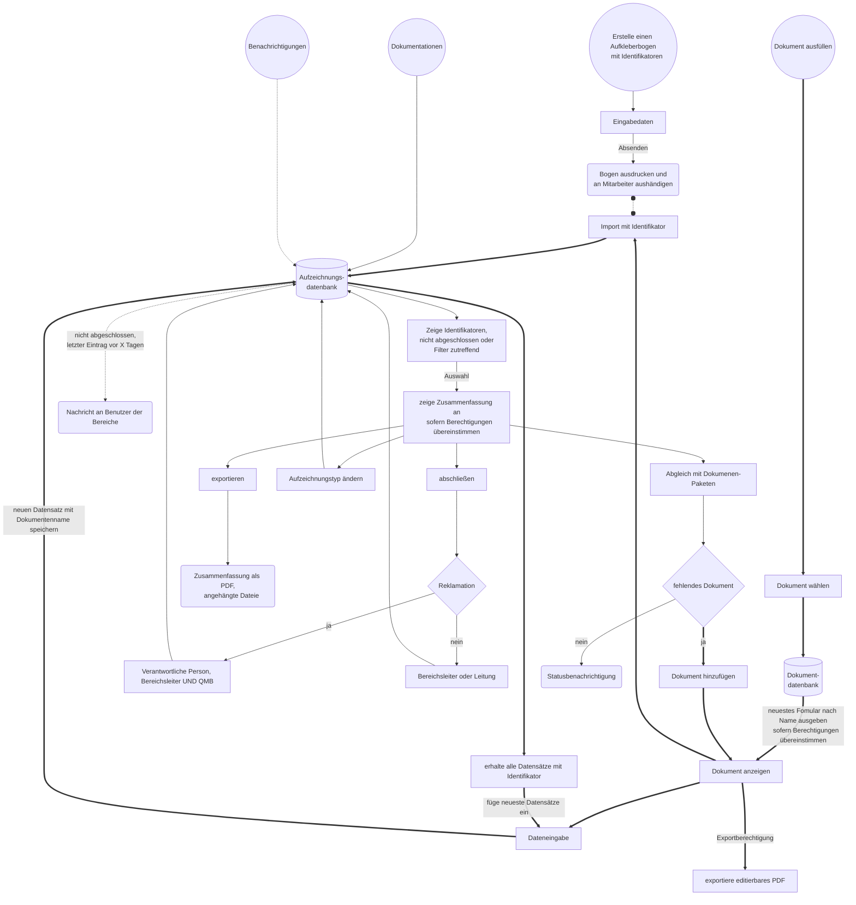
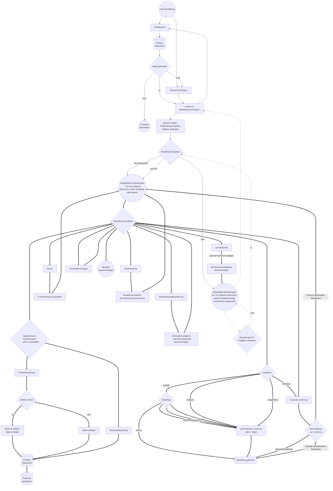

# CARO - Cloud Assisted Records and Operations

## Übersicht
* [Ziele](#ziele)
    * [Erforderliche Infrastruktur](#erforderliche-infrastruktur)
    * [Was es nicht ist](#was-es-nicht-ist)
    * [Vorgesehene regulatorische Zielsetzungen](#vorgesehene-regulatorische-zielsetzungen)
    * [Extras](#extras)
    * [Datenintegrität](#datenintegrität)
    * [Tips](#tips)
* [Module](#module)
    * [Anwendung](#anwendung)
        * [Nutzer](#nutzer)
        * [Anleitung](#Anleitung)
    * [Kommunikation](#kommunikation)
        * [Unterhaltungen](#unterhaltungen)
        * [Verzeichnis](#verzeichnis)
        * [Textvorschläge](#textvorschläge)
    * [Aufzeichnungen](#aufzeichnungen)
        * [Dokumente](#dokumente)
        * [Aufzeichnungen](#aufzeichnungen-1)
        * [Risikomanagement](#risikomanagement)
    * [Kalender](#kalender)
    * [Dateien](#dateien)
    * [Einkauf](#einkauf)
        * [Lieferanten- und Artikelverwaltung](#lieferanten--und-artikelverwaltung)
        * [Bestellung](#bestellung)
    * [Werkzeuge](#werkzeuge)
    * [Audit](#audit)
* [Voraussetzungen](#voraussetzungen)
    * [Installation](#installation)
    * [Laufzeitvariablen](#laufzeitvariablen)
    * [Anmerkungen und Hinweise zur Nutzung](#anmerkungen-und-hinweise-zur-nutzung)
    * [Anpassung](#anpassung)
    * [Importierung von Lieferantenpreislisten](#importierung-von-lieferantenpreislisten)
* [CSV Processor](#csv-prozessor)
* [Regulatorische Anforderungen an die Software](#regulatorische-anforderungen-an-die-software)
    * [Risikoanalyse](#risikoanalyse)
* [Code Design Vorlagen](#code-design-vorlagen)
* [API Dokumentation](#api-dokumentation)
* [Stellungnahme zu technischen Richtlinien zur Datensicherheit](#stellungnahme-zu-technischen-richtlinien-zur-datensicherheit)
    * [Nutzungsrichtlinien für die Nutzung der Anwendung](#nutzungsrichtlinien-für-die-nutzung-der-anwendung)
* [Bibliotheken](#bibliotheken)
* [Lizenz](#lizenz)

Die aktuellste Dokumentation ist verfügbar auf [https://github.com/erroronline1/caro](https://github.com/erroronline1/caro)

# Ziele
Diese Anwendung möchte bei der Umsetzung eines Qualitätsmanagements nach ISO 13485 und der internen Kommunikation unterstützen. Sie wird als Web-Anwendung auf einem Server verwendet. Datensicherheitsmaßnahmen sind auf die Nutzung innerhalb eines geschlossenen Netzwerks ausgelegt. Die Ausgestaltung ermöglicht es der Belegschaft Daten abzurufen und bereitzustellen wo andere Branchensoftware aufgrund ihrer Lizenzmodelle nur eingeschränkt verwendet werden kann.

Datenerfassung soll dabei weitestgehend digital erfolgen und letztendlich papierbasierte Dokumentationen ablösen. Es mag andere Anwendungen mit dem gleichen Ziel geben, diese verfolgen jedoch einen anderen Grundgedanken - die Verwaltung von Reha-Hilfsmitteln anstelle von Sonderanfertigungen, einem Fokus auf orthopädische Schuhversorgungen oder einer primären Produktivitätsüberwachung - anstelle des primären Dokumentationsgedankens der CARO App. Ganz zu schweigen von unübersichtlichen Nutzeroberflächen, die ebenfalls das Ziel einer leicht verständlichen und einfachen Oberfläche steckten.


## Erforderliche Infrastruktur 
Es wird ein Server zur Speicherung und Ausführung der Web-Anwendung, sowie Netzwerkzugriff für alle Endgeräte benötigt. Die Anwendung ist dafür ausgelegt primär auf mobilen Geräten wie beispielsweise Android-Tablets oder iPads genutzt zu werden, kann aber auch auf Desktop-Computern genutzt werden. Manche Funktionen wie die Erstellung von Dokumenten oder Textvorschlägen sind primär nur auf Desktop-Computern mit Maus-Eingabegeräten möglich.

Das oberste Ziel ist die Ausstattung der gesamten Belegschaft oder zumindest von Schlüsselpositionen und Arbeitsplätzen mit mobilen Geräten. Schließlich kann die Administration nicht nach Digitalisierung verlangen ohne eine geeignete Infrastruktur zur Verfügung zu stellen. Scanner sind optional, da Scannen ebensogut mit in den Geräten eingebauten Kameras umgesetzt werden kann.

Für technische Details siehe [Voraussetzungen](#voraussetzungen).

## Was es nicht ist
Abgesehen von einigen architektonischen Entscheidungen ist die Anwendung kein voreingestelltes Qualitätsmanagementsystem. Prozesse, Dokumente und Verantwortlichkeiten sind selbst zu bestimmen. Die Anwendung soll lediglich dabei unterstützen strukturierte Abläufe und eine halbautomatisierte Erfüllung regulatorischer Anforderungen sicherzustellen. *Berechtigungen in den Flussdiagrammen stellen unverbindliche Standardeinstellungen dar.*

Die Anwendung ersetzt kein ERP-System. Daten für den Einkauf sind nur innerhalb der Oberfläche auf Basis der eigenen Datenbank möglich. Diese bewusste Entscheidung richtet sich gegen aufgeblähte Artikelstammdaten von ERP-Systemen derer kaum Herr zu werden möglich ist und die stets eine geschlossene Benutzeroberfläche erfordern. Die Produktdatenbank kann durch Preislisten der Lieferanten bestückt und dabei von vorneherein regelmäßig um unwichtige Daten bereinigt werden.

Bestellungen können von berechtigen Nutzern und Mitgliedern der bestellenden Bereiche jederzeit und zudem nach Ablauf einer definierten Zeit nach Auslieferung gelöscht werden. Dieses Modul dient in erster Linie der internen Kommunikation und nicht einer dauerhaften Dokumentation.

## Vorgesehene regulatorische Zielsetzungen
Abgesehen von der Anwendungsarchitektur muss das Qualitätsmanagementsystem selbst aufgestellt werden. Die meisten regulatorischen Anforderungen werden durch Dokumente erfüllt. Auf diese Weise wird eine zuverlässige Versionskontrolle und Freigabe, sowie eine Prüfung der Erfüllung der Anforderungen innerhalb des [Audit-Moduls](#audit) sichergestellt.

Anwendungsunterstützung Legende:
* ja: die Anwendung unterstützt alle Anforderungen des Kapitels
* teilweise: die Anwendung bietet Funktionen um Teilen der Anforderungen des Kapitels zu entsprechen
* strukturell: die Anforderungen können durch entsprechende Dokumente erfüllt werden

| Regulatorische Anforderung | Anwendungs-unterstützung | Methode | Verweis |
| ---- | ---- | ---- | ---- |
| ISO 13485 4.1.1 Allgemeine Anforderungen an das Qualitäts-managementsystem | teilweise, strukturell | &bull; Die Erfüllung regulatorischer Anforderungen kann im Audit-Modul gegengeprüft werden, sofern Dokumenten die regulatorischen Zusammenhänge zugeordnet wurden.<br/>&bull; *Beschreibung über Dokumente mit "Verfahrens- oder Arbeitsanweisung"-Kontext* | [Dokumente](#dokumente), [Audit](#audit) |
| ISO 13485 4.1.2 Prozessfestlegung | teilweise, strukturell | &bull; Die Anwendung hat ein Modul für die Risikoanalyse um Risken zu erfassen, zu bewerten und Maßnahmen zu beschreiben.<br/>&bull; *Beschreibung über Dokumente mit "Verfahrens- oder Arbeitsanweisung"-Kontext* | [Risikomanagement](#risikomanagement) |
| ISO 13485 4.1.3 Prozessüberwachung | strukturell | &bull; *Beschreibung über Dokumente mit "Verfahrens- oder Arbeitsanweisung"-Kontext*<br/>&bull; *Aufzeichnung über Dokumente mit "Allgemeine Dokumentation"-Kontext* | |
| ISO 13485 4.1.4 Prozesslenkung | strukturell | &bull; *Beschreibung über Dokumente mit "Verfahrens- oder Arbeitsanweisung"-Kontext*<br/>&bull; *Aufzeichnung über Dokumente mit "Allgemeine Dokumentation"-Kontext* | |
| ISO 13485 4.1.5 Ausgegliederte Prozesse | strukturell | &bull; *Beschreibung über Dokumente mit "Verfahrens- oder Arbeitsanweisung"-Kontext*<br/>&bull; *Aufzeichnung über Dokumente mit "Allgemeine Dokumentation"-Kontext* | |
| ISO 13485 4.1.6 Validierung der Anwendung von Computersoftware | strukturell | &bull; Entsprechende Dokumente erfordern einen Identifikator, ähnlich Versorgungsdokumentationen. Software kann ebenfalls einen individuellen Identifikator zugeteilt bekommen.<br/>&bull; Computersoftware und deren Versionsaufzeichnungen können ebenfalls als Arbeitsmittel (7.6) betrachtet werden.<br/>&bull; *Aufzeichnung über Dokumente mit "Überwachung von Arbeitsmitteln"-Kontext* | |
| ISO 13485 4.2.1 Allgemeine Anforderungen an Dokumentation | strukturell | &bull; *Beschreibung über Dokumente mit "Verfahrens- oder Arbeitsanweisung"-Kontext*<br/>&bull; *Aufzeichnung über Dokumente mit "Allgemeine Dokumentation"-Kontext* | |
| ISO 13485 4.2.2 Qualitäts-managementhandbuch | strukturell | &bull; *Beschreibung über Dokumente mit "Verfahrens- oder Arbeitsanweisung"-Kontext* | |
| ISO 13485 4.2.3 Medizinproduktakte | strukturell | &bull; Alle Aufzeichnungen für Versorgungen laufen zusammen. Exporte beinhalten diese Daten und erreichen damit eine vollständige Dokumentation der Maßnahmen.<br/>&bull; Aufzeichnungen für Versorgungen erfordern einen Identifikator um eine Zuordnung sicherzustellen. | [Aufzeichnungen](#aufzeichnungen) |
| ISO 13485 4.2.4 Lenkung von Dokumenten | ja | &bull; Die Anwendung ermöglicht es wiederverwendbare Dokumente und deren Komponenten zu gestalten.<br/>&bull; Nur die jüngsten freigegebenen Komponenten und Dokumente sind für Nutzer erreichbar [so lange eine Netzwerkverbindung besteht](#handhabe-der-netzwerkverbindung).<br/>&bull; Die Erstellung von Komponenten, Dokumenten, Dokumenten-Paketen und Textvorschlägen ist nur berechtigten Nutzern vorbehalten.<br/>&bull; Dokumente und deren Komponenten müssen von [berechtigten Nutzern](#nutzer) freigegeben werden. Die jeweiligen Nutzergruppen werden mit dem Speichern neuer Elemente vom System benachrichtigt. Jedes Mitglied der Gruppen kann die Freigabe erteilen, da davon ausgegangen wird, dass sich diese ihrer Verantwortung bewusst sind. Eine eingeschränkte nutzerspezifische Zuordnung wird hinsichtlich einer Wiederverwendung von Elementen vermieden. Nicht freigegebene Komponenten werden nicht angezeigt, selbst wenn das Dokument selbst freigegeben wurde.<br/>&bull; Neue Dokumente, deren Komponenten, Dokumenten-Pakete und Textvorschläge werden als neuer Eintrag in die Datenbank gelegt. Jeder Eintrag erhält dabei einen Zeitstempel und die Angabe des erstellenden Nutzers. Innerhalb der jeweiligen Verwaltung wird primär eine der jüngsten freigegebenen Versionen ausgewählt. Eine erweiterte Auswahl ermöglicht aber den Zugriff auf eine beliebige vorherige Version. Komponenten und Dokumente können nach einer vollständigen Freigabe nicht mehr gelöscht werden. Nicht freigegebene Komponenten und Dokumente sind für eine Verwendung nicht erreichbar.<br/>&bull; Bilder für Komponenten können nach einer Freigabe nicht mehr gelöscht werden. Ihrem Dateinamen wird der Name der Komponenten und ein Zeitstempel beigefügt. Sie sind dauerhaft auch für ältere Versionen verfügbar, können aber nicht wiederverwendet werden, da sie fester Bestandteil der jeweiligen Komponente sind.<br/>&bull; Dokumente können primär nur von berechtigten Nutzern blanco oder vorausgefüllt exportiert werden um eine Verbreitung veralteter Versionsstände zu vermeiden. Ersteller der Dokumente können jedoch eine allgemeine Erlaubnis erteilen.<br/>&bull; Dokumente können von authorisierten Nutzern zu jedem Gültigkeitstag nachgebildet werden um Unterschiede identifizieren zu können.<br/>&bull; Externe Dokumente werden gelenkt und erhalten die Angabe der Einrichtung, des regulatorischen Zusammenhangs, einer möglichen Außerbetriebnahme und des jeweils letzten bearbeitenden Mitarbeiters. | [Dokumente](#dokumente), [Dateien](#dateien) |
| ISO 13485 4.2.5 Lenkung von Aufzeichnungen | ja | &bull; Aufzeichnungen laufen zusammen und sind innerhalb der Anwendung nicht löschbar. Jeder Eintrag erhält einen Zeitstempel und den Namen des übermittelnden Nutzers. Zusammenfassungen führen alle Daten zusammen und stellen sie in der Reihenfolge ihrer Übermittlung dar.<br/>&bull; Bilder und Dateien für Aufzeichnungen werden nicht gelöscht. Ihren Dateinamen wird der Identifikator und Zeitstempel der Übermittlung beigefügt.<br/>&bull; Es werden nicht nur Aufzeichnungen selbst, sondern auch mögliche Änderungen am Aufzeichnungstyp gespeichert.<br/>&bull; Aufzeichnungen können jederzeit exportiert werden falls eine zusätzliche Revisionssicherheit gewünscht wird oder die Daten mit dritten Parteien geteilt werden müssen.<br/>&bull; Der Zugriff auf die Inhalte der Anwendung inklusive vertraulicher personenbezogener Patientendaten erfordert eine persönliche Anmeldung registrierter Nutzer. | [Nutzer](#nutzer), [Aufzeichnungen](#aufzeichnungen) |
| ISO 13485 5.1 Verantwortung der Leitung | strukturell | &bull; *Beschreibung über Dokumente mit "Verfahrens- oder Arbeitsanweisung"-Kontext* | |
| ISO 13485 5.2 Kundenorientierung | strukturell | &bull; *Beschreibung über Dokumente mit "Verfahrens- oder Arbeitsanweisung"-Kontext* | |
| ISO 13485 5.3 Qualitätspolitik | strukturell | &bull; *Beschreibung über Dokumente mit "Verfahrens- oder Arbeitsanweisung"-Kontext* | |
| ISO 13485 5.4.1 Qualitätsziele | strukturell | &bull; *Beschreibung über Dokumente mit "Verfahrens- oder Arbeitsanweisung"-Kontext* | |
| ISO 13485 5.4.2 Planung des Qualitäts-managementsystems | strukturell | &bull; *Beschreibung über Dokumente mit "Verfahrens- oder Arbeitsanweisung"-Kontext* | |
| ISO 13485 5.5.1 Verantwortung und Befugnis | strukturell | &bull; Nutzern werden [Berechtigungen](#nutzer) erteilt, die spezielle Zugriffe ausdrücklich erlauben oder das Menü vereinfachen.<br/>&bull; Berechtigungen definieren den Zugriff auf Funktionen der Anwendung.<br/>&bull; Nutzer können eine PIN erhalten um Bestellungen freizugeben.<br/>&bull; Das Nutzerverzeichnis listet alle Nutzer auch gruppiert nach organisatorischen Bereichen und Berechtigungen auf.<br/>&bull; *Beschreibung über Dokumente mit "Verfahrens- oder Arbeitsanweisung"-Kontext* | [Nutzer](#nutzer), [Verzeichnis](#verzeichnis), [Laufzeitvariablen](#laufzeitvariablen) |
| ISO 13485 5.5.2 Beauftragter der Leitung | strukturell | &bull; *Beschreibung über Dokumente mit "Verfahrens- oder Arbeitsanweisung"-Kontext* | |
| ISO 13485 5.5.3 Interne Kommunikation | ja, strukturell | &bull; Die Anwendung hat einen internen [Nachrichtendienst](#unterhaltungen). Dieser Dienst wird von internen Modulen genutzt um eine zielführende Datenübermittlung sicherzustellen, z.B. für die Benachrichtigung von Nutzergruppen für die Freigabe von Dokumenten und deren Komponenten, die Benachrichtigung von Nutzergruppen über zurückgewiesene Bestellungen und geänderten Bestellstati, Benachrichtigungen zu zusätzlich erforderlichen Rechechen zu einer Bestellung an den Besteller, Benachrichtigung von Nutzergruppen zu geplanten Ereignissen, Benachrichtigungen über länger unbearbeitete Vorgänge<br/>&bull; Die Anwendung hat einen integrierten Kalender. Dieser soll die Aufgabenplanung und Bearbeitung zeitkritischer wiederkehrender Ereignisse wie Kalibrationsmaßnahmen und dergleichen unterstützen.<br/>&bull; Die Anwendung hat ein Bestellmodul. Bestellungen können vorbereitet und freigegeben werden. Der Einkauf hat alle erforderlichen Daten aus der Lieferantenpreisliste vorliegen um die Bestellung bearbeiten zu können; die Markierung des Bestellstatus erlaubt eine zeitnahe Rückmeldung an den Besteller.<br/>&bull; Die Anwendung hat einen Sharepoint für Dateien und einen STL-Betrachter für 3D-Modelle um einfach Informationen austauschen zu können, welche die Möglichkeiten des Nachrichtendienstes übersteigen.<br/>&bull; Die Oberfläche informiert über neue Nachrichten, freigegebene neue Bestellungen (Einkauf) und unerledigte Kalenderereignisse. Die Startseite zeigt zudem eine kurze Zusammenfassung offener Versorgungsfälle und geplanter Ereignisse der aktuellen Kalenderwoche sowie unerledigter Ereignisse.<br/>&bull; Dokumente können auf andere Dokumente verweisen. Dabei können diese nur angezeigt werden (z.B. Verfahrens- oder Arbeitsanweisungen) oder mit Übernahme des Identifikators für einen reibungslosen Transfer sorgen.<br/>&bull; *Beschreibung über Dokumente mit "Verfahrens- oder Arbeitsanweisung"-Kontext* | [Unterhaltungen](#unterhaltungen), [Kalender](#kalender), [Bestellung](#bestellung), [Dateien](#dateien), [Audit](#audit) |
| ISO 13485 5.6.1 Allgemeine Anforderung an Management-bewertung | strukturell | &bull; *Beschreibung über Dokumente mit "Verfahrens- oder Arbeitsanweisung"-Kontext*<br/>&bull; *Aufzeichnung über Dokumente mit "Allgemeine Dokumentation"-Kontext* | |
| ISO 13485 5.6.2 Eingaben für die Bewertung | strukturell | &bull; *Beschreibung über Dokumente mit "Verfahrens- oder Arbeitsanweisung"-Kontext*<br/>&bull; *Aufzeichnung über Dokumente mit "Allgemeine Dokumentation"-Kontext* | |
| ISO 13485 5.6.3 Ergebnisse der Bewertung | strukturell | &bull; *Beschreibung über Dokumente mit "Verfahrens- oder Arbeitsanweisung"-Kontext*<br/>&bull; *Aufzeichnung über Dokumente mit "Allgemeine Dokumentation"-Kontext* | |
| ISO 13485 6.1 Bereitstellung von Ressourcen | strukturell | &bull; *Beschreibung über Dokumente mit "Verfahrens- oder Arbeitsanweisung"-Kontext* | |
| ISO 13485 6.2 Personelle Ressourcen | ja, strukturell | &bull; Der Liste der gewünschten Fähigkeiten sollen die für das Unternehmen angemessenen Punkte [hinzugefügt](#anpassung) werden um eine zielführende Übersicht über die Erfüllung zu ermöglichen.<br/>&bull; innerhalb der Nutzerverwaltung können Schulungen, deren Ablaufdaten, Erfahrungspunkte und anhängende Dokumente hinzugefügt werden.<br/>&bull; Nutzern können Fähigkeiten und deren Niveau gemäß der bestimmten für das Unternehmen [erforderlichen Fähigkeiten](#anpassung) (Aufgabenmatrix) zugeordnet werden.<br/>&bull; Eine Übersicht über die Schulungen und Fähigkeiten ist im Audit-Modul einsehbar.<br/>&bull; Fähigkeiten und Schulungen können von berechtigen Nutzern gelöscht werden. Eine Übersicht kann im Audit-Modul exportiert werden.<br/>&bull; Schulungen können durch berechtigte Nutzer durch ein eigenes Dokument bewertet werden. Fällige Bewertungen werden in den Kalender eingetragen.<br/>&bull; *Beschreibung über Dokumente mit "Verfahrens- oder Arbeitsanweisung"-Kontext* | [Nutzer](#nutzer), [Anpassung](#anpassung), [Audit](#audit) |
| ISO 13485 6.3 Infrastruktur | strukturell | &bull; *Beschreibung über Dokumente mit "Verfahrens- oder Arbeitsanweisung"-Kontext*<br/>&bull; *Aufzeichnung über Dokumente mit "Allgemeine Dokumentation"-Kontext*<br/>&bull; *Aufzeichnung über Dokumente mit "Überwachung von Arbeitsmitteln"-Kontext* | |
| ISO 13485 6.4.1 Arbeitsumgebung | strukturell | &bull; *Beschreibung über Dokumente mit "Verfahrens- oder Arbeitsanweisung"-Kontext* | |
| ISO 13485 6.4.2 Lenkung der Kontamination | strukturell | &bull; *Beschreibung über Dokumente mit "Verfahrens- oder Arbeitsanweisung"-Kontext* | |
| ISO 13485 7.1 Planung der Produktrealisierung | strukturell | &bull; *Beschreibung über Dokumente mit "Verfahrens- oder Arbeitsanweisung"-Kontext*<br/>&bull; *Aufzeichnung über Dokumente mit "Vorgangsdokumentation"-Kontext* | |
| ISO 13485 7.2.1 Ermittlung der Anforderungen bzgl. des Produkts | strukturell | &bull; *Beschreibung über Dokumente mit "Verfahrens- oder Arbeitsanweisung"-Kontext*<br/>&bull; *Aufzeichnung über Dokumente mit "Vorgangsdokumentation"-Kontext* | |
| ISO 13485 7.2.2 Bewertung der Anforderungen bzgl. des Produkts | strukturell | &bull; *Beschreibung über Dokumente mit "Verfahrens- oder Arbeitsanweisung"-Kontext*<br/>&bull; *Aufzeichnung über Dokumente mit "Vorgangsdokumentation"-Kontext* | |
| ISO 13485 7.2.3 Kommunikation mit Kunden | strukturell | &bull; *Beschreibung über Dokumente mit "Verfahrens- oder Arbeitsanweisung"-Kontext*<br/>&bull; *Aufzeichnung über Dokumente mit "Vorgangsdokumentation"-Kontext* | |
| ISO 13485 7.3.1 Allgemeine Anforderungen an Entwicklung | strukturell | &bull; *Beschreibung über Dokumente mit "Verfahrens- oder Arbeitsanweisung"-Kontext* | |
| ISO 13485 7.3.2 Entwicklungsplanung | strukturell | &bull; *Beschreibung über Dokumente mit "Verfahrens- oder Arbeitsanweisung"-Kontext*<br/>&bull; *Aufzeichnung über Dokumente mit "Vorgangsdokumentation"- oder Allgemeine Dokumentation"-Kontext* | |
| ISO 13485 7.3.3 Entwicklungseingaben | strukturell | &bull; *Beschreibung über Dokumente mit "Verfahrens- oder Arbeitsanweisung"-Kontext*<br/>&bull; *Aufzeichnung über Dokumente mit "Vorgangsdokumentation"- oder Allgemeine Dokumentation"-Kontext* | |
| ISO 13485 7.3.4 Entwicklungsergebnisse | strukturell | &bull; *Beschreibung über Dokumente mit "Verfahrens- oder Arbeitsanweisung"-Kontext*<br/>&bull; *Aufzeichnung über Dokumente mit "Vorgangsdokumentation"- oder Allgemeine Dokumentation"-Kontext* | |
| ISO 13485 7.3.5 Entwicklungsbewertung | strukturell | &bull; *Beschreibung über Dokumente mit "Verfahrens- oder Arbeitsanweisung"-Kontext*<br/>&bull; *Aufzeichnung über Dokumente mit "Vorgangsdokumentation"- oder Allgemeine Dokumentation"-Kontext* | |
| ISO 13485 7.3.6 Entwicklungs-verifizierung | strukturell | &bull; *Beschreibung über Dokumente mit "Verfahrens- oder Arbeitsanweisung"-Kontext*<br/>&bull; *Aufzeichnung über Dokumente mit "Vorgangsdokumentation"- oder Allgemeine Dokumentation"-Kontext* | |
| ISO 13485 7.3.7 Entwicklungsvalidierung | strukturell | &bull; *Beschreibung über Dokumente mit "Verfahrens- oder Arbeitsanweisung"-Kontext*<br/>&bull; *Aufzeichnung über Dokumente mit "Vorgangsdokumentation"- oder Allgemeine Dokumentation"-Kontext* | |
| ISO 13485 7.3.8 Übertragung der Entwicklung | strukturell | &bull; *Beschreibung über Dokumente mit "Verfahrens- oder Arbeitsanweisung"-Kontext*<br/>&bull; *Aufzeichnung über Dokumente mit "Vorgangsdokumentation"- oder Allgemeine Dokumentation"-Kontext* | |
| ISO 13485 7.3.9 Lenkung von Entwicklungs-änderungen | strukturell | &bull; *Beschreibung über Dokumente mit "Verfahrens- oder Arbeitsanweisung"-Kontext*<br/>&bull; *Aufzeichnung über Dokumente mit "Vorgangsdokumentation"- oder Allgemeine Dokumentation"-Kontext* | |
| ISO 13485 7.3.10 Entwicklungsakten | strukturell | &bull; *Beschreibung über Dokumente mit "Verfahrens- oder Arbeitsanweisung"-Kontext*<br/>&bull; *Aufzeichnung über Dokumente mit "Vorgangsdokumentation"- oder Allgemeine Dokumentation"-Kontext* | |
| ISO 13485 7.4.1 Beschaffungsprozess | ja, strukturell | &bull; Die Beschaffung wird durch die Anwendung begleitet. Lieferanten und Produkte können zur Datenbank hinzugefügt werden.<br/>&bull; Eine Lieferantenbewertung ist in der Lieferantenverwaltung durch einschlägige Dokumente entsprechenden Kontexts implementiert und wird durch die Bereitstellung von reduzierten Daten der Bestellungen in Bezug auf Lieferzeiten, Stornos und Rücksendungen im Audit-Modul unterstützt.<br/>&bull; Lieferanteneinträge können durch Dokumente, Zertifikate und deren Gültigkeitsdaten ergänzt werden. Die Gültigkeit von Zertifikaten können angezeigt und im Audit-Modul exportiert werden. Lieferanten können als inaktiv markiert, jedoch nicht gelöscht werden. Produkte, die deaktiviert werden sind über das Bestellmodul nicht erreichbar.<br/>&bull; Produkte können mit Dokumenten ergänzt werden, welche nicht gelöscht werden. Den Dateinamen werden der Lieferantenname, der Zeitstempel der Übermittlung und die Artikelnummer angefügt.<br/>&bull; Produkte sollen eingeführt werden. Produkteinführungen können durch berechtigte Nutzer freigegeben, verwehrt oder entzogen werden. Alle Nutzer (außer Gruppen) sammeln zuvor die erforderlichen Informationen. Produkteinführungen werden durch eigene Dokumente mit dem entsprechenden Kontext umgesetzt.<br/>&bull; Produkte werden im Falle einer Preislistenaktualisierung automatisch gelöscht, es sei denn es fand eine Produkteinführung statt, es wurde eine Stichprobenprüfung durchgeführt, es wurde ein Dokument beigefügt, es wurde ein Alias festgelegt, es wurde schon einmal bestellt<br/>&bull; Änderungen an Produkteinträgen ist nur für berechtigte Nutzer möglich.<br/>&bull; Es können Textvorschläge für den Einkauf erstellt werden um Nachrichten zur Anforderung regulatorischer Unterlagen für Produkte mit besonderer Aufmerksamkeit oder eines erneuerten Zertifikats vorzubereiten.<br/>&bull; *Beschreibung über Dokumente mit "Verfahrens- oder Arbeitsanweisung"-Kontext*<br/>&bull; *Bereitstellung von Dokumenten mit "Lieferantenbewertung"-Kontext* | [Lieferanten- und Artikelverwaltung](#lieferanten--und-artikelverwaltung), [Bestellung](#bestellung), [Audit](#audit) |
| ISO 13485 7.4.2 Beschaffungsangaben | teilweise | &bull; Bestellungen nutzen bevorzugt die Angaben der herstellereigenen Preislisten.<br/>&bull; Aufzeichnungen über Bestellungen muss jedoch über eine Drittsoftware (ERP) umgesetzt werden. | [Lieferanten- und Artikelverwaltung](#lieferanten--und-artikelverwaltung), [Bestellung](#bestellung) |
| ISO 13485 7.4.3 Verifizierung von beschafften Produkten | ja, strukturell | &bull; Die Stichprobenprüfung nach MDR §14 erbittet eine Prüfung für jedes [als Handelsware definierte](#importierung-von-lieferantenpreislisten) Produkt, sofern die letzte zurückliegende Prüfung innerhalb des Sortiments dieses Lieferanten die mdr14_sample_interval-Zeitspanne überschreitet, z.B. einmal jährlich. Dies betrifft alle Produkte welche nicht innerhalb der mdr14_sample_reusable-Zeitspanne liegen, welche ebenfalls für jeden Lieferanten individuell festgelegt werden kann, wenn es das Sortiment erfordert. Beide Werte erhalten durch die [config.ini](#laufzeitvariablen) einen Standardwert.<br/>&bull; Stichprobenprüfungen werden durch eigene Dokumente mit dem entsprechenden Kontext umgesetzt. Alle Nutzer (außer Gruppen) sammeln die erforderlichen Informationen.<br/>&bull; Stichprobenprüfungen können durch berechtigte Nutzer zurückgezogen werden.<br/>&bull; *Bereitstellung von Dokumenten mit "MDR §14 Stichprobenprüfung"- und "Produkteinführung"-Kontext* | [Lieferanten- und Artikelverwaltung](#lieferanten--und-artikelverwaltung), [Bestellung](#bestellung) |
| ISO 13485 7.5.1 Lenkung der Produktion und Dienstleistungs-erbringung | teilweise, strukturell | &bull; Entsprechende Dokumente zeichnen die Schritte der Fertigung auf. Mit dem Zugriff auf die Dokumentationen ist der aktuelle Status erkennbar. Ist beispielsweise eine Aufzeichnung für einen Fertigungsabschnitt vorhanden, bei dem die Arbeitsschritte festgelegt werden, kann das Dokument auch ein Auswahlfeld für die Erledigung beinhalten. In einem ersten Dokumentationsschritt können die Schritte festgelegt werden, in einem folgenden kann das Dokument erneut verwendet und das Auswahlfeld markiert werden. Damit wird der Zeitpunkt und eintragende Nutzer aufgezeichnet.<br/>&bull; Dokumenten-Kontexte erlauben eine Zuordnung als Verfahrens- oder Arbeitsanweisungen.<br/>&bull; Der integrierte Kalender unterstützt bei der Planung von Arbeiten. | [Dokumente](#dokumente), [Aufzeichnungen](#aufzeichnungen-1), [Kalender](#kalender) |
| ISO 13485 7.5.2 Sauberkeit von Produkten | strukturell | &bull; *Beschreibung über Dokumente mit "Verfahrens- oder Arbeitsanweisung"-Kontext* | |
| ISO 13485 7.5.3 Tätigkeiten bei der Installation | strukturell | &bull; *Beschreibung über Dokumente mit "Verfahrens- oder Arbeitsanweisung"-Kontext*<br/>&bull; *Aufzeichnung über Dokumente mit "Vorgangsdokumentation"- oder Allgemeine Dokumentation"-Kontext* | |
| ISO 13485 7.5.4 Tätigkeiten zur Instandhaltung | strukturell | &bull; *Beschreibung über Dokumente mit "Verfahrens- oder Arbeitsanweisung"-Kontext*<br/>&bull; *Aufzeichnung über Dokumente mit "Vorgangsdokumentation"- oder Allgemeine Dokumentation"-Kontext* | |
| ISO 13485 7.5.5 Anforderungen für sterile Medizinprodukte | strukturell | &bull; *Beschreibung über Dokumente mit "Verfahrens- oder Arbeitsanweisung"-Kontext* | |
| ISO 13485 7.5.6 Validierung der Prozesse zur Produktion und Dienstleistung-erbringung | strukturell | &bull; *Beschreibung über Dokumente mit "Verfahrens- oder Arbeitsanweisung"-Kontext*<br/>&bull; *Aufzeichnung über Dokumente mit "Vorgangsdokumentation"- oder Allgemeine Dokumentation"-Kontext* | |
| ISO 13485 7.5.7 Validierung von Sterilisations-prozessen | strukturell | &bull; *Beschreibung über Dokumente mit "Verfahrens- oder Arbeitsanweisung"-Kontext*<br/>&bull; *Aufzeichnung über Dokumente mit "Vorgangsdokumentation"- oder Allgemeine Dokumentation"-Kontext* | |
| ISO 13485 7.5.8 Identifizierung | strukturell | &bull; Aufzeichnungen erfordern einen Identifikator. Dieser Identifikator ist derzeit als QR-Code implementiert, welcher exportiert und ausgedruckt, sowie mit dem integrierten Scanner ausgelesen werden kann. Aufkleberbögen mit dem Code können auch zur Kennzeichnung von Produkten und Komponenten während der Herstellung verwendet werden. | [Aufzeichnungen](#aufzeichnungen-1) |
| ISO 13485 7.5.9 Rückverfolgbarkeit | strukturell | &bull; Mehrfach-Scannerfelder innerhalb der Vorgangsdokumentation ermöglichen eine Rückverfolgung eingesetzter Waren<br/>Voraussetzung sind entweder<br/>&bull; in der ERP-Software generierte Codes die eine Produktzuordnung ermöglichen, oder<br/>&bull; die Erstellung von Labeln für Artikel in der Bestellverwaltung | [Dokumente](#dokumente), [Bestellung](#bestellung)|
| ISO 13485 7.5.10 Eigentum des Kunden | | | |
| ISO 13485 7.5.11 Produkterhaltung | strukturell | &bull; *Beschreibung über Dokumente mit "Verfahrens- oder Arbeitsanweisung"-Kontext* | |
| ISO 13485 7.6 Lenkung von Überwachungs- und Messmitteln | strukturell | &bull; Entsprechende Dokumente erfordern einen Identifikator, ähnlich Versorgungsdokumentationen. Messmittel können ebenfalls einen individuellen Identifikator zugeteilt bekommen.<br/>&bull; Eine Berücksichtigung eines Kalendereintrags innerhalb dieser Dokumente kann dabei unterstützen zukünftige Ereignisse zu planen und Mitarbeiter zu informieren. | [Dokumente](#dokumente), [Aufzeichnungen](#aufzeichnungen-1), [Kalender](#kalender) |
| ISO 13485 8.1 Allgemeine Überwachungs-, Mess-, Analyse- und Verbesserungsprozesse | strukturell | &bull; *Beschreibung über Dokumente mit "Verfahrens- oder Arbeitsanweisung"-Kontext* | |
| ISO 13485 8.2.1 Rückmeldungen | strukturell | &bull; *Beschreibung über Dokumente mit "Verfahrens- oder Arbeitsanweisung"-Kontext* | |
| ISO 13485 8.2.2 Reklamations-bearbeitung | strukturell | &bull; Aufzeichnungen erfordern eine Stellungnahme ob sie in Zusammenhang mit einer Reklamation erfolgen. Betroffene Aufzeichnungen werden in der Übersicht markiert und der Zeitstempel der jeweiligen Einträge um einen entsprechenden Kommentar ergänzt. Eine Übersicht kann im Audit-Modul angezeigt werden.<br/>&bull; Das als abgeschlossen Kennzeichnen von Aufzeichnungen, die eine Reklamation beinhalten erfordert eine Aktion aller definierter Rollen. | [Aufzeichnungen](#aufzeichnungen-1), [Audit](#audit) |
| ISO 13485 8.2.3 Berichterstattung an Regulierungsbehörden | strukturell | &bull; Innerhalb der Dokumente für die Vorkommnisaufzeichnungen können Links z.B. zu den [IMDRF Adverse Event Terminology Web Browsers](https://www.imdrf.org/working-groups/adverse-event-terminology) eingefügt werden um die erforderlichen Codes zu finden.<br/>&bull; *Aufzeichnung über Dokumente mit "Vorkommnis"-Kontext* | |
| ISO 13485 8.2.4 Internes Audit | teilweise, strukturell | Das Audit-Modul sammelt Daten aus der Anwendung und ist in der Lage Exporte zur Verfügung zu stellen für<br/>&bull; Aufzeichnungen über Produkteinführungen. Sofern aktuell bestellte Artikel nicht berücksichtigt sind erfolgt ein Hinweis.<br/>&bull; Aufzeichnungen über Stichprobenprüfungen. Sofern aktuell Lieferanten für eine Prüfung fällig sind erfolgt ein Hinweis.<br/>&bull; eine Übersicht über die aktuell gültigen Dokumente und deren Komponenten.<br/>&bull; Fähigkeiten und Schulungen der Mitarbeiter mit ggf. markierten Ablaufdaten.<br/>&bull; Lieferantenlisten mit den jeweiligen letzten Preislistenaktualisierungen, der letzten Stichprobenprüfung und Details zu Zertifikaten sofern bereitgestellt.<br/>&bull; Bestellstatistiken.<br/>&bull; Reklamationen.<br/>&bull; die Berücksichtung regulatorischer Anforderungen durch verwendete Dokumente und Dokumente.<br/>&bull; Risikoanalysen. | [Audit](#audit) |
| ISO 13485 8.2.5 Überwachung und Messung von Prozessen | strukturell | &bull; *Beschreibung über Dokumente mit "Verfahrens- oder Arbeitsanweisung"-Kontext* | |
| ISO 13485 8.2.6 Überwachung und Messung des Produkts | strukturell | &bull; *Beschreibung über Dokumente mit "Verfahrens- oder Arbeitsanweisung"-Kontext* | [Dokumente](#dokumente), [Aufzeichnungen](#aufzeichnungen-1) |
| ISO 13485 8.3.1 Lenkung nichtkonformer Produkte | strukturell | &bull; *Beschreibung über Dokumente mit "Verfahrens- oder Arbeitsanweisung"-Kontext* | |
| ISO 13485 8.3.2 Maßnahmen als Reaktion auf vor der Auslieferung festgestellte nichtkonforme Produkte | strukturell | &bull; *Beschreibung über Dokumente mit "Verfahrens- oder Arbeitsanweisung"-Kontext* | |
| ISO 13485 8.3.3 Maßnahmen als Reaktion auf nach der Auslieferung festgestellte nichtkonforme Produkte | strukturell | &bull; *Beschreibung über Dokumente mit "Verfahrens- oder Arbeitsanweisung"-Kontext* | |
| ISO 13485 8.3.4 Nacharbeit | ja | &bull; Aufzeichnungen erfordern eine Stellungnahme ob sie in Zusammenhang mit einer Nacharbeit erfolgen. Dokumente unterscheiden sich jedoch primär nicht, daher folgt die Dokumentation von Maßnahmen den selben Aufzeichnungsprozessen wie eine übliche Versorgungsdokumentation. | [Aufzeichnungen](#aufzeichnungen-1) |
| ISO 13485 8.4 Datenanalyse | teilweise, strukturell | &bull; Eine Lieferantenbewertung wird durch die Bereitstellung von reduzierten Daten der Bestellungen in Bezug auf Lieferzeiten, Stornos und Rücksendungen im Audit-Modul unterstützt. Es besteht jedoch ein individueller Interpretationsspielraum der bereitgestellten Daten. | [Bestellung](#bestellung), [Audit](#audit) |
| ISO 13485 8.5.1 Verbesserung | strukturell | &bull; *Beschreibung über Dokumente mit "Verfahrens- oder Arbeitsanweisung"-Kontext* | |
| ISO 13485 8.5.2 Korrekturmaßnahmen | strukturell | &bull; *Beschreibung über Dokumente mit "Verfahrens- oder Arbeitsanweisung"-Kontext* | |
| ISO 13485 8.5.3 Vorbeugungsmaßnahmen | strukturell | &bull; *Beschreibung über Dokumente mit "Verfahrens- oder Arbeitsanweisung"-Kontext* | |
| MPDG §83 Medizinprodukteberater | ja | &bull; Medizinprodukteberater werden durch die entsprechende Berechtigung in den Nutzereinstellungen festgelegt und als solche im Verzeichnis angezeigt. | [Nutzer](#nutzer) |
| ISO 14971 Risikomanagement | teilweise | &bull; Die Anwendung hat ein Modul für die Risikoanalyse um Risken zu erfassen, zu bewerten und Maßnahmen zu beschreiben.<br/>&bull; Beispiele von Ereignissen und Umständen gemäß Anhang C und den Empfehlungen der [DGIHV](https://www.dgihv.org) ist für die Nutzung standardmäßig verbereitet. | [Risikomanagement](#risikomanagement) |
| SGB 5 §33 Zusätzliche Kosten | strukturell | &bull; *Aufzeichnung über Dokumente mit "Vorgangsdokumentation"-Kontext* | |
| MDR Art. 14 Stichprobenprüfung | ja, strukturell | &bull; Eine Stichprobenprüfung ist implementiert. Ein entsprechendes Dokument muss erstellt werden, in Frage kommende Artikel geben sich bei Bestellung zu erkennen. | [Lieferanten- und Artikelverwaltung](#lieferanten--und-artikelverwaltung), [Bestellung](#bestellung), [Dokumente](#dokumente),[Importierung von Lieferantenpreislisten](#importierung-von-lieferantenpreislisten) |
| MDR Art. 61 Klinische Bewertung | strukturell | &bull; *Aufzeichnung über Dokumente mit "Vorgangsdokumentation"-Kontext* | |
| MDR Art. 83 Nachbeobachtung | strukturell | &bull; Die Überwachung nach dem Inverkehrbringen ist kein direkter Bestandteil der Anwendung. Die regulatorische Anforderung Patienten zur Hilfsmittelkontrolle einzubestellen ist nicht integriert, da eine konsequente Erfassung von Kontaktdaten die Arbeitsbelastung vergrößern würde und redundant wäre, da eine zusätzliche ERP-Software ohnehin erforderlich ist. Statt dessen können deren Datenexporte von Kundendaten genutzt und ein CSV-Filter mit individuellen Regeln erstellt werden um eine Liste passender Empfänger für Serienbriefe zu erhalten. Die Speicherung dieser Liste kann als Nachweis der Erfüllung der regulatorischen Anforderung genutzt werden. | [Werkzeuge](#werkzeuge), [CSV-Filter](#csv-prozessor) |
| MDR Anhang 1 Grundlegende Sicherheits- und Leistungsanforderungen | strukturell | &bull; *Aufzeichnung über Dokumente mit "Vorgangsdokumentation"-Kontext* | |
| MDR Anhang 4 EU-Konformitätserklärung | strukturell | &bull; *Aufzeichnung über Dokumente mit "Vorgangsdokumentation"-Kontext* | |
| MDR Anhang 13 Verfahren für Sonderanfertigungen | strukturell | &bull; *Aufzeichnung über Dokumente mit "Vorgangsdokumentation"-Kontext* | |
| MDR Anhang 14 Klinische Bewertung und klinische Nachbeobachtung nach dem Inverkehrbringen | strukturell | &bull; *Aufzeichnung über Dokumente mit "Vorgangsdokumentation"-Kontext* | |
| MPBetreibV | strukturell | &bull; *Aufzeichnung über Dokumente mit "Überwachung von Arbeitsmitteln"-Kontext* | |
| ArbSchG §3 / BAG Az. 1 ABR 22/21 | ja | &bull; Registrierte Nutzer können ihre Arbeitszeiten, Urlaube, Krankheitsausfälle, etc. erfassen. Die Einträge können unter Berücksichtigung von Arbeitszeitgesetzen als Dokumentation exportiert werden. | [Kalender](#kalender) |


[Übersicht](#übersicht)

## Extras
* Textempfehlungen
    * Standard- und anpassbare [Textvorschläge](#textvorschläge) können definiert werden um eine durchgängige Sprachregelung zu unterstützen.
* Dateiverteilung
    * Die Anwendung hat einen [Sharepoint](#dateien) für Dateien und einen [STL-Betrachter](#werkzeuge) um vereinfacht Informationen austauschen zu können.
* CSV-Filterung
    * Die Anwendung ist in der Lage CSV-Dateien auf vielfältige Weise zu [filtern und zu verarbeiten](#csv-prozessor).

[Übersicht](#übersicht)

## Datenintegrität
Aufzeichnungen speichern stets den Namen des übermittelnden Nutzers ab. Gruppen-Nutzer sind daher nicht empfohlen, jedoch mit eingeschränkten Berechtigungen möglich. Individuelle Nutzer sind indes vorgesehen. Berechtigte Nutzer können andere Nutzer anlegen, bearbeiten und löschen. Zur Vereinfachung wird ein 64 Byte Token erstellt. Dieser Token wird in einen QR-Code umgewandelt, welcher bei der Anmeldung gescannt werden kann. Dadurch muss sich kein Nutzername und Kennwort gemerkt werden und es kann auf die Eingabe mehrerer Felder bei der Anmeldung verzichtet werden. Dieser Vorgang ist daher schnell umsetzbar und erlaubt einen raschen Wechsel zwischen unterschiedlichen Anmeldungen bei eingeschränkter Verfügbarkeit von Endgeräten.

Formulardaten und Serveranfragen beinhalten teilweise IDs um spezifische Inhalte zu erreichen. Technisch gesehen ist es möglich diese Daten und Anfragen zu manipulieren. Dennoch wird dieses Vorgehen als angemessen bewertet, da Serververarbeitungen nicht in der Lage sind auf die ursprüngliche Intention zu schließen. Dies erscheint nicht weniger sicher als eine beabsichtige Falschangabe in einer beliebigen papierbasierten Dokumentation.

Dokumente können ein digitales Unterschriftenfeld beinhalten. Dabei ist zu beachten, dass es sich hierbei mangels Zertifizierung nicht um ein dokumentenechtes Verfahren handelt. Ob das Verfahren innerhalb festgelegter Prozesse angemessen ist, ist eine persönliche Ermessenssache.

[Übersicht](#übersicht)

## Tips
* Ein Kalender-Element kann in die Überwachungs-Dokumente eingebunden werden um während der Bearbeitung direkt das nächste Fälligkeitdatum festzulegen.
* Die Option einer "Großväterregelung" in der Produkteinführung kann insbesondere beim Übergang von einem anderen Qualitätsmanagementsystem in die CARO App die Dinge vereinfachen. Es muss dabei aber sichergestellt sein, dass die Anforderungen zuvor wirklich erfüllt wurden.


[Übersicht](#übersicht)

# Module

## Anwendung


### Nutzer
Die Anwendung stellt ein zugeordnetes Rollen-Management für registrierte Nutzer zur Verfügung. Der gesamte Inhalt ist nur für angemeldete Nutzer zugänglich. Nutzer können unterschiedliche Berechtigungen erhalten. Diese Berechtigungen steuern, welche Inhalte erreichbar sind oder welche Änderungen erlaubt sind. Die Grundlage basiert auf den für das Unternehmen anpassbaren [Laufzeitvariablen](#laufzeitvariablen). Die Beispiele stellen eine angemessene Einstellung dar, sind aber frei wählbar.

Manche Berechtigungen/Einschränkungen sind jedoch systemisch festgelegt:

Die Zeiterfassung ist nur erreichbar, wenn eine Wochenarbeitszeit für den Nutzer festgelegt ist - das gilt auch für den Anwendungsadministrator.

* Mitarbeiter
    * können nur Bestellungen der eigenen zugewiesenen Bereiche einsehen
    * können nur die eigenen Arbeitszeitdokumentationen exportieren
    * können Stichprobenprüfungen und Produkteinführungen durchführen
* Gruppen
    * können mangels persönlicher Identifizierbarkeit **nicht** zu Aufzeichnungen beitragen
    * können Bestellungen durchführen, müssen jedoch einen Namen angeben
    * können nur Bestellungen der eigenen zugewiesenen Bereiche einsehen
    * können mangels persönlicher Identifizierbarkeit **keine** Stichprobenprüfung und Produkteinführung durchführen
    * haben **keinen** Zugriff auf Arbeitszeitdokumentationen
* Bereichsleiter
    * können alle Arbeitszeitdokumentationen der Mitarbeiter zugewiesener Bereiche exportieren
    * können geplante Kalenderereignisse zugewiesener Bereiche und Arbeitszeiteinträge der Mitarbeiter zugewiesener Bereiche anlegen, ändern und abschließen
* Anwendungsadministratoren
    * haben **vollen Zugriff** und **alle Rechte**
    * können als jede berechtige Nutzergruppe Freigaben erteilen
    * können alle Arbeitszeitdokumentationen exportieren
    * die bei der Installation angelegte Systemnutzerin CARO App hat diese Berechtigung und kann genutzt werden um weitere Nutzer anzulegen.
    * diese Berechtigung sollte idealerweise nur wenigen vertrauenswürdigen Mitarbeitern der Leitungsebene erteilt werden

Nutzer können mehrere unterschiedliche Berechtigungen erhalten und mehreren Bereichen zugeordnet werden.

Bei der Registrierung eines neuen Nutzers wird ein Standard-Profilbild erstellt. Individuelle Profilbilder können mit diesem Bild wieder ersetzt werden. Eine automatisch generierte PIN kann als Berechtigung für die Freigabe von Bestellungen verwendet werden. Das Hinzufügen von Schulungen ist nur für berechtigte Nutzer möglich um sicherzustellen, dass Schulungen bekannt und nicht übersehen werden. Fähigkeiten können gemäß der [geplanten Liste](#anpassung) angepasst werden. Der erstellte Anmeldung-Token kann exportiert und beispielsweise als laminierte Karte verwendet werden.


Nutzer können im Sinne der Transparenz alle persönlichen Informationen in ihrem Profil einsehen. Eine Änderung des Profilbilds und individuelle Anwendungeinstellungen können an dieser Stelle ebenfalls vorgenommen werden.


[Übersicht](#übersicht)

### Anleitung
Die Anleitung kann gemäß technischem Verständnis und sprachlicher Gepflogenheiten individuell angepasst werden. Einzelne Abschnitte können dabei entsprechend der Berechtigungen markiert werden um diese zugunsten einer vereinfachten Übersicht auf der Startseite für alle anderen auszublenden. Bei der Installation wird eine Standard-Anleitung in der [voreingestellten Systemsprache](#laufzeitvariablen) angelegt.

## Kommunikation


### Unterhaltungen
Systeminterne Nachrichten dienen ausschließlich der internen Kommunikation und haben keinen Aufzeichnungscharakter. Nachrichten werden als Unterhaltungen mit dem jeweiligen Gesprächspartner gruppiert. Dabei kann abgesehen von der Systemnutzerin und sich selbst jeder andere angeschrieben und die Unterhaltungen jederzeit gelöscht werden. Mehrere Adressaten können durch Komma oder Semikolon getrennt angesprochen werden. Ein Druck oder Klick auf das Profilbild einer Nachricht erlaubt eine Weiterleitung an andere Mitarbeiter. Neue Nachrichten lösen eine Systembenachrichtigung aus. Die Anwendung sendet im Bedarfsfall auch Nachrichten an Nutzergruppen.


[Übersicht](#übersicht)

### Verzeichnis
Das Verzeichnis stellt eine Übersicht über die registrierten Nutzer dar, gruppiert nach Bereichen und Berechtigungen. Nutzern und ganzen Bereichen und Berechtigungsgruppen können direkt von dort aus Nachrichten zugesandt werden.

[Übersicht](#übersicht)

### Textvorschläge
Um unnötige und wiederholte Poesie zu vermeiden und einen durchgängigen Wortlaut zu unterstützen können Textvorschläge zur Verfügung gestellt werden. Diese werden aus vorbereiteten Textbausteinen zusammengesetzt, die entweder Pronomina oder allgemeine Abschnitte handhaben. Letztere können erstere verwenden. Ersatzbausteine werden in folgender Form definiert
* weibliche Kindform - das Mädchen
* männliche Kindform - der Junge
* neutrale Kindform - das Kind
* weibliche Erwachsenenform - die Frau
* männliche Erwachsenenform - der Mann
* neutrale Erwachsenenform - die Person
* persönliche Ansprache - Du
* förmliche Ansprache - Sie

Eine solche Ersetzung könnte beispielsweise *Adressat* genannt werden. Sobald ein allgemeiner Textbaustein :Adressat enthält wird dieser Platzhalter durch den aus einer Liste gewählten Genus ersetzt. Wird beispielsweise ein Text an den Kostenträger verfasst kann von einem Patienten gesprochen werden und die geeignete Wahl aus den ersten sechs Optionen getroffen werden; bei einer persönliche Ansprache eine Wahl aus den letzten Beiden, abhängig vom jeweiligen Grad des Vertrauensverhältnisses. Die Auswahl des passenden Genus wird automatisch im Fomular angezeigt und sobald eine Wahl des Genus erfolgt, werden alle weiteren Bausteine entsprechend ersetzt.

Bei der Erstellung eines Textes können die jeweils passenden grammatikalische Fälle vorbereitet verden (z.B. *:AdressatNominativ, *:AdressatAkkusativ, :AdressatDativ, etc.). Undefinierte Platzhalter erzeugen im Formular ein Eingabefeld, welches im weiteren Verlauf wiederverwendet wird:

*"Wir berichten über :AdressatAkkusativ :Name. Wir möchten zusammenfassen, dass die Versorgung von :Name voranschreitet und :AdressatNominativ die Nutzung gut umsetzen kann."*

erzeugt *"Wir berichten über **die Patientin Gladys**. Wir möchten zusammenfassen, dass die Versorgung von **Gladys** voranschreitet und **die Patientin** die Nutzung gut umsetzen kann."*

Die [Lieferantenverwaltung](#lieferanten--und-artikelverwaltung) nutzt systemseitig vordefinierte Platzhalter. Textvorschläge die beispielsweise :CID, :PRD oder :ECR nutzen können für diese vorbereitete Werte importieren.
 
Bei der Erstellung von Textvorschlägen können die Textbausteine individuell sortiert und zu Absätzen zusammengestellt werden. Dazu werden die jeweiligen Abschnitte mit der [Maus an die gewünschte Position gezogen](#verschiedenes). Bei der Nutzung von Textvorschlägen können die vorbereiteten Textbausteine und Abschnitte abgewählt werden um den Text an den Bedarf anzupassen. Eine Gruppierung nach Abschnitten erleichtert die visuelle Darstellung und Wiedererkennung des Formulars.

Der erzeugte Text wird durch Druck oder Klick auf das Ausgabefeld in die Zwischenablage eingefügt.


[Übersicht](#übersicht)

## Aufzeichnungen


### Dokumente
Andere Anwendungen behaupten eine Dokumentenverwaltung und Versionierung zu unterstützen. Tatsächlich importieren viele davon lediglich PDF-Dateien, die außerhalb erstellt werden müssen. Es ist (ohne größere Nachforschungen betrieben zu haben) nicht erkenntlich, wie die Dokumentenlenkung und Versionierung tatsächlich erfolgt. Die CARO App verfolgt einen vollkommen anderen Ansatz: die Dokumente und internen Dokumente sollen bevorzugt innerhalb der Anwendung selbst erzeugt werden. Dies dient dem Ziel einer papierlosen Lösung bereits ausreichend, dennoch sind zusätzlich Exporte als beschreibbare oder vorausgefüllte PDF-Dateien innerhalb festgelegter Grenzen möglich.

Um gelenkte und versionierte Dokumente und Dokumente anzulegen, müssen zunächst deren wiederverwendbare Komponenten erstellt werden, aus denen sich die Dokumente anschließend zusammensetzen lassen. Komponenten und Dokumente müssen von berechtigten Nutzern freigegeben werden bevor sie genutzt werden können. Zusätzlich können Dokumentenpakete erstellt werden. Auf diese Weise kann jeder prüfen ob alle beabsichtigen Dokumente für den jeweiligen Anwendungsfall berücksichtigt wurden.

Eine Freigabe-Anfrage für Komponenten und Dokumente wird über den internen [Nachrichtendienst](#unterhaltungen) and die definierten Nutzergruppen versandt; sofern für die Freigabe definiert, Bereichsleiter des in der Bearbeitungsmaske festgelegten Bereichs. Die Freigabe erfolgt durch die Auswahl der zutreffenden Option in der berechtigten Rolle während der Anmeldung in der Anwendung. Alle Nutzer erhalten eine Mitteilung über aktualisierte Dokumente.

Komponenten können mit der [Maus sortiert und positioniert](#verschiedenes) werden. Dokumente können alternative Suchbegriffe erhalten. Es muss ein Kontext gewählt werden um eine Plausibilitätsprüfung für die Verwendung gegebenenfalls erforderlicher Elemente durchführen zu können. Die Angabe eines regulatorischen Zusammenhangs wird empfohlen.

Die jeweiligen Bearbeitungsmasken zeigen eine Auswahl der neuesten freigegebenen Elemente an, in einer zusätzlichen Auswahl kann aber jedes beliebige Element für die Bearbeitung gewählt werden.

Dokumente können als bearbeitbare PDF-Dateien für die hoffentlich seltene Fälle, in denen eine digitale Bearbeitung problematisch sein könnte, exportiert werden. In diesem Fall werden Foto- und Dateiuploads sowie Bedienfelder durch Hinweise ersetzt und Identifikatoren in der Kopfzeile implementiert. Dokumente können primär nur von berechtigten Nutzern exportiert werden um eine Verbreitung veralteter Versionsstände zu vermeiden und eine bessere Datensammlung innerhalb der Anwendung zu fördern. Ersteller der Dokumente können jedoch eine allgemeine Erlaubnis erteilen. Es wird empfohlen die Daten zu einem späteren Zeitpunkt nachzutragen oder als Foto oder Scan zum Vorgang beizufügen (sofern ein geeignetes Formularfeld bereitgestellt wird), wobei in diesem Fall die Durchsuchbarkeit und Übersicht leidet.

Dokumente können einen eingeschränkten Zugang erhalten um eine Verwendbarkeit nur durch berechtigte Nutzer zuzulassen. Auf diesem Weg sind Aufzeichnungen möglich, die nicht für die Öffentlichkeit bestimmt sind (z.B. Bewerbungs- oder Mitarbeitergespräche).


Verfügbare Elemente für Dokumente sind:
* Scannerfeld, optional als Mehrfachauswahl und Identifikator
* Textabschnitt für informative Zwecke ohne Eingabe
* Bild um beispielsweise Informationgrafiken einzubinden
* einfaches Textfeld, optional als Mehrfachauswahl
* mehrzeiliges Textfeld, optional mit Zugriff auf Textvorschläge
* Nummernfeld, optional als Mehrfachauswahl. Steuert das Erscheinungbild der Tastatur auf mobilen Geräten
* Datumsfeld. Steuert das Erscheinungbild der Eingabeoptionen
* Telefonnummernfeld. Steuert das Erscheinungsbild der Tastatur auf mobilen Geräten
* eMail-Adressenfeld. Steuert das Erscheinungsbild der Testatur auf mobilen Geräten
* Verknüpfung-Eingabe. Umschließt automatisch den eingegebenen Wert mit der spezifischen Zeichenfolge *href='{WERT}'* um immerhalb der Anwendung als Verknüpfung angezeigt zu werden. Das funktioniert im Prinzip auch manuell bei anderen Eingabefeldern, sofern ein solcher Wert eingegeben wird. Dieses möglicherweise unerwünschte Verhalten wird in der [Risikoanalyse](#risikoanalyse) berücksichtigt
* Produktauswahlfeld, optional als Mehrfachauswahl. Hat Zugriff auf die Artikeldatenbank
* Schieberegler, Mindest-, Höchstwert und Schritte optional
* Verknüpfungen (Links)
* Mehrfachauswahl
* Einfachauswahl (Buttons)
* Einfachauswahl (Liste), optional als Mehrfachauswahl. Einträge erscheinen in der Reihenfolge wie angegeben. Sollte diese alphabetisch sein (Sonderzeichen, A-Z, a-z) wird die Liste ab 12 Einträgen nach Anfangsbuchstaben gruppiert.
* Datei-Upload, optional als Mehrfachauswahl
* Foto-Upload, optional als Mehrfachauswahl. Mobile Geräte greifen auf die Kamera zu, Desktop-Geräte öffnen eine Dateiauswahl
* Unterschriftenfeld
* Kalenderschaltfläche
* Dokumentenverknüpfung, nur zur Ansicht oder als Weiterleitung mit übernahme eines Identifikators 

Die meisten Eingabetypen können zusätzlich optional als erforderlich gekennzeichnet werden. *Mehrfachauswahl* bedeutet, dass ein weiters Eingabefeld nach der Eingabe erscheint. Bei Datei-Uploads erlaubt die Dateiauswahl das Markieren mehrerer Dateien. Nutzer mit [*Administrator*-Berechtigung](#nutzer) können Komponenten direkt als JSON-Notation importieren und exportieren.
Formularfelder die als Mehrfachauswahl gekennzeichnet sind erscheinen in Exporten nur bei gesetztem Wert. Der jeweilige Name wird um einen Zähler in Klammern erweitert.

Bildschirmformular


Exportiertes Dokument


[Übersicht](#übersicht)

### Aufzeichnungen
Aufzeichnungen speichern alle Eingaben für jedes gewählte Dokument. Manche Dokumenten-Kontexte erfordern einen Identifikator, der alle Aufzeichnungen zu einer Zusammenfassung zusammenstellt. Zusammenfassungen können exportiert werden. Vollständige Zusammenfassungen enthalten alle Aufzeichnungen in chronologischer Reihenfolge, vereinfachte Zusammenfassungen nur den jeweils neuesten Eintrag. In diesem Fall sind die Aufzeichnungen zwar unvollständig, für eine Weitergabe an dritte jedoch zugunsten einer vereinfachten Darstellung aufgeräumter. Ein weiterer Anwendungsfall sind Gebrauchsanleitungen, deren Inhalt für die Dokumentation gespeichert, aber auch jederzeit für die Anwender inclusive Erläuterungen exportiert werden kann.

Eine vollständig papierlose Lösung könnte für feuchte Umgebungen ungeeignet sein. Daher können einzelne Dokumente ebenfalls exportiert werden um die Daten in Situationen bereithalten zu können, in denen elektronische Geräte Schaden nehmen könnten.

Ein Identifikator ist immer ein QR-Code neben dem der Inhalt zusätzlich in lesbarer Form steht und der sich auch auf Exporten wiederfindet. Um den Arbeitsfluss zu verbessern können Aufkleberbögen erstellt werden, mit deren Hilfe zum Beispiel Produkte und exportierte Fomulare manuell gekennzeichnet werden können. Das Scannen des Codes reduziert eine Fehlerwahrscheinlichkeit bei der Zuordnung. Der Identifikator kann ebenfalls genutzt werden um Daten von anderen Aufzeichnungen zu importieren, beispielsweise bei der Übernahme von vergleichbaren Datensätzen anderer Versorgungsbereiche.


Bei der Anzeige von Zusammenfassungen erscheinen Empfehlungen für die Vervollständigung von Aufzeichnungen gemäß der Dokumenten-Pakete, die sowohl mit den Bereichen des letzten eintragenden Nutzers als auch des aktuellen Nutzers übereinstimmen; dabei wird davon ausgegangen, dass Vorgägnge typischerweise von Mitgliedern eines Bereichs bearbeitet werden. Die Vollständigkeit kann jedoch auch gegen jedes andere Dokumenten-Paket geprüft werden.

Aufzeichnungen können als abgeschlossen markiert werden. Damit werden sie in der Übersicht und auf der Startseite nicht mehr angezeigt, sind aber mit der Filter-/Suchfunktion und dem entsprechenden Identifikator weiterhin erreichbar. Bei nachfolgenden Eingaben wird der Status als "abgeschlossen" wieder entzogen. Dies betrifft auch Aufzeichnungen die Reklamationen beinhalten. Reklamationen müssen von allen [definierten Rollen](#laufzeitvariablen) abgeschlossen werden, auch wiederholt, sofern zusätzliche Daten zu den Aufzeichnungen hinzugefügt werden.
An nicht abgeschlossene Aufzeichnungen wird regelmäßig in [definierten Abständen](#laufzeitvariablen) erinnert. Dies erfolgt über eine Nachricht an alle Nutzer der Bereiche des letzten eintragenden Nutzers.

Versorgunsdokumentationen erlauben das Setzen des aktuellen Fallstatus (wie genehemigt, Fertigung beauftragt, etc.). Aufzeichnungen in der Übersicht können entsprechend gefiltert werden. Mitarbeiter, die den Status ändern, haben die Wahl andere Mitarbeiter, Versorgungsbereiche oder deren Bereichsleiter via Nachricht zu informieren.

Ist eine Aufzeichnung versehentlich als Reklamation markiert worden, können definierte Rollen der Aufzeichnungstyp ändern. Diese Änderung wird ebenfalls dokumentiert.
Aufzeichnungen können einen neuen Identifikator erhalten, z.B. bei Schreibfehlern oder einer versehentlichen doppelten Anlage. Im zweiten Fall werden die Aufzeichnungen mit bestehenden zusammengeführt sobald der neue Identifikator bereits genutzt wird. Diese Änderung sowie die Neuvergabe eines Identifikators werden ebenfalls dokumentiert.

Falls Aufzeichnungen Daten aus eingeschränkt zugänglichen Dokumenten enthalten, werden diese Datensätze nur dann angezeigt, wenn der anfragende Nutzer auch die Berechtigung zur Verwendung der Dokumente hat. Es ist Ermessenssache ob Dokumentenpakete so sinnvoll eingesetzt werden können:
* Einerseits vereinfacht dies die Übersicht verfügbarer Dokumente und Informationen für manche Bereiche, indem beispielsweise administrative Inhalte gegenüber Mitarbeitern ausgeblendet werden,
* andererseits bedeutet dies mehr Aufmerksamkeit auf die vergebenen Rollen und wer im Falle von Anfragen tatsächlich vollständige Daten exportiert.

Alle Änderungen an Aufzeichnungen (Reidentifizierung, Aufzeichnungstyp, Fallstatus) werden ebenfalls aufgezeichnet.




Exportierte vollständige Aufzeichnung


Exportierte reduzierte Aufzeichnung


[Übersicht](#übersicht)

### Risikomanagement
Das Risikomanagement unterstützt bei der Beschreibung von Risiken gemäß ISO 14971 und richtet sich nach den Empfehlungen der [DGIHV](https://www.dgihv.org). Identifizierte Risiken die je Process beachtung finden können, sind in den [Sprachdateien definiert](#anpassung) (siehe auch [hier](#laufzeitvariablen)).

Dabei werden Ursache und Auswirkungen erfasst, die Eintrittswahrscheinlichkeit und Schadenshöhe bewertet, Maßnahmen beschrieben, die Wahrscheinlichkeit und der Schaden neubewertet, eine Risko-Nutzen-Bewertung durchgeführt und Restmaßnahmen beschrieben. Das Formular gibt eine Meldung aus, ob das Risko vor und nach der Maßnahme innerhalb des in der [config.ini](#laufzeitvariablen) festgelegten Akzeptanzbereichs liegt. Die Schwelle ist das Produkt aus Wahrscheinlichkeit x Schaden gemäß der jeweiligen Positionen in den Auflistungen der Sprachdateien für risk.probabilities und risk.damages. Diese Methode ist der praktischste Weg einer algorithmischen Verarbeitung und Hervorhebung des Akzeptanzbereichs.

Die Einträge können gelöscht werden, aber auch durch das [Audit-Modul](#audit) exportiert werden. Einträge speichern den Nutzernamen und das Datum der letzten Änderung. 


[Übersicht](#übersicht)

## Kalender


Es können Einträge zum Kalender hinzugefügt werden. Die Startseite gibt eine kurze Zusammenfassung der geplanten Termine der aktuellen Kalenderwoche sowie eine Übersicht über Mitarbeiter außer Dienst. Termine können von jedem Nutzer angelegt und abgeschlossen werden, eine Änderung und Löschung ist jedoch nur für berechtigte Nutzer möglich.

Ereignisse können eine [Benachrichtigung](#unterhaltungen) an Nutzergruppen auslösen, wenn diese Einstellung vorgenommen wurde.

Da die Terminplanung primär die Arbeitsplanung (beispielweise die Festlegung von täglichen Aufgaben für einen Bereich) oder Erinnerungen in Zusammenhang mit Aufzeichnungen unterstützen soll, kann nur ein Datum und keine Zeit ausgewählt werden. Dies vereinfacht zudem die Eingabemaske.

Angezeigte Kalender stellen auch Wochenenden und sonstige arbeitsfreie Tage dar, um sicherzustellen, dass versehentlich an einem solchen Tag geplante Ereignisse nicht übersehen werden.

Die Planung von Terminen ist nicht Bestandteil der Aufzeichnungen, da jede Maßnahme ihre eigene [Aufzeichnung mit Zeitstempel](#aufzeichnungen) vorsieht.

Neben der Terminplanung kann der Kalender für die Erfassung der Arbeitszeiten der Mitarbeiter genutzt werden. Dies steht nur mittelbar in Zusammenhang mit der Arbeitsplanung, soweit Urlaube und andere dienstfreie Zeiten erfasst und angezeigt werden können und die Planungen beeinflussen können. Wo wir aber schon einmal dabei sind können ebensogut die Arbeitszeiten erfasst und berechnet werden. Die Anzeige und der Export ist nur für den betroffenen Nutzer, Bereichsleiter und berechtigte Nutzer möglich. Letztere sind dazu berechtigt für jeden Nutzer eine Eingabe zu machen um beipielsweise Bereiche über Krankenausfälle zu informieren. Nicht abgeschlossene Einträge können nur durch den Nutzer selbst bearbeitet werden. Der Status als abgeschlossen kann von einem Bereichsleiter des dem Nutzer zugewiesenen Bereichs oder für Vollzugriff berechtigten Nutzern gesetzt werden. Die Nutzereinstellungen erlauben die Eingabe von Wochenstunden zugunsten einer zielführenden Berechnung. Die Zeiterfassung findet auf Vertrauensbasis statt, wobei jeder Mitabeiter seine Dienstzeiten manuell einträgt.

Dies soll eine transparente Kommunikation, einen vertraulichen Umgang mit den Daten und eine gemeinsame Übereinkunft über die Zeiterfassung sicherstellen. Ziel ist es allen bekannten Anliegen deutschen Rechts und denen der Personalräte und Gewerkschaften zu entsprechen. Dabei handelt es sich nicht um eine dauerhafte Erfassung, da die Datenbank um Nutzereinträge bei deren Löschung bereinigt wird. Arbeitszeitzusammenfassungen können exportiert werden, was nach aktuellem Stand ein bevorzugter Weg ist und im Sinne einer langfristigeren Datenspeicherung im Sinne von Arbeitszeitgesetzen empfohlen wird. Die Aufzeichnungen entsprechen etablierten Verfahren in Art und Umfang, verbessern die Zugriffssicherheit sensibler Daten auf einen eingeschränkten Personenkreis und vereinfachen die Berechnung ehrlich erfasster Daten. 

Dienstfreie Tage der übereinstimmenden Bereiche werden sowohl bei den geplanten Ereignissen angezeigt als auch andersherum, um für das Arbeitsaufkommen der verbleibenden Belegschaft zu sensibilisieren.

*Warnung: die aktuelle Implementierung hat eine recht starre Definition von Feiertagen und berücksichtigt weder unterschiedliche Regionen, noch mögliche Änderungen gesetzlicher Feiertage. Derzeit würden Änderungen auch vergangene Zeiterfassungen berücksichtigen und unterschiedliche Berechnungen ergeben. Bei kleineren Änderungen wird empfohlen die neuesten Zeiterfassungen zu exportieren und innerhalb der Anwendung neu zu beginnen.*

Die Zeiterfassung unterstützt jedoch Änderungen der Wochenarbeitszeit und des Jahresurlaubs. Die jeweiligen Start-Daten und Werte sind Bestandteil der Nutzereinstellungen.

Für eine korrete Berechnung ist es erforderlich Werte als *Startdatum und jahresurlaub/Wochenarbeitszeit* im Format `yyyy-mm-dd hh` anzugeben. Falls unterjährig in die Berechnung eingestiegen werden soll muss der erste Eintrag den Resturlaub beinhalten. Danach sollte der volle Jahresurlaub mit Start zum 1. Januar des Folgejahres eingetragen werden. Bei Beendigung der Berechnungen sollte ein weiterer Wert mit den Resttagen zum Ende hin erfolgen. Ein Beispiel für eine dreijährige Periode mit Start und Ende im Sommer und jeweils 30 Tagen Jahresurlaub sähe ertwa folgendermaßen aus:
```
2023-07-01 15
2024-01-01 30
2026-01-01 15
```
Die Wochenarbeitszeit sieht mit `2023-07-01 39,5` ähnlich aus, Dezimalwerte sind erlaubt.

Exporte sind nach Nutzernamen alphabetisch aufsteigend sortiert, mit dem exportierenden Nutzer jedoch der Bequemlichkeit halber stets als erstes.


[Übersicht](#übersicht)

## Dateien


Berechtigte Nutzer können Dateien für alle bereitstellen. Alle Nutzer können zudem zum öffentlichen Sharepoint beitragen. Hier haben Dateien nur eine begrenzte Verweildauer und werden automatisch gelöscht.

Beide Speicherorte sowie externe Dokumente bestücken den [STL-Betrachter](#werkzeuge).

Diese Quellen können auch dafür verwendet werden um Dokumente bereitzustellen, die [nicht digital ausgefüllt](#datenintegrität) werden können. *Es wird jedoch empfohlen interne Dokumente mit einer Exportberechtigung zu versehen um Versionskonflikte zu vermeiden; dies betrifft auch die ordnungsgemäße Registrierung externer Dokumente.*

Externe Dokumente gemäß ISO 13485 4.2.4 müssen identifiziert und gelenkt werden. Daher erhalten diese Dateien eine besondere Beachtung und sollen mit entsprechenden Eintragungen in Bezug auf die Einführung, den regulatorischen Zusammenhang, mögliche Außerbetriebnahme und dem Nutzernamen der letzten Entscheidung erfasst werden. Im Sinne einer durchgängigen Dokumentation können diese Dateien nicht gelöscht, sondern nur unzugänglich gemacht werden. Insbesondere in Bezug auf Schnittstellen können auch Netzwerkressourcen als Quelle angegeben werden.


[Übersicht](#übersicht)

## Einkauf


### Lieferanten- und Artikelverwaltung
Bestellvorgänge bedürfen einer Lieferanten- und Artikeldatenbank. Dies steht auch im Zusammenhang mit einer Produkteinführung, Stichprobenprüfung, Dokumenten- und Zertifikatsverwaltung. Berechtigte Nutzer können diese Kategorien verwalten, neue Lieferanten und Artikel hinzufügen oder bearbeiten, Preislisten importieren, Filter definieren oder Lieferanten und Artikel deaktivieren. Der [Import von Preislisten](#importierung-von-lieferantenpreislisten) nutzt den [CSV-Prozessor](#csv-prozessor).

Deaktivierte Produkte können durch das Bestell-Modul nicht erreicht werden. Artikel können gelöscht werden so lange sie nicht als geschützt markiert sind. Lieferanten können nicht gelöscht werden.

Besondere berechtigte Nutzer (z.B. *Einkaufsassistent*) können Aliasbezeichnungen von Artikeln anpassen um den Einkauf zu entlasten und die Identifikation von Artikeln mit betriebsinternen Gepflogenheiten zu verbessern.

Lieferanten können Zertifikate beigefügt werden. Die Anwendung überwacht die angegebenen Verfallsdaten und trägt einen Hinweis in den [Kalender](#kalender) ein, sobald das Datum überschritten ist, um die betroffenen Bereiche an eine Aktualisierung zu erinnern. 
Die Bearbeitungsansicht für Lieferanten erlaubt die Auswahl von [Textvorschlägen](#textvorschläge). Sofern diese ordnungsgemäß vorbereitet sind können vorbereitete Werte einfach in die Platzhalter eingefügt werden. 
Kleinere Lieferantenportfolios könnten primär oder anfänglich innerhalb der Anwendung verwaltet werden. Artikellisten können zusammen mit dem Import-Filter exportiert werden. Letzterer [wird erzeugt](#standardfilter-bei-export) sofern nicht definiert.
> Erzeugte Filter funktionieren nicht mit Herstellerpreislisten, exportierte Artikellisten funktionieren nicht mit angepassten Filterregeln!

Bei der Anpassung von Artikeln können unter anderem folgende Eigenschaften bearbeitet werden:
* Handelsware,
* Verfallsdatum,
* besondere Beachtung (die konkrete Bedeutung wird in der Sprachdatei festgelegt, z.B. Hautkontakt),
* Entzug der Produkteinführung,
* den Artikel als *verfügbar* oder *nicht verfügbar* markieren.

Bei jeder dieser Einstellungen können ähnliche Artikel gewählt werden, auf die diese Einstellungen ebenfalls angewendet werden sollen. Die Auswahl schlägt alle Artikel des gleichen Lieferanten vor, deren Artikelnummern eine in der [config.ini](#laufzeitvariablen) festgelegte Ähnlichkeit aufweisen.


[Übersicht](#übersicht)

### Bestellung
Das Bestellmodul unterstützt alle Parteien. Der Einkauf erhält strukturierte und vollständige Daten für Bestellungen, während die bestellenden Bereiche unmittelbare Informationen über den Bestellstatus erhalten.
Artikel sollen aus der Datenbank gewählt werden, die durch die Preislistenimporte befüllt wird. Eine manuelle Bestellung ist jedoch möglich. Jedoch können nur Artikel in der Datenbank zusätzliche Informationen bereitstellen:
Bestellte Artikel erteilen unmittelbar Auskunft über ihren Einführungsstatus oder ob sie für eine Stichprobenprüfung in Frage kommen. Beide Maßnahmen können direkt aus der Auflistung bestellter Artikel ergriffen werden, während des laufenden Betriebs und ohne Verwechslungen. Das Datum der letzten Bestellung wird bei ausgelieferten Artikeln aktualisiert.
Manuelle Bestellungen erlauben einen direkten Import in den Artikelstamm.

Manchmal weiß der Einkauf besser über Lieferkonditionen bescheid. Falls es dem Besteller egal ist von welchem Lieferanten das Produkt kommt, kann dem Einkauf mitgeteilt werden gegebenenfalls auch ein ähnliches Produkt zu bestellen.

Bestellungen müssen freigegeben werden, vorbereitete Bestellungen sammeln sich an und können von einem Nutzer mit Bestellberechtigung (z.B. PIN, Zugangstoken, Unterschrift, je nach [Konfiguration](#laufzeitvariablen)) gesammelt freigegeben werden.

Freigegebene Bestellungen können als *bestellt*, *vollständig erhalten*, *ausgeliefert* und *archiviert* markiert werden. Ausgelieferte Bestellungen welche nicht archiviert sind werden nach einer definierten Zeitspanne automatisch gelöscht. Der Einkauf kann Bestellungen auch unter Angabe von Gründen zurückweisen. In diesem Fall werden alle Nutzer des bestellenden Bereichs über die fehlgeschlagene Bearbeitung der Bestellung informiert. Bestellungen die verarbeitet aber noch nicht als erhalten markiert sind werden regelmäßig gemäß [config.ini](#laufzeitvariablen) erinnert um beim Lieferanten ein Lieferdatum zu erfragen.
Falls der Einkauf auch ein ähnliches Produkt bestellen kann, wird daran erinnert gegebenenfalls die Bestellung zu korrigieren um das System in Bezug auf Produkteinführungen, Stichprobenprüfungen und Rückverfolgung nicht durcheinanderzubringen.

Jeder Bestellung kann jederzeit Informationen angehängt werden.
Bestellte aber noch nicht erhaltene Bestellungen können eine Bestallstatusänderung erfahren, in welchem Fall der bestellende Bereich eine Benachrichtigung erhält. Diese Bestellungen können auch noch storniert werden und werden dann wieder den nicht bestellten Bestellungen mit einem Storno-Kennzeichen zugeordnet. Eine abgeschlossene Stornierung wird automatisch gelöscht. Erhaltene Artikel können zurückgesandt werden. Rücksendungen erzeugen eine neue Retour-Bestellung ohne erforderliche Freigabe und Änderung der Originalbestellung. Eine "bestellte" Rücksendung wird automatisch als "erhalten" gekennzeichet - dies erfasst jedoch bewusst keine Erstattung seitens der Lieferanten, da derartige Vorgänge typischerweise in einem anderen System stattfinden und eine doppelte Bearbeitung vermieden werden soll.
Alle Maßnahmen bieten an eine Nachricht beizufügen.
Aus der in der Bestellung angegebenen Kommission kann direkt ein Aufkleberbogen erzeugt werden um bei der internen Auslieferung eine Zuordnung zu unterstützen.

Mit der Bestellnummer kann direkt ein Aufkleberbogen mit Ergänzung einer geeigneten Chargen- oder Lieferscheinnummer erstellt werden um einen scanbaren Code für eine Rückverfolgung zu erhalten.

Bearbeitete Bestellungen werden zusätzlich in reduzierter Form zu einer zusätzlichen Datenbank hinzugefügt. Diese Daten können im [Audit-Modul](#audit) exportiert und für die Lieferantenbewertung genutzt werden.



Begonnene Produkteinführungen werden von allen Rollen als freigegeben markiert, die dem initial bewertenden Nutzer innewohnen. Eine vollständige Freigabe kann jedoch durch weitere Rollen erforderlich sein.
Stichprobenprüfungen werden den Aufzeichnungen beigefügt. Neue Prüfungen lösen eine Benachrichtigung an die berechtigten Nutzer aus. Berechtigte Nutzer können innerhalb des [Audit-Moduls](#audit) die Prüfung widerrufen.

[Übersicht](#übersicht)

## Werkzeuge


Es stehen einige allgemeine Werkzeuge für das Lesen und Erzeugen von 2D-Codes, der Betrachtung von STL-Dateien, der Unterstützung bei wiederkehrenden Berechnungen und Bildskalierung zur Verfügung.

Weiterhin sind an dieser Stelle ein CSV-Filter und dessen Verwaltung eingeordnet. Der CSV-Filter verarbeitet entsprechende Dateitypen unter Verwendung des [CSV-Prozessors](#csv-prozessor) und kann für eine Vielzahl an Datenvergleichen verwendet werden. Filter sind für berechtigte Nutzer erreichbar.

## Audit
Das Audit-Modul sammelt verfügbare Daten aus der Anwendung und stellt damit Listen zusammen die eine Erfüllung regulatorischer Anforderungen unterstützen:
* eingeführte Produkte
* Stichprobenprüfungen gemäß MDR §14
* aktuell gültige Dokumente, incl. externe Dokumente
* Mitarbeiterqualifikationen und Schulungen
* Qualifikationserfüllung
* Lieferantenverzeichnis
* Reklamationen
* regulatorische Anforderungen
* Risiken

Das Modul stellt einen strukturierten Excel-Export der Bestellstatistiken zur Verfügung um die Lieferantenbewertung basierend auf Lieferdaten zu ergänzen. 

Ferner enthält das Modul die Möglichkeit der Schulungsbewertung. Bewertungen können angepasst werden.


[Übersicht](#übersicht)

# Voraussetzungen
* Server mit
    * PHP >= 8.2
    * MySQL/MariaDB oder SQL Server (oder einer anderen Datenbanklösung, dann müssen die Abfragen angepasst/ergänzt werden)
    * SSL (Kamerazugriff für den Scanner, ServiceWorker und SHA256-Verschlüsselung können sonst technisch nicht genutzt werden)
* Netzwerkzugriff für Endgeräte und einen Browser
    * Desktop PCs
    * mobile Geräte
    * bevorzugt Firefox, Edge oder einen anderen Chromium-Browser, [Safari ist nicht vollständig kompatibel](#safaris-besondere-bedürfnisse)
    * bestenfalls [keine Löschung der Browserdaten](#handhabe-der-netzwerkverbindung) (Cache, indexedDB) beim Beenden
    * Druckerzugang für alle Endgeräte
* Lieferantenpreislisten als CSV-Dateien ([siehe Details](#importierung-von-lieferantenpreislisten))
* Gelegentlich administrativer Zugang zum Server für [Anpassungen der Sprachdateien](#anpassung) während der Laufzeit

Getestete Serverumgebungen:
* Apache [Uniform Server Zero XV](https://uniformserver.com) mit PHP 8.2, MySQL 8.0.31 (bis 2024-05-30)
* Apache (nativ) mit PHP 8.2, MariaDB 15.1 (seit 2024-05-30)
* Microsoft IIS mit PHP 8.2, SQL Express (SQL Server 22)

Getestete Betriebssysteme, Browser und Geräte:
* Win 10 Edge 123
* Win 11 Firefox (bis 2024-05-30)
* Linux Mint 21.3 Firefox 133 (seit 2024-05-30)
* Android 12 Firefox 133
* macOS 13 Ventura [Safari 18](#safaris-besondere-bedürfnisse), Edge 131, Firefox 133
* Opticon USB Barcode Reader L-46X (funktioniert am Bildschirm und auf Papier, CODE128 und QR gemäß Spezifikationen, aber scheinbar limitiert auf [ASCII](https://www.asciitable.com/) mit fehlerhafter Auflösung von Sonderzeichen (z.B. Umlaute) bei Standardinstallation an Win10)

Externe Scanner müssen 2D-Codes scannen und UTF-8 Zeichencodierung auswerten können.

Firefox, Edge und vermutlich jeder andere Chromium-Browser sowie Safari haben für Datenlisten bei Eingaben eine Vorschau, welche die Auswahl verfügbarer Optionen (z.B. Wahl von Nachrichtenempfängern) vereinfacht. Andere Browser wurden nicht getestet.

Während die Anwendung technisch betrachtet auf einem beliebigen Webserver funktioniert, können nicht alle Aspekte [erforderlicher Datenschutzanforderungen](#stellungnahme-zu-technischen-richtlinien-zur-datensicherheit) abgebildet werden, daher ist diese Verwendung ausdrücklich **nicht empfohlen**.

[Übersicht](#übersicht)

## Installation

### Servereinrichtung
* php.ini memory_limit ~4096M zur [Verarbeitung großer CSV-Dateien und dem Preislistenimport](#csv-prozessor), open_basedir zumindest für das lokale IIS für die Dateiverarbeitung deaktivieren.
    * [CSV Verarbeitung](#csv-prozessor) von 48mb @ 59k Zeilen mit diversen Filtern, incl. Dateifilter, beansprucht etwa 1.7GB Speicher
    * [CSV Verarbeitung](#importierung-von-lieferantenpreislisten) @ 100MB beansprucht etwa 2.3GB Speicher
* php.ini upload_max_filesize & post_max_size / applicationhost.config | web.config für IIS entsprechend der erwarteten Dateigrößen für z.B. Sharepoint und CSV-Dateien ~350MB.
* php.ini max_input_time -1 für das Teilen großer Uploads mit max_execution_time, abhängig von der erwarteten Verbindungsgeschwindigkeit.
* php.ini max_execution_time / fastCGI timeout (iis) ~ 300 (5min) da die [CSV-Verarbeitung](#csv-prozessor) in Abhängigkeit des Datenaufkommens und jeweiliger Filter eine Weile dauern kann.
    * Preislistenimport @ 220k Zeilen benötigt etwa 1 Minute mit Uniform Server, 1 Minute mit SQL Server
    * Preislistenimport @ 660k Zeilen benötigt aktuell etwa 2 Minuten mit Uniform Server, 3 Minuten mit SQL Server
* php.ini session.cookie_httponly = 1, session.cookie_secure = 1, session.use_strict_mode = 1
* php.ini session.gc_maxlifetime gemäß [CONFIG[limits][idle_logout]](#laufzeitvariablen)
* php.ini Aktivierung folgender Erweiterungen:
    * gd
    * gettext
    * mbstring
    * exif
    * pdo_odbc
    * zip
    * php_pdo_sqlsrv_82_nts_x64.dll (sqlsrv)
* my.ini (MySQL) / mysql.conf.d/mysql.cnf (MariaDB) max_allowed_packet = 100M / [SQL SERVER](https://learn.microsoft.com/en-us/sql/database-engine/configure-windows/configure-the-network-packet-size-server-configuration-option?view=sql-server-ver16) 32767
* manuelle Konfiguration den MIME-Typs für das site-webmanifest als application/manifest+json für IIS Server.

### Anwendungseinrichtung
* Bereitstellung von Firmenlogos (JPG, PNG) für Aufzeichnungsexporte (z.B. Firmenlogo für obere rechte Ecke, Abteilungslogo für untere rechte Ecke, Wasserzeichen-Logo am besten mit transparentem Hintergrund) z.B. im Verzeichnis media/favicon/
* Konfiguration der [Laufzeitvariablen](#laufzeitvariablen), insbesondere das genutzte SQL-Set und dessen Anmeldedaten, Paketgröße gemäß SQL-Konfiguration, Logo-Pfade. Abgleich der Berechtigungen in templates/manual.XX.json-Dateien.
* [Anpassung](#anpassung) der sachgemäßen Sprachdateien (language.XX.json und templates/manual.XX.json)
* Auswahl eines Installationskennworts für die Systemnutzerin.

*Optional*

Sofern keine Berührungsängste bestehen JSON-Dateien wie die Sprachdateien oder die Standardanleitung mit einem Text-Editor zu bearbeiten können auch 
* documents.XX.json
* vendors.XX.json
* risks.XX.json
* texttemplates.XX.json

innerhalb des template-Verzeichnisses für eine schnellere Verfügbarkeit nach dem Start vorbereitet werden. Die Struktur muss den [original templates](https://github.com/erroronline1/caro/tree/master/templates) entsprechen - für den Fall dass diese nicht zur Verfügung gestellt wurden. Freigaben, Evaluierungen und Preislistenimporte müssen jedoch nach der Installation weiterhin ordnungsgemäß umgesetzt werden.

### Installation
* Aufruf api/_install.php, beziehungsweise api/_install.php/installDatabase/*das_gewählte_Installationskennwort*, Wahl [Templates](#anwendungseinrichtung) zu installieren - keine Sorge, bei einem erneuten Aufruf passiert nichts schlimmes. Inhalte werden nur installiert, sofern die Namen nicht schon vergeben sind.
* Abhängig von der Kennwortstärke kann es empfehlenswert sein, den Zugangstoken der Systemnutzerin auf einen empfohlenden 64-Byte-Token zu aktualisieren. Den Zugangstoken als QR-Code exportieren und sicher verwahren!
* Eine Installation als Progressive Web App (PWA) ist möglich, eine Aufforderung erfolgt ggf. durch den Browser. Erteilung der Browserberechtigungen.

## Laufzeitvariablen
Manche Variablen können während der Laufzeit angepasst werden. Dies betrifft alle *Werte* der Sprachdateien und einige Einstellungen der config.ini. Diese Optionen werden in großen Teilen als kritisch für die Anwendungsstabilität und Einhaltung regulatorischer Anforderungen betrachtet und sind daher nicht für eine einfache Anpassung über die Nutzeroberfläche vorgesehen; statt dessen mit Bedacht und moderatem Aufwand.

### Umgebungseinstellungen
Es kann eine **config.env**-Datei als strukturelle Kopie der config.ini-Datei angelegt werden. Einstellungen innerhalb der config.env überschreiben Einstellungen der config.ini. Auf diesem Weg können unterschiedliche Umgebungen eingerichtet werden, z.B. verschiedene Entwicklungsumgebungen sowie die Produktivumgebung. Bei Entwicklungsänderungen ist es selbsterklären diese Dateien jeweils manuell auf Stand zu halten. Jede Erwähnnung der config.ini-Datei betreffen immer auch die config.env-Datei.

In den Umgebugseinstellungen können auch Label, unerlaubte Namen, hide_offduty_reasons, Ostern-bezogene Feiertage und SQL-Einstellungen Umgebungsbezogen ergänzt werden. Nich alle Einstellungen müssen vorhanden sein, fehlende Parameter werden mit den Standardeinstellungen der INI-Datei vervollständigt. Standardmäßig unterliegen ENV-Dateien nicht der Versionskontrolle; wenn der Produktions-Server als Upstream konfiguriert ist müssen diese Dateien manuell bereitgestellt werden.

```
; general application settings
[application]
defaultlanguage = "en" ; Standard Anwendungssprache: en, de, etc. entsprechend verfügbarer language.XX.json-Dateien; Nutzer können im Profil individuell wählen
issue_mail = "dev@erroronline.one" ; Kontaktadresse für Meldungen in Bezug auf die Anwendung oder Datenschutz
order_auth = "token, signature" ; Optionen: token, signature; pin ist Standard, da dieser die Bestellberechtigung repräsentiert
order_gtin_barcode = 1 ; 1: ja, 0: nein; stellt einen GTIN/EAN Strichcode da, sofern verfügbar, oder erzwingt statt dessen einen QR-Code mit der Artikelnummer, je nach Zustand des ERP
require_complaint_selection = 1 ; 1: ja, 0: nein; die Auswahl ob eine Aufzeichnung einen Bezug zu einer Reklamation hat, ist zwingend erforderlich
timezone = "Europe/Berlin" ; Zeitzone für den Kalender
watermark = "media/favicon/android/android-launchericon-192-192.png" ; .jpg, .jpeg, .png, .gif, wird in Bilder eingefügt sofern ausgewählt, "" um zu verzichten, z.B. Firmenlogo

[calendar]
holidays = "01-01, 01-06, 05-01, 10-03, 11-01, 12-24, 12-25, 12-26, 12-31" ; Monat-Tag
; nicht anwendbare Feiertage können auskommentiert werden
; der zweite Schlüssel dient dem Verständnis, der Wert ist der Abstand an Tagen zu Ostersonntag
; easter_holidays[gruendonnerstag] = -3
easter_holidays[karfreitag] = -2
; easter_holidays[ostersamstag] = -1
easter_holidays[ostermontag] = 1
easter_holidays[himmelfahrt] = 39
easter_holidays[pfingsten] = 50
easter_holidays[frohnleichnahm] = 60

workdays = "1, 2, 3, 4, 5" ; Montag=1 bis Sonntag=7, Tage wie z.B. Wochenenden mit der gleichen Markierung wie Feiertage auslassen
default_due = 7 ; Standardeinstellung für Fälligkeiten von Terminen

hide_offduty_reasons[] = "" ; bitte nicht ändern
; hide_offduty_reasons[] = "sickleave" ; Ursachen gemäß Sprachdatei können in Übereinstimmung mit unternehmensspezifischen Datenschutzbestimmungen ausgeblendet werden

; Standardeinstellungen für CSV-Verarbeitung falls nicht im Filter definiert
[csv]
headerrowindex = 0
dialect["separator"] = ";"
dialect["enclosure"] = "\"" ;" coding environments may mess up colouring after this escaped quote
dialect["escape"] = ""

;unzulässige Namen gemäß REGEX-Mustern
[forbidden]
names[] = "([^\w\s\d\.\[\]\(\)\-ÄÖÜäöüß])" ; alles was keine Buchstaben, Leerzeichen, Zahlen oder freigegebene Zeichen sind, MUSS DER ERSTE EINTRAG SEIN, gilt auch für Export-Dateinamen
names[] = "^.{0,3}$" ; weniger als 4 Zeichen

; unveränderliche fest einprogrammierte reservierte Begriffe
names[] = "^\d+$" ; Namen dürfen nicht ausschließlich numerisch sein, da dies für Datenbank-IDs reserviert ist
names[] = "^_" ; Namen dürfen nicht mit _ beginnen
names[] = "IDENTIFY_BY_|DEFAULT_" ; besondere Teilzeichenketten, getrennt mit |
names[] = "^(caro|search|false|null|sharepoint|selectedID|component|users|context|document|document_name|document_id|bundle|recordaltering|CID|PRD|ECR)$" ; buchstäbliche Zeichenfogen, getrennt mit |

[lifespan]
idle = 2700 ; Sekunden nach denen eine Nichtbenutzung der Anwendung eine Abmeldung erzwingt
mdr14_sample_interval = 365 ; Tage als Standardwert bis eine neue Stichprobenprüfung erforderlich ist
mdr14_sample_reusable = 1825 ; Tage als Standardwert bis ein Artikel erneut für eine Stichprobenprüfung verwendet werden darf
open_record_reminder = 30 ; Tage nach denen per Nachricht and nicht abgeschlossene Aufzeichnungen erinnert wird
order = 182 ; Tage nach denen ausgelieferte Bestellung die nicht archiviert sind gelöscht werden
order_undelivered = 3 ; Tage, nach denen Bereiche daran erinnert werden Auslieferungen zu merkieren oder sich nach dem Sachstand zu erkundigen
order_unreceived = 14 ; Tage nach denen der Einkauf erinnert wird sich nach dem Versanddatum zu erkundigen
sharepoint =  48 ; Stunden, nach denen Dateien gelöscht werden
tmp =  24 ; Stunden nach denen Dateien gelöscht werden
training_evaluation = 62 ; Tage bis an eine Evaluierung erinnert wird
training_renewal = 365 ; Tage bis eine Schulung abläuft, farbliche Warnung in Übersichten

; Wahrscheinlichkeiten für Ähnlichkeiten von Suchtexten in Prozent
[likeliness]
consumables_article_no_similarity = 70 ; Prozent
consumables_article_name_similarity = 80 ; Prozent
csvprocessor_source_encoding = 'ISO-8859-1, ISO-8859-3, ISO-8859-15, UTF-8'
file_search_similarity = 50 ; Prozent
records_identifier_pattern = "^.+?[,\s]+.+?\s" ; z.B. für Nachname, Vorname um die Datalist des Vorgangsfilters zur Leistungsoptimierung vorzuselektieren, vorausgesetzt das Unternehmen kann sich auf einen Standard einigen
record_reidentify_similarity = 50 ; Prozent, Warnung bei geringer Übereinstimmung neu vergebener Identifikatoren
records_search_similarity = 20 ; Prozent

[limits]
form_image = 2048 ; maximale Pixel für längste Seite
identifier = 128 ; Zeichenlänge für Identifikator, je länger desto komplexer und fehleranfälliger wird der QR-Code. 17 Zeichen werden für einen Zeitstempel automatisch angefügt
max_records = 1024 ; maximal angezeigte offene Dokumentationen
order_approvalsignature_image = 2048 ; maximale Pixel für längste Seite
order_approved_archived = 512 ; Plant eine Überprüfung der archivierten Bestellungen um aufzuräumen
qr_errorlevel = 'L'; `'L'`, `'M'`, `'Q'` oder `'H'` - H für höchste Fehlertoleranz, aber auch höhere Pixeldichte
record_image = 2048 ; maximale Pixel für längste Seite
risk_acceptance_level = 4 ; farblich markiertes Produkt aus Eintrittswahrscheinlichkeit * Schadenshöhe 
user_image = 256 ; maximale Pixel für längste Seite

; Berechtigungen gemäß der in den Sprachdateien aufgeführten permissions
; dynamische Verarbeitung innerhalb der Module
; Anwendungsadministratoren haben grundsätzlich volle Berechtigungen
; Im Falle einer Änderung von Berechtigungen für Freigaben müssen alle Elemente auch Rückwirkend von der neuen Gruppe freigegeben werden!
[permissions]
appmanual = "qmo" ; Ergänzugen und Änderungen der Anleitung
audits = "ceo, qmo, prrc, supervisor" ; Zugriff auf das Audit-Modul
auditsoperation = "ceo, qmo, prrc" ; Erlaubnis zum Export, dem Widerruf von Stichprobenprüfungen, dem Löschen von Bestellstatistiken, etc.
calendaredit = "ceo, qmo, supervisor" ; Änderung, Löschung oder Abschluss von Kalenderereignissen oder Arbeitszeiteinträgen
calendaraddforeigntimesheet = "ceo, supervisor, human_ressources" ; z.B. Anlegen von Krankheitstagen nach telefonischer Meldung
calendarfullaccess = "ceo" ; Änderung, Löschung oder Abschluss von Kalenderereignissen oder Arbeitszeiteinträgen
calendarfulltimesheetexport = "ceo, human_ressources" ; Arbeitszeitexporte aller Nutzer, zu fremden Arbeitszeiten beitragen
complaintclosing = "supervisor, qmo, prrc" ; obige Warnung beachten - Dokumentationen mit Reklamationen als abgeschlossen kennzeichnen
csvfilter = "ceo, qmo, purchase, office" ; Zugriff und Anwendung von CSV-Filtern
csvrules = "qmo" ; neue CSV-Filter anlegen
externaldocuments = "office, ceo, qmo" ; Bereitstellung und Verwaltung externer Dokumente
filebundles = "ceo, qmo" ; Dateipakete erstellen
files = "office, ceo, qmo" ; Dateien bereitstellen und Verwalten
formapproval = "ceo, qmo, supervisor" ; obige Warnung beachten - Freigabe von Dokumenten und ihrer Komponenten
documentcomposer = "ceo, qmo" ; Dokumente und Komponenten erstellen
documentexport = "ceo, qmo, supervisor" ; Dokumente als PDF exportieren
incorporation = "ceo, qmo, prrc" ; obige Warnung beachten - Produkteinführung freigeben oder entziehen
mdrsamplecheck = "ceo, qmo, prrc"; Stichprobenprüfung zurücksetzen - müssen auch Zugriff auf Audit haben
orderaddinfo = "ceo, purchase" ; Berechtigung Informationen auch zu Bestellungen anderer Bereiche hinzuzufügen
ordercancel = "ceo" ; Berechtigung Bestellungen anderer Bereiche zu stornieren oder Rücksendungen zu veranlassen
orderdisplayall = "purchase" ; standardmäßig alle Bestellungen anzeigen
orderprocessing = "purchase"; Bestellungen bearbeiten
products = "ceo, qmo, purchase, purchase_assistant, prrc" ; Artikel anlegen und bearbeiten, mindestens die gleichen Gruppen wie incorporation
productslimited = "purchase_assistant" ; eingeschränkte Bearbeitung von Artikeln 
recordsclosing = "ceo, supervisor" ; Dokumentationen als abgeschlossen kennzeichnen, Identifikator ändern (z.B. bei versehentlicher doppelter Anlage)
recordscasestate = "ceo, supervisor, office" ; Fall-Stände bearbeiten
recordsexport = "user"; Export von Aufzeichnungen, ggf. einschränken um ungewollte Datenverbreitung einzuschränken
recordsretyping = "ceo, supervisor, prrc" ; Reklamationen und Nacharbeiten als anderen Dokumentationstyp abändern
riskmanagement = "ceo, qmo, prrc" ; Risiken anlegen, bearbeiten und löschen
texttemplates = "ceo, qmo" ; Textvorschläge anlegen und bearbeiten
trainingevaluation = "ceo, supervisor" ; Schulungsbewertungen
users = "ceo, qmo" ; Nutzer anlegen, bearbeiten und löschen
vendors = "ceo, qmo, purchase, prrc" ; Lieferanten anlegen und ändern

; Seiteneinstellungen für Klebeetiketten in unterschiedlichen Formaten
; Nach Belieben zu erweitern
[label]
sheet[format] = 'A4'
sheet[orientation] = 'portrait' ; portrait oder landscape
sheet[rows] = 11
sheet[columns] = 5
sheet[margintop] = 0 ; in mm
sheet[marginbottom] = 10 ; in mm
sheet[fontsize] = 10
sheet[codesizeoffset] = 10

label[format] = '85 x 35 Dymo' ; Breite und Höhe in mm, ggf Bezeichnung
label[orientation] = 'landscape' ; portrait oder landscape
label[rows] = 1
label[colums] = 1
label[margintop] = 2 ; in mm
label[marginright] = 2 ; in mm
label[marginbottom] = 2 ; in mm
label[marginleft] = 1 ; in mm
label[fontsize] = 12

; Seiteneinstellungen für PDF-Aufzeichnungen
[pdf]
record[format] = 'A4'
record[margintop] = 30 ; in mm
record[marginright] = 15 ; in mm
record[marginbottom] = 20 ; in mm
record[marginleft] = 20 ; in mm
record[header_image] = "media/favicon/android/android-launchericon-192-192.png" ; Anzeige oben rechts, automatisch skaliert auf 20mm Höhe, "" um zu verzichten, z.B. Firmenlogo
record[footer_image] = "" ; Anzeige unten rechts, automatisch skaliert auf 10mm Höhe, "" um zu verzichten, z.B. Abteilungslogo
exportimage[maxheight] = 75 ; Je nach typischen Seitenverhältnissen für Querformat, muss ausgetestet werden

[splitresults]
bundle_files_per_slide = 12
products_per_slide = 6
```

## Anmerkungen und Hinweise zur Nutzung

### Handhabe der Netzwerkverbindung
* Die Anwendung speichert Serveranfragen im Cache. GET-Anfragen erhalten die letzte erfolgreich übermittelte Version, die im Falle eines Verbindungabbruchs möglicherweise nicht die neueste des Systems sein kann, aber besser als keine Antwort. Von einem Risikostandpunkt aus betrachtet ist es zuverlässiger eine leicht veraltete Dokumentenversion zu verwenden als keine Aufzeichnungen machen zu können. POST-, PUT- und DELETE-Anfragen werden in einer indexedDB gespeichert und ein Ausführungsversuch unternommen sobald eine erfolgreiche GET-Anfrage auf eine Wiederherstellung einer Serververbindung schließen lässt. Dies kann zu einer Verzögerung von Daten im System führen, ist aber besser als ein Datenverlust. Es ist aber zu beachten, dass dies nur zuverlässig funktioniert, so lange der Browser beim Beenden keine Daten löscht. Dies kann von der Anwendung nicht beeinflusst werden und hängt von der Systemeinstellung ab. Hier kann gegebenenfalls nur die EDV-Abteilung behilflich sein.
* POST- und PUT-Anfragen fügen dem Datenpaket eine verschlüsselte Nutzeridentifikation hinzu. Diese Identifikation überschreibt im Falle einer erfolgreichen Validierung die Daten des angemeldeten Nutzers (incl. der festgelegten Berechtigungen) für die ServiceWorker-Anfragen und stellen eine ordnungsgemäße Identität für das Hinzufügen von Aufzeichnungen sicher.

### Verschiedenes
* Eine Festlegung der Paketgröße für die SQL-Umgebung auf einen größeren Wert als die Standardkonfiguration neben der Anpassung des Wertes in der config.ini ist sinnvoll. Es ist vorgesehen, dass Stapel-Abfragen aufgeteilt werden, es kann aber vorkommen, dass einzelne Anfragen mit gelegentlich Base64-codierten Bildern die Standardbegrenzung überschreiten.
* Benachrichtigungen über neue Mitteilungen sind so zuverlässig wie der Lebenszyklus des ServiceWorkers, welcher kurz ist. Daher gibt es wiederkehrende Anfragen mit einem kleinen Datenpaket um den ServiceWorker wieder aufzuwecken, zumindest so lange der Browser geöffnet ist. Es ist keine Implementierung einer Push-Api vorgesehen um die Nutzung von Drittanbieter-Servern und Web-Diensten zu vermeiden.
* Das Ziehen von Dokumentelementen für die Sortierung in der Dokumentenverwaltung funktioniert nicht auf mobilen Geräten, da Berührungsereignisse diese Funktion nicht unterstützen. Dokumente und deren Komponenten müssen daher auf einem Gerät mit Maus oder anderen unterstützen Eingabegeräten erfolgen um den Quelltext nicht unnötig zu vergrößern. Verschobene Bildelemente werden im Anschluss nicht länger angezeigt, verschwinden aber nicht vollständig.
* Dokumente, welche Artikeln hinzugefügt wurden werden gemäß einer Ähnlichkeit der Artikelnummer zugeordnet. Dies ist unter Umständen etwas ungenau, passt aber möglicherweise zu ähnlichen Artikeln (z.B. bei unterschiedlichen Größen). Es kann aber vorkommen, dass die Dokumente nicht wirklich zum ausgewählten Artikel gehören.
* Unterstützte Bildformate sind JPG, JPEG, GIF und PNG. Sofern andere Bildformate Einzug in die Aufzeichnungen finden sollen, müssen diese als Datei-Upload angefügt werden.
* Der Kalender reicht von 1970-01-01 bis 2079-06-06 aufgrund von Einschränkungen von SQL-Server zum Zeitpunkt der Erstellung.
* Es wird nur eine Zeitzone unterstützt.

### Safaris besondere Bedürfnisse
im Gegensatz zu richtigen Browsern, zumindest auf macOS.

Tests:
* rendertest **bestanden**
* toast **bestanden**
* dialog **bestanden**
* serviceworker **bestanden**
* document composer **bestanden**
* notifications **fehlgeschlagen auf macOS Desktop**
* scanner **fehlgeschlagen in Testumgebung, bestanden auf iPad (iOS 17) via https://scanapp.org**
* stlviewer **fehlgeschlagen in Testumgebung, bestanden auf iPad (iOS 17) via https://viewstl.com** 

Anmerkungen:
* Benachrichtigungen in Safari funktionieren vermutlich nur in der mobilen Variante wenn die Anwendung als PWA über die *Teilen*-Option zum Startbildschirm hinzugefügt wird.
* Die Darstellung weicht aufgrund von inkonsequenten Verhalten gegenüber Webstandards leicht ab.
* Da die WebGL-Implementierung Berichten zufolge einen Fehler aufzuweisen scheint ([1](https://discussions.apple.com/thread/255393181), [2](https://discussions.apple.com/thread/255658137?answerId=260549714022#260549714022)) funktioniert der STL-Betrachter nicht. [Funktion testen](https://get.webgl.org)
* Disclaimer: es ist möglich dass einige Einschränkungen aufgrund eines selbst signierten Zertifikats der Entwicklungsumgebung für die SSL-Verbdinung auftreten. Einstellungen der Vertrauenswürdigkeit waren jedoch unter macOS auch nicht erfolgreich. Es können auch Einschränkungen aufgrund einer virtuellen Testumgebung auftreten.

Obwohl Safari in der Lage ist den größte Teil der Inhalte anzuzeigen und zu Aufzeichnungen zuverlässig beizutragen, wird dringend empfohlen einen Webbrowser zu verwenden, der sich an aktuelle Standards hält. Firefox und Edge zeigen keine Schwierigkeiten in der Testumgebung.

## Anpassung
* Die Anleitung ist bewusst bearbeitbar um sie an das technische Verständnis der Nutzer anpassen zu können. Bei der Installation werden Standardeinträge eingefügt. Die Inhalte können vor der Installation in der Datei templates/manual.XX.json entsprechend der gewünschten Standardsprache angepasst werden (siehe _language.md im api-Verzeichnis).
* Manche Teile der config.ini können während der Laufzeit angepasst werden, andere werden das System destabilisieren. Entsprechende Bereiche sind gekennzeichnet.
* Sprachdateien können an die Bedürfnisse angepasst werden. Dabei dürfen nur die Werte angepasst werden. Alle Spachdateien (language.XX.json) müssen angepasst werden und die selben Schlüssel enthalten - oder können bei Nichtbenutzung gelöscht werden. Die Nutzereinstellungen listen alle verfügbaren Sprachdateien für eine individuelle Auswahl auf. Die meisten der Schlüssel sind fest einprogrammiert, es können aber (gemäß _language.md im api-Verzeichnis) teilweise Werte ergänzt (idealerweise aber nicht gekürzt) werden:
    * [permissions] (bleibt ohne Effekt, wenn nicht innerhalb der Rollenverteilung in config.ini berücksichtigt)
    * [units]
    * [skills] (dürfen währen der Laufzeit angepasst werden, z.B. um die Qualifikationsmatrix anzupassen)
    * [documentcontext][anonymous]
    * [calendar][timesheet_pto]
    * [calendar][timesheet_signature]
    * [regulatory] (dürfen während der Laufzeit angepasst werden, z.B um auf geänderte regulatorische Anforderungen zu reagieren)
    * [risks] (dürfen während der Laufzeit angepasst werden, z.B um auf geänderte regulatorische Anforderungen oder neu identifizierte Risiken zu reagieren)

Im Falle einer Anpassung des Quelltexts:
* der [CSV-Prozessor](#csv-prozessor) liefert ein assoziatives Array, daher muss eine nachgelagerte Verarbeitung der Daten selbst implementiert werden.
* Änderungen der Datenbankstruktur während der Laufzeit ist bei Nutzung von SQL Server eine Herausforderung, da hier Änderungen an der Struktur verhindert werden (https://learn.microsoft.com/en-us/troubleshoot/sql/ssms/error-when-you-save-table). Das Hinzufügen von Spalten an das Ende erscheint einfacher als zwischen vorhandene. Dynamisch hinzugefügte Spalten müssen nullbar sein, was zu beachten ist, sollen Null-Werte eine Bedeutung erhalten. Während der Entwicklung kann die Änderung von Tabellen [aktiviert werden, falls sie standardmäßig deaktiviert ist](https://learn.microsoft.com/en-us/troubleshoot/sql/ssms/error-when-you-save-table).
* Verfügbare Frontend-Anzeigeoptionen können durch den Import von unittest.js und den Aufruf von `rendertest('documents_de')` oder `rendertest('app_de')` in der Konsole angezeigt werden.

[Übersicht](#übersicht)

## Importierung von Lieferantenpreislisten
Lieferantenpreislisten müssen eine einfache Struktur aufweisen um importierbar zu sein. Es kann einer zusätzlichen Anpassung außerhalb dieser Anwendung bedürfen, um Eingabedaten mit folgender Struktur zu erhalten:

| Artikelnummer  | Artikelbezeichnung  | EAN         | Verkaufseinheit |
| :------------- | :------------------ | :---------- | :-------------- |
| 1234           | Shirt               | 90879087    | Piece           |
| 2345           | Trousers            | 23459907    | Package         |
| 3456           | Socks               | 90897345    | Pair            |

Bei der Bearbeitung eines Lieferanten muss eine Import-Regel erstellt werden ähnlich:
```js
{
    "filesetting": {
        "headerrowindex": 0,
        "dialect": {
            "separator": ";",
            "enclosure": "\"",
            "escape": ""
        },
        "columns": [
            "Artikelnummer",
            "Artikelbezeichnung",
            "EAN",
            "Verkaufseinheit"
        ]
    },
    "modify": {
        "add": {
            "trading_good": "0",
            "has_expiry_date": "0",
            "special_attention": "0"
        },
        "replace":[
            ["EAN", "\\s+", ""]
        ],
        "conditional_and": [
            ["trading_good", "1", ["Artikelbezeichnung", "ein beliebiger regulärer Ausdruck, welcher Artikelbezeichnungen erfasst, die als Handelsware erkannt werden sollen"]]
        ],
        "conditional_or": [
            ["has_expiry_date", "1", ["Artikelbezeichnung", "ein beliebiger regulärer Ausdruck, welcher Artikelbezeichnungen erfasst, die ein Verfallsdatum vorweisen"]],
            ["special_attention", "1", ["Artikelnummer", "eine beliebiger regulärer Ausdruck, welcher Artikelnummern erfasst, die eine besondere Aufmwerksamkeit erfordern (z.B. Hautkontakt)"]]
        ],
        "rewrite": [{
            "article_no": ["Artikelnummer"],
            "article_name": ["Artikelbezeichnung"],
            "article_ean": ["EAN"],
            "article_unit": ["Verkaufseinheit"]
        }]
    }
}
```
*headerrowindex* und *dialect* werden mit dem Standardwert der config.ini ergänzt, falls sie nicht Teil des Filters sind.

Manche Preislisten enthalten Artikelnummern mit Platzhaltern. Manche Artikel können dabei als *ProduktXYYZ* gelistet sein, wobei Y einen Wert zwischen 0 und 9 darstellt, YY 20 bis 30 und Z für L oder R steht (wie im Falle von Prothesenfüßen). Um die Auswahl und Bestellung zu vereinfachen kann ein Ersatzfilter erstellt werden und vor der rewrite-Regel angewendet werden. Dadurch wird die Preisliste mit allen möglichen Versionen aufgefüllt. Dabei ist es stets die zweite Klammer, welche ersetzt wird. 

```js
"replace": [
    ["Artikelnummer", "(Product)(X)(.*?)", 0, 1, 2, 3, 4, 5, 6, 7, 8, 9],
    ["Artikelnummer", "(Product.)(YY)(.*?)", 20, 21, 22, 23, 24, 25, 26, 27, 28, 29, 30],
    ["Artikelnummer", "(Product...)(Z)", "L", "R"]
]
```

Andere Lieferanten listen Artikel deren Bestellnummer noch eine Farbvariante angehängt werden muss. Bei der Filterregel muss sichergestellt werden das Zeilenende zu erfassen, um eine rekursive Erkennung, nicht endende Ergänzungen und damit einen Speicherüberlauf zu vermeiden.
```js
"replace":[
    ["Art.Nr.", "(501[BDKJ].+)(L$)", "L1", "L1-2", "L2", "L2-3", "L3", "L3-4", "L4", "L4-5", "L5"]
]
```

Natürlich können auch beliebige andere Filter eingefügt werden, z.B. um ohnehin ungenutzte Artikel von vorneherein beim Import auszuschließen oder den nächsten Import durch den Ausschluss nicht eingeführter Produkte zu beschleunigen.

### Stichprobenprüfung, Verfallsdaten und besondere Aufmerksamkeit
*modify.add* und *modify.conditional* definieren Handelswaren für die Stichprobenprüfung nach MDR §14 und Artikel mit Verfallsdaten oder besonderer Aufmerksamkeit. *conditional* kann auch nach dem *rewrite* von "article_name" angewendet werden, sofern diese Spalte aus zusammenhängenden Ursprungsspalten besteht. Sollen alle Artikel des Lieferanten als Handelswaren markiert werden kann "trading_good" als 1 ergänzt (*add*) und *conditional* ausgelassen werden. Wenn bekanntermaßen keine Handelswaren in der Preisliste enthalten sind kann dies komplett entfallen, da "trading_good" standardmäßig mit 0 angelegt wird. Das selbe gilt für Verfallsdaten und besondere Aufmerksamkeit.

Es können auch alle Artikel mit "trading_good" = 1 angelegt und dann eine Bedingung für den Wert 0 erstellt werden, falls das einfacher ist. Das selbe gilt für Verfallsdaten und besondere Aufmerksamkeit.

*special_attention* wird bei den freigegebenen Bestellungen angezeigt und ist dafür vorgesehen auf eine Vergabe von Chargennummern für Produkte mit Hautkontakt hinzuweisen. Dies kann aber in den Sprachdateien eine beliebige andere Aufgabe erhalten.

### Standardfilter bei Export
Falls nicht definiert wird bei einem Export von Artikellisten ein Standardfilter generiert. Wie bei der [Lieferanten- und Artikelverwaltung](#lieferanten--und-artikelverwaltung) beschrieben, kann dies sinnvoll sein, sofern anfänglich keine Preisliste importiert wurde und der Artikelstamm eines Lieferanten primär in der Anwendung bearbeitet wurde. In diesem Fall werden die Informationen ohne Bedingungen, Filter und Änderungen reimportiert. Ein solcher Filter kann nicht auf Preislisten von Lieferanten angewendet werden und erzeugt eine Fehlermeldung.
```js
{
    "filesetting": {
        "headerrowindex": 0,
        "columns": [
            "article_no",
            "article_name",
            "article_unit", 
            "article_ean", 
            "trading_good",
            "has_expiry_date",
            "special_attention"
        ]
    }
}
```

[Übersicht](#übersicht)

# CSV Prozessor
Der CSV Prozessor ist Bestandteil des CSV-Filter-Moduls und wird für den Artikelimport über die Lieferantenpreislisten genutzt. Es ist ein vielseitiges Werkzeug, erfordert aber Kenntnisse der [JavaScript object notation](https://developer.mozilla.org/en-US/docs/Learn/JavaScript/Objects/JSON) und [regulärer Ausdrücke](https://regex101.com/).

Filter und Änderungen werden in der angegebenen Reihenfolge ausgeführt. Änderungen werden zugunsten einer Leistungsoptimierung erst in der gefilterten Liste durchgeführt. Vergleichslisten können genauso gefiltert und geändert werden. Aufgrund einer rekursiven Implementierung kann die ursprüngliche Liste auch als Filterkriterium genutzt werden.

Beschreibung der Optionen:

	"postProcessing": optionale Zeichenkette als Hinweis, was mit der Ergebnisdatei passieren soll
	"filesetting":
		"source": Datei zur Verarbeitung, "SELF" oder ein assoziatives Array (hier spielen die anderen Einstellungen keine Rolle)
		"headerrowindex": Offset für die Titelzeile
		"dialect": Einstellungen gemäß php fgetcsv
		"columns": Liste von Spaltennamen, die verwertet und exportiert werden sollen
		"encoding": kommagetrennte Zeichenkette möglicher Zeichenkodierungen der Quelldatei

	"filter": Liste von Objekten
		"apply": "filter_by_expression"
		"comment": Beschreibung, wird angezeigt
		"keep": Boolescher Wert ob Treffer behalten oder aussortiert werden sollen
		"match":
			"all": Alle Ausdrücke müssen gefunden werden, Objekt mit Spaltenname als Schlüssel und Muster als Wert,
			"any": Wenigstens ein Ausdruck muss gefunden werden. Es kann nur "all" oder "any" genutzt werden

		"apply": "filter_by_monthdiff"
		"comment": Beschreibung, wird angezeigt
		"keep": Boolescher Wert ob Treffer behalten oder aussortiert werden sollen
		"date": Filtert nach identifier und Unterschied zweier Daten in Monaten
			"identifier": Spaltenname mit wiederkehrenden Werten, z.B. Kundennummer,
			"column": Spaltenname mit einem zu vergleichenden Datum,
			"format": Liste des Datum-Formats, z.B. ["d", "m", "y"],
			"threshold": Ganzzahl für Monate,
			"bias": < kleiner als, > größer als threshold

		"apply": "filter_by_duplicates",
		"comment": Beschreibung, wird angezeigt
		"keep": Boolescher Wert ob Treffer behalten oder aussortiert werden sollen
		"duplicates": Behalte Anzahl an Duplikaten eines Spaltenwerts, sortiert nach den Werten anderer verketteter Spalten (auf- oder absteigend)
			"orderby": Liste von Spaltennamen deren Werte als Vergleich verkettet werden sollen
			"descending": Boolescher Wert,
			"column": Spaltenname mit wiederkehrenden Werten, z.B. Kundennummer, von denen X gleiche Zeilen erlaubt sein sollen
			"amount": Ganzzahl > 0

		"apply": "filter_by_comparison_file",
		"comment": Beschreibung, wird angezeigt
		"keep": Boolescher Wert ob Treffer behalten oder aussortiert werden sollen
		"compare": Behalte oder lösche z.B. bestimmte Werte gemäß Vergleichsdatei, basierend auf dem selben Identifikator
			"filesetting": die gleiche Struktur wie allgmein. Wenn source = "SELF" wird die Ursprungsdatei verarbeitet
			"filter": die gleiche Struktur wie allgemein
			"modify": die gleiche Struktur wie allgemein
			"match":
				"all": Object mit ein oder mehreren "ORIGININDEX": "COMPAREFILEINDEX" - Paaren, alle Vergleiche müssen zutreffen
				"any": Object mit ein oder mehreren "ORIGININDEX": "COMPAREFILEINDEX" - Paaren, mindestens ein Vergleich muss zutreffen
		"transfer": Füge zur Ursprungsdatei eine Spalte mit Werten der Vergleichsdatei hinzu

		"apply": "filter_by_monthinterval",
		"comment": Beschreibung, wird angezeigt
		"keep": Boolescher Wert ob Treffer behalten oder aussortiert werden sollen
		"interval": Behalte oder lösche Zeilen bei denen ein Monats-Interval nicht zutrifft, mit optionaler Verschiebung vom ursprünglichen Spaltenwert
			"column": Spaltenname mit einem zu vergleichenden Datum,
			"format": Liste des Datum-Formats, z.B. ["d", "m", "y"],
			"interval": Ganzzahl für Monate,
			"offset": optionale Verschiebung in Monaten (Ganzzahl)

		"apply": "filter_by_rand",
		"comment": Beschreibung, wird angezeigt
		"keep": Boolescher Wert ob Treffer behalten oder aussortiert werden sollen
		"data": Wähle eine Anzahl zufälliger Zeilen aus, deren Spaltenwerte mit dem Suchmuster übereinstimmen (bei mehreren müssen alle zutreffen)
			"columns": Objekt mit Spalten-Muster-Paaren für die Eingrenzung,
			"amount": Ganzzahl > 0

	"modify": Ändert das Ergebnis
		"add": Fügt eine Spalte mit dem angegebenen Wert hinzu. Existiert der Spaltenname bereits wird die Spalte überschrieben!
			   Ist der Wert eine Liste mit Zahlen und mathematischen Operatoren wird versucht dies als Formel zu berechnen
			   Kommas werden in diesem Fall mit einem Dezimalpunkt ersetzt.
		"replace": Ersetzt Ergebnisse regulärer Ausdrücke mit dem angegebenen Wert entweder in einer angebenen Spalte oder an allen
				   abhängig davon ob das erste Listenelement ein Spaltenname oder null ist
				   Falls mehr als eine Ersetzung angegeben wird werden neue Zeilen mit geänderten Zellwerten zum Ergebnis ergänzt
				   Ersetzungen an einer bestimmten Position müssen die zweite Treffergruppe sein (full match, group 1 (^ if necessary), group 2, ...rest)
		"remove": Entfernt Spalten aus dem Ergebnis, die möglicherweise nur für die Filterung erforderlich waren
		"rewrite": Fügt neue Spalten hinzu welche aus Verkettungen der Originalwerte der angegebenen Spalten und anderen Zeichen bestehen
				   Die Originalspalten werden entfernt.
		"translate": Werte die gemäß eines speziellen Übersetzungsobjekts ersetzt werden
		"conditional_and": ändert den Wert einer Spalte wenn alle Ausdrücke zutreffen, fügt ggf. eine leere Spalte ein
		"conditional_or": ändert den Wert einer Spalte wenn einer der Ausdrücke zutrifft, fügt ggf. eine leere Spalte ein

	"split": Teilt das Ergebnis gemäß eines Ausdrucks in mehrere Gruppen auf, die in mehrere CSV-Dateien oder auf mehrere Tabellenblätter (XLSX) verteilt werden können

	"evaluate": Object mit Spalten-Ausdruck-Paaren, die eine Warnung erzeugen (z.B. Verifizierung eines eMail-Formats)

	"translations" : können z.B. numerische Werte mit lesbaren Informationen ersetzen.
					 Auf die Schlüssel dieses Objekts können die o.g. modifier verweisen.
					 Die Schlüssel werden als Ausdruck verarbeitet um eine vielseitige Verwendung zu ermöglichen.

Ein beliebiges Beispiel:

```javascript
{
    "postProcessing": "some message, e.g. do not forget to check and archive",
    "filesetting": {
        "source": "Export.+?\\.csv",
        "headerrowindex": 0,
        "columns": [
            "ORIGININDEX",
            "SOMEDATE",
            "CUSTOMERID",
            "NAME",
            "DEATH",
            "AID",
            "PRICE",
            "DELIVERED",
            "DEPARTMENT",
            "SOMEFILTERCOLUMN"
        ]
    },
    "filter": [
        {
            "apply": "filter_by_expression",
            "comment": "keep if all general patterns match",
            "keep": true,
            "match": {
                "all": {
                    "DELIVERED": "delivered",
                    "NAME": ".+?"
                }
            }
        },
        {
            "apply": "filter_by_expression",
            "comment": "discard if any general exclusions match",
            "keep": false,
            "match": {
                "any": {
                    "DEATH": ".+?",
                    "NAME": "company|special someone",
                    "AID": "repair|cancelling|special.*?names"
                }
            }
        },
        {
            "apply": "filter_by_expression",
            "comment": "discard if value is below 400 unless pattern matches",
            "keep": false,
            "match": {
                "all": {
                    "PRICE": "^[2-9]\\d\\D|^[1-3]\\d{2,2}\\D",
                    "AID": "^(?!(?!.*(not|those)).*(but|these|surely)).*"
                }
            }
        },
        {
            "apply": "filter_by_monthdiff",
            "comment": "discard by date diff in months, do not contact if last event within x months",
            "keep": false,
            "date": {
                "column": "SOMEDATE",
                "format": ["d", "m", "y"],
                "threshold": 6,
                "bias": "<"
            }
        },
        {
            "apply": "filter_by_duplicates",
            "comment": "keep amount of duplicates of column value, ordered by another concatenated column values (asc/desc)",
            "keep": true,
            "duplicates": {
                "orderby": ["ORIGININDEX"],
                "descending": false,
                "column": "CUSTOMERID",
                "amount": 1
            }
        },
        {
            "apply": "filter_by_comparison_file",
            "comment": "discard or keep explicit excemptions as stated in excemption file, based on same identifier. source with absolute path or in the same working directory",
            "keep": false,
            "filesetting": {
                "source": "excemptions.*?.csv",
                "headerrowindex": 0,
                "columns": [
                    "VORGANG"
                ]
            },
            "filter": [],
            "match": {
                "all":{
                    "ORIGININDEX": "COMPAREFILEINDEX"
                },
                "any":{
                    "ORIGININDEX": "COMPAREFILEINDEX"
                }
            },
            "transfer":{
                "NEWPARENTCOLUMN": "COMPARECOLUMN"
            }
        },
        {
            "apply": "filter_by_monthinterval",
            "comment": "discard by not matching interval in months, optional offset from initial column value",
            "keep": false,
            "interval": {
                "column": "SOMEDATE",
                "format": ["d", "m", "y"],
                "interval": 6,
                "offset": 0
            }
        },
        {
            "apply": "filter_by_rand",
            "comment": "keep some random rows",
            "keep": true,
            "data": {
                "columns": {
                    "SOMEFILTERCOLUMN", "hasvalue"
                },
                "amount": 10
            }
        }
    ],
    "modify":{
        "add":{
            "NEWCOLUMNNAME": "string",
            "ANOTHERCOLUMNNAME" : ["PRICE", "*1.5"]
        },
        "replace":[
            ["NAME", "regex", "replacement"],
            [null, ";", ","]
        ],
        "remove": ["SOMEFILTERCOLUMN", "DEATH"],
        "rewrite":[
            {"Customer": ["CUSTOMERID", " separator ", "NAME"]}
        ],
        "translate":{
            "DEPARTMENT": "departments"
        },
        "conditional_and":[
            ["NEWCOLUMNNAME", "anotherstring", ["SOMECOLUMN", "regex"], ["SOMEOTHERCOLUMN", "regex"]]
        ],
        "conditional_or":[
            ["NEWCOLUMNNAME", "anotherstring", ["SOMECOLUMN", "regex"], ["SOMEOTHERCOLUMN", "regex"]]
        ]

    },
    "split":{
        "DEPARTMENT": "(.*)",
        "DELIVERED": "(?:\\d\\d\\.\\d\\d.)(\\d+)"
    },
    "evaluate": {
        "EMAIL": "^((?!@).)*$"
    }
	"translations":{
		"departments":{
			"1": "Central",
			"2": "Department 1",
			"3": "Department 2",
			"4": "Office"
		}
	}
}
```

[Übersicht](#übersicht)

# Regulatorische Anforderungen an die Software
Stellungnahmen zu regulatorischen Anforderungen an die Software gemäß [OpenRegulatory](https://github.com/openregulatory/templates) liegen in der englischsprachigen Beschreibung vor.

### Risikoanalyse
Eine Risikoanalyse liegt in der englischsprachigen Beschreibung vor.

[Übersicht](#übersicht)

# Code Design Vorlagen
Eine Beschreibung der Code Design Vorlagen für eine statische Quelltextanalyse, Integration-Tests, Stress-Tests und Performancebewertungen sowie des Deployment-Prozesses liegt in der englischsprachigen Beschreibung vor.

[Übersicht](#übersicht)

# API Dokumentation
Eine ausführliche API-Dokumentation liegt in der englischsprachigen Beschreibung vor.

[Übersicht](#übersicht)

# Stellungnahme zu technischen Richtlinien zur Datensicherheit
Eine Stellungnahme zu den technischen Richtlinien für Anwendungen im Gesundheitswesen liegt in der englischsprachigen Beschreibung vor.
Basis für die Bewertung sind die Richtlinien des BSI für [Frontend](https://www.bsi.bund.de/SharedDocs/Downloads/DE/BSI/Publikationen/TechnischeRichtlinien/TR03161/BSI-TR-03161-2.pdf?__blob=publicationFile&v=10) und [Backend](https://www.bsi.bund.de/SharedDocs/Downloads/DE/BSI/Publikationen/TechnischeRichtlinien/TR03161/BSI-TR-03161-3.pdf?__blob=publicationFile&v=9).

## Nutzungsrichtlinien für die Nutzung der Anwendung

### Datenschutz
Diese Anwendung enthält sensible Daten. Bitte lass das Gerät nicht unbeaufsichtigt während du angemeldet bist um eine unbeabsichtigte Verbeitung der Daten zu vermeiden. Beachte, dass sensible Daten durch Bildschirmaufnahmen und Anwendungswechsel kompromittiert werden können und vermeide die Verbreitung außerhalb der Anwendung. Wenn du sensible Daten aus der Anwendung exportierst bist du selbst für eine sichere Behandlung verantwortlich. Auch bei einer Gerätesperre kann die Anwendung im Hintergrund aktiv sein. Bei Verbdingunsabbrüchen werden sensible Daten auf dem Gerät gespeichert. Bitte stelle schnellstmöglich eine Netzwerkverbindung her, damit die Daten bereinigt und auf dem Server im Sinne der Datensicherheit und durchgängigen Dokumentation verarbeitet werden können. Melde dich ab, wenn du die Anwendung nicht verwendest und lasse das Gerät nicht unbeaufsichtigt. Verwende nur zugelassene Geräte um die Datensicherheit zu gewährleisten. Informiere im Falle eines Verlusts deiner Zugangskennung für eine Neuvergabe unverzüglich einen Mitarbeiter der folgenden Berechtigungsgruppen: :permissions (*wie in config.ini für permissions->users festgelegt*)

### Personenbezoge Daten (Nutzer)
Diese Anwendung ist Bestandteil des Qualitätsmanagements. Deine Daten sind für die Dokumentation und die Ressourceplanung erforderlich. Deine Daten sind in deinem Profil einsehbar. Manche Daten können nur durch die Leitung bearbeitet werden, andere von dir selbst. Im Falle einer Löschung deines Nutzerprofils verbleiben gesendete Nachrichten und allgemein genutzte Informationen (Bestellungen, Prüfungen, dein Name als Verfasser und Mitarbeiter für die Dokumentation) aufgrund berechtigten Interesses im Sinne einer durchgängigen Dokumentation und operativer Prozesse im System.

### Berechtigungen
Die Anwendung erbittet die Berechtigung für den Kamerazugriff und Benachrichtigungen. Kamerazugriff kann für die Erfassung von Fotos für die Dokumentation und dem Scannen von Strich- und QR-Codes erforderlich sein. Letztere Anwendung kann auch durch zusätzliche Geräte erfolgen. Andernfalls kannst du dich nicht anmelden und die Dokumentation nicht im erforderlichen Maße sicherstellen. Benachrichtigungen informieren über neue Nachrichten innerhalb der Anwendung und verbessern dadurch die Arbeitsbedingungen. Die Berechtigungen können durch die Browsereinstellungen jederzeit entzogen werden.

### Rückmeldungen
Solltest du Probleme mit der Datensicherheit oder der Anwendung feststellen, wenden dich umgehend an :issue_mail (*wie in config.ini für application->issue_mail festgelegt*), erläutere die Details und ergänze eine Kontaktmöglichkeit.

[Übersicht](#übersicht)

# Bibliotheken
Eine Auflistung der verwendeten Bibliotheken liegt in der englischsprachigen Beschreibung vor.

[Übersicht](#übersicht)

# Lizenz
[CARO - Cloud Assisted Records and Operations](https://github.com/erroronline1/caro)

Copyright (C) 2023-2025 error on line 1 (dev@erroronline.one)

Dieses Programm ist freie Software. Sie können es unter den Bedingungen der GNU Affero General Public License, wie von der Free Software Foundation veröffentlicht, weitergeben und/oder modifizieren, entweder gemäß Version 3 der Lizenz oder jeder späteren Version.

Die Veröffentlichung dieses Programms erfolgt in der Hoffnung, daß es Ihnen von Nutzen sein wird, aber OHNE IRGENDEINE GARANTIE, sogar ohne die implizite Garantie der MARKTREIFE oder der VERWENDBARKEIT FÜR EINEN BESTIMMTEN ZWECK. Details finden Sie in der GNU Affero General Public License.

Sie sollten ein Exemplar der GNU Affero General Public License zusammen mit diesem Programm erhalten haben. Falls nicht, siehe <http://www.gnu.org/licenses/>.

# Das Team
| Product Manager | Lead developer | Lead designer | Usability / QA / RA / Testing |
| --------------- | -------------- | ------------- | ----------------------------- |
| error 'i need the kubernetes blockchain ai cloud in orange ASAP' on line 1 | error on line 1 | error 'what do you mean - good practice? i am an artist!' on line 1 | error 'can you do anything right, like at all?' on line 1 |
|  |  |  |  |