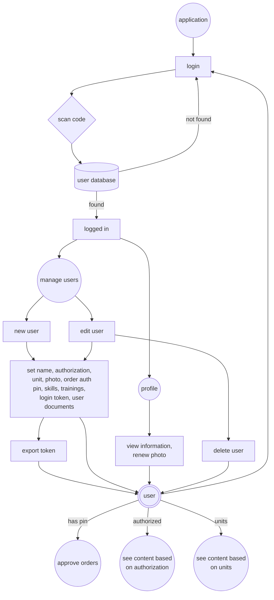
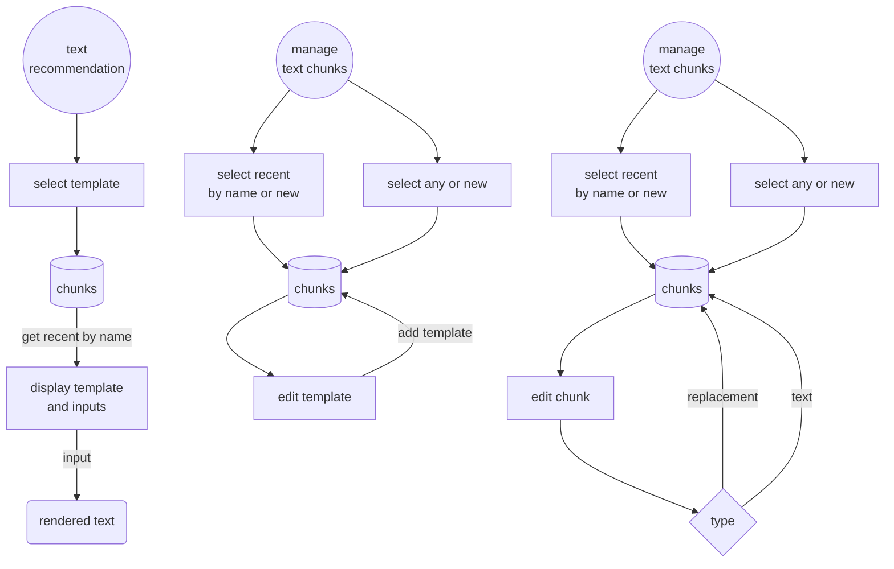
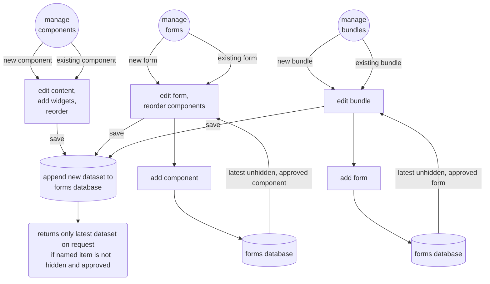
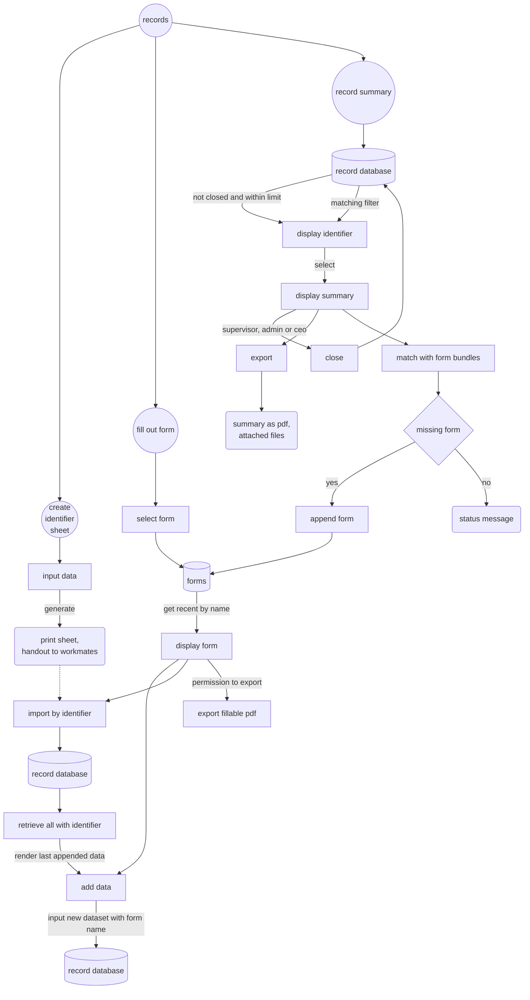
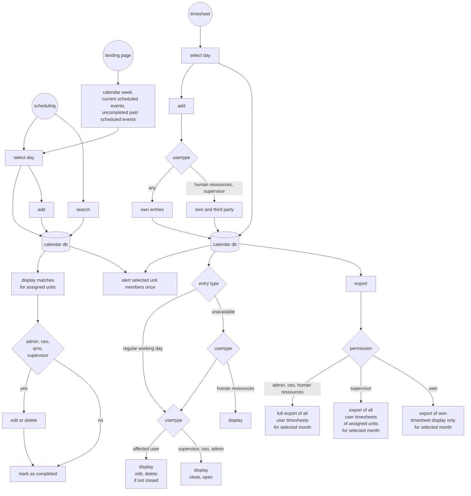
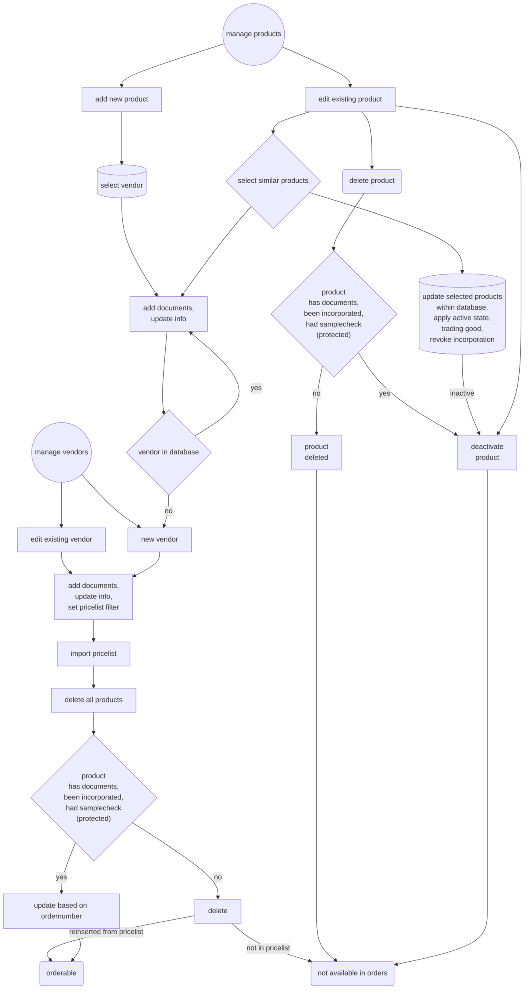
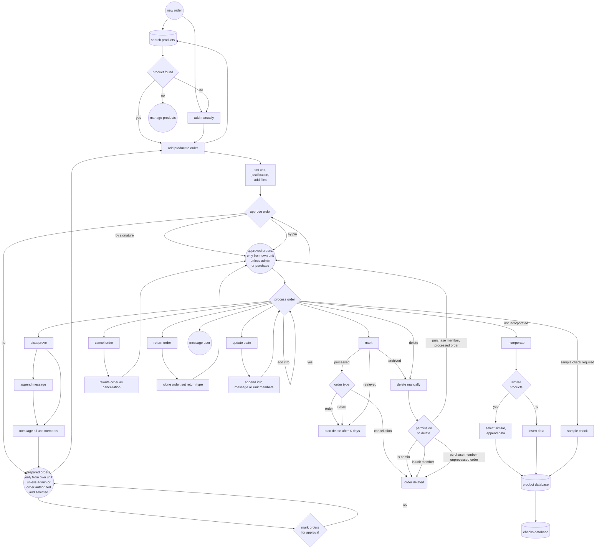

# CARO - Cloud Assisted Records and Operations

## Content
* [Aims](#aims)
    * [Intended ISO 13485 goals](#intended-iso-13485-goals)
    * [Integrated regulatory support](#integrated-regulatory-support)
    * [Extras](#extras)
    * [Necessary infrastructure](#necessary-infrastructure)
    * [What it is not](#what-it-is-not)
    * [Data integrity](#data-integrity)
* [Regulatory fulfillment suggestions](#regulatory-fulfillment-suggestions)
    * [Tips](#tips)
* [Modules](#modules)
    * [Application](#application)
        * [Users](#users)
        * [Manual](#manual)
    * [Communication](#communication)
        * [Conversations](#conversations)
        * [Register](#register)
        * [Text recommendations](#text-recommendations)
    * [Records](#records)
        * [Forms](#forms)
        * [Records](#records-1)
        * [Risk management](#risk-management)
    * [Calendar](#calendar)
    * [Files](#files)
    * [Purchase](#purchase)
        * [Vendor and product management](#vendor-and-product-management)
        * [Order](#order)
    * [Tools](#tools)
* [Prerequisites](#prerequisites)
    * [Installation](#installation)
    * [Runtime variables](#runtime-variables)
    * [Useage notes and caveats](#useage-notes-and-caveats)
    * [Customisation](#customisation)
    * [Importing vendor pricelists](#importing-vendor-pricelists)
* [Code design patterns](#code-design-patterns)
* [CSV processor](#csv-processor)
* [API documentation](#api-documentation)
    * [Application endponts](#application-endpoints)
    * [Audit endpoints](#audit-endpoints)
    * [Calendar endpoints](#calendar-endpoints)
    * [Consumables endpoints](#consumables-endpoints)
    * [CSV filter endpoints](#csv-filter-endpoints)
    * [File endpoints](#file-endpoints)
    * [Form endpoints](#form-endpoints)
    * [Message endpoints](#message-endpoints)
    * [Notification endpoints](#notification-endpoints)
    * [Order endpoints](#order-endpoints)
    * [Record endpoints](#record-endpoints)
    * [Texttemplate endpoints](#texttemplate-endpoints)
    * [Tool endpoints](#tool-endpoints)
    * [User endpoints](#user-endpoints)
* [Statement on technical guidelines on data security](#statement-on-technical-guidelines-on-data-security)
    * [Web Application](#web-application)
    * [Backend](#backend)
* [Ressources](#ressources)
* [License](#license)


## development

#### purchase considerations
* order only assigned units selecteable?
* general orders select workshop storage number
* overview orders by commission/justification / vendor
* batch identifier (product and delivery note number) for ordered items
* vendor mailto (certificates)
* vendor evaluation

#### application considerations
* data deletion in accordance to dsgvo, eg. recommend deletion after x years?
* risk management
    * api documentation
    * audit display and export
    * displaying acceptance level
* unittests (frontend)

#### planning considerations
* list / reminder for unfinished cases, current state?

#### records considerations
* linked files on separate external path, input type convert to link
* purchase: batch identifier (product and delivery note number) for...
* material tracing within documentation


# Aims
This software aims to support you with your ISO 13485 quality management system and support internal communication. It is supposed to run as a web application on a server. Data safety measures are designed to be used in a closed network environment; while technically being usable on any webserver this does not adhere to [data safety requirements](#technical-guidelines-on-sata-security) and is **not recommended**. The architecture enables staff to access and append data where other ERP-software may be limited due to licensing.

Data gathering is supposed to be completely digital and finally wants to get rid of paper based documentation. There may be other pieces of software with a similar goal but many of them come from another direction - managing rehabilitation devices instead of custom-made products, focussing on custom orthopaedic footwear, tracing productivity - instead of the primary record aspect of the CARO App. Let alone cumbersome UI of some programs which has also led to a goal of being consistent easy to use and recognizable.


## Intended ISO 13485 goals
* ISO 13485 4.1.2 Risk based approach
    * The application has a risk management module to consider, evaluate and handle risks.
    * also see [Risk management](#risk-management)
* ISO 13485 4.2.3 Medical device file
    * All form data for case documentation accumulates. Any export does contain this data, thus achieves a complete documentation of measures.
    * Case documentation forms require a case identifier to ensure respective data is allocated correctly.
    * also see [Records](#records)
* ISO 13485 4.2.4 Document control
    * The application enables you to design reusable form components and forms.
    * Only the most recent approved components and forms are accessible for use [as long as there is a network connection](#network-connection-handling).
    * Creation of new components, forms, form bundles, text chunks and text templates is permitted to defined authorized users only.
    * Form components and forms need to be [approved by](#users) defined authorized users. Respective user groups will be alerted by system message on saving of a new element. All members of the respective permission group can approve though, assuming they know what they're doing. Any assignment to organizational units would overcomplicate things regarding reuse of elements by multiple units. Unapproved components do not show up even if the form is approved.
    * New components, forms, form bundles, text chunks and text templates are appended to the database as a new entry. Each entry will have a timestamp and the saving user name. Within the respective managers the standard selection will access the most recent approved version. The advanced selection will access any existing version. Components and forms can not be deleted after being approved. Unapproved components and forms are not accessible for use.
    * Images for form components will not be deleted after component approvement. They are assigned the components name and timestamp of submission to the filename. They are always accessible on accessing a former version. They can not be reused and are part of the component.
    * Forms can be exported blank by defined authorized users to limit distribution of outdated versions. Authorized form creators can decide for general permission though.
    * External documents are routed with recording implementation, regulatory context, possible retirement and most recent user interacting.
    * also see [Forms](#forms), [Files](#files)
* ISO 13485 4.2.5 Record control
    * All form data accumulates and is not deleteable from the application. Each entry will have a timestamp and the saving user name. Summaries gather all distinct entries and display them in order of submission.
    * Images and files for records will not be deleted. They are assigned the identifier and timestamp of submission to the filename.
    * Records can be exported at any time if you want to have another audit safe storage solution or have to share it with a service provider.
    * Accessing any content from the application including confidential personal information of customers requires a personal login from registered users.
    * also see [Users](#users), [Records](#records)
* ISO 13485 5.5.1 Responsibility and authority
    * Users are assigned [special permissions](#users) that limit access and unclutter menu items.
    * Permissions define access to app functions.
    * Users can be assigned a pin to approve orders.
    * A user register summarizes all users, also grouped by organizational unit and permission
    * also see [Users](#users), [Conversations](#conversations), [Runtime variables](#runtime-variables)
* ISO 13485 5.5.3 Internal communication
    * The application has a built in [messenger](#conversations). This messenger is being made use of internal modules to ensure decent data distribution e.g.
        * alerting user groups for approving new form components and forms
        * alerting user groups about disapproved orders and order state changes
        * messaging inquiries to ordering users
        * alerting user groups about scheduled events
    * The application has a built in calendar. This calendar is supposed to assist in scheduling operations and keeping track of time critical recurring events like calibrations etc. 
    * The application has an ordering module. Orders can be prepared and approved. Purchase will have all necessary data from vendor pricelists to handle the order request and can mark the order as processed thus giving immediate feedback to the ordering person.
    * The application has a sharepoint for files and an STL-viewer to easily exchange information overstraining the messenger.
    * The interface alerts on new messages, approved unprocessed orders (purchase members) and unclosed calendar events. The landing page also displays a brief summary of unfinished record cases and scheduled events for the current week as well as unfinished events.
    * Forms can link to other forms being displayed (e.g. process or work instructions) to have a quick glance and transparent transfer.
    * also see [Conversations](#conversations), [Calendar](#calendar), [Order](#order), [Files](#files), [Tools](#tools)
* ISO 13485 6.2 Human resources
    * Within user management trainings, expiry dates, experience points and documents can be added.
    * Users can be assigned skills and applicable levels according to the intended [skill list](#customisation).
    * An overview of trainings and skill settings can be viewed within the audit module.
    * Skills and trainings can be deleted by authorized users though. A list can be exported in advance if desired.
    * also see [Users](#users), [Tools](#tools)
* ISO 13485 7.4.1 Procurement process
    * Procurement is guided through the application. Vendors and products can be added into the database.
    * Vendor data can be enriched with documents, certificates and certificate validity dates. Latter can be dispayed and exported within the audit module. Vendors can be disabled but not deleted. Products of disabled vendors are not available in the order module.
    * Products can be enriched with documents that will not be deleted. They are assigned the vendors name, a timestamp of submission and the products article number.
    * Products are supposed to be incorporated. Incorporation can be granted, denied and revoked by authorized users. All users can gather the required information beforehand. Incorporation information is to be enriched through a dedicated form with the respective context.
    * Products are deleted by default on update of the pricelist unless
        * an incorporation has been made
        * a sample check has been made
        * any document to the product has been provided
        * an alias has been modified
    * Vendor and product editing is permitted by defined authorized users only.
    * also see [Vendor and product management](#vendor-and-product-management), [Order](#order)
* ISO 13485 7.4.3 Verification of procured products
    * MDR §14 sample check will ask for a check for every vendors [product that qualifies as trading good](#importing-vendor-pricelists) if the last check for any product of this vendor exceeds the mdr14_sample_interval timespan set for the vendor, so e.g. once a year per vendor by default. This applies for all products that have not been checked within mdr14_sample_reusable timespan that can also be set for each vendor if the amount of products makes this necessary. Both values have a default value set within the setup.ini file.
    * Sample check information is to be enriched through a dedicated form with the respective context. All users can gather the required information and commit the check. 
    * Sample checks can be revoked by authorized users.
    * also see [Vendor and product management](#vendor-and-product-management), [Order](#order)
* ISO 13485 7.5.1 Control of production and service
    * Dedicated forms are supposed to record any step within production. By accessing the most recent record the current state is visible. If e.g. you have a record for a given fabrication process where you define steps, you can add a checkbox for fulfillment. One step is defining the steps, storing these to the record and signalize the actual fabrication is required. The next step could be to reuse the form, ticking the checkbox, adding this content with username and date to the record.
    * Form contexts allow the definition as process or work instructions.
    * The inbuilt calendar assists in scheduling operations.
    * also see [Forms](#forms), [Records](#records), [Calendar](#calendar)
* ISO 13485 7.5.8 Product indentification
    * Records partially relay on an identifier. This identifier is currently implemented as a QR-code that can be exported, printed and read with the integrated scanner. Sticky identifier labels can be used to mark any components of a product during production.
    * also see [Records](#records)
* ISO 13485 7.6 Surveillance and measuring equipment control
    * Dedicated forms make use of an identifier, like production forms. Measuring equipment may each have assigned their distinct identifier.
    * Adding a form component to address scheduling helps with future events that will show up and alert user groups where reasonable.
* ISO 13485 8.2.4 Internal audit
    * The audit module aquires data from the application and is partially able to export
        * records of product incorporation. If currently ordered products miss an incorporation there will be a note.
        * records of MDR §14 sample checks. If currently vendors are overdue for a check there will be a note.
        * a list of current documents in use (forms and their components)
        * user skills and trainings (with expiries highlighted)
        * vendor lists with last article update, last MDR sample check and details for certificates (if provided)
        * fulfilment of regulatory issues considered by forms
    * also see [Tools](#tools)

[Content](#content)

## Integrated regulatory support
* MPDG §83
    * medical device consultants are defined by the respective permission flag and listed as such within the register.
    * also see [Users](#users)
* ISO 14971 Risk management for medical devices
    * The application has a risk management module to consider, evaluate and handle risks.
    * Items of appedix E are prepared for use by default.
    * also see [Risk management](#risk-management)


[Content](#content)

## Extras
* Text recommendations
    * Default and adaptive [texts can be defined](#text-recommendations) to support a consistent company language.
* Time tracking
    * Registered users can contribute their working hours, vacations, sick leaves, etc. to the [calendar](#calendar). These inputs can be exported for documentation regarding labour laws.
* File sharing
    * The application has a [sharepoint](#files) for files and an [STL-viewer](#tools) to easily exchange information.
* CSV filtering
    * The application is capable of versatile [filtering and processing of CSV-files](#csv-processor).

[Content](#content)

## Necessary infrastructure 
You'll need a server to host the web application and network access for all terminal devices. The application is designed for mobile first e.g. Android tablets or iPads, but can be used on desktop computers as well. In fact some of the features are usable on desktop only (form creation and text templates).

Main goal is a distribution of mobile devices to the whole staff or at least key positions and workspaces. After all, administration can not demand going digital without providing a decent infrastructure. Scanning devices are optional but all scanning could be achieved with inbuilt cameras as well. 

For technical details see [prerequisites](#prerequisites). 

## What it is not
Beside a few architectural decisions the app is not a preset quality management system. You're still in control of your contents. Define your processes, documents and responsibilities for yourself. The application is solely supposed to help you with a structured flow and semiautomated fulfilment of regulatory issues. *Permissions showed within the below flowcharts resemble the non-binding recommended default settings.*

The application does not replace an ERP system. Procurement data is solely accessible within the application based on its own database. This is a concious decision against overwhelming ERP product databases that are not maintainable in reality and more often than not require a proprietary interface. The products database is supposed to be populated with vendors pricelists and sanitized from any unimportant data on a regular basis.

Orders can be deleted by administrative users and requesting unit members at any time and will be deleted by default after a set timespan. This module is for operational communication only, not for persistent documentation purpose.

## Data integrity
As records intend to save the submitting users name, group accounts are unrecommended albeit being possible but with limited access. Instead every user is supposed to have their own account. Defined authorized users can create, edit and delete users. To make things as easy as possible a unique 64 byte token has to be created. This token will be converted into an QR code that is scannable on login. This avoids remembering passwords and user names, as well as the need of typing in several pieces of information. The process is quite quick and enables session switching on limited access to terminal devices.

Form data and requests occasionally contain ids to access distinct contents. Technically it is possible to compromise requests from the client side but still considered reasonable giving any verification on the server side can hardly guess the original intent. It appears not less secure than intentionally providing false data on any paper based documentation.

Forms can contain a digital signature pad. Please note this is not legally document proof for lacking certification. You can define where this might be suitable enough for your processes.

[Content](#content)

## Regulatory fulfillment suggestions
Beside the apps architecture you will still have to set up your quality management system. Most of the regulatory issues are supposed to be fulfilled by forms. This way you ensure a proper version control and approval as well as a fulfillment check within the [audit-module](#tools).
* Create forms describing required documentation of processes and assign a *Process or work instruction*-form-context and the fitting regulatory context.
    * ISO 13485 all chapters should be applicationed
    * You may refer to this documentation regarding the chapters stated in the [aims above](#aims).
* Create forms that can be exported for a written form and assign a *General company record*-form-context and the fitting regulatory context.
    * ISO 13485 4.1.5
* Create forms and assign a *General company record*-form-context and the fitting regulatory context.
    * any generic records, especially but not necessarily limited to:
    * ISO 13485 6.2
    * ISO 13485 6.3
    * ISO 13485 8.2, 8.2.3, 8.2.4
    * educational regulations
* Create forms and assign a *Incident*-form-context and the fitting regulatory context.
    * ISO 13485 8.2.3
* Create forms and assign a *Case documentation*-form-context and the fitting regulatory context.
    * ISO 13485 7.2, 7.2.1
    * ISO 13485 7.3, 7.3.3, 7.3.4, 7.3.5, 7.3.6, 7.3.7, 7.3.8, 7.3.9, 7.3.10
    * ISO 13483 7.5, 7.5.1, 7.5.3, 7.5.4, 7.5.6
    * privacy statements
    * SGB 5 §33
    * MDR annex 1
    * MDR annex 6
    * MDR annex 7
    * MDR annex 13
* Create forms and assign a *MDR §14 Sample Check*- and/or *Product incorporation*-form-context and the fitting regulatory context.
    * ISO 13485 7.4, 7.4.3
* Create forms and assign a *Equipment surveillance*-form-context and the fitting regulatory context.
    * computer software and their version tracking on terminal devices may be seen as equipment as well.
    * ISO 13485 4.1.6, 7.6
    * MPBetreibV

### Tips
* Records are stored with a timestamp of processing. If you want to document the actual date of recording or anticipate delayed documentation, add a manadatory date input to the respective forms.
* Use a calendar-button within surveillance forms to immediately set the next due date while handling the current documentation.
* Add an option of grandfathering to product incorporation forms to make things easier, especially on transition from another quality management system to the CARO App. Be sure the fulfilments are satisfied on selecting though.
* If your third party erp-software is capable of creating barcodes for ordered consumables, consider a multiple scanner field within your case documentation for easier material tracing.
* Add desired skills and certifications to the [skill list](#customisation) to have a meaningful overview of saturation.
* Add a link to the [IMDRF Adverse Event Terminology Web Browsers](https://www.imdrf.org/working-groups/adverse-event-terminology) within incident forms to access the terminology codes for report forms to the authorities. 


[Content](#content)

# Modules

## Application


### Users
On registering a new user a default profile picture is generated. Custom set pictures can be restored to default. A generated order authorization pin can be used to approve orders. Adding trainings is granted to defined authorized users only, to make sure certificates are acknowledged. Skill levels (according to the [intended list](#customisation)) can be modified. The generated access token can be exported and, for example, used as a laminated card.

Users can see their information in the profile section for transparency reasons. They can modify their profile picture and set individual application settings.

The application provides a dedicated role management for registered users. The whole content is only accessible on login. Users can have different permissions. Set permissions decide what content is available or for which functions users are eligible according to predefined permissions within the apps [setup file](#runtime-variables). The provided example is considered a decent choice, but it is up to you.

Some permissions/restrictions are default set though:

Timesheets are accessible only if weekly hours are defined for the user - even the application admin.

* User
    * can see orders for own assigned organizational units only
    * can export own timesheet only
    * can perform the MDR§14 sample check and gather information for product incorporation
* Group
    * can **NEVER** add records due to limited identification data
    * can place orders, but will be prompted to identify themself
    * can see orders for own assigned organizational units only
    * can **NEVER** incorporate and sample check due to limited identification data
    * can **NEVER** access nor contribute to timesheets
* Supervisor
    * can export all timesheets of assigned unit members
    * can edit, delete and close scheduled events and timesheet entries of assigned units and unit members
* Application admin
    * **full access**
    * can approve as all eligible permission groups
    * can export all timesheets
    * default user CARO App has this permission. Use it to implement new users. Change default token immediately and store it in a safe place!
    * assign only to trusted, preferably administative staff members

Users can have multiple assigned organizational units and permissions.




[Content](#content)

### Manual

Set up the manual according to your users comprehension. While editing single entries you can select affected permission roles to unclutter the landing page display for others.

## Communication


### Conversations
This is for internal communication and system alerts only and has no record aspect. Messages are grouped by conversation with the respective counterpart. You can message any registered user but the system user and delete any conversation at any time. Multiple recipients can be separated by comma or semicolon. Tapping any message enables forwarding. New messages will trigger a system alert. The application can send messages to user groups if reasonable.

The user register gives an overview of all registered users, also grouped by organizational units and permissions. Users can be sent a message directly from here.


[Content](#content)

### Register

All registered users are listed and grouped by organizational units and permissions. Direct messaging is possible from here.

[Content](#content)

### Text recommendations
To avoid unneccesary or repetitive poetry and support a consistent linguistic style text recommendations can be provided. These are assembled with predefined text chunks for either replacements that handle pronouns or generic text chunks. Latter can make use of former. Currently a german language model is implemented where replacements are defined as chunks of
* Child female - the girl
* Child male - the boy
* Child genderless - the child
* Adult female - the woman
* Adult male - the man
* Adult genderless - the person
* Informal you - "buddy"
* Formal you - "your honor" (this is the german model part where there is more than just "you")

Such a replacement may be named addressee. If a generic text chunk contains :addressee this will be replaced with the chosen genus from a selection list. If you intend to write a text for the insurance company you may talk about the patient and select a genus from the first four options, if you address the customer directly you may choose one of the last two depending on your individual distance. A selection of the desired genus will be rendered on the creation form and reused for all types of replacements.

On creating a text you can make use of predefined replacements that may contain the grammatical case (e.g. *:addresseeNomative*, *:addresseeAccusative*, *:addresseeDative*, etc.). Undefined placeholders will be rendered to an input field where it can be typed in and used repeatedly:

*"We write to inform you about :addresseeAccusative, :name. We just want to tell you :name is doing fine. :addresseeNomative can make use of the aid."*

Text templates arrange generic text chunks. Arrange or group chunks within the [drag and drop editor](#miscellaneous). Chunks can always be unselected to customize to the actual use case. Grouping chunks enhances the perception of the creation form.

Output will be copied to clipboad on clicking or tapping the output field.




[Content](#content)

## Records


### Forms
Several other pieces of software claim to handle your documents and speak of version control. In fact they just import PDF-files that have to be generated elsewhere. (Without going into excessive research) there has been no information on how document control and versioning is actually achieved. The CARO App just doesn't follow this as all: your documents are supposed to be created within the application itself. By aiming for a paperless solution this might be enough, but documents can still be exported as editable or prefilled PDFs within boundaries.

To create tracked and versioned forms and documents, create reusable form components and assemble forms from components. Components and forms have to be approved by defined authorized users to take effect. Furthermore forms can be grouped to form bundles. This way anyone can check if all necessary forms have been taken into account for defined use cases.

An approvement request is delivered by the applications [messenger](#conversations) to users with set permissions; supervisors, if set, for the defined organizational unit. Approval is granted by ticking a checkmark while being logged in with the respective assigned roles/permissions. 

Components can be rearranged via [drag and drop editor](#miscellaneous). Forms can have alternative search terms. A context must be provided to ensure a plausibility check for occasionally necessary elements. A regulatory context is optional but recommended. Approvement requests are delivered same way as for components.

The respective manager provides a selection for recent approved elements as well as a selection for all entries within the database.

Forms can be exported as an editable PDF in hopefully rare scenarios where a digital record is somehow an issue. Upload-options are dropped by default though. Permission to export is restricted by default to defined authorized users to prevent distribution of outdated versions and support an improved data collecting within the application. Authorized form creators can decide for general permission though. It is recommended to transfer the data later or at least append the scanned or photographed document to the applicable record (given a suitable form).

Forms can be managed to bundles so records can be reviewed for completeness.




[Content](#content)

### Records
Records store all inputs for any selected form. Some form contexts require an identifier that groups records to a summary. Summaries can be exported. Full summaries contain all inputs in chronological order, simplified summaries contain the most recent input only. This may lack transparency but is suitable for a tidy overview for possible third parties. 

Paperless might not be suitable in humid environments. Thus single documents can be exported as well e.g. to have data at hand where electronic devices may take damage. 

The identifier is always a QR-code with additional readable content that will appear on any export of identifiable records. To improve workflow identifier labels can be generated to mark product components, exported forms, etc. By scanning the QR-code errors and mix-ups are unlikely. The identifier can also be used to import data from other records in case of comprehensive cases in different organizational units.


Checking for completeness of form bundles can be applied on display of a record summary.

Records can be marked as closed to disappear from the records overview and not being taken into account for open cases on the landing page summary, but still can be accessed after filtering/searching any keyword within the identifier. On further contribution the closed state is revoked by default.




[Content](#content)

### Risk management
The risk management supports describing risks according to ISO 14971 and in accordance to [DGIHV](https://www.dgihv.org) proposals.

You are supposed to track a cause and effect, recognize a probability and damage, describe measures, reevaluate probability and damage, do a risk-benefit assessment and define remaining measures.

Entries are not persistent but can be exported if desired.

[Content](#content)

## Calendar


Add events to the calendar. The landing page gives a brief overview of the scheduled events and the current week as well as off duty workmates at a quick glance. Events can be added and completed by every user, editing and deleting is permitted to defined authorized users only.

Events may trigger a [message](#conversations) to a defined user group if set.

As scheduling is supposed to help you with operational planning (e.g. daily assigned tasks for a unit) and reminders in conjunction with records in the first place you get only to select dates. This unclutters the input form too.

Displayed calendars do include weekends and any non working day intentionally in case some event occurs non-standard or recurring events happen to be dated then, to not being overlooked.

Scheduling and its events are not part of the records per se as any treatment measure is supposed to have its own timed [record](#records).

Beside scheduling, the calendar can be used to document working hours of the staff. This is originally loosely connected with planning as far as vacations and other leaves can be entered, displayed and may affect scheduling events. While we're at it we can as well write the working hours up and summarize them. Displaying and exporting is permitted to the owning user, supervisor and defined authorized users only. Latter are allowed to contribute an entry for every user to inform units about sick leave. Editing is only permitted to the owning user for unclosed entries. Entries approval state can be set by supervisors of the respective unit and defined authorized users for full access only.

This is supposed to ensure a transparent communication, data safety and collective agreements on timetracking. It aims to address all known concerns of german law and staff council/union. It's not a persistent tracking though, for the database will be cleaned from all entries where the affected user is deleted. Timesheets can be exported, which is preferred anyway by current experience and is highly recommended if used for documentation regarding labour laws. User settings allow for entering weekly hours to calculate properly.

Off duty events are displayed with the scheduled events, but scheduled events are also displayed within the timesheet calendar to raise awareness about possible workload of the remaining staff.

*Warning: current impementation has quite a fixed definition of holidays and does not take different regions as well as changes in public holidays into account. Currently changes will affect past timesheet entries and calculate different results. Changes as soon as i can think of a solution! On minor changes it is recommended to export the most recent timesheets and start tracking anew.*

Timesheets support changes in weekly hours and annual vacation though. Respective start dates and values are part of the user settings.

Exports are ordered by user name with exporting user coming first regardless, for convenience.



[Content](#content)

## Files


Defined authorized users can provide files for everyone to access. Also all users can contribute to the open sharepoint where files have a limited timespan and are deleted after a while by default.

Both cloud storages live equip the [tools STL-Viewer](#tools) with sources to display.

This source can also be used to provide documents that are [unsuitable to be filled out digitally](#data-integrity). *Enable export permission for internal documents to avoid version confusion; register external documents for the same reason.*

External documents as described in ISO 13485 4.2.4 have to be identified and routed. Therefore these files receive special attention and are to be handled with respective records regarding implementation, regulatory context, possible retirement and the username for the last decision. For consistent documentation purpose files can not be deleted, only set unavailable.


[Content](#content)

## Purchase


### Vendor and product management
Order operations rely on a vendor and product database. Also this is related to incorporation and sample checks of products, document and certification handling. Defined authorized users have permission to manage these categories, add and edit vendors and products, import pricelists and define filters, or disable vendors and products. Importing pricelists with filtering makes use of the [CSV processor](#csv-processor).

Disabled products are not accessible through the order module. Products can be deleted as long as they are not marked as protected. Vendors are not deleteable.

Defined authorized users (e.g. *purchase assistant*) can edit the alias definition of products to disburden purchase and enhance identification of products with company customs.

Vendors can be enriched with certificate files. The application will match the provided expiry-date and contribute to the [calendar](#calendar) once the date has passed to alert relevant units to look after an update.

While editing products, one can edit the
* *trading good*-setting,
* *has expiry date*-setting,
* *special attention*-setting (meaning being defined within languagefile),
* revoke a possible *incorporated*-state and
* set the product *active and available* or *inactive*.

On setting any of these, similar products can be selected to apply this setting to as well. The selection happens to propose products of the same vendor whose article number has a set up similarity (as defined within [setup.ini](#runtime-variables)).




[Content](#content)

### Order
The order module supports all parties. Purchase is supposed to obtain structured and complete data for placed orders and ordering units get information about the order state.
Ordered products identify themself as incorporated or not or whether they are qualified for a necessary sample check. Both can be done from the list of ordered products, during operations and without being mixed-up.

Orders may have to be approved; pending approvals sum up and can be batch approved by users with an order authentification pin.

Approved orders can be marked as *ordered*, *received* and *archived* with only the last not being deleted by default after a set timespan. Also purchase can disapprove an order for any suitable reason. In this case a message can be appended and all users of the assigned organizational unit will be informed about the lack of order processing.

Information can be added anytime.
Processed but not yet received orders can have a order state change in which case the ordering unit will be send a message. These are also cancelable, in which case the order will be sorted to unprocessed with a cancellation flag and message to purchase; a processed cancellation will be deleted. Received products can be marked to be returned. Returns create a new order without changing the original one.
All actions offer to append a message.



Initialized incorporations are marked as approved by all applicable users permissions/roles. They may still have to be fully approved by defined authorized roles.
Sample checks are added to the records. Defined authorized users can revoke the sample check from within the [audit module](#tools). New checks trigger a sytem message to these users.

[Content](#content)

## Tools


Some general tools are available to read and create 2D-barcodes, view STL-files (e.g. for communication of a CAD-unit with another manufacturing unit).

Also a CSV-Filter and its manager are sorted here. The CSV-filter processes respective filetypes using the [CSV processor](#csv-processor) and can be used for any kind of list matching. The filter is accessible by defined authorized users.

The audit module gathers data from the application in regards of proofing lists for fulfilment of regulatory requirements:
* incoporated articles
* MDR §14 sample checks
* current documents in use including external documents
* user skills and trainings
* skill fulfilment
* vendor list
* regulatory issues


[Content](#content)

# Prerequisites
* Server with
    * PHP >= 8.2
    * MySQL/MariaDB or SQL Server (or some other database, but queries may have to be adjusted)
    * SSL (camera access for qr-scanner, serviceworker and sha256 encryption don't work otherwise)
* Network access for endpoints and a browser
    * Desktop pcs
    * Mobile devices
    * at best [no deletion of browser data](#network-connection-handling) (cache, indexedDB) on closing.
* Vendor pricelists as CSV-files ([see details](#importing-vendor-pricelists))

Tested server environments:
* Apache [Uniform Server Zero XV](https://uniformserver.com) with PHP 8.2, MySQL 8.0.31 (until 2024-05-30)
* Apache (native) with PHP 8.2, MariaDB 15.1 (from 2024-05-30)
* Microsoft IIS with PHP 8.2, SQL Express (SQL Server 22)

Tested devices:
* Win10 Edge-browser
* Win11 Firefox-browser (until 2024-05-30)
* Linux Mint 21.3 Firefox-Browser (from 2024-05-30)
* Android12 Firefox-browser

Firefox, Edge and most probably any chromium browser have previews for input datalists that help with selecting available options (e.g. message recipients) which is very convenient. Other browsers have not been tested.

[Content](#content)

## Installation
* php.ini memory_limit ~4096M for [processing of large CSV-files and pricelist imports](#csv-processor), disable open_basedir at least for local IIS for file handlers.
    * [processing a csv](#csv-processor) of 48mb @ 59k rows with several, including file-, filters consumes about 1.7GB of memory
    * [pricelist import](#importing-vendor-pricelists) @ 100MB consumes about 2.3GB of memory
* php.ini upload_max_filesize & post_max_size / applicationhost.config | web.config for IIS according to your expected filesize for e.g. sharepoint- and CSV-files ~350MB.
* php.ini max_input_time -1 for large file uploads to share with max_execution_time, depending on your expected connection speed.
* php.ini max_execution_time / fastCGI timeout (iis) ~ 300 (5min) for [CSV processing](#csv-processor) may take a while depending on your data amount, depending on your filters though.
    * pricelist import @ 220k rows takes about 1 minute to import and process on Uniform Server, 1 minute on SQL Server
    * pricelist import @ 660k rows currently takes about 2 minutes to import and process on Uniform Server, 3 minutes on SQL Server
* php.ini session.cookie_httponly = 1, session.cookie_secure = 1, session.use_strict_mode = 1
* php.ini session.gc_maxlifetime according to [setup.ini[limits][idle_logout]](#runtime-variables)
* php.ini enable extensions:
    * gd
    * gettext
    * mbstring
    * exif
    * pdo_odbc
    * zip
    * php_pdo_sqlsrv_82_nts_x64.dll (sqlsrv)
* my.ini (MySQL) / mysql.conf.d/mysql.cnf (MariaDB) max_allowed_packet = 100M / [SQL SERVER](https://learn.microsoft.com/en-us/sql/database-engine/configure-windows/configure-the-network-packet-size-server-configuration-option?view=sql-server-ver16) 32767
* Manually set mime type for site-webmanifest as application/manifest+json for IIS servers.
* Set up api/setup.ini, especially the used sql subset and its credentials, packagesize in byte according to sql-configuration.
* [Customize](#customisation) your appropriate language-file (language.XX.ini)
* Run api/_install.php, you will be redirected to the frontpage afterwards - no worries, in case of a rerun nothing will happen.
* Change system users default token immediately and store it in a safe place!
* Install as progressive web app (PWA) from the initial browser request and give requested permissions on any elegible workplace.

## Runtime variables
Some variables can be edited during runtime. This applies for all *values* of language.xx.ini files and some settings in setup.ini

```
; default fallback application language
defaultlanguage = "en" ; en, de, etc. according to available language.xx.ini files; user can customize within profile

; timezone for calendar handling
timezone = "Europe/Berlin"

; address for application and security issues
issue_mail = "dev@erroronline.one" 

[calendar]
holidays = "01-01, 01-06, 05-01, 10-03, 11-01, 12-24, 12-25, 12-26, 12-31"
; comment out if any of these holidays don't apply
; second key is just for comprehension, value is offset to easter sunday
; easter_holidays[maundy_thursday] = -3
easter_holidays[good_friday] = -2
; easter_holidays[holy_saturday] = -1
easter_holidays[easter_monday] = 1
easter_holidays[ascension] = 39
easter_holidays[pentecost] = 50
easter_holidays[corpus_christi] = 60

workdays = "1, 2, 3, 4, 5" ; monday=1 to sunday=7, drop which have the same marking as holidays, e.g. weekends
default_due = 7 ; scheduled events are due in x days by default

hide_offduty_reasons[] = "" ; since this array is implemented anyway this empty value is processed to avoid displaying regular working hours entries. do not change
; hide_offduty_reasons[] = "sickleave" ; append reason keys as defined in language.xx.ini to adhere to your company policies regarding data safety

; default values for csv processing if left out of filter rules
[csv]
headerrowindex = 0
dialect["separator"] = ";"
dialect["enclosure"] = "\"" ; coding environments may mess up colouring after this escaped quote
dialect["escape"] = ""

;"forbidden names as regex-patterns
[forbidden]
names[] = "[^\w\s\d\.\-ÄÖÜäöüß]" ; anything else but word characters, whitespace, decimals, special characters 
names[] = "^.{0,3}$" ; less than 4 characters

; immutable hardcoded reserved keywords
names[] = "^\d+$" ; names must not be numeric only as this is reserved for database ids
names[] = "^_" ; names must not start with _
names[] = "IDENTIFY_BY_" ; special substrings |-separated
names[] = "^(caro|search|false|null|sharepoint|selectedID|component|users|context|form|form_name|form_id|bundle)$" ; literal terms |-separated

[lifespan]
sharepoint =  48 ; HOURS, after these files will be deleted
tmp =  24 ; HOURS, after these files will be deleted
order = 182 ; DAYS, after these orders marked as received but not archived will be deleted

; probability factor for similarity of texts in percent
[likeliness]
consumables_article_no_similarity = 70 ; percent
file_search_similarity = 50 ; percent
records_search_similarity = 20 ; percent
csvprocessor_source_encoding = 'ISO-8859-1, ISO-8859-3, ISO-8859-15, UTF-8'

[limits]
idle_logout = 10800 ; seconds after which a session expires without intermittend request, keep long fittings in mind
max_records = 128 ; display of record summaries, more than that will be hidden, still being displayed if filtered
mdr14_sample_interval = 365 ; days until a new sample check is required as default value
mdr14_sample_reusable = 1825 ; days until a new sample check on the same product is allowed as default value
user_image = 256 ; max pixels on longer side
order_approvalsignature_image = 2048 ; max pixels on longer side
form_image = 2048 ; max pixels on longer side
record_image = 2048 ; max pixels on longer side

; permissions based of and matching languages.xx.ini permissions
; dynamic handling for modules and methods
; admin by default
; IF YOU ADD OR REPLACE A GROUP FOR APPROVALS ALL CURRENT ITEMS MUST BE APPROVED BY THIS GROUP RETROSPECTIVE!
[permissions]
appmanual = "qmo" ; contribute to and edit application manual
audits = "ceo, qmo, prrc" ; access audits
calendaredit = "ceo, qmo, supervisor" ; edit, delete or complete events and entries (scheduled events can be closed by anyone)
calendaraddforeigntimesheet = "ceo, supervisor, human_ressources" ; e.g. insert sick days after calling in
calendarfullaccess = "ceo" ; edit, delete or complete events and entries 
calendarfulltimesheetexport = "ceo, human_ressources" ; exporting of all users timesheets in one go, adding foreign timesheet entries
csvfilter = "ceo, qmo, purchase, office" ; access and execute csv filter
csvrules = "qmo" ; add csv filter
externaldocuments = "office, ceo, qmo" ; upload and manage external documents
filebundles = "ceo, qmo" ; create file bundles
files = "office, ceo, qmo" ; upload and delete files
formapproval = "ceo, qmo, supervisor" ; SEE WARNING ABOVE - approve forms and components
formcomposer = "ceo, qmo" ; compose forms
formexport = "ceo, qmo, supervisor" ; export forms as printable pdf
incorporation = "ceo, qmo, prrc" ; SEE WARNING ABOVE - incorporate products, user by default for gathering information, set up permissions have to approve and are authorized to revoke
mdrsamplecheck = "ceo, qmo, prrc"; must have access to audit as well
orderaddinfo = "ceo, purchase" ; permission to add information to any approved orders beside own unit assigned ones
ordercancel = "ceo" ; permission to cancel or return any order beside own unit assigned ones
orderdisplayall = "purchase" ; display all orders by default, not only for own units
orderprocessing = "purchase"; process orders
products = "ceo, qmo, purchase, purchase_assistant, prrc" ; add and edit products; needs at least the same as incorporation
productslimited = "purchase_assistant" ; limited editing of products 
recordsclosing = "ceo, qmo, supervisor" ; mark record as closed
texttemplates = "ceo, qmo" ; add and edit text templates
users = "ceo, qmo" ; add and edit application users
vendors = "ceo, qmo, purchase, prrc" ; add and edit vendors

; page settings for pdf
[pdf]
labelsheet[format] = 'A4'
labelsheet[rows] = 11
labelsheet[columns] = 5
labelsheet[margintop] = 0 ; in points
labelsheet[marginbottom] = 10 ; in points
record[format] = 'A4'
record[margintop] = 35 ; in points
record[marginright] = 15 ; in points
record[marginbottom] = 15 ; in points
record[marginleft] = 20 ; in points
exportimage[maxheight] = 75 ; try what fits your typical aspect ratio for landscape

[splitresults]
bundle_files_per_slide = 12
products_per_slide = 6
```

## Useage notes and caveats

### Network connection handling
* The application caches requests. Get requests return the latest version, which might not always be the recent system state but is considered better than nothing. From a risk point of view it is more reliable to have a record on a slightly outdated form than no record at all. POST, PUT and DELETE requests however are stored within an indexedDB and trying to be executed once a successful GET request indicates reconnection to the server. This might lead to a delay of data but is better than nothing. However note that this only is reliable if the browser does not delete session content on closing. This is not a matter of the app but your system environment. You may have to contact your IT department.
* Cached POST and PUT requests add an encoded user identifier to the payload. This identifier, if successfully validated, overrides the logged in user (including assigned permissions) for service-worker-requests and ensures a valid identity for contributing records.

### Miscellaneous
* Setting the package size for the SQL environment to a higher value than default is useful beside the packagesize within setup.ini. Batch-queries are supposed to be split in chunks, but single queries with occasionally base64 encoded images might exceed the default limit.
* Notifications on new messages are as reliable as the timespan of a service-worker. Which is short. Therefore there will be an periodic fetch request with a tiny payload to wake it up once in a while - at least as long as the app is opened. There will be no implementation of push api to avoid third party usage and for lack of safari support.
* Dragging form elements for reordering within the form-editors doesn't work on handhelds because touch-events do not include this function. Constructing form components and forms will need devices with mice or a supported pointer to avoid bloating scripts. Reordered images will disappear but don't worry.
* Product documents are displayed in accordance with their article number, but with a bit of fuzziness to provide information for similar products (e.g. different sizes). It is possible to have documents displayed that do not really match the product. 
* Supported image types are JPG, JPEG, GIF and PNG. If other image types are supposed to be part of a documentation provide them using file uploads. 
* The calendar is usable from 1970-01-01 until 2079-06-06. This is due to limitations of SQL-Server as time of writing.
* The products database and depending functions (orders, product search) show a processing time of about 0.5 seconds per 100k entries. On 1m entries this can lead up to a 5 second delay.

## Customisation
* The manual is intentionally editable to accomodate it to users comprehension.
* Some parts of the setup.ini can be changed during runtime, others will mess up your system. Respective parts are marked.
* Languagefiles can be edited to accomodate it to users comprehension. Make sure to only change values. Customize all available language.xx.ini-files or delete unused - user customization lists all available files automated. Most of the keys are hardcoded so you may occasionally append to but better not reduce
    * [permission] (has no effect without consideration in role management within setup.ini)
    * [units]
    * [skills] (can be edited during runtime, e.g. to enhance your skill matrix)
    * [formcontext][anonymous]
    * [regulatory] (can be edited during runtime, e.g. to accomodate to changing regulatory requirements)

If you ever fiddle around with the sourcecode:
* [CSV Processor](#csv-processor) only returns a named array, so you'll have to implement postprocessing of the data by yourself.
* Changing the database structure during runtime may be a pita using sqlsrv for default preventing changes to the db structure (https://learn.microsoft.com/en-us/troubleshoot/sql/ssms/error-when-you-save-table). Adding columns to the end appears to be easier instad of insertions between. Dynamically added columns must be nullable, keep in mind if NULL should have a meaning.

[Content](#content)

## Importing vendor pricelists
Vendor pricelists must have an easy structure to be importable. It may need additional off-app customizing available data to have input files like:

| Article Number | Article Name | EAN         | Sales Unit |
| :------------- | :----------- | :---------- | :--------- |
| 1234           | Shirt        | 90879087    | Piece      |
| 2345           | Trousers     | 23459907    | Package    |
| 3456           | Socks        | 90897345    | Pair       |

while setting up a vendor an import rule must be defined like:
```js
{
    "filesettings": {
        "headerrowindex": 0,
        "dialect": {
            "separator": ";",
            "enclosure": "\"",
            "escape": ""
        },
        "columns": [
            "Article Number",
            "Article Name",
            "EAN",
            "Sales Unit"
        ]
    },
    "modify": {
        "add": {
            "trading_good": "0",
            "has_expiry_date": "0",
            "special_attention": "0"
        },
        "replace":[
            ["EAN", "\\s+", ""]
        ],
        "conditional_and": [
            ["trading_good", "1", ["Article Name", "ANY REGEX PATTERN THAT MIGHT MATCH ARTICLE NAMES THAT QUALIFY AS TRADING GOODS"]]
        ],
        "conditional_or": [
            ["has_expiry_date", "1", ["Article NameNumber", "ANY REGEX PATTERN THAT MIGHT MATCH ARTICLE NUMBERS THAT HAVE AN EXPIRY DATE"]],
            ["special_attention", "1", ["Article Number", "ANY REGEX PATTERN THAT MIGHT MATCH ARTICLE NUMBERS THAT NEED SPECIAL ATTENTION (E.G. BATCH NUMBER FOR HAVING SKIN CONTACT"]]
        ],
        "rewrite": [{
            "article_no": ["Article Number"],
            "article_name": ["Article Name"],
            "article_ean": ["EAN"],
            "article_unit": ["Sales Unit"]
        }]
    }
}
```
*headerrowindex* and *dialect* are added with a default value from setup.ini if left out.

Some vendors list products with placeholders. Some product may be listed as *productXYYZ* where X represents a value between 0-9, YY 20-30 and Z L or R (speaking of prosthetic feet). To make things easier to select and order, a replacing filter can be applied and executed in advance of the rewrite. This fills up the article list with all respective versions. It is always the second parentheses surrounded part that will be replaced. 

```js
"replace": [
    ["Article Number", "(product)(X)(.*?)", 0, 1, 2, 3, 4, 5, 6, 7, 8, 9],
    ["Article Number", "(product.)(YY)(.*?)", 20, 21, 22, 23, 24, 25, 26, 27, 28, 29, 30],
    ["Article Number", "(product...)(Z)", "L", "R"]
]
```

Other vendors may list products missing color variants appended to the article number. Make sure to include line end to the pattern to avoid recursive matching, endless appending to list and memory overflows.
```js
"replace":[
    ["Art.Nr.", "(501[BDKJ].+)(L$)", "L1", "L1-2", "L2", "L2-3", "L3", "L3-4", "L4", "L4-5", "L5"]
]
```

You can, of course, decide to go the extra mile and apply any additional filter, e.g. to omit products you will not use anyway, speed up the import for next time by leaving out products that did not fit incorporation, etc.

### Sample check, expiry dates and special attention
*modify.add* and *modify.conditional* detect trading goods for the MDR §14 sample check and flag an expiry date attribute or special attention. *conditional* can be applied after rewrite on article_name as well if this is a concatenation of multiple original columns. If all products qualify as trading goods *add* trading_good as 1 and omit *conditional*. If none qualify skip this, as trading_good is set to 0 by default. Same applies to expiry dates and special attention.

You can as well define all products as trading goods and set to 0 conditionally if this filter is easier formulate. Same applies to expiry dates and required special attention.

*special_attention* will be displayed within approved orders and is intended to inform about required batch number allocation for products with skin contact by default. This can be customized to anything within the language file.

[Content](#content)

# Code design patterns
For static code analysis

## Frontend design
All requests have to be routed through the api-object to ensure proper result processing and offline fallback. (./js/api.js)

A service-worker catches requests, routes if available or returns a cached response for connectivity exceptions. (./service-worker.js)

DIALOG-, TOAST- and Assemble-classes parse accordingly prepared responses to the interface. (./js/assemble.js)

_client-object handles module specific recurring tasks of form preparations (./js/utility.js)

## Backend design
There is a UTILITY class handling
* parsing of requests
* file handling within permitted directories
* image processing
Using these methods for fitting usecases is mandatory. (./api/_utility.php)

There is a PERMISSION class handling
* permissions as set within setup.ini
* full approval check
* pending approval check
Using these methods is mandatory. (./api/_utility.php) Deviations are allowed only in extending access to *admin* or limiting access for
* *supervisors* having access to assigned organizational unit content only
* *groups* not having access to recording

There is a SQLQUERY class handling
* database connections
* query preparation
* masking user input (avoiding injections)
* support of chunkifying queries for improved performance
Using these methods is mandatory. If preprocessing statements dynamic values must be prepared with driver-side quoting to inhibit injections. (./api/_sqlinterface.php)

Helper modules start with _, only endpoints do not.

All requests have to be executed through the api ensuring
* responses for logged in users only
* reaching only intended endpoints
Application endpoint (landing page) differs for availability of login page for obvious reasons. (./api/api.php and registered files)

Notifications are processed within the NOTIFICATION-class extending the API-class (./api/notification.php) and are supposed to return integers rather than strings (sensitive data).

## Deployment process

* For **installation** see [here](#installation).
* **Updates** to the database structure are supposed to be executed by _databaseupdate.php. This ensures queries are well crafted and tested in advance in a development environment. Code files are simply to be uploaded to the server to be available. 
* The operator of the infrastructure is responsible for a sufficient **deletion / uninstallation** of the software, especially backend, database and backups.

[Content](#content)

# CSV processor
The CSV Processor is implemented within the CSV filter module as well as importing products via pricelist and marking them as trading good. It is a versatile tool but needs an understanding of [JavaScript object notation](https://developer.mozilla.org/en-US/docs/Learn/JavaScript/Objects/JSON) and [regular expression pattern matching](https://regex101.com/).

Filters and modifications are processed in order of appearance. Modifications take place with the filtered list only for performance reasons. Compare lists can be filtered and manipulated likewise. Due to recursive implementation the origin list can be used as a filter by itself.

Description of options:

	"postProcessing": Optional string as hint what to do with the result file
	"filesetting":
		"source": File to process, SELF or a named array (the other filesettings don't matter then)
		"headerrowindex": Offset for title row
		"dialect": Settings according to php fgetcsv
		"columns": list/array of column names to process and export to destination
		"encoding": Comma separated string of possible character encoding of sourcefile

	"filter": List/array of objects/dicts
		"apply": "filter_by_expression"
		"comment": Description, will be displayed
		"keep": Boolean if matches are kept or omitted
		"match":
			"all": All expressions have to be matched, object/dict with column-name-key, and pattern as value
			"any": At least one expression has to be matched, it's either "all" or "any"

		"apply": "filter_by_monthdiff"
		"comment": Description, will be displayed
		"keep": Boolean if matches are kept or omitted
		"date": Filter by identifier and date diff in months
			"identifier": Column name with recurring values, e.g. customer id
			"column": Column name with date to process,
			"format": List/array of date format order e.g. ["d", "m", "y"],
			"threshold": Integer for months,
			"bias": < less than, > greater than threshold

		"apply": "filter_by_duplicates",
		"comment": Description, will be displayed
		"keep": Boolean if matches are kept or omitted
		"duplicates": Keep amount of duplicates of column value, ordered by another concatenated column values (asc/desc)
			"orderby": List/array of column names whose values concatenate for comparison
			"descending": Boolean,
			"column": Column name with recurring values, e.g. customer id of which duplicates are allowed
			"amount": Integer > 0

		"apply": "filter_by_comparison_file",
		"comment": Description, will be displayed
		"keep": Boolean if matches are kept or omitted
		"compare": Keep or discard explicit excemptions as stated in excemption file, based on same identifier
			"filesetting": Same structure as base. if source == "SELF" the origin file will be processed
			"filter": Same structure as base
			"modify": Same structure as base
			"match":
				"all": Dict with one or multiple "ORIGININDEX": "COMPAREFILEINDEX", kept if all match
				"any": Dict with one or multiple "ORIGININDEX": "COMPAREFILEINDEX", kept if at least one matches
		"transfer": Add a new column with comparison value

		"apply": "filter_by_monthinterval",
		"comment": Description, will be displayed
		"keep": Boolean if matches are kept or omitted
		"interval": Discard by not matching interval in months, optional offset from initial column value
			"column": Column name with date to process,
			"format": List/array of date format order e.g. ["d", "m", "y"],
			"interval": Integer for months,
			"offset": Optional offset in months

		"apply": "filter_by_rand",
		"comment": Description, will be displayed
		"keep": boolean if matches are kept or omitted
		"data": Select amount of random rows that match given content of asserted column (if multiple, all must be found)
			"columns": Object/dict of COLUMN-REGEX-pairs to select from,
			"amount": Integer > 0

	"modify": Modifies the result
		"add": Adds a column with the set value. if the name is already in use this will be replaced!
			   If property is an array with number values and arithmetic operators it will try to calculate
			   Comma will be replaced with a decimal point in the latter case. hope for a proper number format.
		"replace": Replaces regex matches with the given value either at a specified field or in all
				   according to index 0 being a column name or none/null
				   If more than one replacement are provided new lines with altered column values will be added to the result
				   Replacements on a peculiar position have to be match[2] (full match, group 1 (^ if necessary), group 2, ...rest)
		"remove": Remove columns from result, may have been used solely for filtering
		"rewrite": Adds newly named columns consisting of concatenated origin column values and separators.
				   Original columns will be omitted, nested within a list to make sure to order as given
		"translate": Column values to be translated according to specified translation object
		"conditional_and": changes a columns value if all regex matches on other columns, adds column by default with empty value
		"conditional_or": changes a columns value if any regex matches on other columns, adds column by default with empty value

	"split": Split output by matched patterns of column values into multiple files (csv) or sheets (xlsx)

	"evaluate": Object/dict with colum-name keys and patterns as values that just create a warning, e.g. email verification

	"translations" : Can replace e.g. numerical values with legible translations.
					 This is an object/dict whose keys can be refered to from the modifier. 
					 The dict keys are processed as regex for a possible broader use.

A generic sample:

```javascript
{
    "postProcessing": "some message, e.g. do not forget to check and archive",
    "filesetting": {
        "source": "Export.+?\\.csv",
        "headerrowindex": 0,
        "columns": [
            "ORIGININDEX",
            "SOMEDATE",
            "CUSTOMERID",
            "NAME",
            "DEATH",
            "AID",
            "PRICE",
            "DELIVERED",
            "DEPARTMENT",
            "SOMEFILTERCOLUMN"
        ]
    },
    "filter": [
        {
            "apply": "filter_by_expression",
            "comment": "keep if all general patterns match",
            "keep": true,
            "match": {
                "all": {
                    "DELIVERED": "delivered",
                    "NAME": ".+?"
                }
            }
        },
        {
            "apply": "filter_by_expression",
            "comment": "discard if any general exclusions match",
            "keep": false,
            "match": {
                "any": {
                    "DEATH": ".+?",
                    "NAME": "company|special someone",
                    "AID": "repair|cancelling|special.*?names"
                }
            }
        },
        {
            "apply": "filter_by_expression",
            "comment": "discard if value is below 400 unless pattern matches",
            "keep": false,
            "match": {
                "all": {
                    "PRICE": "^[2-9]\\d\\D|^[1-3]\\d{2,2}\\D",
                    "AID": "^(?!(?!.*(not|those)).*(but|these|surely)).*"
                }
            }
        },
        {
            "apply": "filter_by_monthdiff",
            "comment": "discard by date diff in months, do not contact if last event within x months",
            "keep": false,
            "date": {
                "column": "SOMEDATE",
                "format": ["d", "m", "y"],
                "threshold": 6,
                "bias": "<"
            }
        },
        {
            "apply": "filter_by_duplicates",
            "comment": "keep amount of duplicates of column value, ordered by another concatenated column values (asc/desc)",
            "keep": true,
            "duplicates": {
                "orderby": ["ORIGININDEX"],
                "descending": false,
                "column": "CUSTOMERID",
                "amount": 1
            }
        },
        {
            "apply": "filter_by_comparison_file",
            "comment": "discard or keep explicit excemptions as stated in excemption file, based on same identifier. source with absolute path or in the same working directory",
            "keep": false,
            "filesetting": {
                "source": "excemptions.*?.csv",
                "headerrowindex": 0,
                "columns": [
                    "VORGANG"
                ]
            },
            "filter": [],
            "match": {
                "all":{
                    "ORIGININDEX": "COMPAREFILEINDEX"
                },
                "any":{
                    "ORIGININDEX": "COMPAREFILEINDEX"
                }
            },
            "transfer":{
                "NEWPARENTCOLUMN": "COMPARECOLUMN"
            }
        },
        {
            "apply": "filter_by_monthinterval",
            "comment": "discard by not matching interval in months, optional offset from initial column value",
            "keep": false,
            "interval": {
                "column": "SOMEDATE",
                "format": ["d", "m", "y"],
                "interval": 6,
                "offset": 0
            }
        },
        {
            "apply": "filter_by_rand",
            "comment": "keep some random rows",
            "keep": true,
            "data": {
                "columns": {
                    "SOMEFILTERCOLUMN", "hasvalue"
                },
                "amount": 10
            }
        }
    ],
    "modify":{
        "add":{
            "NEWCOLUMNNAME": "string",
            "ANOTHERCOLUMNNAME" : ["PRICE", "*1.5"]
        },
        "replace":[
            ["NAME", "regex", "replacement"],
            [null, ";", ","]
        ],
        "remove": ["SOMEFILTERCOLUMN", "DEATH"],
        "rewrite":[
            {"Customer": ["CUSTOMERID", " separator ", "NAME"]}
        ],
        "translate":{
            "DEPARTMENT": "departments"
        },
        "conditional_and":[
            ["NEWCOLUMNNAME", "anotherstring", ["SOMECOLUMN", "regex"], ["SOMEOTHERCOLUMN", "regex"]]
        ],
        "conditional_or":[
            ["NEWCOLUMNNAME", "anotherstring", ["SOMECOLUMN", "regex"], ["SOMEOTHERCOLUMN", "regex"]]
        ]

    },
    "split":{
        "DEPARTMENT": "(.*)",
        "DELIVERED": "(?:\\d\\d\\.\\d\\d.)(\\d+)"
    },
    "evaluate": {
        "EMAIL": "^((?!@).)*$"
    }
	"translations":{
		"departments":{
			"1": "Central",
			"2": "Department 1",
			"3": "Department 2",
			"4": "Office"
		}
	}
}
```

[Content](#content)

# API documentation
All REST-api endpoint queries are returned as json routed by ./js/api.js and supposed to be processed/rendered primarily either by the clients Assemble-class, Compose-class, Dialog-class or Toast-class. Backend handles permissions and valid sessions. Returns 401 Unauthorized if not logged in.
Response properties are
* *render* (for assemble or toast)
* *title* (dynamic page title updates)
* *user* (user settings on login/reload)
* *data* (filtered ids, record imports)
* *response* (state messages, message type, affected ids, redirect path params, names)
* *log* (csv-filter log)
* *links* (csv-filter result file)

All form data for POST and PUT require either the provided input fields as previously created from GET fetches (./js/assemble.js), the JS _client-methods (./js/utility.js) or JS compose_helper-methods (./js/compose.js). Processing is regularily dependent on specific names.

## Application endpoints

> GET ./api/api.php/application/language

Retrieves an object with language chunks, processed by ./js/language.js

Parameters
| Name | Data Type | Required | Description |
| ---- | --------- | -------- | ----------- |
| none | | | |

> POST ./api/api.php/application/login/{logout}

Returns user image and app settings on valid session, login form otherwise.

Parameters
| Name | Data Type | Required | Description |
| ---- | --------- | -------- | ----------- |
| {logout} | path parameter | optional | triggers active logout if added literally |
| payload | form data | optional | contains password for login

Sample response
```
{"user":{"image":".\/fileserver\/users\/profilepic_error on line 1_error on line 1_token.png","app_settings":{"annualvacation":"2024-01-01 30","weeklyhours":"2024-01-01 39,5","initialovertime":false,"forceDesktop":"on","homeoffice":false,"primaryUnit":"prosthetics2"}}}
```

> GET ./api/api.php/application/menu

Returns the application menu preprocessed regarding permissions.

Parameters
| Name | Data Type | Required | Description |
| ---- | --------- | -------- | ----------- |
| none | | | |

Sample response
```
{"render":{"Communication":{"Conversations":{"onpointerup":"api.message('get', 'conversation')","data-unreadmessages":"0"},"Register":{"onpointerup":"api.message('get', 'register')"},"Text recommendations":{"onpointerup":"api.texttemplate('get', 'textblock')"},"Manage text chunks":{"onpointerup":"api.texttemplate('get', 'chunk')"},"Manage text templates":{"onpointerup":"api.texttemplate('get', 'template')"}},....
```

> GET ./api/api.php/application/start

Returns the landing page with overview and manual.

Parameters
| Name | Data Type | Required | Description |
| ---- | --------- | -------- | ----------- |
| none | | | |

[Content](#content)

### Audit endpoints

> GET ./api/api.php/audit/checks/{type}

Returns selection of available checks, given type the result of the selected type.

Parameters
| Name | Data Type | Required | Description |
| ---- | --------- | -------- | ----------- |
| {type} | path parameter | optional | adds contents based on given type to response |

Sample response
```
{"render":{"content":[[{"type":"select","content":{"Incorporated articles":{"value":"incorporation"},"Current documents in use":{"value":"forms"},"User certificates and other files":{"value":"userskills"},"Vendor list":{"value":"vendors"},"Regulatory issues considered by forms and documents":{"value":"regulatory"}},"attributes":{"name":"Select type of data","onchange":"api.audit('get', 'checks', this.value)"}}]]}}
```

> GET ./api/api.php/audit/export/{type}

Returns a download link to a temporary file based on type.

Parameters
| Name | Data Type | Required | Description |
| ---- | --------- | -------- | ----------- |
| {type} | path parameter | required | defines the response, none if omitted |

Sample response
```
{"render":[[{"type":"links","description":"Open the link, save or print the record summary. On exporting sensitive data you are responsible for their safety.","content":{"Record summary":{"href":".\/fileserver\/tmp\/Incorporatedarticles_202406102018.pdf"}}}]]}
```

[Content](#content)

### Calendar endpoints

> GET ./api/api.php/calendar/schedule/{date Y-m-d}/{date Y-m-d}

Returns a calendar.

Parameters
| Name | Data Type | Required | Description |
| ---- | --------- | -------- | ----------- |
| {date Y-m-d} | 1st path parameter | optional | returns the given month |
| {date Y-m-d} | 2nd path parameter | optional | appends entries for given date and respective inputs to response |

Sample response
```
{"render":{"content":[[{"type":"scanner","destination":"recordfilter","description":"Scan a Code"},{"type":"search","attributes":{"id":"recordfilter","name":"Search","onkeypress":"if (event.key === 'Enter') {api.calendar('get', 'search', this.value); return false;}","onblur":"api.calendar('get', 'search', this.value); return false;"}}],[{"type":"calendar","description":"June 2024","content":[null,null,null,null,null,{"date":"2024-06-01","display":"Sat 1","today":false,"selected":false,"holiday":true},{"date":"2024-06-02","display":"Sun 2","today":false,"selected":false,"holiday":true},{"date":"2024-06-03","display":"Mon 3","today":false,"selected":false,"holiday":false},....
```

> GET ./api/api.php/calendar/search/{search}

Returns scheduled events according to search phrase.

Parameters
| Name | Data Type | Required | Description |
| ---- | --------- | -------- | ----------- |
| {search} | path parameter | optional | displays scheduled events according to search, calendar overview if omitted |

Sample response
```
{"render":{"content":[[{"type":"scanner","destination":"recordfilter","description":"Scan a Code"},{"type":"search","attributes":{"id":"recordfilter","name":"Search","onkeypress":"if (event.key === 'Enter') {api.calendar('get', 'search', this.value); return false;}","onblur":"api.calendar('get', 'search', this.value); return false;"}}],[{"type":"tile","content":[{"type":"textblock","attributes":{"data-type":"textblock"},"description":"test event","content":"Date: 2024-05-30\nDue: 2024-06-06\nProsthetics II"},{"type":"checkbox","content":{"completed":{"onchange":"api.calendar('put', 'complete', '2', this.checked, 'schedule')","checked":true}},"hint":"marked as completed by error on line 1 on 2024-06-07"},.....
```

> POST ./api/api.php/calendar/schedule

Contributes scheduled events to the calendar.

Parameters
| Name | Data Type | Required | Description |
| ---- | --------- | -------- | ----------- |
| payload | form data | required | values for database |

Sample response
```
{"response":{"id":"8","msg":"Event has been saved.","type":"success"}}
```

> PUT ./api/api.php/calendar/schedule/{id}

Updates scheduled events.

Parameters
| Name | Data Type | Required | Description |
| ---- | --------- | -------- | ----------- |
| payload | form data | required | values for database |

Sample response
```
{"response":{"id":"9","msg":"Event has been saved.","type":"success"}}
```

> PUT ./api/api.php/calendar/complete/{id}/{bool}/{type}

Markes scheduled events as complete or revoke state.

Parameters
| Name | Data Type | Required | Description |
| ---- | --------- | -------- | ----------- |
| {id} | path parameter | required | database id |
| {bool} | path parameter| required | true or false completed state |
| {type} | path parameter | required | schedule or timesheet |

Sample response
```
{"response":{"msg":"Event has been marked as completed.","type":"success"}}
```

> DELETE ./api/api.php/calendar/schedule/{id}

Deletes scheduled events.

Parameters
| Name | Data Type | Required | Description |
| ---- | --------- | -------- | ----------- |
| {id} | path parameter | required | database id |

Sample response
```
{"response":{"msg":"Event has been deleted.","type":"success"}}
```

> GET ./api/api.php/calendar/timesheet/{date Y-m-d}/{date Y-m-d}

Returns a calendar.

Similar to schedules with slightly adapted inputs for time tracking.

> POST ./api/api.php/calendar/timesheet

Contributes timesheet entries to the calendar

Similar to schedules.

> PUT ./api/api.php/calendar/timesheet/{id}

Updates timesheet entries

Similar to schedules.

> PUT ./api/api.php/calendar/timesheet/{id}/{bool}/{type}

Markes timesheet entries as complete or revokes state

Similar to schedules.

> DELETE ./api/api.php/calendar/timesheet/{id}

Deletes timesheet entries.

Similar to schedules.

> GET ./api/api.php/calendar/monthlyTimesheets/{date Y-m-d}

Returns a download link to a temporary file based on date.

Parameters
| Name | Data Type | Required | Description |
| ---- | --------- | -------- | ----------- |
| {date Y-m-d} | path parameter | required | defines the response, none if omitted |

Sample response
```
{"render":[[{"type":"links","description":"Open the link, save or print the summary. Please respect data safety measures. On exporting sensitive data you are responsible for their safety.","content":{"Timesheet":{"href":".\/fileserver\/tmp\/Timesheet_202406102046.pdf"}}}]]}
```

[Content](#content)

### Consumables endpoints

> GET ./api/api.php/consumables/vendor/{name|id}

Returns content to create or modify vendor. If path parameter is provided, the form is prefilled according to database entry.

Returns available information on vendor if role has no permission to add and edit.

Parameters
| Name | Data Type | Required | Description |
| ---- | --------- | -------- | ----------- |
| {name/id} | path parameter | optional | existing vendors name (string) or database id (int) |

Sample response
```
{"render":{"content":[[{"type":"datalist","content":["Otto Bock"],"attributes":{"id":"vendors"}},{"type":"select","attributes":{"name":"Edit existing vendor","onchange":"api.purchase('get', 'vendor', this.value)"},"content":{"...New vendor":[],"Otto Bock":{"selected":true}}},{"type":"search","attributes":{"name":"Search by name","list":"vendors","onkeypress":"if (event.key === 'Enter') {api.purchase('get', 'vendor', this.value); return false;}"}}],[{"type":"text","attributes":{"name":"Name","required":true,"value":"Otto Bock"}},{"type":"textarea","attributes":{"name":"Info","value":"&lt;&gt;","rows":8}},{"type":"radio","attributes":{"name":"vendor active"},"content":{"active and available":{"checked":true},"inactive, delete products":[]}}],....
```

> POST ./api/api.php/consumables/vendor

Stores new vendor data.

Parameters
| Name | Data Type | Required | Description |
| ---- | --------- | -------- | ----------- |
| payload | form data | required | information, files, etc |

Sample response
```

{"response":{"id":1,"msg":"Vendor Otto Bock has been saved","type":"info"}}
```

> PUT ./api/api.php/consumables/vendor/{id}

Updates vendor data.

Parameters
| Name | Data Type | Required | Description |
| ---- | --------- | -------- | ----------- |
| {id} | path parameter | required | database id |
| payload | form data | required | information, files, etc |

Sample response
```
{"response":{"id":1,"msg":"Vendor Otto Bock has been saved","type":"info"}}
```

> GET ./api/api.php/consumables/product/{id}

Returns content to create or modify product. If path parameter is provided, the form is prefilled according to database entry.

Returns available information on product if role has no permission to add and edit.


Similar to vendor.

> POST ./api/api.php/consumables/product

Stores new product data.

Similar to vendor.

> PUT ./api/api.php/consumables/product/{id}

Updates product data.

Similar to vendor.

> DELETE ./api/api.php/consumables/product/{id}

Deletes a product if permitted.

Parameters
| Name | Data Type | Required | Description |
| ---- | --------- | -------- | ----------- |
| {id} | path parameter | required | database id |

Sample response
```
{"response":{"msg":"Product Kabinettraspel, halbrund could not be deleted","id":2556,"type":"error"}}
```

> GET ./api/api.php/consumables/mdrsamplecheck/{id}

Returns the current form for a sample check.

Parameters
| Name | Data Type | Required | Description |
| ---- | --------- | -------- | ----------- |
| {id} | path parameter | required | product database id |

Sample response
```
{"render":{"content":[[{"type":"textblock","description":"160O10=1 Fingerorthese Otto Bock"}],[{"attributes":[],"type":"checkbox","description":"sample check","content":{"super":[],"duper":[]}}]],"options":{"No, thank you":false,"Submit sample check":{"value":true,"class":"reducedCTA"}},"productid":1}}
```

> POST ./api/api.php/consumables/mdrsamplecheck/{id}

Stores the sample check to records, mark product as checked, system message to defined users.

Parameters
| Name | Data Type | Required | Description |
| ---- | --------- | -------- | ----------- |
| {id} | path parameter | required | product database id |
| payload | form data | required | check notes |

Sample response
```
{"response":{"msg":"Sample check has been saved","type":"success"}}
```

> DELETE ./api/api.php/consumables/mdrsamplecheck

Deletes the sample check from records, unmark product as checked.

Parameters
| Name | Data Type | Required | Description |
| ---- | --------- | -------- | ----------- |
| {id} | path parameter | required | product database id |

Sample response
```
{"response":{"msg":"Sample check has been revoked","type":"success"}}
```

> POST ./api/api.php/consumables/incorporation

Returns the current form for an incorporation.

Similar to mdrsamplecheck

> GET ./api/api.php/consumables/incorporation

Stores the incorporation to product and selected similar, system message to defined users.

Similar to mdrsamplecheck.

> GET ./api/api.php/consumables/pendingincorporations

Returns a list of links to products with pending incorporations.

Parameters
| Name | Data Type | Required | Description |
| ---- | --------- | -------- | ----------- |
| none |  |  |  |

Sample response
```
{"render":{"content":[[{"type":"links","content":{"Otto Bock 99B25 Schlauch-Strumpf":{"href":"javascript:void(0)","onpointerup":"api.purchase('get', 'product', 1752)"}}}]]}}
```

> GET ./api/api.php/consumables/products_with_expiry_dates/{id}

Returns a list of products grouped by vendor that have been flagged as having an expiry date.

Parameters
| Name | Data Type | Required | Description |
| ---- | --------- | -------- | ----------- |
| {id} | path parameter | optional | vendor id to filter |

Sample response
```
{"render":{"content":[[{"type":"select","content":{"... all vendors":{"value":"0"},"neuhof":{"value":2},"Otto Bock":{"value":1}},"attributes":{"id":"productsearchvendor","name":"Filter vendors","onchange":"api.purchase('get', 'products_with_expiry_dates', this.value)"}}],[{"type":"textblock","description":"Otto Bock","content":"633S2 Procomfort-Gel\n"}]]}}
```

> GET ./api/api.php/consumables/products_with_special_attention/{id}

Returns a list of products grouped by vendor that have been flagged as needing special attention.

Parameters
| Name | Data Type | Required | Description |
| ---- | --------- | -------- | ----------- |
| {id} | path parameter | optional | vendor id to filter |

Sample response
```
{"render":{"content":[[{"type":"select","content":{"... all vendors":{"value":"0"},"neuhof":{"value":2},"Otto Bock":{"value":1}},"attributes":{"id":"productsearchvendor","name":"Filter vendors","onchange":"api.purchase('get', 'products_with_expiry_dates', this.value)"}}],[{"type":"textblock","description":"Otto Bock","content":"633S2 Procomfort-Gel\n"}]]}}
```

[Content](#content)

### CSV filter endpoints

> GET ./api/api.php/csvfilter/filter/{id}

Returns the input form for applying a filter.

Parameters
| Name | Data Type | Required | Description |
| ---- | --------- | -------- | ----------- |
| {id} | path parameter | optional | if omitted only the selection list is returned |

Sample response
```
{"render":{"content":[[{"type":"datalist","content":["testfilter"],"attributes":{"id":"filters"}},{"type":"select","attributes":{"name":"Select filter","onchange":"api.csvfilter('get', 'filter', this.value)"},"content":{"...Select filter":{"value":"0"},"testfilter":{"value":3,"selected":true}}},{"type":"search","attributes":{"name":"Search name","list":"filters","onkeypress":"if (event.key === 'Enter') {api.csvfilter('get', 'filter', this.value); return false;}"}}],[{"type":"file","hint":"with a name like Export.+?\\.csv","attributes":{"name":"Select input file","required":true,"accept":".csv"}},{"type":"br"},{"type":"number","attributes":{"name":"Month","value":"06","readonly":true}},....
```

> POST ./api/api.php/csvfilter/filter/{id}

Returns a report from the CSV-filter and a download link to a temporary file with filtered data.

Parameters
| Name | Data Type | Required | Description |
| ---- | --------- | -------- | ----------- |
| {id} | path parameter | required | filter to apply |
| payload | form data | required | files to process |

Sample response
```
{"log":["[*] total rows: 46198","[*] applying filter: filter_by_expression nur an Personen geliefert......,"[*] remaining filtered: 104","[*] modifications done","[*] result - final rows: 104","[*] done! Nicht vergessen eMailadressen zu pr\u00fcfen und die neue Datei zu archivieren: "],"links":{"Download Einladungsfilter.csv":{"href":".\/fileserver\/tmp\/1718138675Einladungsfilter.csv","download":"Einladungsfilter.csv"}}}
```

> GET ./api/api.php/csvfilter/rule/{id}

Returns the editing interface for filter presets.

Parameters
| Name | Data Type | Required | Description |
| ---- | --------- | -------- | ----------- |
| {id} | path parameter | optional | filter to be edited, new if omitted |

Sample response
```
{"render":{"form":{"data-usecase":"csvfilter","action":"javascript:api.csvfilter('post', 'rule')"},"content":[[[{"type":"datalist","content":["test"],"attributes":{"id":"filters"}},{"type":"select","attributes":{"name":"Edit latest filter","onchange":"api.csvfilter('get', 'rule', this.value)"},"content":{"...New filter":{"value":"0"},"test":{"value":1,"selected":true}}},{"type":"search","attributes":{"name":"Search name","list":"filters","onkeypress":"if (event.key === 'Enter') {api.csvfilter('get', 'rule', this.value); return false;}"}}],[{"type":"select","attributes":{"name":"Edit any filter","onchange":"api.csvfilter('get', 'rule', this.value)"},"content":....
```

> POST ./api/api.php/csvfilter/rule

Saves a filter preset.

Parameters
| Name | Data Type | Required | Description |
| ---- | --------- | -------- | ----------- |
| payload | form data | required | filter json and name to be stored |

Sample response
```
{"response":{"name":"test","msg":"The filter named test has been saved.","type":"success"}}
```

[Content](#content)

### File endpoints

> GET ./api/api.php/file/filter/{directory}/{query}

Returns a list of paths that have a similarity to query.

Parameters
| Name | Data Type | Required | Description |
| ---- | --------- | -------- | ----------- |
| {directory} | path parameter | optional | specified sharepoint dir, user dir, other documents if null |
| {query} | path parameter | optional | search string, returns all files if null |

Sample response
```
{"data":[".\/fileserver\/documents\/test\/ottobock.csv"]}
```

> GET ./api/api.php/file/files/{directory}

Returns files to display, grouped by directories as provided including external documents.

Parameters
| Name | Data Type | Required | Description |
| ---- | --------- | -------- | ----------- |
| {directory} | path parameter | optional | specified dir, all if null |

Sample response
```
{"data":[".\/fileserver\/documents\/test\/ottobock.csv"]}
```

> GET ./api/api.php/file/filemanager/{directory}

Returns folders or files to display, interface elements to create new directories, upload and delete files. 

Parameters
| Name | Data Type | Required | Description |
| ---- | --------- | -------- | ----------- |
| {directory} | path parameter | optional | specified dir, directory manager and access if left |

Sample response
```
{"render":{"form":{"data-usecase":"file","action":"javascript:api.file('post','filemanager')"},"content":[[{"type":"links","description":"Folder created on 2024-01-31 15:14","content":{"test":{"href":"javascript:api.file('get','filemanager','test')"}}},{"type":"deletebutton","attributes":{"value":"Delete folder and all of its content","type":"button","onpointerup":"new Dialog({type:....
```

> POST ./api/api.php/file/filemanager

Creates Directories or stores files to a destination.

Parameters
| Name | Data Type | Required | Description |
| ---- | --------- | -------- | ----------- |
| payload | form data | required | including new folder name or destination folder and file(s) |

Sample response
```
{"response":{"msg":"Upload has been completed","redirect":["filemanager","test"],"type":"success"}}
```

> DELETE ./api/api.php/file/filemanager/{directory}/{file}

Deletes folders and their content, files if file is specified.

Parameters
| Name | Data Type | Required | Description |
| ---- | --------- | -------- | ----------- |
| {directory} | path parameter | required | directory to delete |
| {file} | path parameter | optional | file to delete from specified directory |

Sample response
```
{"response":{"msg":"test3 has been permanently deleted","redirect":["filemanager", null ],"type":"success"}}
```

> GET ./api/api.php/file/externalfilemanager

Returns external document files and setting inputs.

Parameters
| Name | Data Type | Required | Description |
| ---- | --------- | -------- | ----------- |
| none | | | |

Sample response
```
{"render":{"form":{"data-usecase":"file","action":"javascript:api.file('post','externalfilemanager')"},"content":[[{"type":"filtered","attributes":{"name":"Filter by file name","onkeypress":"if (event.key ==='Enter'){api.file('get','filter','null', this.value); return false;}","onblur":"api.file('get','filter','null', this.value); return false;","id":"filefilter"}}],[{"type":"links","description":"Introduced 2024-05-11 23:32, retired 2024-05-11 23:322 by error on line 1",....
```

> POST ./api/api.php/file/externalfilemanager

Stores provided files to the defined folder, creates a database entry.

Parameters
| Name | Data Type | Required | Description |
| ---- | --------- | -------- | ----------- |
| payload | form data | required | files to provide |

Sample response
```
{"response":{"msg":"Upload has been completed","type":"success"}}
```

> PUT ./api/api.php/file/externalfilemanager/{id}/{value}

Updates the database entry.

Parameters
| Name | Data Type | Required | Description |
| ---- | --------- | -------- | ----------- |
| {id} | path parameter | required | database id to update |
| {value} | path parameter | required | int accessible / comma separated selected regulatory contexts |

Sample response
```
{"response":{"msg":"Regulatory context has been updated","type":"success"}}
```

> GET ./api/api.php/file/bundlefilter/{query}

Returns a list of bundle ids whose name have a similarity to query.

Parameters
| Name | Data Type | Required | Description |
| ---- | --------- | -------- | ----------- |
| {query} | path parameter | optional | search string, returns all ids if null |

Sample response
```
{"data":["9"]}
```

> GET ./api/api.php/file/bundle

Returns lists of file paths grouped by bundle names.

Parameters
| Name | Data Type | Required | Description |
| ---- | --------- | -------- | ----------- |
| none |  |  |  |

Sample response
```
{"render":{"content":[[{"type":"filtered","attributes":{"name":"Filter by bundle name","onkeypress":"if (event.key ==='Enter'){api.file('get','bundlefilter', this.value); return false;}","onblur":"api.file('get','bundlefilter', this.value); return false;","id":"filesearch"}}],[{"type":"links","description":"einkauf","content":{"einkauf.png":{"href":"./fileserver/documents/test2/....
```

> POST ./api/api.php/file/bundlemanager

Creates a database entry for a new bundle or updates active state.

Parameters
| Name | Data Type | Required | Description |
| ---- | --------- | -------- | ----------- |
| payload | form data | required | including selected file paths, bundle name, active state |

Sample response
```
{"response":{"name":"external","msg":"Bundle external has been saved","type":"success"}}
```

> GET ./api/api.php/file/bundlemanager/{bundle}

Returns a form to define a new bundle or revise bundle if provided.

Parameters
| Name | Data Type | Required | Description |
| ---- | --------- | -------- | ----------- |
| {bundle} | path parameter | optional | if provided current setting are selected |

Sample response
```
{"render":{"form":{"data-usecase":"file","action":"javascript:api.file('post','bundlemanager')"},"content":[[{"type":"datalist","content":["einkauf","external","test"],"attributes":{"id":"bundles"}},{"type":"select","attributes":{"name":"Edit existing bundle","onchange":"api.file('get','bundlemanager', this.value)"},"content":{"...":[],"einkauf":[],"external":[],"test":{"selected": true }}},....
```

> GET ./api/api.php/file/sharepoint

Returns a list of current available files and an upload form.

Parameters
| Name | Data Type | Required | Description |
| ---- | --------- | -------- | ----------- |
| none |  |  |  |

Sample response
```
{"render":{"form":{"data-usecase":"file","action":"javascript:api.file('post','sharepoint')"},"content":[[{"type":"filtered","attributes":{"name":"Filter by file name","onkeypress":"if (event.key ==='Enter'){api.file('get','filter','sharepoint', this.value); return false;}","onblur":"api.file('get','filter','sharepoint', this.value); return false;","id":"filefilter"}}],[{"type":"links","content":....
```

> POST ./api/api.php/file/sharepoint

Uploads a file to the open sharepoint folder.

Parameters
| Name | Data Type | Required | Description |
| ---- | --------- | -------- | ----------- |
| payload | form data | true | file(s) to share |

Sample response
```
{"response":{"msg":"Upload has been completed","redirect":["sharepoint"],"type":"success"}}
```

[Content](#content)

### Form endpoints

> GET ./api/api.php/form/component_editor/{name|id}

Returns content to create or modify form components. If path parameter is not int the latest approved component is returned.

Parameters
| Name | Data Type | Required | Description |
| ---- | --------- | -------- | ----------- |
| {name/id} | path parameter | optional | string or int |

Sample response
```
{"render":{"content":[[[{"type":"datalist","content":["adddocuments","anamneseOrthetik","anamneseProthetik","fertigungsauftrag","identifier","produkteinführung","Stichprobenprüfung","TelefonEmailFoto","versorgungsbegruendung"],"attributes":{"id":"components"}},{"type":"select","attributes":{"name":"Edit existing latest approved component","onchange":"api.form('get','component_editor', this.value)"},....
```

> GET ./api/api.php/form/form_editor/{name|id}

Returns content to create or modify forms. If path parameter is not int the latest approved form is returned.

Sililar to component_editor.

> GET ./api/api.php/form/component/{name|id}

Returns database content of selected component. If path parameter is not int the latest approved component is returned.

Parameters
| Name | Data Type | Required | Description |
| ---- | --------- | -------- | ----------- |
| {name/id} | path parameter | required | string or int |

Sample response
```
{"render":{"id":4,"name":"incorporation component","alias":"","context":"component","date":"2024-06-02 00:18:00","author":"error on line 1","content":{"content":[[{"attributes":[],"type":"checkbox","description":"incorporation","hint":"check applicable items","content":{"good":[],"cheap":[],"reasonable":[]}}]],"form":[]},"hidden":0,"approval":"{\"ceo\":{\"name\":\"error on line 1\",\"date\":\"2024-06-02 00:18\"},\"qmo\":{\"name\":\"error on line 1\",\"date\":\"2024-06-02 00:18\"},\"supervisor\":{\"name\":\"error on line 1\",\"date\":\"2024-06-02 00:18\"}}","regulatory_context":"","permitted_export":null}}
```

> POST ./api/api.php/form/component

Stores a new component to the database or updates the *hidden*-setting.

Parameters
| Name | Data Type | Required | Description |
| ---- | --------- | -------- | ----------- |
| payload | form data | required | contents and setting for respective component |

Sample response
```
{"name":"adddocuments","msg":"Component adddocuments has been saved","reload":"component_editor","type":"success"}
```

> DELETE ./api/api.php/form/component/{id}

Deletes an unapproved form component.

Parameters
| Name | Data Type | Required | Description |
| ---- | --------- | -------- | ----------- |
| {id} | path parameter | required | int id of unapproved component |

Sample response
```
{"response":{"msg":"Component deleted","type":"success","reload":"component_editor"}}
```

> GET ./api/api.php/form/approval/{id}

Returns selection of components and forms pending approval, selected element if {id} is provided and unsatisfied approvals per role.

Parameters
| Name | Data Type | Required | Description |
| ---- | --------- | -------- | ----------- |
| {id} | path parameter | optional | int id of unapproved component |

Sample response
```
{"render":{"content":[[{"type":"select","attributes":{"name":"Select component to approve","onchange":"api.form('get','approval', this.value)"},"content":{"signature1":{"value":"43","selected": true },"signature2":{"value":"44"}}},{"type":"select","attributes":{"name":"Select form to approve","onchange":"api.form('get','approval', this.value)"},"content":{"testform":{"value":"51"}}}],....
```

> PUT ./api/api.php/form/approval/{id}

Updates approvals for forms and components.

Parameters
| Name | Data Type | Required | Description |
| ---- | --------- | -------- | ----------- |
| {id} | path parameter | optional | int id of unapproved component |
| payload | form data | optional | approval checkboxes |

Sample response
```
{"response":{"msg":"Approval saved.<br />This element can now be used.","type":"success","reload":"approval"}}
```

> GET ./api/api.php/form/form/{name|id}

Returns database content of selected form. If path parameter is not int the latest approved form is returned.

Similar to components.

> POST ./api/api.php/form/form

Stores a new form to the database or updates the following uncritical settings: *alias*, *context*, *hidden*, *regulatory_context*, *permitted_export*

Similar to components.

> DELETE ./api/api.php/form/form/{id}

Deletes an unapproved form.

Similar to components.

[Content](#content)

### Message endpoints

> GET ./api/api.php/message/conversation/{user id}

Returns conversations. Overview with the recent message per user if user id is omitted, or all messages of the conversation with the passed user id.

Parameters
| Name | Data Type | Required | Description |
| ---- | --------- | -------- | ----------- |
| {user id} | path parameter | optional | int id of the opposite user of the conversation |

Sample response
```
{"render":{"content":[[{"type":"deletebutton","attributes":{"value":"Delete conversation","type":"button","onpointerup":"new Dialog({type:'confirm', header:'Delete conversation', options:{'No, thank you': false,'Yes, delete conversation':{value: true, class:'reducedCTA'},}}).then(confirmation =>{if (confirmation) api.message('delete','conversation', 1,'inbox')})"}}],[{"type":"message","content":{"img":"media/favicon/ios/256.png","user":"CARO App","textblock":"The certificate / quality agreement with Otto Bock has expired. Look after an updated one! is scheduled for 2024-05-27 by CARO App and due on 2024-05-27.",....
```

> DELETE ./api/api.php/message/conversation/{user id}

Delete all messages of the conversation with the passed user id.

Parameters
| Name | Data Type | Required | Description |
| ---- | --------- | -------- | ----------- |
| {user id} | path parameter | required | int id of the opposite user of the conversation |

Sample response
```
{"response":{"msg":"Conversation successfully deleted","redirect": false,"type":"success"}}
```

> POST ./api/api.php/message/message

Store a message to the database. One for the sending user, another for the recipient.

Parameters
| Name | Data Type | Required | Description |
| ---- | --------- | -------- | ----------- |
| payload | form data | required | containing recipient(s) and message |

Sample response
```
{"response":{"msg":"Message successfully sent","redirect": false,"type":"success"}}
```

> GET ./api/api.php/message/register

Returns all users eligible for message reception (not system user), grouped by units, permissions.

Parameters
| Name | Data Type | Required | Description |
| ---- | --------- | -------- | ----------- |
| none |  |  |  |

Sample response
```
{"render":{"content":[[[{"type":"links","description":"Unit Administration","content":{"error on line 1":{"href":"javascript:void(0)","data-type":"","onpointerup":"_client.message.newMessage('Message to error on line 1','error on line 1','',{},[])"}}}],[{"type":"links","description":"Unit CAD","content":{"error on line 1":{"href":....
```

[Content](#content)

### Notification endpoints

> GET ./api/api.php/notification/notifs

Returns notifications on number of 	*calendar_uncompletedevents*, *consumables_pendingincorporation*, *form_approval*, *order_unprocessed*, *message_unnotified*, *message_unseen* to display on menu, checks for systems expiry dates, contributes to calendar and alerts eligible users.

Parameters
| Name | Data Type | Required | Description |
| ---- | --------- | -------- | ----------- |
| none |  |  |  |

Sample response
```
{"calendar_uncompletedevents": 2,"consumables_pendingincorporation": 13,"form_approval": 2,"order_unprocessed": "5","message_unnotified": "0","message_unseen": "1"}
```

[Content](#content)

### Order endpoints

> GET ./api/api.php/order/order/{id}

Returns an order form, prefilled if valid id for a prepared order is provided.

Parameters
| Name | Data Type | Required | Description |
| ---- | --------- | -------- | ----------- |
| {id} | path parameter | optional | prepared order database id (int) |

Sample response
```
{"render": {"form": {"data-usecase": "purchase","action": "javascript:api.purchase('post', 'order')"},"content": [[{"type": "scanner","destination": "productsearch"},{"type": "select","content": {"... all vendors": {"value": "21_4_5_15_16_17_6_7_31_30_33_22_8_32_23_34_9_18_2_3_10_12_11_29_19_13_14_20_24_1_25_26_27_28"},"Basko": {"value": "21"},"Caroli": {"value": "4"},"Feet Control": {"value": "5"},....
```

> POST ./api/api.php/order/order

Stores order to database. If payload contains order authorization credentials each item is stored to approved orders, the whole order stored to prepared orders otherwise.

Parameters
| Name | Data Type | Required | Description |
| ---- | --------- | -------- | ----------- |
| payload | form data | required | ordered products, order info, sometimes authorization |

Sample response
```
{"response": {"id": "83","msg": "Order has been saved to prepared orders but has still to be approved.","type": "info"}}
```

> PUT ./api/api.php/order/order/{id}

Updates order in database. If payload contains order authorization credentials each item is stored to approved orders, the whole order stored to prepared orders otherwise.

Parameters
| Name | Data Type | Required | Description |
| ---- | --------- | -------- | ----------- |
| {id} | path parameter | required | prepared order database id (int) |
| payload | form data | required | ordered products, order info, sometimes authorization |

Sample response
```
{"response": {"id": "83","msg": "Order has been saved to prepared orders but has still to be approved.","type": "info"}}
```

> DELETE ./api/api.php/order/order/{id}

Deletes a prepared order.

Parameters
| Name | Data Type | Required | Description |
| ---- | --------- | -------- | ----------- |
| {id} | path parameter | required | prepared order database id (int) |

Sample response
```
{"response": {"id": false,"msg": "This order has been permanently deleted","type": "success"}}
```

> GET ./api/api.php/order/prepared/{unit}

Lists prepared orders of users selected primary unit if {unit} is omitted.

Parameters
| Name | Data Type | Required | Description |
| ---- | --------- | -------- | ----------- |
| {unit} | path parameter | optional | organizational unit key (string) |

Sample response
```
{"render": {"content": [[{"type": "radio","attributes": {"name": "Organizational unit"},"content": {"Administration": {"name": "Organizational_unit","onchange": "api.purchase('get', 'prepared', 'admin')"},"Office/Purchase": {"name": "Organizational_unit","onchange": "api.purchase('get', 'prepared', 'office')"},....
```

> PUT ./api/api.php/order/prepared

Converts prepared orders to approved if order authorization credentials are part of payload.

Parameters
| Name | Data Type | Required | Description |
| ---- | --------- | -------- | ----------- |
| payload | form data | optional | containing prepared order ids and order authorization |

Sample response
```
{"response": {"id": false,"msg": "Approved order can now be processed by the purchase department.","type": "success"}}
```

> GET ./api/api.php/order/productsearch/{vendor_id}/{search}/{_borrowedModule}

Returns products matching {search} to be inserted into orders. If {_borrowedModule} is set to *editconsumables* the returned elements events lead to consumables editing, *productinformation* to consumables product information.

Parameters
| Name | Data Type | Required | Description |
| ---- | --------- | -------- | ----------- |
| {vendor_id} | path parameter | required | vendor id in database, _-separated list for all |
| {search} | path parameter | required | search term for article_no, article_name, article_alias, article_ean |
| {_borrowedModule} | path parameter | optional | altered events for product management |

Sample response
```
{"render": {"content": [[[{"type": "textblock","description": "Add article from 1 matches"},{"type": "tile","attributes": {"onpointerup": "_client.order.addProduct('PAK', '99B25', 'Schlauch-Strumpf', '4032767124961', 'Otto Bock'); return false;"},"content": [{"type": "textblock","description": "Incorporation pending","content": "Otto Bock 99B25 Schlauch-Strumpf PAK 4032767124961"}]}]]]}}
```

> GET ./api/api.php/order/approved/

Returns aprovved orders by product.

Parameters
| Name | Data Type | Required | Description |
| ---- | --------- | -------- | ----------- |
| none |  |  |  |

Sample response
```
{"render": {"content": [[{"type": "radio","attributes": {"name": "Filter"},"content": {"Unprocessed": {"checked": true,"onchange": "_client.order.filter()"},"Order processed": {"onchange": "_client.order.filter(\"ordered\")"},"Received in full": {"onchange": "_client.order.filter(\"received\")"},"Archived": {"onchange": "_client.order.filter(\"archived\")"}}},{"type": "search","attributes": {"name": "Or filter by term","onkeypress": "if (event.key === 'Enter') {api.purchase('get', 'filter', this.value); return false;}",....
```

> PUT ./api/api.php/order/approved/{id}/{update}/{state}

Updates approved order (states, appending information, etc.) or transfer to prepared order revoking order authorization.

Parameters
| Name | Data Type | Required | Description |
| ---- | --------- | -------- | ----------- |
| {id} | path parameter | required | order item database id (int) |
| {update} | path parameter | required | ordered, received, archived, addinformation, disapproved, cancellation, return |
| {state} | path parameter | optional | true, false |
| payload | form data | optional | messages |

* *ordered*, *received*, *archived* set the respective flag for the order (timestamp or null) depending on {state}
* *addinformation* appends payload to order info, alerts ordering unit on matching special words (order state changes)
* *disapproved* transfers to prepared orders, payload message to ordering unit
* *cancellation*, *return* convert to unprocessed order setting the respective database flag

Sample response
```
{"response": {"msg": "Information has been added set","type": "info"}}
```

> DELETE ./api/api.php/order/approved/{id}

Returns approved orders by product.

Parameters
| Name | Data Type | Required | Description |
| ---- | --------- | -------- | ----------- |
| {id} | path parameter | required | approved order database id (int) |

Sample response
```
{"response": {"id": false,"msg": "This order has been permanently deleted","type": "success"}}
```

> GET ./api/api.php/order/filter/{search}

Returns order ids whose contents match {search}.

Parameters
| Name | Data Type | Required | Description |
| ---- | --------- | -------- | ----------- |
| {search} | path parameter | required | search string  |

Sample response
```
{"data": ["89","90"]}
```

[Content](#content)

### Record endpoints

> GET ./api/api.php/record/identifier

Returns a form to create an identifier label sheet.

Parameters
| Name | Data Type | Required | Description |
| ---- | --------- | -------- | ----------- |
| none |  |  |   |

Sample response
```
{"render": {"form": {"data-usecase": "record","action": "javascript:api.record('post', 'identifier')"},"content": [[{"type": "textblock","description": "Create an identifier that will connect database entries. A current timestamp will be added by default. On submitting you will receive a prepared PDF-file to print out scannable codes. You can scan an existing identifier to recreate a label sheet."},{"type": "scanner","hint": "e.g. name, DOB, casenumber, aid / asset id, name etc. Ending with a timestamp, this will be reused instead of being appended.","attributes": {"name": "Identifying data","maxlength": 128}}]]}}
```

> POST ./api/api.php/record/identifier

Returns a download link to a temporary file with identifier label sheet.

Parameters
| Name | Data Type | Required | Description |
| ---- | --------- | -------- | ----------- |
| payload | form data | required | identifier to be converted to a qr-code |

Sample response
```
{"render": [{"type": "links","description": "Open the link, print the identifiers and use them where applicable.","content": {"Identifying data": {"href": "./fileserver/tmp/test202406131600.pdf"}}}]}
```

> GET ./api/api.php/record/records

Returns current active records grouped by record type and organizational units.

Parameters
| Name | Data Type | Required | Description |
| ---- | --------- | -------- | ----------- |
| none |  |  |   |

Sample response
```
{"render": {"content": [[{"type": "datalist","content": ["Sample record","Testpatient, Günther *18.03.1960 Unterschenkelcarbonorthese 2024-03-18 12:33"],"attributes": {"id": "records"}},{"type": "scanner","destination": "recordfilter","description": "Scan identifier to find record"},{"type": "filtered","hint": "A maximum of 128 records will be displayed, but any record will be available if filter matches.",....
```

> GET ./api/api.php/record/recordfilter/{search}

Returns ids of available records whose identifier matches {search}.

Parameters
| Name | Data Type | Required | Description |
| ---- | --------- | -------- | ----------- |
| {search} | path parameter | required | search string |

Sample response
```
{"data": ["5","7"]}
```

> GET ./api/api.php/record/forms

Returns available approved forms grouped by record type.

Parameters
| Name | Data Type | Required | Description |
| ---- | --------- | -------- | ----------- |
| none |  |  |   |

Sample response
```
{"render": {"content": [[{"type": "datalist","content": ["Anamnese Orthetik","","Anamnese Prothetik","Kontakt"],"attributes": {"id": "forms"}},{"type": "filtered","attributes": {"name": "Filter","list": "forms","onkeypress": "if (event.key === 'Enter') {api.record('get', 'formfilter', this.value); return false;}","onblur": "api.record('get', 'formfilter', this.value); return false;"}}],{"type": "links","description": "Case documentation","content":....
```

> GET ./api/api.php/record/formfilter/{search}

Returns ids of available approved forms matching {search} by name or alias, or where the search string is found within the used components.

Parameters
| Name | Data Type | Required | Description |
| ---- | --------- | -------- | ----------- |
| {search} | path parameter | required | search string |

Sample response
```
{"response": {"data": ["26"]}}
```

> GET ./api/api.php/record/form/{name}/{identifier}

Returns latest available approved form by {name}. Prefills identifier field if pased.

Parameters
| Name | Data Type | Required | Description |
| ---- | --------- | -------- | ----------- |
| {name} | path parameter | required | form name |
| {identifier} | path parameter | optional | identifier for records |

Sample response
```
{"title": "Kontakt","render": {"form": {"data-usecase": "record","action": "javascript:api.record('post', 'record')","data-confirm": true},"content": [[{"attributes": {"name": "Identifikator","required": true,"multiple": false,"value": ""},"type": "identify"},{"type": "hidden","attributes": {"name": "context","value": "casedocumentation"}},{"type": "hidden","attributes": {"name": "form_name","value": "Kontakt"}},....
```

> GET ./api/api.php/record/matchbundles/{bundle}/{identifier}

Returns links to forms that are not considered at least once for the selected bundle and identifier.

Parameters
| Name | Data Type | Required | Description |
| ---- | --------- | -------- | ----------- |
| {bundle} | path parameter | required | bundle name |
| {identifier} | path parameter | required | identifier for records |

Sample response
```
{"render": [{"type": "links","description": "Some forms seem not be be taken into account. Append missing data now:","content": {"Versorgungsbegründung": {"href": "javascript:api.record('get', 'form', 'Versorgungsbegründung', 'Testpatient, Günther *18.03.1960 Unterschenkelcarbonorthese 2024-03-18 12:33')"},"Anamnese Prothetik": {"href": "javascript:api.record('get', 'form', 'Anamnese Prothetik', 'Testpatient, Günther *18.03.1960 Unterschenkelcarbonorthese 2024-03-18 12:33')"}}}]}
```

> GET ./api/api.php/record/record/{identifier}

Returns all database entries for identifier grouped by forms.

Parameters
| Name | Data Type | Required | Description |
| ---- | --------- | -------- | ----------- |
| {identifier} | path parameter | required | identifier for records |

Sample response
```
{"render":{"content":[[{"type":"textblock","description":"Identifying data","content":"testpatient2"}],[{"type":"textblock","description":"Form identify yourself version 2024-06-13 21:54:47"},{"type":"textblock","description":"text ","content":"yxcv (error on line 1 on 2024-06-13 22:05:48)\n"},{"type":"button","attributes":{"value":"Export records from this form only","onpointerup":"api.record('get', 'formexport', 'testpatient2', 'Form identify yourself version 2024-06-13 21:54:47')"}}],....
```

> POST ./api/api.php/record/record

Stores record to database.

Parameters
| Name | Data Type | Required | Description |
| ---- | --------- | -------- | ----------- |
| payload | form data | required | according to form |

Sample response
```
{"response": {"msg": "The record has been saved.","type": "success"}}
```

> PUT ./api/api.php/record/close/{identifier}

Marks all database entries with passed identifier as closed.

Parameters
| Name | Data Type | Required | Description |
| ---- | --------- | -------- | ----------- |
| {identifier} | path parameter | required | identifier for records |

Sample response
```
{"response": {"msg": "The record will not show up in the overview, however it will still be found using the filter.","type": "success"}}
```

> GET ./api/api.php/record/import/{identifier}

Returns the most recent data for the given identifier.

Parameters
| Name | Data Type | Required | Description |
| ---- | --------- | -------- | ----------- |
| {identifier} | path parameter | required | identifier for records |

Sample response
```
{"response":{"msg":"Matching data has been imported. Please verify and be aware of your resposibility for accuracy. Only the most recent data for the corresponding field will be inserted.\n\nMake sure to have the correct identifier before submitting!","data":{"text_":"qwer"},"type":"success"}}
```

> GET ./api/api.php/records/exportform/{id}

Returns a download link to a temporary file with the selected form as blank pdf.

Parameters
| Name | Data Type | Required | Description |
| ---- | --------- | -------- | ----------- |
| {id} | path parameter | required | database id for form |

Sample response
```
{"render":[{"type":"links","description":"Open the link and print the form.","content":{"Export empty form as PDF":{"href":".\/fileserver\/tmp\/identifyyourself_202406132018.pdf"}}}]}
```

> GET ./api/api.php/records/fullexport/{identifier}

Returns a download link to a temporary file with all records as a pdf.

Parameters
| Name | Data Type | Required | Description |
| ---- | --------- | -------- | ----------- |
| {identifier} | path parameter | required | identifier for records |

Sample response
```
{"render":[{"type":"links","description":"Open the link, save or print the record summary. On exporting sensitive data you are responsible for their safety.","content":{"Record summary":{"href":".\/fileserver\/tmp\/testpatient2_202406132021.pdf"}}}]}
```

> GET ./api/api.php/records/simplifiedexport/{identifier}

Returns a download link to a temporary file with the most recent records as a pdf.

Parameters
| Name | Data Type | Required | Description |
| ---- | --------- | -------- | ----------- |
| {id} | path parameter | required | database id for form |

Sample response
```
{"render":[{"type":"links","description":"Open the link, save or print the record summary. On exporting sensitive data you are responsible for their safety.","content":{"Record summary":{"href":".\/fileserver\/tmp\/testpatient2_202406132022.pdf"}}}]}
```

[Content](#content)

### Texttemplate endpoints

> GET ./api/api.php/texttemplate/chunk/{id}

Returns a form to add or edit a text chunk.

Parameters
| Name | Data Type | Required | Description |
| ---- | --------- | -------- | ----------- |
| {id} | path parameter | optional | database id for chunk |

Sample response
```
{"render":{"form":{"data-usecase":"texttemplate","action":"javascript:api.texttemplate('post', 'chunk')"},"content":[[[{"type":"datalist","content":["eins","textblock"],"attributes":{"id":"chunks"}},{"type":"datalist","content":["de"],"attributes":{"id":"languages"}},{"type":"select","attributes":{"name":"Edit latest chunk","onchange":"api.texttemplate('get', 'chunk', this.value)"},"content":{"...New chunk":{"value":"0"},"Administration Text eins (de)":{"value":3,"selected":true},"Administration Replacement text (de)":{"value":2}}},{"type":"search","attributes":{"name":"Search name","list":"chunks","onkeypress":"if (event.key === 'Enter') {api.texttemplate('get', 'chunk', this.value); return false;}"}}],....
```

> POST ./api/api.php/texttemplate/chunk

Stores a text chunk. If only the *hidden attribute changes, the entry will be updated. 

Parameters
| Name | Data Type | Required | Description |
| ---- | --------- | -------- | ----------- |
| payload | form data | required |  |

Sample response
```
{"response":{"name":"eins","msg":"The chunk named eins has been saved.","type":"success"}}
```

> GET ./api/api.php/texttemplate/template/{id}

Returns a form to add or edit a text template

Similar to chunk.

> POST ./api/api.php/texttemplate/template

Stores a text template.

Similar to chunk.

> GET ./api/api.php/texttemplate/text/{id}/{modal}

Returns a form with selection of text recommendations, content if {id} is added. Formats for modal if passed literally.

Parameters
| Name | Data Type | Required | Description |
| ---- | --------- | -------- | ----------- |
| {id} | path parameter | optional | database id for chunk or false |
| {modal} | path parameter | optional | "modal" literally alters response to be loadable within modal |

Sample response
```
{"render":{"content":[[[{"type":"select","attributes":{"name":"Select text recommendation for Administration","onchange":"api.texttemplate('get', 'textblock', this.value)"},"content":{"...":{"value":"0"},"text (de)":{"value":4,"selected":true}}}]],[{"type":"radio","attributes":{"name":"Adressee \/ subject","id":"genus"},"content":{"Child female":{"value":0,"data-loss":"prevent"},"Child male":{"value":1,"data-loss":"prevent"},"Child genderless":{"value":2,"data-loss":"prevent"},"Adult female":{"value":3,"data-loss":"prevent"},"Adult male":{"value":4,"data-loss":"prevent"},"Adult genderless":{"value":5,"data-loss":"prevent"},"Informal you":{"value":6,"data-loss":"prevent"},"Formal you":{"value":7,"data-loss":"prevent"}}},....
```

[Content](#content)

### Tool endpoints

> GET ./api/api.php/tool/code/{type}

Returns a form with selection of code creators.

Parameters
| Name | Data Type | Required | Description |
| ---- | --------- | -------- | ----------- |
| {type} | path parameter | optional | supported code type (qrcode_text, qrcode_appointment, barcode_code128, barcode_ean13) |

Sample response
```
{"render": {"form": {"data-usecase": "tool_create_code","action": "javascript:api.tool('post', 'code', 'qrcode_text')"},"content": [[{"type": "select","attributes": {"name": "Create a","onchange": "api.tool('get', 'code', this.value)"},"content": {"QR text / URL": {"value": "qrcode_text"},"QR appointment": {"value": "qrcode_appointment"},"Barcode CODE128": {"value": "barcode_code128"},"Barcode EAN13": {"value": "barcode_ean13"}}},[{"type": "textarea","attributes": {"name": "QR text / URL","value": ""}}]]]}}
```

> POST ./api/api.php/tool/code/{type}

Returns a form with selection of code creators, prefilled with passed data from payload and an option to download a client-generated image.

Parameters
| Name | Data Type | Required | Description |
| ---- | --------- | -------- | ----------- |
| {type} | path parameter | required | supported code type (qrcode_text, qrcode_appointment, barcode_code128, barcode_ean13) |
| payload | form data | required | defined fields from previus GET fetch |

Sample response
```
{"render": {"form": {"data-usecase": "tool_create_code","action": "javascript:api.tool('post', 'code', 'qrcode_text')"},"content": [[{"type": "select","attributes": {"name": "Create a","onchange": "api.tool('get', 'code', this.value)"},"content": {"QR text / URL": {"value": "qrcode_text","selected": true},"QR appointment": {"value": "qrcode_appointment"},"Barcode CODE128": {"value": "barcode_code128"},"Barcode EAN13": {"value": "barcode_ean13"}}},[{"type": "textarea","attributes": {"name": "QR text / URL","value": "asdf"}}]],[{"type": "image","description": "Download created code","attributes": {"name": "QR text / URL","qrcode": "asdf"}}]]}}
```

> GET ./api/api.php/tool/scanner

Returns a generic full page form to scan a 2D-code.

Parameters
| Name | Data Type | Required | Description |
| ---- | --------- | -------- | ----------- |
| none |  |  |  |

Sample response
```
{"render": {"content": [[{"type": "scanner","description": "2D-scanner","destination": "tool_scanner"},{"type": "textarea","attributes": {"name": "Result","rows": 8,"readonly": true,"id": "tool_scanner"}}]]}}
```

> GET ./api/api.php/tool/stlviewer

Returns a selection of available stl files (files, sharepoint) and canvas to display these.

Parameters
| Name | Data Type | Required | Description |
| ---- | --------- | -------- | ----------- |
| none |  |  |  |

Sample response
```
{"render": {"content": [[{"type": "select","attributes": {"name": "Select file to view","onchange": "_client.tool.initStlViewer('../' + this.value)"},"content": {"...": {"value": "null"},"../fileserver/sharepoint/error on line 1_toh gelenk metall-Slice.0.stl": {"value": "../fileserver/sharepoint/error on line 1_toh gelenk metall-Slice.0.stl"}}},{"type": "stlviewer"}]]}}
```
Sample response if no files are available
```
{"render": {"content": [[{"type": "nocontent","content": "Currently there are no files, everything is tidied up :)"}]]}}
```

[Content](#content)

### User endpoints

> GET ./api/api.php/user/profile

Returns the logged in users system information and custom settings.

Parameters
| Name | Data Type | Required | Description |
| ---- | --------- | -------- | ----------- |
| none |  |  |  |

Sample response
```
{"content": [[{"type": "textblock","description": "Your data within CARO","content": "Name: error on line 1\nAuthorized: User, Supervisor, Purchase, Quality management officer, Application admin\nOrganizational units: Administration, Orthotics I, Prosthetics II, CAD\n \nYou have an order authorization pin. Ask administration for details. \n \nOvertime hours on starting time tracking: 10 \nAverage weekly hours: 2024-05-01 5 \n-9.5 hours of overtime as of end of this month \n \nAnnual vacation days: 2023-01-01 30\r\n2024-01-01 30 \n54 Days of unused vacation"},....
```

> POST ./api/api.php/user/profile

Stores custom settings.

Parameters
| Name | Data Type | Required | Description |
| ---- | --------- | -------- | ----------- |
| payload | form data | required | user image, application settings |

Sample response
```
{"response": {"id": "2","msg": "User error on line 1 has been saved","type": "success"}}
```

> GET ./api/api.php/user/user/{id|name}

Returns a form for adding a new user, prefilled settings if id or name is provided.

Parameters
| Name | Data Type | Required | Description |
| ---- | --------- | -------- | ----------- |
| {id|name} | path parameter | optional | string name or int id |

Sample response
```
{"render": {"content": [[{"type": "datalist","content": ["armprothetik","CARO App","error on line 1","testuser"],"attributes": {"id": "users"}},{"type": "select","attributes": {"name": "Edit existing user","onchange": "api.user('get', 'user', this.value)"},"content": {"...New user": [],"armprothetik": [],"CARO App": [],"error on line 1": {"selected": true},"testuser": []}},{"type": "search","attributes": {"name": "Search by name","list": "users","onkeypress": "if (event.key === 'Enter') {api.user('get', 'user', this.value); return false;}"}}],....
```

> POST ./api/api.php/user/user

Stores a new user.

Parameters
| Name | Data Type | Required | Description |
| ---- | --------- | -------- | ----------- |
| payload | form data | required | user image, application settings |

Sample response
```
{"response": {"id": "2","msg": "User error on line 1 has been saved","type": "success"}}
```

> PUT ./api/api.php/user/user/{id}

Updates user settings.

Parameters
| Name | Data Type | Required | Description |
| ---- | --------- | -------- | ----------- |
| {id} | path parameter | required | user id |
| payload | form data | required | user image, application settings |

Sample response
```
{"response": {"id": "2","msg": "User error on line 1 has been saved","type": "success"}}
```

> DELETE ./api/api.php/user/user/{id}

Deletes a user from database including assigned messages and calendar events.

Parameters
| Name | Data Type | Required | Description |
| ---- | --------- | -------- | ----------- |
| {id} | path parameter | required | user id |

Sample response
```
{"response": {"msg": "User testuser has been permanently deleted","id": false,"type": "success"}}
```

[Content](#content)

# Statement on technical guidelines on data security
This software aims to match as much relevant aspects of security measures as reasonable and possible. The software is *not* responsible for the infrastructure though. Running the neccessary servers, backups, networks device user registration, etc. are within the duties of your IT-department.

### Encryption statement
> **Unfortunately there is no reasonable way to encrypt data considering personnel fluctuations and mobile access. Public encryption key files spreading doesn't appear preferable considering shared devices. Long term data availability (up to 30 years) for staff is critical. Even [key wrapping](#https://www.rfc-editor.org/rfc/rfc3394) needs a reliable main key, which is supposed to not be written down following the following statements. Data safety measures have to depend on unreachability for the network from outside. Frontend and backend are supposed to run within a closed network.**

## Web Application
[according to BSI](https://www.bsi.bund.de/SharedDocs/Downloads/DE/BSI/Publikationen/TechnischeRichtlinien/TR03161/BSI-TR-03161-2.pdf?__blob=publicationFile&v=10) for web applications

### 3.1.1 Prüfaspekt (1): Anwendungszweck
* O.Purp_1 Der Hersteller MUSS die rechtmäßigen Zwecke der Web-Anwendung und die Verarbeitung von personenbezogenen Daten offenlegen (etwa in der Beschreibung der Nutzungsbedingungen der Web-Anwendung) und den Nutzer spätestens bei der erstmaligen Nutzung der Anwendung darüber informieren.
    > Terms of service have to be confirmed on login.
* O.Purp_2 Die Web-Anwendung DARF KEINE Daten erheben und verarbeiten, die nicht dem rechtmäßigen Zweck der Anwendung dienen.
    > Only active and intentional user input is processed and stored.
* O.Purp_3 Die Web-Anwendung MUSS vor jeglicher Erfassung oder Verarbeitung personenbezogener Daten eine aktive und eindeutige Einwilligungserklärung des Nutzers einholen.
    > Terms of service have to be confirmed on login.
* O.Purp_4 Daten, deren Verarbeitung der Nutzer nicht ausdrücklich zugestimmt hat, DÜRFEN NICHT von der Web-Anwendung oder dem Hintergrundsystem erfasst, erhalten oder genutzt werden.
    > Only active and intentional user input is processed and stored.
* O.Purp_5 Die Web-Anwendung MUSS ermöglichen, dass der Nutzer eine bereits erteilte Einwilligung wieder entziehen kann. Der Nutzer MUSS vor der Einwilligung über die Möglichkeit des Widerrufs und die sich daraus ergebenden Veränderungen im Verhalten der Anwendung informiert werden.
    > The application is intended as a tool to fulfil regulatory requirements. Use may be assigned and a mandatory official task. Permissions regarding camera and notifications are described within the terms of service, to be acknowledged on login.
* O.Purp_6 Der Hersteller MUSS ein Verzeichnis führen, welches erkennen lässt, welche Nutzereinwilligungen vorliegen. Der nutzerspezifische Teil des Verzeichnisses MUSS für den Nutzer automatisiert einsehbar sein. Es SOLL eine Historie dieses Verzeichnisses angefordert werden können.
    > The application is intended as a tool to fulfil regulatory requirements. Use may be assigned and a mandatory official task. Permissions regarding camera and notifications are described within the terms of service, to be acknowledged on login. All individual system information can be accessed through the profile.
* O.Purp_7 Setzt die Web-Anwendung Drittanbieter-Software ein, MÜSSEN alle verwendeten Funktionen für die rechtmäßigen Zwecke der Anwendung erforderlich sein. Die Anwendung SOLL anderweitige Funktionen sicher deaktivieren. Wird nur eine einzige oder sehr wenige Funktionen der Drittanbieter-Software benötigt, MUSS abgewogen werden, ob die Einbindung des gesamten Drittanbieter-Software im Verhältnis zur Vergrößerung der Angriffsoberfläche durch die verwendete Drittanbieter-Software steht.
    > [List of third party software](#ressources)
* O.Purp_8 Sofern es nicht für den vorgesehenen primären oder rechtmäßigen Zweck einer WebAnwendung erforderlich ist, DÜRFEN sensible Daten NICHT mit Dritten geteilt werden. Die Anwendung MUSS den Nutzer über die Konsequenzen einer eventuellen Weitergabe von Anwendungsdaten vollumfänglich infrandormieren und sein Einverständnis einholen (OPT-IN).
    > [List of third party software](#ressources)
* O.Purp_9 Die Web-Anwendung DARF sensible Daten NICHT auf dem Bildschirm darstellen, außer dies ist für den primären Zweck der Anwendung erforderlich.
    > Sensitive data is displayed only on intended and active user request.

### 3.1.2 Prüfaspekt (2): Architektur
* O.Arch_1 „Security“ MUSS ein fester Bestandteil des Softwareentwicklungs- und Lebenszyklus‘ für die gesamte Web-Anwendung und das Hintergrundsystem sein.
    > User login and permissions have been mandatory from the early stages on.
* O.Arch_2 Bereits in der Designphase von Web-Anwendung und Hintergrundsystem MUSS berücksichtigt werden, dass die Anwendung in der Produktivphase sensible Daten verarbeiten wird. Die Architektur der Anwendung MUSS dafür die sichere Erhebung, Verarbeitung, Speicherung und Löschung der sensiblen Daten in einem Datenlebenszyklus gewährleisten.
    > User login and permissions have been mandatory from the early stages on.
* O.Arch_3 Der Lebenszyklus von kryptographischem Schlüsselmaterial MUSS einer ausgearbeiteten Richtlinie folgen, die Eigenschaften wie die Zufallszahlenquelle, detaillierte Angaben zur Aufgabentrennung von Schlüsseln, Ablauf von Schlüsselzertifikaten, Integritätssicherung durch Hash-Algorithmen etc., umfasst. Die Richtlinie SOLL auf anerkannten Standards wie [TR02102-2] und [NIST80057] basieren. 
* O.Arch_4 In Backups gespeicherte sensiblen Daten MÜSSEN gemäß dem aktuellen Stand der Technik verschlüsselt sein. Dies schließt das Persistieren sensibler Daten durch den Browser, etwa in dessen Cache, mit ein.
    > [Encryption statement](#encryption-statement)
* O.Arch_5 Nutzt die Web-Anwendung Drittanbieter-Software, MUSS der Hersteller sicherstellen, dass nur solche Drittanbieter-Software zum Einsatz kommen, deren zu nutzenden Funktionen sicher genutzt werden können und dem Nutzer Informationen über den Nutzungsumfang und die eingesetzten Sicherheitsmechanismen klar darstellen. Die Anwendung MUSS diese Funktionen sicher nutzen. Der Hersteller MUSS darüber hinaus sicherstellen, dass ungenutzte Funktionen durch Dritte nicht aktiviert werden können.
    > [List of third party software](#ressources)
* O.Arch_6 Die Architektur der Web-Anwendung SOLL einem minimalistischen Ansatz folgen und mit einer serverseitig lokalisierten Verarbeitungslogik realisiert sein, d.h. es SOLLEN keine komplexen aktiven Inhalte (Java Applets, ActiveX-Plugin, o.ä.) verwendet werden.
    > Used languages and are solely limited to HTML, CSS, JavaScript and PHP. Contents are delivered by the backend only.
* O.Arch_7 Der Hersteller MUSS dem Nutzer eine barrierearme Möglichkeit bereitstellen, um Sicherheitsprobleme zu melden. Die Kommunikation SOLL über einen verschlüsselten Kanal stattfinden.
    > Terms of service have to be confirmed on login. These contain an eMail address.
* O.Arch_8 Die Web-Anwendung MUSS beim Start die Aktualität des genutzten Web-Browsers prüfen. Wenn die Installation eines sicherheitsrelevanten Updates noch nicht erfolgt ist, DARF die Web-Anwendung KEINEN Zugriff auf sensible Daten ermöglichen.
    > The operator of the infrastructure is responsible for browser actuality. How is that supposed to work anyway?
* O.Arch_9 Die Web-Anwendung SOLL HTTP-Server-Header nutzen, die dem aktuellen Stand der Technik entsprechen und die Sicherheit der Anwendung erhöhen. Dazu gehören unter anderem HTTP Strict Transport Security (HSTS), Content Security Policy (CSP) und X-Frame-Options.
    > [Prerequisites](#prerequisites)

### 3.1.3 Prüfaspekt (3): Quellcode
* O.Source_1 Die Anwendung MUSS alle Eingaben vor deren Verarbeitung prüfen, um potenziell bösartige Werte vor der Verarbeitung herauszufiltern.
    > Inputs are masked as strings by the backend by default.
* O.Source_2 Die Anwendung MUSS eingehende und ausgehende Daten maskieren beziehungsweise von potenziell schadhaften Zeichen bereinigen oder deren Verarbeitung ablehnen.
    > Outputs on the front end are parsed as text nodes or unexecuted input values.
* O.Source_3 Fehlermeldungen und Log-Dateien DÜRFEN KEINE sensiblen Daten (z. B. User Identifier oder Session-IDs) enthalten.
    > This is not the case.
* O.Source_4 Potenzielle Ausnahmen im Programmablauf (Exceptions) MÜSSEN abgefangen, kontrolliert behandelt und dokumentiert werden. Technische Fehlerbeschreibungen (z.B. Stack Traces) DÜRFEN dem Nutzer NICHT angezeigt werden.
    > This is not the case.
* O.Source_5 Bei Ausnahmen im Programmablauf (Exceptions) SOLL die Web-Anwendung Zugriffe auf sensible Daten abbrechen und diese im Speicher sicher löschen.
    > Sensitive data is passed to callbacks only and is not available after occuring exceptions.
* O.Source_6 Alle Optionen zur Unterstützung der Entwicklung (z. B. Entwickler-URLs, Testmethoden, Überreste von Debugmechanismen etc.) MÜSSEN in der ProduktivVersion vollständig entfernt sein.
    > Debugging is removed.
* O.Source_7 Vor der produktiven Bereitstellung der Anwendung SOLLEN moderne Sicherheitsmechanismen, wie beispielsweise Obfuskation und Bundler, verwendet werden.
    > This is not reasonable for the application used within a closed environment.
* O.Source_8 Für die Entwicklung der Anwendung SOLLEN Werkzeuge zur statischen Codeanalyse eingesetzt werden.
    > [Code design patterns](#code-design-patterns)
* O.Source_9 Nutzt die Web-Anwendung URL-Weiterleitungen (URL-Redirects), MUSS diese kontrolliert erfolgen.
    > Redirects are not used
* O.Source_10 Die Web-Anwendung MUSS Maßnahmen vorsehen, die verhindern, dass Funktionalitäten, die nicht in der Entwicklungshoheit des Herstellers liegen, in die WebAnwendung eingeschleust und zur Ausführung gebracht werden.
    > Inputs are sanitized and masked by default.
* O.Source_11 Sensible Daten DÜRFEN NICHT in der URL vorkommen. Die Web-Anwendung MUSS solche Daten in HTTP Request Headern oder POST-Parametern verarbeiten.
    > Sentitive data is always handled as PUT or POST. [API documendation](#api-documentation)

### 3.1.4 Prüfaspekt (4): Drittanbieter-Software
* O.TrdP_1 Der Anbieter MUSS eine zentrale und vollständige Liste von Abhängigkeiten durch Drittanbieter-Software führen.
    > [List of third party software](#ressources)
* O.TrdP_2 Drittanbieter-Software MUSS in der neusten oder der ihr vorhergehenden, für die Veröffentlichung vorgesehenen Version verwendet werden. 
    > [List of third party software](#ressources)
* O.TrdP_3 Drittanbieter-Software MUSS durch den Hersteller regelmäßig (durch Auswertung öffentlich verfügbarer Informationen oder durch statische/dynamische Testmethoden) auf Schwachstellen überprüft werden. Überreste von Optionen zur Unterstützung der Entwicklung (vgl.O.Source_6) sind hierbei als Schwachstelle zu werten. Der Hersteller MUSS für alle öffentlich bekannten Schwachstellen analysieren, inwieweit die Schwachstelle die Sicherheit des Gesamtsystems beeinträchtigt. Software, bzw. Funktionen aus Drittanbieter-Software DÜRFEN bei bekannten Schwachstellen, die die Sicherheit des Gesamtsystems betreffen NICHT eingesetzt werden. 
    > [List of third party software](#ressources)
* O.TrdP_4 Sicherheitsupdates für Drittanbieter-Software MUSS zeitnah integriert und per Update dem Nutzer zur Verfügung gestellt werden. Der Hersteller MUSS ein Sicherheitskonzept vorlegen, das anhand der Kritikalität ausnutzbarer Schwachstellen die geduldete Weiternutzung für die Web-Anwendung, bzw. das Hintergrundsystem festlegt. Nachdem die Übergangsfrist (Grace Period) abgelaufen ist, DARF die Web-Anwendung NICHT mehr zur Benutzung angeboten werden.
    > [List of third party software](#ressources)
* O.TrdP_5 Vor der Verwendung von Drittanbieter-Software MUSS deren Quelle auf Vertrauenswürdigkeit geprüft werden.
    > [List of third party software](#ressources)
* O.TrdP_6 Die Anwendung SOLL sensible Daten nicht an Drittanbieter-Software weitergeben.
    > [List of third party software](#ressources)
* O.TrdP_7 Über Drittanbieter-Software eingehende Daten MÜSSEN validiert werden.
    > Third party libraries but *html5-code* do not deliver data. The result of scanned qr-codes are displayed to the user and masked by default on processing database queries.
* O.TrdP_8 Drittanbieter-Software, die nicht mehr gewartet wird, DARF NICHT verwendet werden. 
    > [List of third party software](#ressources)

### 3.1.5 Prüfaspekt (5): Kryptographische Umsetzung
* O.Cryp_1 Beim Einsatz von Verschlüsselung in der Web-Anwendung DÜRFEN KEINE fest einprogrammierten geheimen, bzw. privaten Schlüssel eingesetzt werden. 
* O.Cryp_2 Die Anwendung MUSS auf bewährte Implementierungen zur Umsetzung kryptographischer Primitive und Protokolle zurückgreifen (vgl. [TR02102-2]).
* O.Cryp_3 Die Wahl kryptographischer Primitive MUSS passend zum Anwendungsfall sein und dem aktuellen Stand der Technik (siehe [TR02102-1]) entsprechen.
* O.Cryp_4 Kryptographische Schlüssel DÜRFEN NICHT für mehr als genau einen Zweck eingesetzt werden. 
* O.Cryp_5 Die Stärke der kryptographischen Schlüssel MUSS dem aktuellen Stand der Technik entsprechen (siehe [TR02102-1]).

### 3.1.6 Prüfaspekt (6): Authentisierung und Authentifizierung 
* O.Auth_1 Der Hersteller MUSS ein Konzept zur Authentisierung auf angemessenem Vertrauensniveau [TR03107-1], zur Autorisierung (Rollenkonzept) und zum Beenden einer Anwendungssitzung dokumentieren.
    > User log in via token, have permissions granted by an administrative user that are updated with every request; sessions are destroyed on logout.
* O.Auth_2 Die Anwendung SOLL Authentisierungsmechanismen und Autorisierungsfunktionen separat realisieren. Sind für die Anwendung verschiedene Rollen notwendig, MUSS eine Autorisierung bei jedem Datenzugriff separat realisiert werden. 
    > Every request matches the session and user permissions.
* O.Auth_3 Jeder Authentifizierungsvorgang des Nutzers MUSS in Form einer Zwei-FaktorAuthentifizierung umgesetzt werden.
    > Login occurs using a token. Beforehand the device itself is supposed to have a dedicated login and user credentials.
* O.Auth_4 Zusätzlich zu der in O.Auth_1 definierten Authentisierung auf einem angemessenen Vertrauensniveau, KANN der Hersteller dem Nutzer gemäß § 139e Abs. 10 SGB V, nach umfassender Information und Einwilligung, eine Authentisierungsmöglichkeit auf einem niedrigeren Vertrauensniveau anbieten. Dies schließt das Anbieten zusätzlicher Verfahren basierend auf den digitalen Identitäten im Gesundheitswesen gemäß § 291
    > This is not applicable.
* O.Auth_5 Für die Bewertung eines Authentisierungsvorgangs SOLLEN zusätzliche Informationen (z. B. das verwendete Endgerät, die verwendete IP-Adresse oder die Zeit des Zugriffs) mit einbezogen werden.
    > This is not reasonable for the application used within a closed environment.
* O.Auth_6 Dem Nutzer SOLL eine Möglichkeit gegeben werden, sich über ungewöhnliche Anmeldevorgänge informieren zu lassen.
    > This is not reasonable for the application used within a closed environment.
* O.Auth_7 Die Anwendung MUSS Maßnahmen umsetzen, die ein Ausprobieren von LoginParametern (z. B. Passwörter) erschweren.
    > This is not reasonable for the application used within a closed environment and on shared devices.
* O.Auth_8 Wurde die Anwendung unterbrochen (in den Hintergrundbetrieb versetzt), MUSS nach Ablauf einer angemessenen Frist (Grace Period) eine erneute Authentisierung durchgeführt werden.
    > The backend handles idle time based on last request by an authorized user and destroys the session locking the user out.
* O.Auth_9 Die Anwendung MUSS nach einer angemessenen Zeit in der sie nicht aktiv verwendet wurde (idle time) eine erneute Authentisierung fordern. 
    > The backend handles idle time based on last request by an authorized user and destroys the session locking the user out.
* O.Auth_10 Die Anwendung MUSS nach einer angemessenen Zeit in der sie aktiv verwendet wurde (active time) eine erneute Authentisierung zur Reaktivierung der Serversitzung fordern. 
    > The backend handles idle time based on last request by an authorized user and destroys the session locking the user out.
* O.Auth_11 Die Authentisierungsdaten DÜRFEN NICHT ohne eine erneute Authentifizierung des Nutzers geändert werden.
    > Every request matches the login token with the database (server side only). If the token is not found, the user is logged out and the session destroyed.
* O.Auth_12 Die Anwendung MUSS für die Anbindung eines Hintergrundsystems eine dem Stand der Technik entsprechende Authentifizierung verwenden.
    > This is not reasonable for the application used within a closed environment.
* O.Auth_13 Authentisierungsdaten, wie bspw. Session-Identifier bzw. Authentisierungstoken, MÜSSEN als sensible Daten geschützt werden.
    > [Installation](#installation)
* O.Auth_14 Die Anwendung MUSS es dem Nutzer ermöglichen einen oder alle zuvor ausgestellten Session-Identifier bzw. Authentisierungstoken zu invalidieren.
    > Sessions will allways be destroyed on logout.
* O.Auth_15 Wird eine Anwendungssitzung ordnungsgemäß beendet, MUSS die Anwendung das Hintergrundsystem darüber informieren, sodass Session-Identifier bzw. Authentisierungstoken sicher gelöscht werden. Dies gilt sowohl für das aktive Beenden durch den Benutzer (log-out), als auch für das automatische Beenden durch die Anwendung (vgl. O.Auth_9 und O.Auth_10).
    > Sessions will allways be destroyed on logout.
* O.Auth_16 Bei Änderung der Zugangsparameter SOLL der Nutzer über die zuletzt hinterlegten, gültigen Kontaktdaten über die Änderung informiert werden. Dem Nutzer SOLL über diesem Weg eine Möglichkeit geboten werden, die gemeldete Änderung zu sperren und nach entsprechender Authentifizierung neue Zugangsparameter zu setzen.
    > Login tokens are created and changed by authorized administrative users only. This also enables to lock any user out if necessary.
* O.Auth_17 Der Nutzer MUSS in den Nutzungsbedingungen der Web-Anwendung auf das Restrisiko hingewiesen werden, welches mit der Speicherung der Login-Credentials im WebBrowser oder auch einem anderen externen Programm für einen komfortableren Anmeldevorgang verbunden ist.
    > The input form for the login token is set to one-time-code and can not be stored.

### 3.1.6.1 Authentifizierung über Passwort
* O.Pass_1 Bei einer Authentifizierung mittels Benutzername und Passwort MÜSSEN starke Passwortrichtlinien existieren. Diese SOLLEN sich am aktuellen Stand gängiger „BestPractices“ orientieren. 
    > Login tokens are a sha256 hash encrypting a random number amongst others, are 64 characters long and consist of numbers and characters.
* O.Pass_2 Für die Einrichtung der Authentisierung mittels Benutzername und Passwort KANN die Stärke des verwendeten Passworts dem Nutzer angezeigt werden. Informationen über die Stärke des gewählten Passworts DÜRFEN NICHT gespeichert werden.
    > Login tokes are always generated by the system on request of an authorized administrative user.
* O.Pass_3 Der Nutzer MUSS die Möglichkeit haben, sein Passwort zu ändern.
    > Login tokens can be renewed by authorized administrative users.
* O.Pass_4 Das Ändern und Zurücksetzen von Passwörtern MUSS protokolliert werden.
    > Login tokens can be renewed by authorized administrative users. Logging changes is not reasonable.
* O.Pass_5 Werden Passwörter gespeichert, MÜSSEN diese mit einer den aktuellen Sicherheitsstandards entsprechenden Hash-Funktion und unter Verwendung geeigneter Salts gehasht werden.
    > The frontend does not store passwords.

### 3.1.7 Prüfaspekt (7): Datensicherheit
* O.Data_1 Die Werkseinstellung der Web-Anwendung MUSS die maximale Sicherheit bieten.
    > The application has no prefilled sensitive data on installation. New users have to be assigned roles actively.
* O.Data_2 Exportiert der Nutzer sensible Daten unverschlüsselt MUSS der Nutzer durch die WebAnwendung darauf aufmerksam gemacht werden, dass der Nutzer selbst die Verantwortung für die Datensicherheit dieser exportierten Daten übernimmt.
    > Terms of service have to be confirmed on login.
* O.Data_3 Die Web-Anwendung DARF Ressourcen, die einen Zugriff auf sensible Daten ermöglichen, gegenüber Dritten NICHT verfügbar machen.
    > There are no interfaces outside of the closed environment.
* O.Data_4 Alle erhobenen sensiblen Daten DÜRFEN NICHT über die Dauer ihrer jeweiligen Verarbeitung hinaus in der Web-Anwendung gehalten werden.
    > Sensitive data is passed to callbacks only, rendered on request and not available on every next GET request.
* O.Data_5 Die Web-Anwendung MUSS die Grundsätze der Datensparsamkeit und Zweckbindung berücksichtigen.
    > Only active and intentional user input is processed and stored.
* O.Data_6 Die Speicherung und Verarbeitung von sensiblen Daten SOLL im Hintergrundsystem erfolgen.
    > This is the case, storing sensitive data within the frontend occurs only as offline fallback within same-origin IndexedDB, the storage is cleared as soon as the cached requests have been submitted.
* O.Data_7 Bei der Verwendung von Aufnahmegeräten (z. B. Kamera) MÜSSEN sämtliche Metadaten mit Datenschutz-Relevanz, wie etwa Rückschlüsse auf die GPS-Koordinaten des Aufnahmeorts, eingesetzte Hardware etc., entfernt werden.
    > All photos are processed and resized. Meta data is lost during this process.
* O.Data_8 Bei der Erhebung von sensiblen Daten durch die Verwendung von Aufnahmegeräten (z.B. Kamera), MUSS vorgebeugt werden, dass andere Anwendungen darauf Zugriff erlangen könnten, etwa über eine Mediengalerie.
    > Camera pictures are not stored in shared folders and exist only as form data before submission.
* O.Data_9 Bei der Eingabe sensibler Daten über die Tastatur SOLL die Web-Anwendung unterbinden, dass Aufzeichnungen für Dritte erkennbar werden. 
* O.Data_10 Bei der Eingabe sensibler Daten SOLL der Export in die Zwischenablage unterbunden werden. Die Anwendung KANN alternativ eine eigene Zwischenablage implementieren, welche vor dem Zugriff durch andere Anwendungen geschützt ist.
    > Content is not selectable by default. Clipboard activites are implemented on insensitive data only.
* O.Data_11 Sensible Daten DÜRFEN NICHT aus der Komponente, auf der sie erzeugt wurden, exportiert werden.
    > Data exports happen in other modules than inputs. Data is always sanitized and processed before exports.
* O.Data_12 Durch die Web-Anwendung kann der Zugriff für Dritte und die Speicherung des Bildschirms (z. B. Screenshots und Anzeigen für das App-Switching) nicht unterbunden werden. Über die Nutzungsbedingungen MUSS der Nutzer darüber informiert werden, dass sensible Daten über Screenshots oder Anzeigen für das App-Switching kompromittiert werden können.
    > Terms of service have to be confirmed on login.
* O.Data_13 Über die Nutzungsbedingungen der Web-Anwendung MUSS der Nutzer über das Risiko informiert werden, welches damit verbunden ist, dass im gesperrten Zustand des Endgeräts die Verbindung zum Hintergrundsystem weiter geöffnet bleibt, wenn der Nutzer sich nicht explizit ausgeloggt hat.
    > Terms of service have to be confirmed on login.
* O.Data_14 Die Web-Anwendung SOLL sicherstellen, dass bei ihrer Beendigung alle sensiblen Daten und anwendungsspezifischen Anmeldeinformationen im Web-Browser nicht mehr zugreifbar sind. Dies schließt insbesondere Cookies und Webstorage mit ein.
    > The offline fallback storing user input within indexedDB outweigh this recommendation to avoid data loss. [Network connection handling](#network-connection-handling)
* O.Data_15 Die Web-Anwendung MUSS dem Nutzer die Möglichkeit geben, dass bei endgültiger Beendigung der Nutzung alle sensiblen Daten und anwendungsspezifischen Anmeldeinformationen vollständig gelöscht bzw. unzugänglich gemacht werden.
    > Authorized users can delete users permanently.
* O.Data_16 Für alle Cookies, auf die nicht mittels JavaScript zugegriffen wird, MUSS das HTTP-OnlyFlag verwendet werden. 
    > Only a session cookie is created.
* O.Data_17 Für alle Cookies, die sensible Daten enthalten, MUSS das Secure-Flag gesetzt sein.
    > [Installation](#installation)
* O.Data_18 Für alle Formularfelder mit sensiblen Eingabedaten MUSS die Autocomplete-Funktion abgeschaltet sein.
    > All inputs lack autocomplete by default.
* O.Data_19 Im Browser persistierte Daten SOLLEN für weitere Hosts einer Domain unlesbar sein (d.h. Vermeidung von Domain-Cookies).
    > Only a session cookie is created, IndexedDB has same-origin principle by default.

### 3.1.8 Prüfaspekt (8): Kostenpflichtige Ressourcen 
> Not applicable, as there are no paid ressources.

### 3.1.9 Prüfaspekt (9): Netzwerkkommunikation 
> The operator of the infrastructure is responsible for fulfilling these requirements. Caro App [requires SSL](#prerequisites) consistently though.

### 3.1.10 Prüfaspekt (10): Plattformspezifische Interaktionen
* O.Plat_1 Für die Nutzung der Web-Anwendung SOLL das Endgerät über einen aktivierten Geräteschutz (Passwort, Mustersperre, o. ä.) verfügen. Im Fall eines nicht aktivierten Geräteschutzes MUSS der Hersteller den Nutzer über die damit verbundenen Risiken aufklären.
    > The operator of the infrastructure is responsible for fulfilling this requirement.
* O.Plat_2 Die Web-Anwendung DARF Berechtigungen, die für die Erfüllung ihres primären Zwecks nicht notwendig sind, NICHT einfordern.
    > Requested permissions involve camera access for scanning qr-codes and occasionally adding pictures for medical device documentation, as well as notifications to alert on new messages within the application.
* O.Plat_3 Die Web-Anwendung MUSS den Nutzer auf den rechtmäßigen Zweck der anzufragenden Berechtigungen und auf die Auswirkungen hinweisen, die eintreten, falls der Nutzer diese nicht gewährt.
    > Terms of service have to be confirmed on login.
* O.Plat_4 Die Web-Anwendung DARF KEINE sensiblen Daten in erweiterten Meldungen oder Benachrichtigungen, die nicht vom Nutzer explizit eingeschaltet wurden (siehe O.Plat_5), anzeigen.
    > Notifications only alert on a number of new messages and contain no further data.
* O.Plat_5 Die Web-Anwendung KANN dem Nutzer die Optionen bieten, erweiterte Meldungen und Benachrichtigungen, ggf. auch mit sensiblen Inhalten, anzuzeigen. Bei Werkseinstellung MUSS diese deaktiviert sein.
    > This is not applicable
* O.Plat_6 Die Web-Anwendung MUSS das Nachladen von Inhalten auf Quellen beschränken, die unter der Kontrolle des Herstellers sind oder durch den Hersteller autorisiert wurden.
    > Lazyloading is not implemented, all contents are delivered by the backend only.
* O.Plat_7 Die Web-Anwendung MUSS den Nutzer über das Risiko informieren, dass ggf. nach Beendigung der Web-Anwendung nutzerspezifischen Daten im Arbeitsspeicher verbleiben können.
    > Terms of service have to be confirmed on login.
* O.Plat_8 Der Nutzer MUSS über Sicherheitsmaßnahmen informiert werden, sofern diese durch den Nutzer umsetzbar sind. 
    > Terms of service have to be confirmed on login.

### 3.1.11 Prüfaspekt (11): Resilienz
* O.Resi_1 Die Web-Anwendung MUSS dem Nutzer barrierearme Best-Practice-Empfehlungen zum sicheren Umgang mit der Anwendung und ihrer Konfiguration bereitstellen.
    > Terms of service have to be confirmed on login.
* O.Resi_2 Die Web-Anwendung MUSS über die Nutzungsbedingungen dem Nutzer darstellen, welche Risiken für die Daten des Nutzers bei einer Benutzung von Geräten, deren Betriebssystem in keinem vom Betriebssystemhersteller vorgesehenen Betriebszustand ist, bestehen. 
    > Terms of service have to be confirmed on login.

[Content](#content)

## Backend
[according to BSI](https://www.bsi.bund.de/SharedDocs/Downloads/DE/BSI/Publikationen/TechnischeRichtlinien/TR03161/BSI-TR-03161-3.pdf?__blob=publicationFile&v=9) for backends

### 3.1.1 Prüfaspekt (1): Anwendungszweck 
* O.Purp_1 Das Hintergrundsystem DARF KEINE Daten erheben und verarbeiten, die nicht dem rechtmäßigen Zweck der Anwendung dienen.
    > Only active and intentional user input is processed and stored.
* O.Purp_2 Das Hintergrundsystem MUSS vor jeglicher Erfassung oder Verarbeitung personenbezogener Daten eine aktive und eindeutige Einwilligungserklärung des Nutzers einholen.
    > Terms of service have to be confirmed on login.
* O.Purp_3 Daten, deren Verarbeitung der Nutzer nicht ausdrücklich zugestimmt hat, DÜRFEN NICHT von dem Hintergrundsystem verarbeitet werden.
    > Only active and intentional user input is processed and stored.
* O.Purp_4 Das Hintergrundsystem MUSS ermöglichen, dass der Nutzer eine bereits erteilte Einwilligung wieder entziehen kann. Der Nutzer MUSS vor der Einwilligung über die Möglichkeit des Widerrufs und die sich daraus ergebenden Veränderungen im Verhalten der Anwendung informiert werden.
    > The application is intended as a tool to fulfil regulatory requirements. Use may be assigned and a mandatory official task. The backend does not request special user consents.
* O.Purp_5 Der Anbieter MUSS ein Verzeichnis führen, welches erkennen lässt, welche Nutzereinwilligungen vorliegen. Der nutzerspezifische Teil des Verzeichnisses MUSS für den Nutzer automatisiert einsehbar sein. Es SOLL eine Historie dieses Verzeichnisses angefordert werden können.
    > All user settings are displayed within the profile. Selectable options are disabled by default.
* O.Purp_6 Setzt das Hintergrundsystem Drittanbieter-Software ein, SOLLEN alle verwendeten Funktionen für den rechtmäßigen Zweck des Gesamtsystems erforderlich sein. Anbieter beschreibt die für die Inhalte des Produktes verantwortliche juristische Person. Hosting-Anbieter bei extern gehosteten Systemen oder Cloud-Lösungen sind hier explizit nicht gemeint.Anderweitige Funktionen SOLLEN sicher deaktiviert sein. Wird nur eine einzige oder sehr wenige Funktionen der Drittanbieter-Software benötigt, SOLL abgewogen werden, ob die Einbindung der gesamten Drittanbieter-Software im Verhältnis zur Vergrößerung der Angriffsoberfläche durch die verwendete Drittanbieter-Software steht.
    > [List of third party software](#ressources)
* O.Purp_7 Sofern es nicht für den vorgesehenen primären oder rechtmäßigen Zweck einer Anwendung erforderlich ist, DÜRFEN sensible Daten NICHT mit Dritten geteilt werden. Dies betrifft auch die Ablage dieser Daten in Teilen des Dateisystems, auf die auch andere Anwendungen Zugriff haben. Die Anwendung MUSS den Nutzer über die Konsequenzen einer eventuellen Weitergabe von Anwendungsdaten, die dem primären oder rechtmäßigen Zweck dienen, vollumfänglich informieren und sein Einverständnis einholen (OPT-IN).
    > [List of third party software](#ressources)

### 3.1.2 Prüfaspekt (2): Architektur 
* O.Arch_1 „Security“ MUSS ein fester Bestandteil des Softwareentwicklungs- und Lebenszyklus für die gesamte Anwendung sein.
    > User login and permissions have been mandatory from the early stages on.
* O.Arch_2 Bereits in der Designphase des Hintergrundsystems MUSS berücksichtigt werden, dass das Hintergrundsystem der Anwendung in der Produktivphase sensible Daten verarbeiten wird. Die Architektur des Hintergrundsystems MUSS dafür die sichere Erhebung, Verarbeitung, Speicherung und Löschung der sensiblen Daten in einem Datenlebenszyklus gewährleisten. 
    > User login and permissions have been mandatory from the early stages on.
* O.Arch_3 Der Lebenszyklus von kryptographischem Schlüsselmaterial MUSS einer ausgearbeiteten Richtlinie folgen, die Eigenschaften wie die Zufallszahlenquelle, detaillierte Angaben zur Aufgabentrennung von Schlüsseln, Ablauf von Schlüsselzertifikaten, Integritätssicherung durch Hash-Algorithmen etc., umfasst. Die Richtlinie SOLL auf anerkannten Standards wie [TR02102-2] und [NIST80057] basieren. 
* O.Arch_4 In Backups gespeicherte sensible Daten MÜSSEN gemäß dem Stand der Technik verschlüsselt sein.
    > [Encryption statement](#encryption-statement), if the operator of the infrastructure is able to encrypt backups, they are responsible.
* O.Arch_5 Sicherheitsfunktionen MÜSSEN immer auf allen Außenschnittstellen und APIEndpunkten implementiert werden.
    > User matching and permission handling happens with every api request.
* O.Arch_6 Nutzt das Hintergrundsystem Drittanbieter-Software (etwa für Datenbanken, Authentifizierung oder Logging), MUSS der Hersteller sicherstellen, dass nur solche Drittanbieter-Software zum Einsatz kommt, deren zu nutzende Funktionen sicher genutzt werden können und dem Nutzer Informationen über den Nutzungsumfang und die eingesetzten Sicherheitsmechanismen klar darstellt. Das Hintergrundsystem MUSS diese Funktionen sicher nutzen. Der Hersteller MUSS darüber hinaus sicherstellen, dass ungenutzte Funktionen durch Dritte nicht aktiviert werden können.
    > The operator of the infrastructure is responsible for fulfilling these requirements.
* O.Arch_7 Das Hintergrundsystem MUSS alle Anfragen der Anwendung über eine vollständig dokumentierte API entgegennehmen. Es DARF KEINE nicht dokumentierten Zugriffsmöglichkeiten enthalten.
    > [Api documentation](#api-documentation)
* O.Arch_8 Der Hersteller MUSS dem Nutzer eine barrierearme Möglichkeit bereitstellen, um Sicherheitsprobleme zu melden. Die Kommunikation SOLL über einen verschlüsselten Kanal stattfinden.
    > Terms of service have to be confirmed on login. These containan eMail address.
* O.Arch_9 Das Hintergrundsystem MUSS so implementiert sein, dass ungewollte Zugriffe über eventuelle Management-Schnittstellen effektiv unterbunden werden. Insbesondere bei externem Hosting (s. Kapitel 2.3.2) und Cloud-Diensten (s. Kapitel 2.3.3) MUSS sichergestellt werden, dass der Betreiber Zugriffsmöglichkeiten zwischen verschiedenen Kunden unterbindet.
    > The operator of the infrastructure is responsible for fulfilling these requirements.
* O.Arch_10 Dienste, die das Hintergrundsystem zur Verfügung stellt, SOLLEN nur mit den notwendigen Rechten ausgeführt werden. Dienste, die von außen erreichbar sind, DÜRFEN NICHT mit Administrator-, System- bzw. Root-Rechten laufen.
    > The application does not provide services.
* O.Arch_11 Das Hintergrundsystem MUSS über ein zentrales Protokollierungssystem verfügen, in dem alle Log-Nachrichten der verschiedenen Dienste zusammenlaufen. Protokolle SOLLEN auf einem dedizierten System (sog. Logserver) gesammelt werden, um einem Löschen und Manipulieren auf den Quellsystemen entgegenzuwirken.
    > The operator of the infrastructure is responsible for fulfilling these requirements.
* O.Arch_12 Das Hintergrundsystem MUSS die Anwendung über sicherheitsrelevante Updates informieren und nach einer Übergangsfrist (Grace Period) die Benutzung einer veralteten Anwendung unterbinden. 
    > The operator of the infrastructure is responsible for fulfilling these requirements.

### 3.1.3 Prüfaspekt (3): Quellcode 
* O.Source_1 Das Hintergrundsystem MUSS alle Eingaben vor deren Verarbeitung prüfen, um potenziell bösartige Werte vor der Verarbeitung herauszufiltern.
    > Inputs are masked as strings by the backend by default.
* O.Source_2 Das Hintergrundsystem MUSS eingehende und ausgehende Daten maskieren beziehungsweise von potenziell schadhaften Zeichen bereinigen oder deren Verarbeitung ablehnen. 
    > Outputs on the front end are parsed as text nodes or unexecuted input values.
* O.Source_3 Potenzielle Ausnahmen im Programmablauf (Exceptions) MÜSSEN abgefangen, kontrolliert behandelt und dokumentiert werden. Technische Fehlerbeschreibungen (z.B. Stack Traces) DÜRFEN dem Nutzer NICHT angezeigt werden.
    > This is not the case.
* O.Source_4 Bei Ausnahmen im Programmablauf (Exceptions) SOLL das Hintergrundsystem Zugriffe auf sensible Daten abbrechen und die Anwendung anweisen, diese im Speicher sicher zu löschen.
    > Exceptions exit the code execution, the programming languages garbage collector clears the memory by default.
* O.Source_5 Sofern das Hintergrundsystem oder Teile davon über eine manuelle Speicherverwaltung verfügen (d.h., das entsprechende Programm kann selbst exakt festlegen, wann und wo Speicher gelesen und beschrieben wird), MUSS für lesende und schreibende Zugriffe auf Speichersegmente auf sichere Funktionsalternativen (z. B. sprintf_s statt printf) zurückgegriffen werden.
    > Storage is handled by the backend exclusively.
* O.Source_6 Alle Optionen zur Unterstützung der Entwicklung (z. B. Entwickler-URLs, Testmethoden, Überreste von Debugmechanismen etc.) MÜSSEN in der ProduktivVersion vollständig entfernt sein.
    > Debugging is removed.
* O.Source_7 Das Hintergrundsystem MUSS sicherstellen, dass alle sensiblen Daten unverzüglich nach der Erfüllung ihres Verarbeitungszwecks sicher gelöscht werden.
* O.Source_8 Der Hersteller MUSS einen Deployment-Prozess für die Inbetriebnahme, Aktualisierungen und Abschaltung des Hintergrundsystems etablieren, der sicherstellt, dass zu keinem Zeitpunkt die Veröffentlichung oder das Kompromittieren sensibler Daten möglich ist.
    > [Deployment process](#deployment-process)
* O.Source_9 Der Hersteller SOLL automatische Tools zur Identifikation von Programmfehlern und Best-Practice Violations im Build Process verwenden. Jegliche Warnungen MÜSSEN von dem Hersteller vor dem Produktivbetrieb mitigiert werden.
    > [Code design patterns](#code-design-patterns)
* O.Source_10 Für den Bau des Hintergrundsystem SOLLEN moderne Sicherheitsmechanismen, wie beispielsweise Obfuskation und Stack-Protection aktiviert werden.
    > This is not reasonable for the application used within a closed environment.
* O.Source_11 Für die Entwicklung des Hintergrundsystems SOLLEN Werkzeuge zur statischen Codeanalyse eingesetzt werden.
    > [Code design patterns](#code-design-patterns)

### 3.1.4 Prüfaspekt (4): Drittanbieter-Software 
* O.TrdP_1 Der Anbieter MUSS eine zentrale und vollständige Liste von Abhängigkeiten durch Drittanbieter-Software führen. 
    > [List of third party software](#ressources)
* O.TrdP_2 Drittanbieter-Software MUSS in der neusten oder der ihr vorhergehenden, für die Veröffentlichung vorgesehenen Version verwendet werden.
    > [List of third party software](#ressources)
* O.TrdP_3 Drittanbieter-Software MUSS durch den Hersteller regelmäßig (durch Auswertung öffentlich verfügbarer Informationen oder durch statische/dynamische Testmethoden) auf Schwachstellen überprüft werden. Überreste von Optionen zur Unterstützung der Entwicklung (vgl. O.Source_6) sind hierbei als Schwachstelle zu werten. Der Hersteller MUSS für alle öffentlich bekannten Schwachstellen analysieren, inwieweit die Schwachstelle die Sicherheit des Gesamtsystems beeinträchtigt. Software, bzw. Funktionen aus Drittanbieter-Software DÜRFEN bei bekannten Schwachstellen, die die Sicherheit des Gesamtsystems betreffen NICHT eingesetzt werden.
    > [List of third party software](#ressources)
* O.TrdP_4 Sicherheitsupdates für Drittanbieter-Software sowie Betriebssysteme MÜSSEN zeitnah eingespielt werden. Der Hersteller MUSS ein Sicherheitskonzept vorlegen, das anhand der Kritikalität ausnutzbarer Schwachstellen die geduldete Weiternutzung für das Hintergrundsystem festlegt. Nachdem die Übergangsfrist (Grace Period) abgelaufen ist, MUSS das Hintergrundsystem bis zur Behebung der Schwachstelle deaktiviert werden.
    > The operator of the infrastructure is responsible for fulfilling os and driver requirements.
* O.TrdP_5 Vor der Verwendung von Drittanbieter-Software MUSS deren Quelle auf Vertrauenswürdigkeit geprüft werden.
    > [List of third party software](#ressources)
* O.TrdP_6 Die Anwendung SOLL sensible Daten NICHT an Drittanbieter-Software weitergeben. 
    > [List of third party software](#ressources)
* O.TrdP_7 Über Drittanbieter-Software eingehende Daten MÜSSEN validiert werden.
    > Third party libraries for the backend do not deliver data
* O.TrdP_8 Drittanbieter-Software die nicht mehr gewartet wird, DARF NICHT verwendet werden.
    > [List of third party software](#ressources)
* O.TrdP_9 Wenn das Hintergrundsystem externe Dienste verwendet, die nicht unter der Kontrolle des Herstellers stehen MUSS der Nutzer über die mit den Diensten geteilten Daten informiert werden. Dies gilt auch, wenn das Hintergrundsystem oder Teile davon als Cloud-Lösung realisiert sind.
    > Data sharing does not occur.
* O.TrdP_10 Schnittstellen zwischen Hintergrundsystemen des Herstellers und externen Diensten müssen gemäß O.Arch_5 geschützt werden. 
    > Data sharing does not occur.

### 3.1.5 Prüfaspekt (5): Kryptographische Umsetzung 
* O.Cryp_1 Beim Einsatz von Verschlüsselung in der Anwendung DÜRFEN KEINE fest einprogrammierten geheimen, bzw. privaten Schlüssel eingesetzt werden. 
* O.Cryp_2 Die Anwendung MUSS auf bewährte Implementierungen zur Umsetzung kryptographischer Primitive und Protokolle zurückgreifen (vgl. [TR02102-2]).
* O.Cryp_3 Die Wahl kryptographischer Primitive MUSS passend zum Anwendungsfall sein und dem aktuellen Stand der Technik (siehe [TR02102-1]) entsprechen. Anbieter beschreibt die für die Inhalte des Produktes verantwortliche juristische Person. Hosting-Anbieter bei extern gehosteten Systemen oder Cloud-Lösungen sind hier explizit nicht gemeint.
* O.Cryp_4 Kryptographische Schlüssel DÜRFEN NICHT für mehr als genau einen Zweck eingesetzt werden. Der Hersteller des Hintergrundsystems MUSS ein Verschlüsselungskonzept vorlegen, aus dem alle verwendeten Schlüssel und deren Hierarchien hervorgehen. 
* O.Cryp_5 Die Stärke der kryptographischen Schlüssel MUSS dem aktuellen Stand der Technik entsprechen (siehe [TR02102-1]).
* O.Cryp_6 Alle kryptographischen Schlüssel SOLLEN in einer vor Manipulation und Offenlegung geschützten Umgebung liegen.
* O.Cryp_7 Alle kryptographischen Operationen SOLLEN in einer vor Manipulation und Offenlegung geschützten Umgebung stattfinden.
* O.Cryp_8 Bei TLS-Verbindungen MUSS eine der in [TR02102-2], Kapitel 3.3.1 empfohlenen CipherSuiten verwendet werden. Verbindungen, die diese Cipher-Suiten nicht unterstützen DÜRFEN NICHT aufgebaut werden.

### 3.1.5.1 Zufallszahlen
* O.Rand_1 Alle Zufallswerte MÜSSEN über einen starken kryptographischen Zufallszahlengenerator erzeugt werden, welcher mit ausreichend Entropie geseedet wurde (vgl. [TR02102-1]).
    > Random values for tokes are created by PHPs random_int() and SHA256, considered cryptographically secure. Other random values are not used in context of sensitive data.

### 3.1.6 Prüfaspekt (6): Authentisierung und Authentifizierung 
* O.Auth_1 Der Hersteller MUSS ein Konzept zur Authentisierung auf angemessenem Vertrauensniveau (vgl. [TR03107-1]), zur Autorisierung (Rollenkonzept) und zum Beenden von Sitzungen dokumentieren. Das Konzept MUSS hierbei auch Kommunikationsverbindungen innerhalb eines Hintergrundsystem-Netzwerkes berücksichtigen.
    > User log in via token, have permissions granted by an administrative user that are updated with every request; sessions are destroyed on logout.
* O.Auth_2 Das Hintergrundsystem MUSS für die Anbindung einer Anwendung eine geeignete Authentisierung unterstützen.
    > This is not reasonable for the application used within a closed environment.
* O.Auth_3 Das Hintergrundsystem SOLL Authentisierungsmechanismen und Autorisierungsfunktionen separat realisieren. Sind für den Zugriff auf das Hintergrundsystem verschiedene Rollen notwendig, MUSS eine Autorisierung bei jedem Datenzugriff separat realisiert werden.
    > Every request matches the session and user permissions.
* O.Auth_4 Jeder Authentifizierungsvorgang des Nutzers MUSS in Form einer Zwei Faktor Authentisierung umgesetzt werden.
    > Login occurs using a token. Beforehand the device itself is supposed to have a dedicated login and user credentials.
* O.Auth_5 Zusätzlich zu der in O.Auth_1 definierten Authentisierung auf einem angemessenen Vertrauensniveau, KANN der Hersteller dem Nutzer gemäß § 139e Abs. 10 SGB V, nach umfassender Information und Einwilligung, eine Authentisierungsmöglichkeit auf einem niedrigeren Vertrauensniveau anbieten. Dies schließt das Anbieten zusätzlicher Verfahren basierend auf den digitalen Identitäten im Gesundheitswesen gemäß § 291 Abs. 8 SGB V mit ein. 
    > This is not applicable.
* O.Auth_6 Für die Bewertung eines Authentisierungsvorgangs SOLLEN zusätzliche Informationen (z. B. das verwendete Endgerät, die verwendete IP-Adresse oder die Zeit des Zugriffs) mit einbezogen werden.
    > This is not reasonable for the application used within a closed environment.
* O.Auth_7 Das Hintergrundsystem MUSS jede Anfrage gemäß des Rechte- und Rollenkonzeptes (vgl.O.Auth_1) authentifizieren und autorisieren.
    > Every request matches the session and user permissions.
* O.Auth_8 Dem Nutzer SOLL eine Möglichkeit gegeben werden, sich über ungewöhnliche Anmeldevorgänge informieren zu lassen.
    > This is not reasonable for the application used within a closed environment.
* O.Auth_9 Das Hintergrundsystem MUSS Maßnahmen umsetzen, die ein Ausprobieren von LoginParametern (z. B. Passwörter) erschweren.
    > This is not reasonable for the application used within a closed environment and on shared devices.
* O.Auth_10 Das Hintergrundsystem MUSS die Anwendungssitzung nach einer angemessenen Zeit, in der sie nicht aktiv verwendet wurde (idle time) beenden und eine erneute Authentisierung fordern.
    > The backend handles idle time based on last request by an authorized user and destroys the session locking the user out.
* O.Auth_11 Das Hintergrundsystem MUSS für die Anwendungssitzung nach einer angemessenen Zeit, in der sie aktiv verwendet wurde (active time) eine erneute Authentisierung fordern. 
    > The backend handles idle time based on last request by an authorized user and destroys the session locking the user out.
* O.Auth_12 Die Authentisierungsdaten DÜRFEN NICHT ohne eine erneute Authentifizierung des Nutzers geändert werden.
    > Every request matches the login token with the database (server side only). If the token is not found, the user is logged out and the session destroyed.
* O.Auth_13 Bei Änderung der Zugangsparameter SOLL der Nutzer über die zuletzt hinterlegten, gültigen Kontaktdaten über die Änderung informiert werden. Dem Nutzer SOLL über diesem Weg eine Möglichkeit geboten werden, die gemeldete Änderung zu sperren und nach entsprechender Authentifizierung neue Zugangsparameter zu setzen.
    > Login tokens are created and changed by authorized administrative users only. This also enables to lock any user out if necessary.
* O.Auth_14 Der Hersteller MUSS ein Konzept zur Rechteverwaltung (z.B. Benutzerrollen) vorlegen.
    > Permission settings are an integral part of the application.
* O.Auth_15 Alle einem Nutzer oder einer Sitzung zugeordneten Identifier MÜSSEN mit einem Zufallszahlengenerator gemäß O.Rand_1 erzeugt werden und eine geeignete Länge aufweisen.
    > This is not reasonable for the application used within a closed environment and on shared devices. PHPs session_start() is considered suitable enough. Libraries contributing to randomness would bloat third party software without a sensible benefit.
* O.Auth_16 Das Hintergrundsystem MUSS es dem Nutzer ermöglichen ein oder alle zuvor ausgestellten Authentifizierungstoken bzw. Session-Identifier ungültig zu machen.
    > Sessions will allways be destroyed on logout or invalid login tokens (due to updates).
* O.Auth_17 Wird eine Anwendungssitzung beendet, MUSS das Hintergrundsystem den Authentifizierungstoken bzw. Session-Identifier sicher löschen. Dies gilt sowohl für das aktive Beenden durch den Benutzer (log-out), als auch für das automatische Beenden durch die Anwendung (vgl. O.Auth_9 und O.Auth_10).
    > Sessions will allways be destroyed on logout.
* O.Auth_18 Session-Identifier MÜSSEN als sensible Daten geschützt werden.
    > [Installation](#installation)
* O.Auth_19 Es DÜRFEN KEINE sensiblen Daten in ein Authentisierungstoken eingebettet werden.
    > Login tokens only include a generated partially random hash.
* O.Auth_20 Ein Authentisierungstoken MUSS ausschließlich die erwarteten Felder enthalten.
    > Login tokens consist of a 64 byte string only. PHPSESSID-cookies are default.
* O.Auth_21 Authentisierungstoken MÜSSEN mit einem geeigneten Verfahren signiert werden (vgl. [TR02102-1]). Das Hintergrundsystem MUSS die Signatur des Authentisierungstokens prüfen. Dabei ist darauf zu achten, dass der Signaturtyp nicht none sein darf und das Hintergrundsystem Anfragen mit einem ungültigen oder abgelaufenen Authentifizierungstoken ablehnt.
    > This is not reasonable for the application used within a closed environment.

### 3.1.6.1 Authentifizierung über Passwort
* O.Pass_1 Bei einer Authentifizierung mittels Benutzername und Passwort MÜSSEN starke Passwortrichtlinien existieren. Diese SOLLEN sich am aktuellen Stand gängiger BestPractices orientieren.
    > Login tokens are a sha256 hash encrypting a random number amongst others, are 64 characters long and consist of numbers and characters.
* O.Pass_2 Für die Einrichtung einer Authentisierung mittels Benutzername und Passwort KANN die Stärke des verwendeten Passworts dem Nutzer angezeigt werden. Informationen über die Stärke des gewählten Passworts DÜRFEN NICHT gespeichert werden.
    > Login tokes are always generated by the system on request of an authorized administrative user.
* O.Pass_3 Der Nutzer MUSS die Möglichkeit haben, sein Passwort zu ändern.
    > Login tokens can be renewed by authorized administrative users.
* O.Pass_4 Das Ändern und Zurücksetzen von Passwörtern MUSS protokolliert werden ohne das Passwort selbst zu protokollieren. 
    > Login tokens can be renewed by authorized administrative users. Logging changes is not reasonable.
* O.Pass_5 Werden Passwörter gespeichert, MÜSSEN diese mit einer den aktuellen Sicherheitsstandards entsprechenden Hash-Funktion und unter Verwendung geeigneter Salts gehasht werden.
    > As per the [encryption statement](#encryption-statement), sensitive data is not suitable for encryption in the described use case. It is not sensible to apply this to passwords for the risk of data breaches remains the same.

### 3.1.7 Prüfaspekt (7): Datensicherheit 
* O.Data_1 Sensible Daten MÜSSEN verschlüsselt gespeichert werden. Das Hintergrundsystem SOLL sensible Daten, verschlüsselt speichern, so dass sie nur von dem Nutzer selber wieder entschlüsselt werden können.
    > [Encryption statement](#encryption-statement)
* O.Data_2 Alle erhobenen sensiblen Daten DÜRFEN NICHT über die Dauer ihrer jeweiligen Verarbeitung hinaus im Hintergrundsystem gehalten werden.
* O.Data_3 Das Hintergrundsystem MUSS die Grundsätze der Datensparsamkeit und Zweckbindung berücksichtigen.
    > Only active and intentional user input is processed and stored.
* O.Data_4 Das Hintergrundsystem MUSS sämtliche Metadaten mit Datenschutz-Relevanz, wie etwa Rückschlüsse auf den GPS-Koordinaten des Aufnahmeorts, eingesetzte Hardware etc., entfernen, wenn diese Daten nicht für den rechtmäßigen Zweck der Anwendung benötigt werden.
    > All photos are processed and resized. Meta data is lost during this process.
* O.Data_5 Sensible Daten wie private Schlüssel DÜRFEN NICHT aus der Komponente, auf der sie erzeugt wurden, exportiert werden, außer es ist für den rechtmäßigen Zweck der Anwendung notwendig (s. Tabelle 15).
    > Login tokens are to be exported as a qr-code, for scanning login credentials. There are no other keys to be exported.
* O.Data_6 Das Hintergrundsystem DARF KEINE sensiblen Daten in Meldungen oder Benachrichtigungen, die nicht vom Benutzer explizit eingeschaltet wurden, schreiben.
    > Notifications only return integers, no sensitive data.
* O.Data_7 Das Hintergrundsystem MUSS dem Nutzer die Möglichkeit geben, dass bei Deinstallation der Anwendung alle sensiblen Daten und anwendungsspezifischen Anmeldeinformationen vollständig vom Hintergrundsystem gelöscht bzw. unzugänglich gemacht werden. Entscheidet sich der Nutzer, die Daten im Hintergrundsystem nicht zu löschen, MUSS eine für den Zweck angemessene maximale Verweildauer definiert sein. Der Nutzer MUSS über die Verweildauer informiert werden. Nach Ablauf der maximalen Verweildauer MÜSSEN alle sensiblen Daten und anwendungsspezifischen Anmeldeinformationen vollständig gelöscht werden. Dem Nutzer MUSS die Möglichkeit gegeben werden alle Daten auch vor Ablauf der Verweildauer vollständig zu löschen oder unzugänglich zu machen.
    > The operator of the infrastructure is responsible for fulfilling this requirement.
* O.Data_8 Um dem Missbrauch von sensiblen Daten nach einem Geräteverlust entgegenzuwirken, KANN die Anwendung einen Kill-Switch realisieren, d.h. ein absichtliches, sicheres Überschreiben von Nutzerdaten im Gerät auf Applikationsebene, ausgelöst durch das Hintergrundsystem. Der Hersteller MUSS die Auslösung des Kill-Switches durch den Anwender über das Hintergrundsystem durch erneute Authentifizierung vor missbräuchlicher Nutzung schützen.
    > This is not reasonable for the application used within a closed environment. Backend is not reachable on losing local network access.

### 3.1.8 Prüfaspekt (8): Kostenpflichtige Ressourcen 
> Not applicable, as there are no paid ressources.

### 3.1.9 Prüfaspekt (9): Netzwerkkommunikation
> The operator of the infrastructure is responsible for fulfilling these requirements.

### 3.1.10 Prüfaspekt (10): Organisatorische Sicherheit 
>The operator of the infrastructure is responsible for fulfilling these requirements.

[Content](#content)

# Ressources
## External libraries
* [https://github.com/mebjas/html5-qrcode](https://github.com/mebjas/html5-qrcode)
    * processes qr- and barcodes from image ressource on the client side
    * v2.3.8
    * \> 4k stars
    * \> 900 forks
* [https://github.com/szimek/signature_pad](https://github.com/szimek/signature_pad)
    * creates a canvas to draw upon on the client side
    * v5.0.1
    * \> 10k stars
    * \> 2k forks
* [https://github.com/nimiq/qr-creator](https://github.com/nimiq/qr-creator)
    * creates qr codes on the client side
    * \> 150 stars
    * \> 20 forks
* [https://github.com/lindell/JsBarcode/](https://github.com/lindell/JsBarcode/)
    * creates barcodes on the client side
    * v3.11.6
    * \> 5k stars
    * \> 1k forks
* [https://github.com/omrips/viewstl](https://github.com/omrips/viewstl)
    * renders stl files on the client side
    * v1.13
    * \> 150 stars
    * \> 40 forks
* [https://github.com/mk-j/PHP_XLSXWriter](https://github.com/mk-j/PHP_XLSXWriter)
    * creates XLSX-files on the server side
    * v0.39
    * \> 1k stars
    * \> 600 forks
* [https://github.com/tecnickcom/TCPDF](https://github.com/tecnickcom/TCPDF)
    * creates PDF-files on the server side
    * \> 4k stars
    * \> 1k forks
* [Font Awesome 5](https://fontawesome.com/)
    * SVG ui-icon files, not executable
    * author has professional license

All libraries are embedded locally, do not request outside ressources and do not interfere with the actual database. Minimalistic libraries were chosen on purpose to reduce their intended function and dependencies to the most neccessary and are tested as sufficient. All libraries adhere to the current code language standards, this applies to libraries without recent contributions too. None of the libraries affect the security of the application.

## Kudos on additional help on
* [restful api](https://www.9lessons.info/2012/05/create-restful-services-api-in-php.html)
* [put request with multipart form data](https://stackoverflow.com/a/18678678)
* [webmanifest for iis](https://stackoverflow.com/questions/49566446/how-can-i-have-iis-properly-serve-webmanifest-files-on-my-web-site)
* [webworker caching](https://developer.chrome.com/docs/workbox/caching-strategies-overview)
* [indexedDB](https://github.com/jakearchibald/idb)
* [custom md pdf](https://marketplace.visualstudio.com/items?itemName=yzane.markdown-pdf)
* [mermaid charts](https://mermaid.js.org/)

[Content](#content)

# License

CARO - Cloud Assisted Records and Operations
Copyright (C) 2023-2024 error on line 1 (dev@erroronline.one)

This program is free software: you can redistribute it and/or modify
it under the terms of the GNU Affero General Public License as
published by the Free Software Foundation, either version 3 of the
License, or any later version.

This program is distributed in the hope that it will be useful,
but WITHOUT ANY WARRANTY; without even the implied warranty of
MERCHANTABILITY or FITNESS FOR A PARTICULAR PURPOSE.  See the
GNU Affero General Public License for more details.

You should have received a copy of the GNU Affero General Public License
along with this program. If not, see <https://www.gnu.org/licenses/>.

