# CARO - Cloud Assisted Records and Operations

# CURRENT PRE-RELEASE STATE
see also [Usability test plan](#usability-test-plan) and [Usability test](#usability-tests)
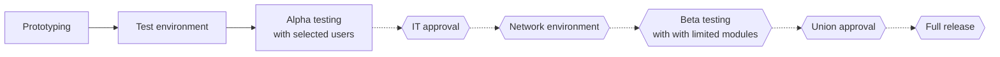
## discussion
* recall option (how?)
* post-market surveillance (how?)
* post-market evaluation (how?)

## to do
* data deletion in accordance to dsgvo, eg. recommend deletion after x years?
* unittests
* improve screenreader accessibility
* responsibilities
    * handle hidden attribute?
* schedule user trainings
    * sqlsrv alter date default null
    * audit search for *add planning option*
    * _shared method for dialog assembly
    * implement dialog content response as render response in case of complaint record
    * username with dataset
    * planned json author, date, scheduled time
    * convert scheduled training to fulfilled, add date, expiry, experience points
    * review file upload options from dialog form
    * consider file uploads within training evaluation form by default to append certificates

## Content
* [Aims](#aims)
    * [Key aspects](#key-aspects)
    * [Necessary infrastructure](#necessary-infrastructure)
    * [What it is not](#what-it-is-not)
    * [Extras](#extras)
    * [Data integrity](#data-integrity)
    * [Tips](#tips)
* [Modules](#modules)
    * [Application](#application)
        * [Users](#users)
        * [Manual](#manual)
    * [Communication](#communication)
        * [Conversations](#conversations)
        * [Personnel register](#personnel-register)
        * [Text recommendations](#text-recommendations)
        * [Responsibilities](#responsibilities)
        * [Improvement suggestions](#improvement-suggestions)
    * [Records](#records)
        * [Documents](#documents)
        * [Records](#records-1)
        * [Risk management](#risk-management)
        * [Audit](#audit)
        * [Management review](#management-review)
    * [Calendar](#calendar)
        * [Appointment notice](#appointment-notice)
        * [Scheduling](#scheduling)
        * [Long term planning](#long-term-planning)
        * [Timesheet](#timesheet)
    * [Files](#files)
    * [Purchase](#purchase)
        * [Vendor and product management](#vendor-and-product-management)
        * [Order](#order)
    * [Tools](#tools)
    * [Regulatory evaluations and summaries](#regulatory-evaluations-and-summaries)
* [Intended regulatory goals](#intended-regulatory-goals)
* [Prerequisites](#prerequisites)
    * [Installation](#installation)
    * [Runtime variables](#runtime-variables)
    * [Useage notes and caveats](#useage-notes-and-caveats)
    * [Known deficencies](#known-deficencies)
    * [Customisation](#customisation)
    * [User acceptance considerations](#user-acceptance-considerations)
    * [Importing vendor pricelists](#importing-vendor-pricelists)
* [CSV processor](#csv-processor)
* [Regulatory software requirements](#regulatory-software-requirements)
    * [Clinical evaluation, clinical evaluation plan, clinical evaluation report](#clinical-evaluation-clinical-evaluation-plan-clinical-evaluation-report)
    * [Data protection](#data-protection)
    * [General](#general)
    * [Information security](#information-security)
    * [Performance evaluation](#performance-evaluation)
    * [Tech doc](#tech-doc)
        * [Stakeholder requirements](#stakeholder-requirements)
        * [Risk assessment](#risk-assessment)
        * [Accessibility statement](#accessibility-statement)
* [Code design patterns](#code-design-patterns)
    * [Frontend design](#frontend-design)
    * [Backend design](#backend-design)
    * [Integrations tests](#integration-test)
    * [Stress test and performance](#stress-test-and-performance)
    * [Deployment process](#deployment-process)
* [API documentation](#api-documentation)
    * [Request flow](#request-flow)
    * [Authentification flow](#authentification-flow)
    * [Application endpoints](#application-endpoints)
    * [Audit endpoints](#audit-endpoints)
    * [Calendar endpoints](#calendar-endpoints)
    * [Consumables endpoints](#consumables-endpoints)
    * [CSV filter endpoints](#csv-filter-endpoints)
    * [Document endpoints](#document-endpoints)
    * [File endpoints](#file-endpoints)
    * [Measure endpoints](#measure-endpoints)
    * [Message endpoints](#message-endpoints)
    * [Notification endpoints](#notification-endpoints)
    * [Order endpoints](#order-endpoints)
    * [Record endpoints](#record-endpoints)
    * [Responsibility endpoints](#responsibility-endpoints)
    * [Risk endpoints](#risk-endpoints)
    * [Texttemplate endpoints](#texttemplate-endpoints)
    * [Tool endpoints](#tool-endpoints)
    * [User endpoints](#user-endpoints)
* [Statement on technical guidelines on data security](#statement-on-technical-guidelines-on-data-security)
    * [Terms of service for using the application](#terms-of-service-for-using-the-application)
    * [Web Application](#web-application)
        * [3.1.1 Prüfaspekt (1): Anwendungszweck](#311-prüfaspekt-1-anwendungszweck)
        * [3.1.2 Prüfaspekt (2): Architektur](#312-prüfaspekt-2-architektur)
        * [3.1.3 Prüfaspekt (3): Quellcode](#313-prüfaspekt-3-quellcode)
        * [3.1.4 Prüfaspekt (4): Drittanbieter-Software](#314-prüfaspekt-4-drittanbieter-software)
        * [3.1.5 Prüfaspekt (5): Kryptographische Umsetzung](#315-prüfaspekt-5-kryptographische-umsetzung)
        * [3.1.6 Prüfaspekt (6): Authentisierung und Authentifizierung](#315-prüfaspekt-5-kryptographische-umsetzung)
        * [3.1.6.1 Authentifizierung über Passwort](#3161-authentifizierung-über-passwort)
        * [3.1.7 Prüfaspekt (7): Datensicherheit](#317-prüfaspekt-7-datensicherheit)
        * [3.1.8 Prüfaspekt (8): Kostenpflichtige Ressourcen](#318-prüfaspekt-8-kostenpflichtige-ressourcen)
        * [3.1.9 Prüfaspekt (9): Netzwerkkommunikation](#319-prüfaspekt-9-netzwerkkommunikation)
        * [3.1.10 Prüfaspekt (10): Plattformspezifische Interaktionen](#3110-prüfaspekt-10-plattformspezifische-interaktionen)
        * [3.1.11 Prüfaspekt (11): Resilienz](#3111-prüfaspekt-11-resilienz)
    * [Backend](#backend)
        * [3.1.1 Prüfaspekt (1): Anwendungszweck](#311-prüfaspekt-1-anwendungszweck-1)
        * [3.1.2 Prüfaspekt (2): Architektur](#312-prüfaspekt-2-architektur-1)
        * [3.1.3 Prüfaspekt (3): Quellcode](#313-prüfaspekt-3-quellcode-1)
        * [3.1.4 Prüfaspekt (4): Drittanbieter-Software](#314-prüfaspekt-4-drittanbieter-software-1)
        * [3.1.5 Prüfaspekt (5): Kryptographische Umsetzung](#315-prüfaspekt-5-kryptographische-umsetzung-1)
        * [3.1.5.1 Zufallszahlen](#3151-zufallszahlen)
        * [3.1.6 Prüfaspekt (6): Authentisierung und Authentifizierung](#316-prüfaspekt-6-authentisierung-und-authentifizierung-1)
        * [3.1.6.1 Authentifizierung über Passwort](#3161-authentifizierung-über-passwort-1)
        * [3.1.7 Prüfaspekt (7): Datensicherheit](#317-prüfaspekt-7-datensicherheit-1)
        * [3.1.8 Prüfaspekt (8): Kostenpflichtige Ressourcen](#318-prüfaspekt-8-kostenpflichtige-ressourcen-1)
        * [3.1.9 Prüfaspekt (9): Netzwerkkommunikation](#319-prüfaspekt-9-netzwerkkommunikation-1)
        * [3.1.10 Prüfaspekt (10): Organisatorische Sicherheit](#3110-prüfaspekt-10-organisatorische-sicherheit)
* [Ressources](#ressources)
* [License](#license)

The most recent documentation is available at [https://github.com/erroronline1/caro](https://github.com/erroronline1/caro)

# Aims
This software aims to support you with your ISO 13485 quality management system and support internal communication. It is supposed to run as a web application on a server. Data safety measures are designed to be used in a closed network environment. The architecture enables staff to access and append data where other ERP-software may be limited due to licensing.

Data gathering is supposed to be completely digital and finally wants to get rid of a paper based documentation. There may be other pieces of software with a similar goal but many of them come from another direction - managing rehabilitation devices, focussing on custom orthopaedic footwear, tracing productivity - instead of the primary record aspect of the CARO App for custom-made aids in small- and medium-sized companies. Let alone cumbersome UI of some programs which has also led to a goal of being consistent easy to use and recognizable.

## Key aspects
* Document management: full version control, reusable components, with access to former versions
* Easy form creation: simplified form assembly and seamless integration into the application
* Risk management: with alignment check of risks and medical device characteristics
* Trainings and skills management: quick overview with evaluation reminder and highlighted expiries
* Task and absence schedules: plan tasks while having an overview on personnel ressources
* Structured procurement: reduced inquiries, automated reminders, incorporation records and sample checks
* Role management: defined user permissions and appropriate information load
* Audit support: prepare, schedule and execute internal audits, summarizing application data to tidy overviews
* Improvement suggestions: everyone can suggest improvements, express their opinion and look at resulting measures
* Device agnostic: web-application accessible by any suitable device
* No artificial intelligence: you have absolute data authority


## Necessary infrastructure 
You'll need a server to host the web application and network access for all terminal devices. The application is designed for mobile first e.g. Android tablets or iPads, but can be used on desktop computers as well. In fact some of the features are usable on desktop only (form creation, text templates and audit templates).

Main goal is a distribution of mobile devices to the whole staff or at least key positions and workspaces. After all, administration can not demand going digital without providing a decent infrastructure. Scanning devices are optional but all scanning could be achieved with inbuilt cameras as well. 

For technical details see [prerequisites](#prerequisites). 

## What it is not
Beside some architectural decisions to fit regulatory requirements the app is not a fully preset quality management system. You're still in control of your contents. Define your processes, documents and responsibilities for yourself. The application is solely supposed to help you with a structured flow and semiautomated fulfilment of regulatory issues. *Permissions showed within the below flowcharts resemble the non-binding recommended default settings.*

The application does not replace an ERP system. Procurement data is solely accessible within the application based on its own database. This is a concious decision against overwhelming ERP product databases that are not maintainable in reality and more often than not require a proprietary interface. The products database is supposed to be populated with vendors pricelists and sanitized from any unimportant data on a regular basis.

Orders can be deleted by administrative users and requesting unit members at any time and will be deleted by default after a set timespan once being delivered. This module is for operational communication only, not for persistent documentation purpose.

## Extras
* Text recommendations
    * Default and adaptive [texts can be defined](#text-recommendations) to support a consistent company language.
* File sharing
    * The application has a [sharepoint](#files) for files and an integrated STL-viewer to easily exchange information.
* CSV filtering
    * The application is capable of versatile [filtering and processing of CSV-files](#csv-processor).
* Timezones and states
    * The application can handle different timezones and states regarding holidays, depending on your sites.

[Content](#content)

## Data integrity
As records intend to save the submitting users name, group accounts are unrecommended albeit being possible but with limited access. Instead every user is supposed to have their own account. Defined authorized users can create, edit and delete users. To make things as easy as possible a unique 64 byte token has to be created. This token will be converted into an QR code that is scannable on login. This avoids remembering passwords and user names, as well as the need of typing in several pieces of information. The process is quite quick and enables session switching on limited access to terminal devices.

Form data and requests occasionally contain ids to access distinct contents. Technically it is possible to compromise requests from the client side but still considered reasonable giving any verification on the server side can hardly guess the original intent. It appears not less secure than intentionally providing false data on any paper based documentation.

An encoded user identifier is added to the payload of submitted form data, the server verifies the identity and data integrity with a checksum.

Documents can contain a digital signature pad. Please note due to lacking certification this is only a simple electronic signature (SES) according to eIDAS. You can define where this might be suitable enough for your processes.

Timestamps are not qualified. A reduced validity than manual or stamped dates on paper documents is currently not discernible.

[Content](#content)

## Tips
* Use a calendar-button within surveillance documents to immediately set the next due date while handling the current documentation.
* Add an option of grandfathering to product incorporation documents to make things easier, especially on transition from another quality management system to the CARO App. Be sure the fulfilments are satisfied on selecting though.


[Content](#content)

# Modules

## Application


### Users
The application provides a dedicated role management for registered users. The whole content is only accessible on login. Users can have different permissions. Set permissions decide what content is available or for which functions users are eligible according to predefined permissions within the apps [setup file](#runtime-variables). The provided example is considered a decent choice, but it is up to you.

Some permissions/restrictions are default set though:

Timesheets are accessible only if weekly hours are defined for the user - even the application admin.

* User
    * can see orders for own assigned organizational units only
    * can export own timesheet only
    * can perform the MDR§14 sample check and gather information for product incorporation
* Group
    * can **NEVER** add records due to limited identification data
    * can place orders, but will be prompted to identify themself
    * can see orders for own assigned organizational units only
    * can **NEVER** incorporate and sample check due to limited identification data
    * can **NEVER** access nor contribute to timesheets
* Supervisor
    * can export all timesheets of assigned unit members
    * can edit, delete and close scheduled events and timesheet entries of assigned units and unit members
* Application admin
    * **full access**
    * can approve as all eligible permission groups
    * can export all timesheets
    * default user CARO App has this permission. Use it to initially implement new users.
    * assign only to trusted, preferably administative staff members

Users can have multiple assigned organizational units and permissions.

On registering a new user a default profile picture is generated. Custom set pictures can be restored to default. A generated order authorization pin can be used to approve orders. Adding trainings is granted to defined authorized users only, to make sure certificates are acknowledged. Skill levels (according to the [intended list](#customisation)) can be modified. The generated access token can be exported and, for example, used as a laminated card.

Usernames can be edited for societal reasons. This does not affect stored names within records as these are not linked but stored as plain text to avoid information loss on deleting any user. The profile picture will always be overwritten with the default image following a name change.

> On rare occasions the QR-token may not be readable by the inbuilt reader. It is advised to check the compatibility with the scanner from [tools](#tools) before passing, generating a new one if required.


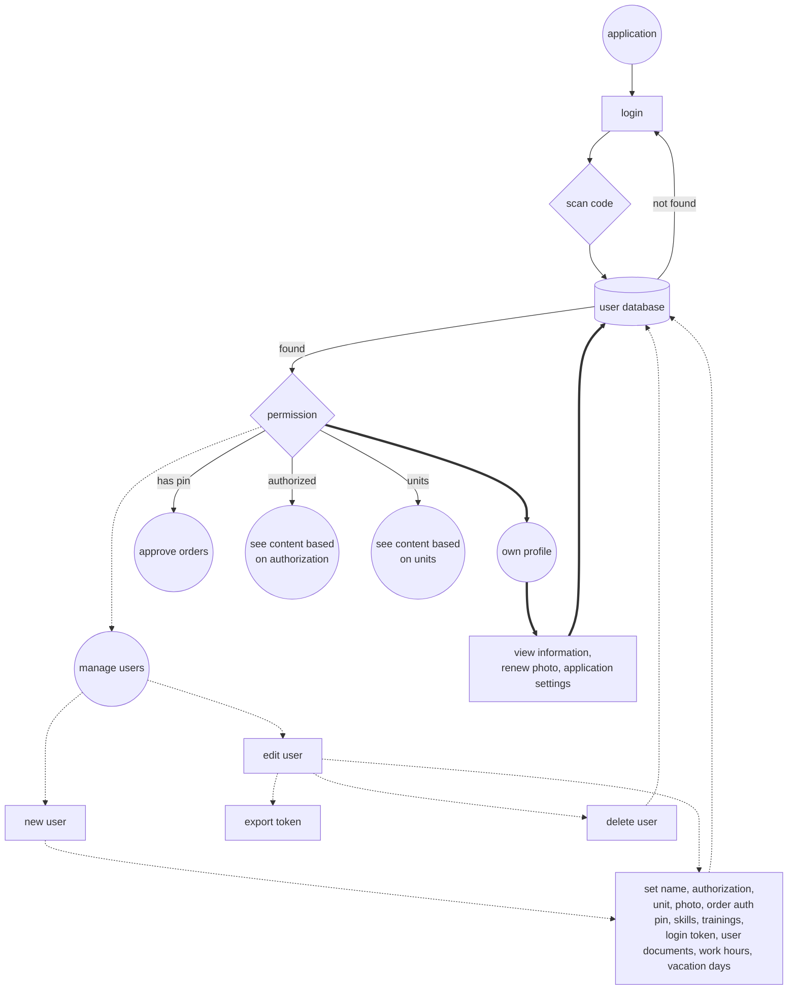

Users can see their information in the profile section for transparency reasons. They can modify their profile picture and set individual application settings.


[Content](#content)

### Manual
Set up the manual according to your users comprehension. While editing single entries you can select affected permission roles to unclutter the landing page display for others. On installation a default manual will be inserted in the [default language](#runtime-variables).

## Communication


### Conversations
This is for internal communication and system alerts only and has no record aspect. Messages are grouped by conversation with the respective counterpart. You can message any registered user but the system user or yourself and delete any conversation at any time. Multiple recipients can be separated by comma or semicolon. Tapping on the profile picture of any message enables forwarding. New messages will trigger a system alert. The application can send messages to user groups if reasonable.


[Content](#content)

### Personnel register
The personnel register gives an overview of all registered users, also grouped by organizational units and permissions. Users and whole units and permission groups can be sent a message directly from here.

[Content](#content)

### Text recommendations
To avoid unneccesary or repetitive poetry and support a consistent linguistic style text recommendations can be provided. These are assembled with predefined text chunks for either replacements that handle pronouns or generic text chunks. Latter can make use of former. Currently a german language model is implemented where replacements are defined as chunks of
* Child female - the girl
* Child male - the boy
* Child genderless - the child
* Adult female - the woman
* Adult male - the man
* Adult genderless - the person
* Informal you - "buddy"
* Formal you - "your honor" (this is the german model part where there is more than just "you")

Such a replacement may be named *addressee*. If a generic text chunk contains :addressee this will be replaced with the chosen genus from a selection list. If you intend to write a text for the insurance company you may talk about the patient and select a genus from the first six options, if you address the customer directly you may choose one of the last two depending on your individual distance. A selection of the desired genus will be rendered on the creation form and reused for all types of replacements.

On creating a text you can make use of predefined replacements that may contain the grammatical case (e.g. *:addresseeNominative*, *:addresseeAccusative*, *:addresseeDative*, etc.). Undefined placeholders will be rendered to an input field where it can be typed in and used repeatedly:

*"We write to inform you about :addresseeAccusative, :name. We just want to tell you :name is doing fine. :addresseeNominative can make use of the aid."*

rendered to *"We write to inform you about **the woman Gladys**. We just want to tell you **Gladys** is doing fine. **The woman** can make use od the aid."*

The [vendor management](#vendor-and-product-management) makes use of system preset placeholders. Text recommendations making use of :CID, :PRD or :ECR for example can import prepared values for these.

Text templates arrange generic text chunks. Arrange or group chunks within the [drag and drop editor](#miscellaneous). Chunks can always be unselected to customize to the actual use case. Grouping chunks enhances the perception of the creation form.

Output will be copied to clipboad on clicking or tapping the output field.


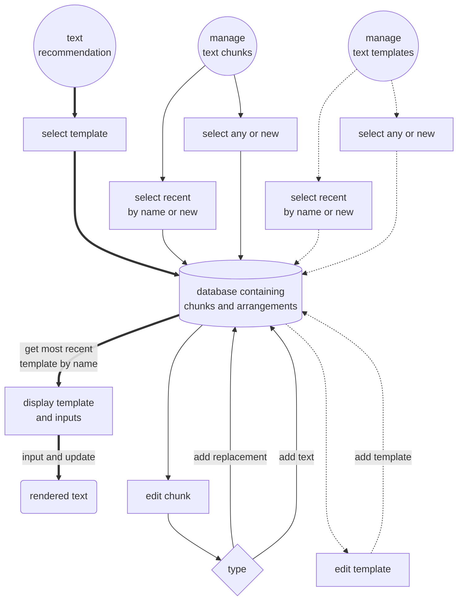

[Content](#content)

### Responsibilities
Authorized users can define responsibilities for given tasks and assign users as well as their proxy. Assigned users will retrieve a message and a menu notification to review the assignments and accept the responsibilities. Responsibilities have a mandatory applicability timespan after which a calendar entry reminds admin to renew the expired item. Responsibilities can be edited at any time, only users have to reaccept their assignment for transparency reasons. Responsibilities are not a persistent record as they serve primarily operational information. The overview can be filtered by units as well as displaying only own responsibilities. 


[Content](#content)

### Improvement suggestions
All users can publicy suggest improvements to any topic, including processes. Even anonymous suggestions are allowed. On new suggestions a system alert to all users is raised. Users can express their opinion on topics. Authorized users can describe measures and evaluations or close the topic. The submitting user will receive a message, that their topic has been processed.

To reduce pointless data and possible malignant spam, suggestions can be deleted although by default it is not recommended to do so. Entries have no record character but are supposed to gather opinion formation and serve as a source for quality improvement and management reporting.


[Content](#content)

## Records


### Documents
Several other pieces of software claim to handle your documents and speak of version control. In fact they just import PDF-files that have to be generated elsewhere. (Without going into excessive research) there has been no information on how document control and versioning is actually achieved. The CARO App just doesn't follow this as all: your documents are supposed to be created within the application itself. By aiming for a paperless solution this might be suitable enough; documents can still be exported as editable or prefilled PDFs within boundaries though.

Just don't do it like this. Seek help before doing this:


Documents are modular. To create tracked and versioned documents, create reusable document components and assemble documents from components. Components and documents are assigned to units. This enhances the overview within the editor and allows for reduced distraction during regular use for the user being able to filter selecteable documents unitwise.

#### Component editing
Available elements for components or rather documents are:
* scanner field, optional as multiple and context identifier
* text section for information purpose without input
* image for including e.g. infographics
* single line text input, optional as multiple and with former inputs recommended
* multi line text input, optional access to text templates and with former inputs recommended
* number input, optional as multiple. Controls appearance of keypad on mobile devices
* date input. Controls appearance of input options
* phone input. Controls appearance of keypad on mobile devices
* mail input. Controls appearance of keypad on mobile devices
* link input. Wraps the value with the specific character pattern *href='{VALUE}'* to be displayed as a link within the application. This works in principle manually for other fields as well, if this kind of value is provided. This possible adverse behaviour is recognized within the [risk assessment](#risk-assessment)
* product selection input, optional as multiple. Accesses the products database
* range input, min, max and step optional
* links
* multiple selection options
* single selection options (buttons)
* single selection options (list), optional as multiple. Entries are displayed in the given order. If provided in alphabetical order (punctuation, A-Z, a-z) the list will be grouped by initials on more than 12 entries. 
* file upload, optional as multiple
* photo upload, optional as multiple. Mobile devices access camera, desktops open a file selection
* signature field
* calendar button
* file reference picker, optional as multiple. Accesses provided files and returns their location, STL preview included if applicable. Consider that files may not be permanent and this field only suffices for short term information transfer.
* document link, just for display or to continue transferring identifier
* horizontal line for document structure

Most input types can be optional declared as required. *Multiple* means another input will be appear after input. In case of file uploads the selector allows multiple files at once. Users with [*admistration*-privileges](#users) can directly import and export components as JSON-notation.
Form fields declared as multiple will only show up in document exports if they have a value. Their name will be extended by a numeration in parentheses.

> [Regulatory evaluations and summaries](#regulatory-evaluations-and-summaries) allow for an export of records data. This export contains the most recent data of distinct document issues in their respective table column. It is beneficial and recommended that document issues do not repeat themself within components and documents. Repetitions do not harm the documentation per se, but may limit the analytical possibilities for the data dump.

#### *Caveat:*
Some elements are only processible as proper records.
* file,
* photo,
* product selection,
* signature and
* calendarbutton

are not processable for document-contexts within the [languagefiles](#customisation) group documentcontext.notdisplayedinrecords (by default: MDR §14 Sample Check, Product incorporation, Training evaluation and Vendor evaluation). These input fields will be ignored. Former input recommendations are not available.

Elements can be rearranged via [drag and drop editor](#miscellaneous). Most elements can be edited - their content can be imported into the respective editor to be altered or appended and reinserted afterwards. The original element remains though and has to be deleted manually. 

The respective manager provides a selection for recent approved elements as well as a selection for all entries within the database.

also see [User acceptance considerations](#user-acceptance-considerations)

#### Document editing
Documents can be assembled by selecting any of the approved components. Components can be rearranged via [drag and drop editor](#miscellaneous).

Documents can have alternative search terms. A context must be provided to ensure a plausibility check for occasionally necessary elements. A regulatory context is optional but recommended.

Documents can have a restricted access to be only visible to defined roles. This way records are possible that are not meant to be public (e.g. job interviews or staff appraisals).

Documents can be exported as an editable PDF in hopefully rare scenarios where a digital record is somehow an issue. Photo- and upload-options as well as buttons are replaced by a hint, identifiers are embedded in the header. Permission to export is restricted by default to defined authorized users to prevent distribution of outdated versions and support an improved data collection within the application. Authorized document creators can decide for general permission though. It is recommended to transfer the data later or at least append the scanned or photographed document to the applicable record (given a suitable document), while in the latter case any searchability and quick overviews suffer.

The respective manager provides a selection for recent approved elements as well as a selection for all entries within the database.


#### Document control
Components and documents have to be approved by defined authorized users to take effect. An approvement request for documents and components is delivered by the applications [messenger](#conversations) to users with set permissions; supervisors, if set, for the defined organizational unit. Approval is granted by ticking a checkmark while being logged in with the respective assigned roles/permissions. All registered users get a message on document updates.

Versioning is achieved by a timestamp. 

Furthermore documents can be grouped to document bundles. This way anyone can check if all necessary documents have been taken into account for defined use cases. Document bundles are not subject to approval and versioning but also can not be deleted, only hidden.

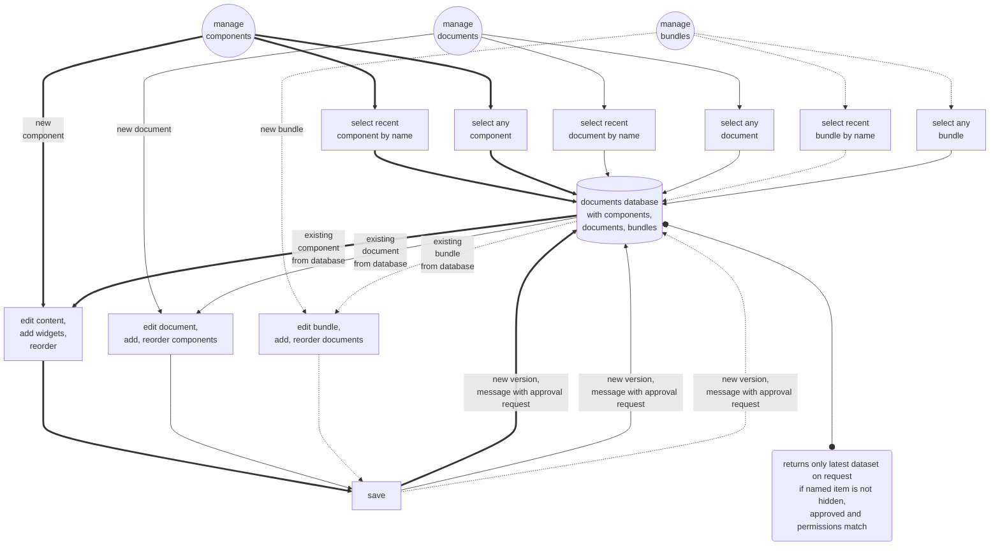

Screen document


Exported document


[Content](#content)

### Records
Records store all inputs for any selected document. Some document contexts require an identifier that groups records to a summary. Summaries can be exported. Full summaries contain all inputs in chronological order, simplified summaries contain the most recent input only. This may lack transparency but is suitable for a tidy overview for possible third parties. Another usecase are manuals whose content can be saved to the records but also exported for end users including notes anytime.

Paperless might not be suitable in humid environments. Thus single documents can be exported as well e.g. to have data at hand where electronic devices may take damage. 

The identifier is always a QR-code with additional readable content that will appear on any export of identifiable records. To improve workflow identifier labels can be generated to mark product components, exported documents, etc. By scanning the QR-code errors and mix-ups are unlikely. The identifier can also be used to import data from other records in case of comprehensive cases in different organizational units.


On display of any record appear recommendations to complete records according to bundles that match the last recording users units as well as the current viewing user, assuming cases are processed by members of the same unit in general. Checking for completeness of any document bundles can be applied as well.

Records can be marked as closed to disappear from the records overview and not being taken into account for open cases on the landing page summary, but still can be accessed after filtering/searching any keyword within the identifier. On further contribution the closed state is revoked by default. This applies to records containing complaints too. Complaints must be closed by all [defined roles](#runtime-variables), repeatedly if any data is appended to the respective record.
Unclosed records will be reminded of periodically after a [defined timespan](#runtime-variables) to all users of the most recent recording users organisational units.

Case documentations allow a setting of the current case state (like reimbursement granted, production tasked, etc.). Records within the overview can be filtered according to case states. Users changing the state habe the option to inform other users, units or respective supervisors via message. There is also an option to message an inquiry to anybody with a direct link embedded for quick access.

If a record is marked as a complaint by accident it can be assigned another type by defined roles. Retyping will be recorded as well.
Records can be assigned a new identifier, e.g. on typing errors or accidentally duplicate creation. In the latter case if the new identifier is already in use all records will be merged with the existing one. This action as well as assigning a new identifier will be recorded as well.

If records contain data from restricted documents, summaries will only contain these data if the requesting user has the permission to handle the document as well. It is up to you if it is reasonable to handle document bundles this way:
* On one hand this may declutter available documents and information for some units, e.g. hiding administrative content from the workforce,
* on the other hand you have to take more care of role management and who is to export actual complete data in case of requests.

All alterings on records (reidentification, retyping, case state) are recorded as well.

Records outside of manually created documents, that are being supported by the application (e.g. case state, see above), are being stored in the [system language](#runtime-variables).


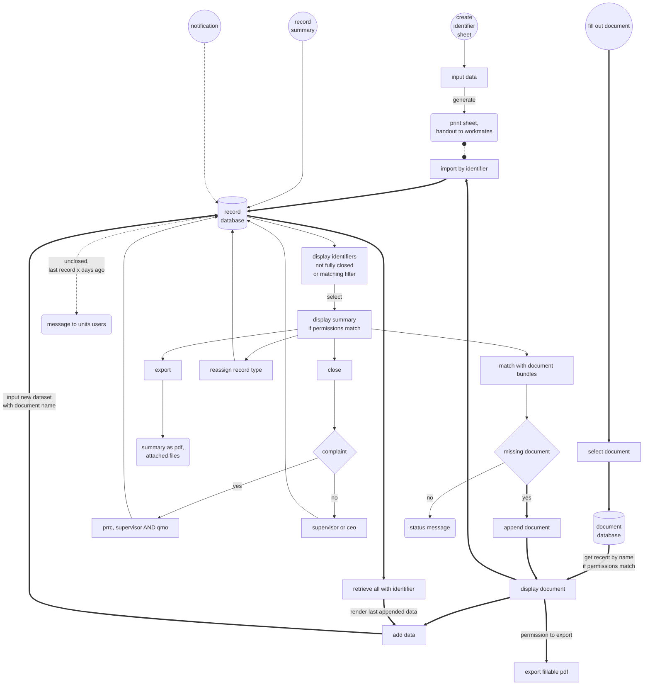

Exported full record summary


Exported reduced record summary


[Content](#content)

### Risk management
The risk management supports describing risks according to ISO 14971 and in accordance to [DGIHV](https://www.dgihv.org) proposals. Identified risks, that may have to be taken into account for any process are defined within the [language file](#customisation) (also see [here](#runtime-variables)).

As required with ISO 14971 you can describe characteristics for medical devices and applicable risks. Since the DGIHV fortunately decided defining characteristics and risks on a group of medical devices (e.g. prostheses and orthoses in general) as reasonable, all evaluations are based and grouped by a process.
Furthermore you are supposed to track a cause and effect, recognize a probability and damage, describe measures, reevaluate probability and damage, do a risk-benefit assessment and define remaining measures. The form displays a message whether the risk (before and after measure) passes the acceptance level threshold as defined within [config.ini](#runtime-variables). The threshold is the product of probability times damage according to their position within the language files lists for risk.probabilities and risk.damages. This method is the most practical way of an algorithmic processing and highlighting of acceptance levels. To proof your regulatory compliance you can link any of your documents containing measures as defined.

Entries are persistent and can be exported if desired through the [evaluation and summary-module](#regulatory-evaluations-and-summaries). Available entries store and display the user name and date of the last edit. 


[Content](#content)

### Audit
The application enables you to prepare internal audits, including programme objectives, audit method and an import of previous summaries for selected units. Question phrasing from other templates can be reused and every question can be assigned fitting regulatory issues. On editing the audit programme questions can be added, deleted, reordered by [dragging and dropping](#miscellaneous) and reimported. The summary of a previous audit for the respective unit can be imported for upcoming reference.
Audits can be added to the calendar from the form as well, informing selected units.


Executing an audit starts by selecting one of the prepared templates. Breaks and edits on ongoing audits are always possible unless the audit is marked as finished. After that the audit is not longer editable nor deleteable and becomes a system record. On finishing an audit the report is distributed via [messenger](#conversations) toward all users with the [`regulatory`-permission](#runtime-variables) and all members of the audited unit. Closed audits can be displayed and exported within the [evaluation and summary-module](#regulatory-evaluations-and-summaries).


[Content](#content)

### Management review
Similar to audits you can enter management reviews, save and edit later, make them a permanent system record by closing them. The default language-files contain all required issues, so no topic is forgotten. Currently reviews are text only, so no imgages, attachments or tables. On finishing a management review an alert is distributed via [messenger](#conversations) toward all users with the [`regulatory`-permission](#runtime-variables). Closed management reviews can be displayed and exported within the [evaluation and summary-module](#regulatory-evaluations-and-summaries).

[Content](#content)

## Calendar


### Appointment notice
Create an appointment notice for customers. Setting relevant data you can decide to either hand out a printed version containing the appointment data as well as a QR-code for import into a mobile device calendar or directly an ICS-file to send by mail or messenger.


[Content](#content)

### Scheduling
Add events to the calendar. The landing page gives a brief overview of the scheduled events and the current week as well as off duty workmates at a quick glance. Events can be added and completed by every user, editing and deleting is permitted to defined authorized users only.

Events may trigger a [message](#conversations) to a defined user group if set.

As scheduling is supposed to help you with operational planning (e.g. daily assigned tasks for a unit) and reminders in conjunction with records in the first place you get only to select dates. This unclutters the input form too.

Displayed calendars do include weekends and any non working day intentionally in case some event occurs non-standard or recurring events happen to be dated then, to not being overlooked.

Scheduling and its events are not part of the records per se as any treatment measure is supposed to have its own timed [record](#records).


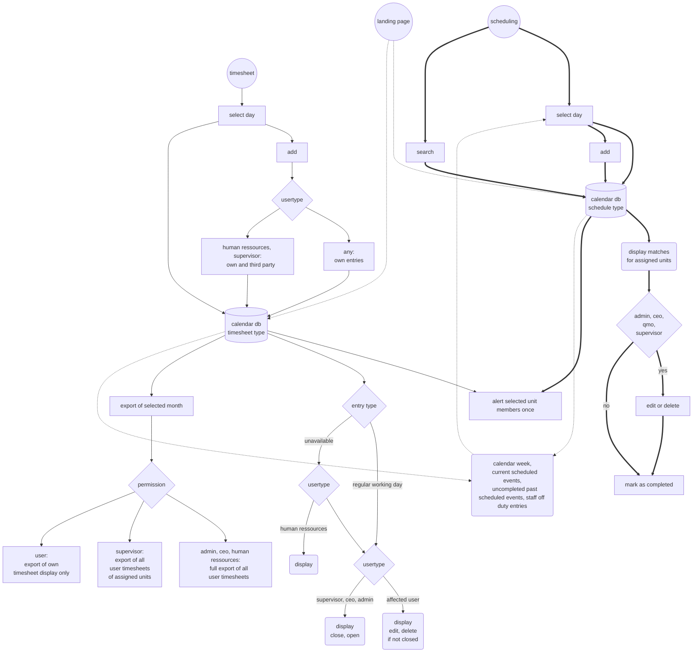

[Content](#content)

### Long term planning
The calendar supports long term planning like used for assigning appretices to units over the course of their training. Within defined timespans color markings can be used e.g. to display allocation. The editor allows for import of previous plans into the new timespan as well as adding and removing names and color selections. You don't necessarily have to assign persons and units - planning can be used for any porpose. Plans are accessible by anyone once being marked as finished, editable by permitted users only. Longterm planning is informal only and not a persistent record.

Planning is easy to use:
* assign a name, define a timespan
* define affected names or topics
* define colors for units or actions
* colourize the timespan for each name/topic with a selected color using a mouse or suitable pointer

Given timespans are corrected to the first day of selected starting month and last day of ending month. Colourizing is possible for half months.


[Content](#content)

### Timesheet
Beside scheduling, the calendar can be used to document working hours of the staff. This is originally loosely connected with planning as far as vacations and other leaves can be entered, displayed and may affect scheduling events. While we're at it we can as well write the working hours up and summarize them. Displaying and exporting is permitted to the owning user, supervisor and defined authorized users only. Latter are allowed to contribute an entry for every user to inform units about sick leave. Editing is only permitted to the owning user for unclosed entries. Entries approval state can be set by supervisors of the respective unit and defined authorized users for full access only. User settings allow for entering weekly hours to calculate properly. Timetracking happens based on trust, while employees record their working hours manually.

This is supposed to ensure a transparent communication, data safety and collective agreements on timetracking. It aims to address all known concerns of german law and staff council/union. It's not a persistent tracking though, for the database will be cleaned from all entries where the affected user is deleted. Timesheets can be exported, which is preferred anyway by current experience and is highly recommended if used for documentation regarding labour laws. Records correspond to established methods type- and scopewise, improve security on sensible data accessible only by a restricted user group and simplify calculations for honest tracked data.

Off duty events are displayed with the scheduled events, but scheduled events are also displayed within the timesheet calendar to raise awareness about possible workload of the remaining staff.

*Warning: current impementation neither takes changes in public holidays nor change of the users state (if selecteable within user profile) into account. Currently changes will affect past timesheet entries and calculate different results. On changes it is recommended to export the most recent timesheets prior to start tracking anew.*

Timesheets support changes in weekly hours and annual vacation though. Respective start dates and values are part of the user settings.

For a correct calculation it is neccessary to provide values as *start-date and annual vacation/weekly hours* in the ISO 8601 format `yyyy-mm-dd XX`, where `XX` stands for number of vacation days or weekly hours. If entering the calculation during a calendar year, actual remaining annual vacation days have to be the initial value. Then the full annual vacation days can be applied by adding a setting for the next year starting on January 1st. On exiting the calculation another setting sould be applied with the annual vacation days up to the exit date. An example for a three years period starting and ending in summer with 30 days of annual vacation per contract would look like:
```
2023-07-01; 15
2024-01-01; 30
2026-01-01; 15
```
Weekly hours look similar like `2023-07-01; 39.5` with allowed decimal values and comma or period as delimiter. The separator between date and value is freely choosable except numbers.

Exports are ordered by user name with exporting user coming first regardless, for convenience.

[Content](#content)

## Files


Defined authorized users can provide files for everyone to access. Also all users can contribute to the open sharepoint where files have a limited timespan and are deleted after a while by default.

STL- and image-files have a preview by default.

This source can also be used to provide documents that are [unsuitable to be filled out digitally](#data-integrity). *Enable export permission for internal documents to avoid version confusion though; register external documents for the same reason.*

External documents as described in ISO 13485 4.2.4 have to be identified and routed. Therefore these files receive special attention and are to be handled with respective records regarding implementation, regulatory context, possible retirement and the username for the last decision. For consistent documentation purpose these files can not be deleted, only set unavailable. Regarding interface partners network resources can be linked as a source as well.


[Content](#content)

## Purchase


### Vendor and product management
Order operations rely on a vendor and product database. Also this is related to incorporation and sample checks of products, document and certification handling. Defined authorized users have permission to manage these categories, add and edit vendors and products, import pricelists and define filters or disable vendors and products. [Importing pricelists](#importing-vendor-pricelists) with filtering makes use of the [CSV processor](#csv-processor).

Vendors are supposed to be evaluated. A document with the *Vendor evaluation*-context is required for this. The evaluation is part of the vendor view in edit mode by default. Here certificate files can be added too. The application will match the provided expiry-date and contribute to the [calendar](#calendar) once the date has passed to alert relevant units to look after an update. 
The edit view for vendors allows for selecting [text recommendations](#text-recommendations). If these are set up properly, prepared values can be imported easily. 
Small vendor portfolios may be edited within the application primarily or at least initially. Article-lists can be exported as well as the import filter. Latter [will be generated](#default-filter-on-export) if not defined.
> Generated filters will not work on original pricelists, exported pricelists will not work with custom filter rules!

Defined authorized users (e.g. *purchase assistant*) can edit the alias definition of products to disburden purchase and enhance identification of products with company customs.

While editing products, one can edit the
* *trading good*-setting,
* *has expiry date*-setting,
* *special attention*-setting (meaning being defined within languagefile),
* *stock item*-setting
* revoke a possible *incorporated*-state and
* set the product *active and available* or *inactive*.

On setting any of these, similar products can be selected to apply this setting to as well. The selection happens to propose products of the same vendor whose article number has a set up similarity (as defined within [config.ini](#runtime-variables)).

Disabled products are not accessible through the order module. Products can be deleted as long as they are not marked as protected. Vendors are not deleteable.


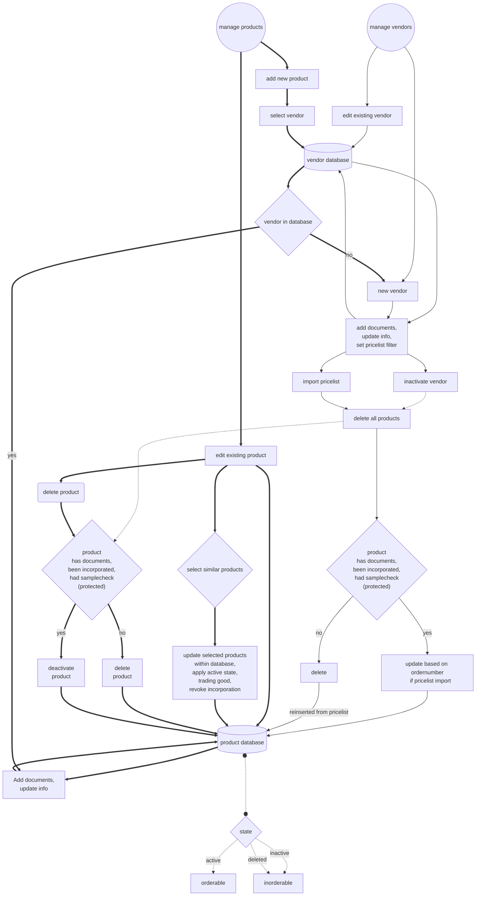

[Content](#content)

### Order
The order module supports all parties. Purchase is supposed to obtain structured and complete data for placed orders and ordering units get information about the order state.
Products are intended to be selected from the database populated by pricelist imports. Manual ordering is possible though. But only products within the database can provide additional information:
Ordered products identify themself as incorporated or not or whether they are qualified for a necessary sample check. Both can be done from the list of ordered products, during operations and without being mixed-up. Delivered products get an update on the last ordered date.
Manual orders allow a quick import to the products database.

Sometimes purchase knows better about favourable terms. If an ordering user doesn't mind about the delivering vendor they can tell purchase to order something similar as well.

Orders may have to be approved; pending approvals sum up and can be batch approved by users with an order authentification pin, personal access token or signature, based on [configuration settings](#runtime-variables).

Approved orders can be marked as *ordered*, *partially received*, *received*, *partially delivered*, *delivered* and *archived*. Delivered orders which are not archived will be deleted by default after a set timespan. Also purchase can disapprove an order for any suitable reason. In this case a message can be appended and all users of the assigned organizational unit will be informed about the lack of order processing. Ordered but not yet received items will periodically be reminded of as per [config.ini](#runtime-variables), for purchase to enquire a shipping date from the vendor.
If purchase is allowed to order something similar there will be a reminder to update the order for the correct product if necessary, to not mess up the system im terms of incorporation, sample checks or traceability. 

Information can be added anytime.
Processed but not yet received orders can have a order state change in which case the ordering unit will be send a message. These are also cancelable, in which case the order will be sorted to unprocessed with a cancellation flag and message to purchase; a processed cancellation will be deleted. Received products can be marked to be returned. Returns create a new order without changing the original one and without dedicated authorization. Processing return orders flags as received simultaneously - this does not track refunds intentionally, as this happens in other software most of the time and to reduce load on purchase staff a double edit is to be avoided.
All actions offer to append a message.
A label can be created directly from the commission field to support allocation of products during internal delivery.

A label can be created directly from the article number field supplemented by a suitable batch or delivery note number to create a scannable code for material traceability.

Processed orders are also added to a second database with reduced data. This data can be exported through the [evaluation and summary-module](#regulatory-evaluations-and-summaries) and used for vendor evaluation.


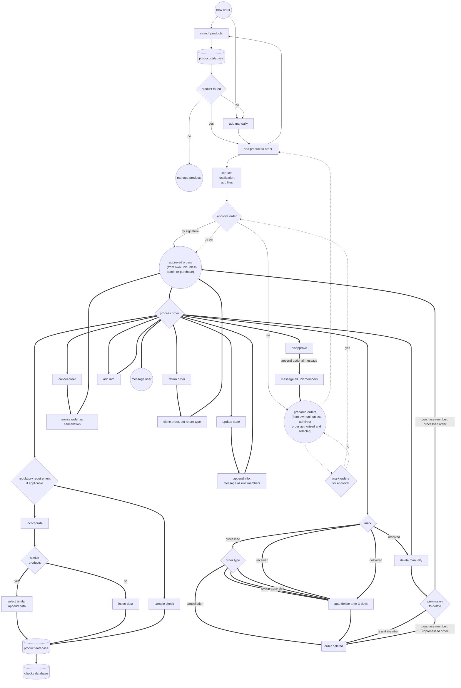
Initialized incorporations are marked as approved by all applicable permissions/roles of the starting user. They may still have to be fully approved by defined authorized roles.
Sample checks are added to the records. New checks trigger a sytem message to these users. Defined authorized users can revoke the sample check from within the [evaluation and summary-module](#regulatory-evaluations-and-summaries).

[Content](#content)

## Tools


Some general tools are available to read and create 2D-barcodes, as well as support recurring calculations, image scaling and zip archiving.

Also a CSV-Filter and its manager are sorted here. The CSV-filter processes respective filetypes using the [CSV processor](#csv-processor) and can be used for any kind of list matching. The filter is accessible by defined authorized users.

## Regulatory evaluations and summaries
This module gathers data from the application in regards of proofing lists for fulfilment of regulatory requirements:
* complaints
* current documents in use including external documents
* experience points based on user trainings, if trainings are assigned some (internal or external)
* incoporated articles
* internal audits
* MDR §14 sample checks
* regulatory issues addressed by documents
* issues with risks definition inconsistencies, incl. structured export of all defined risks
* skill fulfilment
* training evaluation
* user skills and trainings with optional adding mandatory trainings to multiple users at once
* vendor list

Furthermore hopefully beneficial information on
* appropriateness of current documents including a use count gathered from records
* order statistics as a structured Excel-export to support vendor evaluation based on delivery data
* treatment statistics, as all treatment-records within a given timespan can be exported for analysis of distinct record topics, given the [documents](#documents) provide distinct issues. The export file is a CSV that can be processed with a suitable filter using the [CSV-processor](#csv-processor) too.


[Content](#content)

# Intended regulatory goals
Beside the apps architecture you will still have to set up your quality management system. Most of the regulatory issues are supposed to be fulfilled by documents. This way you ensure a proper version control and approval as well as a fulfillment check within the [evaluation and summary-module](#regulatory-evaluations-and-summaries).

Application support legend:
* yes: the applications functionality supports all of the chapters requirements
* partial: the application provides functions to comply to parts of the chapters requirements
* structural: fulfillment is achievable through respective documents

| Regulatory requirement | Application support | Method | Reference |
| ---- | ---- | ---- | ---- |
| ISO 13485 4.1.1 General quality management requirements | partial, structural | &bull; Fulfilment of regulatory issues can be verified, given documents are assigned proper regulatory contexts.<br/>&bull; *describe within documents with the "Process or work instruction"-context* | [Documents](#documents), [Regulatory evaluations and summaries](#regulatory-evaluations-and-summaries)|
| ISO 13485 4.1.2 Process regulation | partial, structural | &bull; The application has a risk management module to consider, evaluate and handle risks.<br/>&bull; *describe within documents with the "Process or work instruction"-context* | [Risk management](#risk-management) |
| ISO 13485 4.1.3 Process monitoring | structural | &bull; *describe within documents with the "Process or work instruction"-context*<br/>&bull; *record with documents with the "General company record"-context* | |
| ISO 13485 4.1.4 Process control | structural | &bull; *describe within documents with the "Process or work instruction"-context*<br/>&bull; *record with documents with the "General company record"-context* | |
| ISO 13485 4.1.5 Process outsourcing | structural | &bull; *describe within documents with the "Process or work instruction"-context*<br/>&bull; *record with documents with the "General company record"-context* | |
| ISO 13485 4.1.6 Validating use of software | structural | &bull; Dedicated documents make use of an identifier, like production documents. Software may each have assigned their distinct identifier.<br/>&bull; computer software and their version tracking on terminal devices may be seen as equipment (7.6) as well.<br/>&bull; *record with documents with the "Equipment Surveillance"-context* | |
| ISO 13485 4.2.1 General record requirements | structural | &bull; *describe within documents with the "Process or work instruction"-context*<br/>&bull; *record with documents with the "General company record"-context* | |
| ISO 13485 4.2.2 Quality management manual | structural | &bull; *describe within documents with the "Process or work instruction"-context* | |
| ISO 13485 4.2.3 Medical device file | partial | &bull; All form data for case documentation accumulates. Any export does contain this data, thus achieves a complete documentation of measures.<br/>&bull; Case documentation documents require a case identifier to ensure respective data is allocated correctly. | [Records](#records) |
| ISO 13485 4.2.4 Document control | yes | &bull; The application enables you to design reusable document components and documents.<br/>&bull; Only the most recent approved components and documents are accessible for use [as long as there is a network connection](#network-connection-handling).<br/>&bull; Creation of new components, documents, document bundles, text chunks and text templates is permitted to defined authorized users only.<br/>&bull; Form components and documents need to be [approved by](#users) defined authorized users. Respective user groups will be alerted by system message on saving of a new element. All members of the respective permission group can approve though, assuming they know what they're doing. Any restricted assignment to organizational units would overcomplicate things regarding reuse of elements by multiple units. Unapproved components do not show up even if the document is approved.<br/>&bull; New components, documents, document bundles, text chunks and text templates are appended to the database as a new entry. Each entry will have a timestamp and the saving user name. Within the respective managers the standard selection will access the most recent approved version. The advanced selection will access any existing version. Components and documents can not be deleted after being approved. Unapproved components and documents are not accessible for use.<br/>&bull; Images for document components will not be deleted after component approvement. They are assigned the components name and timestamp of submission to the filename. They are always accessible on accessing a former version. They can not be reused and are part of the component. <br/>&bull; Documents can be exported blank or digitally prefilled by defined authorized users to limit distribution of outdated versions. Authorized document creators can decide for general permission though.<br/>&bull; Documents can be recreated by any validity date through authorized users to identify changes. <br/>&bull; External documents are routed with recording implementation, regulatory context, possible retirement and most recent user interacting. | [Documents](#documents), [Files](#files) |
| ISO 13485 4.2.5 Record control | yes | &bull; All form data accumulates and is not deleteable from the application. Each entry will have a timestamp and the saving user name. Summaries gather all distinct entries and display them in order of submission.<br/>&bull; Images and files for records will not be deleted. They are assigned the identifier and timestamp of submission to the filename.<br/>&bull; Not only records per se but any changes to record types will be stored as well.<br/>&bull; Records can be exported at any time if you want to have another audit safe storage solution or have to share it with a service provider.<br/>&bull; Accessing any content from the application including confidential personal information of customers requires a personal login from registered users. | [Users](#users), [Records](#records) |
| ISO 13485 5.1 Management commitment | structural | &bull; *describe within documents with the "Process or work instruction"-context* | |
| ISO 13485 5.2 Customer orientation | structural | &bull; *describe within documents with the "Process or work instruction"-context* | |
| ISO 13485 5.3 Quality policy | structural | &bull; *describe within documents with the "Process or work instruction"-context* | |
| ISO 13485 5.4.1 Quality goals | structural | &bull; *describe within documents with the "Process or work instruction"-context* | |
| ISO 13485 5.4.2 Quality management system planning | structural | &bull; *describe within documents with the "Process or work instruction"-context* | |
| ISO 13485 5.5.1 Responsibility and authority | partial | &bull; Users are assigned [special permissions](#users) that specify an explicit access or unclutter menu items.<br/>&bull; Permissions define access to app functions.<br/>&bull; Users can be assigned a pin to approve orders.<br/>&bull; A personnel register summarizes all users, also grouped by organizational unit and permission<br/>&bull; Responsibilities can be defined and are publicly accessible | [Users](#users), [Personnel register](#personnel-register), [Responsibilities](#responsibilities), [Runtime variables](#runtime-variables) |
| ISO 13485 5.5.2 Management representative | structural | &bull; *describe within documents with the "Process or work instruction"-context* | |
| ISO 13485 5.5.3 Internal communication | yes, structural | &bull; The application has a built in [messenger](#conversations). This messenger is being made use of internal modules to ensure decent data distribution e.g. alerting user groups for approving new document components and documents, alerting user groups about disapproved orders and order state changes, messaging inquiries to ordering users, alerting user groups about scheduled events, alerting about long untouched cases<br/>&bull; The application has a built in calendar. This calendar is supposed to assist in scheduling operations and keeping track of time critical recurring events like calibrations etc.<br/>&bull; The application has an ordering module. Orders can be prepared and approved. Purchase will have all necessary data from vendor pricelists to handle the order request and can mark the order as processed thus giving immediate feedback to the ordering person.<br/>&bull; The application has a sharepoint for files and an STL-viewer to easily exchange information overstraining the messenger.<br/>&bull; The interface alerts on new messages, approved unprocessed orders (purchase members) and unclosed calendar events. The landing page also displays a brief summary of unfinished record cases and scheduled events for the current week as well as unfinished events.<br/>&bull; Documents can link to other documents being displayed (e.g. process or work instructions) to have a quick glance and transparent transfer.<br/>&bull; *describe within documents with the "Process or work instruction"-context* | [Conversations](#conversations), [Calendar](#calendar), [Order](#order), [Files](#files), [Regulatory evaluations and summaries](#regulatory-evaluations-and-summaries) |
| ISO 13485 5.6.1 General management assessment | partial | &bull; The application has a form to add, edit or close management reviews, containing required issues by default. | [Management review](#management-review), [Regulatory evaluations and summaries](#regulatory-evaluations-and-summaries) |
| ISO 13485 5.6.2 Rating input | yes | &bull; All required issues are displayed and can / should be commented on | [Runtime variables](#runtime-variables) |
| ISO 13485 5.6.3 Rating results | yes | &bull; All required issues are displayed and can / should be commented on | [Runtime variables](#runtime-variables) |
| ISO 13485 6.1 Provision of resources | structural | &bull; *describe within documents with the "Process or work instruction"-context* | |
| ISO 13485 6.2 Human resources | yes, structural | &bull; Add desired skills and certifications to the [skill list](#customisation) to have a meaningful overview of saturation.<br/>&bull; Within user management trainings, expiry dates, experience points and documents can be added.<br/>&bull; Users can be assigned skills and applicable levels according to the intended [skill list](#customisation).<br/>&bull; An overview of trainings and skill settings can be viewed.<br/>&bull; Skills and trainings can be deleted by authorized users though. A list can be exported in advance if desired.<br/>&bull; Trainings can be evaluated by defined users with a dedicated document. Due evaluations will be added to schedules.<br/>&bull; *describe within documents with the "Process or work instruction"-context* | [Users](#users), [Customization](#customisation), [Regulatory evaluations and summaries](#regulatory-evaluations-and-summaries) |
| ISO 13485 6.3 Infrastructure | structural | &bull; *describe within documents with the "Process or work instruction"-context*<br/>&bull; *record with documents with the "General company record"-context*<br/>&bull; *record with documents with the "Equipment surveillance"-context* | |
| ISO 13485 6.4.1 Working environment | structural | &bull; *describe within documents with the "Process or work instruction"-context* | |
| ISO 13485 6.4.2 Contamination control | structural | &bull; *describe within documents with the "Process or work instruction"-context* | |
| ISO 13485 7.1 Planning of product realization | structural | &bull; *describe within documents with the "Process or work instruction"-context*<br/>&bull; *record with documents with the "Case documentation"-context* | |
| ISO 13485 7.2.1 Determination of product requirements | structural | &bull; *describe within documents with the "Process or work instruction"-context*<br/>&bull; *record with documents with the "Case documentation"-context* | |
| ISO 13485 7.2.2 Evaluation of product requirements | structural | &bull; *describe within documents with the "Process or work instruction"-context*<br/>&bull; *record with documents with the "Case documentation"-context* | |
| ISO 13485 7.2.3 Customer communication | structural | &bull; *describe within documents with the "Process or work instruction"-context*<br/>&bull; *record with documents with the "Case documentation"-context* | |
| ISO 13485 7.3.1 General development requirements | structural | &bull; *describe within documents with the "Process or work instruction"-context* | |
| ISO 13485 7.3.2 Development planning | structural | &bull; *describe within documents with the "Process or work instruction"-context*<br/>&bull; *record with documents with the "Case documentation"- or "General company record"-context* | |
| ISO 13485 7.3.3 Development input | structural | &bull; *describe within documents with the "Process or work instruction"-context*<br/>&bull; *record with documents with the "Case documentation"- or "General company record"-context* | |
| ISO 13485 7.3.4 Development results | structural | &bull; *describe within documents with the "Process or work instruction"-context*<br/>&bull; *record with documents with the "Case documentation"- or "General company record"-context* | |
| ISO 13485 7.3.5 Development assessment | structural | &bull; *describe within documents with the "Process or work instruction"-context*<br/>&bull; *record with documents with the "Case documentation"- or "General company record"-context* | |
| ISO 13485 7.3.6 Development verification | structural | &bull; *describe within documents with the "Process or work instruction"-context*<br/>&bull; *record with documents with the "Case documentation"- or "General company record"-context* | |
| ISO 13485 7.3.7 Development validation | structural | &bull; *describe within documents with the "Process or work instruction"-context*<br/>&bull; *record with documents with the "Case documentation"- or "General company record"-context* | |
| ISO 13485 7.3.8 Development transfer | structural | &bull; *describe within documents with the "Process or work instruction"-context*<br/>&bull; *record with documents with the "Case documentation"- or "General company record"-context* | |
| ISO 13485 7.3.9 Controlling development changes | structural | &bull; *describe within documents with the "Process or work instruction"-context*<br/>&bull; *record with documents with the "Case documentation"- or "General company record"-context* | |
| ISO 13485 7.3.10 Development files | structural | &bull; *describe within documents with the "Process or work instruction"-context*<br/>&bull; *record with documents with the "Case documentation"- or "General company record"-context* | |
| ISO 13485 7.4.1 Procurement process | yes, structural | &bull; Procurement is guided through the application. Vendors and products can be added into the database.<br/>&bull; Vendor evaluation is implemented within the vendor manager by customizable documents with the respective context. It is supported by an additional reduced order record that can be exported and used to e.g. evaluate delivery times, order cancellations and returns.<br/>&bull; Vendor data can be enriched with documents, certificates and certificate validity dates. Latter can be dispayed and exported. Vendors can be disabled but not deleted. Products of disabled vendors are not available in the order module.<br/>&bull; Products can be enriched with documents that will not be deleted. They are assigned the vendors name, a timestamp of submission and the products article number.<br/>&bull; Products are supposed to be incorporated. Incorporation can be granted, denied and revoked by authorized users. All users (except groups) can gather the required information beforehand. Incorporation information is to be enriched through a dedicated document with the respective context.<br/>&bull; Products are deleted by default on update of the pricelist unless an incorporation has been made, a sample check has been made, any document to the product has been provided, an alias has been modified, it has been ordered<br/>&bull; Vendor and product editing is permitted by defined authorized users only.<br/>&bull; Create text recommendations for purchase to prepare messages requesting regulatory documents for products requiring special attention or a renewed certificate.<br/>&bull; *describe within documents with the "Process or work instruction"-context*<br/>&bull; *prepare documents with the "Vendor evaluation"-context* | [Vendor and product management](#vendor-and-product-management), [Order](#order), [Regulatory evaluations and summaries](#regulatory-evaluations-and-summaries) |
| ISO 13485 7.4.2 Procurement data | partially | &bull; Orders preferably make use of the vendors own pricelists<br/>&bull; recording procurement data does have to take place in a third party software though (ERP) | [Vendor and product management](#vendor-and-product-management), [Order](#order) |
| ISO 13485 7.4.3 Verification of procured products | yes, structural | &bull; MDR §14 sample check will ask for a check for every vendors [product that qualifies as trading good](#importing-vendor-pricelists) if the last check for any product of this vendor exceeds the mdr14_sample_interval timespan set for the vendor, so e.g. once a year per vendor by default. This applies for all products that have not been checked within mdr14_sample_reusable timespan that can also be set for each vendor if the amount of products makes this necessary. Both values have a default value set within the [config.ini](#runtime-variables) file.<br/>&bull; Sample check information is to be enriched through a dedicated document with the respective context. All users (except groups) can gather the required information and commit the check.<br/>&bull; Sample checks can be revoked by authorized users.&bull; *prepare documents with the "MDR §14 Sample Check"- or "Product incorporation"-context* | [Vendor and product management](#vendor-and-product-management), [Order](#order), [Documents](#documents) |
| ISO 13485 7.5.1 Control of production and service | partial, structural | &bull; Dedicated documents are supposed to record any step within production. By accessing the most recent record the current state is visible. If e.g. you have a record for a given fabrication process where you define steps, you can add a checkbox for fulfillment. One step is defining the steps, storing these to the record and signalize the actual fabrication is required. The next step could be to reuse the document, ticking the checkbox, adding this content with username and date to the record.<br/>&bull; Form contexts allow the definition as process or work instructions.<br/>&bull; The inbuilt calendar assists in scheduling operations. | [Documents](#documents), [Records](#records), [Calendar](#calendar) |
| ISO 13485 7.5.2 Product cleanliness | structural | &bull; *describe within documents with the "Process or work instruction"-context* | |
| ISO 13485 7.5.3 Product installation | structural | &bull; *describe within documents with the "Process or work instruction"-context*<br/>&bull; *record with documents with the "Case documentation"- or "General company record"-context* | |
| ISO 13485 7.5.4 Product maintainance | structural | &bull; *describe within documents with the "Process or work instruction"-context*<br/>&bull; *record with documents with the "Case documentation"- or "General company record"-context* | |
| ISO 13485 7.5.5 Sterile devices requirements | structural | &bull; *describe within documents with the "Process or work instruction"-context* | |
| ISO 13485 7.5.6 Validation of production and service | structural | &bull; *describe within documents with the "Process or work instruction"-context* | |
| ISO 13485 7.5.7 Validation of sterilization processes and systems | structural | &bull; *describe within documents with the "Process or work instruction"-context*<br/>&bull; *record with documents with the "Case documentation"- or "General company record"-context* | |
| ISO 13485 7.5.8 Product identification | partial | &bull; Records partially relay on an identifier. This identifier is currently implemented as a QR-code that can be exported, printed and read with the integrated scanner. Sticky identifier labels can be used to mark any components of a product during production. | [Records](#records) |
| ISO 13485 7.5.9 Traceability | partial | &bull; Multiple scanner field within your case documentation allow for easier material tracing.<br/>Prerequisites are either<br/>&bull; codes from your ERP-Software that allow traceability, or<br/>&bull; creation of labels for orders products from the order module | [Documents](#documents), [Order](#order) |
| ISO 13485 7.5.10 Customer property | | | |
| ISO 13485 7.5.11 Product conservation | structural | &bull; *describe within documents with the "Process or work instruction"-context* | |
| ISO 13485 7.6 Surveillance and measuring equipment control | structural | &bull; Dedicated documents make use of an identifier, like production documents. Measuring equipment may each have assigned their distinct identifier.<br/>&bull; Adding a document component to address scheduling helps with future events that will show up and alert user groups where reasonable.<br/>&bull; *record with documents with the "Equipment Surveillance"-context* | [Documents](#documents), [Records](#records), [Calendar](#calendar) |
| ISO 13485 8.1 General assessment, analysis and improvement processes | structural | &bull; *describe within documents with the "Process or work instruction"-context* | |
| ISO 13485 8.2.1 Feedback | structural | &bull; *describe within documents with the "Process or work instruction"-context* | |
| ISO 13485 8.2.2 Complaint handling | partial | &bull; Records require a statement if it happens in context with a complaint. Affected records are marked within the overview and the timestamp of submission of respective items is complemented with a statement. An overview can be displayed.<br/>&bull; Closing records containing a complaint requires action from all defined roles. | [Records](#records), [Regulatory evaluations and summaries](#regulatory-evaluations-and-summaries) |
| ISO 13485 8.2.3 Regulatory authorities coverage | structural | &bull; Add a link to the [IMDRF Adverse Event Terminology Web Browsers](https://www.imdrf.org/working-groups/adverse-event-terminology) within incident documents to access the terminology codes for report documents to the authorities<br/>&bull; *record with documents with the "Incident"-context*| |
| ISO 13485 8.2.4 Internal audit | partial | Internal audits can be prepared, planned and executed.<br />Application data can be gathered and exported, e.g.<br/>&bull; records of product incorporation. If currently ordered products miss an incorporation there will be a note.<br/>&bull; records of MDR §14 sample checks. If currently vendors are overdue for a check there will be a note.<br/>&bull; a list of current documents in use (documents and their components).<br/>&bull; user skills and trainings (with expiries highlighted).<br/>&bull; vendor lists with last article update, last MDR sample check and details for certificates (if provided).<br/>&bull; order statistics.<br/>&bull; complaints.<br/>&bull; fulfilment of regulatory issues considered by documents.<br/>&bull; risk analyses. | [Regulatory evaluations and summaries](#regulatory-evaluations-and-summaries) |
| ISO 13485 8.2.5 Process surveillance and assessment | structural | &bull; *describe within documents with the "Process or work instruction"-context* | |
| ISO 13485 8.2.6 Product surveillance and assessment | structural | &bull; *describe within documents with the "Process or work instruction"-context* | [Documents](#documents), [Records](#records) |
| ISO 13485 8.3.1 General non-compliant products control | structural | &bull; *describe within documents with the "Process or work instruction"-context* | |
| ISO 13485 8.3.2 Measures on identified non-compliant products in advance of delivery | structural | &bull; *describe within documents with the "Process or work instruction"-context* | |
| ISO 13485 8.3.3 Measures on identified non-compliant products after delivery | structural | &bull; *describe within documents with the "Process or work instruction"-context* | |
| ISO 13485 8.3.4 Rework | yes, structural | &bull; Records require a statement if it happens in context with a rework. Documents do not differ though, so recording measures follows the same processes than a general treatment process. | [Records](#records) |
| ISO 13485 8.4 Data analysis | partial | &bull; Vendor evaluation is partially supported by an additional reduced order record that can be exported and used to e.g. evaluate delivery times, order cancellations and returns. This doesn't define how the provided data is to be interpreted though.<br />&bull; Vendor evaluations and internal audits are available | [Order](#order), [Regulatory evaluations and summaries](#regulatory-evaluations-and-summaries) |
| ISO 13485 8.5.1 General Improvement | structural | &bull; *describe within documents with the "Process or work instruction"-context* | |
| ISO 13485 8.5.2 Corrective measures | structural | &bull; *describe within documents with the "Process or work instruction"-context* | |
| ISO 13485 8.5.3 Preventive measures | structural | &bull; *describe within documents with the "Process or work instruction"-context* | |
| ISO 14971 4.5 Risk management file | partial | &bull; The application has a risk management module to consider, evaluate, control and evaluate residual risks.<br />&bull; Examples of events and circumstances of appedix C and in accordance to [DGIHV](https://www.dgihv.org) proposals are prepared for use by default.<br />&bull; Risks are not deletable but applicability can be revoked.<br />&bull; Edits can be done by authorized users only, but read by all users.<br />&bull; Characteristics of medical devices and risks can be exported with any available version. | [Risk management](#risk-management), [Regulatory evaluations and summaries](#regulatory-evaluations-and-summaries) |
| ISO 14971 5 Risk analysis | yes | &bull; Templates of events and circumstances of appedix C and in accordance to [DGIHV](https://www.dgihv.org) proposals are prepared for use by default. | [Risk management](#risk-management), [languagefile](#customisation), [templates](#application-setup) |
| ISO 14971 6 Risk evaluation | yes | &bull; Requirements are satisfied structural and with the provided templates. | [Risk management](#risk-management), [templates](#application-setup) |
| ISO 14971 7 Risk control | yes | &bull; Requirements are satisfied structural and with the provided templates. | [Risk management](#risk-management), [templates](#application-setup) |
| ISO 14971 7.6 Completeness of risk control | yes | &bull; Display of issues regarding risks without defined characteristics and vice versa. | [Regulatory evaluations and summaries](#regulatory-evaluations-and-summaries) |
| ISO 19011 5.2 Establishing audit programme objectives | partial | &bull; A programme for internal audits can be prepared, including objectives and summaries of previous audits. | [Audit](#audit) |
| ISO 19011 5.4 Establishing the audit programme | partial | &bull; A programme for internal audits can be prepared, including objectives and summaries of previous audits. | [Audit](#audit) |
| ISO 19011 5.5 Audit programme implementation | yes | &bull; Prepared audits can be added to the schedule and address respective units. | [Audit](#audit), [Calendar](#calendar) |
| ISO 19011 5.5.7 Managing and maintaining audit programme records | yes | &bull; Audits contain all data from the programme and remain read-only once finished. | [Audit](#audit), [Regulatory evaluations and summaries](#regulatory-evaluations-and-summaries) |
| ISO 19011 5.7 Reviewing and improving audit programme | partial | &bull; On adding or editing audit programmes previous summaries can be imported to be taken into consideration during planning. | [Audit](#audit) |
| ISO 19011 6.4 Conducting audit activites | partial | &bull; Editing and finalizing is possible anytime as long as the audit is not marked as finished. | [Audit](#audit) |
| ISO 19011 6.5 Preparing and distributing audit report | partial | &bull; The audit report is a fixed input and supposed to be filled out at the end and in advance to finishing the audit.<br />&bull; Distributing the report is done via messenger on finishing the audit toward all users with the `regulatory`-permission and all members of the audited unit. | [Audit](#audit), [Runtime variables](#runtime-variables), [Conversations](#conversations) |
| ISO 19011 6.6 Completing audit | partial | &bull; Editing and finalizing is possible anytime as long as the audit is not marked as finished. | [Audit](#audit) |
| MPDG §83 Medical device consultants| yes | &bull; medical device consultants are defined by the respective permission flag and listed as such within the register. | [Users](#users) |
| SGB 5 §33 Additional Costs | structural | &bull; *describe within documents with the "Case documentation"-context* | |
| MDR Art. 14 Sample check | yes, partial | &bull; Sample check is implemented. Set up a respective document, eligible products will identify themself if ordered. | [Vendor and product management](#vendor-and-product-management), [Order](#order), [Documents](#documents), [Importing vendor pricelists](#importing-vendor-pricelists) |
| MDR Art. 61 Clinical evaluation | structural | &bull; *describe within documents with the "Case documentation"-context* | |
| MDR Art. 83 Post-market surveillance system | partial | &bull; Post-Market-Surveillance is not a part of the application per se. The regulatory need to invite patients to check on the aids is not integrated, as consistent gathering of contact information would add to the workload and would be redundant as an additional ERP-Software is needed anyway. Instead use its data-exports of your customers and create a csv-filter with custom rules to receive a list of corresponding addressees for serial letters. Store the filtered lists as a record of your invitations and regulatory fulfilments. | [Tools](#tools), [CSV processor](#csv-processor) |
| MDR annex 1 General safety and performance requirements | structural | &bull; *describe within documents with the "Case documentation"-context* | |
| MDR annex 4 EU Declaration of conformity | structural | &bull; *describe within documents with the "Case documentation"-context* | |
| MDR annex 13 Procedure for custom-made devices | structural | &bull; *describe within documents with the "Case documentation"-context* | |
| MDR annex 14 Clinical evaluation and post-market clinical follow-up| structural | &bull; *describe within documents with the "Case documentation"-context* | |
| MPBetreibV | structural | &bull; *record within documents with the "Equipment surveillance"-context* | |
| ArbSchG §3 / BAG Az. 1 ABR 22/21 | yes | &bull; Registered users can contribute their working hours, vacations, sick leaves, etc.<br />&bull; These inputs can be exported for documentation regarding labour laws | [Calendar](#calendar) |
| Directive (EU) 2019/882 European Accessibility Act | yes | &bull; The application has been designed to be accessible according to [WCAG 2.1 Level AA](https://www.w3.org/TR/WCAG21/) | [Accessibility statement](#accessibility-statement) |

[Content](#content)

# Prerequisites
* Server with
    * PHP >= 8.2
    * MySQL/MariaDB or SQL Server (or some other database, but queries may have to be adjusted/extended)
    * SSL (camera access for qr-scanner, serviceworker and sha256 encryption don't work otherwise)
* Network access for endpoints and a browser
    * Desktop pcs
    * Mobile devices
    * preferably Firefox, Edge or some other Chromium-Browser, [Safari is not fully compatible](#safaris-special-needs)
    * at best [no deletion of browser data](#network-connection-handling) (cache, indexedDB) on closing.
    * Printer access for terminal devices
* Vendor pricelists as CSV-files ([see details](#importing-vendor-pricelists))
* Occasionally FTP-access to the server for updates of [runtime variables](#runtime-variables) and [language files](#customisation)

Tested server environments:
* Apache [Uniform Server Zero XV](https://unidocumentserver.com) with PHP 8.2, MySQL 8.0.31 (until 2024-05-30)
* Apache (native) with PHP 8.2, MariaDB 15.1 (from 2024-05-30)
* Microsoft IIS with PHP 8.2, SQL Express (SQL Server 22)

Tested operating systems, browsers and devices:
* Win 10 Edge 123
* Win 11 Firefox (until 2024-05-30)
* Linux Mint 21.3 Firefox 133 (from 2024-05-30)
* Android 12 Firefox 133
* macOS 13 Ventura [Safari 18](#safaris-special-needs), Edge 131, Firefox 133
* iOS 18.4.1 [Safari](#safaris-special-needs)
* Opticon USB Barcode Reader L-46X (works on screen and paper, CODE128 and QR as per specifications, but apparently limited to [ASCII](https://www.asciitable.com/) with a defective recognition of special characters on default installation on Win10)

External scanners must be able to scan 2D-Codes and read UTF-8 character encoding.

Firefox, Edge and most probably any chromium browser, as well as Safari have previews for input datalists that help with selecting available options (e.g. message recipients) which is very convenient. Other browsers have not been tested.

Technically the application is being usable on any webserver but the use on a public accessible server is **not recommended** as this does not adhere to [data safety requirements](#statement-on-technical-guidelines-on-data-security).

It is strongly recommended to create an additional development environment to test changes and CSV-filters to ensure the application in production environment remaining stable!

[Content](#content)

## Installation

### Server setup
* php.ini memory_limit ~4096M for [processing of large CSV-files and pricelist imports](#csv-processor), disable open_basedir at least for local IIS for file handlers.
    * [processing a csv](#csv-processor) of 48mb @ 59k rows with several, including file-, filters consumes about 1.7GB of memory
    * [pricelist import](#importing-vendor-pricelists) @ 100MB consumes about 2.3GB of memory
* php.ini upload_max_filesize & post_max_size / applicationhost.config | web.config for IIS according to your expected filesize for e.g. sharepoint- and CSV-files ~350MB. On IIS [uploadReadAheadSize](#https://techcommunity.microsoft.com/blog/iis-support-blog/solution-for-%E2%80%9Crequest-entity-too-large%E2%80%9D-error/501134) should be configured accordingly.
* php.ini max_input_time -1 for large file uploads to share with max_execution_time, depending on your expected connection speed.
* php.ini max_execution_time / fastCGI timeout (iis) ~ 300 (5min) for [CSV processing](#csv-processor) may take a while depending on your data amount, depending on your filters though. This might have to be adjusted. Possibly there has to be an adjustment for processor timout within the app pool settings of IIS and [session timeout](#runtime-variables) as well.
    * pricelist import @ 220k rows takes about 1 minute to import and process on Uniform Server, 1 minute on SQL Server
    * pricelist import @ 660k rows currently takes about 2 minutes to import and process on Uniform Server, 3 minutes on SQL Server
    * pricelist import does take a lot longer on [updating products](#importing-vendor-pricelists) than deleting and reinserting
* php.ini session.cookie_httponly = 1, session.cookie_secure = 1, session.use_strict_mode = 1
* optional php.ini session.gc_maxlifetime in relation to [CONFIG[limits][idle_logout]](#runtime-variables)
* php.ini enable extensions:
    * fileinfo
    * gd
    * gettext
    * mbstring
    * exif
    * pdo_odbc
    * zip
    * php_pdo_sqlsrv_82_nts_x64.dll (sqlsrv if applicable)
* my.ini (MySQL) / mysql.conf.d/mysql.cnf (MariaDB) max_allowed_packet = 100M / [SQL SERVER](https://learn.microsoft.com/en-us/sql/database-engine/configure-windows/configure-the-network-packet-size-server-configuration-option?view=sql-server-ver16) 32767
* Manually set mime type for site-webmanifest as application/manifest+json for IIS servers.

### Application setup
The default provides [template files](#https://github.com/erroronline1/caro/tree/master/templates) in the respective template folder for a swift availability of contents upon launch. Filenames follow a pattern of `{choosable name part}.{type}.{default language}.{extension}` where
* the choosable name part can be anything to help you structure any preparations
* the type is one of
	* audits
	* csvfilter
	* documents
	* manuals
	* risks
	* texts
	* users
    * vendors
* the default language of the application as specified within the [runtime variables](#runtime-variables)
* the extension being `.json` by default with the option to extended by `.env` files (also see [customisation](#customisation))
* the default user is set to *CARO App* and should be changed in advance to a justified name for document creation to avoid confusion with auditors

If you are going to prepare the deployment you are free to create multiple files of one type with a choosable name part for enhanced comprehensibility (before this design choice default risks had about 30k lines which was an even worse of a mess to track). This is optional and if you feel comfortable enough only. Also approvals, evaluations and pricelist imports have to be done the regular way after installation though. The templates lack any images that should to be added manually in advance of approval to ensure being stored in their proper and audit safe location and manner.

* Provide company logos (JPG, PNG) for record exports (e.g. company logo for upper right corner, department logo for lower right corner, watermark logo best with transparent background) e.g. in directory media/favicon/
* Set up [runtime variables](#runtime-variables), especially the used sql subset and its credentials, packagesize in byte according to sql-configuration, path to logos. Apply set permissions to manual templates.
* [Customize](#customisation) your appropriate language-files (language.XX.env/.json and manual templates)
* *optional:* provide and customize icons to be displayed on [response-popups](#user-acceptance-considerations).
* Select an installation password for the system user.

### Installation procedure
* Run api/_install.php/ or rather api/_install.php/installDatabase/*your_selected_installation_password*
* choose to install [templates](#application-setup) - no worries, in case of a rerun nothing serious will happen. Contents are installed only if the names are not already taken. You must be logged in with adminstrator privileges to take these actions.
* Depending on your installation password strength it may be worthwile to change the system users token to the recommended 64byte-token. Export the token qr-code and store it in a safe place!
* [Install as progressive web app (PWA)](https://developer.mozilla.org/en-US/docs/Web/Progressive_web_apps/Guides/Making_PWAs_installable#installation_from_the_web) from the initial browser request and give requested permissions on any elegible workplace.

[Content](#content)

## Runtime variables
Some variables can be edited during runtime. This applies for all *values* of language.XX.env/.json files and some settings in config.ini. These options are mostly considered critical for the applications stability and regulatory compliance, therefore they are not intended to be simply edited from the interface but with a bit of consideration and moderate effort instead.

### Environment settings
You can add a **config.env**-file being a structural clone of config.ini. Settings within config.env will override config.ini settings. This way you can set up different environments, e.g several development environments and production. On development changes it is self explanatory to keep all files up to date manually. All mentions of the config.ini-file always refer to the config.env-file as well.

Using the config.env-file you can also append labels, forbidden names, hide_offduty_reasons, easter-related holidays and SQL-settings related to your environment. Not all settings have to be present, on missing parameters within the environment settings the default ini-settings will take place. By default ENV-files are ignored in version control; if you set the production-server as upstream you'll have to provide the file manually (also see [Customization](#customisation)).

```
; general application settings
[application]
defaultlanguage = "en" ; default fallback application language: en, de, etc. according to available language.XX.json files; user can customize within profile
issue_mail = "dev@erroronline.one" ; address for application and security issues
order_auth = "token, sigNature" ; available options: token, signature; pin is default, because it represents authorization
order_gtin_barcode = no ; yes, no; displays a gtin barcode if available or force all orders displaying the article number as a qr-code instead, dependent on the state of your erp
require_record_type_selection = yes ; yes, no; require selection on records e.g. if this is related to a complaint 
watermark = "media/favicon/android/android-launchericon-192-192.png" ; .jpg, .jpeg, .png, .gif, copied into images on resizing if selected, leave as "" if not desired, e.g. company logo

[calendar]
timezones[europeberlin] = "Europe/Berlin" ; initial entry has to be server location; append tz time zones to your customs, selecteable within user settings

dateformats["Y-m-d"] = "Y-m-d"; according to https://www.php.net/manual/en/datetime.format.php, e.g. "d.m.Y"; empty for ISO 8601 Y-m-d; top entry is used on exports by default
dateformats["d.m.Y"] = "d.m.Y" ; append desired options, selecteable within user settings, keys must not contain ?{}|&~![()^" - values can

default_due = 7 ; scheduled events are due in x days by default

hide_offduty_reasons[] = "" ; since this array is implemented anyway this empty value is processed to avoid displaying regular working hours entries. do not change
; hide_offduty_reasons[] = "sickleave" ; append reason keys as defined in language.XX.json to adhere to your company policies regarding data safety

[locations]
; top key is state, append according to your sites, selecteable within user settings
D-BW[workdays] = "1, 2, 3, 4, 5" ; monday=1 to sunday=7, drop which have the same marking as holidays, e.g. weekends
D-BW[holidays] = "01-01, 01-06, 05-01, 10-03, 11-01, 12-24, 12-25, 12-26, 12-31"; fixed holidays, month-day
D-BW[easter] = "-2, 1, 39, 50, 60" ; applicable offsets to easter sunday, maundy thursday -3, good friday -2, holy saturday -1, easter monday 1, ascension 39, pentecost 50, corpus christi 60

; default values for csv processing if left out of filter rules
[csv]
headerrowindex = 0
dialect["separator"] = ";"
dialect["enclosure"] = "\"" ;" coding environments may mess up colouring after this escaped quote
dialect["escape"] = ""

;forbidden names as regex-patterns
[forbidden]
names[characters] = "([^\w\s\d,\.\[\]\(\)\-ÄÖÜäöüß])" ; anything else but word characters, whitespace, decimals, special characters, serves for export filenames as well
names[length] = "^.{0,3}$" ; less than 4 characters

; immutable hardcoded reserved keywords
names[numeric] = "^\d+$" ; names must not be numeric only as this is reserved for database ids
names[underscorestart] = "^_" ; names must not start with _
names[substrings] = "IDENTIFY_BY_|DEFAULT_" ; special substrings |-separated
names[literal] = "^(caro|search|false|null|sharepoint|selectedID|component|users|context|document|document_name|document_id|bundle|recordaltering|CID|PRD|ECR)$" ; literal terms |-separated

filename[characters] = "[,]" ; replace matched characters to avoid link errors, as experienced on iis (NOT apache)

[lifespan]
idle = 600 ; SECONDS after which a reauthorization is necessary without intermittend use
mdr14_sample_interval = 365 ; DAYS until a new sample check is required as default value
mdr14_sample_reusable = 1825 ; DAYS until a new sample check on the same product is allowed as default value
open_record_reminder = 30 ; DAYS after unclosed records are reminded of via messenger
order = 182 ; DAYS, after these orders marked as received but not archived will be deleted
order_undelivered = 3 ; DAYS, after these unit members will be reminded to mark as delivered or enquire delivery
order_unreceived = 14 ; DAYS, after these purchase will be reminded to enquire information about estimated shipping
sessions = 93 ; DAYS, after these session fingerprints will be deleted, offline fallbacks for contributing become invalid
sharepoint =  48 ; HOURS, after these files will be deleted
tmp =  24 ; HOURS, after these files will be deleted
training_evaluation = 62 ; DAYS until supervisors are reminded to evaluate
training_renewal = 365 ; DAYS until a training expires, warning per header colour in overviews

; probability factor for similarity of texts in percent
[likeliness]
consumables_article_no_similarity = 70 ; percent
consumables_article_name_similarity = 80 ; percent
csvprocessor_source_encoding = 'ISO-8859-1, ISO-8859-3, ISO-8859-15, UTF-8'
file_search_similarity = 50 ; percent
records_identifier_pattern = "^.+?[,\s]+.+?\s" ; e.g. for surname, name to prefilter datalist for record search for performance reasons, given the company decides for a best practice
record_reidentify_similarity = 50 ; percent, warning on low identifier similarity threshold
records_search_similarity = 20 ; percent

[limits]
document_image = 2048 ; max pixels on longer side
identifier =  128 ; characters for identifiers, the longer, the more complex and error-prone the qr code becomes. 17 characters will be appended by default for a timestamp
max_records = 1024 ; display of record summaries, more than that will be hidden, still being displayed if filtered
order_approvalsignature_image = 2048 ; max pixels on longer side
order_approved_archived = 512 ; schedules a review to delete unused archived orders to free up space
qr_errorlevel = 'L'; `'L'`, `'M'`, `'Q'` or `'H'` - H for maximum error tolerance but higher pixel density
record_image = 2048 ; max pixels on longer side
risk_acceptance_level = 4 ; product of probability times damage to be highlighted
storage_warning = 10 ; gigabyte, lower value of remaining space raises a dashboard warning
user_image = 256 ; max pixels on longer side

; permissions based of and matching language.XX.json permissions
; dynamic handling for modules and methods
; admin by default
; IF YOU ADD OR REPLACE A GROUP FOR APPROVALS ALL CURRENT ITEMS MUST BE APPROVED BY THIS GROUP RETROSPECTIVE!
[permissions]
appmanual = "qmo" ; contribute to and edit application manual
audit = "ceo, qmo" ; prepare and execute internal audits
calendaredit = "ceo, qmo, supervisor" ; edit, delete or complete events and entries (scheduled events can be closed by anyone)
calendaraddforeigntimesheet = "ceo, supervisor, human_ressources" ; e.g. insert sick days after calling in
calendarfullaccess = "ceo" ; edit, delete or complete events and entries
calendarfulltimesheetexport = "ceo, human_ressources" ; exporting of all users timesheets in one go, adding foreign timesheet entries
complaintclosing = "supervisor, qmo, prrc" ; SEE WARNING ABOVE - close case documentation containing a complaint
csvfilter = "ceo, qmo, purchase, office" ; access and execute csv filter
csvrules = "qmo" ; add csv filter
externaldocuments = "office, ceo, qmo" ; upload and manage external documents
filebundles = "ceo, qmo" ; create file bundles
files = "office, ceo, qmo" ; upload and delete files
documentapproval = "ceo, qmo, supervisor" ; SEE WARNING ABOVE - approve documents and components
documentcomposer = "ceo, qmo" ; compose documents
documentexport = "ceo, qmo, supervisor" ; export documents as printable pdf
incorporation = "ceo, qmo, prrc" ; SEE WARNING ABOVE - incorporate products, user by default for gathering information, set up permissions have to approve and are authorized to revoke
longtermplanning = "ceo, qmo, supervisor" ; set up transfer schedules or other long term planning
measureedit = "ceo, qmo, prrc" ; edit, close and delete measures
mdrsamplecheck = "ceo, qmo, prrc"; must have access to regulatory as well
orderaddinfo = "ceo, purchase" ; permission to add information to any approved orders beside own unit assigned ones
ordercancel = "ceo" ; permission to cancel or return any order beside own unit assigned ones
orderdisplayall = "purchase" ; display all orders by default, not only for own units
orderprocessing = "purchase"; process orders
products = "ceo, qmo, purchase, purchase_assistant, prrc" ; add and edit products; needs at least the same as incorporation
productslimited = "purchase_assistant" ; limited editing of products
recordscasestate = "ceo, supervisor, office" ; set casestates
recordsclosing = "ceo, supervisor" ; mark record as closed, reassign identifier (e.g. on accidentally duplicate creation)
recordsexport = "user"; exporting records, limit if reasonable to reduce risk of data breach
recordsretyping = "ceo, supervisor, prrc" ; reset type of complaints and reworks
regulatory = "ceo, qmo, prrc, supervisor" ; access regulatory evaluations and summaries
regulatoryoperation = "ceo, qmo, prrc" ; export, revoke sample checks, drain order statistics, etc.
responsibilities = "ceo, qmo" ; add, edit and delete responsibilities
riskmanagement = "ceo, qmo, prrc" ; add, edit and delete risks
texttemplates = "ceo, qmo" ; add and edit text templates
trainingevaluation = "ceo, supervisor" ; evaluate trainings
users = "ceo, qmo" ; add and edit application users
vendors = "ceo, qmo, purchase, prrc" ; add and edit vendors

; settings for sticky labels of different formats
; extend or change at your convenience
[label]
sheet[format] = 'A4'
sheet[orientation] = 'portrait' ; portrait or landscape
sheet[rows] = 11
sheet[columns] = 5
sheet[margintop] = 0 ; in mm
sheet[marginright] = 0 ; in mm
sheet[marginbottom] = 10 ; in mm
sheet[marginleft] = 0 ; in mm
sheet[fontsize] = 10
sheet[header] = no
sheet[footer] = no

label[format] = '85 x 35 Dymo' ; width and height in mm
label[orientation] = 'landscape' ; portrait or landscape
label[margintop] = 2 ; in mm
label[marginright] = 2 ; in mm
label[marginbottom] = 2 ; in mm
label[marginleft] = 1 ; in mm
label[header] = no
label[footer] = no

; page settings for record pdf
[pdf]
record[format] = 'A4'
record[header_image] = "media/favicon/android/android-launchericon-192-192.png" ; displayed top right, auto scaled to 20mm maximum height, leave as "" if not desired, e.g. company logo
record[footer_image] = "" ; displayed bottom right, auto scaled to 10mm maximum height, leave as "" if not desired, e.g. department logo
record[exportimage_maxheight] = 75 ; try what fits your typical aspect ratio for landscape

appointment[format] = 'A5'
appointment[orientation] = 'landscape' ; portrait or landscape
appointment[header_image] = "media/favicon/android/android-launchericon-192-192.png" ; displayed top right, auto scaled to 20mm maximum height, leave as "" if not desired, e.g. company logo
appointment[footer_image] = "" ; displayed bottom right, auto scaled to 10mm maximum height, leave as "" if not desired, e.g. department logo
appointment[codesizelimit] = 50
appointment[codepadding] = 10

[splitresults]
bundle_files_per_slide = 12
products_per_slide = 6
```

Calendar dateformat takes effect where reasonable. Since the ISO 8601 YYYY-MM-DD is the superior format and way better at being sorted, selections stick with it independent of any setting. Document inputs of type date adhere to this format as well, due to the browsers date processing.

PDF-labels can be extended to desired formats. For labels and pdf setting following options are available, albeit not necessarily being used on all requests:
| Key | Options | Default if not provided |
| --- | ------- | ----------------------- |
| format | regular paper sheet sizes or dimensions as plain numbers | A4 |
| unit | mm or point | mm |
| orientation | portrait or landscape | portrait |
| margintop | plain number in *unit*, margin on top of page | 30 |
| marginright | plain number in *unit*, margin on right side of page | 15 |
| marginbottom | plain number in *unit*, margin on bottom of page | 20 |
| marginleft | plain number in *unit*, margin on left side of page | 20 |
| header_image | path to image file for header in upper right corner | none |
| footer_image | path to image file in lower right corner | none |
| exportimage_maxheight | plain number in *unit* for maximum height of embedded images | 75 |
| rows | repetitive rows of content | 1 |
| columns | repetitive columns of content | 1 |
| fontsize | plain number of font size in points | 12 |
| codesizelimit | plain number of *unit* limits the size that is the minimum value of colum width or row height otherwise | none |
| codepadding | plain number in *unit*, additional space between code and text | none |
| header | yes or no | yes |
| footer | yes or no | yes |

[Content](#content)

## Useage notes and caveats

### General
This software has been developed with good intend. It is supposed to make managing regulatory requirements a little less exhausting. However the usecase is tailored to the [teams](#the-team) personal experiences working in a medical aid providing facility, hopefully scalable to your basic demands.

Life, the medical field and regulatory requirements are complicated, agile and unpredictable. Behind each corner another new directive possibly lurkes. So the CARO App tries to be agile as well to quickly match the auditors next idea. This can (possibly due to the teams incapacity) hardly be implemented completely within an easy comprehensible user interface. By personal experience less than 1 percent of staff can comprehend regular expressions and the sheer amount of settings this kind of software requires to handle the intended tasks. Therefore after some fruitless attempts finally the decision has been made to leave these dials as they are. Especially dataprocessing of inhomogenuous tables with the [CSV Processor](#csv-processor) and defining [runtime variables](#runtime-variables) may need a somewhat advanced computer enthusiast to set up.

### Network connection handling
* The application caches requests. Get requests return the latest successful retrieved version, which might not always be the recent system state on connection loss, but is considered better than nothing. From a risk point of view it is more reliable to have a record on a slightly outdated form than no record at all. POST, PUT and DELETE requests however are stored within an indexedDB and trying to be executed once a successful GET request indicates reconnection to the server. This might lead to a delay of data but is better than nothing. However note that this only is reliable if the browser does not delete session content on closing. This is not a matter of the app but your system environment. You may have to contact your IT department.
* POST and PUT requests add an encoded user identifier to the payload. This identifier, if successfully validated, overrides the logged in user (including assigned permissions) for service-worker-requests and ensures a valid identity for contributing (cached) records.

### Miscellaneous
* Setting the package size for the SQL environment to a higher value than default is useful beside the packagesize within config.ini. Batch-queries are supposed to be split in chunks, but single queries with occasionally base64 encoded images might exceed the default limit.
* Notifications on new messages are as reliable as the timespan of a service-worker. Which is short. Therefore there will be an periodic fetch request with a tiny payload to wake it up once in a while - at least as long as the app is opened. There will be no implementation of push-api to avoid usage of third party servers and web services. Notifications will not work in private modes and [Safari](#safaris-special-needs).
* Product documents are displayed in accordance with their article number, but with a bit of fuzziness to provide information for similar products (e.g. different sizes). It is possible to have documents displayed that do not really match the product. 
* Supported image types are JPG, JPEG, GIF and PNG. If other image types are supposed to be part of a documentation provide them using file uploads. 

### Safaris special needs
as opposed to proper browsers.

Tests:
* rendertest **passed**
* toast **passed**
* dialog **passed**
* serviceworker **passed**
* document composer **passed**
* notifications **failed on macOS desktop and iOS due to unsupported Notification-API, unintegrated Push-API**
* notification indicators **passed**
* scanner **passed**
* stlviewer **passed**

Notes:
* iOS PWAs seem to not being updated regarding front end code and may have to be reinstalled on changes.
* Styling is slightly different because of inconsistent following of web standards

Albeit Safari being capable of displaying most of the content and contributing reliable to records it is highly recommended to use a webbrowser that adheres to current standards. Firefox and Edge show no issues on the test environment.

[Content](#content)

## Known deficencies
* Dragging elements for reordering doesn't work on Android because touch-events do not include this function. Safari in iOS triggers the drag event on longpress but is not capable of triggering the context menu in this case. Constructing document components and documents, audits and text templates most probably need devices with mice or a supported pointer.
* Reordered images will disappear - but not being lost in the currently edited data-structure.
* The calendar is usable from 1970-01-01 until 2079-06-06. This is due to limitations of SQL-Server as time of writing.

[Content](#content)

## Customisation
There are a few JSON-files, for language (language.XX.json) and as templates for swift installation. Every JSON-file can be extended with an ENV-file to override default settings or append entries. It is highly recommended to to create language.XX.**env** files that alter or append to selected keys, without deleting a probably needed one. The JSON-files serve as a default fallback, are necessary to detect available languages and serve required values in case of future updates of the original repository.
As an example you could override the default language setting

```json
"company": {
    "address": "Marvellous Aid Manufacturing, In The Meadows 18, 10E89 Meadow Creek, Coderland"
}
```
with just the entry
```json
{
	"company": {
		"address": "Actual Company Name, Actual Address"
	}
}
```
within the ENV-file and leave the remaining language chunks untouched to adapt to your actual environment.

The same applies to the config.ini-file and to all template files. As the latter are primarily for installation even an template ENV-File without a JSON-File will be processed, given the structure is suitable. However ENV-Files **do not delete** default JSON-settings. By default ENV-files are ignored in version control; if you set the production-server as upstream you'll have to provide the files manually (also see [Environment settings](#environment-settings)).

* The manual is intentionally editable to accomodate it to users comprehension, but set up with default entries on installation. You can customize the templates/manual.XX.env/.json for the selected default language prior to the installation process (see _language.md within api-directory).
* Some parts of the config.ini can be changed during runtime, others will mess up your system. Respective parts are marked.
* Languagefiles can be edited to accomodate it to users comprehension. Make sure to mainly change values. Customize all available language.XX.env/.json-files or delete unused - user customization lists all available files automated. All used languagefiles must contain the same keys. Most of the keys are hardcoded so (according to _language.md within the api-directory) you may occasionally append to but better not reduce
    * [permissions] (has no effect without consideration in role management within config.ini)
    * [units]
    * [skills] (can be edited during runtime, e.g. to enhance your skill matrix)
    * [documentcontext][anonymous]
    * [calendar][timesheet_pto]
    * [calendar][timesheet_signature]
    * [regulatory] (can be edited during runtime, e.g. to accomodate to changing regulatory requirements)
    * [risks] (can be edited during runtime, e.g. to accomodate to changing regulatory requirements or new identified risks)

If you ever fiddle around with the sourcecode:
* The application is designed and [tested](#prerequisites) to work with Apache2 with MySQL/MariaDB and IIS with SQL Server. For other server/database configurations additional prepared queries and access restrictions to the fileserver (`UTILITY::createDirectory()`) may have to be created.
* [CSV Processor](#csv-processor) only returns a named array, so you'll have to implement postprocessing of the data by yourself.
* Changing the database structure during runtime may be a pita using sqlsrv for default preventing changes to the db structure (https://learn.microsoft.com/en-us/troubleshoot/sql/ssms/error-when-you-save-table). Adding columns to the end appears to be easier instad of insertions between. Dynamically added columns must be nullable, keep in mind if NULL should have a meaning. During development altering tables [can be enabled if disabled by default](https://learn.microsoft.com/en-us/troubleshoot/sql/ssms/error-when-you-save-table).
* Settings to access a local server on the development machine: https://stackoverflow.com/questions/21896534/accessing-a-local-website-from-another-computer-inside-the-local-network-in-iis
* See available frontend render options importing unittest.js and calling `rendertest('documents')` or `rendertest('app')` from the console.
* The checkbox2text-widget chains selected items by `, ` (comma and a space). Options therefore must not contain these characters (e.g. regulatory issues for audit-templates) or option handling needs an own handler (products-manager). Otherwise reselecting may lead to unexpected results. Options best have a value independent on their label.

[Content](#content)

## User acceptance considerations
The application is intended to make documentation bearable. The appearance has been crafted to contain easy comprehensible and recognizeable elements for interaction. Visual payload has been reduced as have been distracting images and animations.

As huge parts of the application are custom forms, persons responsible for creating documents must always keep the user in mind as well and create meaningful input names, decent selections and grouping of contents, and avoid inappropriate nesting and chaining.

A weekend of mastering psychology \s has lead to the decision to personify the application. Goal is to gain traction by making use of the app a bit more fun giving cute images being provided and possibly enhance identification with the application. By default there may be set up images ressources not being tracked by this repository thus possibly creating an error for not being found. The file `js/icons.json` has to be modified or sanitized for that. It is not advised to use apps like ZEPETO for this as the rights remain at their operator.

[Content](#content)

## Importing vendor pricelists
Vendor pricelists must have an easy structure to be importable. It may need additional off-app customizing available data to have input files like:

| Article Number | Article Name | EAN         | Sales Unit |
| :------------- | :----------- | :---------- | :--------- |
| 1234           | Shirt        | 90879087    | Piece      |
| 2345           | Trousers     | 23459907    | Package    |
| 3456           | Socks        | 90897345    | Pair       |

while setting up a vendor an import rule must be defined like:
```js
{
	"filesetting": {
		"headerrowindex": 0,
		"dialect": {
			"separator": ";",
			"enclosure": "\"",
			"escape": ""
		},
		"columns": ["Article Number", "Article Name", "EAN", "Sales Unit"]
	},
	"modify": {
		"add": {
			"trading_good": "0",
			"has_expiry_date": "0",
			"special_attention": "0",
			"stock_item": "0"
		},
		"replace": [["EAN", "\\s+", ""]],
		"conditional_and": [["trading_good", "1", ["Article Name", "ANY REGEX PATTERN THAT MIGHT MATCH ARTICLE NAMES THAT QUALIFY AS TRADING GOODS"]]],
		"conditional_or": [
			["has_expiry_date", "1", ["Article Name", "ANY REGEX PATTERN THAT MIGHT MATCH ARTICLE NAMES THAT HAVE AN EXPIRY DATE"]],
			["special_attention", "1", ["Article Number", "ANY REGEX PATTERN THAT MIGHT MATCH ARTICLE NUMBERS THAT NEED SPECIAL ATTENTION (E.G. BATCH NUMBER FOR HAVING SKIN CONTACT)"]],
			["stock_item", "1", ["Article Number", "ANY REGEX PATTERN THAT MIGHT MATCH ARTICLE NUMBERS THAT ARE IN STOCK"]]
		],
		"rewrite": [
			{
				"article_no": ["Article Number"],
				"article_name": ["Article Name"],
				"article_ean": ["EAN"],
				"article_unit": ["Sales Unit"]
			}
		]
	},
	"filter": [
		{
			"apply": "filter_by_comparison_file",
			"comment": "transfer erp_id. source will be set if match file is provided",
			"filesetting": {
				"source": "ERPDUMP.csv",
				"headerrowindex": 1,
				"columns": ["INACTIVE", "ID", "VENDOR", "ARTICLE_NO"]
			},
			"filter": [
				{
					"apply": "filter_by_expression",
					"comment": "delete inactive articles and unneccessary vendors",
					"keep": true,
					"match": {
						"all": {
							"INACTIVE": "false",
							"VENDOR": "magnificent.+?distributor"
						}
					}
				}
			],
			"match": {
				"all": {
					"Article Number": "ARTICLE_NO"
				}
			},
			"transfer": {
				"erp_id": "ID"
			}
		}
	]
}
```
*headerrowindex* and *dialect* are added with a default value from config.ini if left out.

Some vendors list products with placeholders. Some product may be listed as *productXYYZ* where X represents a value between 0-9, YY 20-30 and Z L or R (speaking of prosthetic feet). To make things easier to select and order, a replacing filter can be applied and executed in advance of the rewrite. This fills up the article list with all respective versions. It is always the second parentheses surrounded part that will be replaced. 

```js
"replace": [
    ["Article Number", "(product)(X)(.*?)", 0, 1, 2, 3, 4, 5, 6, 7, 8, 9],
    ["Article Number", "(product.)(YY)(.*?)", 20, 21, 22, 23, 24, 25, 26, 27, 28, 29, 30],
    ["Article Number", "(product...)(Z)", "L", "R"]
]
```

Other vendors may list products missing color variants appended to the article number. Make sure to include line end to the pattern to avoid recursive matching, endless appending to list and memory overflows.
```js
"replace":[
    ["Art.Nr.", "(501[BDKJ].+)(L$)", "L1", "L1-2", "L2", "L2-3", "L3", "L3-4", "L4", "L4-5", "L5"]
]
```

You can, of course, decide to go the extra mile and apply any additional filter, e.g. to omit products you will not use anyway, speed up the import for next time by leaving out products that did not fit incorporation, etc.

Products are deleted by default on update of the pricelist unless
* an incorporation has been made,
* a sample check has been made,
* any document to the product has been provided,
* an alias has been modified
* or it has been ordered.

### Sample check, expiry dates and special attention
*modify.add* and *modify.conditional* define trading goods for the MDR §14 sample check and the expiry date attribute or special attention. *conditional* can be applied after rewrite on article_name as well if this is a concatenation of multiple original columns. If all products qualify as trading goods *add* trading_good as 1 and omit *conditional*. If none qualify skip this, as trading_good is set to 0 by default. Same applies to expiry dates and special attention.

You can as well define all products as trading goods and set to 0 conditionally if this filter is easier formulate. Same applies to expiry dates and required special attention.

*special_attention* will be displayed within approved orders and is intended to inform about required batch number allocation for products with skin contact by default. This can be customized to anything within the language file.

### Default filter on export
If not provided a simple import filter will be generated on export of pricelists. As described within [vendor and product management](#vendor-and-product-management), this may be reasonable if no initial pricelist is imported and primarily edited within the application. In this case the information on reimport is processed without conditions, filters and changes. This kind of filter can not be applied on vendor pricelists and will result in an error message.
```js
{
    "filesetting": {
        "headerrowindex": 0,
        "columns": [
            "article_no",
            "article_name",
            "article_unit", 
            "article_ean", 
            "trading_good",
            "has_expiry_date",
            "special_attention",
            "stock_item"
        ]
    }
}
```

[Content](#content)

# CSV processor
The CSV Processor is implemented within the CSV filter module as well as importing products via pricelist and marking them as trading good. It is a versatile tool but needs an understanding of [JavaScript object notation](https://developer.mozilla.org/en-US/docs/Learn/JavaScript/Objects/JSON) and [regular expression pattern matching](https://regex101.com/).

Filters and modifications are processed in order of appearance. Modifications take place with the filtered list only for performance reasons. Compare lists can be filtered and manipulated likewise. Due to recursive implementation the origin list can be used as a filter by itself.

Description of options:

	"postProcessing": Optional string as hint what to do with the result file
	"filesetting":
		"source": File to process, SELF or a named array (the other filesettings don't matter then)
		"headerrowindex": Offset for title row
		"dialect": Settings according to php fgetcsv
		"columns": list/array of column names to process and export to destination
		"encoding": Comma separated string of possible character encoding of sourcefile

	"filter": List/array of objects/dicts
		"apply": "filter_by_expression"
		"comment": Description, will be displayed
		"keep": Boolean if matches are kept or omitted
		"match":
			"all": All expressions have to be matched, object/dict with column-name-key, and pattern as value
			"any": At least one expression has to be matched, it's either "all" or "any"

		"apply": "filter_by_monthdiff"
		"comment": Description, will be displayed
		"keep": Boolean if matches are kept or omitted
		"date": Filter by identifier and date diff in months
			"identifier": Column name with recurring values, e.g. customer id
			"column": Column name with date to process,
			"format": List/array of date format order e.g. ["dd", "mm", "yyyy"],
			"threshold": Integer for months,
			"bias": < less than, > greater than threshold

		"apply": "filter_by_duplicates",
		"comment": Description, will be displayed
		"keep": Boolean if matches are kept or omitted
		"duplicates": Keep amount of duplicates of column value, ordered by another concatenated column values (asc/desc)
			"orderby": List/array of column names whose values concatenate for comparison
			"descending": Boolean,
			"column": Column name with recurring values, e.g. customer id of which duplicates are allowed
			"amount": Integer > 0

		"apply": "filter_by_comparison_file",
		"comment": description, will be displayed
		"keep": boolean if matches are kept or omitted, not set or null to only transfer matching 
		"compare": keep or discard explicit excemptions as stated in excemption file, based on same identifier
			"filesetting": same structure as base. if source == "SELF" the origin file will be processed
			"filter": same structure as base
			"modify": same structure as base
			"match":
				"all": dict with one or multiple "ORIGINCOLUMN": "COMPAREFILECOLUMN", kept if all match
				"any": dict with one or multiple "ORIGINCOLUMN": "COMPAREFILECOLUMN", kept if at least one matches
		"transfer": add a new column with comparison value of all kept matching rows or first match of any

		"apply": "filter_by_monthinterval",
		"comment": Description, will be displayed
		"keep": Boolean if matches are kept or omitted
		"interval": Discard by not matching interval in months, optional offset from initial column value
			"column": Column name with date to process,
			"format": List/array of date format order e.g. ["dd", "mm", "yyyy"],
			"interval": Integer for months,
			"offset": Optional offset in months

		"apply": "filter_by_rand",
		"comment": Description, will be displayed
		"keep": boolean if matches are kept or omitted
		"data": Select amount of random rows that match given content of asserted column (if multiple, all must be found)
			"columns": Object/dict of COLUMN-REGEX-pairs to select from,
			"amount": Integer > 0

	"modify": Modifies the result
		"add": Adds a column with the set value. if the name is already in use this will be replaced!
			   If property is an array with number values and arithmetic operators it will try to calculate
			   Comma will be replaced with a decimal point in the latter case. hope for a proper number format.
		"replace": Replaces regex matches with the given value either at a specified field or in all
				   according to index 0 being a column name or none/null
				   If more than one replacement are provided new lines with altered column values will be added to the result
				   Replacements on a peculiar position have to be match[2] (full match, group 1 (^ if necessary), group 2, ...rest)
		"remove": Remove columns from result, may have been used solely for filtering
		"rewrite": Adds newly named columns consisting of concatenated origin column values and separators.
				   Original columns will be omitted, nested within a list to make sure to order as given
		"translate": Column values to be translated according to specified translation object
		"conditional_and": changes a columns value if all regex matches on other columns, adds column by default with empty value
		"conditional_or": changes a columns value if any regex matches on other columns, adds column by default with empty value

	"split": Split output by matched patterns of column values into multiple files (csv) or sheets (xlsx)

	"evaluate": Object/dict with colum-name keys and patterns as values that just create a warning, e.g. email verification

	"translations" : Can replace e.g. numerical values with legible translations.
					 This is an object/dict whose keys can be refered to from the modifier. 
					 The dict keys are processed as regex for a possible broader use.

A generic sample:

```javascript
{
    "postProcessing": "some message, e.g. do not forget to check and archive",
    "filesetting": {
        "source": "Export.+?\\.csv",
        "headerrowindex": 0,
        "columns": [
            "ORIGININDEX",
            "SOMEDATE",
            "CUSTOMERID",
            "NAME",
            "DEATH",
            "AID",
            "PRICE",
            "DELIVERED",
            "DEPARTMENT",
            "SOMEFILTERCOLUMN"
        ]
    },
    "filter": [
        {
            "apply": "filter_by_expression",
            "comment": "keep if all general patterns match",
            "keep": true,
            "match": {
                "all": {
                    "DELIVERED": "delivered",
                    "NAME": ".+?"
                }
            }
        },
        {
            "apply": "filter_by_expression",
            "comment": "discard if any general exclusions match",
            "keep": false,
            "match": {
                "any": {
                    "DEATH": ".+?",
                    "NAME": "company|special someone",
                    "AID": "repair|cancelling|special.*?names"
                }
            }
        },
        {
            "apply": "filter_by_expression",
            "comment": "discard if value is below 400 unless pattern matches",
            "keep": false,
            "match": {
                "all": {
                    "PRICE": "^[2-9]\\d\\D|^[1-3]\\d{2,2}\\D",
                    "AID": "^(?!(?!.*(not|those)).*(but|these|surely)).*"
                }
            }
        },
        {
            "apply": "filter_by_monthdiff",
            "comment": "discard by date diff in months, do not contact if last event within x months",
            "keep": false,
            "date": {
                "column": "SOMEDATE",
                "format": ["dd", "mm", "yyyy"],
                "threshold": 6,
                "bias": "<"
            }
        },
        {
            "apply": "filter_by_duplicates",
            "comment": "keep amount of duplicates of column value, ordered by another concatenated column values (asc/desc)",
            "keep": true,
            "duplicates": {
                "orderby": ["ORIGININDEX"],
                "descending": false,
                "column": "CUSTOMERID",
                "amount": 1
            }
        },
        {
            "apply": "filter_by_comparison_file",
            "comment": "discard or keep explicit excemptions as stated in excemption file, based on same identifier. source with absolute path or in the same working directory",
            "keep": false,
            "filesetting": {
                "source": "excemptions.*?.csv",
                "headerrowindex": 0,
                "columns": [
                    "VORGANG"
                ]
            },
            "filter": [],
            "match": {
                "all":{
                    "ORIGININDEX": "COMPAREFILEINDEX"
                },
                "any":{
                    "ORIGININDEX": "COMPAREFILEINDEX"
                }
            },
            "transfer":{
                "NEWPARENTCOLUMN": "COMPARECOLUMN"
            }
        },
        {
            "apply": "filter_by_monthinterval",
            "comment": "discard by not matching interval in months, optional offset from initial column value",
            "keep": false,
            "interval": {
                "column": "SOMEDATE",
                "format": ["dd", "mm", "yyyy"],
                "interval": 6,
                "offset": 0
            }
        },
        {
            "apply": "filter_by_rand",
            "comment": "keep some random rows",
            "keep": true,
            "data": {
                "columns": {
                    "SOMEFILTERCOLUMN", "hasvalue"
                },
                "amount": 10
            }
        }
    ],
    "modify":{
        "add":{
            "NEWCOLUMNNAME": "string",
            "ANOTHERCOLUMNNAME" : ["PRICE", "*1.5"]
        },
        "replace":[
            ["NAME", "regex", "replacement"],
            [null, ";", ","]
        ],
        "remove": ["SOMEFILTERCOLUMN", "DEATH"],
        "rewrite":[
            {"Customer": ["CUSTOMERID", " separator ", "NAME"]}
        ],
        "translate":{
            "DEPARTMENT": "departments"
        },
        "conditional_and":[
            ["NEWCOLUMNNAME", "anotherstring", ["SOMECOLUMN", "regex"], ["SOMEOTHERCOLUMN", "regex"]]
        ],
        "conditional_or":[
            ["NEWCOLUMNNAME", "anotherstring", ["SOMECOLUMN", "regex"], ["SOMEOTHERCOLUMN", "regex"]]
        ]

    },
    "split":{
        "DEPARTMENT": "(.*)",
        "DELIVERED": "(?:\\d\\d\\.\\d\\d.)(\\d+)"
    },
    "evaluate": {
        "EMAIL": "^((?!@).)*$"
    }
	"translations":{
		"departments":{
			"1": "Central",
			"2": "Department 1",
			"3": "Department 2",
			"4": "Office"
		}
	}
}
```

RegEx-patterns are processed case insensitive, however note this only applies to a-z not taking specialchars into account. If you trying to match `verlängerung` your pattern needs to look for `verl(?:ä|Ä)ngerung`. Character encoding resolves this to `verl(?:ä|Ä)ngerung`, thus failing if just using `[äÄ]` grouping being resolved to `[äÄ]`.

[Content](#content)

# Regulatory software requirements
according to [OpenRegulatory](https://github.com/openregulatory/templates)

This software is not a medical device. But as this software is intended to being used in context with medical device fabrication, relevant regulatory requirements should be addressed nonetheless.

## Clinical evaluation, clinical evaluation plan, clinical evaluation report
according to [OpenRegulatory clinical evaluation requirements](https://github.com/openregulatory/templates/tree/master/templates/clinical_evaluation)

Not applicable without clinical use on patients

[Content](#content)

## Data protection
according to [OpenRegulatory data protection requirements](https://github.com/openregulatory/templates/tree/master/templates/data_protection)
* [Statement on technical guidelines on data security](#statement-on-technical-guidelines-on-data-security)
* [Terms of service for using the application](#terms-of-service-for-using-the-application)
* [Web Application](#web-application)
* [Backend](#backend)

[Content](#content)

## General
according to [OpenRegulatory general requirements](https://github.com/openregulatory/templates/tree/master/templates/general)

Evidences of conformity according to the documents described above:
* Clinical Evaluation Report: **not applicable**
* Intended Use: [Aims](#aims), [Intended regulatory goals](#intended-regulatory-goals)
* List of Qualified Suppliers: [Ressources](#ressources)
* MDR General Safety and Performance Requirements Checklist: **not applicable**
* Medical Device Classification: **not applicable**
* Medical Devices List: **not applicable**
* Post-Market Clinical Follow-Up Plan and Report: **not applicable**
* Quality Management Manual: **not applicable**
* Risk Management Plan: [Risk assessment](#risk-assessment)
* Risk Management Report: [Risk assessment](#risk-assessment)
* Risk Table: [Risk assessment](#risk-assessment)
* SOP Certification and Product Registration: **not applicable**
* SOP Change Management: [Deployment process](#deployment-process)
* SOP Integrated Software Development: **not applicable**
* Software Development and Maintenance Plan
* Software Requirements List: [Intended regulatory goals](#intended-regulatory-goals), [Extras](#extras)
* Stakeholder Requirements: [Stakeholder requirements](#stakeholder-requirements)
* System Test Report: [Stress test and performance](#stress-test-and-performance)
* Technical and Organizational Measures: [Statement on technical guidelines on data security](#statement-on-technical-guidelines-on-data-security)
* UDI Label: **not applicable**
* Usability Evaluation Report: [Stakeholder requirements](#stakeholder-requirements)
* User Manual: [this document](#caro---cloud-assisted-records-and-operations), templates/manual.en.json / templates/manual.de.json

[Content](#content)

### Usability test plan
| Stage | Measure | Expected results | Result handling |
| ----- | ------- | ---------------- | --------------- |
| Development | Regular meetings to match requirements | Gain required functionality | Document requirements within [stakeholder requirements](#stakeholder-requirements), integrate if possible |
| Development | Arrange meetings with specific users, particularly less tech savvy, supervisors, ceo and qmo | Gain required functionality, assess frontend usability | Document requirements within [stakeholder requirements](#stakeholder-requirements), integrate if possible, adapt structure, styling and assemble-framework |
| Initial deployment | Limit modules to<br/>&bull; orders and depending vendor and product management<br/>&bull; conversations<br/>&bull; sharepoint<br/>&bull; contextual documents<br/>limit user database to a few personal accounts and group accounts per unit<br/>limit tools to<br/>&bull; codes<br/>&bull; scanner<br/>&bull; calculator<br/>&bull; image handling<br/>&bull; audit | Assess frontend usability | Adapt structure, styling and assemble-framework |
| Full deployment | Enable all modules, register personal accounts | Assess frontend usability | Adapt structure, styling and assemble-framework |

[Content](#content)

## Information security
according to [OpenRegulatory information security requirements](https://github.com/openregulatory/templates/tree/master/templates/information_security)
* see [data protection](#data-protection)

[Content](#content)

## Performance evaluation
according to [OpenRegulatory performance evaluation requirements](https://github.com/openregulatory/templates/tree/master/templates/performance_evaluation)

Performance evaluation on the product as a medical devide is not applicable. However performance of the application is measured by 
* [Integration test](#integration-test)
* [Stress test and performance](#stress-test-and-performance)

[Content](#content)

## Tech doc
according to [OpenRegulatory tech doc requirements](https://github.com/openregulatory/templates/tree/master/templates/techdoc)

Planning & Feasability
* Intended Use: [Aims](#aims), [Intended regulatory goals](#intended-regulatory-goals)
* Medical Device Classification: **not applicable**
* Product Roadmap: **not essential**
* Software Development and Maintenance Plan: [Code design patterns](#code-design-patterns)
* Change Evaluation List
* Risk Management Plan and Risk Acceptance Matrix: [Risk assessment](#risk-assessment)
* Clinical Evaluation Plan: **not applicable**

Specification
* User Needs List: [Stakeholder requirements](#stakeholder-requirements)
* User Needs Checklist: [Stakeholder requirements](#stakeholder-requirements)
* Software Requirements List: [Intended regulatory goals](#intended-regulatory-goals), [Extras](#extras)
* List of Hazard-Related Use Scenarios: **not applicable**
* Risk Table: [Risk assessment](#risk-assessment)
* Software Requirements Checklist: [Intended regulatory goals](#intended-regulatory-goals)
* Software Test Plan: [Integration test](#integration-test), [Stress test and performance](#stress-test-and-performance)
* Usability Test Plan: [Usability test plan](#usability-test-plan)

Development
* SOUP List: [Ressources](#ressources)
* Software Architecture: [Modules](#modules), [API documentation](#api-documentation)

Verification and Validation
* Software Test Results
* List of Known Anomalies: [Useage notes and caveats](#useage-notes-and-caveats)
* Instructions For Use: [this document](#caro---cloud-assisted-records-and-operations), templates/manual.en.json / templates/manual.de.json
* Usability Test Protocol: [Usability test](#usability-tests)
* Usability Test Report: [Stakeholder requirements](#stakeholder-requirements)
* Clinical Evaluation Report: **not applicable**
* Risk Management Report: [Risk assessment](#risk-assessment)

Product Release
* GSPR List: **not applicable**
* PMS (/PMCF) Plan: **not applicable**
* Software Release Checklist: [Installation](#installation)
* Release Notes
* Declaration of Conformity: **not applicable**

### Stakeholder requirements
Stakeholder identification:
* User (regular employees)
* CEO (Chief executive officer)
* QMO (Quality management officer)
* Supervisor
* Office
* Purchase
* Operator of infrastructure

#### Discussed major stakeholder requirements:
| Requirement / issue | Stakeholder | Time | Implementation |
| ------------------- | ----------- | ---- | -------------- |
| It can't go on like this | CEO | 2019 | Development of a digital application to reduce paperbased operations |
| No offers obtained | Deputy QMO | late 2023 | Fine, I'll just do it myself, 2023-10-02 |
| Device interoperability, network access to central data | CEO, QMO | late 2023 | Design as web application; 2023 |
| Satisfying regulatory requirements (ISO 13485), scalability, supported communication and transparency, role management, maximum possible security, shared information, unintrusive implementation of critical tasks into daily workflow (e.g. sample checks) | QMO | late 2023 | ongoing |
| IIS and SQL-Server usage | Operator of infrastructure | 2023-10 | Support for multiple SQL dialects; 2023-12-23 |
| Nah, this looks bad | CEO | 2024-01 | CSS restyling initial draft 2023-01-20 |
| Text recommendations | User | 2024-03-27 | Already satisfied with text recommendations draft; 2024-02-23 |
| Prefill documents | User | 2024-03-27 | Already satisfied with records draft; 2024-03-02 |
| Proper article list | User | 2024-03-27 | Already satisfied with consumables pricelist import draft; 2023-11-10 |
| Optional record export without user name and entry date | Supervisor, Office | 2024-03-27 | Implemented as simplified export; 2024-03-29 |
| Optional record export by document | Supervisor, User | 2024-03-27 | Implemented as documentwise record export; 2024-03-29 |
| Current state of treatments (draft lists) | Supervisor | 2024-03-27 | Implemented as last edit information on records; 2024-08-18 |
| Weekly schedule | Supervisor | 2024-03-27 | Early calendar draft; 2024-04-30 |
| Time tracking | User | 2024-03-27 | Early timesheet draft; 2024-05-13 |
| Reminder of ongoing treatments | Supervisor | 2024-03-27 | Message notification for unclosed records; 2024-08-24|
| Group accounts | CEO | 2024-03-27 | Implemented as group user permission; 2024-03-27|
| Editing permission for article alias | Purchase | 2024-03-27 | Implemented purchase_assistant role; 2024-03-27|
| Return option for orders | Purchase | 2024-04-14 | Implemented order returns; 2024-04-20 |
| Insight of orders from different units | User | 2024-04-14 | Insight to prepared orders of other units for authorized users; 2024-04-20 |
| Order cancellation | Purchase | 2024-04-14 | Implemented order cancellation; 2024-04-20 |
| Order state changes with message | User | 2024-04-14 | Implemented order state change with messages; 2024-04-23 |
| Record states (office), settable, as filter | Supervisor, Office | 2024-10-16 | Implemented case states with respective permissions; 2024-10-28 |
| Scheduling with optional user assignment | Supervisor | 2024-10-16 | User assignable; 2024-11-03 |
| Reminder for orders without receival, purchase to get in touch with vendor | User | 2024-10-16 | Message notification for unreceived orders; 2024-10-26|
| Order information (textsection) copyable | User, Purchase | 2024-10-16 | textarea_copy widget, selectable textsections; 2024-10-26|
| Partial delivery state for orders | User, Purchase | 2024-10-16 | Implemented; 2024-10-26 |
| Reminder for received, not marked as delivered, orders | Purchase | 2024-10-16 | Implemented; 2024-10-27 |
| Message on case state change | User | 2024-11-27 | Implemented; 2024-11-29 |
| Personal token as order approval an option after all | CEO | 2024-12-12 | Implemented, also configuration option; 2024-12-20 |
| Article number as qr-code for articles missing EAN/GTIN | CEO, Purchase | 2024-12-12 | Implemented, also forced configuration option; 2024-12-19 |
| Commission qr-code within orders | CEO, Purchase | 2024-12-12 | Implemented; 2024-12-19 |
| Possible translation of ERP order-dump for batch-update of orders | CEO, Purchase | 2024-12-12 | **Rejected**; 2024-12-26 |
| Info field for products, e.g. why set to hidden; should result in displaying hidden products for regular users as well (not orders or productselection though) | Purchase | 2025-01-30 | Implemented; 2025-01-31 |
| History navigation | User | 2025-04-03 | Implemented; 2025-04-05 |
| HR option for document composer for improved structure comprehension | CEO | 2025-04-07 | Implemented; 2025-04-08 |
| Shorter idle timespan for improved data security | CEO | 2025-04-07 | Implemented; 2025-04-13 |
| Configurable time format output | User | 2025-04-16 | Implemented; 2025-04-17 |
| Keyboard input jumping to select modal options | User | 2025-04-16 | Implemented; 2025-04-18 |
| Unintrusive scroll indicator navigation | User | 2025-04-16 | Reviewed; 2025-04-16 |
| Stock article flag | Purchase | 2025-05-15 | Implemented; 2025-05-15 |
| Printable list of unprocessed stock articles, for collecting and preparing deliveries | Purchase | 2025-05-15 | Implemented; 2025-05-15 |
| Import ERP article ids | Purchase | 2025-05-16 | Implemented; 2025-05-17|

#### Rejected requirements
> Translation of ERP order-dump is not satisfiable given the current provided data
* Current structure of order dump mostly identified (ERP OptaData eva 3/viva)
* [unidentifiable null] [ERPorderRecordNumber int, orderDate Y-m-d H:i:s.0] [ERPvendorCode int, ERPstorageUnit int] [ERParticleNumber int, ERPitemDescription string] [deliveryDate Y-m-d H:i:s.0] [ERPcustomerNumber int] [orderAmount float] [deliveredAmount float] [openAmount float] [ERPunitCode int] [orderPrice float] [unidentifiable null] [ERPnoticeFlag int > 1, unidentifiable 0]
* /^\[.+?\]\t\[(\d+),.(.*?)]\t\[(\d{1,}),.(\d{1,})\]\t\[(\d{1,}),.(.*?)\]\t\[(.+?)\]\t\[(.+?)\]\t\[(.+?)\]\t\[(.+?)\]\t\[(.+?)\]\t\[(.+?)\]\t\[(.+?)\]\t\[(.+?)\]\t\[(.+?),.(.+?)\]/gms would be able to extract data from copy/pasting the dump
* while adding the ERPvendorCode to the vendor database might be considered reasonable, it is likely unreliable to keep ERParticleNumbers and ERPunitCodes up to date, unreasonable to link the ERPcustomerNumber to a commissioned order, and most likely impossible to match the ordered article with the dump given a mostly messy data within the ERP system and missing article numbers within the dump
* requirement rejected as this **contradicts simplifying current processes and workloads** as of 2024-12-26

#### Usability tests
| Goals | Stakeholder | Time | Outcome |
| ----- | ----------- | ---- | ------- |
| Determine if order information is suitable to process and contains appropriate interfaces (copy information, qr-codes) to ERP | Purchase | 2025-01-30 | Current state looks suitable, field test will get more detailed results |
| Initial hands-on, remote access to developer machine, usability, comprehensability | User, Purchase, CEO, QMO | 2025-01-02 - | &bull; general bugfixes, see commit history<br/>&bull; History navigation<br/>&bull; HR option for document composer<br/>&bull; Calendar refresh after edits<br/>&bull; Shorter idle timespan for security reasons<br/>&bull; Confusing ISO time format<br/>&bull; Confusing scroll indicator navigation<br/>&bull; Keyboard input jumping to select modal options would be nice<br/>&bull; stock article flag, printable list of unprocessed stock articles<br />&bull; import erp article ids |

[Content](#content)

### Risk assessment

#### Development risks
| Risk | Probability | Impact | Measures | Statement |
| ---- | ----------- | ------ | -------- | --------- |
| Developer unavailable | Low | High (currently single developer) | Tech stack with vanilla JS and PHP can be handled by any web agency | Getting used to foreign structure is hard, but still |
| IDE unavailable | Low | Low | Programming can be done with any text editor | none |
| Version control unavailable | Low | High (recording changes is crucial) | Git is an established version control running locally | It is *really* unlikely Git will vanish in the near future |
| Lacking user input | High | High (user requirements not satisfied, lack of compliance) | Regular meetings to match [requirements](#discussed-stakeholder-requirements) | I do the best I can |
| Insufficient testing | High (currently single developer) | High (application unstable) | Reduce errors by implementing globally reusable methods and a simplified framework, modularize endpoints | none | 
| Database issues on future updates | High | High (data loss, application not usable) | Establish a reliable update routine that can be tested before going into production, create database backups | At best compensating skipped updates |

#### Software environment risks
> The operator of the infrastructure is responsible for fulfilling these requirements.

| Risk | Probability | Impact | Measures | Statement |
| ---- | ----------- | ------ | -------- | --------- |
| Infrastructure unavailable | Medium | High (application not usable) | Tech stack is nothing peculiar and can easily be replaced, relies on open source / free software | Responsibility delegated to operator of infrastructure |
| Infrastructure outdated | Medium | High (application unstable) | Tech stack is nothing peculiar and can easily be replaced, relies on open source / free software | Responsibility delegated to operator of infrastructure |
| Data loss | Low | High (regulatory penalties) | Database backups | Responsibility delegated to operator of infrastructure |

#### Software risks
| Risk | Probability | Impact | Measures | Statement |
| ---- | ----------- | ------ | -------- | --------- |
| Security vulnerabilities | Medium (as it’s possibly an internet-facing application)| High (could lead to data breaches and regulatory penalties) | Ensure access control policies, use within closed network | none |
| Encrypted data inaccessible | Medium (due to personnel fluctuations) | High (availability is crucial) | No encryption for guaranteed availability | [Encryption statement](#encryption-statement) |
| Unencrypted data access | Medium | High (regulatory penalties) | Use within closed network | Bears the same risk as accessing confidential data on personal network drives |
| Unauthorized access | High (without measures) | High (corrupted data, data leaks are an offence) | Applying a strict access management, no custom, only long random access tokens | Single token only as a tradeoff regarding usability |
| Manipulation of API requests | Medium (according to malignancy and capabilities of accessing personnel) | High (correct data is mandatory) | Evaluate submitted data with an identity hash, evalute permissions | False entries in paper based systems are possible as well |
| No data due to connection loss | Medium (unstable network) | High (application not usable) | Caching requests | [Network connection handling](#network-connection-handling) |
| User error | High | High (faulty data) | User training, providing manuals (outside and within application), adding hints to frontend, adhere to best practices for UI, customizeable language | none |
| Data breach | High | High (regulatory penalties, reputation loss) | Data export for authorized responsible users only, add warning | Personal responsibility remains |
| Information neglect | High | High (regulatory penalties)| Add system messages, trigger system alert, landing page summaries, notifications | Personal responsibility remains |
| Malicious inserts | Medium | High (application unstable, corrupted data) | Sanitize input and output, auto delete of public added files, link username to public contributions | Possible insertion of executable code patterns reduced to a minimum |
| Outdated content | Medium | High (regulatory penalties)| Export permissions, add warning, information about connectivity state | none |
| Unfulfilled regulatory satisfaction | High | High (regulatory penalties) | Checklist for context | Personal responsibility remains |
| Performance issues (data transfer) | Medium | Medium (application unresponsive) | Create reduced server data scheme, use clients render capabilities | none |
| Performance issues (database processing) | Medium | Medium (application unresponsive) | Analyse data, combine queries where possible | none |
| Libraries unstable | Low | High (application unstable) | Local embedding only | Dynamic imports of libraries are to be avoided |
| Insufficient configuration | Medium | High (application unstable) | Documentation of config.ini, training | No dynamic application settings to raise the bar for changes and force tech savvy user interaction |
| Faulty CSV-filter configuration | High | High (unexpected data) | Explanation within documentation | The versatility to process complex data must not suffer |
| Memory overflow due to looping by erroneous RegEx filter for CSV | High (server unresponsive) | Since most users are unlikely to be experienced with RegEx and an development environment is recommended anyway the responsible person should test filters there in advance | The versatility to process complex data must not suffer |
| Interface incomprehensible | Medium | High (unexpected or incomplete data, lack of compliance) | Multi-language support, adaptable dynamic embedded text chunks | Users can select preferred language in custom application settings |
| Adverse rendering of record values as link | Low | Low (unexpected rendering of content) | None | [Wrapping linked record content with *href='{VALUE}'*](#documents) has the least data and performance impact, it is very unlikely benign users submitting this data scheme during daily use |

[Content](#content)

### Accessibility statement
You should be able to:
* zoom up to 200% without problems
* navigate most of the application using just a keyboard
* navigate most of the application using a modern screen reader and speech recognition software (on your computer or phone)

This application is designed to comply with the technical standard for websites and mobile apps closely following level ‘AA’ of the Web Content Accessibility Guidelines (WCAG) version 2.1.

#### Compliance status
This application is partially compliant with the [Web Content Accessibility Guidelines (WCAG) 2.1 Level AA](https://www.w3.org/TR/WCAG21/). See [Non-accessible content](#non-accessible-content) for more details.

The website was last tested on 24 April 2025.

#### Preparation of this statement
This statement was prepared on 24 April 2025.

The statement is based on analysis feedback of the [axe DevTools Firefox plugin](https://addons.mozilla.org/en-US/firefox/addon/axe-devtools/), using automated testing and [Orca Screenreader](https://orca.gnome.org/) for Linux, using manual testing.

#### Feedback
I welcome your feedback on the accessibility of the CARO App. Please let me know if you encounter accessibility barriers:
* [GitHub issues](https://github.com/erroronline1/caro/issues) (please refrain from providing sensitive information in the form, e.g. any information that would reveal personal financial information, information related to your health, or any other sensitive topic).

I try to address issues as soon as possible.

#### Compatibility with browsers and assistive technology
The CARO App is designed to be compatible with the following most used assistive technologies:
* the latest version of Mozilla Firefox, Microsoft Edge, Google Chrome and Apple Safari browsers
* in combination with the latest versions of NVDA, VoiceOver and TalkBack.

#### Technical specifications
The accessibility of the CARO App relies on the following technologies to work with the particular combination of web browser and any assistive technologies or plugins installed on your computer:
* HTML
* WAI-ARIA
* CSS
* JavaScript

#### Non-accessible content
Despite my best efforts to ensure the accessibility of the CARO App, I am aware of some limitations, which I am going to fix once finding a better solution. Below is a description of known limitations and potential solutions. Please contact me if you encounter an issue not listed below.

Known limitations for the CARO App:
* Color contrast ratios are not meeting desired thresholds by default. You are able to select a hopefully adequate theme within your user profile.
* Some horizontal scrollable regions lack direct keyboard access. Desktop mode does provide buttons to navigate these regions. Navigation buttons are hidden for screen readers. Horizontal scrollable regions reduce visual information load for secondary, yet related information, and are therefore considered beneficial in general, even while possibly conflicting reflow criterion.
* Connection timeout can be prolonged to three times the default setting by administrative users. However this may be still limited by the server settings. Please discuss this [general adjustable setting](#server-setup) with your operator if necessary.
* Longterm planning happens with colourizing small areas on the screen. Accessibility my be reduced for this particular function due to dimensions and contrast. Beside the legend no additional description can be provided for colourisation.

[Content](#content)

# Code design patterns
For static code analysis

## Frontend design
All requests have to be routed through the api-object to ensure proper result processing, offline fallback and user validation. (./js/api.js)

A service-worker catches requests, routes if available or returns a cached response for connectivity exceptions. (./service-worker.js)

Dialog-, Toast- and Assemble-classes parse accordingly prepared responses to the interface. (./js/assemble.js), examples of the frontend-syntax can be found importing unittest.js and calling `rendertest('documents')` and `rendertest('app')` from the console.

_client-object handles module specific recurring tasks of form preparations (./js/utility.js)

## Backend design
There is a UTILITY class handling
* parsing of requests
* file handling within permitted directories
* image processing

Using these methods for fitting usecases is mandatory. (./api/_utility.php)
Directory handling creates a .htaccess- / web.config-file preventing direct access to files; these are available through the file/stream-endpoint only. Linking files requires ./api/api.php/file/stream/ as a prefix to otherwise native processed paths.

There is a PERMISSION class handling
* permissions as set within config.ini
* full approval check
* pending approval check

Using these methods is mandatory. (./api/_utility.php) Deviations are allowed only in extending access to *admin*, scenarios lacking a logged in user or limiting access for
* *supervisors* having access to assigned organizational unit content only
* *groups* not having access to recording

There is an SQLQUERY class handling
* database connections
* query preparation
* masking user input (avoiding injections)
* support of chunkifying queries for improved performance

Using these methods is mandatory. If preprocessing statements, dynamic values must be prepared with driver-side quoting to inhibit injections. (./api/_sqlinterface.php)

There is a SHARED class handling
* inter-module used search and filter operations
* inter-module used document and record handling

Helper modules start with _, only endpoints do not. Helper modules are supposed to work without being reliant on other modules and expected formatted output. _shared.php is an exception.

All requests have to be executed through the api ensuring
* responses for logged in users only
* reaching only intended endpoints

Application endpoint differs for availability of language settings being able to be returned as default. (./api/api.php and registered files)

Notifications are processed within the NOTIFICATION-class extending the API-class (./api/notification.php) and are supposed to return integers rather than strings (possible sensitive data).

[Content](#content)

## Integration test
* html5-qrcode
* JsBarcode
* qr-creator
* signature_pad

can be tested and verified importing unittest.js and calling `rendertest('app')` from the console.

* erroronline1.js is fundamental as it handles requests and form data processing

Other libraries rely on dynamic data and have to be tested in development runtime
* viewstl: upload an stl-file and view it within the file selection
* TCPDF: generate a record and export it as pdf
* xlsxwriter: generate orders and export the order statistic from the audit-module

## Stress test and performance
Some stress tests can be performed with ./api/_stresstest.php. 20000 calendar-events or records / record contributions and 1000 orders can be created at a time to review the applications performance on increasing workload. With a cryptic prefix the entries are identifyable and can be deleted. **The script still should be removed from the production server once being tested.**

During development following outcomes could be noted:
* 100k distributed records perform well, landing page loads in about 3s.
* 100k calendar events perform well, landing page still loads in about 3s.
* 1k approved orders process in about 1s on the server side and 3s on the client side on 155k entries within the products database. 5k have no significant rise on the server side, but still need 3s on the client side per 1k summing up to approximately 15 seconds.
* The products database and depending functions (orders, product search) show a processing time of about 0.5 seconds per 100k entries. On 1m entries this can lead up to a 5 second delay. Also see [performance on importing pricelists](#server-setup).

Not all functions can be unittested, as this application is mostly a skeleton for your dynamic data. Many functions have to be tested by using the regular ways using the application. [Template files](#application-setup) can help to an extend. As the stresstest extends the [installation](#installation-procedure) script this can be used for database injections based on the template files as well. It is also possible to delete entries similar to the values of the template files, regardless of approvals. It is not advised to use this in production. **Deleting documents, risks and components from the database in production violates regulatory requirements and leads to unexpected irrevisible long-term results within records. The script must be removed from the production server once being tested, before going public.**

Same applies to vendors. Immutable_fileserver-directories will not be deleted if filled in the meantime. Deletion of vendors occurs if name and info is the same as within the template file. **Deleting vendors and their files in production is not intended as persistence is required for regulatory reasons.***

Variables for _stresstest.php can be adjusted within the top class variables in the sourcecode.

[Content](#content)

## Deployment process
* For **installation** see [installation](#installation).
* **Updates** to the database structure are supposed to be executed by _databaseupdate.php. This ensures queries are well crafted and tested in advance in a development environment. Before altering tables a backup (BACKUP_caro_table) is created. On creation failure the update is supposed to be aborted. Code files are simply to be uploaded to the server to be available. 
* The operator of the infrastructure is responsible for a sufficient **deletion / uninstallation** of the software, especially backend, database and backups.

[Content](#content)

# API documentation
All REST-api endpoint queries are returned as json routed by ./js/api.js and supposed to be processed/rendered primarily either by the clients Assemble-class, Compose-class, Dialog-class or Toast-class. Backend handles permissions and valid sessions, returning 401 Unauthorized if not logged in.
Response properties are
* *render* (for assemble or toast)
* *title* (dynamic page title updates)
* *user* (user settings on login/reload)
* *config* (application settings on login/reload)
* *data* (filtered ids, record imports, notif numbers, approved order data to be assembled by _client.order.approved())
* *response* (state messages, message type, affected ids, redirect path params, names)
* *log* (csv-filter log)
* *links* (csv-filter result file)

All form data for POST and PUT require either the provided input fields as previously created from GET fetches (./js/assemble.js), the JS _client-methods (./js/utility.js) or JS Composer-methods (./js/compose.js). Processing is regularily dependent on specific names.

## Request flow
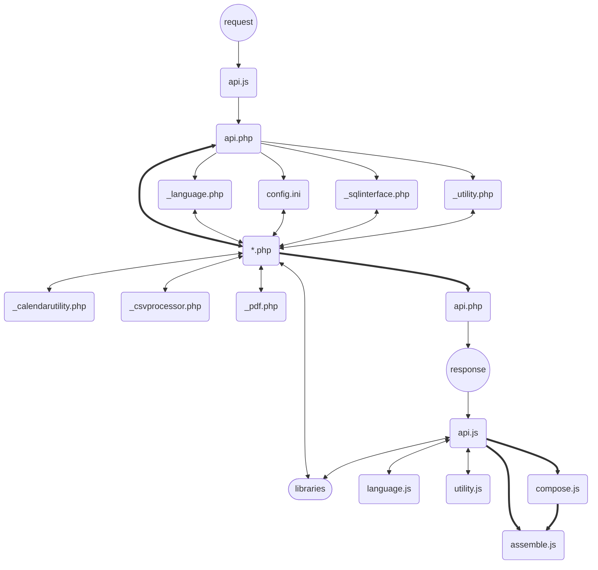

All endpoints may return
```
{"render":{"content":[[{"type":"scanner","attributes":{"name":"User authentification","type":"password"}}]]}}
```
with a HTTP status code 511 in case of a reauthetification prompt due to timeout.

[Content](#content)

## Authentification flow
User authentification is handled by the backend. Usage time of the application can be [restricted](#runtime-variables) within the boundaries of the [server setting](#installation) for session duration. Whichever comes first enforces a new authentification of the last user or logout to proceed. While interacting with the application there will be a tiny request shortly before timeout to avoid friction. The defined timeout will happen after the last request without intermittent interaction.

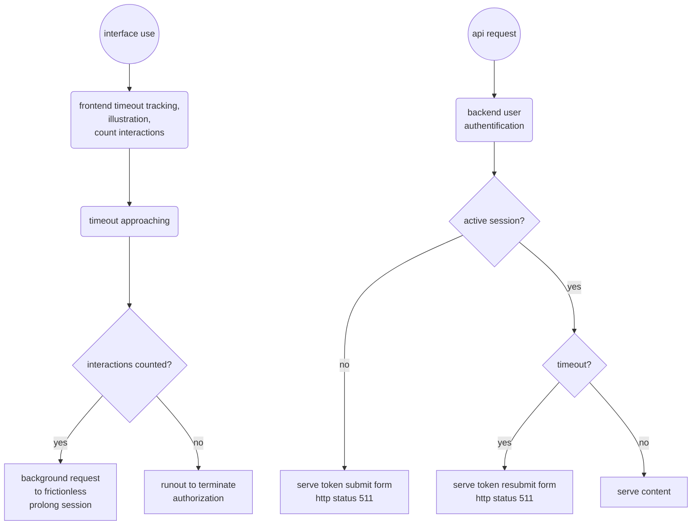

[Content](#content)

## Application endpoints

> POST ./api/api.php/application/authentify

Returns user- and application settings on valid authentification, submission form otherwise.

Parameters
| Name | Data Type | Required | Description |
| ---- | --------- | -------- | ----------- |
| payload | form data | optional | contains password for authentification |

Sample response
```
{"user":{"image":".\/fileserver\/users\/profilepic_error on line 1_dev.png","app_settings":{"forceDesktop":"on","annualvacation":"2023-01-01 30\r;2024-01-01 30","weeklyhours":"2024-05-01 5","initialovertime":"10","homeoffice":"on","primaryUnit":"prosthetics2","language":"en","theme":"light"},"cached_identity":"d4735e3a265e16eee03f59718b9b5d03019c07d8b6c51f90da3a666eec13ab35"},"application":{"session_timeout_seconds":"1440"}}
```

> GET ./api/api.php/application/authentify

Returns a random string if the session is valid.

Parameters
| Name | Data Type | Required | Description |
| ---- | --------- | -------- | ----------- |
| none |  |  |  |

Sample response
```
["Hardly anything is evil, but most things are hungry. Hunger looks very like evil from the wrong end of the cutlery. Or do you think that your bacon sandwich loves you back?"]
```

> DELETE ./api/api.php/application/authentify

Destroys session and returns empty user- and application settings.

Parameters
| Name | Data Type | Required | Description |
| ---- | --------- | -------- | ----------- |
| none |  |  |  |

Sample response
```
{"user":[],"config":{"application":{"defaultlanguage":"en"}}}
```

> GET ./api/api.php/application/info

Returns general application information

Parameters
| Name | Data Type | Required | Description |
| ---- | --------- | -------- | ----------- |
| none | | | |

Sample response
```
{"render":{"content":[{"type":"textsection","attributes":{"name":"CARO - Cloud Assisted Records and Operations"},"content":"Copyright (C) 2023-2025 error on line 1 (dev@erroronline.one)\n\nThis program is free software: you can redistribute it and\/or modify it under the terms of the GNU Affero General Public License as published by the Free Software Foundation, either version 3 of the License, or any later version. This program is distributed in the hope that it will be useful,....
```

> GET ./api/api.php/application/language

Retrieves an object with language chunks, similar to language.XX.json, slightly reduced by properties definetively not used by frontend, processed by ./js/language.js

Parameters
| Name | Data Type | Required | Description |
| ---- | --------- | -------- | ----------- |
| none | | | |

> GET ./api/api.php/application/menu

Returns the application menu preprocessed regarding permissions.

Parameters
| Name | Data Type | Required | Description |
| ---- | --------- | -------- | ----------- |
| none | | | |

Sample response
```
{"render":{"Communication":{"Conversations":{"onpointerup":"api.message('get', 'conversation')","data-unreadmessages":"0"},"Personnel register":{"onpointerup":"api.message('get', 'register')"},"Text recommendations":{"onpointerup":"api.texttemplate('get', 'text')"},"Manage text chunks":{"onpointerup":"api.texttemplate('get', 'chunk')"},"Manage text templates":{"onpointerup":"api.texttemplate('get', 'template')"}},....
```

> GET ./api/api.php/application/start/{search}

Returns the landing page with overview and manual.

Parameters
| Name | Data Type | Required | Description |
| ---- | --------- | -------- | ----------- |
| {search} | path parameter | optional | search phrase for documents, records and files |

Samble response
```
{"user":"error on line 1","render":{"content":[[{"type":"tile","attributes":{"onpointerup":"api.purchase('get', 'approved')"},"content":[{"type":"textsection","content":"There are 4 orders awaiting processing","attributes":{"data-type":"purchase","name":"Approved orders"}}]},{"type":"tile","attributes":{"onpointerup":"api.record('get', 'records')"},"content":[{"type":"textsection","content":"There are 1 open cases for your assigned units","attributes":{"data-type":"record","name":"Records"}}]}],[{"type":"calendar","description":"Week 50 2024","content":[{"date":"2024-12-09","display":"Mon 9","today":false,"selected":false,"holiday":false},{"date":"2024-12-10","display":"Tue 10","today":false,"selected":false,"holiday":false},....
```

[Content](#content)

### Audit endpoints

> POST ./api/api.php/audit/audit/{template_id}

Stores a new audit to the database.

Parameters
| Name | Data Type | Required | Description |
| ---- | --------- | -------- | ----------- |
| {template_id} | path parameter | required | template id |
| payload | form data | required | input data |

Sample response
```
{"response":{"msg":"Audit saved","id":"2","type":"success"}}
```

> PUT ./api/api.php/audit/audit/{template_id}/{audit_id}

Updates an unclosed audit.

Parameters
| Name | Data Type | Required | Description |
| ---- | --------- | -------- | ----------- |
| {template_id} | path parameter | required | template database id |
| {audit_id} | path parameter | required | audit database id |
| payload | form data | optional | input data |

Sample response
```
{"response":{"msg":"Audit saved","id":"","type":"success"}}
```

> GET ./api/api.php/audit/audit/{template_id}/{audit_id}

Returns a selection to start or edit unclosed audits or displays selected audit.

Parameters
| Name | Data Type | Required | Description |
| ---- | --------- | -------- | ----------- |
| {template_id} | path parameter | optional | template database id |
| {audit_id} | path parameter | optional | audit database id |

Sample response
```
{"render": {"content": [[{"type": "button","attributes": {"value": "New Audit","type": "button","onpointerup": "new _client.Dialog({type: 'input', header: 'New Audit', render: JSON.parse('[{\"type\":\"select\",\"attributes\":{\"name\":\"Select template\"},\"content\":{\"...\":{\"value\":\"0\"},\"Common 2025-02-03 07:41:00\":{\"value\":\"2\"}}}]'), options:{'No, I am not done yet': {value: true, class: 'reducedCTA'},'Ok': true}}).then(response => {if (response && response !== '...') api.audit('get', 'audit', response['Select template'])});"}},{"type": "select","attributes": {"name": "Edit","onchange": "if (this.value !== '0') api.audit('get', 'audit', 'null', this.value);"},"content": {"...": {"value": "0"},"Common 2025-02-04 13:56:00": {"value": "2"}}}]]}}
```

> DELETE ./api/api.php/audit/audit/null/{audit_id}

Deletes an unclosed audit.

Parameters
| Name | Data Type | Required | Description |
| ---- | --------- | -------- | ----------- |
| {audit_id} | path parameter | required | audit database id |

Sample response
```
{"response":{"msg":"Order statistics have been deleted.","type":"success"}}
```

> POST ./api/api.php/audit/audittemplate/{template_id}

Stores a new audit template to the database.

Parameters
| Name | Data Type | Required | Description |
| ---- | --------- | -------- | ----------- |
| payload | form data | optional | input data |

Sample response
```
{"response":{"msg":"Template saved","id":"3","type":"success"}}
```

> PUT ./api/api.php/audit/audittemplate/null/{template_id}

Updates an audit template.

Parameters
| Name | Data Type | Required | Description |
| ---- | --------- | -------- | ----------- |
| {template_id} | path parameter | required | template database id |
| payload | form data | optional | input data |

Sample response
```
{"response":{"msg":"Template saved","id":"","type":"success"}}
```

> GET ./api/api.php/audit/audittemplate/null/{template_id}

Returns a selection to start or edit audit templates.

Parameters
| Name | Data Type | Required | Description |
| ---- | --------- | -------- | ----------- |
| {template_id} | path parameter | optional | template database id |

Sample response
```
{"render": {"form": {"data-usecase": "audittemplate","action": "javascript:api.audit('post', 'audittemplate', 'null', )"},"content": [[{"type": "select","attributes": {"name": "Edit","onchange": "api.audit('get', 'audittemplate', 'null', this.value)"},"content": {"...New template": {"value": "0"},"Common 2025-02-03 07:41:00": {"value": "2"}}}],[{"type": "textsection","content": null},{"type": "select","attributes": {"name": "Organizational units","id": "TemplateUnit","data-loss": "prevent"},....
```

> DELETE ./api/api.php/audit/audittemplate/null/{template_id}

Deletes an audit template.

Parameters
| Name | Data Type | Required | Description |
| ---- | --------- | -------- | ----------- |
| {template_id} | path parameter | required | audit database id |

Sample response
```
{"response":{"msg":"Template deleted","type":"success"}}
```

> DELETE ./api/api.php/audit/checks/{type}

Deletes records. Currently implemented for order statistics only.

Parameters
| Name | Data Type | Required | Description |
| ---- | --------- | -------- | ----------- |
| {type} | path parameter | optional | adds contents based on given type to response |

Sample response
```
{"response":{"msg":"Order statistics have been deleted.","type":"success"}}
```

> GET ./api/api.php/audit/checks/{type}/{date}/{time}

Returns selection of available checks, given type the result of the selected type.

Parameters
| Name | Data Type | Required | Description |
| ---- | --------- | -------- | ----------- |
| {type} | path parameter | optional | adds contents based on given type to response |
| {date} | path parameter | optional | e.g. contents validity limited to date/time |
| {time} | path parameter | optional | e.g. contents validity limited to date/time |

Sample response
```
{"render":{"content":[[{"type":"select","content":{"Incorporated articles":{"value":"incorporation"},"Current documents in use":{"value":"documents"},"User certificates and other files":{"value":"userskills"},"Vendor list":{"value":"vendors"},"Regulatory issues considered by documents and documents":{"value":"regulatory"}},"attributes":{"name":"Select type of data","onchange":"api.audit('get', 'checks', this.value)"}}]]}}
```

> GET ./api/api.php/audit/export/{type}/{date}/{date/time}

Returns a download link to a temporary file based on type.

Parameters
| Name | Data Type | Required | Description |
| ---- | --------- | -------- | ----------- |
| {type} | path parameter | required | defines the response, none if omitted |
| {date} | path parameter | optional | e.g. contents validity limited to date/time |
| {date/time} | path parameter | optional | e.g. contents validity limited to date/time |

Sample response
```
{"render":[[{"type":"links","description":"Open the link, save or print the record summary. On exporting sensitive data you are responsible for their safety.","content":{"Record summary":{"href":".\/fileserver\/tmp\/Incorporatedarticles_202406102018.pdf"}}}]]}
```

> PUT ./api/api.php/audit/checks/{type}/{id}

Updates data from the audit module. Currently implemented for user trainings only.

Parameters
| Name | Data Type | Required | Description |
| ---- | --------- | -------- | ----------- |
| {type} | path parameter | required | defines the response, none if omitted |
| {id} | path parameter | required | training database id | 
| payload | form data | required | form data |
 
Sample response
```
{"render":{"content":[[{"type":"select","content":{"Complaints":{"value":"complaints"},"Current documents in use":{"value":"documents"},"Experience points":{"value":"userexperience"},"Incorporated articles":{"value":"incorporation"},"Order statistics":{"value":"orderstatistics"},"Regulatory issues considered by documents and documents":{"value":"regulatory"},"Risk management":{"value":"risks"},....
```

> POST ./api/api.php/audit/checks/{type}

Inserts data into the database. Currently implemented for user skills only (mandatory trainings for multiple users).

Parameters
| Name | Data Type | Required | Description |
| ---- | --------- | -------- | ----------- |
| {type} | path parameter | required | defines the response, none if omitted |
| payload | form data | required | form data |
 
Sample response
```
{"render":{"content":[[{"type":"select","content":{"Complaints":{"value":"complaints"},"Current documents in use":{"value":"documents"},"Experience points":{"value":"userexperience"},"Incorporated articles":{"value":"incorporation"},"Order statistics":{"value":"orderstatistics"},"Regulatory issues considered by documents and documents":{"value":"regulatory"},"Risk management":{"value":"risks"},....
```

> GET ./api/api.php/audit/import/{type}/{param}

Returns requested data for importing to the frontend. Currently implemented for returning the latest audit summary for a passed unit.

Parameters
| Name | Data Type | Required | Description |
| ---- | --------- | -------- | ----------- |
| {type} | path parameter | required | submethod, currently auditsummary only |
| {param} | path parameter | required | keyword, currently unit-value only |

Sample response
```
{"data":"...whatever text..."}
```

> POST ./api/api.php/audit/managementreview/null

Saves a new management review to database.

Parameters
| Name | Data Type | Required | Description |
| ---- | --------- | -------- | ----------- |
| payload | form data | optional | input data |

Sample response
```
{"response":{"msg":"Management review saved","id":"0","type":"success"}}
```

> PUT ./api/api.php/audit/managementreview/null/{managementreview_id}

Updates an unclosed management review.

Parameters
| Name | Data Type | Required | Description |
| ---- | --------- | -------- | ----------- |
| {managementreview_id} | path parameter | required | managementreview database id |
| payload | form data | optional | input data |

Sample response
```
{"response":{"msg":"Management review saved","id":"0","type":"success"}}
```

> GET ./api/api.php/audit/managementreview/null/{managementreview_id}

Returns a selection to start or edit unclosed managementreviews or displays selected review.

Parameters
| Name | Data Type | Required | Description |
| ---- | --------- | -------- | ----------- |
| {managementreview_id} | path parameter | optional | audit database id |

Sample response
```
{"render":{"form":{"data-usecase":"audit","action":"javascript:api.audit('post', 'managementreview', 'null', )"},"content":[[{"type":"textarea","attributes":{"name":"Feedback","value":""}}],[{"type":"textarea","attributes":{"name":"Complaint handling","value":""}}],[{"type":"textarea","attributes":{"name":"Reporting to regulatory authorities","value":""}}],[{"type":"textarea","attributes":{"name":"Audits","value":""}}],....
```

> DELETE ./api/api.php/audit/managementreview/null/{managementreview_id}

Deletes an unclosed managementreview.

Parameters
| Name | Data Type | Required | Description |
| ---- | --------- | -------- | ----------- |
| {managementreview_id} | path parameter | required | managementreview database id |

Sample response
```
{"response":{"msg":"Management review has been deleted.","type":"success"}}
```

### Calendar endpoints

> POST ./api/api.php/calendar/appointment

Initiates a new planning form or updates or stores a new longterm plan.

Parameters
| Name | Data Type | Required | Description |
| ---- | --------- | -------- | ----------- |
| payload | form data | required | either new planning parameters or actual planning data to store |

Sample response
```
{"render":[{"type":"links","description":"Print out the PDF or send the ICS-file by mail or messenger","content":{"PDF handout with QR appointment":{"href":"./api/api.php/file/stream/./fileserver/tmp/PDF handout with QR appointment fitting 2025-04-25 10:00.pdf"},"ICS calendar file":{"href":"./api/api.php/file/stream/./fileserver/tmp/ICS calendar file fitting 2025-04-25 10:00.ics","download":"ICS calendar file fitting 2025-04-25 10:00.ics"}}}]}
```

> GET ./api/api.php/calendar/appointment

Returns a form to create an appointment note and ICS-file.

Parameters
| Name | Data Type | Required | Description |
| ---- | --------- | -------- | ----------- |
| none |  |  |  |

Sample response
```
{"render":{"form":{"data-usecase":"appointment","action":"javascript:api.calendar('post', 'appointment')"},"content":[[{"type":"date","attributes":{"name":"Date","value":""}},{"type":"time","attributes":{"name":"Time","value":""}},{"type":"text","hint":"e.g. cast for orthosis, fitting for prosthesis, etc.","attributes":{"name":"Occasion","value":""}},{"type":"text","hint":"e.g. remember bringing shoes","attributes":{"name":"Reminder","value":""}},{"type":"number","attributes":{"name":"Approximate duration (hours)","min":1,"max":200,"step":1,"value":1}}]]}}
```

> PUT ./api/api.php/calendar/complete/{id}/{bool}/{type}

Marks scheduled events as complete or revoke state.

Parameters
| Name | Data Type | Required | Description |
| ---- | --------- | -------- | ----------- |
| {id} | path parameter | required | database id |
| {bool} | path parameter| required | true or false completed state |
| {type} | path parameter | required | schedule or timesheet |
| payload | form data | required | form data including user validation |

Sample response
```
{"response":{"msg":"Event has been marked as completed.","type":"success"},"data":{"calendar_uncompletedevents":1}}
```

> POST ./api/api.php/calendar/longtermplanning

Initiates a new planning form or updates or stores a new longterm plan.

Parameters
| Name | Data Type | Required | Description |
| ---- | --------- | -------- | ----------- |
| payload | form data | required | either new planning parameters or actual planning data to store |

Sample response
```
{"response":{"id":"11", "msg":"Planning has been saved","type":"success"}}
```

> GET ./api/api.php/calendar/longtermplanning/{id}

Returns a selection of available longterm plans, selected plan if requested id matches, initiation form if permission is available.

Parameters
| Name | Data Type | Required | Description |
| ---- | --------- | -------- | ----------- |
| {id} | path parameter | optional | defines the response, none if omitted |

Sample response
```
{"render":{"content":[[{"type":"select","attributes":{"name":"Select","onchange":"if (this.value !== '0') api.calendar('get', 'longtermplanning', this.value);"},"content":{"...":{"value":"0"},"Apprentices training schedule 24":{"value":11}}}],[{"type":"text","attributes":{"name":"Subject","required":true}},{"type":"date","attributes":{"name":"Start","required":true}},{"type":"date","attributes":{"name":"End","required":true},"hint":"The starting month will be set to the first, the ending month to the last day by default. Planning occurs for half months."},{"type":"text","attributes":{"name":"Name","multiple":true}},{"type":"select","attributes":{"name":"Import existing plan for selected timespan"},"content":{"...":{"value":"0"},"Apprentices training schedule 24":{"value":11}}}]],"form":{"data-usecase":"longtermplanning","action":"javascript:api.calendar('post', 'longtermplanning')"}}}
```

> DELETE ./api/api.php/calendar/longtermplanning/{id}

Deletes longterm plan.

Parameters
| Name | Data Type | Required | Description |
| ---- | --------- | -------- | ----------- |
| {id} | path parameter | required | database id |

Sample response
```
{"response":{"msg":"Planning deleted","type":"success"}}
```

> GET ./api/api.php/calendar/monthlyTimesheets/{date Y-m-d}

Returns a download link to a temporary file based on date.

Parameters
| Name | Data Type | Required | Description |
| ---- | --------- | -------- | ----------- |
| {date Y-m-d} | path parameter | required | defines the response, none if omitted |

Sample response
```
{"render":[[{"type":"links","description":"Open the link, save or print the summary. Please respect data safety measures. On exporting sensitive data you are responsible for their safety.","content":{"Timesheet":{"href":".\/fileserver\/tmp\/Timesheet_202406102046.pdf"}}}]]}
```

> DELETE ./api/api.php/calendar/schedule/{id}

Deletes scheduled events.

Parameters
| Name | Data Type | Required | Description |
| ---- | --------- | -------- | ----------- |
| {id} | path parameter | required | database id |

Sample response
```
{"response":{"msg":"Event has been deleted.","type":"success"},"data":{"calendar_uncompletedevents":1}}
```

> GET ./api/api.php/calendar/schedule/{date Y-m-d}/{date Y-m-d}

Returns a calendar.

Parameters
| Name | Data Type | Required | Description |
| ---- | --------- | -------- | ----------- |
| {date Y-m-d} | 1st path parameter | optional | returns the given month |
| {date Y-m-d} | 2nd path parameter | optional | appends entries for given date and respective inputs to response |

Sample response
```
{"render":{"content":[[{"type":"scanner","destination":"recordfilter","description":"Scan a Code"},{"type":"search","attributes":{"id":"recordfilter","name":"Search","onkeydown":"if (event.key === 'Enter') {api.calendar('get', 'search', this.value); return false;}","onblur":"api.calendar('get', 'search', this.value); return false;"}}],[{"type":"calendar","description":"June 2024","content":[null,null,null,null,null,{"date":"2024-06-01","display":"Sat 1","today":false,"selected":false,"holiday":true},{"date":"2024-06-02","display":"Sun 2","today":false,"selected":false,"holiday":true},{"date":"2024-06-03","display":"Mon 3","today":false,"selected":false,"holiday":false},....
```

> POST ./api/api.php/calendar/schedule

Contributes scheduled events to the calendar.

Parameters
| Name | Data Type | Required | Description |
| ---- | --------- | -------- | ----------- |
| payload | form data | required | values for database |

Sample response
```
{"response":{"id":"8","msg":"Event has been saved.","type":"success"},"data":{"calendar_uncompletedevents":2}}
```

> PUT ./api/api.php/calendar/schedule/{id}

Updates scheduled events.

Parameters
| Name | Data Type | Required | Description |
| ---- | --------- | -------- | ----------- |
| payload | form data | required | values for database |

Sample response
```
{"response":{"id":"9","msg":"Event has been saved.","type":"success"},"data":{"calendar_uncompletedevents":2}}
```

> GET ./api/api.php/calendar/search/{search}

Returns scheduled events according to search phrase.

Parameters
| Name | Data Type | Required | Description |
| ---- | --------- | -------- | ----------- |
| {search} | path parameter | optional | displays scheduled events according to search, calendar overview if omitted |

Sample response
```
{"render":{"content":[[{"type":"scanner","destination":"recordfilter","description":"Scan a Code"},{"type":"search","attributes":{"id":"recordfilter","name":"Search","onkeydown":"if (event.key === 'Enter') {api.calendar('get', 'search', this.value); return false;}","onblur":"api.calendar('get', 'search', this.value); return false;"}}],[{"type":"tile","content":[{"type":"textsection","attributes":{"data-type":"textsection","name":"test event"},"content":"Date: 2024-05-30\nDue: 2024-06-06\nProsthetics II"},{"type":"checkbox","content":{"completed":{"onchange":"api.calendar('put', 'complete', '2', this.checked, 'schedule')","checked":true}},"hint":"marked as completed by error on line 1 on 2024-06-07"},.....
```

> DELETE ./api/api.php/calendar/timesheet/{id}

Deletes timesheet entries.

Similar to schedules.

> GET ./api/api.php/calendar/timesheet/{date Y-m-d}/{date Y-m-d}

Returns a calendar.

Similar to schedules with slightly adapted inputs for time tracking.

> POST ./api/api.php/calendar/timesheet

Contributes timesheet entries to the calendar

Similar to schedules.

> PUT ./api/api.php/calendar/timesheet/{id}

Updates timesheet entries

Similar to schedules.

> PUT ./api/api.php/calendar/timesheet/{id}/{bool}/{type}

Markes timesheet entries as complete or revokes state

Similar to schedules.

[Content](#content)

### Consumables endpoints

> GET ./api/api.php/consumables/exportpricelist/{id}

Returns the current document for a sample check.

Parameters
| Name | Data Type | Required | Description |
| ---- | --------- | -------- | ----------- |
| {id} | path parameter | required | vendor database id |

Sample response
```
{"links":{"Download 1726252272testlieferantpricelist.csv":{"href":".\/fileserver\/tmp\/1726252272testlieferantpricelist.csv","download":"1726252272testlieferantpricelist.csv"},"Download 1726252272testlieferantpricelistfilter.txt":{"href":".\/fileserver\/tmp\/1726252272testlieferantpricelistfilter.txt","download":"1726252272testlieferantpricelistfilter.txt"}}}
```

> GET ./api/api.php/consumables/incorporation

Stores the incorporation to product and selected similar, system message to defined users.

Similar to mdrsamplecheck.

> POST ./api/api.php/consumables/incorporation

Returns the current document for an incorporation.

Similar to mdrsamplecheck

> DELETE ./api/api.php/consumables/mdrsamplecheck

Deletes the sample check from records, unmark product as checked.

Parameters
| Name | Data Type | Required | Description |
| ---- | --------- | -------- | ----------- |
| {id} | path parameter | required | product database id |

Sample response
```
{"response":{"msg":"Sample check has been revoked","type":"success"}}
```

> GET ./api/api.php/consumables/mdrsamplecheck/{id}

Returns the current document for a sample check.

Parameters
| Name | Data Type | Required | Description |
| ---- | --------- | -------- | ----------- |
| {id} | path parameter | required | product database id |

Sample response
```
{"render":{"content":[[{"type":"textsection","attributes":{"name":160O10=1 Fingerorthese Otto Bock"}}],[{"attributes":[],"type":"checkbox","attributes":{"name":"sample check"},"content":{"super":[],"duper":[]}}]],"options":{"No, thank you":false,"Submit sample check":{"value":true,"class":"reducedCTA"}},"productid":1}}
```

> POST ./api/api.php/consumables/mdrsamplecheck/{id}

Stores the sample check to records, mark product as checked, system message to defined users.

Parameters
| Name | Data Type | Required | Description |
| ---- | --------- | -------- | ----------- |
| {id} | path parameter | required | product database id |
| payload | form data | required | check notes |

Sample response
```
{"response":{"msg":"Sample check has been saved","type":"success"}}
```

> GET ./api/api.php/consumables/pendingincorporations

Returns a list of links to products with pending incorporations.

Parameters
| Name | Data Type | Required | Description |
| ---- | --------- | -------- | ----------- |
| none |  |  |  |

Sample response
```
{"render":{"content":[[{"type":"links","content":{"Otto Bock 99B25 Schlauch-Strumpf":{"href":"javascript:void(0)","onpointerup":"api.purchase('get', 'product', 1752)"}}}]]}}
```

> DELETE ./api/api.php/consumables/product/{id}

Deletes a product if permitted.

Parameters
| Name | Data Type | Required | Description |
| ---- | --------- | -------- | ----------- |
| {id} | path parameter | required | database id |

Sample response
```
{"response":{"msg":"Product Kabinettraspel, halbrund could not be deleted","id":2556,"type":"error"}}
```

> GET ./api/api.php/consumables/product/{id}?{param}

Returns content to create or modify product. If path parameter is provided, the form is prefilled according to database entry.

Returns available information on product if role has no permission to add and edit.

Parameters
| Name | Data Type | Required | Description |
| ---- | --------- | -------- | ----------- |
| {id} | path parameter | optional | database id |
| {param} | query parameter | optional | product information as GET payload to prefill fields on adding unknown products from orders |

Similar to vendor.

> POST ./api/api.php/consumables/product

Stores new product data.

Similar to vendor.

> PUT ./api/api.php/consumables/product/{id}

Updates product data.

Similar to vendor.

Sample response
```
{"response":{"id":"1752","msg":"Product Schlauch-Strumpf has been saved","type":"success"},"data":{"order_unprocessed":3,"consumables_pendingincorporation":2}}
```

> GET ./api/api.php/consumables/productsearch/{vendor_id}/{search}/{usecase}

Returns a search form based on usecase and products matching {search}. If {_usecase} is set to *product* the returned elements events lead to consumables editing or product information depending on permissions. *productselection* returns only results for the respective widget. *order* results lead to adding the selected product to a new order.

Parameters
| Name | Data Type | Required | Description |
| ---- | --------- | -------- | ----------- |
| {vendor_id} | path parameter | required | vendor id in database or null |
| {search} | path parameter | required | search term for article_no, article_name, article_alias, article_ean |
| {usecase} | path parameter | optional | altered events for product management |

Sample response
```
{"render":{"content":[[[{"type":"button","attributes":{"value":"Add new product","type":"button","onclick":"api.purchase('get', 'product')"}},{"type":"scanner","destination":"productsearch"},{"type":"select","content":{"... all vendors":{"value":"null"},....},"attributes":{"id":"productsearchvendor","name":"Filter vendors"}},{"type":"search","attributes":{"name":"Search product by article number or name","onkeydown":"if (event.key === 'Enter') {api.purchase('get', 'productsearch', document.getElementById('productsearchvendor').value, this.value, 'product'); return false;}","id":"productsearch","value":"99b25"}}],[{"type":"textsection","attributes":{"name":"Add article from 1 matches"}},[{"type":"tile","attributes":{"onclick":"api.purchase('get', 'product', 1752)"},"content":[{"type":"textsection","content":"Otto Bock HealthCare Deutschland GmbH 99B25 Schlauch-Strumpf PAK"}]}]]]]}}
```

> GET ./api/api.php/consumables/vendor/{name|id}

Returns content to create or modify vendor. If path parameter is provided, the form is prefilled according to database entry.

Returns available information on vendor if role has no permission to add and edit.

Parameters
| Name | Data Type | Required | Description |
| ---- | --------- | -------- | ----------- |
| {name/id} | path parameter | optional | existing vendors name (string) or database id (int) |

Sample response
```

{"render":{"content":[[{"type":"select","attributes":{"name":"Edit existing vendor","onchange":"api.purchase('get', 'vendor', this.value)"},"content":{"...New vendor":{"selected":true},"AET GmbH (TSM)":{"value":"AET GmbH (TSM)"},"AMT Aromando Medzintechnik GmbH":{"value":"AMT Aromando Medzintechnik GmbH"},"Albrecht GmbH":{"value":"Albrecht GmbH"},"Arthroven GmbH":{"value":"Arthroven GmbH"},"Aspen Medical Products GmbH":{"value":"Aspen Medical Products GmbH"},"Basko Orthop\u00e4die Handelsgesellschaft mbH":{"value":"Basko Orthop\u00e4die Handelsgesellschaft mbH"},"Blatchford Europe GmbH (Endolite)":{"value":"Blatchford Europe GmbH (Endolite)"},"Bort GmbH":{"value":"Bort GmbH"},....
```

> POST ./api/api.php/consumables/vendor

Stores new vendor data.

Parameters
| Name | Data Type | Required | Description |
| ---- | --------- | -------- | ----------- |
| payload | form data | required | information, files, etc |

Sample response
```

{"response":{"id":1,"msg":"Vendor Otto Bock has been saved","type":"info"}}
```

> PUT ./api/api.php/consumables/vendor/{id}

Updates vendor data.

Parameters
| Name | Data Type | Required | Description |
| ---- | --------- | -------- | ----------- |
| {id} | path parameter | required | database id |
| payload | form data | required | information, files, etc |

Sample response
```
{"response":{"id":1,"msg":"Vendor Otto Bock has been saved","type":"info"}}
```

[Content](#content)

### CSV filter endpoints

> GET ./api/api.php/csvfilter/filter/{id}

Returns the input form for applying a filter.

Parameters
| Name | Data Type | Required | Description |
| ---- | --------- | -------- | ----------- |
| {id} | path parameter | optional | if omitted only the selection list is returned |

Sample response
```
{"render":{"content":[[{"type":"select","attributes":{"name":"Select filter","onchange":"api.csvfilter('get', 'filter', this.value)"},"content":{"...Select filter":{"value":"0","selected":true},"Terminerinnerung":{"value":1}}},{"type":"search","attributes":{"name":"Search name","onkeydown":"if (event.key === 'Enter') {api.csvfilter('get', 'filter', this.value); return false;}"},"datalist":["Terminerinnerung"]}]]}}
```

> POST ./api/api.php/csvfilter/filter/{id}

Returns a report from the CSV-filter and a download link to a temporary file with filtered data.

Parameters
| Name | Data Type | Required | Description |
| ---- | --------- | -------- | ----------- |
| {id} | path parameter | required | filter to apply |
| payload | form data | required | files to process |

Sample response
```
{"log":["[*] total rows: 46198","[*] applying filter: filter_by_expression nur an Personen geliefert......,"[*] remaining filtered: 104","[*] modifications done","[*] result - final rows: 104","[*] done! Nicht vergessen eMailadressen zu pr\u00fcfen und die neue Datei zu archivieren: "],"links":{"Download Einladungsfilter.csv":{"href":".\/fileserver\/tmp\/1718138675Einladungsfilter.csv","download":"Einladungsfilter.csv"}}}
```

> GET ./api/api.php/csvfilter/rule/{id}

Returns the editing interface for filter presets.

Parameters
| Name | Data Type | Required | Description |
| ---- | --------- | -------- | ----------- |
| {id} | path parameter | optional | filter to be edited, new if omitted |

Sample response
```
{"render":{"form":{"data-usecase":"csvfilter","action":"javascript:api.csvfilter('post', 'rule')"},"content":[[[{"type":"select","attributes":{"name":"Edit latest filter","onchange":"api.csvfilter('get', 'rule', this.value)"},"content":{"...New filter":{"value":"0","selected":true},"Terminerinnerung":{"value":1}}},{"type":"search","attributes":{"name":"Search name","onkeydown":"if (event.key === 'Enter') {api.csvfilter('get', 'rule', this.value); return false;}"},"datalist":["Terminerinnerung"]}],[{"type":"select","attributes":{"name":"Edit any filter","onchange":"api.csvfilter('get', 'rule', this.value)"},"content":{"...New filter":{"value":"0","selected":true},"Terminerinnerung  created by error on line 1 on 2025-01-26 01:34:00":{"value":1}}}]],[{"type":"text","attributes":{"name":"Name","value":"","required":true,"data-loss":"prevent"}},{"type":"code","hint":"Please adhere to proper JSON format to describe a working CSV filter. A programmer can help you with that.","attributes":{"name":"Content","value":"","rows":16,"id":"content","required":true,"data-loss":"prevent"}}]]}}
```

> POST ./api/api.php/csvfilter/rule

Saves a filter preset.

Parameters
| Name | Data Type | Required | Description |
| ---- | --------- | -------- | ----------- |
| payload | form data | required | filter json and name to be stored |

Sample response
```
{"response":{"name":"test","msg":"The filter named test has been saved.","type":"success"}}
```

[Content](#content)

### Document endpoints

> GET ./api/api.php/document/approval/{id}

Returns selection of components and documents pending approval, selected element if {id} is provided and unsatisfied approvals per role.

Parameters
| Name | Data Type | Required | Description |
| ---- | --------- | -------- | ----------- |
| {id} | path parameter | optional | int id of unapproved component |

Sample response
```
{"render":{"content":[[{"type":"select","attributes":{"name":"Select component to approve","onchange":"api.document('get','approval', this.value)"},"content":{"signature1":{"value":"43","selected": true },"signature2":{"value":"44"}}},{"type":"select","attributes":{"name":"Select document to approve","onchange":"api.document('get','approval', this.value)"},"content":{"testform":{"value":"51"}}}],....
```

> PUT ./api/api.php/document/approval/{id}

Updates approvals for documents and components.

Parameters
| Name | Data Type | Required | Description |
| ---- | --------- | -------- | ----------- |
| {id} | path parameter | optional | int id of unapproved component |
| payload | form data | optional | approval checkboxes |

Sample response
```
{"response":{"msg":"Approval saved.<br />This element can now be used.","type":"success","reload":"approval"},"data":{"form_approval":4}}
```

> POST ./api/api.php/document/bundle

Saves document bundle. Updates availability if name and content remain the same.

Parameters
| Name | Data Type | Required | Description |
| ---- | --------- | -------- | ----------- |
| payload | form data | required | bundle data |

Sample response
```
{"response":{"name":"bundle1","msg":"Bundle saved. Hidden bundles are not reachable","type":"success"}}
```

> GET ./api/api.php/document/bundle/{id}

Returns content to create or modify form bundles.

Parameters
| Name | Data Type | Required | Description |
| ---- | --------- | -------- | ----------- |
| {id} | path parameter | optional | bundle database id |

Sample response
```
{"render":{"form":{"data-usecase":"bundle","action":"javascript:api.document('post', 'bundle')"},"content":[[[{"type":"select","attributes":{"name":"Edit existing latest bundle","onchange":"api.document('get', 'bundle', this.value)"},"content":{"...New bundle":{"value":"0","selected":true},"Versorgungsdokumentation Prothetik II":{"value":152}}},{"type":"search","attributes":{"name":"Search by name","onkeydown":"if (event.key === 'Enter') {api.document('get', 'bundle', this.value); return false;}"},"datalist":["Versorgungsdokumentation Prothetik II"]}],[{"type":"select","attributes":{"name":"Edit any existing bundle","onchange":"api.document('get', 'bundle', this.value)"},"content":{"...New bundle":{"value":"0","selected":true},....
```

> GET ./api/api.php/document/bundles/{search}

Returns available approved documents grouped by bundles.

Parameters
| Name | Data Type | Required | Description |
| ---- | --------- | -------- | ----------- |
| {search} | path parameter | optional | search term to filter results |

Sample response
```
{"render":{"content":[{"type":"links","description":"testbundle","content":{"testform":{"href":"javascript:api.record('get', 'document', 'testform')"},"identify yourself":{"href":"javascript:api.record('get', 'document', 'identify yourself')"},"record testform photo":{"href":"javascript:api.record('get', 'document', 'record testform photo')"},"restricted documentation":{"href":"javascript:api.record('get', 'document', 'restricted documentation')"}}}]}}
```

> DELETE ./api/api.php/document/component/{id}

Deletes an unapproved document component.

Parameters
| Name | Data Type | Required | Description |
| ---- | --------- | -------- | ----------- |
| {id} | path parameter | required | int id of unapproved component |

Sample response
```
{"response":{"msg":"Component deleted","type":"success","reload":"component_editor"}}
```

> GET ./api/api.php/document/component/{name|id}

Returns database content of selected component. If path parameter is not int the latest approved component is returned.

Parameters
| Name | Data Type | Required | Description |
| ---- | --------- | -------- | ----------- |
| {name/id} | path parameter | required | string or int |

Sample response
```
{"render":{"id":4,"name":"incorporation component","alias":"","context":"component","date":"2024-06-02 00:18:00","author":"error on line 1","content":{"content":[[{"attributes":[],"type":"checkbox","attributes":{"name":"incorporation"},"hint":"check applicable items","content":{"good":[],"cheap":[],"reasonable":[]}}]],"form":[]},"hidden":0,"approval":"{\"ceo\":{\"name\":\"error on line 1\",\"date\":\"2024-06-02 00:18\"},\"qmo\":{\"name\":\"error on line 1\",\"date\":\"2024-06-02 00:18\"},\"supervisor\":{\"name\":\"error on line 1\",\"date\":\"2024-06-02 00:18\"}}","regulatory_context":"","permitted_export":null}}
```

> POST ./api/api.php/document/component

Stores a new component to the database or updates the *hidden*-setting.

Parameters
| Name | Data Type | Required | Description |
| ---- | --------- | -------- | ----------- |
| payload | form data | required | contents and setting for respective component |

Sample response
```
{"name":"adddocuments","msg":"Component adddocuments has been saved","reload":"component_editor","type":"success"}
```

> GET ./api/api.php/document/component_editor/{name|id}

Returns content to create or modify document components. If path parameter is not int the latest approved component is returned.

Parameters
| Name | Data Type | Required | Description |
| ---- | --------- | -------- | ----------- |
| {name/id} | path parameter | optional | string or int |

Sample response
```
{"render":{"content":[[[{"type":"textsection","attributes":{"name":"Edit existing latest approved component"}},{"type":"select","attributes":{"name":"Common","onchange":"api.document('get', 'component_editor', this.value)"},"content":{"...New component":{"value":"0","selected":true},"basisdaten":{"value":102},"datenverarbeitung auftragserteilung schweigepflichtentbindung":{"value":103},"empfangsbest\u00e4tigung":{"value":105},"erlaubnis zur ausstellung und ver\u00f6ffentlichung":{"value":106},"gebrauchsanweisung allgemein":{"value":109},"gebrauchsanweisung entsorgung":{"value":114},"gebrauchsanweisung handhabung":{"value":110},"gebrauchsanweisung instandhaltung":{"value":113},"gebrauchsanweisung k\u00f6rperpflege":{"value":111},....
```

> POST ./api/api.php/document/export

Returns a download link to a temporary file with the selected document as editable blank or prefilled pdf.

Parameters
| Name | Data Type | Required | Description |
| ---- | --------- | -------- | ----------- |
| payload | form data | required | according to form |

Sample response
```
{"render":[{"type":"links","description":"Open the link and print the document.","content":{"Export empty document as PDF":{"href":".\/fileserver\/tmp\/identifyyourself_202406132018.pdf"}}}]}
```

> DELETE ./api/api.php/document/document/{id}

Deletes an unapproved document.

Similar to components.

> GET ./api/api.php/document/document/{name|id}

Returns database content of selected document. If path parameter is not int the latest approved document is returned.

Similar to components.

> POST ./api/api.php/document/document

Stores a new document to the database or updates the following uncritical settings: *alias*, *context*, *hidden*, *regulatory_context*, *permitted_export*

Similar to components.

> GET ./api/api.php/document/document_editor/{name|id}

Returns content to create or modify documents. If path parameter is not int the latest approved document is returned.

Sililar to component_editor.

> GET ./api/api.php/document/documents/{filter}/{unit}

Returns available approved documents grouped by context type and organizational units.

Parameters
| Name | Data Type | Required | Description |
| ---- | --------- | -------- | ----------- |
| {filter} | path parameter | optional | filter by identifier |
| {unit} | path parameter | optional | filter by unit |

Sample response
```
{"render":{"content":[[{"type":"filtered","attributes":{"name":"Filter","onkeydown":"if (event.key === 'Enter') {api.document('get', 'documentfilter', this.value); return false;}","onblur":"api.document('get', 'documentfilter', this.value); return false;"},"datalist":["Abgabeprotokoll Prothetik II","Lieferung","","Lieferprotokoll","Anamnese Prothetik II","Profilerhebung","Basisdaten","Checkliste Prothetik II","Datenverarbeitung - Auftragserteilung - Schweigepflichtentbindung","Empfangsbest\u00e4tigung","Erlaubnis zur Ausstellung und Ver\u00f6ffentlichung","Gebrauchsanweisung Prothetik II","Kunststofffertigungsauftrag Prothetik II","Ma\u00dfblatt Prothetik II","Silikonfertigungsauftrag","Versorgungsausf\u00fchrung","Versorgungsma\u00dfnahme","Anprobeprotokoll",....
```

[Content](#content)

### File endpoints

> GET ./api/api.php/file/bundle

Returns lists of file paths grouped by bundle names.

Parameters
| Name | Data Type | Required | Description |
| ---- | --------- | -------- | ----------- |
| none |  |  |  |

Sample response
```
{"render":{"content":[[{"type":"filtered","attributes":{"name":"Filter by bundle name","onkeydown":"if (event.key ==='Enter'){api.file('get','bundlefilter', this.value); return false;}","onblur":"api.file('get','bundlefilter', this.value); return false;","id":"filesearch"}}],[{"type":"links","description":"einkauf","content":{"einkauf.png":{"href":"./fileserver/documents/test2/....
```

> GET ./api/api.php/file/bundlefilter/{query}

Returns a list of bundle ids whose name have a similarity to query.

Parameters
| Name | Data Type | Required | Description |
| ---- | --------- | -------- | ----------- |
| {query} | path parameter | optional | search string, returns all ids if null |

Sample response
```
{"data":["9"]}
```

> POST ./api/api.php/file/bundlemanager

Creates a database entry for a new bundle or updates active state.

Parameters
| Name | Data Type | Required | Description |
| ---- | --------- | -------- | ----------- |
| payload | form data | required | including selected file paths, bundle name, active state |

Sample response
```
{"response":{"name":"external","msg":"Bundle external has been saved","type":"success"}}
```

> GET ./api/api.php/file/bundlemanager/{bundle}

Returns a form to define a new bundle or revise bundle if provided.

Parameters
| Name | Data Type | Required | Description |
| ---- | --------- | -------- | ----------- |
| {bundle} | path parameter | optional | if provided current setting are selected |

Sample response
```
{"render":{"form":{"data-usecase":"file","action":"javascript:api.file('post', 'bundlemanager')"},"content":[[{"type":"select","attributes":{"name":"Edit existing bundle","onchange":"api.file('get', 'bundlemanager', this.value)"},"content":{"...":[]}},{"type":"search","attributes":{"name":"Search by name","onkeydown":"if (event.key === 'Enter') {api.file('get', 'bundlemanager', this.value); return false;}"},"datalist":[]}],[[{"type":"checkbox","attributes":{"name":"Files within ..\/fileserver\/documents\/stl_files"},....
```

> GET ./api/api.php/file/externalfilemanager

Returns external document files and setting inputs.

Parameters
| Name | Data Type | Required | Description |
| ---- | --------- | -------- | ----------- |
| none | | | |

Sample response
```
{"render":{"form":{"data-usecase":"file","action":"javascript:api.file('post','externalfilemanager')"},"content":[[{"type":"filtered","attributes":{"name":"Filter by file name","onkeydown":"if (event.key ==='Enter'){api.file('get','filter','null', this.value); return false;}","onblur":"api.file('get','filter','null', this.value); return false;","id":"filefilter"}}],[{"type":"links","description":"Introduced 2024-05-11 23:32, retired 2024-05-11 23:322 by error on line 1",....
```

> POST ./api/api.php/file/externalfilemanager

Stores provided files to the defined folder, creates a database entry.

Parameters
| Name | Data Type | Required | Description |
| ---- | --------- | -------- | ----------- |
| payload | form data | required | files to provide |

Sample response
```
{"response":{"msg":"Upload has been completed","type":"success"}}
```

> PUT ./api/api.php/file/externalfilemanager/{id}/{value}

Updates the database entry.

Parameters
| Name | Data Type | Required | Description |
| ---- | --------- | -------- | ----------- |
| {id} | path parameter | required | database id to update |
| {value} | path parameter | required | int accessible / comma separated selected regulatory contexts |
| payload | form data | required | form data including user validation |

Sample response
```
{"response":{"msg":"Regulatory context has been updated","type":"success"}}
```

> GET ./api/api.php/file/filter/{directory}/{query}/{route}

Returns a list of paths that have a similarity to query.

Parameters
| Name | Data Type | Required | Description |
| ---- | --------- | -------- | ----------- |
| {directory} | path parameter | optional | specified sharepoint dir, user dir, other documents if null |
| {query} | path parameter | optional | search string, returns all files if null |
| {route} | path parameter | optional | additional string to handle response within frontent api |

Sample response
```
{"data":[".\/fileserver\/documents\/test\/ottobock.csv"]}
```

> GET ./api/api.php/file/files/{directory}

Returns files to display, grouped by directories as provided including external documents.

Parameters
| Name | Data Type | Required | Description |
| ---- | --------- | -------- | ----------- |
| {directory} | path parameter | optional | specified dir, all if null |

Sample response
```
{"data":[".\/fileserver\/documents\/test\/ottobock.csv"]}
```

> DELETE ./api/api.php/file/filemanager/{directory}/{file}

Deletes folders and their content, files if file is specified.

Parameters
| Name | Data Type | Required | Description |
| ---- | --------- | -------- | ----------- |
| {directory} | path parameter | required | directory to delete |
| {file} | path parameter | optional | file to delete from specified directory |

Sample response
```
{"response":{"msg":"test3 has been permanently deleted","redirect":["filemanager", null ],"type":"success"}}
```

> GET ./api/api.php/file/filemanager/{directory}

Returns folders or files to display, interface elements to create new directories, upload and delete files. 

Parameters
| Name | Data Type | Required | Description |
| ---- | --------- | -------- | ----------- |
| {directory} | path parameter | optional | specified dir, directory manager and access if left |

Sample response
```
{"render":{"form":{"data-usecase":"file","action":"javascript:api.file('post','filemanager')"},"content":[[{"type":"links","description":"Folder created on 2024-01-31 15:14","content":{"test":{"href":"javascript:api.file('get','filemanager','test')"}}},{"type":"deletebutton","attributes":{"value":"Delete folder and all of its content","type":"button","onpointerup":"new Dialog({type:....
```

> POST ./api/api.php/file/filemanager

Creates Directories or stores files to a destination.

Parameters
| Name | Data Type | Required | Description |
| ---- | --------- | -------- | ----------- |
| payload | form data | required | including new folder name or destination folder and file(s) |

Sample response
```
{"response":{"msg":"Upload has been completed","redirect":["filemanager","test"],"type":"success"}}
```

> GET ./api/api.php/file/sharepoint

Returns a list of current available files and an upload form.

Parameters
| Name | Data Type | Required | Description |
| ---- | --------- | -------- | ----------- |
| none |  |  |  |

Sample response
```
{"render":{"form":{"data-usecase":"file","action":"javascript:api.file('post','sharepoint')"},"content":[[{"type":"filtered","attributes":{"name":"Filter by file name","onkeydown":"if (event.key ==='Enter'){api.file('get','filter','sharepoint', this.value); return false;}","onblur":"api.file('get','filter','sharepoint', this.value); return false;","id":"filefilter"}}],[{"type":"links","content":....
```

> POST ./api/api.php/file/sharepoint

Uploads a file to the open sharepoint folder.

Parameters
| Name | Data Type | Required | Description |
| ---- | --------- | -------- | ----------- |
| payload | form data | true | file(s) to share |

Sample response
```
{"response":{"msg":"Upload has been completed","redirect":["sharepoint"],"type":"success"}}
```

> GET ./api/api.php/file/stream/{path to file}

Streams a file to verified user or returns http status code 410.

Parameters
| Name | Data Type | Required | Description |
| ---- | --------- | -------- | ----------- |
| {path to file} | path parameter | true | relative path |

[Content](#content)

### Measure endpoints

> POST ./api/api.php/measure/measure

Adds an improvement suggestions to the database.

Parameters
| Name | Data Type | Required | Description |
| ---- | --------- | -------- | ----------- |
| payload | form data | required | suggestion |

Sample response
```
{"response":{"msg":"Suggestion saved","id":"15","type":"success"}}
```

> PUT ./api/api.php/measure/measure/{id}

Updates or deletes an improvement suggestions.

Parameters
| Name | Data Type | Required | Description |
| ---- | --------- | -------- | ----------- |
| {id} | path parameter | required | measure database id |
| payload | form data | required | measure, deletes if deletion flag is set within payload |

Sample response
```
{"response":{"msg":"Measure saved","type":"success"}}
```

> GET ./api/api.php/measure/measure

Displays all improvement suggestions.

Parameters
| Name | Data Type | Required | Description |
| ---- | --------- | -------- | ----------- |
| none | | | |

Sample response
```
{"render": {"content": [[{"type": "button","attributes": {"value": "New suggestion","type": "button","onpointerup": "new _client.Dialog({type: 'input', header: 'New suggestion', render: JSON.parse('[[{\"type\":\"textarea\",\"attributes\":{\"name\":\"Suggestion\"}},{\"type\":\"checkbox\",\"attributes\":{\"name\":\"submit anonymous\"},\"content\":{\"submit anonymous\":[]},\"hint\":\"Your name will not be stored nor displayed, your suggestion yet remains public.\"}]]'), options:{'Ok': true,'No, I am not done yet': {value: false, class: 'reducedCTA'},}}).then(response => {if (Object.keys(response).length)....
```

> PUT ./api/api.php/measure/vote/{id}/{vote}

Adds, revokes or changes a vote on a topic.

Parameters
| Name | Data Type | Required | Description |
| ---- | --------- | -------- | ----------- |
| {id} | path parameter | required | measure database id |
| {vote} | path parameter | required | 1 or -1 |

Sample response
```
{"response":{"msg":"Thank you for your opinion!","type":"success"}}
```

### Message endpoints

> DELETE ./api/api.php/message/conversation/{user id}

Delete all messages of the conversation with the passed user id.

Parameters
| Name | Data Type | Required | Description |
| ---- | --------- | -------- | ----------- |
| {user id} | path parameter | required | int id of the opposite user of the conversation |

Sample response
```
{"response":{"msg":"Conversation successfully deleted","redirect": false,"type":"success"}}
```

> GET ./api/api.php/message/conversation/{user id}

Returns conversations. Overview with the recent message per user if user id is omitted, or all messages of the conversation with the passed user id.

Parameters
| Name | Data Type | Required | Description |
| ---- | --------- | -------- | ----------- |
| {user id} | path parameter | optional | int id of the opposite user of the conversation |

Sample response
```
{"render":{"content":[[{"type":"deletebutton","attributes":{"value":"Delete conversation","type":"button","onpointerup":"new Dialog({type:'confirm', header:'Delete conversation', options:{'No, thank you': false,'Yes, delete conversation':{value: true, class:'reducedCTA'},}}).then(confirmation =>{if (confirmation) api.message('delete','conversation', 1,'inbox')})"}}],[{"type":"message","content":{"img":"media/favicon/ios/256.png","user":"CARO App","text":"The certificate / quality agreement with Otto Bock has expired. Look after an updated one! is scheduled for 2024-05-27 by CARO App and due on 2024-05-27.",....
```

> POST ./api/api.php/message/message

Store a message to the database. One for the sending user, another for the recipient.

Parameters
| Name | Data Type | Required | Description |
| ---- | --------- | -------- | ----------- |
| payload | form data | required | containing recipient(s) and message |

Sample response
```
{"response":{"msg":"Message successfully sent","redirect": false,"type":"success"}}
```

> GET ./api/api.php/message/register

Returns all users eligible for message reception (not system user), grouped by units, permissions.

Parameters
| Name | Data Type | Required | Description |
| ---- | --------- | -------- | ----------- |
| none |  |  |  |

Sample response
```
{"render":{"content":[[[{"type":"links","description":"Unit Administration","content":{"error on line 1":{"href":"javascript:void(0)","data-type":"","onpointerup":"_client.message.newMessage('Message to error on line 1','error on line 1','',{},[])"}}}],[{"type":"links","description":"Unit CAD","content":{"error on line 1":{"href":....
```

[Content](#content)

### Notification endpoints

> GET ./api/api.php/notification/notifs

Returns notifications on number of *audit_closing*, *calendar_uncompletedevents*, *consumables_pendingincorporation*, *document_approval*, *order_unprocessed*, *order_prepared*, *managementreview*, *measure_unclosed*, *message_unnotified*, *message_unseen*, *responsibilities* to display on menu, checks for systems expiry dates, contributes to calendar and alerts eligible users.

Parameters
| Name | Data Type | Required | Description |
| ---- | --------- | -------- | ----------- |
| none |  |  |  |

Sample response
```
{"calendar_uncompletedevents": 2,"consumables_pendingincorporation": 13,"document_approval": 2,"order_unprocessed": "5","message_unnotified": "0","message_unseen": "1"}
```

[Content](#content)

### Order endpoints

> DELETE ./api/api.php/order/approved/{id}

Deletes an approved order.

Parameters
| Name | Data Type | Required | Description |
| ---- | --------- | -------- | ----------- |
| {id} | path parameter | required | approved order database id (int) |

Sample response
```
{"response": {"id": false,"msg": "This order has been permanently deleted","type": "success"},"data":{"order_unprocessed":3,"consumables_pendingincorporation":2}}
```

> GET ./api/api.php/order/approved/{search}/{null}/{state}

Returns approved orders as data.

Parameters
| Name | Data Type | Required | Description |
| ---- | --------- | -------- | ----------- |
| {search} | path parameter | optional | true, false |
| {null} | path parameter | optional but necessary by use of {state} |  |
| {state} | path parameter | optional | ordered, received, delivered, archived |

Sample response
```
{"data":{"filter":"","state":"unprocessed","order":[{"id":1,"ordertype":"order","ordertext":"Organizational unit: Prosthetics II\nApproved: 2025-01-25 01:45:48 ","quantity":"1","unit":"PAK","barcode":"4032767124961","name":"Schlauch-Strumpf","vendor":"Otto Bock HealthCare Deutschland GmbH","ordernumber":"99B25","commission":"1234","approval":0,"addinformation":true,"orderer":"error on line 1","organizationalunit":"prosthetics2","state":{"ordered":{"data-ordered":"false"},"partially_received":{"data-partially_received":"false"},"received":{"data-received":"false"},"partially_delivered":{"data-partially_delivered":"false"},....
```

> PUT ./api/api.php/order/approved/{id}/{update}/{state}

Updates approved order (states, appending information, etc.) or transfer to prepared order revoking order authorization.

Parameters
| Name | Data Type | Required | Description |
| ---- | --------- | -------- | ----------- |
| {id} | path parameter | required | order item database id (int) |
| {update} | path parameter | required | ordered, received, delivered, archived, addinformation, disapproved, cancellation, return |
| {state} | path parameter | optional | true, false |
| payload | form data | optional | messages |

* *ordered*, *received*, *delivered*, *archived* set the respective flag for the order (timestamp or null) depending on {state}
* *addinformation* appends payload to order info, alerts ordering unit on matching special words (order state changes)
* *disapproved* transfers to prepared orders, payload message to ordering unit
* *cancellation*, *return* convert to unprocessed order setting the respective database flag

Sample response
```
{"response": {"msg": "Information has been added set","type": "info"},"data":{"order_unprocessed":3,"consumables_pendingincorporation":2}}
```

> GET ./api/api.php/order/export/{search}/{null}/{state}

Returns a PDF-export of approved order by selected state.

Parameters
| Name | Data Type | Required | Description |
| ---- | --------- | -------- | ----------- |
| {search} | path parameter | optional | true, false |
| {null} | path parameter | optional but necessary by use of {state} |  |
| {state} | path parameter | optional | ordered, received, delivered, archived |

Sample response
```
{"render": [[{"type": "links", "description": "Open the link, save or print the export. On exporting sensitive data you are responsible for their safety.", "content": {"Export to print": {"href": "./api/api.php/file/stream/./fileserver/tmp/New order - Unprocessed_2025-05-15 1329.pdf"}}}]]}
```

> DELETE ./api/api.php/order/order/{id}

Deletes a prepared order.

Parameters
| Name | Data Type | Required | Description |
| ---- | --------- | -------- | ----------- |
| {id} | path parameter | required | prepared order database id (int) |

Sample response
```
{"response": {"id": false,"msg": "This order has been permanently deleted","type": "success"}}
```

> GET ./api/api.php/order/order/{id}

Returns an order form, prefilled if valid id for a prepared order is provided.

Parameters
| Name | Data Type | Required | Description |
| ---- | --------- | -------- | ----------- |
| {id} | path parameter | optional | prepared order database id (int) |

Sample response
```
{"render": {"form": {"data-usecase": "purchase","action": "javascript:api.purchase('post', 'order')"},"content": [[{"type": "scanner","destination": "productsearch"},{"type": "select","content": {"... all vendors": {"value": "21_4_5_15_16_17_6_7_31_30_33_22_8_32_23_34_9_18_2_3_10_12_11_29_19_13_14_20_24_1_25_26_27_28"},"Basko": {"value": "21"},"Caroli": {"value": "4"},"Feet Control": {"value": "5"},....
```

> POST ./api/api.php/order/order

Stores order to database. If payload contains order authorization credentials each item is stored to approved orders, the whole order stored to prepared orders otherwise.

Parameters
| Name | Data Type | Required | Description |
| ---- | --------- | -------- | ----------- |
| payload | form data | required | ordered products, order info, sometimes authorization |

Sample response
```
{"response": {"id": "83","msg": "Order has been saved to prepared orders but has still to be approved.","type": "info"}}
```

> PUT ./api/api.php/order/order/{id}

Updates order in database. If payload contains order authorization credentials each item is stored to approved orders, the whole order stored to prepared orders otherwise.

Parameters
| Name | Data Type | Required | Description |
| ---- | --------- | -------- | ----------- |
| {id} | path parameter | required | prepared order database id (int) |
| payload | form data | required | ordered products, order info, sometimes authorization |

Sample response
```
{"response": {"id": "83","msg": "Order has been saved to prepared orders but has still to be approved.","type": "info"}}
```

> GET ./api/api.php/order/prepared/{unit}

Lists prepared orders of users selected primary unit if {unit} is omitted.

Parameters
| Name | Data Type | Required | Description |
| ---- | --------- | -------- | ----------- |
| {unit} | path parameter | optional | organizational unit key (string) |

Sample response
```
{"render": {"content": [[{"type": "radio","attributes": {"name": "Organizational unit"},"content": {"Administration": {"name": "Organizational_unit","onchange": "api.purchase('get', 'prepared', 'admin')"},"Office/Purchase": {"name": "Organizational_unit","onchange": "api.purchase('get', 'prepared', 'office')"},....
```

> PUT ./api/api.php/order/prepared

Converts prepared orders to approved if order authorization credentials are part of payload.

Parameters
| Name | Data Type | Required | Description |
| ---- | --------- | -------- | ----------- |
| payload | form data | optional | containing prepared order ids and order authorization |

Sample response
```
{"response": {"id": false,"msg": "Approved order can now be processed by the purchase department.","type": "success"}}
```

[Content](#content)

### Record endpoints

> PUT ./api/api.php/record/casestate/{identifier}/{state}/{bool}

Sets the passed case state.

Parameters
| Name | Data Type | Required | Description |
| ---- | --------- | -------- | ----------- |
| {identifier} | path parameter | required | identifier for records |
| {state} | path parameter | required | as defined within languagefiles |
| {bool} | path parameter | required | true or false |
| payload | form data | required | form data including user validation |

Sample response
```
{"response":{"msg":"Reimbursement granted set","type":"success"}}
```

> POST ./api/api.php/record/casestatealert/

Alerts selected users on recent case state setting.

Parameters
| Name | Data Type | Required | Description |
| ---- | --------- | -------- | ----------- |
| payload | form data | required | recipients, identifier, casestate and context |

Sample response
```
{"response":{"msg":"Message successfully sent","type":"success"}}
```

> PUT ./api/api.php/record/close/{identifier}

Marks database entries with passed identifier as closed.

Parameters
| Name | Data Type | Required | Description |
| ---- | --------- | -------- | ----------- |
| {identifier} | path parameter | required | identifier for records |
| payload | form data | required | form data including user validation |

Sample response
```
{"response": {"msg": "The record will not show up in the overview, however it will still be found using the filter.","type": "success"}}
```

> GET ./api/api.php/record/document/{name}/{identifier}

Returns latest available approved document by {name}. Prefills identifier field if passed.

Parameters
| Name | Data Type | Required | Description |
| ---- | --------- | -------- | ----------- |
| {name} | path parameter | required | form name |
| {identifier} | path parameter | optional | identifier for records |

Sample response
```
{"title": "Kontakt","render": {"form": {"data-usecase": "record","action": "javascript:api.record('post', 'record')","data-confirm": true},"content": [[{"attributes": {"name": "Identifikator","required": true,"multiple": false,"value": ""},"type": "identify"},{"type": "hidden","attributes": {"name": "context","value": "casedocumentation"}},{"type": "hidden","attributes": {"name": "form_name","value": "Kontakt"}},....
```

> GET ./api/api.php/record/documentexport/{identifier}/{name}

Returns a download link to a temporary file with all records for a given document as a pdf.

Parameters
| Name | Data Type | Required | Description |
| ---- | --------- | -------- | ----------- |
| {identifier} | path parameter | optional | identifier for records |
| {name} | path parameter | required | document name |

Sample response
```
{"render":[{"type":"links","description":"Open the link, save or print the record summary. On exporting sensitive data you are responsible for their safety.","content":{"Dokumentationen":{"href":".\/fileserver\/tmp\/testpatient 2024-10-11 2103_2024-10-12 2006.pdf"}}}]}
```

> GET ./api/api.php/record/fullexport/{identifier}

Returns a download link to a temporary file with all records as a pdf.

Parameters
| Name | Data Type | Required | Description |
| ---- | --------- | -------- | ----------- |
| {identifier} | path parameter | required | identifier for records |

Sample response
```
{"render":[{"type":"links","description":"Open the link, save or print the record summary. On exporting sensitive data you are responsible for their safety.","content":{"Record summary":{"href":".\/fileserver\/tmp\/testpatient2_202406132021.pdf"}}}]}
```

> GET ./api/api.php/record/identifier

Returns a form to create an identifier label sheet.

Parameters
| Name | Data Type | Required | Description |
| ---- | --------- | -------- | ----------- |
| none |  |  |   |

Sample response
```
{"render": {"form": {"data-usecase": "record","action": "javascript:api.record('post', 'identifier')"},"content": [[{"type": "textsection","attributes":{"name": "Create an identifier that will connect database entries. A current timestamp will be added by default. On submitting you will receive a prepared PDF-file to print out scannable codes. You can scan an existing identifier to recreate a label sheet."}},{"type": "scanner","hint": "e.g. name, DOB, casenumber, aid / asset id, name etc. Ending with a timestamp, this will be reused instead of being appended.","attributes": {"name": "Identifying data","maxlength": 128}}]]}}
```

> POST ./api/api.php/record/identifier/{appendDate}

Returns a download link to a temporary file with identifier label sheet.

Parameters
| Name | Data Type | Required | Description |
| ---- | --------- | -------- | ----------- |
| {appendDate} | path parameter | optional | if provided a passed identifier will be checked for a timestamp at the end and appended one if not found |
| payload | form data | required | identifier to be converted to a qr-code |

Sample response
```
{"render": [{"type": "links","description": "Open the link, print the identifiers and use them where applicable.","content": {"Identifying data": {"href": "./fileserver/tmp/test202406131600.pdf"}}}]}
```

> GET ./api/api.php/record/import/{identifier}

Returns the most recent data for the given identifier.

Parameters
| Name | Data Type | Required | Description |
| ---- | --------- | -------- | ----------- |
| {identifier} | path parameter | required | identifier for records |

Sample response
```
{"response":{"msg":"Matching data has been imported. Please verify and be aware of your resposibility for accuracy. Only the most recent data for the corresponding field will be inserted.\n\nMake sure to have the correct identifier before submitting!","data":{"text_":"qwer"},"type":"success"}}
```

> GET ./api/api.php/record/matchbundles/{bundle}/{identifier}

Returns links to documents that are not considered at least once for the selected bundle and identifier.

Parameters
| Name | Data Type | Required | Description |
| ---- | --------- | -------- | ----------- |
| {bundle} | path parameter | required | bundle name |
| {identifier} | path parameter | required | identifier for records |

Sample response
```
{"render": [{"type": "links","description": "Some documents seem not be be taken into account. Append missing data now:","content": {"Versorgungsbegründung": {"href": "javascript:api.record('get', 'document', 'Versorgungsbegründung', 'Testpatient, Günther *18.03.1960 Unterschenkelcarbonorthese 2024-03-18 12:33')"},"Anamnese Prothetik": {"href": "javascript:api.record('get', 'document', 'Anamnese Prothetik', 'Testpatient, Günther *18.03.1960 Unterschenkelcarbonorthese 2024-03-18 12:33')"}}}]}
```

> GET ./api/api.php/record/record/{identifier}

Returns all database entries for identifier grouped by documents.

Parameters
| Name | Data Type | Required | Description |
| ---- | --------- | -------- | ----------- |
| {identifier} | path parameter | required | identifier for records |

Sample response
```
{"render":{"content":[[{"type":"textsection","attributes":{"name":"Identifying data","content":"testpatient2"}}],[{"type":"textsection","attributes":{"name":"Form identify yourself version 2024-06-13 21:54:47"}},{"type":"textsection","attributes":{"name":"text "},"content":"yxcv (error on line 1 on 2024-06-13 22:05:48)\n"},{"type":"button","attributes":{"value":"Export records from this document only","onpointerup":"api.record('get', 'documentexport', 'testpatient2', 'Form identify yourself version 2024-06-13 21:54:47')"}}],....
```

> POST ./api/api.php/record/record

Stores record to database.

Parameters
| Name | Data Type | Required | Description |
| ---- | --------- | -------- | ----------- |
| payload | form data | required | according to document |

Sample response
```
{"response": {"msg": "The record has been saved.","type": "success"}}
```

> GET ./api/api.php/record/records/{filter}/{unit}

Returns current active records grouped by record type and organizational units.

Parameters
| Name | Data Type | Required | Description |
| ---- | --------- | -------- | ----------- |
| {filter} | path parameter | optional | filter by identifier |
| {unit} | path parameter | optional | filter by unit |

Sample response
```
{"render":{"content":[[{"type":"scanner","destination":"_recordfilter","description":"Scan identifier to find record"},{"type":"filtered","hint":"A maximum of 1024 records will be displayed, but any record will be available if filter matches.\nRecords containing some kind of complaint are highlighted.","attributes":{"id":"_recordfilter","name":"Filter by name, casenumber, etc.","onkeydown":"if (event.key === 'Enter') {api.record('get', 'records', this.value); return false;}","onblur":"api.record('get', 'records', this.value); return false;","value":""},"datalist":["elisabeth m\u00fcller "]}],{"type":"radio","attributes":{"name":"Organizational unit"},"content":{"My units":{"name":"Organizational_unit","onchange":"api.record('get', 'records', document.getElementById('_recordfilter').value || 'null')","checked":true},....
```

> POST ./api/api.php/record/reidentify/

Sets another identifier or merges if new identifier is already in use

Parameters
| Name | Data Type | Required | Description |
| ---- | --------- | -------- | ----------- |
| payload | form data | required | current identifier, new identifier, user confirmation |

Sample response
```
{"response":{"msg":"Record successfully merged","type":"success"}}
```

> POST ./api/api.php/record/retype/

Sets another record type (e.g. from treatment to complaint)

Parameters
| Name | Data Type | Required | Description |
| ---- | --------- | -------- | ----------- |
| payload | form data | required | new record type, entry id |

Sample response
```
{"response":{"msg":"The record has been saved.","type":"success"}}
```

> GET ./api/api.php/record/simplifiedexport/{identifier}

Returns a download link to a temporary file with the most recent records as a pdf.

Parameters
| Name | Data Type | Required | Description |
| ---- | --------- | -------- | ----------- |
| {id} | path parameter | required | database id for document |

Sample response
```
{"render":[{"type":"links","description":"Open the link, save or print the record summary. On exporting sensitive data you are responsible for their safety.","content":{"Record summary":{"href":".\/fileserver\/tmp\/testpatient2_202406132022.pdf"}}}]}
```

> GET ./api/api.php/record/simplifieddocumentexport/{identifier}/{name}

Returns a download link to a temporary file with the most recent records for a given document as a pdf.

Parameters
| Name | Data Type | Required | Description |
| ---- | --------- | -------- | ----------- |
| {identifier} | path parameter | optional | identifier for records |
| {name} | path parameter | required | document name |

Sample response
```
{"render":[{"type":"links","description":"Open the link, save or print the record summary. On exporting sensitive data you are responsible for their safety.","content":{"Dokumentationen":{"href":".\/fileserver\/tmp\/testpatient 2024-10-11 2103_2024-10-12 2006.pdf"}}}]}
```

[Content](#content)

### Responsibility endpoints

> PUT  ./api/api.php/responsibility/responsibilities/{id}

Updates acceptance by submitting user for the given responsibility

Parameters
| Name | Data Type | Required | Description |
| ---- | --------- | -------- | ----------- |
| {id} | path parameter | required | database id |

Sample response
```
{"response":{"msg":"Acceptance confirmed. Thank you for shouldering responsibility!","type":"success"}}
```

> GET ./api/api.php/responsibility/responsibilities/null/{unit}

Displays responsibilites overview

Parameters

| Name | Data Type | Required | Description |
| ---- | --------- | -------- | ----------- |
| {unit} | path parameter | optional | filter, _my displays only own |

Sample response
```
{"render":{"content":[[{"type":"radio","content":{"My responsibilities":{"name":"Organizational_unit","onchange":"api.responsibility('get', 'responsibilities', 'null', '_my')"},"My units":{"name":"Organizational_unit","onchange":"api.responsibility('get', 'responsibilities', 'null')","checked":true},"Prosthetics II":{"name":"Organizational_unit","onchange":"api.responsibility('get', 'responsibilities', 'null', 'prosthetics2')"}},....
```

> POST ./api/api.php/responsibility/responsibility

Stores a new responsibility to the database.

Parameters
| Name | Data Type | Required | Description |
| ---- | --------- | -------- | ----------- |
| payload | form data | required | details on the responsibility |

Sample response
```
{"response":{"msg":"Responsibility saved","type":"success"}}
```

> PUT ./api/api.php/responsibility/responsibility/{id}

Updates a responsibility

Parameters
| Name | Data Type | Required | Description |
| ---- | --------- | -------- | ----------- |
| {id} | path parameter | required | database id |
| payload | form data | required | details on the responsibility |

Sample response
```
{"response":{"msg":"Responsibility saved","type":"success"}}
```

> GET ./api/api.php/responsibility/responsibility/{id}

Display a form to add a new responsibility or prefilled with data from the requested database entry.

Parameters
| Name | Data Type | Required | Description |
| ---- | --------- | -------- | ----------- |
| {id} | path parameter | optional | database id |

Sample response
```
{"render":{"form":{"data-usecase":"responsibility","action":"javascript:api.responsibility('put', 'responsibility', 5)"},"content":[[{"type":"textarea","attributes":{"name":"Task","value":"test","required":true}},{"type":"textarea","attributes":{"name":"Context, description","value":""}},{"type":"checkbox","attributes":{"name":"Units"},"content":{"Common":{"checked":false},"Orthotics I":{"checked":false},"Orthotics II":{"checked":false},....
```

> DELETE ./api/api.php/responsibility/responsibility/{id|type}

Deleted a responsibility.

Parameters
| Name | Data Type | Required | Description |
| ---- | --------- | -------- | ----------- |
| {id} | path parameter | required | database id |

Sample response
```
{"response":{"msg":"Responsibility deleted","type":"success"}}
```

[Content](#content)

### Risk endpoints

> GET ./api/api.php/risk/risk/{id|type}

Returns a form to add or edit a risk.

Parameters
| Name | Data Type | Required | Description |
| ---- | --------- | -------- | ----------- |
| {id|type} | path parameter | optional | database id or type for appending |

Sample response
```
{"render":{"content":[[{"type":"search","attributes":{"name":"Search","onkeydown":"if (event.key === 'Enter') {api.risk('get', 'search', this.value); return false;}"}}],[{"type":"hr"}],[[{"type":"textsection","attributes":{"name":"Risk"}},{"type":"button","attributes":{"value":"New","type":"button","onpointerup":"api.risk('get', 'risk', 'risk')"}},{"type":"select","attributes":{"name":"CAD","onchange":"api.risk('get', 'risk', this.value)"},"content":{"...":[],"Scanspray nicht f\u00fcr Hautkontakt geeignet: Reizung der Haut nach Anwendung in z.B. Prothesenschaft":{"value":"526"},"unzureichende Layerhaftung additiv gefertigter Verschlusssysteme: mangelhafte Stabilit\u00e4t und Funktionsverlust des Verschlussystems":{"value":"528"},"unzureichende Passgenauigkeit nach digitaler\/additiver Modellerstellung: Druckstellen":{"value":"527"}}},....
```

> POST ./api/api.php/risk/risk

Stores a risk.

Parameters
| Name | Data Type | Required | Description |
| ---- | --------- | -------- | ----------- |
| payload | form data | required |  |

Sample response
```
{"response":{"msg":"The edited risk has been saved","id":2,"type":"success"}}
```

> PUT ./api/api.php/risk/risk/{id}

Updates a risk.

Parameters
| Name | Data Type | Required | Description |
| ---- | --------- | -------- | ----------- |
| {id} | path parameter | optional | database id for risk |
| payload | form data | required |  |

Sample response
```
{"response":{"msg":"The edited risk has been saved","id":2,"type":"success"}}
```

> GET ./api/api.php/risk/search/{search}

Returns a search form and risks matching {search}.

Parameters
| Name | Data Type | Required | Description |
| ---- | --------- | -------- | ----------- |
| {search} | path parameter | required | search term for article_no, article_name, article_alias, article_ean |

Sample response
```
{"render":{"content":[[[{"type":"search","attributes":{"name":"Search","onkeydown":"if (event.key === 'Enter') {api.risk('get', 'search', this.value); return false;}","value":"unzureichend"}}],[{"type":"textsection","attributes":{"name":"Matches for this search for \"unzureichend\""}},[{"type":"tile","attributes":{"onclick":"api.risk('get', 'risk', 528)"},"content":[{"type":"textsection","attributes":{"name":"Risk","class":"green"},"content":"CAD: unzureichende Layerhaftung additiv gefertigter Verschlusssysteme: mangelhafte Stabilität und Funktionsverlust des Verschlussystems"}]},{"type":"tile","attributes":{"onclick":"api.risk('get', 'risk', 527)"},"content":[{"type":"textsection","attributes":{"name":"Risk","class":"green"},"content":"CAD: unzureichende Passgenauigkeit nach digitaler/additiver Modellerstellung: Druckstellen"}]},....
```

[Content](#content)

### Texttemplate endpoints

> GET ./api/api.php/texttemplate/chunk/{id}

Returns a form to add or edit a text chunk.

Parameters
| Name | Data Type | Required | Description |
| ---- | --------- | -------- | ----------- |
| {id} | path parameter | optional | database id for chunk |

Sample response
```
{"render":{"form":{"data-usecase":"texttemplate","action":"javascript:api.texttemplate('post', 'chunk')"},"content":[[[{"type":"select","attributes":{"name":"Edit latest chunk for Common","onchange":"api.texttemplate('get', 'chunk', this.value)"},"content":{"...New template":{"value":"0","selected":true},"Replacement BEST\u00c4TIGT":{"value":19},"Replacement DER_PATIENTIN_AKKUSATIV":{"value":2},"Replacement DER_PATIENTIN_DATIV":{"value":3},"Replacement DER_PATIENTIN_GENITIV":{"value":4},"Replacement DIE_PATIENTIN_NOMINATIV":{"value":1},"Replacement ERH\u00c4LT":{"value":18},"Replacement FRAU_AKKUSATIV":{"value":17},"Replacement FRAU_NOMINATIV":{"value":16},"Replacement HAT_":{"value":25},"Replacement IHREM_GENITIV":{"value":10},"Replacement IHREN_GENITIV":{"value":9},"Replacement IHRER_GENITIV":{"value":8},....
```

> POST ./api/api.php/texttemplate/chunk

Stores a text chunk. If only the *hidden attribute changes, the entry will be updated. 

Parameters
| Name | Data Type | Required | Description |
| ---- | --------- | -------- | ----------- |
| payload | form data | required |  |

Sample response
```
{"response":{"name":"eins","msg":"The chunk named eins has been saved.","type":"success"}}
```

> GET ./api/api.php/texttemplate/template/{id}

Returns a form to add or edit a text template

Similar to chunk.

> POST ./api/api.php/texttemplate/template

Stores a text template.

Similar to chunk.

> GET ./api/api.php/texttemplate/text/{id}/{modal}/{clientimport}

Returns a form with selection of text recommendations, content if {id} is added. Formats for modal if passed literally.

Parameters
| Name | Data Type | Required | Description |
| ---- | --------- | -------- | ----------- |
| {id} | path parameter | optional | database id for chunk or false |
| {modal} | path parameter | optional | "modal" literally alters response to be loadable within modal |
| {clientimport} | path parameter | optional | json-string with ':placeholder' : 'inputid' pairs to import placeholders from prepared client elements |

Sample response
```
{"render":{"content":[[[{"type":"select","attributes":{"name":"Select text recommendation for Administration","onchange":"api.texttemplate('get', 'text', this.value)"},"content":{"...":{"value":"0"},"text (de)":{"value":4,"selected":true}}}]],[{"type":"radio","attributes":{"name":"Adressee \/ subject","id":"genus"},"content":{"Child female":{"value":0,"data-loss":"prevent"},"Child male":{"value":1,"data-loss":"prevent"},"Child genderless":{"value":2,"data-loss":"prevent"},"Adult female":{"value":3,"data-loss":"prevent"},"Adult male":{"value":4,"data-loss":"prevent"},"Adult genderless":{"value":5,"data-loss":"prevent"},"Informal you":{"value":6,"data-loss":"prevent"},"Formal you":{"value":7,"data-loss":"prevent"}}},....
```

[Content](#content)

### Tool endpoints

> GET ./api/api.php/tool/calculator/{type}

Returns a form with selection of calculating options.

Parameters
| Name | Data Type | Required | Description |
| ---- | --------- | -------- | ----------- |
| {type} | path parameter | optional | supported calculator type (pow, poa, cd) |

Sample response
```
{"render":{"form":{"data-usecase":"tool_calculator","action":"javascript:api.tool('post', 'calculator', 'pow')"},"content":[[{"type":"select","attributes":{"name":"Calculate","onchange":"api.tool('get', 'calculator', this.value)"},"content":{"Parts of weight":{"value":"pow"},"Parts of attribute":{"value":"poa"},"Circular distance":{"value":"cd"}}},[{"type":"text","attributes":{"name":"Parts","value":""},"hint":"e.g. resin mixing 70\/20, decimal point is allowed"},{"type":"text","attributes":{"name":"Target weight","value":""}}]]]}}
```

> POST ./api/api.php/tool/calculator/{type}

Returns a prefilled form and a calculated result.

Parameters
| Name | Data Type | Required | Description |
| ---- | --------- | -------- | ----------- |
| {type} | path parameter | required | supported code type (pow, poa, cd) |
| payload | form data | required | defined fields from previous GET fetch |

Sample response
```
{"render":{"form":{"data-usecase":"tool_calculator","action":"javascript:api.tool('post', 'calculator', 'poa')"},"content":[[{"type":"select","attributes":{"name":"Calculate","onchange":"api.tool('get', 'calculator', this.value)"},"content":{"Parts of weight":{"value":"pow"},"Parts of attribute":{"value":"poa","selected":true},"Circular distance":{"value":"cd"}}},[{"type":"text","attributes":{"name":"Parts","value":"20,65"},"hint":"e.g. silicone shore mixing 20,35,65, no decimals"},{"type":"number","attributes":{"name":"Target attribute","value":"35"}}]],[{"type":"text","attributes":{"name":"Result","value":"1 x 65 (33.33 %) \/ 2 x 20 (66.67 %)","readonly":true}}]]}}
```

> GET ./api/api.php/tool/code/{type}

Returns a form with selection of code creators.

Parameters
| Name | Data Type | Required | Description |
| ---- | --------- | -------- | ----------- |
| {type} | path parameter | optional | supported code type (qrcode_text, barcode_code128, barcode_ean13) |

Sample response
```
{"render": {"form": {"data-usecase": "tool_create_code","action": "javascript:api.tool('post', 'code', 'qrcode_text')"},"content": [[{"type": "select","attributes": {"name": "Create a","onchange": "api.tool('get', 'code', this.value)"},"content": {"QR text / URL": {"value": "qrcode_text"},"Barcode CODE128": {"value": "barcode_code128"},"Barcode EAN13": {"value": "barcode_ean13"}}},[{"type": "textarea","attributes": {"name": "QR text / URL","value": ""}}]]]}}
```

> POST ./api/api.php/tool/code/{type}

Returns a form with selection of code creators, prefilled with passed data from payload and an option to download a client-generated image.

Parameters
| Name | Data Type | Required | Description |
| ---- | --------- | -------- | ----------- |
| {type} | path parameter | required | supported code type (qrcode_text, barcode_code128, barcode_ean13) |
| payload | form data | required | defined fields from previous GET fetch |

Sample response
```
{"render": {"form": {"data-usecase": "tool_create_code","action": "javascript:api.tool('post', 'code', 'qrcode_text')"},"content": [[{"type": "select","attributes": {"name": "Create a","onchange": "api.tool('get', 'code', this.value)"},"content": {"QR text / URL": {"value": "qrcode_text","selected": true},"Barcode CODE128": {"value": "barcode_code128"},"Barcode EAN13": {"value": "barcode_ean13"}}},[{"type": "textarea","attributes": {"name": "QR text / URL","value": "asdf"}}]],[{"type": "image","description": "Download created code","attributes": {"name": "QR text / URL","qrcode": "asdf"}}]]}}
```

> GET ./api/api.php/tool/image

Returns a form to select images and scaling options.

Parameters
| Name | Data Type | Required | Description |
| ---- | --------- | -------- | ----------- |
| none |  |  |  |

Sample response
```
{"render":{"form":{"data-usecase":"tool_image","action":"javascript:api.tool('post', 'image')"},"content":[[{"type":"file","attributes":{"name":"Bild","multiple":true,"accept":".jpg,.jpeg,.png,.gif"}},{"type":"br"},{"type":"checkbox","attributes":{"name":"Optionen"},"content":{"Wasserzeichen":[]}},{"type":"text","attributes":{"name":"Beschriftung","value":""}},{"type":"select","attributes":{"name":"Maximale Gr\u00f6\u00dfe"},"content":{"...":{"selected":true},"800 x 600":[],"1024 x 768":[],"1280 x 1024":[],"1600 x 1200":[],"3200 x 2400":[]}}]]}}
```

> POST ./api/api.php/tool/image

Returns a form to select images and scaling options, prefilled with passed data from payload and an option to download modified images.

Parameters
| Name | Data Type | Required | Description |
| ---- | --------- | -------- | ----------- |
| payload | form data | required | defined fields from previous GET fetch |

Sample response
```
{"render":{"form":{"data-usecase":"tool_image","action":"javascript:api.tool('post', 'image')"},"content":[[{"type":"file","attributes":{"name":"Bild","multiple":true,"accept":".jpg,.jpeg,.png,.gif"}},{"type":"br"},{"type":"checkbox","attributes":{"name":"Optionen"},"content":{"Wasserzeichen":{"checked":true}}},{"type":"text","attributes":{"name":"Beschriftung","value":"UKHD"}},{"type":"select","attributes":{"name":"Maximale Gr\u00f6\u00dfe"},"content":{"...":[],"800 x 600":{"selected":true},"1024 x 768":[],"1280 x 1024":[],"1600 x 1200":[],"3200 x 2400":[]}}],[{"type":"image","description":"800 x 600_IMG_20231012_0001.jpg","attributes":{"name":"800 x 600_IMG_20231012_0001.jpg","url":"fileserver\/tmp\/800 x 600_IMG_20231012_0001.jpg"}}]]}}
```

> GET ./api/api.php/tool/scanner

Returns a generic full page form to scan a 2D-code.

Parameters
| Name | Data Type | Required | Description |
| ---- | --------- | -------- | ----------- |
| none |  |  |  |

Sample response
```
{"render": {"content": [[{"type": "scanner","description": "2D-scanner","destination": "tool_scanner"},{"type": "textarea","attributes": {"name": "Result","rows": 8,"readonly": true,"id": "tool_scanner"}}]]}}
```

> GET ./api/api.php/tool/zip

Returns a form to select files for zipping and unzipping.

Parameters
| Name | Data Type | Required | Description |
| ---- | --------- | -------- | ----------- |
| none |  |  |  |

Sample response
```
{"form": {"data-usecase": "tool_zip", "action": "javascript:api.tool('post', 'zip')"}, "content": [ [ {"type": "textsection", "attributes": {"name": "Select files to add to a ZIP-archive"}, "content": "This file then can easily be transferred to CAD, Purchase or documentation without something getting lost along the way. Adhere to data safety!"}, {"type": "file", "attributes": {"name": "Files to add to archive", "multiple": true}} ], [ {"type": "textsection", "attributes": {"name": Choose an archive to extract files from."}, "content": "You can then download the files separately. Adhere to data safety!"}, {"type": "file", "attributes": {"name": "Archive to unpack"}} ] ]}
```

> POST ./api/api.php/tool/image

Returns files to download. these can contain a zip file from previously selected other types or extracted files from a provided archive

Parameters
| Name | Data Type | Required | Description |
| ---- | --------- | -------- | ----------- |
| payload | form data | required | files |

Sample response
```
{"render": [ [ {"type": "links", "description": "Download file(s). You may rename archives at your convenience. On exporting sensitive data you are responsible for their safety.", "content": {"app installation.png": {"href": "./api/api.php/file/stream/fileserver/tmp/app installation.png", "download": "app installation.png"}, "testuser_token.png": {"href": "./api/api.php/file/stream/fileserver/tmp/testuser_token.png", "download": "testuser_token.png"}, "app installation.pngtestuser_token.png.zip": {"href": "./api/api.php/file/stream/fileserver/tmp/app installation.pngtestuser_token.png.zip", "download": "app installation.pngtestuser_token.png.zip"}}} ] ]}
```

[Content](#content)

### User endpoints

> DELETE ./api/api.php/user/user/{id}

Deletes a user from database including assigned messages and calendar events.

Parameters
| Name | Data Type | Required | Description |
| ---- | --------- | -------- | ----------- |
| {id} | path parameter | required | user id |

Sample response
```
{"response": {"msg": "User testuser has been permanently deleted","id": false,"type": "success"}}
```

> GET ./api/api.php/user/user/{id|name}

Returns a form for adding a new user, prefilled settings if id or name is provided.

Parameters
| Name | Data Type | Required | Description |
| ---- | --------- | -------- | ----------- |
| {id|name} | path parameter | optional | string name or int id |

Sample response
```
{"render":{"content":[[{"type":"select","attributes":{"name":"Edit existing user","onchange":"api.user('get', 'user', this.value)"},"content":{"...New user":{"selected":true},"CARO App":[],"error on line 1":[],"user":[]}},{"type":"search","attributes":{"name":"Search by name","onkeydown":"if (event.key === 'Enter') {api.user('get', 'user', this.value); return false;}"},"datalist":["CARO App","error on line 1","user"]}],[{"type":"text","attributes":{"name":"Name","required":true,"value":""}},{"type":"checkbox","attributes":{"name":"Authorize"},"content":{"User":[],"Group":[],"Medical device consultant":[],"Supervisor":[],"Office":[],"Human ressources":[],"Purchase":[],"Purchase assistant":[],"Quality management officer":[],"Person responsible for regulatory compliance":[],"CEO":[],"Application admin":[]},....
```

> POST ./api/api.php/user/user

Stores a new user.

Parameters
| Name | Data Type | Required | Description |
| ---- | --------- | -------- | ----------- |
| payload | form data | required | user image, application settings |

Sample response
```
{"response": {"id": "2","msg": "User error on line 1 has been saved","type": "success"}}
```

> PUT ./api/api.php/user/user/{id}

Updates user settings.

Parameters
| Name | Data Type | Required | Description |
| ---- | --------- | -------- | ----------- |
| {id} | path parameter | required | user id |
| payload | form data | required | user image, application settings |

Sample response
```
{"response": {"id": "2","msg": "User error on line 1 has been saved","type": "success"}}
```

> GET ./api/api.php/user/profile

Returns the logged in users system information and custom settings.

Parameters
| Name | Data Type | Required | Description |
| ---- | --------- | -------- | ----------- |
| none |  |  |  |

Sample response
```
{"content": [[{"type": "textsection","attributes":{"name": "Your data within CARO"},"content": "Name: error on line 1\nAuthorized: User, Supervisor, Purchase, Quality management officer, Application admin\nOrganizational units: Administration, Orthotics I, Prosthetics II, CAD\n \nYou have an order authorization pin. Ask administration for details. \n \nOvertime hours on starting time tracking: 10 \nAverage weekly hours: 2024-05-01 5 \n-9.5 hours of overtime as of end of this month \n \nAnnual vacation days: 2023-01-01 30\r\n2024-01-01 30 \n54 Days of unused vacation"},....
```

> POST ./api/api.php/user/profile

Stores custom settings.

Parameters
| Name | Data Type | Required | Description |
| ---- | --------- | -------- | ----------- |
| payload | form data | required | user image, application settings |

Sample response
```
{"response": {"id": "2","msg": "User error on line 1 has been saved","type": "success"}}
```

[Content](#content)

# Statement on technical guidelines on data security
This software aims to match as much relevant aspects of security measures as reasonable and possible. The software is *not* responsible for the infrastructure though. Running the neccessary servers, backups, networks device user registration, etc. are within the duties of your IT-department.

## Terms of service for using the application

### Data safety
This application contains sensitive data. Please do not leave the device unattended while being logged in to avoid unintended data dissemination. Be aware sensitive data can be compromised by taking screenshots or switching apps, avoid exposure of the contents outside of the application. If you export sensitive data outside of the application you are responsible for a secure handling. Even with a disabled device the application may be still active in the background. On connection loss sensitive data is stored on the device. Please make sure to gain network access as soon as possible to flush the data to the server for safety and consistent documentation reasons. Log out of the application if unused and do not leave it unattended. Use only valid devices to ensure a safe data handling. In case of a lost access token inform a user of following permission groups immediately: :permissions (*as defined within config.ini for permissions->users*)

### Your data
This application is part of quality management control. Your data is necessary for documentation and ressource management. You can check your data within your profile. Some data may have to be set by a member of the administration, other can be set and appended by yourself. In case your account is deleted, sent messages and common used information (orders, checks, approvals, your name as author and contributor to documentation) remain within the system due to legitimate interest of consistent documentation and operational procedures.

### Device permissions
This application requests permission to use a camera and send notifications. Camera access may be neccessary to append photos to documentation and scan 2D-codes. Latter can be achieved by a dedicated terminal device. You may not be able to log in without this permission and limit your documentation abilities. Notifications inform about new in-app messages and support a better work condition. You may revoke the permissions through the browser settings.

### Feedback
If you experience any issues with data security or application usage contact :issue_mail (*as defined within config.ini for application->issue_mail*) immidiately providing details and a response address.

[Content](#content)

### Encryption statement
> **Unfortunately there appears to be no reasonable way to encrypt data by the application architecture considering personnel fluctuations and mobile access. Public encryption key files spreading doesn't appear preferable considering shared devices. Long term data availability (up to 30 years) for all interchangeable staff members is critical. Even [key wrapping](#https://www.rfc-editor.org/rfc/rfc3394) needs a reliable main key, which is supposed to not be written down following the following statements. Data safety measures either have to depend on unreachability for the network from outside where frontend and backend are supposed to run within a closed network (LAN, restricted WiFi, VPN), or Transparent Data Encryption / Disk Level Encryption on the server and client side which both are a matter of responsibility of the operator of the infrastructure. Data in transit is encrypted for the application relies on an SSL-connection at all times.**

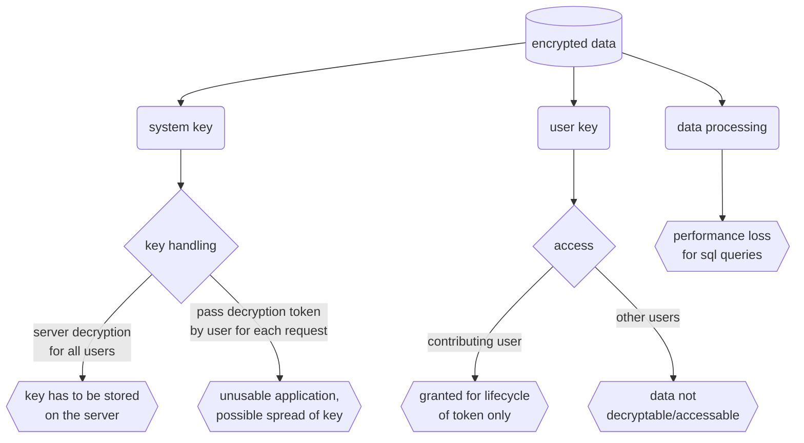

I welcome any constructive input on this topic.

[Content](#content)

## Web Application
[according to BSI](https://www.bsi.bund.de/SharedDocs/Downloads/DE/BSI/Publikationen/TechnischeRichtlinien/TR03161/BSI-TR-03161-2.pdf?__blob=publicationFile&v=10) for web applications

### 3.1.1 Prüfaspekt (1): Anwendungszweck
* O.Purp_1 Der Hersteller MUSS die rechtmäßigen Zwecke der Web-Anwendung und die Verarbeitung von personenbezogenen Daten offenlegen (etwa in der Beschreibung der Nutzungsbedingungen der Web-Anwendung) und den Nutzer spätestens bei der erstmaligen Nutzung der Anwendung darüber informieren.
    > [Terms of service](#terms-of-service-for-using-the-application) have to be confirmed on login.
* O.Purp_2 Die Web-Anwendung DARF KEINE Daten erheben und verarbeiten, die nicht dem rechtmäßigen Zweck der Anwendung dienen.
    > Only active and intentional user input is processed and stored.
* O.Purp_3 Die Web-Anwendung MUSS vor jeglicher Erfassung oder Verarbeitung personenbezogener Daten eine aktive und eindeutige Einwilligungserklärung des Nutzers einholen.
    > [Terms of service](#terms-of-service-for-using-the-application) have to be confirmed on login.
* O.Purp_4 Daten, deren Verarbeitung der Nutzer nicht ausdrücklich zugestimmt hat, DÜRFEN NICHT von der Web-Anwendung oder dem Hintergrundsystem erfasst, erhalten oder genutzt werden.
    > Only active and intentional user input is processed and stored.
* O.Purp_5 Die Web-Anwendung MUSS ermöglichen, dass der Nutzer eine bereits erteilte Einwilligung wieder entziehen kann. Der Nutzer MUSS vor der Einwilligung über die Möglichkeit des Widerrufs und die sich daraus ergebenden Veränderungen im Verhalten der Anwendung informiert werden.
    > The application is intended as a tool to fulfill regulatory requirements. Use may be assigned and a mandatory official task. Permissions regarding camera and notifications are described within the [terms of service](#terms-of-service-for-using-the-application), to be acknowledged on login.
* O.Purp_6 Der Hersteller MUSS ein Verzeichnis führen, welches erkennen lässt, welche Nutzereinwilligungen vorliegen. Der nutzerspezifische Teil des Verzeichnisses MUSS für den Nutzer automatisiert einsehbar sein. Es SOLL eine Historie dieses Verzeichnisses angefordert werden können.
    > The application is intended as a tool to fulfill regulatory requirements. Use may be assigned and a mandatory official task. Permissions regarding camera and notifications are described within the [terms of service](#terms-of-service-for-using-the-application), to be acknowledged on login. All individual system information can be accessed through the profile.
* O.Purp_7 Setzt die Web-Anwendung Drittanbieter-Software ein, MÜSSEN alle verwendeten Funktionen für die rechtmäßigen Zwecke der Anwendung erforderlich sein. Die Anwendung SOLL anderweitige Funktionen sicher deaktivieren. Wird nur eine einzige oder sehr wenige Funktionen der Drittanbieter-Software benötigt, MUSS abgewogen werden, ob die Einbindung des gesamten Drittanbieter-Software im Verhältnis zur Vergrößerung der Angriffsoberfläche durch die verwendete Drittanbieter-Software steht.
    > [List of third party software](#ressources)
* O.Purp_8 Sofern es nicht für den vorgesehenen primären oder rechtmäßigen Zweck einer WebAnwendung erforderlich ist, DÜRFEN sensible Daten NICHT mit Dritten geteilt werden. Die Anwendung MUSS den Nutzer über die Konsequenzen einer eventuellen Weitergabe von Anwendungsdaten vollumfänglich infrandormieren und sein Einverständnis einholen (OPT-IN).
    > [List of third party software](#ressources)
* O.Purp_9 Die Web-Anwendung DARF sensible Daten NICHT auf dem Bildschirm darstellen, außer dies ist für den primären Zweck der Anwendung erforderlich.
    > Sensitive data is displayed only on intended and active user request.

[Content](#content)

### 3.1.2 Prüfaspekt (2): Architektur
* O.Arch_1 „Security“ MUSS ein fester Bestandteil des Softwareentwicklungs- und Lebenszyklus‘ für die gesamte Web-Anwendung und das Hintergrundsystem sein.
    > User login and permissions have been mandatory from the early stages on.
* O.Arch_2 Bereits in der Designphase von Web-Anwendung und Hintergrundsystem MUSS berücksichtigt werden, dass die Anwendung in der Produktivphase sensible Daten verarbeiten wird. Die Architektur der Anwendung MUSS dafür die sichere Erhebung, Verarbeitung, Speicherung und Löschung der sensiblen Daten in einem Datenlebenszyklus gewährleisten.
    > User login and permissions have been mandatory from the early stages on.
* O.Arch_3 Der Lebenszyklus von kryptographischem Schlüsselmaterial MUSS einer ausgearbeiteten Richtlinie folgen, die Eigenschaften wie die Zufallszahlenquelle, detaillierte Angaben zur Aufgabentrennung von Schlüsseln, Ablauf von Schlüsselzertifikaten, Integritätssicherung durch Hash-Algorithmen etc., umfasst. Die Richtlinie SOLL auf anerkannten Standards wie [TR02102-2] und [NIST80057] basieren.
    > [Encryption statement](#encryption-statement)
* O.Arch_4 In Backups gespeicherte sensiblen Daten MÜSSEN gemäß dem aktuellen Stand der Technik verschlüsselt sein. Dies schließt das Persistieren sensibler Daten durch den Browser, etwa in dessen Cache, mit ein.
    > [Encryption statement](#encryption-statement)
* O.Arch_5 Nutzt die Web-Anwendung Drittanbieter-Software, MUSS der Hersteller sicherstellen, dass nur solche Drittanbieter-Software zum Einsatz kommen, deren zu nutzenden Funktionen sicher genutzt werden können und dem Nutzer Informationen über den Nutzungsumfang und die eingesetzten Sicherheitsmechanismen klar darstellen. Die Anwendung MUSS diese Funktionen sicher nutzen. Der Hersteller MUSS darüber hinaus sicherstellen, dass ungenutzte Funktionen durch Dritte nicht aktiviert werden können.
    > [List of third party software](#ressources)
* O.Arch_6 Die Architektur der Web-Anwendung SOLL einem minimalistischen Ansatz folgen und mit einer serverseitig lokalisierten Verarbeitungslogik realisiert sein, d.h. es SOLLEN keine komplexen aktiven Inhalte (Java Applets, ActiveX-Plugin, o.ä.) verwendet werden.
    > Used languages and are solely limited to HTML, CSS, JavaScript and PHP. Contents are delivered by the backend only.
* O.Arch_7 Der Hersteller MUSS dem Nutzer eine barrierearme Möglichkeit bereitstellen, um Sicherheitsprobleme zu melden. Die Kommunikation SOLL über einen verschlüsselten Kanal stattfinden.
    > [Terms of service](#terms-of-service-for-using-the-application) have to be confirmed on login. These contain an eMail address.
* O.Arch_8 Die Web-Anwendung MUSS beim Start die Aktualität des genutzten Web-Browsers prüfen. Wenn die Installation eines sicherheitsrelevanten Updates noch nicht erfolgt ist, DARF die Web-Anwendung KEINEN Zugriff auf sensible Daten ermöglichen.
    > The operator of the infrastructure is responsible for browser actuality. How is that supposed to work anyway?
* O.Arch_9 Die Web-Anwendung SOLL HTTP-Server-Header nutzen, die dem aktuellen Stand der Technik entsprechen und die Sicherheit der Anwendung erhöhen. Dazu gehören unter anderem HTTP Strict Transport Security (HSTS), Content Security Policy (CSP) und X-Frame-Options.
    > [Prerequisites](#prerequisites)

[Content](#content)

### 3.1.3 Prüfaspekt (3): Quellcode
* O.Source_1 Die Anwendung MUSS alle Eingaben vor deren Verarbeitung prüfen, um potenziell bösartige Werte vor der Verarbeitung herauszufiltern.
    > Inputs are masked as strings by the backend by default.
* O.Source_2 Die Anwendung MUSS eingehende und ausgehende Daten maskieren beziehungsweise von potenziell schadhaften Zeichen bereinigen oder deren Verarbeitung ablehnen.
    > Outputs on the front end are parsed as text nodes or unexecuted input values.
* O.Source_3 Fehlermeldungen und Log-Dateien DÜRFEN KEINE sensiblen Daten (z. B. User Identifier oder Session-IDs) enthalten.
    > This is not the case.
* O.Source_4 Potenzielle Ausnahmen im Programmablauf (Exceptions) MÜSSEN abgefangen, kontrolliert behandelt und dokumentiert werden. Technische Fehlerbeschreibungen (z.B. Stack Traces) DÜRFEN dem Nutzer NICHT angezeigt werden.
    > This is not the case.
* O.Source_5 Bei Ausnahmen im Programmablauf (Exceptions) SOLL die Web-Anwendung Zugriffe auf sensible Daten abbrechen und diese im Speicher sicher löschen.
    > Sensitive data is passed to callbacks only and is not available after occuring exceptions.
* O.Source_6 Alle Optionen zur Unterstützung der Entwicklung (z. B. Entwickler-URLs, Testmethoden, Überreste von Debugmechanismen etc.) MÜSSEN in der ProduktivVersion vollständig entfernt sein.
    > Debugging is removed.
* O.Source_7 Vor der produktiven Bereitstellung der Anwendung SOLLEN moderne Sicherheitsmechanismen, wie beispielsweise Obfuskation und Bundler, verwendet werden.
    > This is not reasonable for the application used within a closed environment.
* O.Source_8 Für die Entwicklung der Anwendung SOLLEN Werkzeuge zur statischen Codeanalyse eingesetzt werden.
    > [Code design patterns](#code-design-patterns)
* O.Source_9 Nutzt die Web-Anwendung URL-Weiterleitungen (URL-Redirects), MUSS diese kontrolliert erfolgen.
    > Redirects are not used
* O.Source_10 Die Web-Anwendung MUSS Maßnahmen vorsehen, die verhindern, dass Funktionalitäten, die nicht in der Entwicklungshoheit des Herstellers liegen, in die WebAnwendung eingeschleust und zur Ausführung gebracht werden.
    > Inputs are sanitized and masked by default.
* O.Source_11 Sensible Daten DÜRFEN NICHT in der URL vorkommen. Die Web-Anwendung MUSS solche Daten in HTTP Request Headern oder POST-Parametern verarbeiten.
    > Sensitive data is always handled as PUT or POST. [API documentation](#api-documentation)

[Content](#content)

### 3.1.4 Prüfaspekt (4): Drittanbieter-Software
* O.TrdP_1 Der Anbieter MUSS eine zentrale und vollständige Liste von Abhängigkeiten durch Drittanbieter-Software führen.
    > [List of third party software](#ressources)
* O.TrdP_2 Drittanbieter-Software MUSS in der neusten oder der ihr vorhergehenden, für die Veröffentlichung vorgesehenen Version verwendet werden. 
    > [List of third party software](#ressources)
* O.TrdP_3 Drittanbieter-Software MUSS durch den Hersteller regelmäßig (durch Auswertung öffentlich verfügbarer Informationen oder durch statische/dynamische Testmethoden) auf Schwachstellen überprüft werden. Überreste von Optionen zur Unterstützung der Entwicklung (vgl.O.Source_6) sind hierbei als Schwachstelle zu werten. Der Hersteller MUSS für alle öffentlich bekannten Schwachstellen analysieren, inwieweit die Schwachstelle die Sicherheit des Gesamtsystems beeinträchtigt. Software, bzw. Funktionen aus Drittanbieter-Software DÜRFEN bei bekannten Schwachstellen, die die Sicherheit des Gesamtsystems betreffen NICHT eingesetzt werden. 
    > [List of third party software](#ressources)
* O.TrdP_4 Sicherheitsupdates für Drittanbieter-Software MUSS zeitnah integriert und per Update dem Nutzer zur Verfügung gestellt werden. Der Hersteller MUSS ein Sicherheitskonzept vorlegen, das anhand der Kritikalität ausnutzbarer Schwachstellen die geduldete Weiternutzung für die Web-Anwendung, bzw. das Hintergrundsystem festlegt. Nachdem die Übergangsfrist (Grace Period) abgelaufen ist, DARF die Web-Anwendung NICHT mehr zur Benutzung angeboten werden.
    > [List of third party software](#ressources)
* O.TrdP_5 Vor der Verwendung von Drittanbieter-Software MUSS deren Quelle auf Vertrauenswürdigkeit geprüft werden.
    > [List of third party software](#ressources)
* O.TrdP_6 Die Anwendung SOLL sensible Daten nicht an Drittanbieter-Software weitergeben.
    > [List of third party software](#ressources)
* O.TrdP_7 Über Drittanbieter-Software eingehende Daten MÜSSEN validiert werden.
    > Third party libraries but *html5-code* do not deliver data. The result of scanned qr-codes are displayed to the user and masked by default on processing database queries.
* O.TrdP_8 Drittanbieter-Software, die nicht mehr gewartet wird, DARF NICHT verwendet werden. 
    > [List of third party software](#ressources)

[Content](#content)

### 3.1.5 Prüfaspekt (5): Kryptographische Umsetzung
> [Encryption statement](#encryption-statement)

* O.Cryp_1 Beim Einsatz von Verschlüsselung in der Web-Anwendung DÜRFEN KEINE fest einprogrammierten geheimen, bzw. privaten Schlüssel eingesetzt werden.
    > Encrypted data uses a server-side SHA-encrypted key for user validation.
* O.Cryp_2 Die Anwendung MUSS auf bewährte Implementierungen zur Umsetzung kryptographischer Primitive und Protokolle zurückgreifen (vgl. [TR02102-2]).
    > Encryption, where applicable, uses SHA-256 algorithm for encryption.
* O.Cryp_3 Die Wahl kryptographischer Primitive MUSS passend zum Anwendungsfall sein und dem aktuellen Stand der Technik (siehe [TR02102-1]) entsprechen.
    > Encrypted data uses a server-side SHA-encrypted key for user validation.
* O.Cryp_4 Kryptographische Schlüssel DÜRFEN NICHT für mehr als genau einen Zweck eingesetzt werden. 
    > Encrypted data uses a server-side SHA-encrypted key for user validation.
* O.Cryp_5 Die Stärke der kryptographischen Schlüssel MUSS dem aktuellen Stand der Technik entsprechen (siehe [TR02102-1]).
    > Encryption, where applicable, uses SHA-256 algorithm for encryption.

[Content](#content)

### 3.1.6 Prüfaspekt (6): Authentisierung und Authentifizierung 
* O.Auth_1 Der Hersteller MUSS ein Konzept zur Authentisierung auf angemessenem Vertrauensniveau [TR03107-1], zur Autorisierung (Rollenkonzept) und zum Beenden einer Anwendungssitzung dokumentieren.
    > User log in via token, have permissions granted by an administrative user that are updated with every request; sessions are destroyed on logout.
* O.Auth_2 Die Anwendung SOLL Authentisierungsmechanismen und Autorisierungsfunktionen separat realisieren. Sind für die Anwendung verschiedene Rollen notwendig, MUSS eine Autorisierung bei jedem Datenzugriff separat realisiert werden. 
    > Every request matches the session and user permissions.
* O.Auth_3 Jeder Authentifizierungsvorgang des Nutzers MUSS in Form einer Zwei-FaktorAuthentifizierung umgesetzt werden.
    > Login occurs using a token. Beforehand the device itself is supposed to have a dedicated login and user credentials.
* O.Auth_4 Zusätzlich zu der in O.Auth_1 definierten Authentisierung auf einem angemessenen Vertrauensniveau, KANN der Hersteller dem Nutzer gemäß § 139e Abs. 10 SGB V, nach umfassender Information und Einwilligung, eine Authentisierungsmöglichkeit auf einem niedrigeren Vertrauensniveau anbieten. Dies schließt das Anbieten zusätzlicher Verfahren basierend auf den digitalen Identitäten im Gesundheitswesen gemäß § 291 Abs. 8 SGB V mit ein.
    > This is not applicable.
* O.Auth_5 Für die Bewertung eines Authentisierungsvorgangs SOLLEN zusätzliche Informationen (z. B. das verwendete Endgerät, die verwendete IP-Adresse oder die Zeit des Zugriffs) mit einbezogen werden.
    > This is not reasonable for the application used within a closed environment.
* O.Auth_6 Dem Nutzer SOLL eine Möglichkeit gegeben werden, sich über ungewöhnliche Anmeldevorgänge informieren zu lassen.
    > This is not reasonable for the application used within a closed environment. Users can see their logins for the past (customizable) days though.
* O.Auth_7 Die Anwendung MUSS Maßnahmen umsetzen, die ein Ausprobieren von LoginParametern (z. B. Passwörter) erschweren.
    > This is not reasonable for the application used within a closed environment and on shared devices.
* O.Auth_8 Wurde die Anwendung unterbrochen (in den Hintergrundbetrieb versetzt), MUSS nach Ablauf einer angemessenen Frist (Grace Period) eine erneute Authentisierung durchgeführt werden.
    > The backend handles idle time based on last request by an authorized user and enforces a reauthentication or logout.
* O.Auth_9 Die Anwendung MUSS nach einer angemessenen Zeit in der sie nicht aktiv verwendet wurde (idle time) eine erneute Authentisierung fordern. 
    > The backend handles idle time based on last request by an authorized user and enforces a reauthentication or logout.
* O.Auth_10 Die Anwendung MUSS nach einer angemessenen Zeit in der sie aktiv verwendet wurde (active time) eine erneute Authentisierung zur Reaktivierung der Serversitzung fordern. 
    > The backend handles idle time based on last request by an authorized user and enforces a reauthentication or logout.
* O.Auth_11 Die Authentisierungsdaten DÜRFEN NICHT ohne eine erneute Authentifizierung des Nutzers geändert werden.
    > Every request matches the login token with the database (server side only). If the token is not found, the user is logged out and the session destroyed.
* O.Auth_12 Die Anwendung MUSS für die Anbindung eines Hintergrundsystems eine dem Stand der Technik entsprechende Authentifizierung verwenden.
    > This is not reasonable for the application used within a closed environment.
* O.Auth_13 Authentisierungsdaten, wie bspw. Session-Identifier bzw. Authentisierungstoken, MÜSSEN als sensible Daten geschützt werden.
    > [Installation](#installation)
* O.Auth_14 Die Anwendung MUSS es dem Nutzer ermöglichen einen oder alle zuvor ausgestellten Session-Identifier bzw. Authentisierungstoken zu invalidieren.
    > Sessions will allways be destroyed on logout.
* O.Auth_15 Wird eine Anwendungssitzung ordnungsgemäß beendet, MUSS die Anwendung das Hintergrundsystem darüber informieren, sodass Session-Identifier bzw. Authentisierungstoken sicher gelöscht werden. Dies gilt sowohl für das aktive Beenden durch den Benutzer (log-out), als auch für das automatische Beenden durch die Anwendung (vgl. O.Auth_9 und O.Auth_10).
    > Sessions will allways be destroyed on logout.
* O.Auth_16 Bei Änderung der Zugangsparameter SOLL der Nutzer über die zuletzt hinterlegten, gültigen Kontaktdaten über die Änderung informiert werden. Dem Nutzer SOLL über diesem Weg eine Möglichkeit geboten werden, die gemeldete Änderung zu sperren und nach entsprechender Authentifizierung neue Zugangsparameter zu setzen.
    > Login tokens are created and changed by authorized administrative users only. This also enables to lock any user out if necessary.
* O.Auth_17 Der Nutzer MUSS in den Nutzungsbedingungen der Web-Anwendung auf das Restrisiko hingewiesen werden, welches mit der Speicherung der Login-Credentials im WebBrowser oder auch einem anderen externen Programm für einen komfortableren Anmeldevorgang verbunden ist.
    > The input form for the login token is set to one-time-code and can not be stored.

[Content](#content)

### 3.1.6.1 Authentifizierung über Passwort
* O.Pass_1 Bei einer Authentifizierung mittels Benutzername und Passwort MÜSSEN starke Passwortrichtlinien existieren. Diese SOLLEN sich am aktuellen Stand gängiger „BestPractices“ orientieren. 
    > Login tokens are a sha256 hash encrypting a random number amongst others, 64 characters long and consist of numbers and characters.
* O.Pass_2 Für die Einrichtung der Authentisierung mittels Benutzername und Passwort KANN die Stärke des verwendeten Passworts dem Nutzer angezeigt werden. Informationen über die Stärke des gewählten Passworts DÜRFEN NICHT gespeichert werden.
    > Login tokens are always generated by the system on request of an authorized administrative user.
* O.Pass_3 Der Nutzer MUSS die Möglichkeit haben, sein Passwort zu ändern.
    > Login tokens can be renewed by authorized administrative users.
* O.Pass_4 Das Ändern und Zurücksetzen von Passwörtern MUSS protokolliert werden.
    > Login tokens can be renewed by authorized administrative users. Logging changes is not reasonable.
* O.Pass_5 Werden Passwörter gespeichert, MÜSSEN diese mit einer den aktuellen Sicherheitsstandards entsprechenden Hash-Funktion und unter Verwendung geeigneter Salts gehasht werden.
    > The frontend does not store passwords.

[Content](#content)

### 3.1.7 Prüfaspekt (7): Datensicherheit
* O.Data_1 Die Werkseinstellung der Web-Anwendung MUSS die maximale Sicherheit bieten.
    > The application has no prefilled sensitive data on installation. New users have to be assigned roles actively.
* O.Data_2 Exportiert der Nutzer sensible Daten unverschlüsselt MUSS der Nutzer durch die WebAnwendung darauf aufmerksam gemacht werden, dass der Nutzer selbst die Verantwortung für die Datensicherheit dieser exportierten Daten übernimmt.
    > [Terms of service](#terms-of-service-for-using-the-application) have to be confirmed on login. On any export there is a additional reminder by default.
* O.Data_3 Die Web-Anwendung DARF Ressourcen, die einen Zugriff auf sensible Daten ermöglichen, gegenüber Dritten NICHT verfügbar machen.
    > There are no interfaces outside of the closed environment.
* O.Data_4 Alle erhobenen sensiblen Daten DÜRFEN NICHT über die Dauer ihrer jeweiligen Verarbeitung hinaus in der Web-Anwendung gehalten werden.
    > Sensitive data is passed to callbacks only, rendered on request and not available on every next GET request.
* O.Data_5 Die Web-Anwendung MUSS die Grundsätze der Datensparsamkeit und Zweckbindung berücksichtigen.
    > Only active and intentional user input is processed and stored.
* O.Data_6 Die Speicherung und Verarbeitung von sensiblen Daten SOLL im Hintergrundsystem erfolgen.
    > This is the case, storing sensitive data within the frontend occurs only as offline fallback within same-origin IndexedDB, the storage is cleared as soon as the cached requests have been submitted.
* O.Data_7 Bei der Verwendung von Aufnahmegeräten (z. B. Kamera) MÜSSEN sämtliche Metadaten mit Datenschutz-Relevanz, wie etwa Rückschlüsse auf die GPS-Koordinaten des Aufnahmeorts, eingesetzte Hardware etc., entfernt werden.
    > All photos are processed and resized. Meta data is lost during this process.
* O.Data_8 Bei der Erhebung von sensiblen Daten durch die Verwendung von Aufnahmegeräten (z.B. Kamera), MUSS vorgebeugt werden, dass andere Anwendungen darauf Zugriff erlangen könnten, etwa über eine Mediengalerie.
    > Camera pictures are not stored in shared folders and exist only as form data before submission.
* O.Data_9 Bei der Eingabe sensibler Daten über die Tastatur SOLL die Web-Anwendung unterbinden, dass Aufzeichnungen für Dritte erkennbar werden. 
    > The operator of the infrastructure is responsible to prevent malware on terminal devices.
* O.Data_10 Bei der Eingabe sensibler Daten SOLL der Export in die Zwischenablage unterbunden werden. Die Anwendung KANN alternativ eine eigene Zwischenablage implementieren, welche vor dem Zugriff durch andere Anwendungen geschützt ist.
    > Content is not selectable by default. Clipboard activites are implemented on insensitive data only.
* O.Data_11 Sensible Daten DÜRFEN NICHT aus der Komponente, auf der sie erzeugt wurden, exportiert werden.
    > Data exports happen in other modules than inputs. Data is always sanitized and processed before exports.
* O.Data_12 Durch die Web-Anwendung kann der Zugriff für Dritte und die Speicherung des Bildschirms (z. B. Screenshots und Anzeigen für das App-Switching) nicht unterbunden werden. Über die Nutzungsbedingungen MUSS der Nutzer darüber informiert werden, dass sensible Daten über Screenshots oder Anzeigen für das App-Switching kompromittiert werden können.
    > [Terms of service](#terms-of-service-for-using-the-application) have to be confirmed on login.
* O.Data_13 Über die Nutzungsbedingungen der Web-Anwendung MUSS der Nutzer über das Risiko informiert werden, welches damit verbunden ist, dass im gesperrten Zustand des Endgeräts die Verbindung zum Hintergrundsystem weiter geöffnet bleibt, wenn der Nutzer sich nicht explizit ausgeloggt hat.
    > [Terms of service](#terms-of-service-for-using-the-application) have to be confirmed on login.
* O.Data_14 Die Web-Anwendung SOLL sicherstellen, dass bei ihrer Beendigung alle sensiblen Daten und anwendungsspezifischen Anmeldeinformationen im Web-Browser nicht mehr zugreifbar sind. Dies schließt insbesondere Cookies und Webstorage mit ein.
    > The offline fallback storing user input within indexedDB outweigh this recommendation to avoid data loss. [Network connection handling](#network-connection-handling)
* O.Data_15 Die Web-Anwendung MUSS dem Nutzer die Möglichkeit geben, dass bei endgültiger Beendigung der Nutzung alle sensiblen Daten und anwendungsspezifischen Anmeldeinformationen vollständig gelöscht bzw. unzugänglich gemacht werden.
    > Authorized users can delete users permanently.
* O.Data_16 Für alle Cookies, auf die nicht mittels JavaScript zugegriffen wird, MUSS das HTTP-OnlyFlag verwendet werden. 
    > Only a session cookie is created. Respective flags are set.
* O.Data_17 Für alle Cookies, die sensible Daten enthalten, MUSS das Secure-Flag gesetzt sein.
    > [Installation](#installation)
* O.Data_18 Für alle Formularfelder mit sensiblen Eingabedaten MUSS die Autocomplete-Funktion abgeschaltet sein.
    > All inputs are rendered without autocomplete by default. Datalists may be provided with former inputs to ensure a consistent documentation. Datalists are provided by the backend and relate only fields namewise. The browser will not store single and collections of inputs.
* O.Data_19 Im Browser persistierte Daten SOLLEN für weitere Hosts einer Domain unlesbar sein (d.h. Vermeidung von Domain-Cookies).
    > Only a session cookie is created, IndexedDB has same-origin principle by default.

[Content](#content)

### 3.1.8 Prüfaspekt (8): Kostenpflichtige Ressourcen 
> Not applicable, as there are no paid ressources.

### 3.1.9 Prüfaspekt (9): Netzwerkkommunikation 
> The operator of the infrastructure is responsible for fulfilling these requirements. Caro App [requires SSL](#prerequisites) consistently though.

[Content](#content)

### 3.1.10 Prüfaspekt (10): Plattformspezifische Interaktionen
* O.Plat_1 Für die Nutzung der Web-Anwendung SOLL das Endgerät über einen aktivierten Geräteschutz (Passwort, Mustersperre, o. ä.) verfügen. Im Fall eines nicht aktivierten Geräteschutzes MUSS der Hersteller den Nutzer über die damit verbundenen Risiken aufklären.
    > The operator of the infrastructure is responsible for fulfilling this requirement.
* O.Plat_2 Die Web-Anwendung DARF Berechtigungen, die für die Erfüllung ihres primären Zwecks nicht notwendig sind, NICHT einfordern.
    > Requested permissions involve camera access for scanning qr-codes and occasionally adding pictures for medical device documentation, as well as notifications to alert on new messages within the application.
* O.Plat_3 Die Web-Anwendung MUSS den Nutzer auf den rechtmäßigen Zweck der anzufragenden Berechtigungen und auf die Auswirkungen hinweisen, die eintreten, falls der Nutzer diese nicht gewährt.
    > [Terms of service](#terms-of-service-for-using-the-application) have to be confirmed on login.
* O.Plat_4 Die Web-Anwendung DARF KEINE sensiblen Daten in erweiterten Meldungen oder Benachrichtigungen, die nicht vom Nutzer explizit eingeschaltet wurden (siehe O.Plat_5), anzeigen.
    > Notifications only alert on a number of new messages and contain no further data.
* O.Plat_5 Die Web-Anwendung KANN dem Nutzer die Optionen bieten, erweiterte Meldungen und Benachrichtigungen, ggf. auch mit sensiblen Inhalten, anzuzeigen. Bei Werkseinstellung MUSS diese deaktiviert sein.
    > This is not applicable. Notifications contain only numbers. Notifications have to be actively permitted by the user within the browser.
* O.Plat_6 Die Web-Anwendung MUSS das Nachladen von Inhalten auf Quellen beschränken, die unter der Kontrolle des Herstellers sind oder durch den Hersteller autorisiert wurden.
    > Lazyloading is not implemented, all contents are delivered by the backend only.
* O.Plat_7 Die Web-Anwendung MUSS den Nutzer über das Risiko informieren, dass ggf. nach Beendigung der Web-Anwendung nutzerspezifischen Daten im Arbeitsspeicher verbleiben können.
    > [Terms of service](#terms-of-service-for-using-the-application) have to be confirmed on login.
* O.Plat_8 Der Nutzer MUSS über Sicherheitsmaßnahmen informiert werden, sofern diese durch den Nutzer umsetzbar sind. 
    > [Terms of service](#terms-of-service-for-using-the-application) have to be confirmed on login.

[Content](#content)

### 3.1.11 Prüfaspekt (11): Resilienz
* O.Resi_1 Die Web-Anwendung MUSS dem Nutzer barrierearme Best-Practice-Empfehlungen zum sicheren Umgang mit der Anwendung und ihrer Konfiguration bereitstellen.
    > [Terms of service](#terms-of-service-for-using-the-application) have to be confirmed on login.
* O.Resi_2 Die Web-Anwendung MUSS über die Nutzungsbedingungen dem Nutzer darstellen, welche Risiken für die Daten des Nutzers bei einer Benutzung von Geräten, deren Betriebssystem in keinem vom Betriebssystemhersteller vorgesehenen Betriebszustand ist, bestehen. 
    > [Terms of service](#terms-of-service-for-using-the-application) have to be confirmed on login.

[Content](#content)

## Backend
[according to BSI](https://www.bsi.bund.de/SharedDocs/Downloads/DE/BSI/Publikationen/TechnischeRichtlinien/TR03161/BSI-TR-03161-3.pdf?__blob=publicationFile&v=9) for backends

### 3.1.1 Prüfaspekt (1): Anwendungszweck 
* O.Purp_1 Das Hintergrundsystem DARF KEINE Daten erheben und verarbeiten, die nicht dem rechtmäßigen Zweck der Anwendung dienen.
    > Only active and intentional user input is processed and stored.
* O.Purp_2 Das Hintergrundsystem MUSS vor jeglicher Erfassung oder Verarbeitung personenbezogener Daten eine aktive und eindeutige Einwilligungserklärung des Nutzers einholen.
    > [Terms of service](#terms-of-service-for-using-the-application) have to be confirmed on login.
* O.Purp_3 Daten, deren Verarbeitung der Nutzer nicht ausdrücklich zugestimmt hat, DÜRFEN NICHT von dem Hintergrundsystem verarbeitet werden.
    > Only active and intentional user input is processed and stored.
* O.Purp_4 Das Hintergrundsystem MUSS ermöglichen, dass der Nutzer eine bereits erteilte Einwilligung wieder entziehen kann. Der Nutzer MUSS vor der Einwilligung über die Möglichkeit des Widerrufs und die sich daraus ergebenden Veränderungen im Verhalten der Anwendung informiert werden.
    > The application is intended as a tool to fulfill regulatory requirements. Use may be assigned and a mandatory official task. The backend does not request special user consent.
* O.Purp_5 Der Anbieter MUSS ein Verzeichnis führen, welches erkennen lässt, welche Nutzereinwilligungen vorliegen. Der nutzerspezifische Teil des Verzeichnisses MUSS für den Nutzer automatisiert einsehbar sein. Es SOLL eine Historie dieses Verzeichnisses angefordert werden können.
    > All user settings are displayed within the profile. Selectable options are disabled by default.
* O.Purp_6 Setzt das Hintergrundsystem Drittanbieter-Software ein, SOLLEN alle verwendeten Funktionen für den rechtmäßigen Zweck des Gesamtsystems erforderlich sein. Anbieter beschreibt die für die Inhalte des Produktes verantwortliche juristische Person. Hosting-Anbieter bei extern gehosteten Systemen oder Cloud-Lösungen sind hier explizit nicht gemeint.Anderweitige Funktionen SOLLEN sicher deaktiviert sein. Wird nur eine einzige oder sehr wenige Funktionen der Drittanbieter-Software benötigt, SOLL abgewogen werden, ob die Einbindung der gesamten Drittanbieter-Software im Verhältnis zur Vergrößerung der Angriffsoberfläche durch die verwendete Drittanbieter-Software steht.
    > [List of third party software](#ressources)
* O.Purp_7 Sofern es nicht für den vorgesehenen primären oder rechtmäßigen Zweck einer Anwendung erforderlich ist, DÜRFEN sensible Daten NICHT mit Dritten geteilt werden. Dies betrifft auch die Ablage dieser Daten in Teilen des Dateisystems, auf die auch andere Anwendungen Zugriff haben. Die Anwendung MUSS den Nutzer über die Konsequenzen einer eventuellen Weitergabe von Anwendungsdaten, die dem primären oder rechtmäßigen Zweck dienen, vollumfänglich informieren und sein Einverständnis einholen (OPT-IN).
    > [List of third party software](#ressources)

[Content](#content)

### 3.1.2 Prüfaspekt (2): Architektur 
* O.Arch_1 „Security“ MUSS ein fester Bestandteil des Softwareentwicklungs- und Lebenszyklus für die gesamte Anwendung sein.
    > User login and permissions have been mandatory from the early stages on.
* O.Arch_2 Bereits in der Designphase des Hintergrundsystems MUSS berücksichtigt werden, dass das Hintergrundsystem der Anwendung in der Produktivphase sensible Daten verarbeiten wird. Die Architektur des Hintergrundsystems MUSS dafür die sichere Erhebung, Verarbeitung, Speicherung und Löschung der sensiblen Daten in einem Datenlebenszyklus gewährleisten. 
    > User login and permissions have been mandatory from the early stages on.
* O.Arch_3 Der Lebenszyklus von kryptographischem Schlüsselmaterial MUSS einer ausgearbeiteten Richtlinie folgen, die Eigenschaften wie die Zufallszahlenquelle, detaillierte Angaben zur Aufgabentrennung von Schlüsseln, Ablauf von Schlüsselzertifikaten, Integritätssicherung durch Hash-Algorithmen etc., umfasst. Die Richtlinie SOLL auf anerkannten Standards wie [TR02102-2] und [NIST80057] basieren. 
    > [Encryption statement](#encryption-statement)
* O.Arch_4 In Backups gespeicherte sensible Daten MÜSSEN gemäß dem Stand der Technik verschlüsselt sein.
    > [Encryption statement](#encryption-statement), if the operator of the infrastructure is able to encrypt backups, they are responsible.
* O.Arch_5 Sicherheitsfunktionen MÜSSEN immer auf allen Außenschnittstellen und APIEndpunkten implementiert werden.
    > User matching and permission handling happens with every api request.
* O.Arch_6 Nutzt das Hintergrundsystem Drittanbieter-Software (etwa für Datenbanken, Authentifizierung oder Logging), MUSS der Hersteller sicherstellen, dass nur solche Drittanbieter-Software zum Einsatz kommt, deren zu nutzende Funktionen sicher genutzt werden können und dem Nutzer Informationen über den Nutzungsumfang und die eingesetzten Sicherheitsmechanismen klar darstellt. Das Hintergrundsystem MUSS diese Funktionen sicher nutzen. Der Hersteller MUSS darüber hinaus sicherstellen, dass ungenutzte Funktionen durch Dritte nicht aktiviert werden können.
    > The operator of the infrastructure is responsible for fulfilling these requirements.
* O.Arch_7 Das Hintergrundsystem MUSS alle Anfragen der Anwendung über eine vollständig dokumentierte API entgegennehmen. Es DARF KEINE nicht dokumentierten Zugriffsmöglichkeiten enthalten.
    > [Api documentation](#api-documentation)
* O.Arch_8 Der Hersteller MUSS dem Nutzer eine barrierearme Möglichkeit bereitstellen, um Sicherheitsprobleme zu melden. Die Kommunikation SOLL über einen verschlüsselten Kanal stattfinden.
    > [Terms of service](#terms-of-service-for-using-the-application) have to be confirmed on login. These contain an eMail address.
* O.Arch_9 Das Hintergrundsystem MUSS so implementiert sein, dass ungewollte Zugriffe über eventuelle Management-Schnittstellen effektiv unterbunden werden. Insbesondere bei externem Hosting (s. Kapitel 2.3.2) und Cloud-Diensten (s. Kapitel 2.3.3) MUSS sichergestellt werden, dass der Betreiber Zugriffsmöglichkeiten zwischen verschiedenen Kunden unterbindet.
    > The operator of the infrastructure is responsible for fulfilling these requirements.
* O.Arch_10 Dienste, die das Hintergrundsystem zur Verfügung stellt, SOLLEN nur mit den notwendigen Rechten ausgeführt werden. Dienste, die von außen erreichbar sind, DÜRFEN NICHT mit Administrator-, System- bzw. Root-Rechten laufen.
    > The application does not provide services.
* O.Arch_11 Das Hintergrundsystem MUSS über ein zentrales Protokollierungssystem verfügen, in dem alle Log-Nachrichten der verschiedenen Dienste zusammenlaufen. Protokolle SOLLEN auf einem dedizierten System (sog. Logserver) gesammelt werden, um einem Löschen und Manipulieren auf den Quellsystemen entgegenzuwirken.
    > The operator of the infrastructure is responsible for fulfilling these requirements.
* O.Arch_12 Das Hintergrundsystem MUSS die Anwendung über sicherheitsrelevante Updates informieren und nach einer Übergangsfrist (Grace Period) die Benutzung einer veralteten Anwendung unterbinden. 
    > The operator of the infrastructure is responsible for fulfilling these requirements.

[Content](#content)

### 3.1.3 Prüfaspekt (3): Quellcode 
* O.Source_1 Das Hintergrundsystem MUSS alle Eingaben vor deren Verarbeitung prüfen, um potenziell bösartige Werte vor der Verarbeitung herauszufiltern.
    > Inputs are masked as strings by the backend by default.
* O.Source_2 Das Hintergrundsystem MUSS eingehende und ausgehende Daten maskieren beziehungsweise von potenziell schadhaften Zeichen bereinigen oder deren Verarbeitung ablehnen. 
    > Outputs on the front end are parsed as text nodes or unexecuted input values.
* O.Source_3 Potenzielle Ausnahmen im Programmablauf (Exceptions) MÜSSEN abgefangen, kontrolliert behandelt und dokumentiert werden. Technische Fehlerbeschreibungen (z.B. Stack Traces) DÜRFEN dem Nutzer NICHT angezeigt werden.
    > This is not the case.
* O.Source_4 Bei Ausnahmen im Programmablauf (Exceptions) SOLL das Hintergrundsystem Zugriffe auf sensible Daten abbrechen und die Anwendung anweisen, diese im Speicher sicher zu löschen.
    > Exceptions exit the code execution, the programming languages garbage collector clears the memory by default.
* O.Source_5 Sofern das Hintergrundsystem oder Teile davon über eine manuelle Speicherverwaltung verfügen (d.h., das entsprechende Programm kann selbst exakt festlegen, wann und wo Speicher gelesen und beschrieben wird), MUSS für lesende und schreibende Zugriffe auf Speichersegmente auf sichere Funktionsalternativen (z. B. sprintf_s statt printf) zurückgegriffen werden.
    > Storage is handled by the backend exclusively.
* O.Source_6 Alle Optionen zur Unterstützung der Entwicklung (z. B. Entwickler-URLs, Testmethoden, Überreste von Debugmechanismen etc.) MÜSSEN in der ProduktivVersion vollständig entfernt sein.
    > Debugging is removed.
* O.Source_7 Das Hintergrundsystem MUSS sicherstellen, dass alle sensiblen Daten unverzüglich nach der Erfüllung ihres Verarbeitungszwecks sicher gelöscht werden.
    > *Currently there is no deletion possible for audit safety reasons and an expected data lifespan of up to 30 years. Once a deletion process has been established (feedback of authorities regarding GDPR has yet to be received as of 9/24) a deletion occurs on the database level. The operator of the infrastructure is responsible for a secure deletion of data on the disk and backups.*
* O.Source_8 Der Hersteller MUSS einen Deployment-Prozess für die Inbetriebnahme, Aktualisierungen und Abschaltung des Hintergrundsystems etablieren, der sicherstellt, dass zu keinem Zeitpunkt die Veröffentlichung oder das Kompromittieren sensibler Daten möglich ist.
    > [Deployment process](#deployment-process)
* O.Source_9 Der Hersteller SOLL automatische Tools zur Identifikation von Programmfehlern und Best-Practice Violations im Build Process verwenden. Jegliche Warnungen MÜSSEN von dem Hersteller vor dem Produktivbetrieb mitigiert werden.
    > [Code design patterns](#code-design-patterns)
* O.Source_10 Für den Bau des Hintergrundsystem SOLLEN moderne Sicherheitsmechanismen, wie beispielsweise Obfuskation und Stack-Protection aktiviert werden.
    > This is not reasonable for the application used within a closed environment.
* O.Source_11 Für die Entwicklung des Hintergrundsystems SOLLEN Werkzeuge zur statischen Codeanalyse eingesetzt werden.
    > [Code design patterns](#code-design-patterns)

[Content](#content)

### 3.1.4 Prüfaspekt (4): Drittanbieter-Software 
* O.TrdP_1 Der Anbieter MUSS eine zentrale und vollständige Liste von Abhängigkeiten durch Drittanbieter-Software führen. 
    > [List of third party software](#ressources)
* O.TrdP_2 Drittanbieter-Software MUSS in der neusten oder der ihr vorhergehenden, für die Veröffentlichung vorgesehenen Version verwendet werden.
    > [List of third party software](#ressources)
* O.TrdP_3 Drittanbieter-Software MUSS durch den Hersteller regelmäßig (durch Auswertung öffentlich verfügbarer Informationen oder durch statische/dynamische Testmethoden) auf Schwachstellen überprüft werden. Überreste von Optionen zur Unterstützung der Entwicklung (vgl. O.Source_6) sind hierbei als Schwachstelle zu werten. Der Hersteller MUSS für alle öffentlich bekannten Schwachstellen analysieren, inwieweit die Schwachstelle die Sicherheit des Gesamtsystems beeinträchtigt. Software, bzw. Funktionen aus Drittanbieter-Software DÜRFEN bei bekannten Schwachstellen, die die Sicherheit des Gesamtsystems betreffen NICHT eingesetzt werden.
    > [List of third party software](#ressources)
* O.TrdP_4 Sicherheitsupdates für Drittanbieter-Software sowie Betriebssysteme MÜSSEN zeitnah eingespielt werden. Der Hersteller MUSS ein Sicherheitskonzept vorlegen, das anhand der Kritikalität ausnutzbarer Schwachstellen die geduldete Weiternutzung für das Hintergrundsystem festlegt. Nachdem die Übergangsfrist (Grace Period) abgelaufen ist, MUSS das Hintergrundsystem bis zur Behebung der Schwachstelle deaktiviert werden.
    > The operator of the infrastructure is responsible for fulfilling os and driver requirements.
* O.TrdP_5 Vor der Verwendung von Drittanbieter-Software MUSS deren Quelle auf Vertrauenswürdigkeit geprüft werden.
    > [List of third party software](#ressources)
* O.TrdP_6 Die Anwendung SOLL sensible Daten NICHT an Drittanbieter-Software weitergeben. 
    > [List of third party software](#ressources)
* O.TrdP_7 Über Drittanbieter-Software eingehende Daten MÜSSEN validiert werden.
    > Third party libraries for the backend do not deliver data
* O.TrdP_8 Drittanbieter-Software die nicht mehr gewartet wird, DARF NICHT verwendet werden.
    > [List of third party software](#ressources)
* O.TrdP_9 Wenn das Hintergrundsystem externe Dienste verwendet, die nicht unter der Kontrolle des Herstellers stehen MUSS der Nutzer über die mit den Diensten geteilten Daten informiert werden. Dies gilt auch, wenn das Hintergrundsystem oder Teile davon als Cloud-Lösung realisiert sind.
    > Data sharing does not occur.
* O.TrdP_10 Schnittstellen zwischen Hintergrundsystemen des Herstellers und externen Diensten müssen gemäß O.Arch_5 geschützt werden. 
    > Data sharing does not occur.

[Content](#content)

### 3.1.5 Prüfaspekt (5): Kryptographische Umsetzung 
> [Encryption statement](#encryption-statement), also see [cryptographic measures for frontend](#315-prüfaspekt-5-kryptographische-umsetzung)

* O.Cryp_1 Beim Einsatz von Verschlüsselung in der Anwendung DÜRFEN KEINE fest einprogrammierten geheimen, bzw. privaten Schlüssel eingesetzt werden. 
* O.Cryp_2 Die Anwendung MUSS auf bewährte Implementierungen zur Umsetzung kryptographischer Primitive und Protokolle zurückgreifen (vgl. [TR02102-2]).
* O.Cryp_3 Die Wahl kryptographischer Primitive MUSS passend zum Anwendungsfall sein und dem aktuellen Stand der Technik (siehe [TR02102-1]) entsprechen. Anbieter beschreibt die für die Inhalte des Produktes verantwortliche juristische Person. Hosting-Anbieter bei extern gehosteten Systemen oder Cloud-Lösungen sind hier explizit nicht gemeint.
* O.Cryp_4 Kryptographische Schlüssel DÜRFEN NICHT für mehr als genau einen Zweck eingesetzt werden. Der Hersteller des Hintergrundsystems MUSS ein Verschlüsselungskonzept vorlegen, aus dem alle verwendeten Schlüssel und deren Hierarchien hervorgehen. 
* O.Cryp_5 Die Stärke der kryptographischen Schlüssel MUSS dem aktuellen Stand der Technik entsprechen (siehe [TR02102-1]).
* O.Cryp_6 Alle kryptographischen Schlüssel SOLLEN in einer vor Manipulation und Offenlegung geschützten Umgebung liegen.
* O.Cryp_7 Alle kryptographischen Operationen SOLLEN in einer vor Manipulation und Offenlegung geschützten Umgebung stattfinden.
* O.Cryp_8 Bei TLS-Verbindungen MUSS eine der in [TR02102-2], Kapitel 3.3.1 empfohlenen CipherSuiten verwendet werden. Verbindungen, die diese Cipher-Suiten nicht unterstützen DÜRFEN NICHT aufgebaut werden.

[Content](#content)

### 3.1.5.1 Zufallszahlen
* O.Rand_1 Alle Zufallswerte MÜSSEN über einen starken kryptographischen Zufallszahlengenerator erzeugt werden, welcher mit ausreichend Entropie geseedet wurde (vgl. [TR02102-1]).
    > Random values for tokens are created by PHPs random_int() and SHA256, considered cryptographically secure. Other random values are not used in context of sensitive data.

[Content](#content)

### 3.1.6 Prüfaspekt (6): Authentisierung und Authentifizierung 
* O.Auth_1 Der Hersteller MUSS ein Konzept zur Authentisierung auf angemessenem Vertrauensniveau (vgl. [TR03107-1]), zur Autorisierung (Rollenkonzept) und zum Beenden von Sitzungen dokumentieren. Das Konzept MUSS hierbei auch Kommunikationsverbindungen innerhalb eines Hintergrundsystem-Netzwerkes berücksichtigen.
    > User log in via token, have permissions granted by an administrative user that are updated with every request; sessions are destroyed on logout.
* O.Auth_2 Das Hintergrundsystem MUSS für die Anbindung einer Anwendung eine geeignete Authentisierung unterstützen.
    > This is not reasonable for the application used within a closed environment.
* O.Auth_3 Das Hintergrundsystem SOLL Authentisierungsmechanismen und Autorisierungsfunktionen separat realisieren. Sind für den Zugriff auf das Hintergrundsystem verschiedene Rollen notwendig, MUSS eine Autorisierung bei jedem Datenzugriff separat realisiert werden.
    > Every request matches the session and user permissions.
* O.Auth_4 Jeder Authentifizierungsvorgang des Nutzers MUSS in Form einer Zwei Faktor Authentisierung umgesetzt werden.
    > Login occurs using a token. Beforehand the device itself is supposed to have a dedicated login and user credentials.
* O.Auth_5 Zusätzlich zu der in O.Auth_1 definierten Authentisierung auf einem angemessenen Vertrauensniveau, KANN der Hersteller dem Nutzer gemäß § 139e Abs. 10 SGB V, nach umfassender Information und Einwilligung, eine Authentisierungsmöglichkeit auf einem niedrigeren Vertrauensniveau anbieten. Dies schließt das Anbieten zusätzlicher Verfahren basierend auf den digitalen Identitäten im Gesundheitswesen gemäß § 291 Abs. 8 SGB V mit ein. 
    > This is not applicable.
* O.Auth_6 Für die Bewertung eines Authentisierungsvorgangs SOLLEN zusätzliche Informationen (z. B. das verwendete Endgerät, die verwendete IP-Adresse oder die Zeit des Zugriffs) mit einbezogen werden.
    > This is not reasonable for the application used within a closed environment.
* O.Auth_7 Das Hintergrundsystem MUSS jede Anfrage gemäß des Rechte- und Rollenkonzeptes (vgl.O.Auth_1) authentifizieren und autorisieren.
    > Every request matches the session and user permissions.
* O.Auth_8 Dem Nutzer SOLL eine Möglichkeit gegeben werden, sich über ungewöhnliche Anmeldevorgänge informieren zu lassen.
    > The user can view their login history e.g. to spot deviations from work schedule.
* O.Auth_9 Das Hintergrundsystem MUSS Maßnahmen umsetzen, die ein Ausprobieren von LoginParametern (z. B. Passwörter) erschweren.
    > This is not reasonable for the application used within a closed environment and on shared devices.
* O.Auth_10 Das Hintergrundsystem MUSS die Anwendungssitzung nach einer angemessenen Zeit, in der sie nicht aktiv verwendet wurde (idle time) beenden und eine erneute Authentisierung fordern.
    > The backend handles idle time based on last request by an authorized user and enforces a reauthentication or logout.
* O.Auth_11 Das Hintergrundsystem MUSS für die Anwendungssitzung nach einer angemessenen Zeit, in der sie aktiv verwendet wurde (active time) eine erneute Authentisierung fordern. 
    > The backend handles idle time based on last request by an authorized user and enforces a reauthentication or logout.
* O.Auth_12 Die Authentisierungsdaten DÜRFEN NICHT ohne eine erneute Authentifizierung des Nutzers geändert werden.
    > Every request matches the login token with the database (server side only). If the token is not found, the user is logged out and the session destroyed.
* O.Auth_13 Bei Änderung der Zugangsparameter SOLL der Nutzer über die zuletzt hinterlegten, gültigen Kontaktdaten über die Änderung informiert werden. Dem Nutzer SOLL über diesem Weg eine Möglichkeit geboten werden, die gemeldete Änderung zu sperren und nach entsprechender Authentifizierung neue Zugangsparameter zu setzen.
    > Login tokens are created and changed by authorized administrative users only. This also enables to lock any user out if necessary.
* O.Auth_14 Der Hersteller MUSS ein Konzept zur Rechteverwaltung (z.B. Benutzerrollen) vorlegen.
    > Permission settings are an integral part of the application.
* O.Auth_15 Alle einem Nutzer oder einer Sitzung zugeordneten Identifier MÜSSEN mit einem Zufallszahlengenerator gemäß O.Rand_1 erzeugt werden und eine geeignete Länge aufweisen.
    > This is not reasonable for the application used within a closed environment and on shared devices. PHPs session_start() is considered suitable enough. Libraries contributing to randomness would bloat third party software without a sensible benefit.
* O.Auth_16 Das Hintergrundsystem MUSS es dem Nutzer ermöglichen ein oder alle zuvor ausgestellten Authentifizierungstoken bzw. Session-Identifier ungültig zu machen.
    > Sessions will allways be destroyed on logout or invalid login tokens (due to updates).
* O.Auth_17 Wird eine Anwendungssitzung beendet, MUSS das Hintergrundsystem den Authentifizierungstoken bzw. Session-Identifier sicher löschen. Dies gilt sowohl für das aktive Beenden durch den Benutzer (log-out), als auch für das automatische Beenden durch die Anwendung (vgl. O.Auth_9 und O.Auth_10).
    > Sessions will allways be destroyed on logout.
* O.Auth_18 Session-Identifier MÜSSEN als sensible Daten geschützt werden.
    > [Installation](#installation)
* O.Auth_19 Es DÜRFEN KEINE sensiblen Daten in ein Authentisierungstoken eingebettet werden.
    > Login tokens only include a generated partially random hash.
* O.Auth_20 Ein Authentisierungstoken MUSS ausschließlich die erwarteten Felder enthalten.
    > Login tokens consist of a 64 byte string only. PHPSESSID-cookies are default.
* O.Auth_21 Authentisierungstoken MÜSSEN mit einem geeigneten Verfahren signiert werden (vgl. [TR02102-1]). Das Hintergrundsystem MUSS die Signatur des Authentisierungstokens prüfen. Dabei ist darauf zu achten, dass der Signaturtyp nicht none sein darf und das Hintergrundsystem Anfragen mit einem ungültigen oder abgelaufenen Authentifizierungstoken ablehnt.
    > This is not reasonable for the application used within a closed environment.

[Content](#content)

### 3.1.6.1 Authentifizierung über Passwort
* O.Pass_1 Bei einer Authentifizierung mittels Benutzername und Passwort MÜSSEN starke Passwortrichtlinien existieren. Diese SOLLEN sich am aktuellen Stand gängiger BestPractices orientieren.
    > Login tokens are a sha256 hash encrypting a random number amongst others, are 64 characters long and consist of numbers and characters.
* O.Pass_2 Für die Einrichtung einer Authentisierung mittels Benutzername und Passwort KANN die Stärke des verwendeten Passworts dem Nutzer angezeigt werden. Informationen über die Stärke des gewählten Passworts DÜRFEN NICHT gespeichert werden.
    > Login tokens are always generated by the system on request of an authorized administrative user.
* O.Pass_3 Der Nutzer MUSS die Möglichkeit haben, sein Passwort zu ändern.
    > Login tokens can be renewed by authorized administrative users.
* O.Pass_4 Das Ändern und Zurücksetzen von Passwörtern MUSS protokolliert werden ohne das Passwort selbst zu protokollieren. 
    > Login tokens can be renewed by authorized administrative users. Logging changes is not reasonable.
* O.Pass_5 Werden Passwörter gespeichert, MÜSSEN diese mit einer den aktuellen Sicherheitsstandards entsprechenden Hash-Funktion und unter Verwendung geeigneter Salts gehasht werden.
    > As per the [encryption statement](#encryption-statement), sensitive data is not suitable for encryption in the described use case. It is not sensible to apply this to passwords for the risk of data breaches remains the same.

[Content](#content)

### 3.1.7 Prüfaspekt (7): Datensicherheit 
* O.Data_1 Sensible Daten MÜSSEN verschlüsselt gespeichert werden. Das Hintergrundsystem SOLL sensible Daten, verschlüsselt speichern, so dass sie nur von dem Nutzer selber wieder entschlüsselt werden können.
    > [Encryption statement](#encryption-statement)
* O.Data_2 Alle erhobenen sensiblen Daten DÜRFEN NICHT über die Dauer ihrer jeweiligen Verarbeitung hinaus im Hintergrundsystem gehalten werden.
    > *Currently there is no deletion possible for audit safety reasons and an expected data lifespan of up to 30 years. Once a deletion process has been established (feedback of authorities regarding GDPR has yet to be received as of 9/24) a deletion occurs on the database level. The operator of the infrastructure is responsible for a secure deletion of data on the disk and backups.*
* O.Data_3 Das Hintergrundsystem MUSS die Grundsätze der Datensparsamkeit und Zweckbindung berücksichtigen.
    > Only active and intentional user input is processed and stored.
* O.Data_4 Das Hintergrundsystem MUSS sämtliche Metadaten mit Datenschutz-Relevanz, wie etwa Rückschlüsse auf den GPS-Koordinaten des Aufnahmeorts, eingesetzte Hardware etc., entfernen, wenn diese Daten nicht für den rechtmäßigen Zweck der Anwendung benötigt werden.
    > All photos are processed and resized. Meta data is lost during this process.
* O.Data_5 Sensible Daten wie private Schlüssel DÜRFEN NICHT aus der Komponente, auf der sie erzeugt wurden, exportiert werden, außer es ist für den rechtmäßigen Zweck der Anwendung notwendig (s. Tabelle 15).
    > Login tokens are to be exported as a qr-code, for scanning login credentials. There are no other keys to be exported.
* O.Data_6 Das Hintergrundsystem DARF KEINE sensiblen Daten in Meldungen oder Benachrichtigungen, die nicht vom Benutzer explizit eingeschaltet wurden, schreiben.
    > Notifications only return integers, no sensitive data.
* O.Data_7 Das Hintergrundsystem MUSS dem Nutzer die Möglichkeit geben, dass bei Deinstallation der Anwendung alle sensiblen Daten und anwendungsspezifischen Anmeldeinformationen vollständig vom Hintergrundsystem gelöscht bzw. unzugänglich gemacht werden. Entscheidet sich der Nutzer, die Daten im Hintergrundsystem nicht zu löschen, MUSS eine für den Zweck angemessene maximale Verweildauer definiert sein. Der Nutzer MUSS über die Verweildauer informiert werden. Nach Ablauf der maximalen Verweildauer MÜSSEN alle sensiblen Daten und anwendungsspezifischen Anmeldeinformationen vollständig gelöscht werden. Dem Nutzer MUSS die Möglichkeit gegeben werden alle Daten auch vor Ablauf der Verweildauer vollständig zu löschen oder unzugänglich zu machen.
    > The operator of the infrastructure is responsible for fulfilling this requirement.
* O.Data_8 Um dem Missbrauch von sensiblen Daten nach einem Geräteverlust entgegenzuwirken, KANN die Anwendung einen Kill-Switch realisieren, d.h. ein absichtliches, sicheres Überschreiben von Nutzerdaten im Gerät auf Applikationsebene, ausgelöst durch das Hintergrundsystem. Der Hersteller MUSS die Auslösung des Kill-Switches durch den Anwender über das Hintergrundsystem durch erneute Authentifizierung vor missbräuchlicher Nutzung schützen.
    > This is not reasonable for the application used within a closed environment. Backend is not reachable on losing local network access.

[Content](#content)

### 3.1.8 Prüfaspekt (8): Kostenpflichtige Ressourcen 
> Not applicable, as there are no paid ressources.

### 3.1.9 Prüfaspekt (9): Netzwerkkommunikation
> The operator of the infrastructure is responsible for fulfilling these requirements.

### 3.1.10 Prüfaspekt (10): Organisatorische Sicherheit 
> The operator of the infrastructure is responsible for fulfilling these requirements.

[Content](#content)

# Ressources

## External libraries
* [https://github.com/mebjas/html5-qrcode](https://github.com/mebjas/html5-qrcode)
    * processes qr- and barcodes from image ressource on the client side
    * Justification: this library enables the application to handle 2D-codes for transfer of physical to digital data. This is used for the login process and a safe way of consistent tracing of records and products.
    * v2.3.8
    * \> 5k stars
    * \> 1k forks
    * [https://unpkg.com/html5-qrcode@2.3.8/html5-qrcode.min.js](https://unpkg.com/html5-qrcode@2.3.8/html5-qrcode.min.js) slightly modified for multi-language integration of applications language model
* [https://github.com/tecnickcom/TCPDF](https://github.com/tecnickcom/TCPDF)
    * creates PDF-files on the server side
    * Justification: this library enables consistent and correct creation of the widely accessible PDF-format for data transfers from the application.
    * \> 4k stars
    * \> 1k forks
* [https://github.com/mk-j/PHP_XLSXWriter](https://github.com/mk-j/PHP_XLSXWriter)
    * creates XLSX-files on the server side
    * Justification: this library enables consistent and correct creation of the widely accessible XLSX-format for data transfers from the application.
    * v0.39
    * \> 1k stars
    * \> 650 forks
* [https://github.com/szimek/signature_pad](https://github.com/szimek/signature_pad)
    * creates a canvas to draw upon on the client side
    * Justification: this library enables the use of simple electronic signature (SES) according to eIDAS.
    * v5.0.4
    * \> 11k stars
    * \> 2k forks
    * [https://www.jsdelivr.com/package/npm/signature_pad](https://www.jsdelivr.com/package/npm/signature_pad) slightly modified for easier import, comment out UMD module wrapper and define export default class SignaturePad, delete sourceMappingURL (Safari)
* [https://github.com/nimiq/qr-creator](https://github.com/nimiq/qr-creator)
    * creates qr codes on the client side
    * Justification: creating 2D-codes on the client side reduces data volume and server operations as opposed to rendering and transferring codes with the TCPDF library.
    * \> 200 stars
    * \> 20 forks
* [https://github.com/lindell/JsBarcode/](https://github.com/lindell/JsBarcode/)
    * creates barcodes on the client side
    * Justification: creating 2D-codes on the client side reduces data volume and server operations as opposed to rendering and transferring codes with the TCPDF library.
    * v3.11.6
    * \> 5k stars
    * \> 1k forks
* [https://github.com/omrips/viewstl](https://github.com/omrips/viewstl)
    * renders stl files on the client side
    * Justification: this library reduces the need of additional software for physically distant units communicating on digital models
    * v1.13
    * \> 200 stars
    * \> 50 forks
* [Font Awesome 5](https://fontawesome.com/)
    * SVG ui-icon files, not executable
    * Justification: "Der Mensch ist doch ein Augentier, schöne Dinge wünsch ich mir!"
    * author has professional license

All libraries are embedded locally to avoid external, probably prohibited web requests and ensure availability of tested and approved functionality, do not request outside ressources and do not interfere with the actual database. Minimalistic libraries were chosen on purpose to reduce their intended function and dependencies to the most neccessary and are tested as sufficient. All libraries are reviewed to adhere to the current code language standards, this applies to libraries without recent contributions too. None of the libraries affect the security of the application.

## Kudos on additional help on
* [restful api](https://www.9lessons.info/2012/05/create-restful-services-api-in-php.html)
* [put request with multipart form data](https://stackoverflow.com/a/18678678)
* [webmanifest for iis](https://stackoverflow.com/questions/49566446/how-can-i-have-iis-properly-serve-webmanifest-files-on-my-web-site)
* [webworker caching](https://developer.chrome.com/docs/workbox/caching-strategies-overview)
* [indexedDB](https://github.com/jakearchibald/idb)
* [custom md pdf](https://marketplace.visualstudio.com/items?itemName=yzane.markdown-pdf)
* [mermaid charts](https://mermaid.js.org/)
* [recommendations on documenting software](https://github.com/openregulatory)
* setting up one of the development environments regarding the local server with proper certificates to Joe <3

[Content](#content)

# License
[CARO - Cloud Assisted Records and Operations](https://github.com/erroronline1/caro)

Copyright (C) 2023-2025 error on line 1 (dev@erroronline.one)

This program is free software: you can redistribute it and/or modify it under the terms of the GNU Affero General Public License as published by the Free Software Foundation,  either version 3 of the License, or any later version.

This program is distributed in the hope that it will be useful, but WITHOUT ANY WARRANTY; without even the implied warranty of MERCHANTABILITY or FITNESS FOR A PARTICULAR PURPOSE.  See the GNU Affero General Public License for more details.

You should have received a copy of the GNU Affero General Public License along with this program. If not, see <https://www.gnu.org/licenses/>.

# The team
| Product Manager | Lead developer | Lead designer | Usability / QA / RA / Testing |
| --------------- | -------------- | ------------- | ----------------------------- |
| error 'i need the kubernetes blockchain ai cloud in orange ASAP' on line 1 | error on line 1 | error 'what do you mean - good practice? i am an artist!' on line 1 | error 'can you do anything right, like at all?' on line 1 |
|  |  |  |  |