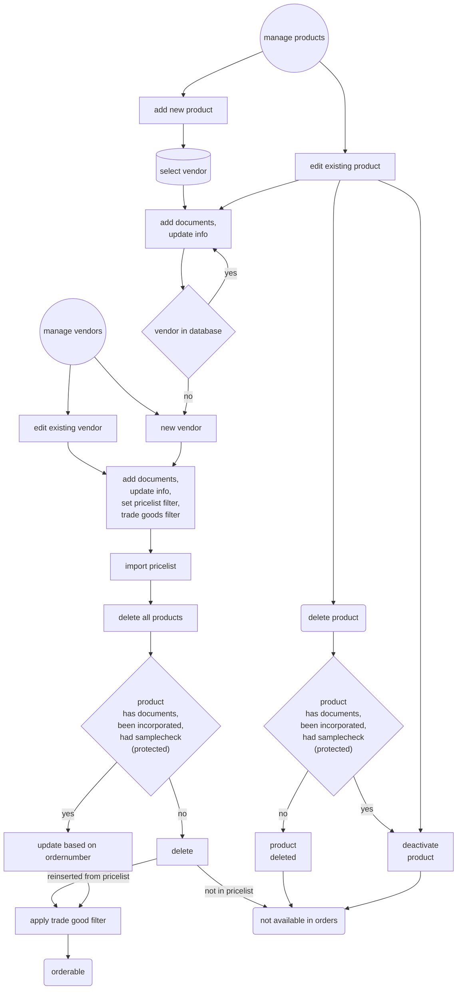
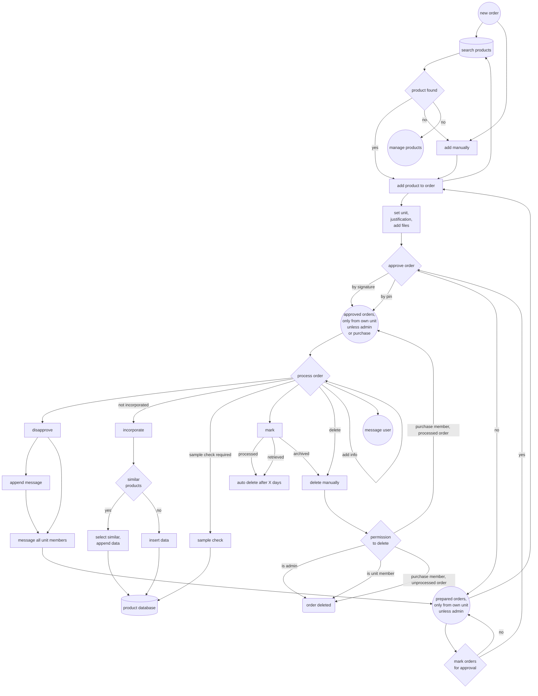
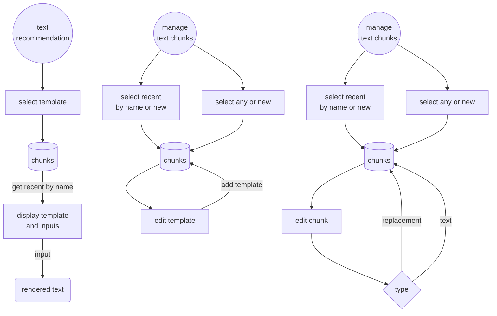
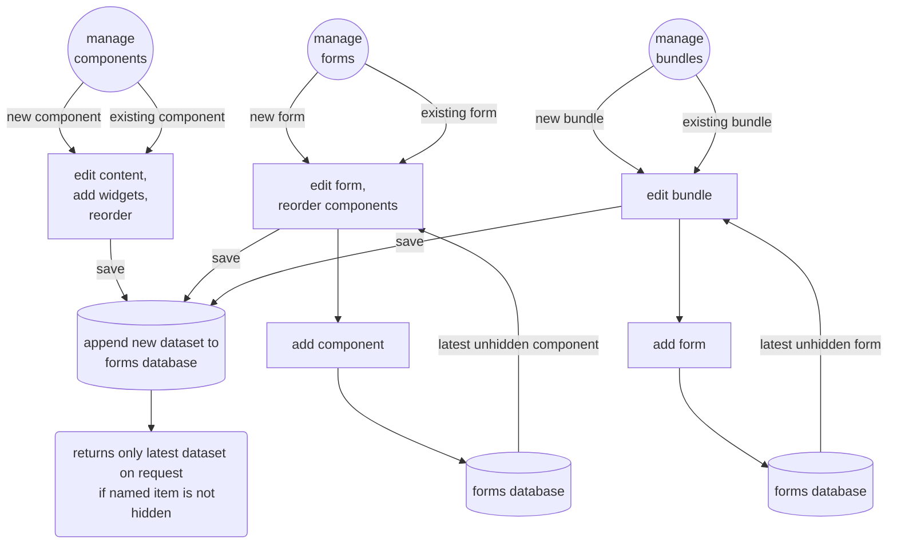
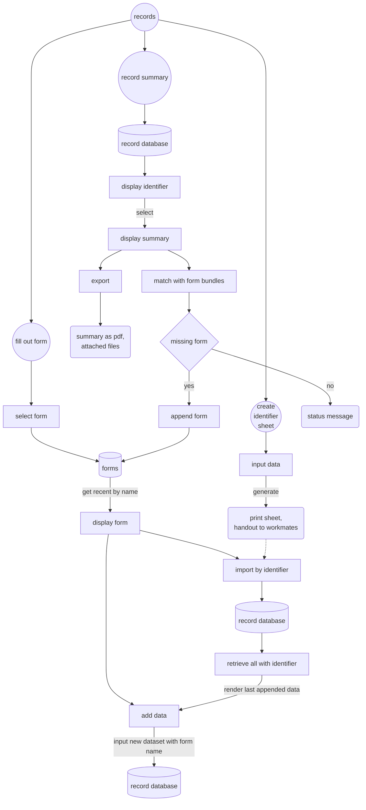

# CARO - Cloud Assisted Record and Operation

## Content
* [Aims](#Aims)
    * [Intended ISO 13485 goals](#intended-iso-13485-goals)
* [Application flow for current modules](#application-flow-for-current-modules)
    * [Vendor and product management](#vendor-and-product-management)
    * [Order](#order)
    * [Users](#users)
    * [Text recommendations](#text-recommendations)
    * [Forms](#forms)
    * [Records](#records)
* [Prerequisites](#prerequisites)
* [Installation](#installation)
* [Ressources](#ressources)


# open tasks

#### todo application
* refactor languagefile

#### todo forms
* import data from other cases, warn about identifier!
* view other forms as modal (e.g. instructions)
* suggest next form? (load with identify)

#### todo purchase
* batch identifier (product and delivery note number) for ordered items
* vendor address, email, phone, customer id
* vendor list
* vendor mailto (certificates)
* vendor evaluation

#### todo records
* monitoring measuring equipment, rental parts, machinery, crutches, software validation
* purchase: batch identifier (product and delivery note number) for...
* material tracing within documentation
* mark as finished to hide in overwiew

#### todo audit
* checklist regulatory issues

#### todo misc
* user selectable color themes?
* calendar and alerts
* md mermaid flowcharts
* application manual
    * general manual
    * iso 13485 checklist and how the application handles these
    * csvprocessor
* improved landing page
* message ordering and categorizing, displaying left and right
* risk management?
* database export


## Aims
This software aims to support you with your ISO 13485 quality management system and support internal communication. It is supposed to run as a web application on a server. Data safety measures are designed to be used in a closed network environment, although it could be run on any webserver. The architecture enables staff to access and append data where other ERP-software may be limited due to licensing.

Data gathering is supposed to be completely digital and finally wants to get rid of paper based documentation. There may be other pieces of software with a similar goal but many of them come from another direction - managing rehabilitation devices instead of custom-made products, focussing on custom orthopaedic footwear, tracing productivity - instead of the primary record aspect of the CARO App. Let alone cumbersome UI of some programs which has also led to a goal of being easy to use and recognizable.

### Intended ISO 13485 goals
* ISO 13485 4.2.3 Medical device file
    * All form data for case documentation accumulates. Any export does contain this data, thus achieves a complete documentation of measures.
    * Case documentation form require a case identifier to ensure respective data is allocated correctly.
* ISO 13485 4.2.4 Document control
    * The application enables you to design reusable form components and forms.
    * Only the most recent approved components and forms are accessible for use.
    * Creation of new components, forms, form bundles, text chunks and text templates is permitted to admin, ceo and quality management officers only.
    * Form components and forms need to be approved by a unit supervisor, quality management officer and ceo. Respective user groups will be alerted by system message on saving of a new element. All supervisors can approve though, assuming they know what they're doing. Any assignment to organizational units would overcomplicate things regarding reuse of elements by multiple units. Unapproved components do not show up even if the form is approved.
    * New Components, forms, form bundles, text chunks and text templates are appended to the database as a new entry. Each entry will have a timestamp and the saving user name. Within the respective managers the standard selection will access the most recent approved version. The advanced selection will access any existing version. Components and forms can not be deleted after being approved. Unapproved components and forms are not accessible for use.
    * Images for form components will not be deleted after component approvement. They are assigned the components name and timestamp of submission to the filename. They are always accessible on accessing a former version. They can not be reused and are part of the component.
    * Forms can be exported blank by elevated users including supervisors to limit distribution of outdated versions.
* ISO 13485 4.2.5 Record control
    * All form data accumulates and is not deleteable from the application. Each entry will have a timestamp and the saving user name. Summaries gather all distinct entries and display them in order of submission.
    * Images and files for records will not be deleted. They are assigned the identifier and timestamp of submission to the filename.
    * Records can be exported at any time if you want to have another audit safe storage solution or have to share it with a service provider.
    * Accessing any content from the application including confidential personal information of customers requires a personal login from registered users.
* ISO 13485 5.5.1 Responsibility and authority
    * Users are assigned special permissions that limit access and unclutter menu items
    * Users can be assigned a pin to approve orders
* ISO 13485 5.5.3 Internal communication
    * The application has a built in messenger. This messenger is being made use of internal modules to ensure decent data distribution e.g.
        * alerting user groups for approving new form components and forms
        * alerting user groups about disapproved orders
        * messaging inquiries to ordering users
    * The application has an ordering module. Orders can be prepared and approved. Purchase will have all necessary data to handle the order request and can mark the order as processed thus giving immediate feedback to the ordering person.
* ISO 13485 6.2 Human resources
    * Users can be attached documents. Intended usecase is attachment of qualification certificates. A list of these documents can be viewed within the audit module.
* ISO 13485 7.4.1 Procurement process
    * Procurement is guided through the application. Vendors and products can be added into the database.
        * Vendor data can be enriched with documents, certificates and certificate validity dates. Latter can be dispayed and exported within the audit module. Vendors can be disabled but not deleted. Products of disabled vendors are not available in the order module.
        * Products can be enriched with documents that will not be deleted. They are assigned the vendors name, a timestamp of submission and the products article number.
        * Products are supposed to be incorporated. Incorporation can be granted, denied and - through product management - revoked. All inputs will result in an entry to the respective audit check list. Incorporation information is to be enriched through a dedicated form with the respective context.
        * Products are deleted by default on update of the pricelist unless
            * an incorporation has been made
            * a sample check has been made
            * any document to the product has been provided
        * Vendor and product editing is permitted by elevated users including purchase only.
* ISO 13485 7.4.3 Verification of procured products
    * MDR §14 sample check will ask for a check for every vendors [product that qualifies as trading good](#sample-check) if the last check for any product of this vendor exceeds the mdr14_sample_interval timespan set in setup.ini, so e.g. once a year per vendor by default. This applies for all products that have not been checked within mdr14_sample_reusable timespan.
    * Sample check information is to be enriched through a dedicated form with the respective context.
* ISO 13485 7.5.1 Control of production and service
    * Dedicated forms are supposed to record any step within production. By accessing the most recent record the current state is visible. If e.g. you have a record for a given fabrication process where you define steps, you can add a checkbox for fulfillment. One step is defining the steps, storing these to the record and signalize the actual fabrication is required. The next step could be to reuse the form, ticking the checkbox, adding this content with username and date to the record.
    * Form contexts allow the definition as process or work instructions.
* ISO 13485 7.5.8 Product indentification
    * Records partially relay on an identifier. This identifier is currently implemented as a QR-code that can be exported, printed and read with the integrated scanner. Sticky Identifier labels can be used to mark any components of a product during production.
* ISO 13485 7.6 Surveillance and measuring equipment control
    * --- yet to be implemented ---
* ISO 13485 8.2.4 Internal audit
    * The audit module aquires data from the application and is partially able to export
        * records of product incorporation. If currently ordered products miss an incorporation there will be a note.
        * records of MDR §14 sample checks. If currently vendors are overdue for a check there will be a note.
        * a list of current documents in use (forms and their components)
        * user files (e.g. certificates)
        * vendor lists with last article update, last MDR sample check and details for certificates (if provided)

### Limitations
Beside a few architectural decisions the app is not a preset quality management system. Define your processes and documents on your own. The application is supposed to help you with a structured flow and semiautomated fulfilment of regulatory issues.

The application does not replace an ERP system. Procurement data is solely accessible within the application based on its own database. This is a concious decision for overwhelming product databases that are not maintainable in reality. The products database is supposed to be populated with vendors pricelists and sanitized from any unimportant data on a regular basis. 

## Application flow for current modules

### Vendor and product management


[Content](#Content)


### Order


[Content](#Content)


### Users


[Content](#Content)


### Text recommendations


[Content](#Content)


### Forms


[Content](#Content)


### Records


[Content](#Content)

## Prerequisites
* php >= 8
* mysql or sql server (or some other database, but queries may have to be adjusted. as i chose pdo as database connectivity i hope this is possible)
* ssl (camera access for qr-scanner and serviceworkers don't work otherwise)
* vendor pricelists as csv-files [see details](#importing-vendor-pricelists)

tested server environments:
* apache [uniform server zero XV](https://uniformserver.com) with php 8.2, mysql 8.0.31
* microsoft iis with sql express (sql server 22)

tested devices:
* desktop pc win10 edge-browser
* notebook win11 firefox-browser
* smartphone android12 firefox-browser

[Content](#Content)

## Installation
* php.ini memory_limit ~2048M for processing of large csv-files, disable open_basedir at least for local iis for file handlers
* php.ini upload_max_filesize & post_max_size / applicationhost.config | web.config for iis according to your expected filesize for e.g. sharepoint- and csv-files ~128MB
* php.ini max_execution_time / fastCGI timeout (iis) ~ 300 for csv processing may take a while depending on your data amount
* php.ini enable extensions:
    * gd
    * gettext
    * mbstring
    * exif
    * pdo_odbc
    * zip
    * php_pdo_sqlsrv_82_nts_x64.dll (sqlsrv)
* my.ini (MySQL) max_allowed_packet = 100M / [SQL SERVER](https://learn.microsoft.com/en-us/sql/database-engine/configure-windows/configure-the-network-packet-size-server-configuration-option?view=sql-server-ver16) 32767
* manually set mime type for site-webmanifest as application/manifest+json for iis servers
* set up api/setup.ini, especially the used sql subset and its credentials, packagesize in byte according to sql-configuration
* run api/install.php, you will be redirected to the frontpage afterwards - no worries, in case of a rerun nothing will happen

[Content](#Content)

## System usecases and limitations

### setup
* setting the package size for the sql environment to a higher value than default is useful beside the packagesize within setup.ini. batch-queries are supposed to be split in chunks, but single queries with occasionally base64 encoded images might exceed the default limit

### system limitations
* notifications on new messages are as reliable as the timespan of a service-woker. which is short. therefore there will be an periodic fetch request with a tiny payload to wake it up once in a while - at least as long as the app is opened. there will be no implementation of push api to avoid third party usage and for lack of safari support
* the application caches requests. get requests return the latest version, which might not always be the recent system state but better than nothing. POST, PUT and DELETE requests however are stored within an indexedDB and executed once a successful GET request indicates reconnection to the server. this might lead to a delay but is better than nothing. however note that this only is reliable if the browser does not delete session content on closing. this is not a matter of the app but your system environment. you may have to contact your it department.
* cached post requests may insert the user name and entry date on processing. that is the logged in user on, and time of processing on the server side.
* changing the database structure during runtime may be a pita using sqlsrv for default preventing changes to the db structure (https://learn.microsoft.com/en-us/troubleshoot/sql/ssms/error-when-you-save-table). adding columns to the end appears to be easier instad of insertions between.

### useage notes and caveats
* dragging form elements for reordering within the form-editors doesn't work on handhelds because touch-events do not include this function. constructing form components and forms will need devices with mice or a supported pointer to avoid bloating scripts. reordered images will disappear but don't worry.
* orders can be deleted by administrative users and requesting unit members at any time. this module is for operational communication only, not for persistent documentation purpose. it is not supposed to replace your erp!
* the manual is intentionally editable to accomodate it to users comprehension.
* product documents are displayed in accordance with their article number, but with a bit of fuzziness to provide information for similar products (e.g. different sizes). it is possible to have documents displayed that do not really match the product. 

### importing vendor pricelists
vendor pricelists must have an easy structure to be importable. it may need additional off-app customizing available data to have input files like:

| Article Number | Article Name | EAN         | Sales Unit |
| :------------- | :----------- | :---------- | :--------- |
| 1234           | Shirt        | 90879087    | Piece      |
| 2345           | Trousers     | 23459907    | Package    |
| 3456           | Socks        | 90897345    | Pair       |

while setting up a vendor an import rule must be defined like:
```js
{
    "filesettings": {
        "headerrowindex": 0,
        "dialect": {
            "separator": ";",
            "enclosure": "\"",
            "escape": ""
        },
        "columns": [
            "Article Number",
            "Article Name",
            "EAN",
            "Sales Unit"
        ]
    },
    "modify": {
        "rewrite": {
            "article_no": ["Article Number"],
            "article_name": ["Article Name"],
            "article_ean": ["EAN"],
            "article_unit": ["Sales Unit"]
        }
    }
}
```
*headerrowindex* and *dialect* are added with a default value from setup.ini if left out.

### sample check
to detect trading goods for the MDR §14 sample check add a respective filter like:
```js
{
	"filesetting": {
		"columns": ["article_no", "article_name"]
	},
	"filter": [
		{
			"apply": "filter_by_expression",
			"comment": "delete unnecessary products",
			"keep": false, //or true
			"match": {
				"all": {
					"article_name": "ANY REGEX PATTERN THAT MIGHT MATCH ARTICLE NAMES THAT QUALIFY AS TRADING GOOD (OR DON'T IN ACCORDANCE TO keep-FLAG)"
				}
			}
		}
	]
}
```
without a filter none of the vendors products will be treated as a trading good!

[Content](#Content)

## Ressources
### external libraries
* https://github.com/mebjas/html5-qrcode
* https://github.com/szimek/signature_pad
* https://github.com/nimiq/qr-creator
* https://github.com/lindell/JsBarcode/
* https://github.com/omrips/viewstl
* https://github.com/mk-j/PHP_XLSXWriter
* https://github.com/tecnickcom/TCPDF

### kudos on additional help on
* [restful api](https://www.9lessons.info/2012/05/create-restful-services-api-in-php.html)
* [put request with multipart form data](https://stackoverflow.com/a/18678678)
* [webmanifest for iis](https://stackoverflow.com/questions/49566446/how-can-i-have-iis-properly-serve-webmanifest-files-on-my-web-site)
* [webworker caching](https://developer.chrome.com/docs/workbox/caching-strategies-overview)
* [indexedDB](https://github.com/jakearchibald/idb)
* [custom md pdf](https://marketplace.visualstudio.com/items?itemName=yzane.markdown-pdf)
* [mermaid charts](https://mermaid.js.org/)

[Content](#Content)

