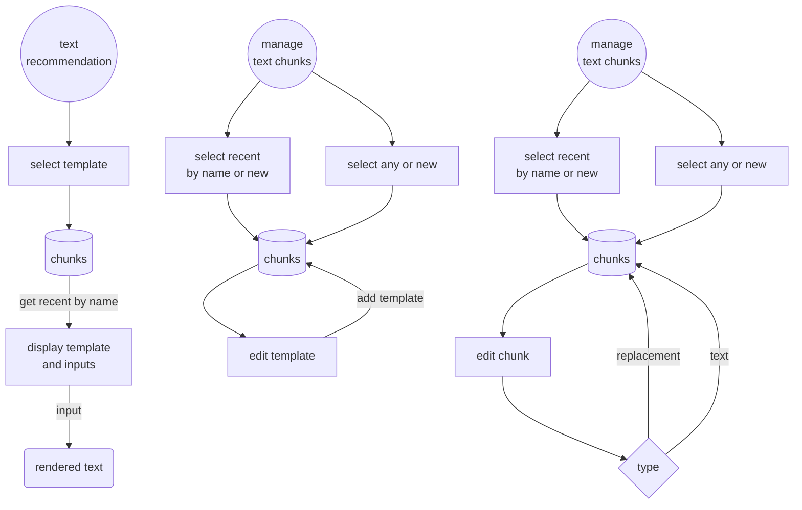
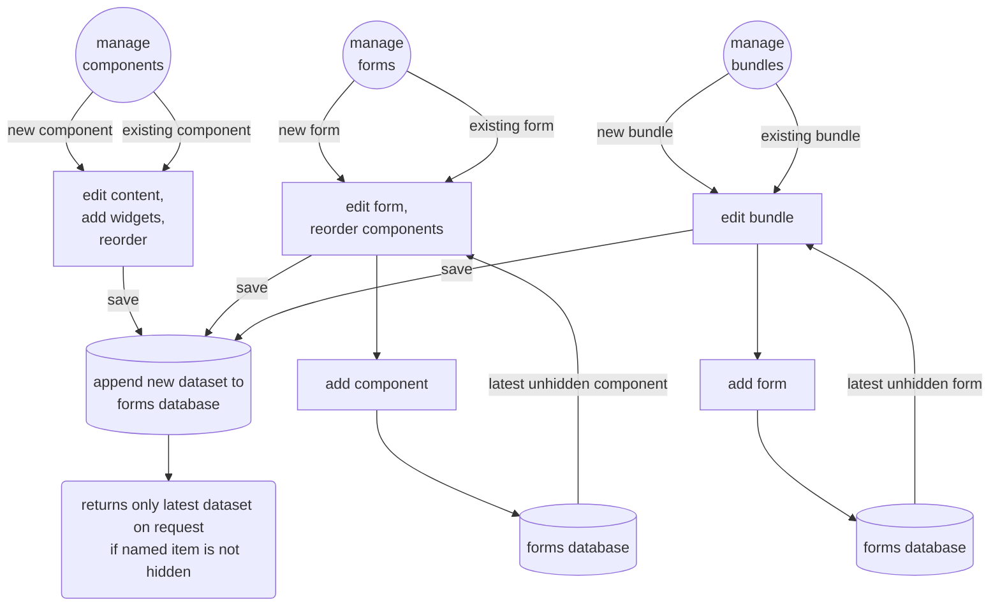
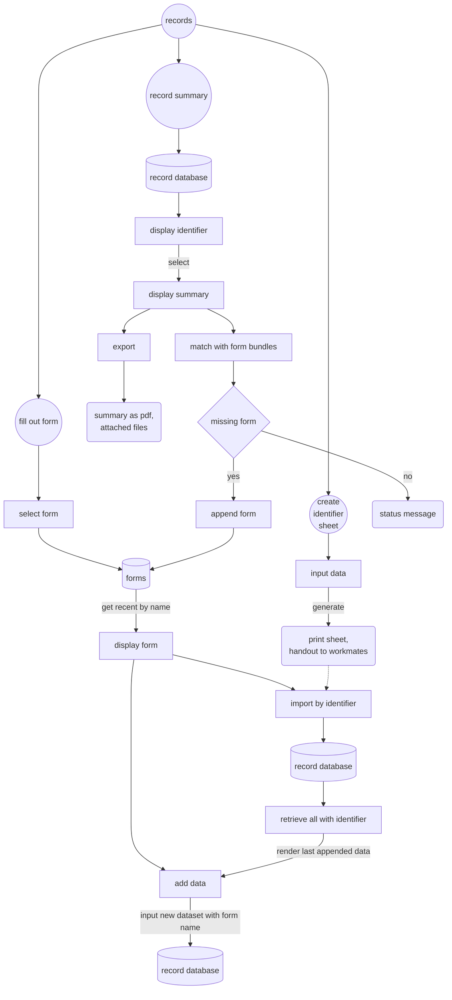
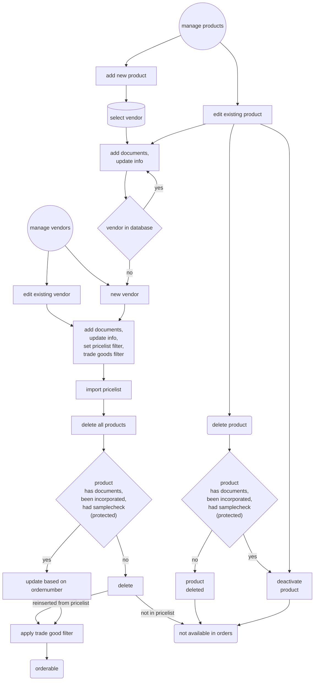
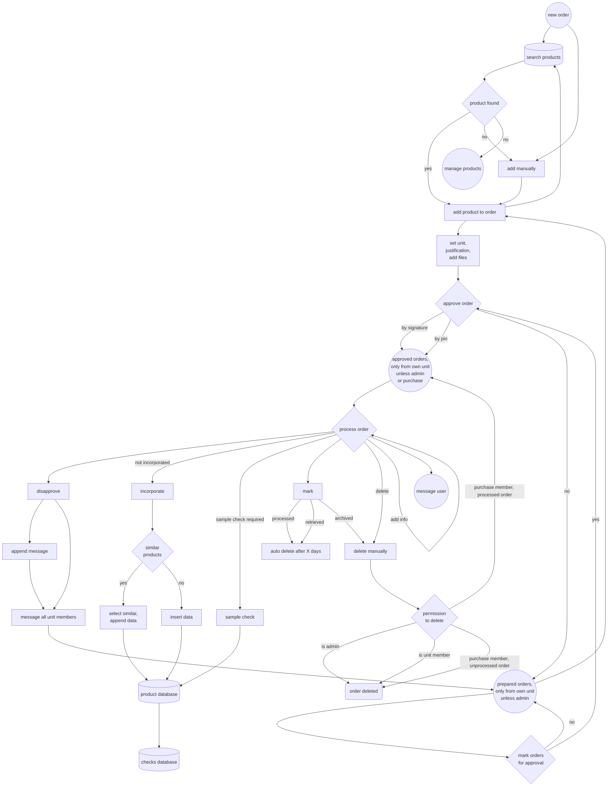

# CARO - Cloud Assisted Record and Operation

## Content
* [Aims](#Aims)
    * [Intended ISO 13485 goals](#intended-iso-13485-goals)
    * [Necessary infrastructure](#necessary-infrastructure)
    * [What it is not](#what-it-is-not)
    * [Data integrity](#data-integrity)
    * [User management](#user-management)
* [Modules](#modules)
    * [Users](#users)
    * [Text recommendations](#text-recommendations)
    * [Forms](#forms)
    * [Records](#records)
    * [Vendor and product management](#vendor-and-product-management)
    * [Order](#order)
    * [Tools](#tools)
* [CSV processor](#csv-processor)
* [Prerequisites](#prerequisites)
    * [Installation](#installation)
    * [Runtime variables](#runtime-variables)
    * [Useage notes and caveats](#useage-notes-and-caveats)
    * [Customisation](#customisation)
    * [Importing vendor pricelists](#importing-vendor-pricelists)
    * [Sample check](#sample-check)
* [Ressources](#ressources)


# open tasks

#### todo application
* ux tabs?
* refactor languagefile
* hash sum check for data completeness?

#### todo forms
* import data from other cases, warn about identifier!
* view other forms as modal (e.g. instructions)
* suggest next form? (load with identify)

#### todo purchase

* order only assigned units selecteable?

* batch identifier (product and delivery note number) for ordered items
* vendor address, email, phone, customer id
* vendor list
* vendor mailto (certificates)
* vendor evaluation

#### todo planning
* weekly schedule planning
* list / reminder for unfinished cases, current state

#### todo records
* export option for most recent data only for insurance companies w/o author and date
* export option for distinct form
* linked files on separate external path
* monitoring measuring equipment, rental parts, machinery, crutches, software validation
* purchase: batch identifier (product and delivery note number) for...
* material tracing within documentation
* mark as finished to hide in overwiew

#### todo audit
* checklist regulatory issues

#### todo misc
* user selectable color themes?
* calendar and alerts
* improved landing page
* message ordering and categorizing, displaying left and right
* risk management?


## Aims
This software aims to support you with your ISO 13485 quality management system and support internal communication. It is supposed to run as a web application on a server. Data safety measures are designed to be used in a closed network environment, although it could be run on any webserver. The architecture enables staff to access and append data where other ERP-software may be limited due to licensing.

Data gathering is supposed to be completely digital and finally wants to get rid of paper based documentation. There may be other pieces of software with a similar goal but many of them come from another direction - managing rehabilitation devices instead of custom-made products, focussing on custom orthopaedic footwear, tracing productivity - instead of the primary record aspect of the CARO App. Let alone cumbersome UI of some programs which has also led to a goal of being easy to use and recognizable.

### Intended ISO 13485 goals
* ISO 13485 4.2.3 Medical device file
    * All form data for case documentation accumulates. Any export does contain this data, thus achieves a complete documentation of measures.
    * Case documentation form require a case identifier to ensure respective data is allocated correctly.
    * also see [records](#records)
* ISO 13485 4.2.4 Document control
    * The application enables you to design reusable form components and forms.
    * Only the most recent approved components and forms are accessible for use [as long as there is a network connection](#network-connection-handling).
    * Creation of new components, forms, form bundles, text chunks and text templates is permitted to admin, ceo and quality management officers only.
    * Form components and forms need to be [approved by](#user-management) a unit supervisor, quality management officer and ceo. Respective user groups will be alerted by system message on saving of a new element. All supervisors can approve though, assuming they know what they're doing. Any assignment to organizational units would overcomplicate things regarding reuse of elements by multiple units. Unapproved components do not show up even if the form is approved.
    * New Components, forms, form bundles, text chunks and text templates are appended to the database as a new entry. Each entry will have a timestamp and the saving user name. Within the respective managers the standard selection will access the most recent approved version. The advanced selection will access any existing version. Components and forms can not be deleted after being approved. Unapproved components and forms are not accessible for use.
    * Images for form components will not be deleted after component approvement. They are assigned the components name and timestamp of submission to the filename. They are always accessible on accessing a former version. They can not be reused and are part of the component.
    * Forms can be exported blank by elevated users including supervisors to limit distribution of outdated versions.
    * also see [forms](#forms)
* ISO 13485 4.2.5 Record control
    * All form data accumulates and is not deleteable from the application. Each entry will have a timestamp and the saving user name. Summaries gather all distinct entries and display them in order of submission.
    * Images and files for records will not be deleted. They are assigned the identifier and timestamp of submission to the filename.
    * Records can be exported at any time if you want to have another audit safe storage solution or have to share it with a service provider.
    * Accessing any content from the application including confidential personal information of customers requires a personal login from registered users.
    * also see [user management](#user-management), [records](#records)
* ISO 13485 5.5.1 Responsibility and authority
    * Users are assigned [special permissions](#user-management) that limit access and unclutter menu items
    * Users can be assigned a pin to approve orders
    * also see [user management](#user-management)
* ISO 13485 5.5.3 Internal communication
    * The application has a built in messenger. This messenger is being made use of internal modules to ensure decent data distribution e.g.
        * alerting user groups for approving new form components and forms
        * alerting user groups about disapproved orders
        * messaging inquiries to ordering users
    * The application has an ordering module. Orders can be prepared and approved. Purchase will have all necessary data to handle the order request and can mark the order as processed thus giving immediate feedback to the ordering person.
    * also see [order](#order)
* ISO 13485 6.2 Human resources
    * Users can be attached documents. Intended use case is attachment of qualification certificates. A list of these documents can be viewed within the audit module.
    * also see [users](#users), [tools](#tools)
* ISO 13485 7.4.1 Procurement process
    * Procurement is guided through the application. Vendors and products can be added into the database.
    * Vendor data can be enriched with documents, certificates and certificate validity dates. Latter can be dispayed and exported within the audit module. Vendors can be disabled but not deleted. Products of disabled vendors are not available in the order module.
    * Products can be enriched with documents that will not be deleted. They are assigned the vendors name, a timestamp of submission and the products article number.
    * Products are supposed to be incorporated. Incorporation can be granted, denied and - through product management - revoked. All inputs will result in an entry to the respective audit check list. Incorporation information is to be enriched through a dedicated form with the respective context.
    * Products are deleted by default on update of the pricelist unless
        * an incorporation has been made
        * a sample check has been made
        * any document to the product has been provided
    * Vendor and product editing is permitted by elevated users including purchase only.
    * also see [vendor and product management](#vendor-and-product-management), [order](#order)
* ISO 13485 7.4.3 Verification of procured products
    * MDR §14 sample check will ask for a check for every vendors [product that qualifies as trading good](#sample-check) if the last check for any product of this vendor exceeds the mdr14_sample_interval timespan set in setup.ini, so e.g. once a year per vendor by default. This applies for all products that have not been checked within mdr14_sample_reusable timespan.
    * Sample check information is to be enriched through a dedicated form with the respective context.
    * also see [vendor and product management](#vendor-and-product-management), [order](#order)
* ISO 13485 7.5.1 Control of production and service
    * Dedicated forms are supposed to record any step within production. By accessing the most recent record the current state is visible. If e.g. you have a record for a given fabrication process where you define steps, you can add a checkbox for fulfillment. One step is defining the steps, storing these to the record and signalize the actual fabrication is required. The next step could be to reuse the form, ticking the checkbox, adding this content with username and date to the record.
    * Form contexts allow the definition as process or work instructions.
    * also see [forms](#forms), [records](#records)
* ISO 13485 7.5.8 Product indentification
    * Records partially relay on an identifier. This identifier is currently implemented as a QR-code that can be exported, printed and read with the integrated scanner. Sticky Identifier labels can be used to mark any components of a product during production.
    * also see [records](#records)
* ISO 13485 7.6 Surveillance and measuring equipment control
    * --- yet to be implemented ---
* ISO 13485 8.2.4 Internal audit
    * The audit module aquires data from the application and is partially able to export
        * records of product incorporation. If currently ordered products miss an incorporation there will be a note.
        * records of MDR §14 sample checks. If currently vendors are overdue for a check there will be a note.
        * a list of current documents in use (forms and their components)
        * user files (e.g. certificates)
        * vendor lists with last article update, last MDR sample check and details for certificates (if provided)
    * also see [tools](#tools)

[Content](#Content)

### Necessary infrastructure 
You'll need a server to host the web application and network access for all terminal devices. The application is designed for mobile first e.g. Android tablets or iPads, but can be used on desktop computers as well. In fact some of the features are usable on desktop only (form creation and text templates).

Main goal is a distribution of mobile devices to the whole staff or at least key positions and workspaces. Scanning devices are optional but all scanning could be achieved with inbuilt cameras as well.

For technical details see [prerequisites](#prerequisites). 

### What it is not
Beside a few architectural decisions the app is not a preset quality management system. You're still in control of your contents. Define your processes and documents for yourself. The application is solely supposed to help you with a structured flow and semiautomated fulfilment of regulatory issues.

The application does not replace an ERP system. Procurement data is solely accessible within the application based on its own database. This is a concious decision against overwhelming ERP product databases that are not maintainable in reality and more often than not require a proprietary interface. The products database is supposed to be populated with vendors pricelists and sanitized from any unimportant data on a regular basis.

Orders can be deleted by administrative users and requesting unit members at any time. This module is for operational communication only, not for persistent documentation purpose.

### Data integrity
As records intend to save the submitting users name, group accounts are unreasonable. Instead every user is supposed to have their own account. Administration, CEO and quality management officers can create, edit and delete users. To make things as easy as possible a unique 64 byte token has to be created. This token will be converted into an QR code that is scannable on login. This avoids remembering passwords and user names, as well as the need of typing in several pieces of information. The process is quite quick and enables session switching on limited access to terminal devices.

Form data and requests occasionally contain ids to access distinct contents. Technically it is possible to compromise requests but still considered reasonable giving any verification on the server side can hardly guess the original intent. It appears not less secure than intentionally providing false data on any paper based documentation.

Forms can contain a digital signature pad. Please note this is not legally document proof for lacking certification. You can define where this might be suitable for your processes enough.

[Content](#Content)

### User management
The application provides some options for registered users. The whole content is only accessible on login. Users can have different permissions:
* User
    * has access to all non writeable content
    * can access forms and add records
    * can contribute to open sharepoint
    * can place orders
    * can only see orders for own assigned organizational unit
    * can incorporate and sample check articles
* Group
    * has access to all non writeable content
    * can not add records due to limited identification data
    * can contribute to open sharepoint
    * can place orders, will be prompted to identify themself
    * can only see orders for own assigned organizational unit
    * can not incorporate and sample check due to limited identification data
* Supervisor
    * can approve form components and forms
* Office
    * can contribute to file manager 
* Purchase
    * has full access to vendor and product management
    * can see all orders
* Purchase assistant
    * has limited access to product management, can modify alias
* Quality management officer
    * can approve form components and forms
    * can add CSV filters
    * can manage users
* CEO
    * can approve components and forms
    * can add CSV filters
    * can manage users
* Application admin
    * full access
    * default user CARO App has this permission. Use it to implement new users. Change default token immidiately and store it in a safe place!

Permissions of QMO and CEO do hardly differ, but are neccessary being assigned to have a reliable alert on submission of a new form

Users can have multiple assigned organizational units.

On registering a new user a default profile picture is generated. Custom set pictures can not be deleted.

Adding files is granted to elevated users only, to make sure certificates are acknowledged.

[Content](#Content)

## Modules

### Users
Beside [permission settings](#user-management) users can have multiple assigned organizational units. On registering a new user a default profile picture is generated. Custom set pictures can not be deleted. Adding files is granted to elevated users only, to make sure certificates are acknowledged. A generated order authorization pin can be used to approve orders. The generated access token can be exported and e.g. used as a laminated card.

Users can see their information in the profile section for transparency reasons. They can modify their profile picture and set individual application settings


[Content](#Content)

### Text recommendations
To avoid unneccesary or repetitive poetry and support a unique linguistic style text recommendations can be provided. These are assembled with predefined text chunks for either replacements that handle pronouns or generic text chunks. Latter can make use of former. Currently a german language model is implemented where replacements are defined as chunks of
* Child female - the girl
* Child male - the boy
* Child genderless - the child
* Adult female - the woman
* Adult male - the man
* Adult genderless - the person
* Informal you - "buddy"
* Formal you - "your honor" (this is the german model part where there is more than just "you")
such a replacement may be named addressee. If a generic text chunk contains :adresseee this will be replaced with the chosen genus from a selection list. If you intend to write a text for the insurance company you may talk about the patient and select a genus from the first four options, if you address the customer directly you may choose one of the last two depending on your individual distance. A selection of the desired genus will be rendered on the creation form and reused for all types of replacements.

On creating a text you can make use of predefined replacements that may contain the grammatical case (e.g. *:addresseeNomative*, *:addresseeAccusative*, *:addresseeDative*, etc.). Undefined placeholders will be rendered to an input field where it can be typed in and used repeatedly:
*"Today we inform you about *

*"We write to inform you about :addresseeAccusative, :name. We just want to tell you :name is doing fine. :addresseeNomative can make use of the aid."*

Text templates arrange generic text chunks. Arrange or group chunks within the [drag and drop editor](#miscellaneous). Chunks can always be unselected to customize to the actual use case. Grouping chunks enhances the perception of the creation form.

Output wil be copied to clipboad on clicking or tapping the output field.



[Content](#Content)

### Forms
To create tracked and versioned forms and documents create reusable form components and assemble forms from components. Components and forms have to be approved by a supervisor, CEO and QMO to take effect. Furthermore forms can be grouped to form bundles. This way anyone can check, if all neccessary forms have been taken into account for defined use cases.

An approvement request is delivered by the applications messenger to users with CEO and QMO permission as well as supervisor permission for the defined organizational unit.

Components can be rearranged via [drag and drop editor](#miscellaneous). Forms can have alternative search terms. A context must be provided to ensure a plausibility check for occasionally neccessary elements. A regulatory context is optional but recommended. Approvement requests are delivered same way as for components.

The respective manager provides a selection for recent approved elements as well as a selection for all entries within the database.

Forms can be exported as an editable PDF in hopefully rare scenarios where a digital record is somehow an issue. Upload-options are dropped by default though. Permission to export is restricted to elevated users to prevent distribution of outdated versions and support a improved data collecting within the application. It is recommended to transfer the data later or at least append the file to the applicable record.



[Content](#Content)

### Records
Records store all inputs for any selected form. Some form contexts require an identifier that groups records to a summary. Summaries contain all inputs in chronological order and can be exported.

The identifier is always a QR-code with additional readable content that will appear on any export of identifiable records. To improve workflow identifier labels can be generated to mark product components, exported forms, etc. By scanning the QR-code errors and mix-ups are unlikely. The identifier can also be used to import data from other records in case of comprehensive cases in different organizational units.

Checking for completeness of form bundles can be applied on display of a record summary.



[Content](#Content)

### Files
Admin, CEO, QMO and office can provide files for everyone to access. Also all users can contribute to the open sharepoint where files have a limited timespan and are deleted after a while by default.

Both cloud storages equip the [tools STL-Viewer](#tools) with sources to display.

This source can also be used to provide documents that are [unsuitable to be filled out digitally](#data-integrity) and have to be used by everyone, without permission to export too.

[Content](#Content)

### Vendor and product management
Order operations rely on a vendor and product database. Also this is related to incorporation and sample checks of products, document and certification handling. Admin, CEO, QMO and purchase can manage these categories, add and edit vendors and products, import pricelists, define filters for trading goods, or disable vendors and products. Importing pricelists and trading good filters make use of the [CSV processor](#csv-processor).

Disabled products are not accessible through the order module. Products can be deleted as long as they are not marked as protected. Vendors are not deleteable.

The special permission of *purchase assistant* can edit the alias definition of products to disburden purchase and enhance identification of products with company customs. 



[Content](#Content)

### Order
The order module helps all parties. Purchase is supposed to get structured and complete data for placed orders and ordering units get information about the order state.
Ordered products identify themself as incorporated or not or whether they are qualified for a necessary sample check. Both can be done from the list of ordered products, during operations and without being mixed-up.

Orders may have to be approved; pending approvals sum up and can be batch approved by users with an order authentification pin or elevated users including supervisors.

Approved orders can be marked as *ordered*, *received* and *archived* with only the last not being deleted by default after a set timespan. Also purchase can disapprove an order for any suitable reason. In this case a message can be appended and all users of the assigned organizational unit will be informed about the lack of order processing.



[Content](#Content)

### Tools
Some generic tools are available to read and create 2D-barcodes, view STL-files (e.g. for communication of a CAD-unit with another manufacturing unit).

Also a CSV-Filter and its manager are sorted here. The CSV-filter processes respective filetypes using the [CSV processor](#csv-processor) and can be used for any kind of list matching. The filter is accessible by admin, ceo, qmo and office.

The audit module gathers data from the application in regards of proofing lists for fulfilment of regulatory requirements.

[Content](#Content)

## CSV processor

The CSV Processor is implemented within the CSV filter module as well as importing products via pricelist and marking them as trading good. It is a versatile tool but needs an understanding of [JavaScript object notation](https://developer.mozilla.org/en-US/docs/Learn/JavaScript/Objects/JSON) and [regular expression pattern matching](https://regex101.com/).

Filters and modifications are processed in order of appearance. Modifications take place with the filtered list only for performance reasons. Compare lists can be filtered and manipulated likewise. Due to recursive implementation the origin list can be used as a filter by itself.

Description of options:

	"postProcessing": Optional string as hint what to do with the result file
	"filesetting":
		"source": File to process, SELF or a named array (the other filesettings don't matter then)
		"headerrowindex": Offset for title row
		"dialect": Settings according to php fgetcsv
		"columns": list/array of column names to process and export to destination
		"encoding": Comma separated string of possible character encoding of sourcefile

	"filter": List/array of objects/dicts
		"apply": "filter_by_expression"
		"comment": Description, will be displayed
		"keep": Boolean if matches are kept or omitted
		"match":
			"all": All expressions have to be matched, object/dict with column-name-key, and pattern as value
			"any": At least one expression has to be matched, it's either "all" or "any"

		"apply": "filter_by_monthdiff"
		"comment": Description, will be displayed
		"keep": Boolean if matches are kept or omitted
		"date": Filter by identifier and date diff in months
			"identifier": Column name with recurring values, e.g. customer id
			"column": Column name with date to process,
			"format": List/array of date format order e.g. ["d", "m", "y"],
			"threshold": Integer for months,
			"bias": < less than, > greater than threshold

		"apply": "filter_by_duplicates",
		"comment": Description, will be displayed
		"keep": Boolean if matches are kept or omitted
		"duplicates": Keep amount of duplicates of column value, ordered by another concatenated column values (asc/desc)
			"orderby": List/array of column names whose values concatenate for comparison
			"descending": Boolean,
			"column": Column name with recurring values, e.g. customer id of which duplicates are allowed
			"amount": Integer > 0

		"apply": "filter_by_comparison_file",
		"comment": Description, will be displayed
		"keep": Boolean if matches are kept or omitted
		"compare": Keep or discard explicit excemptions as stated in excemption file, based on same identifier
			"filesetting": Same structure as base. if source == "SELF" the origin file will be processed
			"filter": Same structure as base
			"modify": Same structure as base
			"match":
				"all": Dict with one or multiple "ORIGININDEX": "COMPAREFILEINDEX", kept if all match
				"any": Dict with one or multiple "ORIGININDEX": "COMPAREFILEINDEX", kept if at least one matches
		"transfer": Add a new column with comparison value

		"apply": "filter_by_monthinterval",
		"comment": Description, will be displayed
		"keep": Boolean if matches are kept or omitted
		"interval": Discard by not matching interval in months, optional offset from initial column value
			"column": Column name with date to process,
			"format": List/array of date format order e.g. ["d", "m", "y"],
			"interval": Integer for months,
			"offset": Optional offset in months

		"apply": "filter_by_rand",
		"comment": Description, will be displayed
		"keep": boolean if matches are kept or omitted
		"data": Select amount of random rows that match given content of asserted column (if multiple, all must be found)
			"columns": Object/dict of COLUMN-REGEX-pairs to select from,
			"amount": Integer > 0

	"modify": Modifies the result
		"add": Adds a column with the set value. if the name is already in use this will be replaced!
			   If property is an array with number values and arithmetic operators it will try to calculate
			   Comma will be replaced with a decimal point in the latter case. hope for a proper number format.
		"replace": Replaces regex matches with the given value either at a specified field or in all
				   according to index 0 being a column name or none/null
				   If more than one replacement are provided new lines with altered column values will be added to the result
				   Replacements on a peculiar position have to be match[2] (full match, group 1 (^ if neccessary), group 2, ...rest)
		"remove": Remove columns from result, may have been used solely for filtering
		"rewrite": Adds newly named columns consisting of concatenated origin column values and separators.
				   Original columns will be omitted, nested within a list to make sure to order as given
		"translate": Column values to be translated according to specified translation object

	"split": Split output by matched patterns of column values into multiple files (csv) or sheets (xlsx)

	"evaluate": Object/dict with colum-name keys and patterns as values that just create a warning, e.g. email verification

	"translations" : Can replace e.g. numerical values with legible translations.
					 This is an object/dict whose keys can be refered to from the modifier. 
					 The dict keys are processed as regex for a possible broader use.

A generic sample:

```javascript
{
    "postProcessing": "some message, e.g. do not forget to check and archive",
    "filesetting": {
        "source": "Export.+?\\.csv",
        "headerrowindex": 0,
        "columns": [
            "ORIGININDEX",
            "SOMEDATE",
            "CUSTOMERID",
            "NAME",
            "DEATH",
            "AID",
            "PRICE",
            "DELIVERED",
            "DEPARTMENT",
            "SOMEFILTERCOLUMN"
        ]
    },
    "filter": [
        {
            "apply": "filter_by_expression",
            "comment": "keep if all general patterns match",
            "keep": true,
            "match": {
                "all": {
                    "DELIEVERED": "delivered",
                    "NAME": ".+?"
                }
            }
        },
        {
            "apply": "filter_by_expression",
            "comment": "discard if any general exclusions match",
            "keep": false,
            "match": {
                "any": {
                    "DEATH": ".+?",
                    "NAME": "company|special someone",
                    "AID": "repair|cancelling|special.*?names"
                }
            }
        },
        {
            "apply": "filter_by_expression",
            "comment": "discard if value is below 400 unless pattern matches",
            "keep": false,
            "match": {
                "all": {
                    "PRICE": "^[2-9]\\d\\D|^[1-3]\\d{2,2}\\D",
                    "AID": "^(?!(?!.*(not|those)).*(but|these|surely)).*"
                }
            }
        },
        {
            "apply": "filter_by_monthdiff",
            "comment": "discard by date diff in months, do not contact if last event within x months",
            "keep": false,
            "date": {
                "column": "SOMEDATE",
                "format": ["d", "m", "y"],
                "threshold": 6,
                "bias": "<"
            }
        },
        {
            "apply": "filter_by_duplicates",
            "comment": "keep amount of duplicates of column value, ordered by another concatenated column values (asc/desc)",
            "keep": true,
            "duplicates": {
                "orderby": ["ORIGININDEX"],
                "descending": false,
                "column": "CUSTOMERID",
                "amount": 1
            }
        },
        {
            "apply": "filter_by_comparison_file",
            "comment": "discard or keep explicit excemptions as stated in excemption file, based on same identifier. source with absolute path or in the same working directory",
            "keep": false,
            "filesetting": {
                "source": "excemptions.*?.csv",
                "headerrowindex": 0,
                "columns": [
                    "VORGANG"
                ]
            },
            "filter": [],
            "match": {
                "all":{
                    "ORIGININDEX": "COMPAREFILEINDEX"
                },
                "any":{
                    "ORIGININDEX": "COMPAREFILEINDEX"
                }
            },
            "transfer":{
                "NEWPARENTCOLUMN": "COMPARECOLUMN"
            }
        },
        {
            "apply": "filter_by_monthinterval",
            "comment": "discard by not matching interval in months, optional offset from initial column value",
            "keep": false,
            "interval": {
                "column": "SOMEDATE",
                "format": ["d", "m", "y"],
                "interval": 6,
                "offset": 0
            }
        },
        {
            "apply": "filter_by_rand",
            "comment": "keep some random rows",
            "keep": true,
            "data": {
                "columns": {
                    "SOMEFILTERCOLUMN", "hasvalue"
                },
                "amount": 10
            }
        }
    ],
    "modify":{
        "add":{
            "NEWCOLUMNNAME": "string",
            "ANOTHERCOLUMNNAME" : ["PRICE", "*1.5"]
        },
        "replace":[
            ["NAME", "regex", "replacement"],
            [null, ";", ","]
        ],
        "remove": ["SOMEFILTERCOLUMN", "DEATH"],
        "rewrite":[
            {"Customer": ["CUSTOMERID", " separator ", "NAME"]}
        ],
        "translate":{
            "DEPARTMENT": "departments"
        }
    },
    "split":{
        "DEPARTMENT": "(.*)",
        "DELIVERED": "(?:\\d\\d\\.\\d\\d.)(\\d+)"
    },
    "format":{
        "sheet": {
            "width": 125,
            "orientation": "landscape",
            "row-height":32
        },
        "columns":{
            "ORIGININDEX":5,
            "SOMEDATE":5,
            "CUSTOMERID":5,
            "NAME":10,
            "AID":15,
            "PRICE": null
        }
    },
    "evaluate": {
        "EMAIL": "^((?!@).)*$"
    }
	"translations":{
		"departments":{
			"1": "Central",
			"2": "Department 1",
			"3": "Department 2",
			"4": "Office"
		}
	}
}
```

[Content](#Content)

## Prerequisites
* PHP >= 8
* MySQL or SQL Server (or some other database, but queries may have to be adjusted. As I chose pdo as database connectivity I assume this is possible)
* SSL (camera access for qr-scanner and serviceworkers don't work otherwise)
* Vendor pricelists as CSV-files [see details](#importing-vendor-pricelists)

Tested server environments:
* Apache [Uniform Server Zero XV](https://uniformserver.com) with PHP 8.2, MySQL 8.0.31
* Microsoft IIS with SQL Express (SQL Server 22)

Tested devices:
* Desktop PC Win10 Edge-browser
* Notebook Win11 Firefox-browser
* Smartphone Android12 Firefox-browser

[Content](#Content)

### Installation
* php.ini memory_limit ~2048M for [processing of large CSV-files](#csv-processor), disable open_basedir at least for local IIS for file handlers
* php.ini upload_max_filesize & post_max_size / applicationhost.config | web.config for IIS according to your expected filesize for e.g. sharepoint- and CSV-files ~128MB
* php.ini max_execution_time / fastCGI timeout (iis) ~ 300 for [CSV processing](#csv-processor) may take a while depending on your data amount
* php.ini enable extensions:
    * gd
    * gettext
    * mbstring
    * exif
    * pdo_odbc
    * zip
    * php_pdo_sqlsrv_82_nts_x64.dll (sqlsrv)
* my.ini (MySQL) max_allowed_packet = 100M / [SQL SERVER](https://learn.microsoft.com/en-us/sql/database-engine/configure-windows/configure-the-network-packet-size-server-configuration-option?view=sql-server-ver16) 32767
* Manually set mime type for site-webmanifest as application/manifest+json for IIS servers
* Set up api/setup.ini, especially the used sql subset and its credentials, packagesize in byte according to sql-configuration
* Run api/install.php, you will be redirected to the frontpage afterwards - no worries, in case of a rerun nothing will happen.

### Runtime variables
Some variables can be edited during runtime. This applies for all *values* of language.xx.ini files and some settings in setup.ini

```
language = "en" ; en, de, etc. according to available language.xx.ini files

[lifespan]
sharepoint =  48 ; HOURS, after these files will be deleted
tmp =  24 ; HOURS, after these files will be deleted
order = 182 ; DAYS, after these orders marked as received but not archived will be deleted

[splitresults]
bundle_files_per_slide = 12
products_per_slide = 6

[limits]
max_records = 128 ; display of record summaries, more than that will be hidden, still being displayed if filtered
mdr14_sample_interval = 365 ; days until a new sample check is required
mdr14_sample_reusable = 1825 ; days until a new sample check on the same product is allowed

; forbidden names as regex-patterns
[forbidden]
names[] = "[^\w\s\d\.\-ÄÖÜäöüß]" ; anything else but word characters, whitespace, decimals, special characters 
names[] = "^.{0,3}$" ; less than 4 characters

; immutable hardcoded reserved keywords
names[] = "IDENTIFY_BY_" ; special substrings |-separated
names[] = "^(caro|search|false|null|sharepoint|selectedID|component|users|context|form|form_name|form_id|bundle)$" ; literal terms |-separated

; probability factor for similarity of texts in percent
[likeliness]
consumables_article_no_similarity = 70 ; percent
file_search_similarity = 50 ; percent
records_search_similarity = 20 ; percent
csvprocessor_source_encoding = 'ISO-8859-1, ISO-8859-3, ISO-8859-15, UTF-8'

; page settings for pdf
[pdf]
labelsheet[format] = 'A4'
labelsheet[rows] = 11
labelsheet[columns] = 5
labelsheet[margintop] = 0 ; in points
labelsheet[marginbottom] = 10 ; in points
record[format] = 'A4'
record[margintop] = 35 ; in points
record[marginright] = 15 ; in points
record[marginbottom] = 15 ; in points
record[marginleft] = 20 ; in points
exportimage[maxheight] = 75 ; try what fits your typical aspect ratio for landscape
```

#### Useage notes and caveats

##### Network connection handling
* The application caches requests. Get requests return the latest version, which might not always be the recent system state but is considered better than nothing. From a risk point of view it is more reliable to have a record on a slightly outdated form than no record at all. POST, PUT and DELETE requests however are stored within an indexedDB and executed once a successful GET request indicates reconnection to the server. This might lead to a delay but is better than nothing. However note that this only is reliable if the browser does not delete session content on closing. This is not a matter of the app but your system environment. You may have to contact your IT department.
* Cached post requests may insert the user name and entry date on processing. That is the logged in user on, and time of processing on the server side. If all goes wrong a different person seemed to have done the entry. This may be unfortunate but processing these data on the server side reduces payload, is supposed to enhance security and is considered more of a theoretical issue.

##### Miscellaneous
* Setting the package size for the SQL environment to a higher value than default is useful beside the packagesize within setup.ini. Batch-queries are supposed to be split in chunks, but single queries with occasionally base64 encoded images might exceed the default limit.
* Notifications on new messages are as reliable as the timespan of a service-woker. Which is short. Therefore there will be an periodic fetch request with a tiny payload to wake it up once in a while - at least as long as the app is opened. There will be no implementation of push api to avoid third party usage and for lack of safari support.
* Dragging form elements for reordering within the form-editors doesn't work on handhelds because touch-events do not include this function. Constructing form components and forms will need devices with mice or a supported pointer to avoid bloating scripts. Reordered images will disappear but don't worry.
* Product documents are displayed in accordance with their article number, but with a bit of fuzziness to provide information for similar products (e.g. different sizes). It is possible to have documents displayed that do not really match the product. 

#### Customisation
* The manual is intentionally editable to accomodate it to users comprehension.
* Some parts of the setup.ini can be changes during runtime, others will mess up your system. Respective parts are marked
* Languagefiles can be edited to accomodate it to users comprehension. Make sure to only change values. Most of the keys are hardcoded so you may occasionally append to but better not reduce
    * [units]
    * [formcontext][anonymous]
    * [regulatory]
* [CSV Processor](#csv-processor) only returns a named array, so you'll have to implement postprocessing of the data by yourself.

If you ever fiddle around with the sourcecode:
* Changing the database structure during runtime may be a pita using sqlsrv for default preventing changes to the db structure (https://learn.microsoft.com/en-us/troubleshoot/sql/ssms/error-when-you-save-table). Adding columns to the end appears to be easier instad of insertions between.

[Content](#Content)

### Importing vendor pricelists
Vendor pricelists must have an easy structure to be importable. It may need additional off-app customizing available data to have input files like:

| Article Number | Article Name | EAN         | Sales Unit |
| :------------- | :----------- | :---------- | :--------- |
| 1234           | Shirt        | 90879087    | Piece      |
| 2345           | Trousers     | 23459907    | Package    |
| 3456           | Socks        | 90897345    | Pair       |

while setting up a vendor an import rule must be defined like:
```js
{
    "filesettings": {
        "headerrowindex": 0,
        "dialect": {
            "separator": ";",
            "enclosure": "\"",
            "escape": ""
        },
        "columns": [
            "Article Number",
            "Article Name",
            "EAN",
            "Sales Unit"
        ]
    },
    "modify": {
        "rewrite": {
            "article_no": ["Article Number"],
            "article_name": ["Article Name"],
            "article_ean": ["EAN"],
            "article_unit": ["Sales Unit"]
        }
    }
}
```
*headerrowindex* and *dialect* are added with a default value from setup.ini if left out.

Some vendors list products with placeholders. Some product may be listed as *productXYYZ* where X represents a value between 0-9, YY 20-30 and Z L or R (speaking of prosthetic feet). To make things easier to select and order, a replacing filter can be applied and executed in advance of the rewrite. This fills up the article list with all respective versions. It is always the second parentheses surrounded part that will be replaced. 

```js
"replace": [
    ["Article Number", "(product)(X)(.*?)", 0, 1, 2, 3, 4, 5, 6, 7, 8, 9],
    ["Article Number", "(product.)(YY)(.*?)", 20, 21, 22, 23, 24, 25, 26, 27, 28, 29, 30],
    ["Article Number", "(product...)(Z)", "L", "R"]
]
```  

[Content](#Content)

### Sample check
To detect trading goods for the MDR §14 sample check add a respective filter like:
```js
{
	"filesetting": {
		"columns": ["article_no", "article_name"]
	},
	"filter": [
		{
			"apply": "filter_by_expression",
			"comment": "delete unnecessary products",
			"keep": false, //or true
			"match": {
				"all": {
					"article_name": "ANY REGEX PATTERN THAT MIGHT MATCH ARTICLE NAMES THAT QUALIFY AS TRADING GOOD (OR DON'T IN ACCORDANCE TO keep-FLAG)"
				}
			}
		}
	]
}
```
Without a filter none of the vendors products will be treated as a trading good!

[Content](#Content)

## Ressources
### external libraries
* https://github.com/mebjas/html5-qrcode
* https://github.com/szimek/signature_pad
* https://github.com/nimiq/qr-creator
* https://github.com/lindell/JsBarcode/
* https://github.com/omrips/viewstl
* https://github.com/mk-j/PHP_XLSXWriter
* https://github.com/tecnickcom/TCPDF

### kudos on additional help on
* [restful api](https://www.9lessons.info/2012/05/create-restful-services-api-in-php.html)
* [put request with multipart form data](https://stackoverflow.com/a/18678678)
* [webmanifest for iis](https://stackoverflow.com/questions/49566446/how-can-i-have-iis-properly-serve-webmanifest-files-on-my-web-site)
* [webworker caching](https://developer.chrome.com/docs/workbox/caching-strategies-overview)
* [indexedDB](https://github.com/jakearchibald/idb)
* [custom md pdf](https://marketplace.visualstudio.com/items?itemName=yzane.markdown-pdf)
* [mermaid charts](https://mermaid.js.org/)

[Content](#Content)